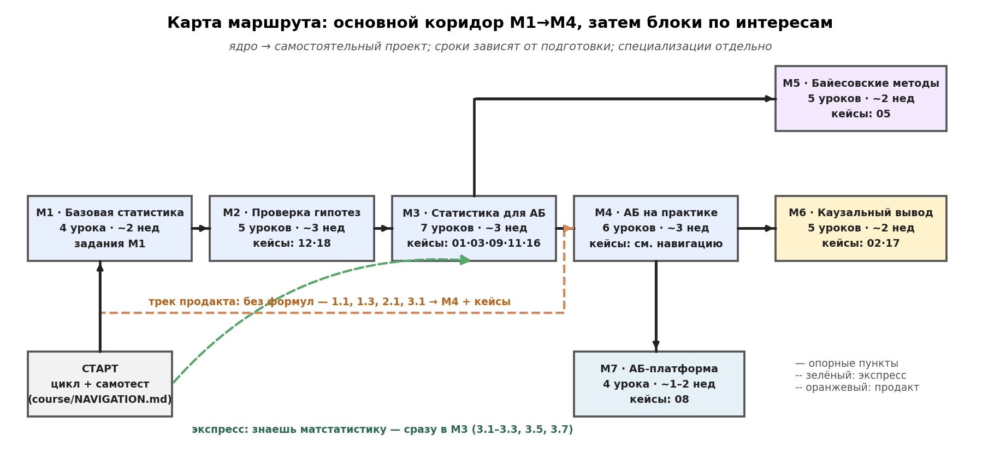

# Статистика и А/Б-тесты

Курс для продуктовых аналитиков: от описания данных до планирования эксперимента и решения о запуске изменения. После основного маршрута можно углубиться в байесовские методы, причинный вывод и устройство платформы экспериментов.

В курсе **36 уроков, 35 практик с готовым кодом и 18 кейсов**, а также самостоятельные задания и итоговый проект на сырых логах. Сквозной пример — сервис доставки «ЕдаДома».

## С чего начать

1. **Разобраться в задаче.** Прочитайте [один эксперимент от вопроса до решения](course/START_HERE.md). Установка Python для чтения не нужна.
2. **Выбрать маршрут.** Откройте [навигацию и самопроверку](course/NAVIGATION.md): там обязательное ядро, маршруты по подготовке и специализации.
3. **Попробовать самостоятельно.** Перед готовым разбором выполните [задание к теме](course/exercises/README.md). Для M1 и M2 в папках `exercises/` модулей есть заготовки Python с пропусками.
4. **Проверить себя на практике.** Прочитайте урок, запустите соответствующий файл из `practice/`, измените условия и объясните результат. Установка описана ниже.
5. **Пройти полный цикл.** Выполните [итоговый проект](course/capstone/README.md): протокол, проверка логов, оценка эффекта и письменное решение.

Если незнакомы обозначения, используйте [словарь](course/GLOSSARY.md); если трудно выбрать следующий урок — [зависимости тем](course/PREREQUISITES.md).



## Модули

| Модуль | Что изучаем | Уроков |
|---|---|---:|
| [M1. Базовая статистика](course/modules/M1/README.md) | Описание данных, распределения, доверительные интервалы, бутстрап | 4 |
| [M2. Проверка гипотез](course/modules/M2/README.md) | p-value, t-тесты, непараметрические методы, множественные сравнения, ANOVA | 5 |
| [M3. Статистика для А/Б](course/modules/M3/README.md) | Размер выборки, единицы анализа, ratio-метрики, CUPED/CUPAC, остановка теста | 7 |
| [M4. А/Б на практике](course/modules/M4/README.md) | Метрики, рандомизация, качество данных, эффекты во времени, решение | 6 |
| [M5. Байесовские методы](course/modules/M5/README.md) | Байесовский вывод, потери, бандиты, иерархические модели | 5 |
| [M6. Причинный вывод](course/modules/M6/README.md) | Допущения, DAG, DiD, matching, RDD, IV, чувствительность | 5 |
| [M7. Платформа экспериментов](course/modules/M7/README.md) | Назначение вариантов, данные, анализ, интерфейс и планирование | 4 |

Обязательное ядро проходит через M1–M4; отдельные углубления можно отложить согласно [маршруту](course/NAVIGATION.md). M5–M7 — специализации. Для начала курса не нужны PyMC и MCMC.

## Где что лежит

```text
course/
  START_HERE.md            Введение: один полный эксперимент
  NAVIGATION.md            Маршруты и самопроверка
  modules/M1/…M7/          Модули с оглавлением README.md
    lesson-*.md           Тексты уроков
    practice/             Готовые исполняемые разборы
    exercises/            Заготовки заданий (M1 и M2)
    images/               Все рисунки модуля
  exercises/              Общая тетрадь заданий и шаблон протокола
  capstone/               Итоговый проект, данные и разбор
  cases/                  Кейсы; иллюстрации в images/
  images/                 Общие иллюстрации курса
  lib/                    Общие вычислительные функции
skills/                   Краткие справочники по рабочим задачам
obsidian-vault/           Версия курса для Obsidian и граф понятий
scripts/                  Проверки, синхронизация и генерация рисунков
tests/                    Проверки расчётов и правил принятия решений
requirements/             Дополнительные наборы зависимостей
docs/                     Инструкции для авторов и история проверок
```

Картинки находятся в папках `images/`, код для их построения — в `practice/` и `scripts/figures/`. Каталоги уроков содержат тексты и оглавления, без отдельных PNG и служебных файлов.

## Запустить первую практику

Проверенная версия — **Python 3.13**. Выполните команды из корня репозитория. Для macOS и Linux:

```sh
python3 -m venv .venv
source .venv/bin/activate
python -m pip install -r requirements.txt
python course/modules/M1/practice/practice_1_1.py
```

На Windows создайте окружение командой `py -3.13 -m venv .venv`, затем используйте `.venv\Scripts\python.exe` вместо `python` в последних двух командах; активация не обязательна.

Практика выводит результаты в терминал и сохраняет рисунки в `course/modules/M1/images/`. У других модулей такая же структура. Примеры с большим числом симуляций или бутстрапом могут работать несколько минут; заданный seed помогает воспроизвести расчёт.

Для практики 5.5 дополнительно установите байесовские зависимости:

```sh
python -m pip install -r requirements/bayes.txt
```

Запуск MCMC требует больше времени и проверки диагностик из урока. Команды для тестов, пересборки всех рисунков и полного прогона практик находятся в [инструкции для авторов](docs/DEVELOPMENT.md).

## Кейсы, справочники и Obsidian

- **[Библиотека кейсов](course/cases/README.md):** сначала условие и вопросы, затем раскрываемый разбор. Исследования и учебные реконструкции помечены отдельно.
- **[Выбор метода оценки эффекта](skills/method-roadmap/SKILL.md):** точка входа в справочники по дизайну, анализу, байесовским методам и причинному выводу. Файлы `SKILL.md` читаются как обычные документы.
- **Obsidian:** откройте папку `obsidian-vault/` как хранилище и начните с «Навигация по курсу». Копии уроков обновляются из `course/`; порядок синхронизации описан [здесь](docs/DEVELOPMENT.md#версия-для-obsidian).
- **[Источники](course/SOURCES.md):** публичные первоисточники и границы их применения. В уроках есть прямые ссылки; локальные конспекты источников не публикуются.

[Журнал доработок](docs/maintenance/COURSE_CHANGES.md) описывает исправления и выполненные проверки. [Исходный аудит](docs/maintenance/COURSE_REVIEW.md) сохранён как история состояния до правок. Длительность маршрутов и понятность материала ещё предстоит проверить на учебной группе.
