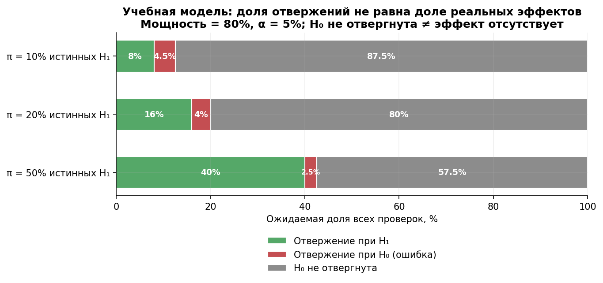

# Библиотека кейсов: как всё это выглядит в бою

18 историй об экспериментах и учебных реконструкций — от Bing и Netflix до Авито. Материалы различаются по источникам: есть первичные исследования, рассказы команд, вторичные пересказы и синтетические задачи. Статус источника и происхождение чисел указаны внутри кейсов. Сначала прочитайте контекст и данные, ответьте на вопросы, затем откройте разбор.

## Как работать с кейсами

1. **После модуля** — решайте кейсы с его меткой (таблица ниже): они проверяют, умеете ли вы применять теорию.
2. **Не подглядывайте в разбор**: сначала письменно ответьте на «Вопросы на закрепление», потом откройте `<details>`.
3. **Ищите связь с уроками**: каждый кейс ссылается на конкретные концепции (SUTVA, MDE, guardrails…) — если ссылка непонятна, это сигнал перечитать урок.
4. В команде — берите один кейс на сессию и спорьте: спор о кейсе учит больше, чем чтение.


*Учебная модель: доля гипотез с эффектом π, мощность 80%, α=5%. Доля значимых результатов не равна ни π, ни доле успешных релизов. Это не сравнительная статистика компаний; расчёт разобран в [кейсе 12](case-12-retests.md).*

## Карта кейсов

### Мировой опыт

| # | Кейс | Компания | Чему учит | Модули |
|---|---|---|---|---|
| [01](case-01-bing-titles.md) | Одна строка кода и +12% выручки | Microsoft Bing | ценность идеи не прогнозируется; OEC; цена бэклога | М3, М4 |
| [02](case-02-lyft-interference.md) | Пользовательский сплит и общий ресурс | Lyft | интерференция; глобальный эффект; явные допущения модели | М4, М6 |
| [03](case-03-airbnb-interleaving.md) | Interleaving для отбора ранжировщиков | Airbnb | чувствительность через дизайн сравнения; скрининг моделей | М3, М4 |
| [04](case-04-booking-culture.md) | Децентрализованные эксперименты в масштабе | Booking.com | платформа, обучение и ответственность владельца | М4, М7 |
| [05](case-05-netflix-artwork.md) | Обложки как постоянный эксперимент | Netflix | contextual bandit; exploration; off-policy оценка | М5 |
| [06](case-06-duolingo-streaks.md) | Стрики, пуши и красная точка +6% DAU | Duolingo | формативные A/B; конфликт OEC; guardrails на «раздражение» | М4 |
| [07](case-07-snapchat-redesign.md) | Редизайн и пределы причинных выводов | Snapchat | staged rollout; guardrails привычки; цена контрфакта | М4, М6 |
| [17](case-17-ebay-paid-search.md) | Платный поиск: атрибуция и инкрементальность | eBay | атрибуция ≠ каузальность; гео-эксперимент; инкрементальность | М6 |
| [18](case-18-red-button.md) | Красная кнопка: что можно заключить из +21% | Performable | мощность; peeking; скепсис к ярким результатам | М2, М3 |

### Российская практика

| # | Кейс | Источник | Чему учит | Модули |
|---|---|---|---|---|
| [08](case-08-avito-platform.md) | От редизайнов без теста до 4000+ экспериментов в год | Авито | культура; build vs buy; экономика платформы | М4, М7 |
| [09](case-09-avito-service-level-mde.md) | Сетап со снижением MDE выручки в 2 раза | Авито | двусторонний рынок; кастомный дизайн; пересчёт силы воздействия | М3, М6 |
| [10](case-10-margin-sutva.md) | Тест на марже: лечение «съедает» контроль | e-commerce | SUTVA через общий склад; switchback/гео-альтернативы | М4, М6 |
| [11](case-11-offline-clusters.md) | Почему нельзя сплитовать по чекам | офлайн-ритейл | кластерные тесты; ICC, design effect; единица рандомизации | М3, М4 |
| [12](case-12-retests.md) | Ретесты: воспроизводимость и вероятность эффекта | практика abba_testing | PPV значимости; base rate; воспроизводимость как дизайн | М2, М4, М5 |
| [13](case-13-share-button.md) | Кнопка «Поделиться»: эффект и единица анализа | ProductDo | spill-over; редефиниция гипотезы (фича vs канал) | М4 |
| [14](case-14-annual-plan-economics.md) | Годовой тариф: сначала экономика, потом тест | No Data No Growth | юнит-экономика до теста; каннибализация; guardrails | М1, М4 |
| [15](case-15-spotify-lyrics.md) | Тексты песен: метрика, экспозиция и механизм | ProductDo, история о Spotify + учебная модель | ITT; общий eligibility; ограничения анализа по кликерам | М4 |
| [16](case-16-3d-models.md) | 3D-модели и несовпадающие результаты повторов | e-commerce | ограничения прокси; совместимость оценок; план репликации | М3, М4 |

## Мини-кейсы на пять минут

Используйте эти сюжеты как вопросы о дизайне и недостающих данных. Исторические оценки относятся к конкретным продуктам и периодам; они не являются универсальными коэффициентами или доказательством причинного механизма.

- **Поле промокода и оформление заказа.** В обзоре KDD 2007 приведён рост конверсии после удаления поля. Снижение напоминаний о скидке — предложенное объяснение, не отдельно рандомизированный механизм. Как проверить механизм и доход после скидок? [Kohavi et al., разделы 2.1 и 2.3](https://ai.stanford.edu/~ronnyk/2007GuideControlledExperiments.pdf).
- **Amazon и Google: задержки.** Исторические примеры связывают добавленную задержку с ухудшением продуктовых метрик. Нельзя превращать локальную оценку в линейное правило «на каждые 100 мс» для любого продукта. Как построить кривую доза–эффект и учесть устройства? [Обзор KDD 2007, раздел 5.1.2](https://ai.stanford.edu/~ronnyk/2007GuideControlledExperiments.pdf).
- **Microsoft Office: шкала оценок.** Переход от Yes/No к пяти звёздам сопровождался резким падением числа ответов. Какие метрики отличат качество статьи, удобство интерфейса и самоотбор отвечающих? [KDD 2007, разделы 2.2–2.3](https://ai.stanford.edu/~ronnyk/2007GuideControlledExperiments.pdf).
- **Amazon: рекомендации в корзине.** Рассказ автора системы описывает эксперимент вопреки ожиданиям руководства, но не публикует полную таблицу результатов. Какие данные нужны для количественной оценки выигрыша? [Greg Linden, 2006](https://glinden.blogspot.com/2006/04/amazon-shopping-cart-recommendations.html).
- **CUPED: прошлое поведение как ковариата.** Размер выигрыша зависит от связи ковариаты с целевой метрикой, покрытия историей и дизайна. Какие условия дадут уменьшение дисперсии вдвое, а когда выигрыша почти не будет? [Deng et al., KDD 2013](https://www.microsoft.com/en-us/research/publication/improving-the-sensitivity-of-online-controlled-experiments-by-utilizing-pre-experiment-data/).
- **Bing: путь от изменения к релизу.** Исследование 21 220 экспериментов сообщает средний цикл 42 дня и раскатку кода, связанного с 33,4% экспериментов. Это показатель процесса выпуска, не оценка доли всех истинных ненулевых эффектов. Как влияют повторные итерации и отбор? [Kevic et al., ICSE 2017](https://exp-platform.com/Documents/2017-05%20ICSE2017_CharacterizingExP.pdf).
- **Microsoft: Safe Velocity.** Controlled rollout добавляет сравнение вариантов внутри этапов постепенного выпуска. Когда кольца развёртывания сами по себе не дают сопоставимого контроля? [ICSE-SEIP 2019](https://www.microsoft.com/en-us/research/publication/safe-velocity-a-practical-guide-to-software-deployment-at-scale-using-controlled-rollout/).
- **Airbnb: SEO.** Ранжирование общей индексируемой страницы затрудняет обычный пользовательский сплит. Какие условия нужны для рыночного дизайна и diff-in-differences, какие spillover останутся? [Airbnb Engineering, 2018](https://medium.com/airbnb-engineering/experimentation-measurement-for-search-engine-optimization-b64136629760).
- **eBay: дизайн маркетплейса.** Кластеризация и ковариаты решают разные задачи: ограничение интерференции и снижение дисперсии. Как сравнить выигрыш с потерей числа независимых единиц? Не переносите коэффициент эффективности одного примера на новый рынок. [eBay Engineering](https://tech.ebayinc.com/research/the-design-of-a-b-tests-in-an-online-marketplace/).
- **DoorDash: switchback.** Рандомизация по региону и времени требует учёта границ воздействия и переноса эффекта между окнами. Как выбрать длину окна, washout и единицу неопределённости? [DoorDash Engineering, 2018](https://careersatdoordash.com/switchback-tests-and-randomized-experimentation-under-network-effects-at-doordash-501e0f5a29a5/).

## Шаблон кейса (добавляйте свои)

```markdown
---
case: NN
title: "Тема и решение, которое предстоит принять"
company: реальная компания либо учебная модель
modules: [М?]
topic: ...
source: "прямая ссылка, автор, дата"
---
# Кейс NN — ...
## Статус источника
Первичный отчёт / рассказ команды / вторичный пересказ / синтетическая модель.
Отдельно: что подтверждено источником и что добавлено для обучения.
## Контекст и вопрос команды
## Данные и дизайн
Популяция, единица рандомизации, метрика и горизонт; n, эффект, SE/CI;
правило остановки и допущения. Если данных нет — явно указать это.
## Вопросы для самостоятельного решения
1. ...
<details>
<summary>Разбор, расчёты и ответы</summary>
## Какие выводы допустимы
## Альтернативные объяснения и недостающие данные
## Связь с уроками курса
</details>
## Источники
```

Реальный кейс требует проверяемого источника для каждого важного числа. Синтетический кейс допустим, если явно так обозначен и воспроизводим; его числа нельзя приписывать компании. Отсутствие исходных данных может быть предметом задания: в таком случае ответ должен оценивать границы вывода и запрашивать данные, а не угадывать «правильный» причинный диагноз.
