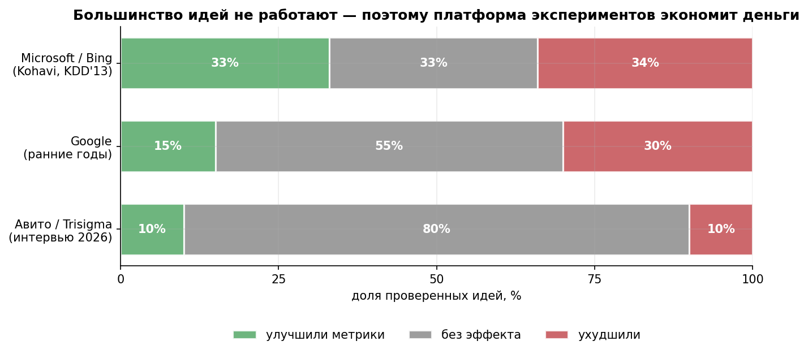

# Библиотека кейсов: как всё это выглядит в бою

18 реальных кейсов A/B-тестов и экспериментов — от Bing и Netflix до Авито и Ozon. Кейсы не заменяют модули: они скрепляют их. Каждый кейс — короткая история «контекст → дизайн → что произошло → почему через призму курса» с вопросами для самопроверки.

## Как работать с кейсами

1. **После модуля** — решайте кейсы с его меткой (таблица ниже): они проверяют, умеете ли вы применять теорию.
2. **Не подглядывайте в разбор**: сначала письменно ответьте на «Вопросы на закрепление», потом откройте `<details>`.
3. **Ищите связь с уроками**: каждый кейс ссылается на конкретные концепции (SUTVA, MDE, guardrails…) — если ссылка непонятна, это сигнал перечитать урок.
4. В команде — берите один кейс на сессию и спорьте: спор о кейсе учит больше, чем чтение.


*Большинство идей не улучшают метрики — поэтому дешёвый тест лучше уверенного мнения. Данные: Kohavi KDD'13; интервью Booking; Trisigma.*

## Карта кейсов

### Мировой опыт

| # | Кейс | Компания | Чему учит | Модули |
|---|---|---|---|---|
| [01](case-01-bing-titles.md) | Одна строка кода и +12% выручки | Microsoft Bing | ценность идеи не прогнозируется; OEC; цена бэклога | М3, М4 |
| [02](case-02-lyft-interference.md) | Юзер-сплит завысил бы эффект в 6 раз | Lyft | SUTVA в маркетплейсе; GATE vs ATE; симуляция дизайна | М4, М6 |
| [03](case-03-airbnb-interleaving.md) | Interleaving: эксперименты в 50 раз быстрее | Airbnb | чувствительность через дизайн сравнения; скрининг моделей | М3, М4 |
| [04](case-04-booking-culture.md) | 1000+ экспериментов одновременно | Booking.com | демократизация; платформа = доверие + дешевизна | М4, М7 |
| [05](case-05-netflix-artwork.md) | Обложки как постоянный эксперимент | Netflix | contextual bandit; exploration; off-policy оценка | М5 |
| [06](case-06-duolingo-streaks.md) | Стрики, пуши и красная точка +6% DAU | Duolingo | формативные A/B; конфликт OEC; guardrails на «раздражение» | М4 |
| [07](case-07-snapchat-redesign.md) | Редизайн без теста: −$1,3 млрд за день | Snapchat | staged rollout; guardrails привычки; цена контрфакта | М4, М6 |
| [17](case-17-ebay-paid-search.md) | Выключили рекламу в 68 регионах — и ничего | eBay | атрибуция ≠ каузальность; гео-эксперимент; инкрементальность | М6 |
| [18](case-18-red-button.md) | Красная кнопка: +21%, которых могло не быть | Performable | мощность; peeking; скепсис к ярким результатам | М2, М3 |

### Российская практика

| # | Кейс | Источник | Чему учит | Модули |
|---|---|---|---|---|
| [08](case-08-avito-platform.md) | От редизайнов без теста до 4000+ экспериментов в год | Авито | культура; build vs buy; экономика платформы | М4, М7 |
| [09](case-09-avito-service-level-mde.md) | Сетап со снижением MDE выручки в 2 раза | Авито | двусторонний рынок; кастомный дизайн; пересчёт силы воздействия | М3, М6 |
| [10](case-10-margin-sutva.md) | Тест на марже: лечение «съедает» контроль | e-commerce | SUTVA через общий склад; switchback/гео-альтернативы | М4, М6 |
| [11](case-11-offline-clusters.md) | Почему нельзя сплитовать по чекам | офлайн-ритейл | кластерные тесты; ICC, design effect; единица рандомизации | М3, М4 |
| [12](case-12-retests.md) | Ретесты: почему «зелёный» стал серым | практика abba_testing | PPV значимости; base rate; воспроизводимость как дизайн | М2, М4, М5 |
| [13](case-13-share-button.md) | Кнопка «Поделиться»: тест, который не мог сработать | ProductDo | spill-over; редефиниция гипотезы (фича vs канал) | М4 |
| [14](case-14-annual-plan-economics.md) | Годовой тариф: сначала экономика, потом тест | No Data No Growth | юнит-экономика до теста; каннибализация; guardrails | М1, М4 |
| [15](case-15-spotify-lyrics.md) | Текст песни: кейс в четыре раунда | Spotify (разбор ProductDo) | выбор целевой метрики; аудитория по экспозиции; проверка механики | М4 |
| [16](case-16-3d-models.md) | 3D-модели: странный результат и false positive | e-commerce | прокси-метрика при нехватке мощности; перезапуск | М3, М4 |

## Мини-кейсы на пять минут

Короткие сюжеты для разминки и вводных лекций (по одному абзацу, с первоисточником):

- **Doctor FootCare (KDD'07)**: «красивый» редизайн всего сайта −90% выручки; удаление поля промокода из чекаута +6,5% конверсии (у людей исчезало напоминание «сходи поищи скидку»). [Kohavi et al., KDD 2007](http://ai.stanford.edu/~ronnyk/2007GuideControlledExperiments.pdf)
- **Amazon, скорость**: −1% продаж на каждые +100 мс задержки; Google: +500 мс → −20% трафика (эксперименты 2006). Латентность — метрика-мультипликатор. (там же)
- **Microsoft Office, 5 звёзд вместо Да/Нет**: число оценок упало на порядок, распределение ушло в полюса — смена шкалы = потеря данных. (там же)
- **Amazon, корзина**: рекомендации в корзине выиграли тест так широко, что VP marketing смирился, хотя был «dead-set against». Listen to your customers, not your HiPPO. [Linden, 2006](https://glinden.blogspot.com/2006/04/amazon-shopping-cart-recommendations.html)
- **Bing, CUPED**: −50% дисперсии ключевых метрик → эксперименты вдвое быстрее; сотни млн $ годового эффекта платформы. [KDD 2013](https://exp-platform.com/large-scale/)
- **Bing, конвейер**: 21 220 экспериментов проанализировано ретроспективно: цикл ~42 дня, до всех пользователей доехала ~⅓ кода. [ICSE 2017](https://exp-platform.com/Documents/2017-05%20ICSE2017_CharacterizingExP.pdf)
- **Microsoft Office, Safe Velocity**: постепенный выкат как рандомизированный эксперимент: случайный отбор на каждом «кольце» + guardrails = деплой и тест одновременно. [ICSE-SEIP 2019](https://www.microsoft.com/en-us/research/publication/safe-velocity-a-practical-guide-to-software-deployment-at-scale-using-controlled-rollout/)
- **Airbnb, SEO**: юзер-сплит невозможен (поисковик ранжирует страницу для всего рынка) — гео-рынки + diff-in-differences. [Airbnb Eng, 2018](https://medium.com/airbnb-engineering/experimentation-measurement-for-search-engine-optimization-b64136629760)
- **eBay, дизайн в маркетплейсе**: кластеризация по ~10 000 категориям + ковариаты пре-периода → −10× стандартное отклонение оценки. [eBay Innovation, 2018](https://innovation.ebayinc.com/stories/the-design-of-a-b-tests-in-an-online-marketplace)
- **DoorDash, switchback**: рандомизация по (регион × время) для алгоритмов диспетчеризации; методология расчёта окон и carryover. [DoorDash Eng, 2018](https://careersatdoordash.com/switchback-tests-and-randomized-experimentation-under-network-effects-at-doordash-501e0f5a29a5/)

## Шаблон кейса (добавляйте свои)

```markdown
---
case: NN
title: "..."
company: ...
modules: [М?]
topic: ...
source: "..."
---
# Кейс NN — ...
> **Суть.** (1–2 предложения с выводом)
## Контекст
## Гипотеза и дизайн
## Что произошло
## Почему: разбор через курс
## Чему учит
## Вопросы на закрепление  (+ <details> с ответами)
## Источники
```

Требования к кейсу: реальная компания/практика, проверяемый первоисточник, числа, связь с конкретными уроками курса. Кейсы без чисел («стало лучше») не принимаются.
