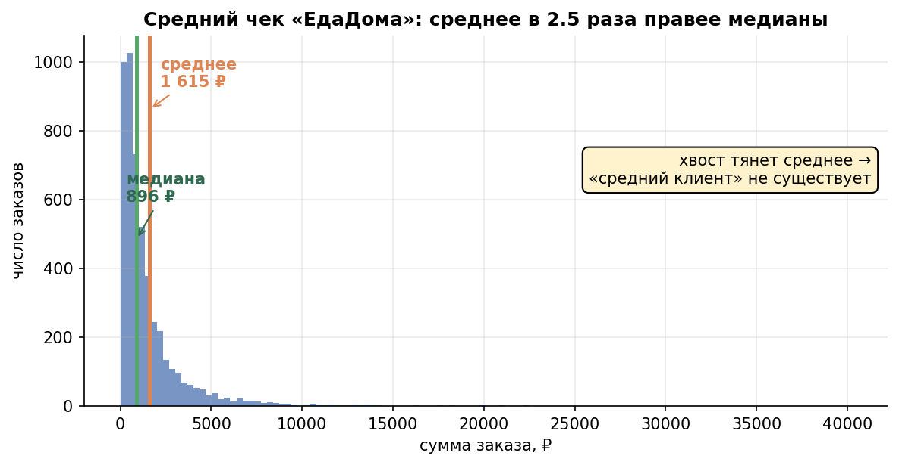
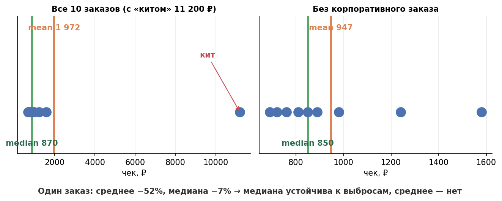
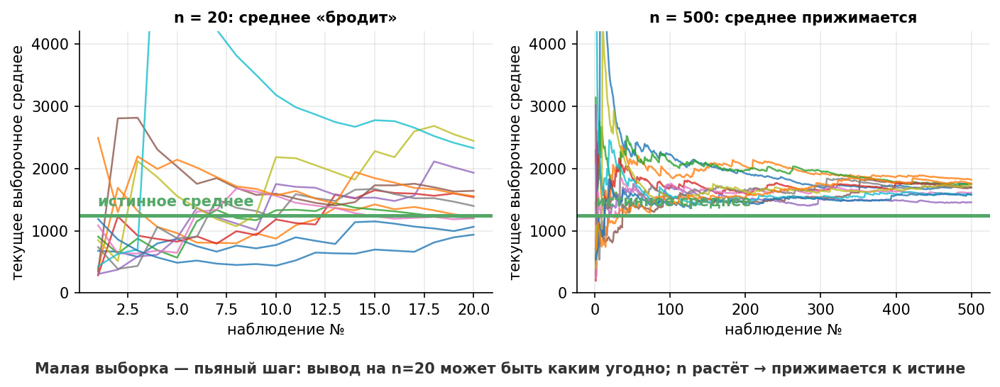

# Урок 1.1 — Данные и описательные статистики

**Цель урока:** после урока вы сможете по любому датасету метрик «ЕдаДома» выбрать правильную описательную статистику (среднее, медиана, квантили, IQR), объяснить, когда и почему среднее врёт, и не делать выводов на малых выборках.

## Зачем это аналитику

Каждое утро продакт «ЕдаДома» открывает дашборд: средний чек 1 240 ₽, конверсия в первый заказ 12%, среднее время доставки 34 минуты, 2,1 заказа на юзера в месяц. И каждый день кто-то принимает решение, глядя на эти числа. Проблема в том, что «средний чек 1 240 ₽» может означать совершенно разные продукты: у одного и того же среднего медиана может быть 800 ₽ (типичный заказ) или 1 150 ₽ — а разница между ними это, по сути, «сколько у вас китов». В ритейле (кейс X5) среднее и медиана чека различались как 488 ₽ против 335 ₽ — почти в полтора раза, и это не экзотика, а норма для денег.

Второй сценарий: вы смотрите конверсию в первый заказ по сегменту «Казань, iOS, пришёл с TikTok» — там 40 юзеров, конверсия «просела» с 12% до 5%, вы пишете алерт. А потом оказывается, что 40 юзеров — это шум: при таком объёме конверсия скачет на ±6 п.п. просто от случайности. Это закон малых чисел: маленькая выборка ведёт себя как пьяный — её показания нестабильны, и без понимания этого аналитик генерирует ложные сигналы.

Описательные статистики — это не «школьная база перед статистикой», а рабочий инструмент каждого дня: они отвечают, что за данные у вас в руках, прежде чем вы примените любой тест. Правило курса: **не верь одному числу — посмотри на распределение** (гистограмма + боксплот), и только потом делай вывод. В этом уроке мы сделаем это руками на выручке «ЕдаДома».

## Теория

### Типы данных и шкалы

Прежде чем считать любую статистику — определите, что перед вами. От типа метрики зависит всё: какое распределение ожидать (урок 1.2), какой тест можно применять (модуль 2), как считать неопределённость.

Классические **шкалы измерения** (по Стивенсу):

- **Номинальная** (категории без порядка): город, ресторан, платформа. Можно: частоты, моду. Нельзя: «средний город».
- **Порядковая**: оценка курьера 1–5, тариф «базовый/плюс/премиум». Можно: медиану, перцентили. Нельзя: «средняя оценка 4,2 значит, что типичная оценка 4,2» — строго говоря, разница между 4 и 5 не обязана равняться разнице между 3 и 4.
- **Интервальная и относительная** (числа): сумма заказа в ₽, время доставки в минутах, число заказов. Можно всё: среднее, дисперсию и т.д.

Продуктовая типология (она ближе к жизни — из [Симулятор 7] и [X5 ур.4]):

| Тип | Пример в «ЕдаДома» | Значения |
|---|---|---|
| Бинарный | конверсия в первый заказ | 0 / 1 |
| Счётный (дискретный) | число заказов на юзера за месяц | 0, 1, 2, … |
| Непрерывный | сумма заказа, время доставки | 643,17 ₽ |
| Ratio-метрика | средний чек = Σ выручка / Σ заказов | производная, не «среднее средних» |

Запомните строку про ratio-метрику — к ней вернёмся в подводных камнях: средний чек компании — это НЕ среднее чеков по юзерам (которое вы получите через `groupby().mean()`), а отношение двух сумм.

### Меры центра: среднее, медиана, мода

**Среднее арифметическое** (mean):

$$\bar{x} = \frac{1}{n}\sum_{i=1}^{n} x_i$$

**Медиана** — значение, которое делит упорядоченную выборку пополам: 50% наблюдений меньше, 50% больше. Для чётного $n$ — среднее двух серединных. Медиана — это 50-й перцентиль.

**Мода** — самое частое значение: для категорий («чаще всего заказывают из „Тануки“»), для дискретных данных (мода числа заказов на юзера — 0 или 1), для непрерывных почти не используется.

Мини-пример, считаемый в голове. Чеки 5 заказов: 690, 720, 760, 810, 5 000 ₽.
- Среднее: $(690+720+760+810+5000)/5 = 7980/5 = 1596$ ₽.
- Медиана: 760 ₽.

Одна «корпоративная» закупка на 5 000 ₽ утроила «типичный чек». Среднее чувствительно к каждому наблюдению (это сумма, делённая на $n$), медиана — только к **порядку** значений: подними последний чек с 5 000 до 500 000 ₽, среднее улетит в 102 000 ₽, медиана останется 760 ₽.

Интуиция: **среднее отвечает про сумму денег, медиана — про типичного человека.** ARPU (выручка на юзера) обязан быть средним — сумма делится на количество, и киты там — реальные деньги. «Типичный чек» — медианой. Ни одна из них не «правильная»: они отвечают на разные вопросы.

Ещё есть **усечённое среднее** (trimmed mean): отбрасываем $k$% крайних значений с обеих сторон и считаем среднее середины. Промежуточный вариант, любят в спорте (оценки судей) и при зашумлённых данных.

*Рис. 1. Хвост тянет среднее вправо: «среднего клиента» не существует. Среднее отвечает про деньги, медиана — про типичного человека.*

### Квантили, перцентили и IQR

**Квантиль уровня $p$** (доля $p \in [0,1]$) — значение, ниже которого лежит примерно $p$·100% наблюдений. Перцентиль — то же самое в процентах: P25, P50 (медиана), P90, P95, P99.

$$Q(p):\quad P(X \le Q(p)) \approx p$$

В продукте перцентили — это язык SLA и хвостов: «95% заказов доезжают за 58 минут» честнее, чем «в среднем 34 минуты», потому что пользователь не испытывает среднюю доставку — он испытывает свою.

**Межквартильный размах** (IQR, interquartile range) — «толщина» середины распределения:

$$IQR = Q_{0.75} - Q_{0.25}$$

Классическое правило поиска выбросов (Тьюки): всё, что выходит за

$$[Q_{0.25} - 1.5 \cdot IQR,\ \ Q_{0.75} + 1.5 \cdot IQR],$$

— кандидат в выбросы. На боксплоте усы как раз заканчиваются на последнем значении внутри забора, а точки снаружи рисуются отдельно.

Мини-пример. Чеки: 690, 720, 760, 810, 850, 890, 980, 1240, 1580, 11 200 (10 заказов, один — корпоративный).
- Q1 ≈ 772,5 ₽, Q3 ≈ 1175 ₽ (линейная интерполяция, как в numpy/pandas).
- $IQR \approx 402{,}5$; верхний забор $1175 + 1{,}5 \cdot 402{,}5 = 1778{,}75$ ₽.
- 1580 ₽ — внутри забора, нормальный большой заказ. 11 200 ₽ — выброс по формальному правилу. Дальше решает контекст: это баг оплаты или реальный корпоративный клиент?

### Меры разброса: дисперсия, STD, CV

**Дисперсия** (variance) — средний квадрат отклонения от среднего:

$$s^2 = \frac{1}{n-1}\sum_{i=1}^{n}(x_i - \bar{x})^2$$

**Стандартное отклонение** (STD) — $\sqrt{s^2}$, возвращается в исходные единицы (₽, минуты), поэтому на практике говорят именно о ней. Зачем $n-1$ (поправка Бесселя): мы уже «потратили» данные на оценку $\bar{x}$, и с делением на $n$ дисперсия была бы систематически занижена. При $n > 100$ разница неощутима, но в `pandas.std()` по умолчанию `ddof=1`, а в `numpy.std()` — `ddof=0`: не перепутайте при сверке чисел.

Интуиция: дисперсия — это «характер» метрики ([X5 ур.2]). Две доставки со средним 34 минуты — одна со STD 3 минуты (всё предсказуемо), другая со STD 15 (то 15, то 70) — это два разных продукта. В АБ-тестах дисперсия метрики напрямую определяет, сколько наблюдений вам понадобится: чем шире разброс, тем больше выборка, чтобы отличить сигнал от шума (формулы — в уроке 3.1).

Для скошенных денег IQR устойчивее STD: один заказ на 200 000 ₽ раздувает и среднее, и дисперсию, а IQR почти не замечает.

**Коэффициент вариации** $CV = s/\bar{x}$ — разброс «в долях среднего», безразмерный: удобно сравнивать метрики между собой (у числа заказов на юзера CV ≈ 1+, у времени доставки ≈ 0,2 — вторая метрика куда стабильнее).

### Когда среднее врёт: скошенность, выбросы, киты

Распределение симметрично → среднее ≈ медиана, можно не думать. Распределение **скошено вправо** (правый хвост длинный) → среднее > медианы, и разрыв растёт с тяжестью хвоста. Деньги в продуктах почти всегда скошены вправо: чек, LTV, выручка на юзера — из-за «китов» (корпоративные заказы, оптовые закупки, синие киты-геймеры).

Формальный язык: **скошенность** (skewness) — третий стандартизированный момент; на глаз — гистограмма с горбом слева и длинным хвостом направо. Практический тест без графиков: если $\bar{x}$ заметно больше медианы (скажем, на треть и более) — у вас скошенные данные, и «средний чек 1 240 ₽» не описывает ничей реальный заказ. Эффект «Илон Маск заходит в Пятёрочку» ([X5 ур.2]): средний доход посетителей магазина не изменился по сути, но миллиардер в выборке меняет среднее кардинально, а медиану — нет.

Ключевой кейс урока (и практики): **доля выручки топ-1% юзеров**. В логнормальных данных типа чека топ-1% легко держит 15–30% всей выручки. Удалите этот 1% — и средняя выручка на юзера просядет на эти же 15–30%, а медиана почти не сдвинется. Это не повод удалять китов из бизнеса — это повод понимать, кем двигается ваша метрика, и при АБ-тестах защищать оценку от их случайного перекоса (тема винзоризации — урок 3.4).

Важно: **не «медиана лучше среднего», а «вопрос определяет выбор статистики»**:
- «Сколько денег приносит юзер в среднем?» → среднее (= ARPU, сумма/число юзеров).
- «Сколько платит типичный юзер?» → медиана.
- «Насколько нестабильна метрика?» → STD/IQR/CV.
- «Какой объём хвоста?» → P90/P95/P99.

*Рис. 2. Один корпоративный заказ: среднее −52%, медиана −7%. Медиана устойчива к выбросам, среднее — нет.*

### Закон малых чисел

Термин Канемана: люди видят закономерности и «устойчивые уровни» там, где чистый шум малой выборки. Статистическая суть — вариабельность оценки падает как $1/\sqrt{n}$ (правило корня из $n$; формально это стандартная ошибка $\sigma/\sqrt{n}$ — её очередь в уроке 1.3).

Считаем в голове:
- Честная монета, 10 бросков. Вероятность получить 7+ орлов: $(120+45+10+1)/1024 = 176/1024 \approx 17\%$. Каждый шестой «тест» покажет «монета кривая».
- Конверсия 12%, сегмент из 25 юзеров. STD конверсии как доли: $\sqrt{0{,}12 \cdot 0{,}88 / 25} = \sqrt{0{,}0042} \approx 0{,}065$, т.е. ±6,5 п.п. — сегментная конверсия гуляет от 5% до 19% просто так. Вывод «конверсия в Казани просела» на 25 юзерах — не вывод.
- Тот же эффект в деньгах: средний чек сегмента из 15 заказов при STD чека 500 ₽ скачет на $\pm 500/\sqrt{15} \approx \pm 130$ ₽ (одно стандартное отклонение!) без всяких изменений продукта.

В [X5 ур.2] это показано симуляцией: при 10 бросках доля орлов гуляет от 0 до 100%, при 10 000 — от 49 до 51%. Мораль: рядом с каждым «средним по сегменту» всегда печатайте $n$, и не стройте выводы на группах < 30 наблюдений — а лучше всего оцените «шумовую полку» через $\sigma/\sqrt{n}$.

*Рис. 3. Траектории выборочного среднего: при n=20 «пьяный шаг» — вывод может быть каким угодно; при n=500 прижимается к истине.*

### Сводные таблицы

Инструмент первого взгляда в pandas: `df.groupby('city')['aov'].describe()` или `df.pivot_table(index='city', columns='platform', values='aov', aggfunc=['mean','median','count'])`. Сводная таблица — это описательные статистики, разложенные по сегментам: сразу видно и уровень, и разброс, и объём каждой ячейки.

Три правила сводных:
1. Всегда включайте `count` — иначе не увидите сегмент из 12 человек с «космической» конверсией.
2. Кладите рядом `mean` и `median` — их расхождение внутри сегмента показывает китов даже без гистограммы.
3. Помните, что `aggfunc='mean'` по юзерским чекам ≠ средний чек компании (ratio-метрика; см. подводный камень №3).

## Разбор на данных

Мини-выгрузка «ЕдаДома»: 10 заказов одного дня (упрощённая таблица для ручного счёта).

| # | user_id | город | сегмент | чек, ₽ |
|---|---------|-------|---------|--------|
| 1 | u1 | Москва | розница | 690 |
| 2 | u2 | Москва | розница | 720 |
| 3 | u3 | Казань | розница | 760 |
| 4 | u4 | Казань | розница | 810 |
| 5 | u5 | Москва | розница | 850 |
| 6 | u6 | Москва | розница | 890 |
| 7 | u7 | Казань | b2b | 980 |
| 8 | u8 | Москва | b2b | 1240 |
| 9 | u9 | Казань | b2b | 1580 |
| 10 | u10 | Москва | b2b (кит) | 11200 |

Шаг 1. Упорядочим чеки: 690, 720, 760, 810, 850, 890, 980, 1240, 1580, 11200.

Шаг 2. Меры центра:
- Сумма = 19 720 ₽ → среднее $\bar{x} = 1972$ ₽.
- Медиана = (850 + 890)/2 = **870 ₽**.
- Среднее больше медианы в 2,3 раза → сильная правая скошенность, есть кит.

Шаг 3. Квантили и IQR: $Q_1 \approx 772{,}5$, $Q_3 \approx 1175$, $IQR \approx 402{,}5$, забор Тьюки сверху $1778{,}75$ ₽ → выброс: 11 200 ₽ (заказ u10).

Шаг 4. Убираем кита (остаётся 9 заказов, сумма 8 520 ₽):
- Среднее: $8520/9 \approx 947$ ₽ — упало на 52%.
- Медиана: 5-е из 9 значений = 810 ₽ — сдвинулась на 7%.
- Вывод: **среднее держится на хвосте, медиана — на середине**. Один заказ из десяти (10% наблюдений) двигал среднее больше чем вдвое.

Шаг 5. Сводная по сегментам (ручная):

| сегмент | n | сумма, ₽ | mean | median |
|---|---|---|---|---|
| розница | 6 | 4720 | 787 | 805 |
| b2b | 4 | 15000 | 3750 | 1410 |

«Средний чек b2b в 4,8 раза выше» — но в b2b всего 4 заказа, и половина суммы — один заказ. Закон малых чисел: разброс среднего при STD ≈ 4 500 ₽ и n = 4 — это $\pm 2250$ ₽ только от шума. Так выглядит типичная ловушка дашборда.

Шаг 6. А правильно ли мы вообще считали «средний чек»? Средний чек по этим 10 заказам как **ratio-метрика** = Σ выручка / Σ заказов = 19 720/10 = 1972 ₽ — здесь совпало со средним, потому что у нас одна строка = один заказ. Но стоит агрегировать по юзерам (`groupby('user_id')`) и усреднить их личные средние чеки — получите другое число, не равное среднему чеку компании. Почему — в подводных камнях.

## Подводные камни

1. **«Средний чек вырос на 9%» как новость о типичном пользователе.** Так делают: смотрят только mean на скошенных деньгах и рассказывают про «типичного клиента». Чем грозит: кит-корпоративный заказ или тянущаяся серия больших корзин двигает mean, а поведение основной массы не меняется; решения принимаются о людях, которых в метрике нет. Как правильно: рядом с mean всегда медиана и P90; если mean/median > ~1,3 — сначала объясни хвост, потом делай выводы.
2. **Молчаливое удаление «выбросов» из выручки.** Так делают: `df[df.aov < df.aov.quantile(0.99)]` «почистить перед отчётом» — без вопроса, кто эти люди. Чем грозит: вырезают b2b-сегмент, который может давать четверть выручки; отчёт красиво, бизнес решения принимает по вымышленному продукту. Как правильно: выброс — это гипотеза о ошибке данных (бот, баг, тестовый заказ), её надо проверить; для чувствительности тестов есть винзоризация с фиксированными правилами до запуска (урок 3.4), а деньги бизнесу показывают по сырым данным.
3. **Средний чек через `groupby('user').mean()` (среднее средних).** Так делают: считают личные средние чеки юзеров и усредняют. Чем грозит: юзер с 1 заказом на 5000 ₽ весит столько же, сколько юзер с 200 заказами; метрика не сонаправлена с деньгами — можно «улучшить» её, теряя выручку (разбор — [Симулятор 12], [koch-kir кластерные]). Как правильно: средний чек = `df.revenue.sum() / df.orders.sum()`, а для статзначимости — дельта-метод/линеаризация/бутстреп по юзерам (урок 3.3).
4. **Выводы по сегменту из 20–40 наблюдений.** Так делают: срез «Тула + Android + новая аудитория» → «конверсия упала вдвое, откатываем кампанию». Чем грозит: закон малых чисел; шумовая полка ±6 п.п. на 25 юзерах — «падение» на 4 п.п. это норма; команда тушит ложные пожары и пропускает реальные. Как правильно: рядом с долей/средним печатать n и шум $\sigma/\sqrt{n}$; для решений — зафиксированные заранее сегменты с достаточным объёмом или накопление данных.
5. **Нули в выручке юзеров трактуют как выбросы и чистят.** Так делают: месячная выручка юзеров сильно скошена, половина нулей (не заказывали) — «удалим для красоты». Чем грозит: ноль — это самый частый и самый важный факт продуктовых данных (неактивность); удалив, смещаете и среднее, и медиану, и размер базы. Как правильно: нули — легитимные значения ([Симулятор 8]); анализируйте активных и неактивных отдельно или используйте метрики «выручка на юзера» с нулями как есть.
6. **Сверка расчётов падает из-за ddof.** Так делают: `np.std(x)` в одном скрипте, `pd.Series.std(x)` в другом, получают 499 против 500 ₽ и ищут «баг в данных». Чем грозит: часы отладки, недоверие к цифрам. Как правильно: помните `numpy → ddof=0`, `pandas → ddof=1`; фиксируйте в коде явно (`np.std(x, ddof=1)`).
7. **Одно число вместо распределения.** Так делают: дашборд из сплошных mean, без единой гистограммы. Чем грозит: все ловушки выше незаметны — у среднего нет «лица». Как правильно: к любой новой метрике сразу строить гистограмму (для денег — log-scale) и боксплот; в pandas — `describe()` как минимальный джентльменский набор. Культура курса: не верь — проверь графиком.

## Практика

Файл `practice_1_1.py` (percent-формат, открывается в VS Code/Jupyter как ноутбук, запускается и как скрипт: `python3 practice_1_1.py`).

Что делаем:
1. **Генерируем месячную выручку 5 000 юзеров «ЕдаДома»** из логнормального распределения (`np.random.default_rng(2026)`): медиана ~900 ₽, тяжёлый правый хвост. Это правдоподобная модель выручки активных юзеров (кто и как порождает такие хвосты — урок 1.2).
2. **Считаем описательные**: mean, median, std, min, квантили P25–P99, skewness, `describe()`. Смотрим на отношение mean/median.
3. **Убираем топ-1% юзеров по выручке** и пересчитываем: сводная таблица «до/после» — на сколько процентов упали mean и median, какая доля выручки жила в этом 1%.
4. **Строим графики**: гистограмма выручки в линейной и логарифмической шкале (одна и та же данных — два разных мира), боксплот «до/после удаления топ-1%» с забором Тьюки.
5. **Закон малых чисел в бою**: 2 000 раз сэмплируем группы по 10/50/500 юзеров и смотрим разброс их средней выручки — видим правило $1/\sqrt{n}$ своими глазами.
6. **Сводная таблица** по трём городам: mean/median/count рядом, ищем сегмент, где вывод делать нельзя.

Что должны увидеть/осознать:
- Mean/median ≈ 2 360/920 в исходных данных (ratio ≈ 2,6, skew ≈ 10) → после удаления топ-1% (порог P99 ≈ 24 400 ₽) mean падает на ~17%, median — на ~1,5%. Среднее живёт в хвосте: 1% наблюдений держит ~18% выручки.
- В линейной шкале гистограмма — «одна палка и пустота»; в log-scale проявляется форма распределения. Деньги всегда смотри в log.
- На боксплоте «до» — рой точек за верхним усом; формальный критерий Тьюки помечает китов, но не говорит, что с ними делать.
- Разброс среднего по группам из 10 юзеров чудовищен (плюс-минус сотни рублей), из 500 — уже узкий коридор. Это и есть шумовая полка, с которой вы обязаны сравнивать любое «изменение» метрики.
- В сводной по городам самый маленький город даёт самый «интересный» эффект — потому что он самый шумный.

## Домашнее задание

**Задача 1.** Чеки за смену: 690, 720, 760, 810, 850, 890, 980, 1240, 1580, 11200 ₽. Посчитайте среднее и медиану. Хозяин заведения говорит: «Типичный заказ — почти две тысячи». Врёт ли он?

Ответ

Среднее = 19 720/10 = 1 972 ₽, медиана = 870 ₽. Он цитирует среднее; типичный (медианный) заказ — 870 ₽. Среднее держит один заказ на 11 200 ₽. Формально не врёт, по сути — вводит в заблуждение.

**Задача 2.** В выборке из задачи 1 найдите выбросы по правилу Тьюки ($Q_3 + 1{,}5 \cdot IQR$). Является ли 1580 ₽ выбросом?

Ответ

$Q_1 \approx 772{,}5$, $Q_3 \approx 1175$, $IQR \approx 402{,}5$, верхний забор ≈ 1 778,75 ₽. Выброс — только 11 200 ₽; 1580 ₽ внутри забора. Правило Тьюки не «убивает» все большие значения, а отделяет экстремальные.

**Задача 3.** Продакт смотрит сегмент из 25 новых юзеров: конверсия в первый заказ 8% при платформенной 12%. «Просела вдвое с лишним, отключаем канал». Обоснуйте контраргумент числом.

Ответ

Шумовая полка доли: $\sqrt{0{,}12 \cdot 0{,}88/25} \approx 0{,}065$ → одно стандартное отклонение ±6,5 п.п. Наблюдаемые 8% отличаются от 12% меньше чем на одно σ — это обычный шум. Нужно больше данных или накопительный мониторинг канала, а не отключение.

**Задача 4.** Монету подбросили 10 раз, выпало 7 орлов. Владелец «ЕдаДома» хочет менять поставщика монет для розыгрышей. Какова вероятность такого или более сильного события у честной монеты?

Ответ

$P(\ge 7 \text{ орлов из 10}) = (C_{10}^7 + C_{10}^8 + C_{10}^9 + C_{10}^{10})/2^{10} = (120+45+10+1)/1024 \approx 17\%$. Каждый шестой раз — менять поставщика не нужно.

**Задача 5.** Аналитик посчитал «средний чек» двумя способами: (а) среднее по 10 чекам из задачи 1; (б) среднее личных средних чеков трёх юзеров: u1 сделал 1 заказ на 11200 ₽, u2 — 9 заказов на 8 000 ₽ (среднее 889), u3 — 90 заказов на 72 000 ₽ (среднее 800). Почему ответы разные и какой из них «средний чек компании»?

Ответ

(а) 1 972 ₽; (б) (11200 + 889 + 800)/3 ≈ 4 296 ₽. Способ (б) даёт каждому юзеру равный вес: u1 с единственным заказом тянет метрику вверх, хотя его вклад в выручку — 12%. Средний чек компании — ratio-метрика: Σ выручка / Σ заказов = 91 600/100 = 916 ₽. Среднее средних отвечает на другой вопрос («средний чек среднего юзера») и для денег практически всегда вреден.

## Шпаргалка

1. Тип метрики определяет метод: бинарная / счётная / непрерывная / ratio — сначала определите, потом считайте.
2. Среднее = про деньги и суммы (ARPU); медиана = про типичного юзера; мода = про категории.
3. mean/median > ~1,3 на деньгах = правая скошенность, есть киты — объясните хвост до выводов.
4. IQR = P75 − P25; забор Тьюки: $Q_3 + 1{,}5 \cdot IQR$ — формальный детектор выбросов, но не приговор.
5. STD — разброс в исходных единицах; дисперсия — «характер» метрики, она определит размер выборки теста; `numpy ddof=0`, `pandas ddof=1`.
6. Закон малых чисел: шум оценки $\sim \sigma/\sqrt{n}$; у малых сегментов чудовищная вариабельность — рядом с любым срезом печатайте n.
7. Нули в выручке юзеров — не выбросы, это факты о неактивности.
8. Средний чек компании = Σ выручка / Σ заказов (ratio), а не среднее средних по юзерам.
9. Деньги смотрите в log-scale: линейная гистограмма логнормалы прячет форму.
10. Минимальный набор перед любым выводом: `describe()` + гистограмма + боксплот. Не верь — проверь графиком.

## Источники

- [Симулятор 1, 1.1] — случайные величины, среднее/дисперсия/σ, выборка и статистика как оценка (лекция + ноутбук «Основы статистики»).
- [X5 ур.2] — блоки «Среднее, убитое хвостом» (488 ₽ vs 335 ₽, «Илон Маск в Пятёрочке») и «Закон малых чисел» (симуляция 30 серий бросков).
- [Симулятор 6] — выбросы: как фильтрация снижает дисперсию и чем это опасно (осторожно с «большими платежами»).
- [Симулятор 7–8] — типы метрик (бинарные/дискретные/непрерывные), нули в выручке — не выбросы.
- [Лагутин гл.1–2] — частоты и гистограммы, назначение описательной статистики, случайные величины (наглядно, без води).
- [Брюс гл.1] — оценки положения (mean/median/trimmed), разброса (STD/IQR/MAD), перцентили и боксплоты.
- [stats_for_science] — ликбез-2026: перцентили/квантили/медиана, «что не так со средним по больнице», чтение боксплотов.
