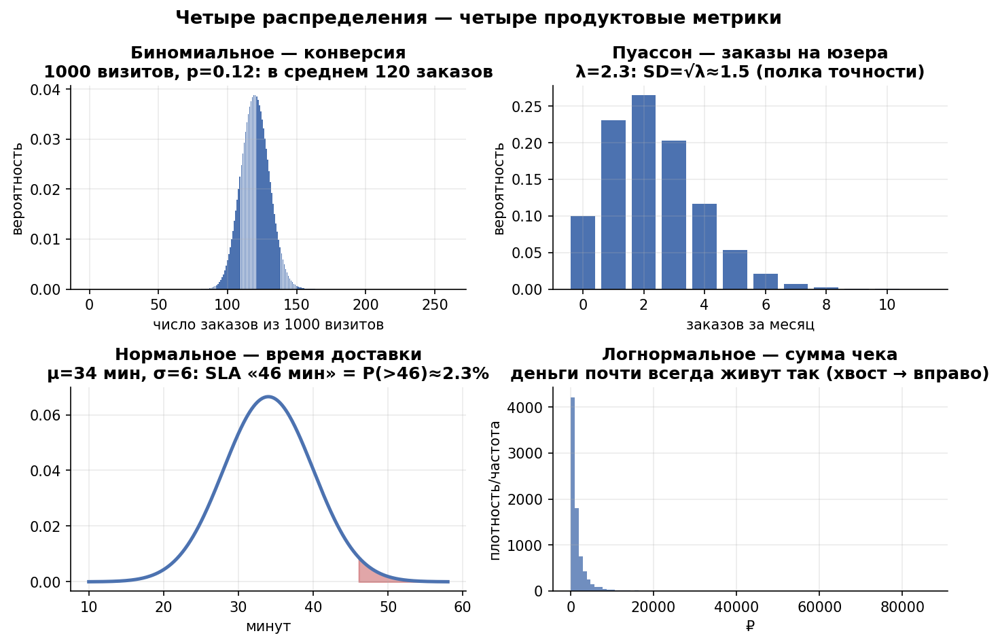
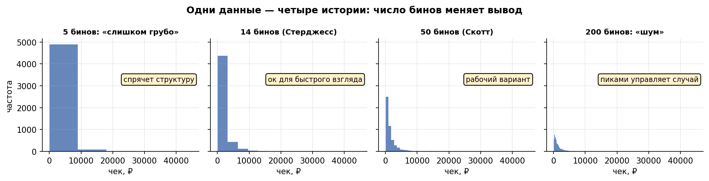
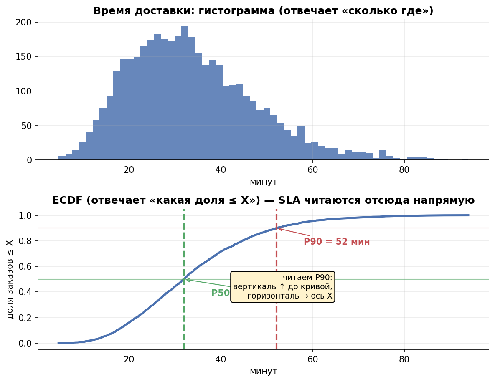
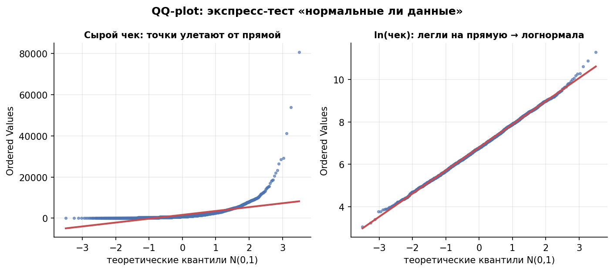

# Урок 1.2 — Распределения: зоопарк продуктовых метрик

**Цель урока:** после урока вы сможете для каждой метрики «ЕдаДома» (конверсия, заказы, чек, время доставки) назвать её естественное распределение, оценить параметры методом моментов и MLE, правильно построить гистограмму/ECDF/QQ-plot и не принять хвост за аномалию.

## Зачем это аналитику

В уроке 1.1 мы увидели, что выручка «ЕдаДома» скошена и среднее живёт в хвосте. Но почему хвост именно такой, откуда он берётся и что будет с метрикой дальше — отвечает модель распределения. У каждого типа метрики есть своё «естественное» распределение: конверсия — биномиальное, счётчики событий — Пуассона, деньги — логнормальное, время доставки — примерно нормальное. Как говорит [X5 ур.2], «90% продуктовых метрик не нормальны» — и это не курсовая строгость, а прямые деньги: от формы распределения зависят шум метрики, размер выборки теста и то, какие события вы примете за аномалию.

Примеры из каждого дня. Дежурный аналитик видит: «заказов в районе 115 при обычных 100» — это аномалия или шум? Если знать, что заказы в час ~ Пуассон с λ = 100, то шумовая полка ±√100 = ±10, и 115 — обычный день. «Конверсия в первый заказ упала с 12% до 11%» — при 4 000 новых юзерах sd конверсии √(0,12·0,88/4000) ≈ 0,5 п.п., значит 11% — это два «сигмы», уже интересно. Один и тот же навык: знать распределение → знать, что считать шумом.

И третье: распределение — это **модель**, а модель надо подгонять и проверять. В этом уроке научимся подгонять параметры двумя способами (метод моментов и максимальное правдоподобие) и диагностировать качество подгонки глазами: гистограмма с теоретической кривой, ECDF, QQ-plot. Культура курса: не верь подгонке — проверь графиком.

## Теория

### Случайная величина и её распределение

**Случайная величина** — это величина, значение которой до наблюдения неопределённо: чек следующего заказа, число заказов за час, время доставки ([Симулятор 1]). **Распределение** — полный рецепт её поведения: какие значения и с какими вероятностями она принимает.

- Для дискретных (заказы): **ряд распределения** $P(X = k)$ — вероятность каждого значения.
- Для непрерывных (чек): **плотность** $f(x)$ — вероятность попасть в маленький интервал $\approx f(x)\,dx$.
- Универсальное описание — **функция распределения** (CDF): $F(x) = P(X \le x)$. Она монотонно растёт от 0 до 1, и из неё достаётся всё: медиана = решение $F(x)=0{,}5$, квантили — $F(x) = p$.

Распределение задаётся **параметрами** (например, у нормального — $\mu$ и $\sigma$) и **семейством** (форма). Подгонка распределения к данным = выбор семейства + оценка параметров. Сначала — зоопарк семейств, которые реально встречаются в продукте.

### Зоопарк: где какое распределение в «ЕдаДома»

#### Нормальное — время доставки

$$X \sim N(\mu, \sigma^2), \qquad f(x) = \frac{1}{\sigma\sqrt{2\pi}}\,e^{-\frac{(x-\mu)^2}{2\sigma^2}}$$

Откуда берётся: время доставки = сумма многих независимых слагаемых (готовка + сборка + поиск курьера + дорога + лифт). Суммы слабо зависимых величин стремятся к нормальности (ЦПТ — урок 1.3), поэтому **аддитивные** процессы дают нормальное распределение. Параметры: $\mu$ — центр, $\sigma$ — разброс; правило трёх сигм: 68% в $\pm 1\sigma$, 95% в $\pm 2\sigma$, 99,7% в $\pm 3\sigma$.

Мини-пример: время доставки $N(34, 6^2)$, минуты. Обещание «45 минут или скидка»: $P(X > 45) = P(Z > \frac{45-34}{6} = 1{,}83) \approx 3{,}4\%$ — каждая 30-я доставка бесплатная. Хотите 1% — обещайте 48 минут ($z = 2{,}33$).

Важно: нормальное — про **симметрию** и средние хвосты. Время доставки в реальности чуть тяжелее справа (пробки, дождь), но как первое приближение работает. А вот сырые деньги и счётчики — не нормальны почти никогда.

#### Биномиальное — конверсия в первый заказ

Число успехов в $n$ независимых испытаниях с вероятностью успеха $p$:

$$P(X = k) = \binom{n}{k} p^k (1-p)^{n-k}, \qquad E[X] = np, \quad Var(X) = np(1-p)$$

В продукте: из $n$ новых юзеров конвертируются в первый заказ $X$ человек, $p$ — истинная конверсия. Ключевая производная — **шум конверсии как доли**:

$$sd(\hat{p}) = \sqrt{\frac{p(1-p)}{n}}$$

Мини-пример: $p = 0{,}12$, недельная когорта $n = 1000$: $sd = \sqrt{0{,}12 \cdot 0{,}88 / 1000} \approx 0{,}0103$ — конверсия гуляет ±1 п.п. от недели к неделе сама по себе. Увидели 11% — это шум; увидели 9,7% — это три «сигмы», разбирайтесь. При $np \ge 5$ и $n(1-p) \ge 5$ биномиальное хорошо приближается нормальным — отсюда z-тест для долей (модуль 2).

#### Пуассона — заказы за час

Число редких событий за фиксированный интервал при постоянной интенсивности $\lambda$:

$$P(X = k) = \frac{\lambda^k e^{-\lambda}}{k!}, \qquad E[X] = Var(X) = \lambda$$

В продукте: заказы в час на район ($\lambda = 40$), звонки в поддержку, опечатки в карточках ресторана. Главный подарок Пуассона — простая «шумовая полка» $\sqrt{\lambda}$: при $\lambda = 40$ sd = 6,3, то есть от 34 до 46 заказов в час — обычная жизнь без всяких изменений продукта. Диагностический признак пуассоновости: **выборочные среднее и дисперсия примерно равны** ([stats_for_science]: DGP и пуассоновость).

Контрпример, критичный для практики: **число заказов на юзера за месяц**. Среднее 2,1, а дисперсия легко 6–8: юзеры неоднородны (у кого-то привычка, у кого-то отпуск). Это **overdispersion** (сверхдисперсия), $Var \gg Mean$ — Пуассон не подходит, рабочая модель — отрицательное биномиальное (Пуассон со случайной $\lambda$ по юзерам). Пуассон хорош для агрегатов по времени/территории, а не по людям.

#### Логнормальное — чек и деньги

$$X = e^{Z}, \quad Z \sim N(\mu, \sigma^2) \qquad \Rightarrow \qquad \text{median} = e^{\mu}, \quad mean = e^{\mu + \sigma^2/2}$$

Откуда берётся: деньги **мультипликативны**. Чек = цена позиции × количество × число позиций в корзине — множители наслаиваются, эффекты складываются в логарифмах. Поэтому ln(чек) примерно нормален, а сам чек — скошен с тяжёлым правым хвостом. Тяжестью хвоста управляет $\sigma$, и это мгновенно видно из отношения:

$$\frac{mean}{median} = e^{\sigma^2/2}$$

Мини-пример: медианный чек 900 ₽, $\sigma = 0{,}9$ → средний $= 900 \cdot e^{0{,}405} \approx 1200$ ₽. Обратная инженерия — мощный приём: если на дашборде mean/median чека = 2, то $\sigma = \sqrt{2\ln 2} \approx 1{,}18$ — вы только что оценили параметр хвоста, не имея сырых данных. Тяжёлые хвосты — это киты из урока 1.1; в practice_1_1 выручка с $\sigma = 1{,}4$ давала mean/median ≈ 2,6 и топ-1% ≈ 18% выручки.

*Рис. 1. Четыре распределения — четыре метрики: конверсия (биномиальное), заказы (Пуассон с полкой √λ), доставка (нормальное, SLA из хвоста), чек (логнормальное).*

### Как смотреть на распределение: бины, ECDF, QQ-plot

#### Сколько столбцов в гистограмме

Гистограмма — оценка формы распределения, и она зависит от ширины столбца $h$. Слишком широкие — форму замылили, слишком узкие — «гребёнка» из шума. Три классических правила ([koch-kir «Сколько столбцов в гистограмме»]):

- **Стерджесс**: $k = 1 + \log_2 n$ бинов. Проще некуда: n = 5 000 → 13 бинов. Заточен под нормальные данные, на больших n и скошенных — грубоват.
- **Скотт**: $h = 3{,}5\,\hat\sigma \cdot n^{-1/3}$ — ширина бина из оценки σ. Опять же идеал — нормальность.
- **Фридман–Диаконис**: $h = 2 \cdot IQR \cdot n^{-1/3}$ — IQR вместо σ, поэтому правило **устойчиво к хвостам**: лучший дефолт для скошенных денег (вспомните урок 1.1: STD чека раздувается китами, IQR — нет).

Практический порядок для продуктового аналитика: логнормальные деньги сначала прологарифмировать, на лог-шкале применить Скотта/ФД — бины лягут равномерно; формулы на сырых сильно скошенных данных дают либо «одну палку», либо сотни бинов в пустом хвосте.

*Рис. 2. Одни данные — четыре истории: 5 бинов спрячут структуру, 200 — покажут шум; Стерджесс/Скотт/Фридман–Диаконис — способы не гадать.*

#### ECDF — распределение без параметров

**Эмпирическая функция распределения** (ECDF):

$$\hat{F}(x) = \frac{1}{n}\sum_{i=1}^{n} \mathbb{1}\{x_i \le x\}$$

— доля наблюдений, не превышающих $x$. Ступенчатая неубывающая линия от 0 до 1. Как читать: провели горизонталь на уровне 0,5 — медиана; на уровне 0,9 — P90; провели вертикаль в $x = 40$ мин — узнали долю доставок быстрее 40 минут. Крутизна = плотность данных: где линия взлетает — там данных много, где полога — редко.

Почему аналитику ECDF: у неё нет ни бинов, ни параметров — она не врёт формой. Гистограмма хороша для «ухватить форму глазами», ECDF — для чтения конкретных квантилей и сравнения двух групп (в АБ-тестах). Боксплот из урока 1.1 — это просто ECDF, сжатая до пяти чисел.

*Рис. 3. Гистограмма отвечает «сколько где», ECDF — «какая доля заказов ≤ X»: P50 и P90 читаются с неё напрямую, без выбора бинов.*

#### QQ-plot: «насколько мои данные нормальны»

Квантиль-квантиль график: по оси x — теоретические квантили распределения-кандидата (например, нормального с $\hat\mu, \hat\sigma$), по оси y — отсортированные данные (выборочные квантили). Если данные действительно из этого семейства — точки лягут на прямую.

Как читать ([stats_for_science]: диагностика):
- точки **выше прямой в правом хвосте** → правый хвост тяжелее нормального (типично для денег);
- S-образный изгиб → скошенность;
- хвосты разбегаются, центр на прямой → «нормально в середине, не нормально по краям».

Классический бинарный тест: QQ-plot **сырого чека** против нормали изгибается; QQ-plot **ln(чека)** против нормали — почти прямая линия. Это и есть определение логнормальности, увиденное глазами. Отклонения крайних точек при малых n — нормальны (крайние квантили оцениваются плохо), смотрим на систематический изгиб, а не на две крайние точки.

*Рис. 4. QQ-plot — экспресс-тест на нормальность: сырой чек улетает от прямой, ln(чек) ложится → чек логнормален.*

### Подгонка параметров: метод моментов vs MLE

Семейство выбрали — как оценить параметры? Два классических способа ([Лагутин гл.3]; [stats_for_science]: moment matching и MLE).

**Метод моментов (MoM):** приравнять теоретические моменты к выборочным и решить уравнения. Для распределения с параметром $\lambda$: $E[X] = \bar{x}$ → $\hat\lambda_{MoM} = \bar{x}$. Просто, считается в голове, но использует неполную информацию (только моменты).

**Максимум правдоподобия (MLE):** выбрать параметры, максимизирующие вероятность увидеть именно ваши данные:

$$\hat\theta_{MLE} = \arg\max_\theta \; \ell(\theta) = \arg\max_\theta \sum_{i=1}^n \ln f(x_i; \theta)$$

Для Пуассона: $\ell(\lambda) = -n\lambda + (\sum x_i)\ln\lambda$, приравниваем производную к нулю: $\hat\lambda_{MLE} = \bar{x}$ — **совпало с MoM**. Для многих «хороших» семейств MLE — это выборочное среднее или близкое к нему, и на Пуассоне оба метода дают одно число (проверим оптимизацией в практике — не верь формуле, проверь).

А вот на логнормальном **расходятся**, и это поучительно:
- MoM решает систему по $\bar{x}$ и $s^2$ **сырых** данных: $\hat\sigma^2 = \ln(1 + s^2/\bar{x}^2)$, $\hat\mu = \ln\bar{x} - \hat\sigma^2/2$. Но $\bar{x}$ и $s^2$ по тяжёлому хвосту — шумные оценки (киты!), вся ошибка въезжает в параметры.
- MLE работает в логарифмах: $\hat\mu = \overline{\ln x}$, $\hat\sigma = sd(\ln x)$ — киты «прижаты» логарифмом, оценки стабильнее.

Мораль: MLE использует форму всего распределения и, как правило, эффективнее; MoM хорош как быстрый старт и sanity-check. Но любой подбор — только гипотеза: после подгонки обязателен осмотр — теоретическая кривая поверх гистограммы, ECDF, QQ-plot. Подогнать параметры можно у чего угодно, вопрос — подходит ли семейство.

## Разбор на данных

Мини-выгрузка «ЕдаДома»: число заказов за неделю по 12 юзерам.

| user | u1 | u2 | u3 | u4 | u5 | u6 | u7 | u8 | u9 | u10 | u11 | u12 |
|---|---|---|---|---|---|---|---|---|---|---|---|---|
| заказов | 0 | 1 | 1 | 0 | 2 | 1 | 3 | 0 | 1 | 2 | 1 | 4 |

Частоты: 0 заказов — 3 юзера, 1 — 5, 2 — 2, 3 — 1, 4 — 1.

Шаг 1. Оценка параметра. $\bar{x} = 16/12 = 4/3 \approx 1{,}33$. Это и MoM ($E[X] = \lambda = \bar{x}$), и MLE (производная log-правдоподобия) — для Пуассона методы совпадают: $\hat\lambda = 1{,}33$.

Шаг 2. Пуассоновость: проверяем $E \approx Var$. Сумма квадратов: $0^2\cdot3 + 1^2\cdot5 + 4\cdot2 + 9\cdot1 + 16\cdot1 = 38$. Дисперсия (с поправкой): $(38 - 12 \cdot (4/3)^2)/11 = 16{,}7/11 \approx 1{,}52$. Среднее 1,33, дисперсия 1,52 — близко, Пуассон не отвергаем (но n = 12 — ни о чём не говорит; на реальной базе ждите var/mean = 3–5).

Шаг 3. Ожидаемые частоты $12 \cdot P(X = k \mid \lambda = 4/3)$, считаем через рекуррентность $P(k+1) = P(k)\,\lambda/(k+1)$, старт $P(0) = e^{-4/3} \approx 0{,}264$:

| k | 0 | 1 | 2 | 3 | 4 | 5+ |
|---|---|---|---|---|---|---|
| наблюдаем | 3 | 5 | 2 | 1 | 1 | 0 |
| ожидаем | 3,2 | 4,2 | 2,8 | 1,2 | 0,4 | 0,1 |

Совпадение приличное: модель «заказы юзера ~ Пуассон(1,33)» на этих данных не позорится. На большой выборке вы, скорее всего, увидите overdispersion и перейдёте на отрицательное биномиальное — в практике 1.2 оба сценария смоделированы.

Шаг 4. Что даёт модель: sd = √1,33 ≈ 1,15 заказа — шумовая полка индивидуума; район из 300 таких юзеров делает в неделю $400 \pm \sqrt{400} = 400 \pm 20$ заказов. Теперь «район сделал 415 вместо 400» — не новость, а «сделал 445» — четыре «сигмы», новость. Распределение превратило число в суждение.

## Подводные камни

1. **Метрику сравнивают с нулём, а не с шумовой полкой её распределения.** Так делают: «заказов 115 при плане 100 — что-то сломалось / что-то взлетело». Чем грозит: по Пуассону с λ = 100 обычный разброс ±10, вы генерируете ложные расследования и приучаете команду не верить алертам. Как правильно: для каждой метрики знать sd по формуле её распределения ($\sqrt{\lambda}$, $\sqrt{p(1-p)/n}$) и включать полку в пороги алертов.
2. **Гистограмма с дефолтными бинами как аргумент.** Так делают: строят гистограмму «как библиотека нарисовала» и обсуждают форму (бимодальность, «провал»). Чем грозит: форма гистограммы меняется от числа бинов — два аналитика на одних данных увидят разное. Как правильно: осознанный выбор бинов (Скотт/ФД), log-шкала для денег, и ECDF как метод без параметров.
3. **Деньги в линейной шкале + вывод «у нас экстремальные выбросы».** Так делают: гистограмма чека в линейной шкале, справа «странная гребёнка точек» → чистят «аномалии». Чем грозит: это не аномалии, а нормальный тяжёлый хвост логнормалы; чисткой режете выручку и смещаете все оценки (урок 1.1). Как правильно: log-шкала; хвост — черта модели, а не мусор; отношение mean/median = $e^{\sigma^2/2}$ скажет тяжесть хвоста даже по дашборду.
4. **Пуассон для поюзерных метрик «на веру».** Так делают: число заказов на юзера моделируют Пуассоном, потому что «это счётчик». Чем грозит: реальные юзеры сверхдисперсны (var/mean = 3–5), Пуассон занижает разброс в разы — тесты теряют мощность, полки алертов врут. Как правильно: проверять $s^2$ vs $\bar{x}$; при var > mean — отрицательное биномиальное или бутстреп без модельных предположений.
5. **Подгонка без проверки адекватности.** Так делают: `scipy` подобрал параметры — график «подтверждает», в дизайн-док. Чем грозит: MLE/MoM возвращают число для любого семейства, даже категорически не подходящего; дальше все расчёты (MDE, полки) красивы и неверны. Как правильно: после подгонки — теоретическая PMF/PDF поверх гистограммы, ECDF модели против данных, QQ-plot; в модуле 2 добавится формальный критерий (Колмогоров–Смирнов).
6. **По QQ-plot паникуют из-за крайних точек.** Так делают: три точки в хвосте отошли от прямой → «данные не нормальны, тест нельзя». Чем грозит: крайние квантили на n = 50 оцениваются ужасно, лёгкое расхождение в хвостах — норма; отвергаете рабочие методы. Как правильно: смотреть на систематический изгиб всего облака; мелкие хвостовые отклонения при малых n игнорировать (для средних это ещё и неважно — ЦПТ, урок 1.3).
7. **Глубокие перцентили по маленькой выборке.** Так делают: P99.9 времени доставки по 2 000 заказов — в SLA и в контракт. Чем грозит: за P99.9 стоит 2 наблюдения; оценка прыгает от недели к неделе на десятки процентов, SLA пробивается «сам по себе». Как правильно: правило «за перцентилем должно стоять хотя бы 10–30 наблюдений»: для P99 нужна n в тысячи, для P99.9 — в десятки тысяч; либо переходить на модель хвоста.

## Практика

Файл `practice_1_2.py` (percent-формат; `python3 practice_1_2.py`). Все генерации — `np.random.default_rng(2027)`.

Что делаем:
1. **Зоопарк на четырёх метриках «ЕдаДома»** (сетка 2×2): конверсия в первый заказ ~ Binomial(1000, 0.12) по 500 когортам-дням; заказы в час на район ~ Poisson(40); время доставки ~ Normal(34, 6); чек ~ Lognormal(median = 900, σ = 0,55). Поверх каждой гистограммы — теоретическая кривая; печать: теоретические vs выборочные mean/sd.
2. **Правило числа бинов**: на выборке чека 5 000 заказов считаем Стерджесса, Скотта и Фридмана–Диакониса (ширина бина → число бинов), строим одну и ту же гистограмму с тремя правилами; печатаем бины на сырых и на логарифмированных данных.
3. **MoM vs MLE для Пуассона**: число заказов на юзера (n = 1000, λ = 2,2). Метод моментов — в лоб; MLE — максимум log-правдоподобия численной оптимизацией (`minimize_scalar`) — не верь формуле, проверь. Плюс сценарий сверхдисперсии: генерируем отрицательное биномиальное с той же средней (var втрое больше) и показываем, что подобранный по среднему Пуассон систематически недооценивает разброс.
4. **MoM vs MLE для логнормалы** на чеке: обе пары (μ, σ), сравнение implied mean/median с выборочными.
5. **ECDF vs гистограмма** на времени доставки: одна слева (бины!), ECDF справа (без параметров); чтение медианы, P90, доли доставок быстрее 40 минут.
6. **QQ-plot логнормалы**: сырой чек против нормали (изгиб вверх в хвосте) и ln(чек) против нормали (почти прямая) — «логнормальность, увиденная глазами».

Что должны увидеть/осознать:
- Четыре метрики — четыре разные формы; «дефолтный» нормальный подход адекватен только времени доставки. Теория (mean/sd по формулам) и выборка сходятся — формулы можно брать в работу.
- Одни данные + три правила бинов = три разные гистограммы; Стерджесс груб, Скотт/ФД на скошенных данных дают «сотни бинов в пустом хвосте» → сначала log, потом бины.
- Для Пуассона MoM и MLE выдают идентичное λ = x̄ (оптимизация подтверждает), но на сверхдисперсных поюзерных данных Пуассон с тем же λ визуально «уже» реальности — держите в голове отрицательное биномиальное.
- Для логнормалы MoM (по сырым моментам) и MLE (по логарифмам) дают разные σ: хвостовые киты портят моменты сырых данных, MLE устойчивее; по QQ-plot видно, что MLE-модель ложится на данные лучше.
- ECDF отвечает на конкретные вопросы («доля доставок быстрее 40 минут») без единого параметра; QQ-plot превращает «примерно нормальное» в проверяемое утверждение.

## Домашнее задание

**Задача 1.** Район делает в среднем 25 заказов в час. Дежурный видит 36 заказов в час и предлагает поднять курьерам ставку «в честь спроса». Оцените: sd часовых заказов и вероятность увидеть 36+ при λ = 25 (нормальное приближение).

Ответ

sd = √25 = 5. P(X ≥ 36) ≈ P(Z > (35,5 − 25)/5 = 2,1) ≈ 1,8%. Событие редкое, но не катастрофа: за 100 часов работы встретится в среднем пару раз. Ставки поднимать рано — сначала проверьте, нет ли акции маркетинга, и посмотрите соседние часы.

**Задача 2.** Конверсия в первый заказ 12%. Новая рекламный канал привёл 400 юзеров, конверсия 16%. Это прорыв или шум? Посчитайте sd конверсии и «сколько сигм» составило отклонение.

Ответ

$sd = \sqrt{0{,}12 \cdot 0{,}88/400} \approx 0{,}0162$ (1,6 п.п.). Отклонение $(0{,}16 - 0{,}12)/0{,}016 \approx 2{,}5$ σ — шумом объяснить сложно, но и «прорыв» на 400 юзерах — рано: нужен больший сэмпл (и напрашивается вопрос о качестве трафика: возвраты, повторные заказы).

**Задача 3.** На дашборде mean чека = 1 200 ₽, median = 800 ₽. Оцените σ логнормального распределения чека и топ-хвостовую тяжесть. Что изменится, если завтра mean = 1 500, median = 800?

Ответ

mean/median = 1,5 = e^{σ²/2} → σ = √(2 ln 1,5) ≈ 0,90. Если ratio вырос до 1,875 (σ ≈ 1,13): типичный заказ не изменился (median та же), хвост стал тяжелее — пришли киты или сломался агрегат. Ищите причину в хвосте, а не в «росте чека».

**Задача 4.** Для n = 200 заказов с диапазоном 0–6 000 ₽, σ = 1 500, IQR = 800 посчитайте число бинов по Стерджессу, Скотту и Фридману–Диаконису. Почему на скошенных деньгах ФД обычно лучше Скотта?

Ответ

Стерджесс: k = 1 + log₂200 ≈ 8,6 → 9. Скотт: h = 3,5·1500/200^{1/3} ≈ 898 → k ≈ 7. ФД: h = 2·800/200^{1/3} ≈ 274 → k ≈ 22. Скотт делит на σ, которую раздувают хвостовые киты → бины слишком широкие, тело распределения замыливается; ФД использует IQR, устойчивый к хвостам, и различает тело данных.

**Задача 5.** На QQ-plot чека против нормали точки в правой части устойчиво лежат выше прямой. Что это значит и какой график построить следующим?

Ответ

Правый хвост тяжелее нормального — типичный признак логнормальности (скошенность вправо). Следующий график: QQ-plot ln(чека) против нормали; если ляжет на прямую — работаем с чеком как с логнормальным (log-трансформация, медиана как типичное значение, модель хвоста для перцентилей).

## Шпаргалка

1. Конверсия ~ Binomial(n, p); шум доли: $\sqrt{p(1-p)/n}$; при больших n → нормальное.
2. События за интервал ~ Poisson(λ): mean = var = λ, шумовая полка ±√λ.
3. Поюзерные счётчики обычно сверхдисперсны (var/mean ≫ 1) → отрицательное биномиальное; Пуассон — для агрегатов по времени/районам.
4. Деньги ~ Lognormal: median = e^μ, mean = e^{μ+σ²/2}; mean/median = e^{σ²/2} — экспресс-диагностика хвоста по дашборду.
5. Нормальное — для аддитивных процессов (время доставки) и для средних (ЦПТ, урок 1.3); сырые продуктовые метрики почти никогда.
6. Бины: Стерджесс k = 1 + log₂n; Скотт h = 3,5σn^{−1/3}; ФД h = 2·IQR·n^{−1/3}; скошенные деньги — сначала log, потом бины.
7. ECDF: доля наблюдений ≤ x; без бинов и параметров; медиана — пересечение с 0,5; крутизна = плотность.
8. QQ-plot: прямая = семейство подходит; точки выше прямой справа = хвост тяжелее; крайние точки при малых n — не приговор.
9. MoM: теоретические моменты = выборочные (быстро, в голове); MLE: максимум правдоподобия (эффективнее). Для Пуассона совпадают (λ̂ = x̄), для логнормалы — нет.
10. Подогнать ≠ проверить: после любой подгонки — кривая поверх гистограммы, ECDF, QQ-plot. Не верь — проверь.

## Источники

- [Симулятор 1] — случайные величины, функция распределения и плотность, среднее/дисперсия, нормальное распределение, выборка и оценка.
- [X5 ур.2] — «зоопарк распределений» продуктовых метрик, «90% метрик не нормальны», дисперсия как характер метрики.
- [Статьи: koch-kir «Сколько столбцов в гистограмме»] — формулы Стерджесса, Скотта, Фридмана–Диакониса и их сравнение.
- [stats_for_science] — летний ликбез-2026: серии про биномиальное/Пуассона/нормальное, DGP и пуассоновость (равенство mean/var, overdispersion), посты про QQ-plot и диагностику, «moment matching и MLE».
- [Лагутин гл.2–3] — случайные величины и распределения (наглядно); оценивание: метод моментов и максимального правдоподобия.
- [Брюс гл.2] — распределения выборок: нормальное, Пуассон, смещение и стандартная ошибка.
- [Spanos гл.3, 5] — строгая подпорка: каталог распределений, t-графики и эмпирическая CDF при чтении реальных данных.
