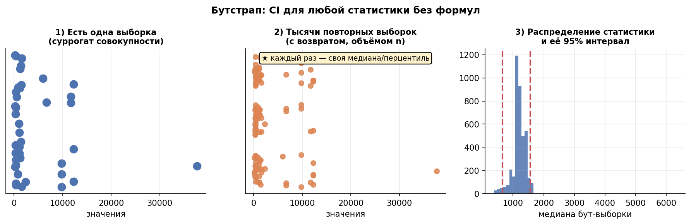
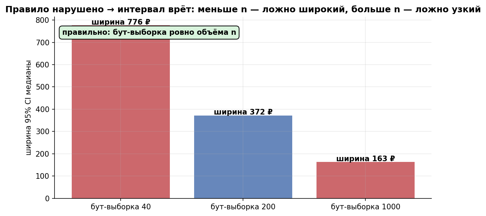

# Урок 1.4 — Бутстрап: доверительные интервалы без формул

**Цель урока:** освоить непараметрический бутстрап — универсальный алгоритм построения доверительных интервалов для любой статистики (медиана, перцентили, ratio); выучить правила гигиены (объём бут-выборки, семплирование юнитов целиком) и честно очертить ограничения метода.

## Зачем это аналитику

В уроке 1.3 всё держалось на формуле $SE = \sigma/\sqrt{n}$ и ЦПТ. Она есть у среднего и (в виде $\sqrt{\hat p(1-\hat p)/n}$) у доли. А теперь типовая задача «ЕдаДома»: SLA по времени доставки — «95% заказов до 45 минут», и продакт спрашивает, с какой неопределённостью мы оцениваем этот 95-й перцентиль. Или: CI для медианы чека, которая стабильнее среднего на скошенных данных. Простых формул здесь нет, а ответ нужен сегодня.

Бутстрап — «швейцарский нож аналитика» (Atlamos): один и тот же алгоритм из четырёх шагов даёт интервал для медианы, p95, IQR, а позже (М3.3) — для ratio-метрик вроде среднего чека $\sum\text{выручки}/\sum\text{заказов}$, где t-тест в лоб некорректен. Никаких таблиц и выводов — только ресэмплинг собственной выборки.

Но нож режет и не туда. Возьмёте бут-выборку не того объёма — получите «ложную точность» или надутый интервал (проверим симуляцией: ошибка в $\sqrt{5}$ раз). Посэмплируете заказы вместо пользователей на ratio-метрике — интервал развалится. И главное: бутстрап не создаёт информации. Смещённая выборка останется смещённой, сколько её ни перемешивай. Поэтому урок = алгоритм + правила гигиены + границы применимости.

## Теория

### 1. Идея: выборка — суррогат генеральной совокупности

Идеальное знание о неопределённости оценки мы бы получили, повторив эксперимент 1000 раз заново — собрать 1000 недель «ЕдаДома» нельзя. Бутстрап заменяет недоступную генеральную совокупность $F$ **эмпирическим распределением** $\hat{F}_n$: дискретным распределением, кладущим массу $1/n$ в каждую точку выборки. По закону больших чисел $\hat{F}_n \to F$ при росте $n$ — так что выборка действительно лучший доступный суррогат совокупности (формулировка Atlamos).

Выборка из $\hat{F}_n$ — это и есть выборка с возвращением из наших же $n$ наблюдений: каждый элемент исходной выборки попадает в бут-выборку с вероятностью $1/n$, независимо. Ресэмплинг с возвращением = «сыграть эксперимент заново» в том мире, где выборка — вся вселенная.

### 2. Непараметрический бутстрап: алгоритм в 4 шага

Пусть $\hat\theta = \hat\theta(x_1,\dots,x_n)$ — любая статистика.

1. **Ресэмплинг:** из $x_1,\dots,x_n$ с возвращением тянем $n$ значений (бут-выборка; строго $n$ — почему, см. ниже).
2. **Статистика:** считаем $\hat\theta^{*(b)}$ на бут-выборке.
3. **Повтор:** шаги 1–2 $B$ раз: $B = 1000$–$10000$ (рекомендация симулятора АБ; в практике $B = 5000$).
4. **Интервал:** по эмпирическому распределению $\{\hat\theta^{*(b)}\}_{b=1}^B$ — например, процентильный CI.

Получаем «распределение оценки, какой она была бы при повторении эксперимента» — то, что в 1.3 мы рисовали гистограммой 5000 средних, только теперь для произвольной статистики и без права сэмплировать из совокупности.

*Рис. 1. Три шага глазами: одна выборка → тысячи ресэмплирований с возвратом → распределение статистики и её 95% интервал.*

### 3. Процентильный CI и его родственники

**Процентильный интервал** — берём квантили бут-распределения:

$$CI_{95\%} = \big[\,q^{*}_{0{,}025};\ \ q^{*}_{0{,}975}\,\big]$$

Симулятор АБ (урок 5) сравнивает три варианта построения CI по бут-распределению:

- **нормальный**: $\hat\theta \pm 1{,}96\cdot SE^{*}$, где $SE^{*}$ — std бут-реплик; симметричен по построению;
- **процентильный**: квантили $2{,}5\%$ и $97{,}5\%$ бут-распределения;
- **центральный** (basic): $\big[2\hat\theta - q^{*}_{0{,}975};\ 2\hat\theta - q^{*}_{0{,}025}\big]$.

На симметричном бут-распределении все три почти совпадают. Разница проявляется на несимметричных — а скошенные метрики как раз наш случай (QQ-plot в практике покажет асимметрию бут-распределения перцентилей). Процентильный CI учитывает форму автоматически — им и пользуемся по умолчанию.

Бонус: через CI можно проверять гипотезы — если гипотетическое значение параметра лежит вне 95% интервала, отвергаем H0 на уровне 5% (симулятор, урок 5). В полный рост это раскроем в М2 (p-value), а в М2.3 бутстрап станет универсальным критерием.

### 4. Для каких статистик бутстрап незаменим

- **медиана, перцентили** ($p_{95}$ времени доставки, $p_{99}$ времени загрузки — квантильные метрики из симулятора, урок 5): аналитические SE для квантилей существуют, но требуют знания плотности; бутстрапу всё равно;
- **ratio-метрики**: средний чек $= \frac{\sum_i \text{выручки}_i}{\sum_i \text{заказов}_i}$, CTR — t-тест в лоб некорректен (зависимость числителя и знаменателя), бутстрап юзерами — корректен; альтернатив немного: дельта-метод, линеаризация (все три сравним в М3.3);
- **сложные композиции**: «доля пользователей, у которых медианный чек вырос» и любые self-made метрики;
- **локализация эффекта по перцентилям** (децильный анализ в М4.4, Atlamos).

Чего бутстрап НЕ даёт: на поюзерных **средних** он работает, но это «вычислительно затратная аппроксимация t-теста» (Atlamos) — результат тот же, а цена выше. Для среднего оставляем $t$-интервал из 1.3 (и t-тест в М2.2).

### 5. Правила гигиены

**Бут-выборка строго объёма $n$.** Бут-выборка объёма $m$ имитирует «эксперимент» с $m$ наблюдениями, а её $SE \sim 1/\sqrt{m}$. Возьмёте $m = 5n$ — распределение сожмётся в $\sqrt 5$ раз, интервал покажет **ложную точность** (у Atlamos бут-выборки $25n$ сужают распределение в 5 раз); возьмёте $m = n/5$ — интервал раздуется в $\sqrt 5$ раз, будто эксперимент был впятеро меньше. Оба эффекта увидим численно в практике.

**Семплить юниты целиком.** Если единица анализа — пользователь, в бут-выборку тянем пользователя со всеми его заказами (числителем и знаменателем вместе), а не отдельные заказы. Иначе разрушается зависимость «заказы одного юзера похожи», и для ratio-метрик CI сломается. Это ключевой форвард к М3.3:Atlamos в статье о линеаризации прямо инструктирует «семплировать с повторением случайных пользователей», принося их сигналы и в числитель, и в знаменатель.

**Число реплик $B$.** Для 95% CI — 5000+ (симулятор: 1000–10000): квантили $2{,}5\%$ и $97{,}5\%$ при малом $B$ сами шумят. Для быстрой разведки хватит 1000, для 99% CI — больше. И фиксируйте seed — результат должен воспроизводиться.

*Рис. 2. Бут-выборка не того объёма: m<n даёт ложно широкий интервал, m>n — ложно узкий («ложная точность»). Правильно — строго n.*

### 6. Ограничения

- **Не создаёт информации и не повышает репрезентативность** (прямо по Atlamos): бутстрап оценивает только *вариативность* на основе той же выборки. Смещённый сбор данных (только залогиненные, только Москва) даст уверенно-неправильный интервал. CI чинит шум, не bias — как и в 1.3.
- **Зависимые данные.** Всё построено на i.i.d.; автокорреляция (ARPU по дням с трендом), кластеризация (заказы юзера) ломают обычный бутстрап — он занижает $SE$. Решение — блочный бутстрап (ресэмплируем блоки: недели, юзеров) — канонический приём из stats_for_science «что если данные не случайны»; вернёмся в М3.2.
- **Малые $n$ и хвосты.** Бутстрап «не знает» о хвосте совокупности ничего, кроме того, что видно в выборке. При $n = 100$ оценка $p_{99}$ опирается на один-два заказа; бут-CI либо вырожденно узкий, либо чепуха. Перцентиль, который вы оцениваете, должен иметь в выборке хотя бы несколько «опорных» точек.
- **Масштабируемость.** На сотне метрик × тысячах тестов бутстрап дорог; в платформенном контуре его вытесняют дельта-метод и линеаризация (Atlamos, М3.3).

## Разбор на данных

Считаем руками на 10 чеках «ЕдаДома» (₽):

| # | 1 | 2 | 3 | 4 | 5 | 6 | 7 | 8 | 9 | 10 |
|---|---|---|---|---|---|---|---|---|---|---|
| чек | 340 | 520 | 610 | 700 | 760 | 820 | 940 | 1210 | 1560 | 2900 |

Медиана выборки: $(760+820)/2 = 790$ ₽. Теперь пять бут-реплик (тянем с возвращением, сортируем, берём середину):

| реплика | элементы бут-выборки | медиана $\hat\theta^{*}$ |
|---|---|---|
| 1 | 340, 700, 700, 760, **760, 820**, 820, 940, 1560, 2900 | 790 |
| 2 | 340, 340, 520, 610, **700, 700**, 760, 820, 940, 940 | 700 |
| 3 | 520, 610, 610, 700, **760, 820**, 1210, 1210, 1560, 2900 | 790 |
| 4 | 340, 610, 610, 700, **760, 760**, 820, 820, 940, 2900 | 760 |
| 5 | 520, 520, 610, 700, **760, 940**, 940, 1210, 1560, 2900 | 850 |

Что видим руками: (1) медиана бут-выборок — всегда либо значение из выборки, либо полусумма соседних — статистика **квантуется**; (2) уже на пяти репликах разброс медиан [700; 850] — это и есть зародыш бут-распределения. С $B = 5000$ (практика) перцентили этого разброса станут устойчивыми.

Полный прогон из практики ($n = 500$ заказов, логнормальный чек): медиана 839 ₽, бут-CI **[744; 942]**; истинная медиана совокупности 800 ₽ — внутри. Для сравнения среднее той же выборки 1616 ₽ при истинном 1465 ₽ — среднее на скошенных данных «прыгает» гораздо сильнее медианы.

## Подводные камни

1. **Бут-выборки «неправильного» объёма.** Делают: $m = 5n$ «чтобы распределение было поглаже» или $m = n/5$ «чтобы быстрее». Грозит: сужение интервала в ~$\sqrt5$ раз — **ложная точность** (у Atlamos 25n сжимает распределение в 5 раз) — либо раздувание в ~$\sqrt5$ под видом «консервативности». Правильно: бут-выборка всегда объёма $n$.
2. **Семплируют наблюдения вместо юнитов.** Делают: для среднего чека ресэмплят отдельные заказы. Грозит: зависимость числителя и знаменателя игнорируется, CI и p-value врут, «механики-пустышки» едут в прод. Правильно: тянуть пользователя целиком — со всеми заказами (М3.3).
3. **«Бутстрап исправит кривую выборку».** Делают: собрали смещённые данные и «прогнали через бутстрап для надёжности». Грозит: уверенный интервал вокруг неверного значения — bias не усредняется ресэмплингом. Правильно: чинить сбор данных; бутстрап оценивает только вариативность.
4. **$B = 100$–$200$ для финального 95% CI.** Грозит: граница интервала (перцентиль 2,5%) сама случайна — от запуска к запуску «плавает». Правильно: $B \ge 5000$ для 95%, больше для 99%; seed фиксировать.
5. **Экстремальные перцентили при малых $n$.** Делают: $p_{99}$ по 200 наблюдениям и бут-CI к нему. Грозит: в бут-выборке хвост держится на 1–2 точках — интервал вырожден или бессмыслен. Правильно: проверять, сколько точек «поддерживает» перцентиль; для хвостов — больше данных или другая постановка.
6. **Бутстрап по зависимым данным как по i.i.d.** Делают: ресэмплят дни ARPU при недельном тренде. Грозит: занижение $SE$, ложно значимые результаты. Правильно: блочный бутстрап (блок = юзер / неделя), а в АБ — юнит рандомизации (М3.2).
7. **Бутстрап везде вместо t-интервала.** Делают: CI для поюзерного среднего через бутстрап «потому что можно». Грозит: лишние вычисления без выигрыша («затратная аппроксимация t-теста» — Atlamos) и невозможность посчитать размер выборки заранее по формуле. Правильно: среднее — t-интервал (1.3); бутстрап — там, где формул нет.

## Практика

Файл: `practice_1_4.py` (percent-формат, numpy/scipy/matplotlib, seed зафиксирован). Что делает:

1. **Выборка**: 500 чеков «ЕдаДома» (логнормал; истинная медиана 800 ₽ известна нам, но не бутстрапу).
2. **Корректный бутстрап** ($B = 5000$, бут-выборки объёма $n$): процентильные CI для медианы и $p_{95}$ чека + сравнение с **t-CI для среднего** (сам t-тест — М2, здесь только интервал).
3. **Ловушка объёма**: те же CI для медианы при бут-выборках $m = n/5$ и $m = 5n$ — таблица ширин.
4. **Визуализация**: гистограммы выборки и бут-распределений (`bootstrap_checks.png`), QQ-plot бут-распределения медианы против нормального (`bootstrap_qq_median.png`).

Что должны увидеть (числа реального запуска):

| статистика | оценка | 95% CI | ширина |
|---|---|---|---|
| медиана чека (бутстрап) | 839 ₽ | [744; 942] | 198 ₽ |
| 95-й перцентиль (бутстрап) | 5 824 ₽ | [4 476; 7 472] | 2 997 ₽ |
| среднее (t-интервал из 1.3) | 1 616 ₽ | [1 382; 1 851] | 469 ₽ |

- истинная медиана 800 ₽ накрыта интервалом [744; 942];
- CI перцентиля в ~15 раз шире CI медианы: хвостовые статистики зависят от крайних, редких наблюдений и оцениваются грубее;
- t-CI среднего шире бут-CI медианы — на скошенной метрике медиана стабильнее среднего (и это аргумент за медианные метрики);
- бут-выборки $m = n/5 = 100$: интервал [643; 1067], ширина **2,14×** от верной (≈$\sqrt5$) — имитация эксперимента впятеро меньшего; $m = 5n = 2500$: [790; 873], ширина **0,42×** (≈$1/\sqrt5$) — ложная точность в чистом виде;
- QQ-plot: бут-распределение медианы почти нормально (R² = 0,990, асимметрия 0,11), но с лёгким изгибом в хвостах; у $p_{95}$ асимметрия уже 0,56 — чем глубже хвост, тем менее симметрична статистика и тем уместнее процентильный CI.

## Домашнее задание

1. Выборка: [2, 4, 4, 6, 8, 10, 10, 12]. Сделайте руками (или в 5 строк кода) 6 бут-реплик и посчитайте медиану каждой. Какие значения медианы возможны в принципе?

Ответ

Медианы бут-реплик — только значения из {4, 5, 6, 7, 8, 10} (сами точки и полусуммы соседних): статистика квантуется, бут-распределение дискретно. При маленьких $n$ это заметно огрубляет перцентильный CI.

2. Почему бут-выборка объёма $5n$ сужает интервал примерно в $\sqrt 5$ раз? Свяжите с уроком 1.3.

Ответ

Бут-выборка объёма $m$ из $\hat F_n$ имитирует эксперимент с $m$ наблюдениями: $SE^{*} \sim 1/\sqrt{m}$. При $m = 5n$ разброс бут-реплик в $\sqrt 5$ раз меньше, чем при $m = n$, — интервал будто бы получен экспериментом в 5 раз крупнее реального. Это прямое следствие $SE=\sigma/\sqrt n$ из 1.3, только применённое к суррогату $\hat F_n$.

3. Метрика — средний чек «ЕдаДома» (ratio: $\sum$ выручки / $\sum$ заказов), у каждого пользователя от 0 до 40 заказов. Опишите процедуру бутстрапа для CI этой метрики.

Ответ

Юнит — пользователь. В каждой реплике тянем с возвращением $n_{\text{юзеров}}$ пользователей целиком, суммируем их выручку и их заказы, делим. Бут-выборка — ровно $n_{\text{юзеров}}$ юнитов. Отдельные заказы семплить нельзя: заказы одного юзера зависимы, а числитель с знаменателем должны ехать вместе (сравнение с дельта-методом и линеаризацией — М3.3).

4. ARPU по дням имеет восходящий тренд (продукт растёт). Почему i.i.d.-бутстрап по дням даст слишком узкий CI, и что делать?

Ответ

Дни не взаимозаменяемы: бут-выборка с возвращением случайно перетасовывает тренд — в ней «поздние» дни могут быть заменены «ранними», и структура зависимости (тренд) разрушается, а $SE$ занижается. Решение — блочный бутстрап (ресэмплировать недели/блоки целиком) или моделировать тренд явно (детрендинг), а в АБ-тестах — рандомизация по юнитам, где сравнение групп идёт внутри одного времени (М3.2).

5. По таблице практики: во сколько раз CI перцентиля $p_{95}$ шире CI медианы и почему? Что это значит для SLA-метрики «95% доставок до 45 минут»?

Ответ

2 997 / 198 ≈ 15 раз. Медиана опирается на плотную середину распределения (много «опорных» наблюдений), $p_{95}$ — на редкие хвостовые заказы: небольшое смещение пары экстремумов сильно двигает оценку. Для SLA это значит: чтобы оценить $p_{95}$ с той же относительной точностью, что и медиану, нужно заметно больше наблюдений — и требовать от SLA-метрики ювелирной точности на малой выборке бессмысленно.

## Шпаргалка

1. Бутстрап = подставить эмпирическое распределение $\hat F_n$ (массы $1/n$ в точках выборки) вместо неизвестной совокупности $F$.
2. Алгоритм: ресэмплинг $n$ элементов с возвращением → статистика → повторить $B$ раз → интервал.
3. $B$: 1000 — разведка, 5000–10000 — финальный 95% CI; seed обязателен.
4. Процентильный CI $[q^*_{0{,}025}; q^*_{0{,}975}]$ — по умолчанию: учитывает асимметрию бут-распределения.
5. Бут-выборка **строго объёма $n$**: $5n$ — ложное сужение в $\sqrt 5$ раз, $n/5$ — раздувание в $\sqrt 5$ раз.
6. Семплируй **юнит целиком** (юзер со всеми заказами) — база корректности для ratio-метрик (М3.3).
7. Незаменим: медиана, перцентили, ratio, сложные композиции. Для среднего — t-интервал проще («затратная аппроксимация t-теста»).
8. Не создаёт информации и не повышает репрезентативность: bias останется, как бы красиво ни выглядел интервал.
9. Зависимые данные → блочный бутстрап; экстремальные перцентили на малых $n$ — не оцениваются.
10. Гипотеза «значение вне 95% CI» = отвержение на 5% — мостик к p-value в М2.

## Источники

- Atlamos (П. Мосин), «Бутстрап: швейцарский нож аналитика в A/B-тестах» — объём бут-выборок, ложное сужение при 25n, «не генерит информации», семплирование юзеров целиком, затратная аппроксимация t-теста — https://habr.com/ru/articles/762648/ (полный конспект: `materials/web/web-articles.md` §4.3).
- Симулятор АБ-тестов (karpov.courses), урок 5 «Доверительные интервалы» + семинар 5.1 Bootstrap: бутстрап 1000–10000 итераций, нормальный/перцентильный/центральный CI, квантильные метрики p95/p99/p99.9 — `materials/local/ab-simulator.md`.
- Alex Deng, *Causal Inference...*, гл. 8.4 — оценка дисперсии для перцентильных метрик, условие независимости — https://alexdeng.github.io/causal/abstats.html.
- stats_for_science (Е. Убогоева): «Бутстрап ч. 1–2» (ноябрь 2023, эмпирическое распределение, percentile-CI), «Методы ресемплинга ч. 1–2» (2021, jackknife/перестановки, когда классические тесты лгут), «Что если данные не случайны» (блочный бутстрап) — `materials/telegram/stats_for_science-digest.md`.
- StatQuest (J. Starmer), «Bootstrapping Main Ideas!!!» — видеоинтуиция ресэмплинга — https://www.youtube.com/watch?v=Xz0x-8-cgaQ.
