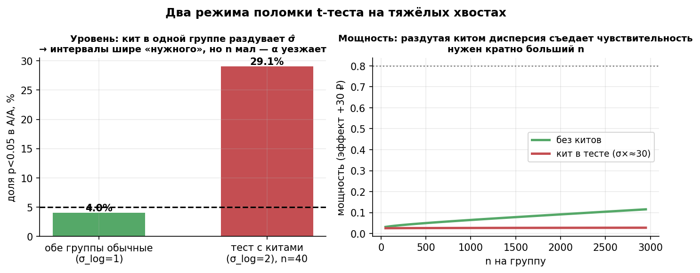
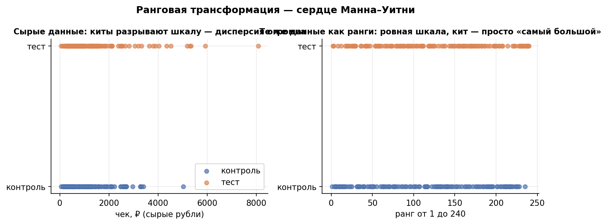
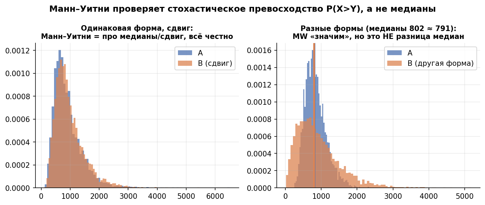
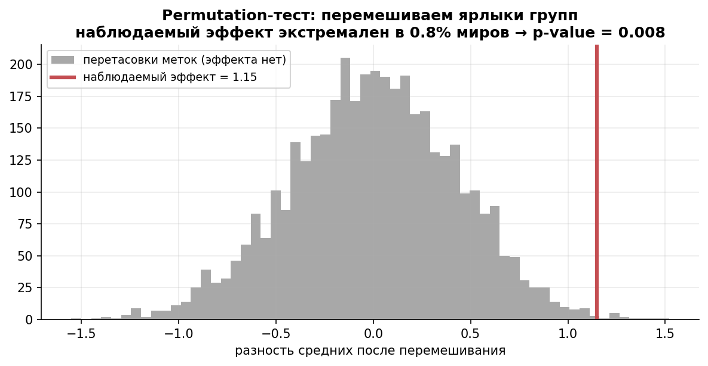
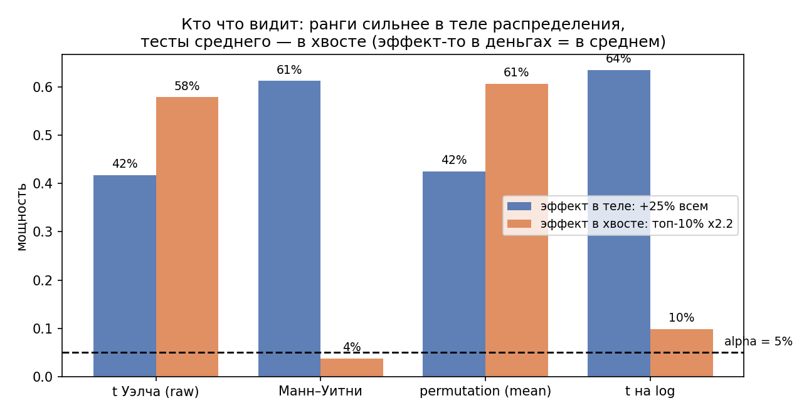

# Урок 2.3 — Непараметрика и ранги: Манн–Уитни, Уилкоксон, перестановки

**Цель урока:** понять, когда параметрические тесты подводят (малое $n$ + скошенность, киты, выбросы), что на самом деле проверяет Манн–Уитни (стохастическое превосходство $P(X>Y)$, а не «равенство медиан»), уметь считать ранговые и перестановочные критерии руками и выбирать между t-тестом, Манн–Уитни и permutation по мощности, а не по привычке.

## Зачем это аналитику

Пилот программы лояльности «ЕдаДома» в малом городе: бюджет хватает на 20–30 юзеров в группе. Выручка юзера за неделю — логнормальная с китами (медиана 800 ₽, максимум 40 000 ₽). В уроке 2.2 мы видели, что при равных группах и умеренной скошенности t-тест Уэлча держит номинал — ЦПТ успевает сработать. Но при малой группе и диких хвостах гарантий нет: в практике этого урока при $n_1=80$ vs $n_2=20$ и $\sigma_{log}=1{,}8$ фактическая ошибка I рода Уэлча доезжает до 8,9% — почти вдвое против номинала. И это ещё цветочки: у t-теста на таких данных уровень может уехать и вниз (стать консервативным) — тогда вы молча теряете мощность.

Вторая ситуация — выбросы и «порядковые» метрики: оценка курьера 1–5, ранг ресторана в выдаче, NPS-скор. Среднее тут сомнительно само по себе (урок 1.1), а t-тест построен на среднем.

Ответ — семейство методов, которым всё равно на форму распределения: **ранговые критерии** (Манн–Уитни, Уилкоксон) и **перестановочные** (permutation), плюс **бутстрап-критерий** из урока 1.4. У них своя цена: каждый проверяет свою гипотезу, и «непараметрический» не значит «без предположений». Разберём, кто что реально проверяет, посчитаем U-статистику руками и измерим мощность всех трёх подходов на данных с китами.

## Теория

### 1. Когда параметры подводят

Параметрический тест (t-тест из 2.2) опирается на нормальность *статистики* — обычно через ЦПТ. Проблемная зона возникает, когда:

- **малое $n$ + сильная скошенность**: ЦПТ ещё не заработала, среднее «прыгает» за китом. Замер в X5 (shelter_analytics): на больших выборках t-тест держит уровень даже при асимметрии 2,34 — но на $n \sim 20$–$30$ и логнормальной выручке чуда не будет;
- **неравные группы + тяжёлый хвост**: классическая ловушка «недолива» трафика — контроль 80, тест 20, и хвост маленькой группы решает всё;
- **выбросы/киты**: один заказ на 40 000 ₽ раздувает и среднее, и дисперсию — t-тест душится собственным знаменателем.

Поломка бывает двух видов: **уровень** (фактическая доля p<0,05 под H0 ≠ номиналу) и **мощность** (тест честный, но слепой). Правило из 2.2 остаётся главным: не верь допущениям — проверь тест A/A-симуляцией на своих данных.

*Рис. 1. Киты ломают t-тест дважды: уезжает уровень и падает мощность.*

### 2. Ранги: выкинуть расстояния, оставить порядок

Идея ранговой трансформации: объединить обе выборки, отсортировать и заменить каждое значение его **рангом** (номером в общем отсортированном списке; при совпадениях — средний ранг). Дальше работаем только с рангами.

Что это даёт: кит перестаёт быть китом. Заказ на 4 203 ₽ и на 39 027 ₽ отличаются на один ранг — ровно так же, как заказы на 700 и 720 ₽. Тяжёлый хвост «срезается» автоматически: шкала становится равномерной от 1 до $m+n$, и никакой выброс не может разорвать дисперсию.

Плата: мы выбрасываем информацию о расстояниях. Если распределение близко к нормальному, ранги теряют часть информации, и параметрический тест мощнее. Если хвосты тяжёлые — наоборот: именно там ранги выигрывают, потому что «честная» шкала им не нужна. Ранги — родственник log-трансформации и винзоризации (обе «укрощают хвост», сравним их в уроке 3.4).

*Рис. 2. Ранговая трансформация — сердце Манна–Уитни: кит на шкале рангов просто «самый большой», дисперсию не рвёт.*

### 3. Манн–Уитни: что он РЕАЛЬНО проверяет

Миф (его повторяют даже учебники): «Манн–Уитни сравнивает медианы». Это неверно. Манн–Уитни проверяет **стохастическое превосходство**:

$$H_0:\ P(X_{\text{test}} > Y_{\text{control}}) = 0{,}5 \qquad H_1:\ P(X > Y) \ne 0{,}5$$

«Случайный юзер теста тратит больше случайного юзера контроля с вероятностью 0,5» — вот нулевая гипотеза. Строгая H0 — «распределения одинаковы», но тест чувствителен именно к превосходству.

**U-статистика** считается двумя эквивалентными способами. Через пары (сама суть):

$$U_{\text{test}} = \#\{(x_i, y_j):\ x_i > y_j\} \;+\; 0{,}5 \cdot \#\{x_i = y_j\}$$

— число пар «юзер теста победил юзера контроля» из всех $m \cdot n$ пар. Через ранги (считать проще):

$$U_{\text{test}} = R_{\text{test}} - \frac{m(m+1)}{2},$$

где $R_{\text{test}}$ — сумма рангов тестовой группы в объединённой выборке, $m$ — её размер.

**Эффект-размер** — вероятность превосходства:

$$\hat{P}(X > Y) = \frac{U}{mn}$$

Читается бизнес-языком: «случайный участник программы тратит больше случайного неучастника в 75% столкновений». Любопытный факт: $U/(mn)$ — это ровно AUC ROC-кривой, если одну группу считать «позитивами», другую «негативами». Манн–Уитни = проверка «AUC значимо ≠ 0,5».

Когда миф о медианах всё-таки работает: если распределения различаются **только сдвигом** (одинаковая форма), то $P(X>Y) \ne 0{,}5$ ⇔ медианы различаются ⇔ средние различаются — все оптики совпадают. Но стоит формам различаться (одна группа гомогенная, другая с китами) — развязка: медианы равны, а MW значим; или средние выросли, а MW молчит. Проверим симуляцией в практике.

*Рис. 3. Манн–Уитни проверяет стохастическое превосходство P(X>Y), а не разницу медиан: при разных формах распределений он «значим» без интерпретируемой разницы медиан.*

### 4. Парные данные: знаковый и знаковый ранговый Уилкоксон

Из 2.2: парный дизайн (до/после, один юзер — свой собственный контроль) убирает межюзерный шум. Непараметрические аналоги парного t-теста работают с разностями $d_i$:

- **знаковый тест** (sign test): считаем только знаки разностей. H0: $P(d>0)=0{,}5$ — биномиальный тест. Игнорирует величины совсем: разности +1 ₽ и +10 000 ₽ для него одинаковы. Зато работает даже с самой дикой формой $d$ и на крошечных $n$;
- **знаковый ранговый тест Уилкоксона** (Wilcoxon signed-rank): ранжируем $|d_i|$, суммируем ранги у положительных ($W_+$) и отрицательных ($W_-$). Использует и знаки, и величины (через ранги) — почти всегда мощнее знакового. Предположение: распределение разностей примерно симметрично.

По иерархии мощности на парных данных: парный t-тест ≥ знаковый ранговый ≥ знаковый — при условии, что допущения предыдущего верны. Ранги — страховка от скошенных разностей.

### 5. Permutation-тест: «что было бы, если группа не влияет»

Самая честная конструкция p-value. Логика:

1. H0: ярлык группы ни на что не влияет («юзер попал в тест или контроль — неважно»).
2. Если H0 верна, то любые перестановки ярлыков равновозможны: смешиваем всех в один пул и случайно делим заново — получаем «мир, в котором эффекта нет».
3. Повторяем $B$ раз (5 000), считаем статистику (любую: разность средних, медиан, саму U) в каждом мире.
4. p-value = доля миров, где эффект не менее экстремален, чем наблюдаемый:

$$p = \frac{\#\{|\text{перестановка}| \ge |\text{наблюдаемый}|\} + 1}{B + 1}$$

($+1$ — сам наблюдаемый мир тоже исход: p-value не бывает нулём при конечном $B$.)

Ключевое условие — **обменяемость** (exchangeability): под H0 ярлыки взаимозаменяемы. Тогда уровень теста точен *по построению*, при любом распределении данных и любом $n$ — никто не «привыкает» к нормальности. Цена: считаем, а не смотрим в таблицу; и нужно i.i.d. (точнее — независимость внутри и между группами).

Чем отличается от бутстрапа (урок 1.4), с которым его путают:

| | Бутстрап | Permutation |
|---|---|---|
| что делаем | ресэмплим наблюдения **с возвращением** | переставляем **ярлыки** групп |
| что получаем | распределение оценки → CI | нулевое распределение статистики → p-value |
| вопрос | «какая неопределённость у оценки?» | «насколько эффект неожидан при H0?» |
| уровень | держится асимптотически | точен при обменяемости |

*Рис. 4. Permutation-тест: перемешиваем ярлыки групп — получаем «миры без эффекта»; доля миров экстремальнее наблюдаемого = p-value.*

### 6. Бутстрап-критерий и кто кого по мощности

Бутстрап из 1.4 превращается в тест простым трюком: строим 95% CI для разности (ресэмплим юзеров каждой группы), и если 0 вне интервала — отвергаем H0 на 5%. Для медиан, перцентилей, ratio-метрик — это рабочий универсальный путь. Но для разности **средних** Atlamos прямо называет бутстрап «вычислительно затратной аппроксимацией t-теста»: в его примере бутстрап сохранил лишь ~80% мощности t-теста. Причина: бутстрап-уровень гарантируется только асимптотически, а точная перестановка для средних — уже есть, зачем аппроксимация.

Итог симуляций мощности на логнормальной выручке (полный прогон — в практике; $n=200$ на группу):

| метод | эффект в теле (+25% всем) | эффект в хвосте (топ-10% китов ×2,2) |
|---|---|---|
| t Уэлча (raw) | 42% | 58% |
| Манн–Уитни | **61%** | 4% |
| permutation (среднее) | 43% | **61%** |
| t на log | **64%** | 10% |

Выводы, которые стоит выучить:

- **эффект в теле** (у всех чуть выросло) — ранги и лог-трансформация мощнее raw-среднего: хвосты душат t, а рангам всё равно;
- **эффект в хвосте** (киты стали тратить больше) — тесты среднего видят деньги (ARPU — это среднее!), ранги почти слепы: кит и без того был выше всех, его ранг почти не сдвинулся;
- «эффект в деньгах» = эффект в среднем. Если продукт-решение принимается по выручке, тест должен отвечать про среднее — MW тут не помощник (но хорош как дополнительная оптика про «типичного юзера»).

Проверять две оптики (среднее и превосходство) — это две гипотезы: множественность и поправки ждут в уроке 2.4.

*Рис. 5. Мощность зависит от того, где живёт эффект: в «теле» распределения выигрывают ранги, в хвосте — тесты среднего (результат practice_2_3).*

## Разбор на данных

**Манн–Уитни руками.** Пилот в малом городе, недельная выручка (₽). Контроль A (4 юзера), тест B (5 юзеров):

| | A | B |
|---|---|---|
| данные | 500, 700, 800, 1200 | 600, 900, 1000, 1500, 2000 |

Объединяем, сортируем, ставим ранги:

| значение | 500 | 600 | 700 | 800 | 900 | 1000 | 1200 | 1500 | 2000 |
|---|---|---|---|---|---|---|---|---|---|
| группа | A | B | A | A | B | B | A | B | B |
| ранг | 1 | 2 | 3 | 4 | 5 | 6 | 7 | 8 | 9 |

Сумма рангов B: $R_B = 2+5+6+8+9 = 30$ (проверка: $R_A + R_B = 9 \cdot 10 / 2 = 45$ ✓). Тогда:

$$U_B = R_B - \frac{m(m+1)}{2} = 30 - \frac{5 \cdot 6}{2} = 15, \qquad U_A = 45 - 15 - 10 = 5,$$

проверка: $U_A + U_B = 20 = m \cdot n$ ✓. Вероятность превосходства: $\hat{P}(B > A) = 15/20 = 0{,}75$ — «случайный участник пилота тратит больше случайного неучастника в 75% пар». Впечатляет, но точный двусторонний p-value всего **0,286** (мало пар — мало разрешающей силы; scipy: `mannwhitneyu(B, A, method='exact')`). На $n=4+5$ значимость достижима только при идеальном разделении групп: минимально возможный $p = 2/\binom{9}{4} \approx 0{,}016$, а тут превосходство далеко от идеального.

**Знаковый ранговый Уилкоксон руками.** Промо-пуш 6 юзерам, разность выручки «после − до» (₽): $+300, -150, +450, +50, -500, +600$. Ранжируем модули: $50{\to}1$, $150{\to}2$, $300{\to}3$, $450{\to}4$, $500{\to}5$, $600{\to}6$. Суммируем ранги по знакам: $W_+ = 3+4+1+6 = 14$, $W_- = 2+5 = 7$ (проверка: $W_+ + W_- = 21 = 6 \cdot 7/2$ ✓). Точный двусторонний p ≈ 0,56: у четырёх из шести юзеров плюс, но выборка крошечная — знаковый тест дал бы ещё хуже (4 из 6: p = 0,69).

Общий вывод разбора: руки подтверждают — ранговые статистики считаются на салфетке, а их точные распределения (маленькие $n$!) scipy знает закрытой формулой.

## Подводные камни

1. **«Манн–Уитни сравнивает медианы».** Делают: докладывают стейкхолдеру «медианы значимо различаются» по результату MW. Грозит: при разных формах распределений MW значим при равных медианах — и наоборот. Правильно: формулировать через вероятность превосходства $P(X>Y)$; про медианы — только при одинаковой форме (или считать CI медиан бутстрапом, М1.4).
2. **«MW значим → ARPU вырос».** Делают: тест прокрасился — рапортуют про рост выручки. Грозит: ARPU — среднее, MW — про порядок; эффект, живущий в хвосте (киты), MW не видит (в практике: мощность 4% против 58% у t). Правильно: тест про деньги — t/permutation на среднем; MW — отдельная оптика «типичный vs типичный», и это две гипотезы (см. 2.4).
3. **«Непараметрический = без предположений».** Делают: гоняют MW/permutation по юзерам с 10 заказами на каждого как по i.i.d. Грозит: нарушена независимость — уровень едет у *любого* теста, ранги не спасают. Правильно: юнит рандомизации = юнит анализа, кластеризация лечится дизайном (М3.2), бутстрап — юзерами целиком.
4. **Связи (ties) и нули.** Делают: MW по выручке, где 70% юзеров — нули (не заказывали). Грозит: гора связей на нуле; поправка на ties сглаживает, но интерпретация превосходства замыливается («типичный юзер» — ноль в обеих группах). Правильно: нули — часть метрики, а не выбросы (симулятор, урок 8); подумать о конверсии + отдельном тесте ненулевых чеков — и снова множественность.
5. **Permutation по наблюдениям вместо юнитов.** Делают: перемешивают заказы, а не юзеров. Грозит: та же кластерная ловушка — p-value в разы оптимистичнее правды. Правильно: переставлять ярлык на уровне юнита рандомизации.
6. **Малые n ждут чуда.** Делают: пилот 3+3 юзера и MW «почти значим, надо докатить». Грозит: при 3+3 минимально возможный p = $2/\binom{6}{3} = 0{,}1$ — значимость недостижима в принципе; при 4+4 минимум 0,029. Правильно: считать достижимую мощность заранее (М3.1), а не после.
7. **Бутстрап-тест везде вместо permutation.** Делают: разность средних тестируют бутстрап-CI «по привычке из 1.4». Грозит: уровень держится лишь асимптотически, на малых n — сюрпризы; мощность ниже (~80% от t-теста у Atlamos). Правильно: для средних на i.i.d. — permutation или t; бутстрап — для медиан, перцентилей, ratio.

## Практика

Файл: `practice_2_3.py` (percent-формат, numpy/scipy/matplotlib, seed зафиксирован). Что делает:

1. **Permutation руками**: пилот в малом городе ($n=20+20$, выручка логнормальная, кит 39 027 ₽ в тесте): 5 000 перемешиваний ярлыков, p-value = доля «миров без эффекта» экстремальнее наблюдаемого; рядом — Уэлч, MW и бутстрап-CI вероятности превосходства.
2. **Киты + неравные группы** (80 vs 20, $\sigma_{log}=1{,}8$), 1 500 A/A-миров: фактический уровень четырёх тестов.
3. **Мощность** на логнормале ($n=200$): эффект в теле (+25% всем) против эффекта в хвосте (топ-10% ×2,2) — t Уэлча, MW, permutation, t на логах.

Что должны увидеть (числа реального запуска):

- пилот: разность средних +3 613 ₽; permutation p = **0,045** (едва поймал), Уэлч p = 0,096 (кит раздул SD), MW p = 0,164 (превосходство всего 0,63, бут-CI [0,45; 0,80]) — три теста, три ответа на три разных вопроса;
- A/A с китами: Стьюдент 6,0%, **Уэлч 8,9%**, MW 4,5%, permutation 5,8% против номинала 5% — уровень t-тестов не гарантирован, ранговые и перестановочные держат по построению;
- мощность «в теле»: MW **61%**, t на логах **64%** против 42% у raw-Уэлча;
- мощность «в хвосте»: raw-Уэлч 58%, permutation **61%** — против **4%** у MW.

## Домашнее задание

1. Контроль: 3, 5, 8. Тест: 4, 9, 10. Посчитайте $U$ через пары и через ранги, вероятность превосходства и точный p-value.

Ответ

Через пары: $U_{\text{тест}} = (4{>}3) + (9{>}3,9{>}5,9{>}8) + (10{>}3,10{>}5,10{>}8) = 1+3+3 = 7$ из $3 \cdot 3 = 9$ пар. Через ранги: ранги теста $2+5+6 = 13$, $U = 13 - 3 \cdot 4/2 = 7$ ✓. $\hat P = 7/9 \approx 0{,}78$. Точный p-value (`method='exact'`) = 0,40: при таких $n$ даже почти максимальное превосходство не значимо.

2. Группа A: 400, 500, 600 (гомогенные). Группа B: 400, 500, 600, 20 000 (та же середина плюс кит). Медианы равны. Что «скажет» Манн–Уитни и почему это не противоречит его нулевой гипотезе?

Ответ

MW, скорее всего, отвергнет равенство распределений: кит из B побеждает всех троих из A, $U_B/(mn)$ заметно выше 0,5. Это не «разница медиан» (медианы 500 = 500), а стохастическое превосходство: случайный юзер B больше случайного юзера A чаще, чем в половине пар — за счёт хвоста. Пример показывает, почему интерпретация «MW = тест медиан» ломается при разных формах распределений.

3. Фича «персональный менеджер для китов» поднимает траты только топ-5% юзеров. Какой критерий выберете для проверки эффекта и почему? Что докладывать про медианного юзера?

Ответ

Эффект живёт в хвосте, а бизнес-эффект — в ARPU (среднем). Значит, основной тест — t Уэлча или permutation на разности средних; MW будет почти слеп (кит и так занимал верхние ранги). Про медианного юзера честно сказать: «для 95% пользователей эффекта нет» — это уже сегментация эффекта (локализация по перцентилям, Atlamos, М4.4). Лог-трансформация здесь опасна: она подавит именно тот эффект, который ищем.

4. A/B на 8 парных юзерах: у 7 разность положительная, у 1 отрицательная. Что даст знаковый тест? Почему знаковый ранговый может быть мощнее?

Ответ

Знаковый = биномиальный тест 7 из 8 при p=0,5: p = $2 \cdot \binom{8}{7}(0{,}5)^8 \approx 0{,}070$ — не значимо. Знаковый ранговый использует и величины: если единственный отрицательный сдвиг мал по модулю, а положительные крупны, $W_+$ станет экстремальным и p упадёт ниже 0,05. Мощность выше за счёт дополнительной информации (ранги величин), ценой предположения о симметричности разностей.

5. Почему permutation и Манн–Уитни при $n=3+3$ физически не могут дать p < 0,05? Что это говорит о дизайне пилотов?

Ответ

Число способов разделить 6 ярлыков на две группы по 3 — $\binom{6}{3} = 20$; минимальный двусторонний p = $2/20 = 0{,}1$. У MW то же самое: его точное распределение дискретно и грубито на малых n (при 4+4 минимум уже $2/70 \approx 0{,}029$). Вывод: до запуска пилота считайте минимально достижимый p и мощность (М3.1) — иначе тест обречён, сколько бы его ни «докатывали» (докатка к тому же множественность, урок 2.4).

## Шпаргалка

1. Непараметрика нужна при: малое $n$ + скошенность/киты, грубые выбросы, порядковые метрики (оценки 1–5).
2. Манн–Уитни проверяет $H_0: P(X>Y) = 0{,}5$ — стохастическое превосходство, **не** медианы и **не** средние.
3. $U = R - \frac{m(m+1)}{2}$; эффект-размер $\hat P(X>Y) = U/(mn)$ = AUC = «вероятность, что случайный тестовый юзер больше случайного контрольного».
4. Про медианы MW говорит только при одинаковой форме распределений (модель сдвига); при разных формах — развязка оптик.
5. Парные: знаковый (только знаки, биномиальный) слабее знакового рангового Уилкоксона (знаки + ранги модулей); парный t — если разности не дико скошены.
6. Permutation: перемешиваем ярлыки, p = доля «миров без эффекта» экстремальнее наблюдаемого; $(\#+1)/(B+1)$; работает с любой статистикой; уровень точен при обменяемости.
7. Бутстрап-тест: 0 вне 95% CI → отвергаем на 5%. Для средних — «затратная аппроксимация t-теста» (~80% мощности, Atlamos); для медиан/перцентилей/ratio — рабочий инструмент.
8. Мощность на логнормале: эффект в теле → MW/лог-трансформация; эффект в хвосте (киты) → тесты среднего. «Эффект в деньгах» = эффект в среднем.
9. Уровень любого теста на китах проверяй A/A-симуляцией, а не тестом на нормальность (Shapiro отказывает чаще, чем t-тест врёт).
10. Независимость/обменяемость — общая цена всех методов; перемешивай и ресэмпли юнит рандомизации, а не наблюдения (М3.2).

## Источники

- Atlamos (П. Мосин), «Бутстрап: швейцарский нож аналитика в A/B-тестах» — §Манн–Уитни: перцентильный анализ по децилям как дополнение к MW, локализация эффекта; «затратная аппроксимация t-теста» (~80% мощности) на средних; §перцентили — https://habr.com/ru/articles/762648/ (конспект: `materials/web/web-articles.md` §4.3).
- Atlamos, «База: айсберг A/B-тестов» — три типа метрик, чувствительность там, где работает механика; статзначимость ≠ практическая — https://habr.com/ru/companies/kuper/articles/774608/ (конспект: там же, §4.2).
- Лагутин М.Б., «Наглядная математическая статистика», гл. 4 — непараметрические критерии (Вилкоксон, Манн–Уитни), проверка однородности двух выборок — `materials/local/books.md` §2.
- Симулятор АБ-тестов (karpov.courses), урок 2 (обзор критериев: Стьюдент, Манн–Уитни, Колмогоров–Смирнов) и урок 5 (CI/бутстрап, проверка гипотез через интервалы) — `materials/local/ab-simulator.md`.
- Kohavi, Tang, Xu, «Trustworthy Online Controlled Experiments», гл. 17 — нормальность, устойчивость t-теста, когда поправки нужны — `materials/local/books.md` §1.
- shelter_analytics (В. Шереметьев), «Заметки по t-тесту/t1-тесту» — t-тест держит уровень при асимметрии 2,34 на больших n (граница применимости параметрики) — https://telegra.ph/Zametki-po-t-testu-ili-to-chto-mozhet-byt-interesno-vdumchivomu-chitatelyu-01-17 (`materials/telegram/shelter_analytics-digest.md`).
- koch-kir, «Мощность А/В-теста с неравными выборками» — зачем возникают неравные группы, Манн–Уитни для сравнения распределений — `materials/web/web-articles.md` §3.4.
