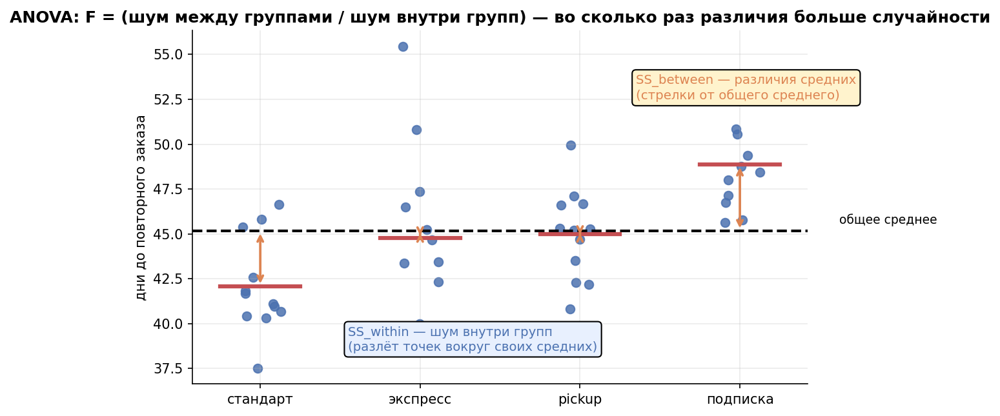
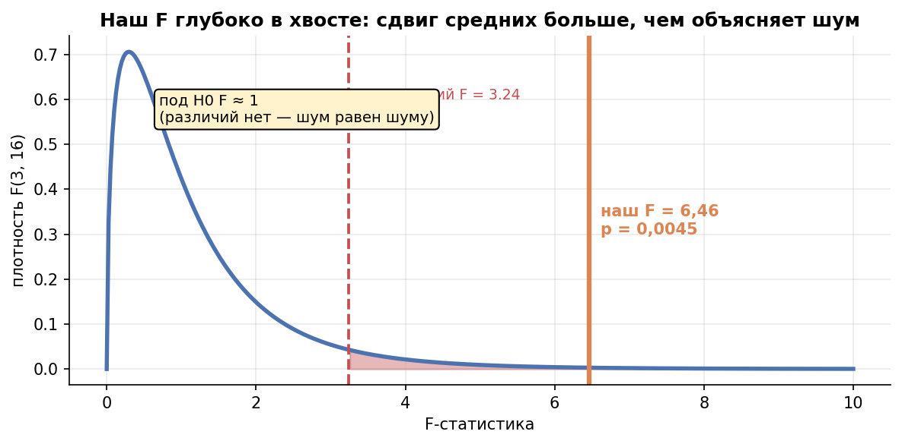
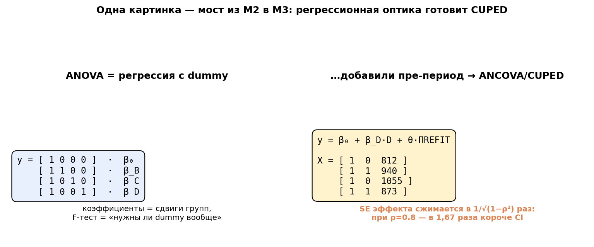

# Урок 2.5 — Дисперсионный анализ: мостик к регрессии и CUPED

**Цель урока:** уметь тестировать «хотя бы одна из $k>2$ групп отличается» одним омнибус-критерием (ANOVA: разложение $SS$, F-статистика «шум между / шум внутри»), знать fallback'и (Уэлч-ANOVA, Краскел–Уоллис) и post-hoc, и — главное — увидеть, что ANOVA это линейная регрессия с dummy-предикторами: оптика, из которой в М3.5 вырастут CUPED/ANCOVA.

## Зачем это аналитику

A/B/n-тест «ЕдаДома»: 4 варианта пост-заказного экрана «закажите снова» (A/B/C/D, D — агрессивный апселл), метрика — время до второго заказа. Первое желание — прогнать 6 попарных t-тестов. Но 6 проверок без поправки — это FWER $1-0{,}95^6 = 26\%$ (урок 2.4), а с поправкой Холма — мощность каждого сравнения режется. Нужен **один** тест на одну гипотезу: «все средние равны». Это и есть ANOVA.

Вторая причина важнее первой. ANOVA, записанная как регрессия, — это трамплин ко всему продвинутому арсеналу М3: добавить в дизайн-матрицу ковариату пре-периода — получите CUPED/ANCOVA (урок 3.5), добавить страты — пост-стратификацию, сегменты — их корректную поправку. Кто увидел ANOVA в матрице дизайна, тот М3 встретит во всеоружии.

## Теория

### 1. От попарных t к омнибусу

$k$ групп → $\binom{k}{2}$ попарных сравнений: 4 группы → 6, 5 групп → 10 (FWER 40%). Вместо россыпи — одна гипотеза:

$$H_0:\ \mu_1 = \mu_2 = \dots = \mu_k \qquad H_1:\ \text{хотя бы одна пара различается}$$

Заметьте: H1 не говорит, *какая* пара — «кто именно виноват» выясняют после (post-hoc). ANOVA отвечает только «есть ли вообще разница».

### 2. Механика: разложение вариативности и F

Вся вариативность данных раскладывается на две части:

$$SS_{total} = \underbrace{\sum_g n_g(\bar{x}_g - \bar{x})^2}_{SS_{between}\ (\text{между группами})} + \underbrace{\sum_g \sum_i (x_{gi} - \bar{x}_g)^2}_{SS_{within}\ (\text{внутри групп})}$$

- $SS_{between}$ — насколько *сдвинуты групповые средние* относительно общего среднего;
- $SS_{within}$ — обычный разброс юзеров внутри групп (шум).

Делим каждое SS на свои степени свободы ($df_b = k-1$, $df_w = n-k$) — получаем средние квадраты $MS_b$, $MS_w$ — и строим F-статистику:

$$F = \frac{MS_{between}}{MS_{within}} = \frac{\text{шум между}}{\text{шум внутри}}$$

Логика: если H0 верна, групповые средние «болтаются» ровно настолько, насколько позволяет внутригрупповой шум, и $F \approx 1$. Если хотя бы одна группа сдвинута — числитель растёт, и $F$ уходит в правый хвост F-распределения с $(k-1,\ n-k)$ степенями свободы. Большой F = «сдвиг средних больше, чем можно объяснить шумом».

При $k = 2$ ANOVA вырождается в t-тест: $F = t^2$ (числа в практике совпадают до четвёртого знака). ANOVA — прямое обобщение t-теста, а не что-то принципиально новое.

*Рис. 1. ANOVA: F = шум между группами / шум внутри групп — во сколько раз различия средних больше случайности.*

*Рис. 2. Под H0 F ≈ 1; наш F = 6,46 глубоко в хвосте — различия больше, чем объясняет шум.*

### 3. Допущения и запасные выходы

Классический ANOVA наследует допущения t-теста, но с нюансами приоритетов:

- **независимость наблюдений** — критично и не чинится формулами: юзер с пятью заказами в данных = кластер → F врёт; лечение — юнит рандомизации/анализа (М3.2);
- **гомоскедастичность** (равные дисперсии групп): при неравных $n$ её нарушение коварно — как у t Стьюдента в 2.2. Запасной выход — **Уэлч-ANOVA** (`scipy.stats.alexandergovern`, `pingouin.welch_anova`);
- **нормальность остатков**: при разумных $n$ в каждой группе ЦПТ прощает умеренную скошенность (как в 2.2), на крошечных группах с китами — нет. Запасной выход — **Краскел–Уоллис**: ранговый аналог ANOVA, обобщение Манн–Уитни на $k$ групп. Внимание, ловушка из 2.3 действует и здесь: KW проверяет стохастическое превосходство, а не «равенство медиан».

### 4. Post-hoc: кто именно отличается

Значимый F говорит «не все равны», но не называет виновника. Стандартные инструменты:

- **Тьюки HSD** — создан специально для «всех пар сразу», держит FWER на 5% (`statsmodels: pairwise_tukeyhsd`); даёт ещё и CI разностей;
- **попарные t + Холм** — универсальная альтернатива из 2.4: чуть гибче (можно брать только Уэлча, только сравнения с контролем);
- если нужны только сравнения «каждый вариант против контроля» — **Даннетт** (специальная поправка мощнее Тьюки для этой задачи).

В практике Тьюки и «попарные + Холм» на наших данных дали одинаковые выводы — так бывает почти всегда на простых данных; расхождения — на пограничных p.

### 5. Главное: ANOVA = линейная регрессия с dummy-предикторами

Закодируем группы дамми-переменными (A — референсная): дизайн-матрица $X = [\,1,\ D_B,\ D_C,\ D_M\,]$ и модель

$$y_i = \beta_0 + \beta_1 D_{B,i} + \beta_2 D_{C,i} + \beta_3 D_{D,i} + \varepsilon_i$$

Тогда МНК даёт: $\hat\beta_0 = \bar{x}_A$ (среднее референсной группы), $\hat\beta_j = \bar{x}_j - \bar{x}_A$ (разность со средним A), а F-тест «все $\beta_j = 0$» — это *в точности* F-статистика ANOVA. Проверка в практике: F и p совпали до четвёртого знака.

Зачем это видеть? Потому что в дизайн-матрицу можно **дописывать столбцы**:

- добавил столбец «выручка юзера в пре-периоде» → это **ANCOVA** = **CUPED** (М3.5): остаточная дисперсия падает, SE эффекта сжимается примерно в $1/\sqrt{1-\rho^2}$ раз при корреляции ковариаты с метрикой $\rho$ (в практике: $\rho = 0{,}8$ → SE эффекта сжался в 1,75 раза, теория 1,67);
- добавил дамми страт (город/платформа) → пост-стратификация (М3.5);
- тритмент не 0/1, а непрерывный «доза» → анализ dose-response.

Вся «магия» снижения дисперсии в М3 — это обычные столбцы дизайн-матрицы. Единственное правило: ковариата должна быть измерена **до** тритмента (эффекта теста в ней быть не должно), иначе оценка эффекта размывается.

*Рис. 3. Мост в М3: ANOVA — это регрессия с dummy; дописали столбец пре-периода — получили ANCOVA/CUPED с CI короче в 1/√(1−ρ²) раз.*

## Разбор на данных

A/B/n-тест 4 вариантов пост-заказного экрана, время до второго заказа (дни), $n = 5$ на группу (учебные числа, чтобы всё сошлось на салфетке):

| A | B | C | D |
|---|---|---|---|
| 10, 12, 14, 16, 18 | 12, 14, 16, 18, 20 | 11, 13, 15, 17, 19 | 18, 20, 22, 24, 26 |

Средние: A = 14, B = 16, C = 15, D = 22; общее среднее 16,75.

$$SS_{between} = 5\left[(14-16{,}75)^2 + (16-16{,}75)^2 + (15-16{,}75)^2 + (22-16{,}75)^2\right] = 5 \cdot 38{,}75 = 193{,}75$$

$$SS_{within} = \underbrace{40}_A + \underbrace{40}_B + \underbrace{40}_C + \underbrace{40}_D = 160$$

| источник | SS | df | MS | F | p |
|---|---|---|---|---|---|
| между группами | 193,75 | 3 | 64,58 | **6,46** | **0,0045** |
| внутри групп | 160,00 | 16 | 10,00 | | |
| итог | 353,75 | 19 | | | |

Отвергаем H0: не все варианты одинаковы. Доля объяснённой вариативности $\eta^2 = SS_b/SS_{tot} = 193{,}75/353{,}75 = 0{,}55$ — группа объясняет 55% разброса. Post-hoc (попарные t + Холм): D отличается от A (adj p = 0,006), C (0,015) и B (0,034); A, B, C между собой — нет. Вывод для бизнеса: агрессивный апселл (D) откладывает повторный заказ.

Руками же проверяется и механика уровня: под H0 (одна популяция) p-value ANOVA равномерен — «значим» ровно в 5% миров; а вот 6 попарных t на тех же мирах красятся в ~20–26% миров (зависимость сравнений чуть снижает формульные 26%).

## Подводные камни

1. **Попарные t без поправки при $k>2$.** Делают: «прогнал все пары, что прокрасилось — то и вывод». Грозит: FWER 26% при 4 группах, 40% при 5. Правильно: omnibus-ANOVA → post-hoc с контролем FWER (Тьюки/Холм/Даннетт).
2. **«ANOVA значим → все группы разные».** Грозит: одна пара различается, остальные шесть — нет (наши данные: виноват только D). Правильно: post-hoc обязателен; omnibus лишь «разрешает» вглядеться, не штрафуя множественностью (попарные после значимого omnibus уже «защищены» первой проверкой — но это не excuse их не поправлять).
3. **Кластеры наблюдений.** Делают: ANOVA по заказам, где у юзера их по несколько. Грозит: зависимость накручивает фиктивную уверенность, F раздувается. Правильно: юнит анализа = юнит рандомизации (М3.2); по юзерам, не по заказам.
4. **Неравные дисперсии + неравные n.** Как со Стьюдентом против Уэлча в 2.2: классический F едет по уровню. Правильно: Уэлч-ANOVA (или Краскел–Уоллис), особенно при несбалансированных группах.
5. **«Краскел–Уоллис сравнивает медианы».** Тот же миф, что с Манн–Уитни (урок 2.3): KW чувствителен к стохастическому превосходству; при разных формах распределений значимый KW возможен при равных медианах.
6. **Ковариата, заражённая тритментом.** Делают: в регрессионную ANOVA добавляют метрику, измеренную *после* начала теста. Грозит: ковариата «съедает» часть эффекта — оценка смещается к нулю. Правильно: только пре-периодные ковариаты (CUPED, М3.5), это же правило в дизайн-доке.

## Практика

Файл: `practice_2_5.py` (percent-формат, numpy/scipy/statsmodels/pandas, seed зафиксирован). Что делает:

1. **ANOVA руками** на 4×5 из разбора: SS, df, MS, F, p (+ $\eta^2$) + сверка с `scipy.stats.f_oneway` — полное совпадение.
2. **Под H0 p равномерен**: 3000 миров × 4 группы: доля p<0,05 у омнибуса ≈ 5%; 6 попарных t без поправки — FWER ≈ 20% (теория 26%, зависимость сравнений чуть снижает).
3. **F = t²**: ANOVA на двух группах против t-теста — совпадение статистик.
4. **ANOVA = регрессия**: dummy-кодировка + `numpy.linalg.lstsq` → те же F/p; коэффициенты = средние групп; бонус — добавили ковариату пре-периода (ρ = 0,8): MS остатка 10 → 3,25, SE эффекта D сжался в **1,75 раза** (теория $1/\sqrt{1-\rho^2} = 1{,}67$) — CUPED в миниатюре.
5. **Post-hoc**: попарные t + Холм (`multipletests`) и Тьюки HSD (`pairwise_tukeyhsd`) — одинаковые выводы: D ≠ A, B, C.

Графики: `practice_2_5_anova.png` (разложение SS между/внутри), `practice_2_5_puniform.png` (равномерность p под H0 и FWER попарных).

## Домашнее задание

1. Планируется тест с 5 вариантами. Сколько попарных сравнений получится и каков FWER без поправки при α = 5%?

Ответ

$\binom{5}{2} = 10$ сравнений; FWER $= 1-0{,}95^{10} = 40\%$. Почти половина «открытий» среди попарных — ожидаемо ложные. Отсюда: omnibus первым, потом Тьюки/Холм.

2. ANOVA на 4 группах ($n = 8$ на группу) выдала $SS_{between} = 150$, $SS_{within} = 360$. Посчитайте F и сделайте вывод (α = 0,05).

Ответ

$df_b = 3$, $df_w = 32$; $MS_b = 50$, $MS_w = 360/32 = 11{,}25$; $F = 50/11{,}25 = 4{,}44$. Критическое значение F(3; 32) на 5% ≈ 2,90, p ≈ 0,010 — отвергаем H0: не все средние равны. Кого именно — скажет post-hoc.

3. Докажите на пальцах, почему при двух группах $F = t^2$.

Ответ

При $k=2$: $MS_{between}$ пропорциональна квадрату разности средних $\left(\bar{x}_1 - \bar{x}_2\right)^2$, $MS_w$ — это знакомая оценка дисперсии из знаменателя t. Отношение «квадрат разности / оценка дисперсии разности» — это и есть $t^2$ (с точностью до множителя, съедаемого степенями свободы). Распределения согласованы: если $t \sim t_\nu$, то $t^2 \sim F_{1,\nu}$ — поэтому p-value совпадают. В практике: t = −1,0 → F = 1,0, p = 0,347 у обоих.

4. Вы записали ANOVA как регрессию с дамми и хотите ускорить тест. Опишите шаг к CUPED: какую колонку дописать, каким требованиям она должна удовлетворять и что произойдёт с SE коэффициента тритмента при корреляции ковариаты с метрикой ρ = 0,6?

Ответ

Дописываем столбец значения метрики (или её предсказания) в пре-периоде — измерённого до воздействия, без эффекта теста и одинаково определённого для всех групп. Регрессия «вычитает» из метрики предсказуемую по пре-периоду часть, остаточный шум падает: $MS_{within}$ умножается примерно на $(1-\rho^2) = 0{,}64$, а SE эффекта — на $\sqrt{1-\rho^2} = 0{,}8$, то есть сжимается в $1/0{,}8 = 1{,}25$ раза (при том же n мощность растёт; эквивалентно можно сэкономить ~36% выборки). Детали и ловушки — урок 3.5.

## Шпаргалка

1. $k$ групп → $\binom{k}{2}$ попарных тестов → FWER без поправки: 4 группы → 26%, 5 → 40%. Сначала — omnibus.
2. ANOVA H0: $\mu_1 = \dots = \mu_k$ («все равны»); H1: «хотя бы одна пара различается» — без уточнения, кто.
3. $F = \frac{MS_{between}}{MS_{within}}$ = «шум между / шум внутри»; при H0 $F \approx 1$, сдвиг средних гонит F в правый хвост F$(k-1, n-k)$.
4. $df_b = k-1$, $df_w = n-k$; $\eta^2 = SS_b/SS_{tot}$ — доля вариативности, объяснённая группой.
5. При $k=2$: $F = t^2$, p совпадают — ANOVA обобщает t-тест.
6. Допущения: независимость (критично, юнит = юнит рандомизации), гомоскедастичность (иначе Уэлч-ANOVA), нормальность остатков (иначе Краскел–Уоллис; но KW ≠ «тест медиан»).
7. Post-hoc: Тьюки HSD (все пары, FWER 5%) или попарные + Холм; против контроля — Даннетт. Omnibus значим ≠ «все разные».
8. ANOVA = регрессия $y = \beta_0 + \beta_1 D_B + \beta_2 D_C + \beta_3 D_D + \varepsilon$: $\hat\beta_0$ = среднее референсной группы, $\hat\beta_j$ = разность с ней; F-тест регрессии = F ANOVA.
9. Дописал в дизайн-матрицу пре-периодную ковариату → ANCOVA = CUPED (М3.5): SE эффекта × $\sqrt{1-\rho^2}$; ковариата — строго до тритмента.

## Источники

- Лагутин М.Б., «Наглядная математическая статистика», гл. 4 — дисперсионный анализ (одно- и двухфакторный), непараметрические аналоги — `materials/local/books.md` §2.
- Spanos A., «Probability Theory and Statistical Inference», гл. 14 — F-тесты и регрессионная постановка (подход Фишера/Неймана–Пирсона) — `materials/local/books.md` §3.
- shelter_analytics (В. Шереметьев), «CUPED под микроскопом», гл. 3–4 — CUPED как линейная регрессия, связь с ANCOVA, пре-период — https://telegra.ph/CUPED-pod-mikroskopom-Glavy-3-4-02-18 (`materials/telegram/shelter_analytics-digest.md`).
- Симулятор АБ-тестов (karpov.courses), урок 2 (t-критерий как частный случай, обзор критериев) и урок 9 (CUPED как регрессионная поправка) — `materials/local/ab-simulator.md`.
- Kohavi, Tang, Xu, «Trustworthy Online Controlled Experiments», гл. 17 — статистика t/F-тестов в экспериментах, множественность при сравнении вариантов — `materials/local/books.md` §1.
