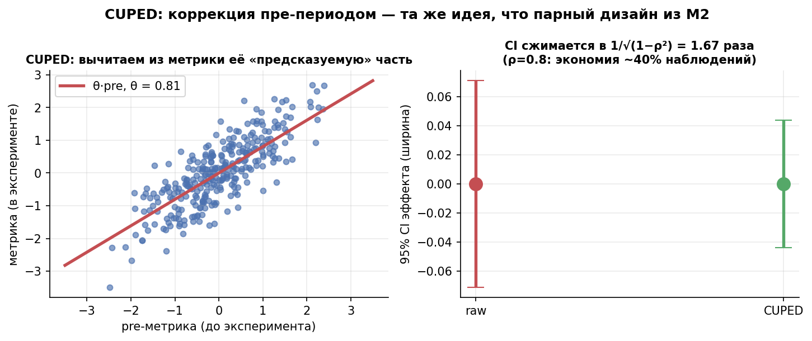
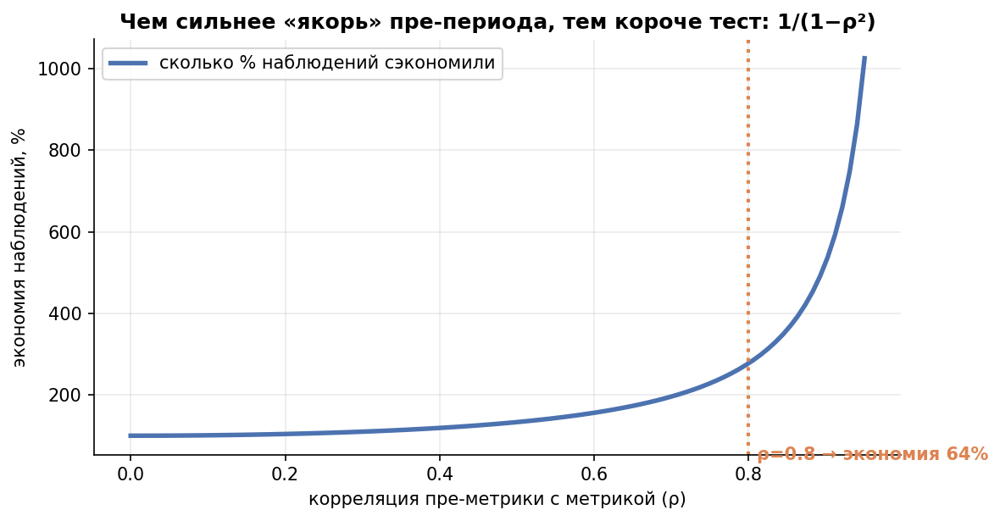

# Урок 3.5 — Снижение дисперсии: CUPED и семейство

**Цель урока:** уметь ускорять АБ-тесты, не меняя дизайн: CUPED — вычитание из метрики её «предсказуемой» пре-периодом части, $Y_{cv} = Y - \theta X$, $\theta = \mathrm{Cov}(X,Y)/\mathrm{Var}(X)$, с выводом $\mathrm{Var}(Y_{cv}) = \mathrm{Var}(Y)(1-\rho^2)$ через формулу дисперсии разности из 2.2. Знать, что CUPED = ANCOVA = регрессия с ковариатой (2.5), почему ковариата — строго до тритмента (наша симуляция: заражённая ковариата съела 51% эффекта), как выбирать длину пре-периода и как family расширяется: стратификация/пост-стратификация, линеаризация для ratio, ML-прогноз (задел на 3.6). Итог в деньгах: при ρ = 0,8 экономия 64% наблюдений — тест 14 дней превращается в 5.

## Зачем это аналитику

Урок 3.1 показал: n ~ σ². Урок 3.4 — как уменьшить σ, пожертвовав хвостом метрики. Но есть способ уменьшить шум, **ничего не выбрасывая из метрики**: у каждого юзера «ЕдаДома» уже есть история — выручка за 4 недели до теста, число заказов, город, платформа. Эта история предсказывает поведение в тесте (повторяющееся поведение: correlation трат до/после — симулятор, урок 9). Вычтем предсказуемую часть — останется чистый шум, и тот же эффект станет виден на выборке в разы меньше.

Цепочка ценности (X5, урок 4): меньше дисперсия → меньше выборка → быстрее тест → больше тестов за квартал при том же трафике. У X5 CUPED снял 42% дисперсии и срезал выборку с 570 до 330 на группу; в нашей практике (ниже) ρ = 0,8 даёт −64% наблюдений. Это самая «дорогая» тема модуля: каждый выигранный день теста — это дни, которые команда не ждёт.

И вторая причина: CUPED — это **та же регрессия из 2.5**, только без экзотики. Кто понял «дописал столбец пре-периода в дизайн-матрицу — получил ANCOVA», уже умеет CUPED. Урок собирает это в один фреймворк с стратификацией и линеаризацией.

## Теория

### 1. Идея и вывод: знакомая формула дисперсии разности

Парный дизайн из 2.2 экономил выборку, потому что «до» и «после» коррелируют: $s_d^2 = s_x^2 + s_y^2 - 2 r s_x s_y$ — вычитание $2 r s_x s_y$ гасит разброс. В классическом A/B пары нет: юзер либо в тесте, либо в контроле. Но у каждого юзера есть его **пре-метрика** $X$ (значение той же метрики до эксперимента) — «юзер сам себе контроль» ещё раз, теперь в роли ковариаты.

Определим скорректированную метрику $Y_{cv} = Y - \theta X$ и посчитаем её дисперсию — той же формулой разности из 2.2, только с коэффициентом $\theta$:

$$\mathrm{Var}(Y - \theta X) = \mathrm{Var}(Y) + \theta^2\mathrm{Var}(X) - 2\theta\,\mathrm{Cov}(X, Y)$$

Минимизируем по $\theta$ (приравниваем производную к нулю):

$$\theta^* = \frac{\mathrm{Cov}(X, Y)}{\mathrm{Var}(X)}, \qquad \mathrm{Var}(Y_{cv}) = \mathrm{Var}(Y) - \frac{\mathrm{Cov}^2(X,Y)}{\mathrm{Var}(X)} = \mathrm{Var}(Y)\,(1 - \rho^2)$$

где $\rho$ — корреляция ковариаты с метрикой. Это вся математика CUPED (Deng et al., 2013). Следствия:

- SE среднего сжимается в $1/\sqrt{1-\rho^2}$ раз: ρ=0,6 → ×1,25; ρ=0,8 → ×1,67 (наша симуляция: 1,23 и 1,66 — теория работает);
- нужный n падает в $1/(1-\rho^2)$ раз: экономия = ρ²: 36% и 64% наблюдений; тест 14 дней → 9 и 5 дней;
- парная разность «после − до» из 2.2 — частный случай с θ=1; CUPED просто подбирает θ под данные. При ρ→1 метрика почти детерминирована своей историей — и тесту почти не нужен шум.

Проверка несмещённости: рандомизация даёт $X \perp T$, поэтому $\theta\big(\bar{X}_{test} - \bar{X}_{ctrl}\big) \to 0$ — вычитание ковариаты не сдвигает ожидаемый эффект, только гасит шум. Отсюда же важное следствие: CUPED автоматически подчищает случайный дисбаланс сплита по ковариате (регрессия «вынимает» его из остатка).

*Рис. 1. CUPED: вычитаем «предсказуемую» часть метрики; CI сжимается в 1/√(1−ρ²) — та же идея, что парный дизайн из М2.*

*Рис. 1. CUPED: из метрики вычитается её предсказуемая по пре-периоду часть θ·X; в остатке — вертикальные отклонения от линии. При ρ = 0,8 CI эффекта сжимается в 1/√(1−ρ²) ≈ 1,67 раза: SE −40%, наблюдений −64%.*

### 2. Выбор ковариаты: пре-метрика — главный рецепт, и почему нельзя «пост»

Требования к ковариате: (а) измерена **до** начала теста — эффекта тритмента в ней быть не может; (б) сильно коррелирует с метрикой; (в) определена одинаково для всех юзеров обеих групп.

Главный рецепт: **значение той же метрики в пре-периоде**. Повторяющееся поведение — самый сильный предиктор: выручка юзера за 4 недели до теста коррелирует с выручкой в тесте на 0,7–0,9. Практические кандидаты: ARPU пре-периода, число заказов, давность регистрации, город/платформа (слабее — идут дополнением).

Почему нельзя взять «что-нибудь порелевантнее из эксперимента» — например, метрику первой недели теста (корреляция же выше!)? Потому что такая ковариата **заражена эффектом**: тестовая группа уже отличается от контроля, и вычитание $\theta X$ вычитает часть самого эффекта. Наша симуляция (практика, шаг 5): ковариата, содержащая 80% эффекта, дала оценку 0,098 при истинных 0,200 — **съедено 51% эффекта**, и SE при этом не лучше правильного CUPED. Это тот же подводный камень №6 из 2.5 («ковариата, заражённая тритментом»), теперь с числами.

Отдельно: длина пре-периода — компромисс (shelter, гл. 3–4). Длиннее — стабильнее ковариата и выше ρ (больше наблюдений усредняется); но слишком длинный пре-период захватывает «другой продукт» (сезонность, промо, другая аудитория) и слабее представляет текущее поведение — корреляция падает обратно. Практическое правило: пре-период той же длины, что и сам тест (± кратный цикл сезонности: 1–2 недели — минимум, 4 — часто оптимум), вплотную примыкающий к старту; ρ проверить на исторических данных до запуска.

### 3. CUPED = ANCOVA = регрессия с ковариатой

Из 2.5: ANOVA — это регрессия с dummy; CUPED — та же регрессия с дописанным столбцом пре-периода (ANCOVA):

$$Y_i = \beta_0 + \beta_1 T_i + \beta_2 X_i + \varepsilon_i$$

Тогда $\hat\beta_1$ (эффект) **в точности** равен разности средних $Y_{cv}$ по группам, а $\hat\beta_2 = \theta$. В практике: руками +0,10134, через OLS +0,10135 — совпадение до пятого знака. Три имени — одна оценка; выбирать надо не «метод», а способ отчёта: кому-то понятнее «метрика минус предсказание», кому-то — коэффициент регрессии.

Технические детали, которые спрашивают на собеседованиях (shelter, гл. 1–4):

- **θ считается на объединённых группах** (pooled). Рандомизация даёт одинаковые распределения X в группах, поэтому объединение честное и θ не вбирает эффект. Оценка θ отдельно в каждой группе добавляет шум и нестабильность.
- Центрирование X (вычитание $\bar{X}$) не меняет оценку эффекта — константа вычитается в обеих группах (проверено в практике); влияет только на «ноль» шкалы $Y_{cv}$.
- Оценка θ на тех же данных, что и тест, практически безвредна: это один параметр на n наблюдений; A/A-уровень держится (наш симуляционный уровень — 4,6%).
- Отсюда 4 строчки до **MultiCUPED** — нескольких ковариат сразу: Y ~ 1 + T + X₁ + ... + Xₖ; коэффициент при T всё так же несмещён, а остаток всё тише. Где брать много ковариат — ML-прогноз метрики по всей истории: это CUPAC, урок 3.6.

### 4. Стратификация и пост-стратификация: старшие родственники

**Стратификация** — дизайн-приём *до* рандомизации: юзеры заранее делятся на страты (город, платформа, формат магазина), и внутри каждой страты сплит 50/50 проводится отдельно. **Пост-стратификация** — спасение *на анализе*: группы уже сформированы случайно, но доли страт немного разъехались; оценка — взвешенное среднее страт-средних с генеральными весами:

$$\hat\Delta_{ps} = \sum_s w_s\left(\bar{y}^{(s)}_{test} - \bar{y}^{(s)}_{ctrl}\right), \qquad \sum_s w_s = 1$$

В нашей симуляции (3 города с разным уровнем трат, n = 3000): SE raw 0,0434 → пост-стратификация 0,0361 (−17%). А CUPED с непрерывной пре-метрикой — 0,0267 (−38%). Почему? **Пост-стратификация = CUPED с ковариатой-стратой**: регрессия Y ~ 1 + T + дамми_страт дала SE 0,0362 — то же самое взвешенное среднее с точностью до округления. А непрерывная пре-метрика несёт больше информации, чем три группы, поэтому и гасит больше шума (shelter, гл. 5–7: CUPED — обобщение стратификации). На практике: стратифицировать сплит заранее — хорошо (баланс по construction), но если сплит уже простой случайный, достаточно CUPED на анализе — выигрыш почти тот же, а инфраструктуры меньше.

### 5. Ratio-метрики: сначала линеаризация, потом CUPED

Средний чек = Σвыручка/Σчеков — метрика отношения, её нельзя разложить по юзерам, а CUPED работает с поюзерными величинами. Из 3.3 берём линеаризацию: сигнал юзера $L_i = R_i - R_{ctrl}\cdot K_i$ (выручка юзера минус контрольный чек × число его чеков); разность средних $L$ сонаправлена изменению ratio, p-value консистентны дельта-методу. Теперь $L_i$ — обычная поюзерная метрика, и на неё ложится весь арсенал: **CUPED по пре-значению линеаризованного сигнала** (Atlamos: связка «линеаризация + CUPED» внедрена в платформе Купера). Так собирается конвейер: линеаризация снимает структуру ratio, CUPED снимает повторяющийся шум, и комбинированный выигрыш перемножается.

### 6. Экономика: сколько дней и денег экономит CUPED

Считается напрямую: экономия наблюдений = ρ². При ρ = 0,8 (типично для ARPU с 4-недельным пре-периодом): −64% выборки; тест на 14 дней → 5 дней. При ρ = 0,6: −36% → 9 дней. Обратная сторона: чтобы сохранить MDE при урезанном трафике, платформа должна знать ρ заранее — его меряют на исторических данных при дизайне (и пере-проверяют на A/A).

Ориентиры из индустрии: X5 — дисперсия −42% (выборка 570 → 330 на группу); σ метрики 151 → 114 (CUPED) → 94 (CUPAC, ML-прогноз по 40 фичам — −61% против −43% у CUPED, ценой ML-инфраструктуры, урок 3.6). Симулятор (урок 9) начинает с того же: метрика-разность «до/после» снижает дисперсию в разы при сохранении эффекта — это CUPED с θ=1.

*Рис. 4. Чем сильнее «якорь» пре-периода, тем короче тест: экономия наблюдений = ρ² (при ρ=0.8 — 64%).*

*Рис. 2. Экономия наблюдений = 1/(1−ρ²): ρ=0,6 → 36%, ρ=0,8 → 64%, ρ=0,9 → 81%. Каждая сотая ρ на верхнем конце дорожит быстрее — поэтому борьба идёт за качество ковариаты (CUPAC, 3.6).*

## Разбор на данных

Тест «ЕдаДома»: умные рекомендации блюд в корзине. Метрика — ARPU (₽/юзер), эффект ожидается +2%. Преф-период — 28 дней до старта, ρ(ARPU_pre, ARPU_test) = 0,8 по историческим данным. Дизайн: α = 5%, мощность 80%.

**Дизайн без CUPED** (урок 3.1): в стандартизованных единицах (Δ = 0,02 при σ = 1) $n = 2(z_{0{,}975}+z_{0{,}8})^2/\Delta^2 = 2 \cdot (1{,}96+0{,}84)^2/0{,}02^2 \approx 39\,200$ юзеров на группу — 14 дней трафика (~2 800 юзеров в день на группу).

**Дизайн с CUPED**: n × (1−ρ²) = 39 200 × 0,36 ≈ 14 100 юзеров — 5 дней. Либо при тех же 14 днях MDE падает с 2,0% до 1,2% (эффект ×$\sqrt{1-\rho^2}$ = 0,6) — видны более тонкие изменения.

**Анализ** (симуляция с теми же параметрами, практика): при n = 1000 на группу мощность raw 32% → CUPED 74%; SE оценки ×1,66; оценка эффекта несмещённа (смещение +0,0007 при δ=0,1). Порядок действий аналитика: θ = Cov/Var на объединённых группах → $Y_{cv}$ → t-тест → эффект отчитан в исходных единицах метрики (CUPED не меняет масштаб эффекта, в отличие от винзоризации из 3.4!). A/A-уровень: 4,6% ложных срабатываний, p-value равномерен (KS p = 0,86) — процедура честна.

**Пост-стратификация по городам** на тех же данных: SE −17% (0,0434 → 0,0361) против −38% у CUPED (0,0267): город — грубая категория, а пре-ARPU — непрерывный «профиль» юзера. В отчёт идёт CUPED; страты остаются в дизайне сплита как гигиена.

## Подводные камни

1. **Ковариата, заражённая тритментом.** Делают: берут «порелевантную» ковариату из периода теста (метрика первой недели, клики на новую фичу). Грозит: ковариата коррелирует с эффектом → вычитание съедает эффект (наша симуляция: −51% оценки) — систематически заниженные результаты. Правильно: только пре-периодные ковариаты; всё, что измерено после старта, — табу.
2. **θ раздельно по группам или «подглядывание» θ.** Делают: считают θ в каждой группе отдельно или пересчитывают каждый день. Грозит: θ вбирает разницу групп (в т.ч. эффект), оценка плывёт. Правильно: θ один, на объединённых группах, в конце анализа; A/A-проверка процедуры обязательна.
3. **Слишком длинный или кривой пре-период.** Делают: пре-метрика за год («чтобы стабильнее») или захватывают период чужой распродажи. Грозит: ковариата описывает «другой продукт» — ρ падает, выигрыш испаряется. Правильно: пре-период вплотную к тесту, длиной с тест (± цикл сезонности), без аномальных событий; ρ проверить на истории.
4. **Новые юзеры без пре-истории.** Делают: молча выбрасывают юзеров без X или ставят X=0 всем. Грозит: X=0 — это «ниже среднего» для новичков, оценка эффекта на смешанной популяции искажается; доля новичков может различаться в группах. Правильно: imputation средним (X̄) по сегменту новичков — для них CUPED вырождается в raw; следить, чтобы доля непокрытых была одинаковой; в тестах на привлечение CUPED по пре-метрике почти не работает — там ковариаты-прокси (канал, платформа) или CUPAC-модель.
5. **CUPED напрямую на ratio-метрике.** Делают: CUPED-ят числитель и знаменатель по отдельности. Грозит: корректировки не собираются обратно в честный ratio, оценка смещена. Правильно: сначала линеаризация (3.3), CUPED — по линеаризованному поюзерному сигналу.
6. **«CUPED не помог — метод плохой».** Делают: берут слабую ковариату (ρ = 0,2), получают −4% дисперсии и разочаровываются. Грозит: метод списан, выигрыш потерян. Правильно: выигрыш = ρ² и зависит от качества ковариаты; если одна ковариата слаба — их много (регрессия с несколькими, ML-прогноз: CUPAC, урок 3.6); но если метрика не имеет истории (новый продукт), честно признать: снижать дисперсию нечем.
7. **Путают стратификацию и пост-стратификацию.** Делают: «мы применили стратификацию на анализе». Грозит: смешение дизайна и анализа: стратификация балансирует сплит до рандомизации, пост-стратификация лишь перевзвешивает после. Правильно: называть вещи именами; на случайном сплите пост-страт ≈ CUPED со стратой-ковариатой — и обычно проще взять CUPED с непрерывной пре-метрикой.

## Практика

Файл: `practice_3_5.py` (percent-формат, numpy/scipy/matplotlib/pandas, seed зафиксирован). Что делает:

1. **SE raw против SE CUPED** при ρ = 0,6/0,8 (400 миров): сжатие 1,23 и 1,66 против теории 1,25 и 1,67; экономия наблюдений ρ²; тест 14 дней → 9/5 дней; мощность при n = 1000: 32% → 74%.
2. **CUPED руками и через OLS**: θ = 0,807; разность средних $Y_{cv}$ = +0,10134 = коэффициент при T (+0,10135); центрирование X не меняет эффект.
3. **Пост-стратификация** (3 города): SE raw 0,0434 → взвешенное среднее 0,0361 → регрессия с дамми 0,0362 (то же) → CUPED с непрерывной пре-метрикой 0,0267.
4. **A/A-уровень CUPED**: 3000 миров, доля p<0,05 = 4,6%, p-value равномерен (KS p = 0,86).
5. **Неправильный CUPED** с пост-тритмент ковариатой (γ = 0,8): оценка 0,098 при истине 0,200 — съедено 51% эффекта; правильный пре-CUPED несмещён (0,2003) и точнее.

Графики: `practice_3_5_se.png` (сжатие SE против теории 1/√(1−ρ²)), `practice_3_5_bias.png` (равномерность A/A p-value + смещение неправильной ковариаты).

## Домашнее задание

1. Посчитайте сжатие SE и экономию наблюдений для ρ = 0,5; 0,7; 0,9. Для скольких дней теста хватит 14 дней при ρ = 0,9?

Ответ

Сжатие SE = 1/√(1−ρ²): ρ=0,5 → 1,15; 0,7 → 1,40; 0,9 → 2,29. Экономия наблюдений = ρ²: 25%, 49%, 81%. При ρ = 0,9 тест 14 дней сжимается до 14·(1−0,81) ≈ 2,7 → ~3 дней. Заметьте нелинейность: между ρ=0,5 и ρ=0,9 выигрыш растёт с 1,4× до 4,8× по выборке — качество ковариаты решает сильнее, чем кажется.

2. Выведите Var(Y_cv) = Var(Y)(1−ρ²) из формулы дисперсии разности (2.2), не подглядывая в урок.

Ответ

Var(Y−θX) = Var(Y) + θ²Var(X) − 2θCov(X,Y). Производная по θ: 2θVar(X) − 2Cov = 0 → θ* = Cov/Var(X). Подставляем: Var(Y_cv) = Var(Y) + Cov²/Var(X) − 2Cov²/Var(X) = Var(Y) − Cov²/Var(X). Делим Cov²/Var(X) на Var(Y): Cov²/(Var(X)Var(Y)) = ρ². Итого Var(Y)(1−ρ²). Геометрия: это остаток регрессии Y на X — «то, что X не объясняет».

3. Аналитик предлагает ускорить тест так: ковариата — ARPU за первую неделю эксперимента («корреляция с итоговым ARPU аж 0,95!»). Что не так и что покажет симуляция такого CUPED?

Ответ

Ковариата измерена после старта и содержит эффект тритмента: у тестовой группы первая неделя уже «подкрашена» фичей. Вычитание θX вычитает часть эффекта — оценка смещается к нулю. В нашей симуляции (γ=0,8) съедено 51% эффекта; при γ→1 эффект исчезает полностью. Высокая корреляция здесь — признак проблемы, а не качества: «0,95 с метрикой» у пост-тритментной ковариаты означает «0,95 с эффектом». Только пре-период.

4. Почему θ считается на объединённых группах и почему это не смещает оценку эффекта?

Ответ

Рандомизация даёт X ⊥ T: распределения ковариаты в группах одинаковы, поэтому объединённая оценка θ описывает одну и ту же популяцию и не «настроена» на разницу групп. Смещения нет, потому что E[θ̄X_test − θ̄X_ctrl] = θ·E[X̄_test − X̄_ctrl] = 0 при X⊥T — вычитается только шум. Оценка θ в каждой группе отдельно добавляет лишнюю случайность (две шумные оценки вместо одной) и при наличии эффекта частично вбирает его.

5. Тест на новых пользователях (трафик из рекламной кампании): у 40% юзеров нет пре-истории. Что делать с CUPED и каким будет выигрыш?

Ответ

Для новичков — imputation средним ковариаты их сегмента (источник, платформа): для них корректировка вырождается в константу, работает raw-оценка; главное — правило одинаково в группах и доля непокрытых мониторится как инвариант. Общий выигрыш масштабируется долей покрытых: при ρ=0,8 на 60% юзеров экономия ≈ 0,6·64% ≈ 38% наблюдений вместо 64%. Дальше — ковариаты, доступные даже без истории (канал, девайс, время регистрации) и ML-прогноз (CUPAC, урок 3.6).

## Шпаргалка

1. CUPED: $Y_{cv} = Y - \theta X$, $\theta = \mathrm{Cov}(X,Y)/\mathrm{Var}(X)$; $\mathrm{Var}(Y_{cv}) = \mathrm{Var}(Y)(1-\rho^2)$ — вывод через формулу дисперсии разности (2.2).
2. Выигрыш: SE × $\sqrt{1-\rho^2}$; экономия наблюдений = ρ² (0,6 → 36%, 0,8 → 64%, 0,9 → 81%); 14 дней → 5 при ρ = 0,8.
3. Ковариата: та же метрика в пре-периоде; измерена до теста, определена одинаково для всех; θ — на объединённых группах, центрирование X на эффект не влияет.
4. Ковариата из эксперимента = заражённая: смещение к нулю (наша симуляция: −51% эффекта при γ = 0,8).
5. CUPED = ANCOVA = регрессия Y ~ 1 + T + X: коэффициент при T равен разности средних $Y_{cv}$; ковариат много — MultiCUPED/CUPAC (3.6).
6. Преф-период: вплотную к тесту, длиной с тест (± сезонный цикл); слишком длинный = «другой продукт», ρ падает.
7. Стратификация — до рандомизации (баланс сплита); пост-стратификация — на анализе (взвешенное среднее) = CUPED со стратой-ковариатой; непрерывная пре-метрика сильнее категорий.
8. Ratio: сначала линеаризация ($L_i = R_i - R_{ctrl}K_i$), затем CUPED по L — связка даёт поюзерный сигнал и снижение дисперсии одновременно.
9. Новички без истории: imputation средним сегмента, доля непокрытых — инвариант; выигрыш масштабируется долей покрытых.
10. Проверка перед боем: A/A-уровень CUPED ≈ 5% + равномерность p-value; масштаб эффекта не меняется (в отличие от винзоризации 3.4).

## Источники

- shelter_analytics (В. Шереметьев), «CUPED под микроскопом»: гл. 1–2 (вывод θ, оценка, теоремы), гл. 3–4 (CUPED = регрессия/ANCOVA, MultiCUPED, выбор пре-периода), гл. 5–7 (CUPED для ratio, обобщение стратификации, пост-нормировка) — https://telegra.ph/CUPED-pod-mikroskopom-Glavy-1-2-02-02-2 (`materials/telegram/shelter_analytics-digest.md`).
- Deng A., «Causal Inference...», гл. 10 «Improving Metric Sensitivity» — variance reduction, CUPED, ρ², связь с ANCOVA/regression adjustment — https://alexdeng.github.io/causal/sensitivity.html (`materials/web/alexdeng-causal-book.md`).
- Deng A., Xu Y., Kohavi R., Longbotham R. «Improving the Sensitivity of Online Controlled Experiments by Utilizing Pre-Period Data» (CUPED, 2013) — первоисточник формулы.
- Симулятор АБ-тестов (karpov.courses), урок 9 «CUPED» — повторяющееся поведение, diff-метрика, ковариаты на платформе — `materials/local/ab-simulator.md`.
- X5 Product Analytics Academy, урок 4 — CUPED/CUPAC: дисперсия −42%, выборка 570→330, σ 151→114→94 — `materials/local/x5-product-analytics.md`.
- Atlamos (Habr), «Линеаризация: зачем и как укрощать ratio-метрики» — связка линеаризация + CUPED в платформе Купера — https://habr.com/ru/companies/kuper/articles/768826/ (`materials/web/web-articles.md`).
- Уроки 2.2 (парный дизайн, $s_d^2 = s_x^2+s_y^2-2rs_xs_y$) и 2.5 (ANOVA = регрессия, ANCOVA-мостик) — наш внутренний фундамент.
