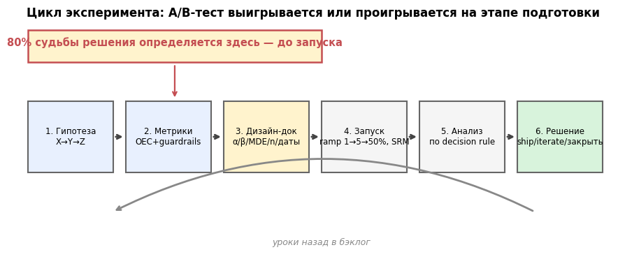
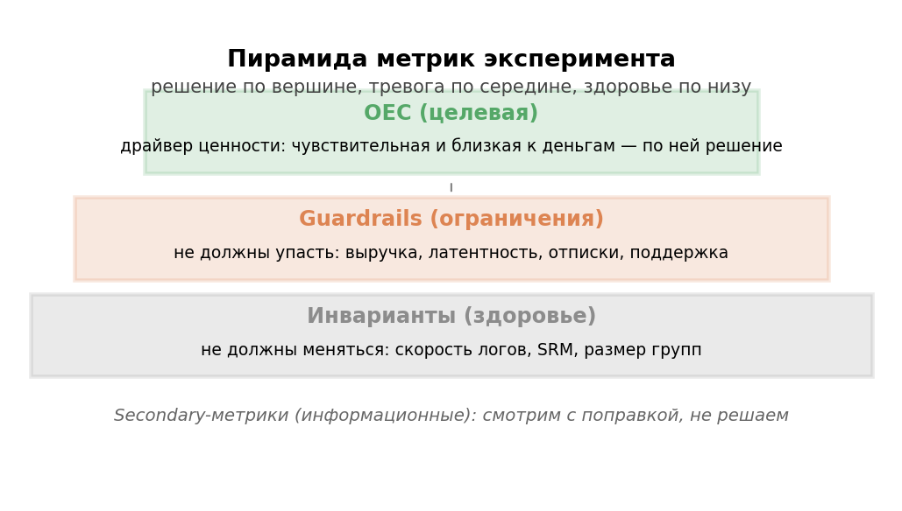
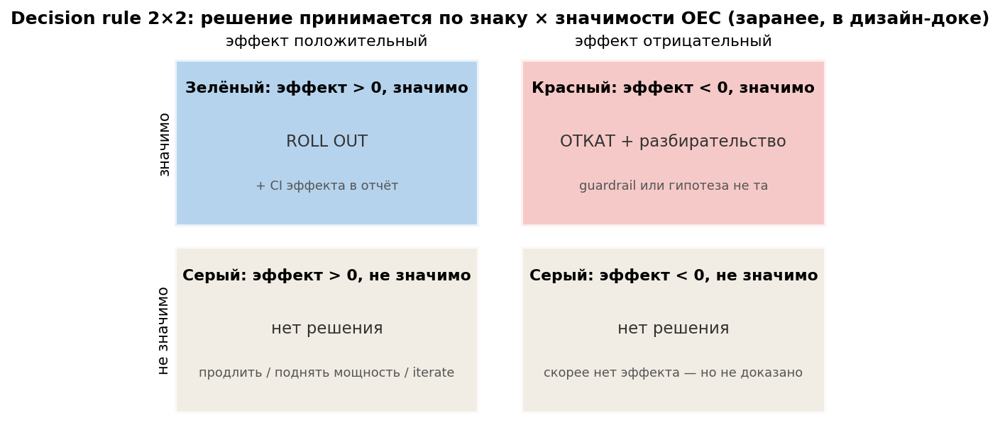

# Урок 4.1 — Цикл эксперимента: от гипотезы до решения

**Цель урока:** собрать разрозненный статаппарат М3 (MDE и мощность — 3.1, юниты — 3.2, чувствительность — 3.4–3.6) в полный производственный цикл эксперимента. Уметь формулировать гипотезу «потому что X → изменится Y → выиграет Z», выбирать OEC — одну метрику решения — по двум осям (чувствительность и близость к деньгам, драйвер против прокси), назначать guardrails с порогами и инварианты; писать decision rule 2×2 (знак эффекта × значимость) и политику «нет решения» **до** запуска; планировать ramping 1%→5%→50%→100% как страховку от инцидентов; собирать дизайн-док по чек-листу из 10 пунктов (генератор — в практике). И понимать, ради чего всё это: лишь около ⅓ идей выигрывают (Kohavi, KDD'13) — наша симуляция квартала: «катим всё» ≈ −0,2% итогового эффекта, тесты случайных 12 идей +9,2%, тесты по приоритету +17,2% при той же мощности платформы.

## Зачем это аналитику

«ЕдаДома» выросло: три продакт-команды, бэклог из двух десятков идей, трафика на все не хватит. Продакт приносит: «Давай протестируем новую выдачу». Что именно тестируем? По какой метрике решаем? Что если она вырастет, а латентность просядет? А если ничего не вырастет — продлеваем? Без зафиксированных ответов это «коллективное гадание» (X5, урок 3): тест запустят, через две недели поспорят о результате и примут решение по самому громкому голосу (HiPPO). Противоядие — дизайн-док: контракт между продактом и аналитиком, подписанный до запуска. В 3.1 мы научились считать n; этот урок — про весь конвейер, из которого n — один винтик.

И это не бюрократия, а экономика. По данным Microsoft/Bing (Kohavi, KDD'13) лишь около **⅓** проверенных идей улучшают целевые метрики, ⅓ нейтральны и ⅓ вредят. Интуиция команды систематически переоценивает свои идеи — значит, машина экспериментов в первую очередь дёшево **отстреливает плохие идеи** (X5: раскат «убрать регистрацию» без теста стоил ≈140 млн ₽/кв). Скорость обучения — число проверенных идей за квартал — и есть главный продукт платформы; поэтому в этом модуле мы сначала построим цикл (этот урок), потом инфраструктуру сплитов (4.2), потом научимся не верить сломанным тестам (4.3) и доводить результат до решения (4.4).

*Рис. 3. Цикл эксперимента: 80% судьбы решения — до запуска.*

## Теория

### 1. Гипотеза: «потому что X → изменится Y → выиграет Z»

Рабочий фрейм (X5, урок 3; Симулятор, урок 7): у каждой идеи есть три части — **X** — наблюдение о пользователе и механика изменения («что делаем и почему это должно сработать»), **Y** — наблюдаемая метрика, которая изменится, **Z** — бизнес-ценность, ради которой всё затевается.

- «Переделаем главную» — не гипотеза: нет ни Y, ни Z.
- «Поднимем конверсию» — не гипотеза: нет X — *почему* она должна подняться?
- «Юзеры не находят самые быстрые рестораны (медиана поиска 4,2 мин, 31% сессий не доходит до карточки — X) → сортировка по времени доставки поднимет конверсию в заказ (Y) → больше заказов и выручки, заказы — драйвер выручки, а не прокси (Z)» — гипотеза.

Зачем фрейм: (а) X делает гипотезу **фальсифицируемой** — ясно, что именно проверяем и когда признаем поражение; (б) Z защищает от оптимизации не того — если Z «выручка», а фича двигает только CTR, решение «катить» надо обосновывать отдельно; (в) Y без Z — это diagnostic-метрика, а не цель. Тест без гипотезы — «коллективное гадание»: все метрики «интересные», победителя выбирают задним числом — это p-hacking из урока 2.4.

### 2. OEC: одна метрика решения и две оси выбора

**OEC** (Overall Evaluation Criterion, Kohavi, гл.7) — метрика, по которой принимается решение о раскатке. Одна: две «главные» метрики — это уже отсутствие критерия (какая победит при конфликте?). Хороший OEC балансирует на двух осях:

1. **Близость к ценности.** Идеал — сама ценность (выручка, LTV), но она медленная и шумная. Тогда OEC — **драйвер**: метрика, через которую изменение реально приносит ценность (заказы → выручка: больше заказов — больше денег, почти механически). **Прокси** — коррелирующий заместитель: retention 7d ↔ LTV (корреляция 0,8 — валидный прокси, X5), time-on-page — сломанный: «+30%» может означать «не могут найти кнопку». Опасность прокси — закон Гудхарта: метрика, ставшая целью, перестаёт быть хорошей мерой; CTR «поднимается» кликбейтом, не добавляя денег.
2. **Чувствительность.** OEC обязан двигаться экспериментами и ловиться вашим n. Тонкость (Deng, гл.10): чувствительность — это не только SE метрики, а пара «MDE × типичный эффект вашей механики»: UI-фичи двигают CTR/CR на ~10%, а выручку — на ~3% (эффект размывается по чеку). MDE 12% на выручке = тест не увидит рабочую фичу.

Треугольник ограничений (Симулятор, урок 7): по близости к деньгам LTV > средний чек > CTR; по скорости сбора CTR > LTV; по достоверности покупки > просмотры > отзывы. «Выберите два из трёх» — и осознанно жертвуйте третьим. Численный разбор выбора — ниже, в «Разборе на данных» и в практике: CTR даёт MDE 3,8%, конверсия в заказ — 9,4%, выручка на юзера — 16,7% (после винзоризации P99 — 12,8%, с CUPED — 15,1%) при типичных эффектах 10/10/3%.

*Рис. 2. Пирамида метрик: решение по OEC, тревога по guardrails, здоровье по инвариантам — кандидатов в OEC оцениваем по чувствительности и близости к деньгам.*

### 3. Guardrails и инварианты: что не должно упасть и что не должно шевельнуться

**Guardrails** — 3–5 сторожевых метрик, которым разрешено меняться в пределах порогов, фиксированных заранее: латентность p95 (+<100 мс — скорость конвертируется в деньги, Kohavi гл.5), отписки от пушей (+<5% отн.), доля отмен заказов (+<0,3 п.п.), crash-free rate, нагрузка на саппорт. Порог guardrail — часть дизайн-дока, а не «посмотрим, насколько плохо».

**Инварианты** (метрики качества данных, Kohavi гл.6, 21) — не должны меняться **вообще**: доля юзеров без единого события, скорость загрузки логов, число событий на юзера, и — SRM, соотношение выборок (урок 4.2). Логика: фича про еду не может поменять скорость отправки логов; если поменяла — сломан пайплайн, и «эффект» в метриках — артефакт. Инварианты мониторятся во время теста, guardrails — тоже, OEC — читается в конце (peeking, 3.7).

### 4. Decision rule 2×2 и политика «нет решения»

Правило решения пишется **до** запуска (X5: «decision rule до теста — иначе это подгонка под результат»). Матрица «знак эффекта × значимость»:

| | guardrails целы | guardrail просел |
|---|---|---|
| **OEC значимо ↑** | SHIP: 50% → 100% | не катим: разбор trade-off (сколько стоит просевший guardrail) |
| **OEC значимо ↓** | ROLLBACK (откат) | ROLLBACK + разбор, почему не увидели заранее |
| **OEC незначим** | «нет решения» | «нет решения» + вопрос к дизайну |

Политика «нет решения» — самая важная строка, потому что значимая треть матрицы встречается редко. Незначимый результат — не «эффекта нет» (урок 2.1), а «не увидели». Разрешённые действия: **один** заход углубления — сегменты и вторичные метрики с поправкой на множественность (2.4), чтение CI («эффект больше X маловероятен»); продление — только как **новый** тест с новым дизайн-доком или заранее выбранной sequential-схемой (3.7); дальше — закрыть и записать в архив. Пограничный p=0,049 — не победа: α — конвенция, и «раскатить на 50%, повторить тест» честнее, чем трактовать шум как выигрыш (X5: раскат на p=0,049 стоил −15% retention, ~60 млн ₽ LTV).

*Рис. 1. Decision rule 2×2 пишется до запуска — после результатов это уже рационализация.*

### 5. Ramping: 1% → 5% → 50% → 100%

Постепенная раскатка — страховка от инцидентов, не инструмент статистики. Схема «ЕдаДома»: **1%** на день (canary): краши, латентность, телеметрия — технические инварианты; **5%** на 2 дня: guardrails под контролем, SRM-чек зелёный; **50%** — полный тест: с этого момента копится n и тикает длительность из дизайн-дока; **100%** — после решения по decision rule. Триггеры отката (какой guardrail и насколько плох) фиксируются заранее. На рампе нельзя оценивать эффект: на 1% MDE гигантский, а SRM-детектор слеп на малых N (урок 4.2 покажет это кривой мощности). Kohavi (гл.15) разбирает рампинг глубже — включая эффекты нагрузки и «разгон» до 100% после решения; canary-деплой как частный случай — Симулятор, урок 10.

### 6. Дизайн-док: чек-лист до запуска

Всё выше собирается в один документ — дизайн-док (шаблон X5 «pre-flight» + наш статаппарат из М3):

1. **Гипотеза X→Y→Z** — фальсифицируемая, с числами в X.
2. **OEC** — одна + обоснование: драйвер или прокси, почему ловится.
3. **Guardrails с порогами** (3–5) + **инварианты**.
4. **Юнит рандомизации = юнит анализа** (3.2; если нет — кластерные SE).
5. **α, мощность, MDE из экономики** (3.1: минимальный эффект, при котором бизнес катит фичу).
6. **σ² по пре-периоду** той же длины; n с запасом 5–10%.
7. **Длительность целыми неделями**, дата старта (не пятница), календарь набора.
8. **Критерий остановки**: fixed horizon; если sequential — какая схема (3.7).
9. **Decision rule 2×2** + ramp-план с триггерами отката.
10. **Владелец решения**; ссылка на архив тестов — институциональная память (Kohavi, гл.8: мета-анализ прошлых тестов окупает платформу).

Практика урока реализует генератор такого документа: на вход гипотеза, метрики и MDE — на выходе n, даты, decision rule и ramp.

### 7. Культура: ⅓ идей выигрывают — зачем вообще тестировать

Число, которое надо выучить: по Microsoft/Bing (Kohavi, KDD'13) выигрышных идей — около ⅓; в Google на заре экспериментации — ~10–20%. Следствия: (а) интуиция даже сильных команд систематически оптимистична — «очевидно хорошая» идея в среднем нейтральна или вредна; (б) проигранный тест — не провал, а сэкономленные деньги (чистая ценность информации); (в) проигрышные идеи несут информацию о пользователе — если их записывать (архив, мета-анализ); (г) скорость команды определяется пропускной способностью платформы: слои для параллельных тестов (4.2), чувствительные метрики и CUPED (3.5), приоритизация бэклога. Симуляция из практики: 24 идеи за квартал, платформа тянет 12 тестов — «катим всё» заканчивает квартал около нуля (−0,2%), случайные 12 тестов дают +9,2%, топ-12 по приоритету — +17,2%. Тестирование — это не тормоз для команды, а единственный известный способ расти быстрее, чем «катим и молимся».

## Разбор на данных

Собираем дизайн-док «Умная сортировка главной по времени доставки» (полный текст печатает `practice_4_1.py`). Гипотеза: X — медиана поиска 4,2 мин, 31% сессий не доходит до карточки; Y — конверсия в заказ (окно 2 недели); Z — выручка через заказы-драйвер.

**Выбор OEC по чувствительности** (пре-период 20 000 юзеров, n = 8 000/группу):

| кандидат | среднее | CV | MDE (отн., n=8k) | типичный эффект | corr с выручкой | вердикт |
|---|---|---|---|---|---|---|
| CTR: открыл карточку (нед.) | 57,6% | 0,86 | 3,8% | ~10% | 0,11 | чувствительный прокси |
| Конверсия в заказ (2 нед.) | 18,3% | 2,11 | 9,4% | ~10% | 0,56 | **драйвер — OEC** |
| CR + CUPED (пре-CR) | 18,3% | 2,01 | 8,9% | ~10% | 0,50 | усиление OEC |
| Выручка/юзер (2 нед.) | 230 ₽ | 3,77 | 16,7% | ~3% | 1,00 | не видит фичу |
| Выручка винзор. P99 | 201 ₽ | 2,89 | 12,8% | ~3% | 0,87 | всё ещё не видит |
| Выручка + CUPED | 230 ₽ | 3,40 | 15,1% | ~3% | 0,90 | всё ещё не видит |

Как читать: CTR ловит всё, но корреляция с выручкой 0,11 — Гудхарт смотрит на вас; выручка — сами деньги, но MDE 12,8–16,7% против типичных эффектов 3% — тест увидит только катастрофу или чудо; конверсия — драйвер (corr 0,56), ловит свои типичные эффекты, CUPED докручивает до 8,9%. Решение: **OEC = конверсия в заказ, выручка — в guardrails** (финальная проверка на длинном окне, холдаут — 4.5), CTR — diagnostic. Отдельный урок таблицы: винзоризация (3.4) и CUPED (3.5) тянут выручку вниз по MDE, но хвост тяжёл — не вытянуть; зато на CR CUPED работает (ρ = 0,31 между окнами — на бинарных метриках скромно, на непрерывных бывает 0,6+).

**Расчёт n** (формула 3.1): p₀ = 23%, MDE +1,5 п.п. (+6,5% отн., экономика: раскат окупается от +1,2 п.п.), α = 5%, мощность 80%: n = 2·(1,96+0,84)²·0,177/0,015² = 12 360 → с запасом 5% — **12 978 юзеров на группу**, 3 полные недели (25 956 < 35 100), 05.10.2026 (пн) → 25.10.2026. То же относительное окно на недельной конверсии (3.1) стоило бы 16 577 на группу — окно метрики тоже инструмент чувствительности. Guardrails: p95 латентности (+<100 мс), отписки (+<5% отн.), отмены (+<0,3 п.п.). Decision rule — матрица из §4, ramp 1→5→50, владелец — продакт каталога. Документ готов: теперь его нельзя «немного поправить по ходу» — можно только закрыть и открыть новый.

## Подводные камни

1. **Тест без гипотезы.** Делают: «запустим, там видно». Грозит: все метрики «интересные», победителя выбирают задним числом — p-hacking (2.4); непонятно, что считать провалом. Правильно: X→Y→Z письменно до запуска; тест без Y и Z — не тест, а наблюдение.
2. **OEC = выручка, «потому что деньги».** Делают: целевая метрика — ARPU/выручка на юзера. Грозит: CV 3–4 → MDE 13–17% при типичных эффектах 2–4% — рабочая фича всегда «не прокрашивается», команда перестаёт верить тестам. Правильно: OEC — драйвер (конверсия, заказы), деньги — в guardrails и длинные окна (4.5).
3. **OEC = CTR, «потому что чувствительный».** Делают: метрика решения — клики/просмотры. Грозит: Гудхарт — оптимизируем кликбейт; корреляция с деньгами ~0,1. Правильно: чувствительный прокси — diagnostic-метрика для понимания механики, не для решения.
4. **Guardrails без порогов.** Делают: «посмотрим, не просело ли что-нибудь». Грозит: после теста любой сдвиг трактуется в пользу желаемого решения («отписки на 14% — приемлемая цена»). Правильно: порог и цена проседания — в дизайн-доке до запуска.
5. **Decision rule по факту.** Делают: увидели значимый плюс в OEC — катят, не глядя на guardrails; или незначимость трактуют как «нет эффекта». Грозит: раскат вреда (X5: −15% retention на p=0,049); хороните непрокрасившиеся рабочие фичи. Правильно: матрица 2×2 подписана до запуска; «нет решения» — валидный исход с протоколом углубления.
6. **«Нет решения» лечат продлением.** Делают: p = 0,3 на второй неделе → «продлим ещё на две, авось наберёт». Грозит: peeking — фактическое α 20–30% (3.7). Правильно: фиксированный горизонт; потребность в ранней остановке — sequential-схемы, выбранные заранее.
7. **Ramp как «маленький тест».** Делают: смотрят эффект на 1–5% и делают выводы. Грозит: MDE на малой доле гигантский, SRM-детектор слеп (4.2) — «тихий» инцидент и бессмысленные цифры. Правильно: рамп — для инцидент-безопасности (краши, латентность, guardrails), статистика живёт на полном тесте.

## Практика

Файл `practice_4_1.py` (percent-формат, numpy/scipy/matplotlib/pandas, seed зафиксирован). Три блока:

1. **Генератор дизайн-дока**: `build_design_doc()` принимает гипотезу X→Y→Z, OEC (p₀), MDE, guardrails → выдаёт полный документ: n (двухвыборочная формула 3.1 + запас 5%), длительность целыми неделями, даты (pandas), decision rule 2×2, ramp-план, критерий остановки. Прогоняются два теста: сортировка (n = 12 978, 3 недели) и пуш о брошенной корзине (p₀ = 6,2%, n = 9 586, 2 недели — сравнение чувствительностей: на тот же относительный MDE +8,3% редкой метрике нужно 34 474 юзера на группу).
2. **Симуляция «⅓ идей выигрывают»**: 24 идеи (⅓ выигрышных, ⅓ нейтральных, ⅓ вредных), платформа тянет 12 тестов за квартал, три стратегии. Результаты запуска: доля выигрышных 36,7%; итог квартала — «катим всё» −0,2%, «тестируем случайные 12» +9,2%, «тестируем топ-12 по приоритету» +17,2%; вредных раскаток 0. График `practice_4_1_third_wins.png`.
3. **Выбор OEC**: синтетика пре-периода (20 000 юзеров, коррелированные метрики), SE/MDE/CV/корреляции шести кандидатов (таблица из «Разбора»), CUPED и винзоризация как усилители. Итог: OEC = конверсия, выручка не видит свои типичные эффекты даже усиленной; при n дизайн-дока MDE CR = 7,4% < 10%. График `practice_4_1_oec_map.png`.

## Домашнее задание

**Задача 1.** Сформулируйте гипотезу X→Y→Z для идеи «скидка 100 ₽ на первый заказ в приложении» и назначьте OEC, три guardrails с порогами и два инварианта.

Ответ

X: 40% установивших приложение не доходят до первого заказа — барьер цены доставки; Y: скидка на первый заказ поднимет конверсию установок в первый заказ; Z: LTV когорты новичков вырастет (привлечение окупается позже). OEC: конверсия в первый заказ в течение 7 дней после установки (драйвер LTV). Guardrails: повторные заказы в течение 30 дней (−<5% отн. — не приучаем ждать скидок), средний чек первого заказа (−<5 ₽), маржа маркетинга. Инварианты: SRM-чек, доля установок без единого события. Слабое место гипотезы — Z: скидка может сдвигать вперёд, а не создавать заказы — вот это и проверяет guardrail повторных заказов.

**Задача 2.** OEC «конверсия в заказ (2 недели)» с p₀ = 23%, MDE +1,5 п.п., α = 5%, мощность 80%. Сколько юзеров на группу и сколько полных недель при 11 700 юзерах в неделю на обе группы?

Ответ

σ² = 0,23·0,77 = 0,177; n = 2·(1,96+0,84)²·0,177/0,015² = 12 360; с запасом 5% — 12 978. Нужно 25 956 юзеров, неделя даёт 11 700 → 2,2 недели → округляем вверх до **3 полных недель** (35 100). Сравните: недельная конверсия при p₀ = 12% на тот же относительный MDE +8,3% требовала 16 577 на группу (урок 3.1) — расширение окна метрики почти вдвое экономит выборку.

**Задача 3.** Кандидат в OEC: «доля юзеров, открывших карту ресторана», p₀ = 62%. Типичный эффект таких механик +6% отн. Ловит ли его тест с 8 000 юзерами на группу (α = 5%, мощность 80%)?

Ответ

σ = √(0,62·0,38) = 0,485; SE разности = 0,485·√(2/8000) = 0,00767; MDE = 2,80·0,00767 = 2,1 п.п. = **3,5% отн.** < 6% — ловит, с запасом. Но корреляция с выручкой у таких прокси ~0,1–0,3: как OEC не годится (Гудхарт), как diagnostic — отличная.

**Задача 4.** Тест закончился: OEC +2,1% (p = 0,03), отписки от пушей +14% при пороге guardrail +5%. Какое решение по матрице 2×2? Что посчитать перед разбором trade-off?

Ответ

Строка «OEC значимо ↑», столбец «guardrail просел» → **не катим**, разбор trade-off. Посчитать: сколько стоит +2,1% OEC в деньгах за горизонт (например, квартал) и сколько стоит +14% отписок (упущенная выручка отписавшихся × их доля × горизонт). Если после этого хочется катить — это новый дизайн-док: OEC с другим порогом, компенсация отписок (кап частоты пушей) — и новый тест, а не «ну, в целом плюсы перевешивают».

**Задача 5.** Почему на ступени рампа 1% нельзя ни подтвердить, ни опровергнуть гипотезу? Две независимые причины.

Ответ

(1) Мощность: на 1% трафика набирается ~120 юзеров в сутки — MDE на такой выборке в разы больше любых реальных эффектов; «нет прокраса» ничего не утверждает (урок 2.1). (2) Валидность контроля: SRM-детектор на малых N слеп — перекос в 1–2% не ловится (мощность хи-квадрата, урок 4.2), а инциденты как раз начинаются с малого. Рамп — для крашей, латентности и guardrails; статистика — на полном тесте.

## Шпаргалка

1. Цикл: гипотеза X→Y→Z → метрики → дизайн-док → запуск/мониторинг → анализ по decision rule → решение → архив. 80% судьбы решения — до запуска.
2. Гипотеза без X («почему сработает») — гадание; без Z — оптимизация не того.
3. OEC один. Две оси: близость к деньгам (драйвер > валидный прокси) и чувствительность (MDE < типичный эффект механики; Deng: чувствительность = мощность × распределение эффектов).
4. Гудхарт: чувствительный прокси (CTR, time-on-page) — diagnostic, не метрика решения; деньги (выручка, CV 3+) — guardrail и длинные окна, не OEC для UI-механик.
5. Guardrails — «не должны просесть больше порога» (латентность, отписки, отмены, краши); инварианты — «не должны шевельнуться вообще» (SRM, телеметрия) — сломанный инвариант = сломанный тест.
6. Decision rule 2×2 (знак × значимость × guardrails) пишется до запуска; «нет решения» — валидный исход: один заход углубления (с поправкой на множественность), продление = новый тест или sequential (3.7).
7. Ramping 1→5→50→100% — инцидент-безопасность; на рампе эффект не читают (мощности нет, SRM слеп), n копится с 50%.
8. Дизайн-док: гипотеза, OEC, guardrails+инварианты, юнит, α/β/MDE (из экономики), σ² по пре-периоду, n+запас, длительность неделями и даты, критерий остановки, decision rule+ramp, владелец, архив.
9. ⅓ идей выигрывают (Kohavi, KDD'13): тест — дешёвый отстрел плохих идей; проигранный тест — сэкономленные деньги; архив тестов — актив (мета-анализ).
10. Скорость = пропускная способность платформы: слои (4.2), чувствительные метрики и CUPED (3.5), приоритизация бэклога (симуляция: 0% → +9% → +17% за квартал при той же платформе).

## Источники

- X5 Product Analytics Academy, урок 3 «Анатомия A/B-теста» — гипотеза «Если X, то Y, потому что Z», OEC/guardrails/diagnostic, decision rule 2×2 до теста, pre-flight из 10 пунктов, антикейсы (p=0,049 → −60 млн ₽, раскат без теста → −140 млн ₽/кв); урок 1 — когда тест нужен; урок 4 — свойства метрик, Гудхарт — `materials/local/x5-product-analytics.md`.
- Kohavi, Tang, Xu — Trustworthy Online Controlled Experiments: гл.1–2 (мотивация, культура, примеры), гл.5 (Speed Matters — латентность как guardrail), гл.6–7 (таксономия метрик, guardrails, OEC, закон Гудхарта), гл.8 (институциональная память и мета-анализ), гл.15 (ramping, SQR-фреймворк); Kohavi et al., «Online Controlled Experiments at Large Scale» (KDD'13) — «⅓ идей выигрывают» — PDF в базе (`materials/local/books.md`).
- Симулятор АБ-тестов (karpov.courses), урок 7 «Выбор метрик» — гипотеза X→Y→Z, иерархия LTV > чек > CTR, скорость сбора и достоверность, вспомогательные и контрольные метрики; урок 10 — canary 1%→10%→100% — `materials/local/ab-simulator.md`.
- Deng A., «Causal Inference and Its Applications in Online Industry», гл.10 — чувствительность = мощность × распределение истинных эффектов — https://alexdeng.github.io/causal/sensitivity.html (`materials/web/alexdeng-causal-book.md`).
- Уроки курса: 3.1 (n, MDE, календарь — формула дизайн-дока), 2.4 (множественность в углублении), 3.4–3.5 (винзоризация и CUPED как усилители OEC), 3.7 (критерий остановки); вперёд — 4.2 (сплит-система, SRM как инвариант), 4.4 (интерпретация), 4.5 (холдауты для «длинных денег»).
