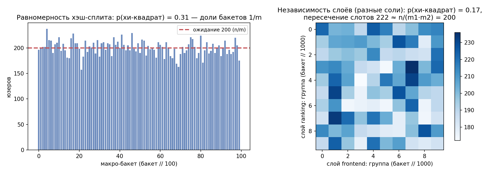
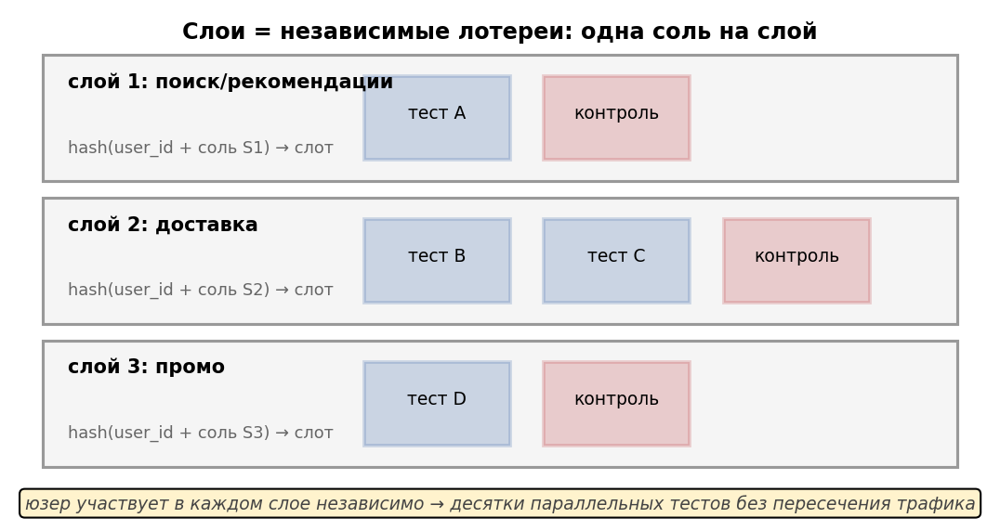
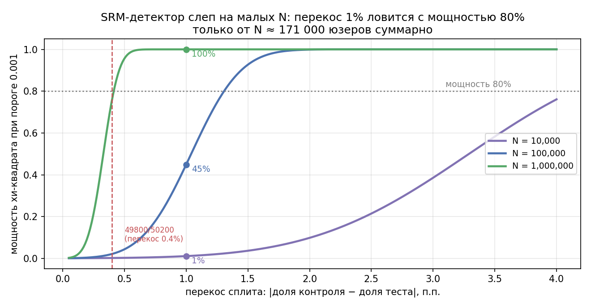
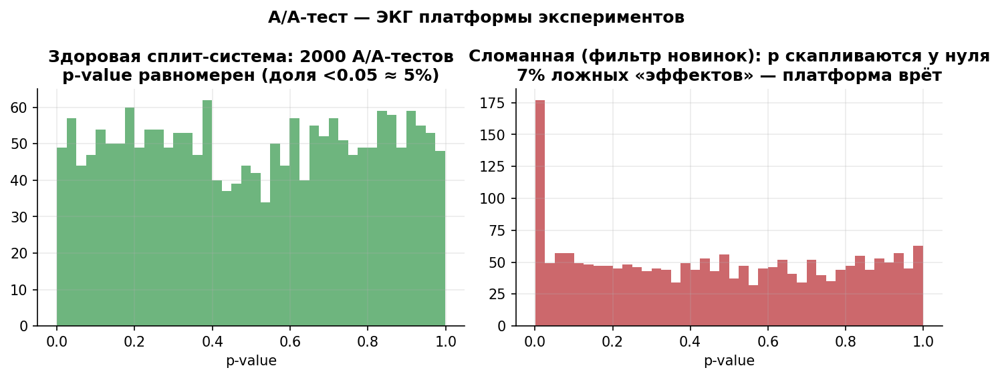

# Урок 4.2 — Сплит-система: рандомизация, SRM, A/A

**Цель урока:** понимать, как физически устроено присвоение юзеров группам: хэш-рандомизация $\text{bucket} = \text{hash}(\text{соль}\,\|\,\text{unit\_id}) \bmod m$ — детерминизм, равномерность (наш чек: $\chi^2=105{,}5$, $p=0{,}31$ на 100 бакетах) и лавинный эффект (64,0 из 128 бит отличаются); как слои и слоты с разными солями дают параллельные непересекающиеся тесты (пересечение слотов ≈ $n/(m_1 m_2)$: 222 юзера против ожидаемых 200); почему НЕ нужно делать А/А/В в каждом тесте (×1,5 трафика, FWER трёх попарных сравнений 14,3%, иллюзия контроля); диагностировать SRM хи-квадратом долей с порогом $p<0{,}001$, а не 0,05 (49995/50005 → $p=0{,}97$; 49800/50200 → $p=0{,}21$; 495000/505000 → $p\approx10^{-23}$), понимать мощность детектора (перекос 1% ловится с мощностью 80% только от $N\approx171\,000$) и гонять A/A-аудит платформы (500 тестов: p-value равномерны, KS $p=0{,}08$, алертов 0,1%; сломанная система с «фильтром новинок» −2% теста ловится в 89% тестов при $N=200$k и лишь в 16% при 50k).

## Зачем это аналитику

Урок 4.1 закончился дизайн-доком; первый его пункт после запуска — инвариант «SRM-чек зелёный». Этот урок — про то, что этот чек проверяет и почему он вообще нужен. Сплит-система — единственный компонент всего А/B-конвейера, который работает **до** и **вне** каждого конкретного теста: если она врёт, врут все тесты сразу, с правильными p-value и красивыми графиками. При этом ломается она незаметно: фильтр в отчётном пайплайне, потерянные события, тест запустили на час позже контроля — и группы уже не сравнимы, а дашборд рисует «эффект».

«ЕдаДома» с этим сталкивается дважды: ростом (три команды хотят тесты одновременно — трафика на непересекающиеся аудитории нет, нужны слои) и первым настоящим инцидентом (тест «Новинки на главной» показывает +3,1% конверсии и p=0,004, а через день выясняется, что сплит был сломан). Аналитик — тот, кто ловит это **до** раскатки: хи-квадратом на каждом тесте, A/A-аудитом платформы и пониманием, откуда берутся проблемы. Без этого навыка все остальные уроки курса — статистика поверх сломанного прибора.

## Теория

### 1. Хэш-рандомизация: unit_id + соль → хэш → бакет

Наивное «случайное число при первом визите» не работает в распределённой системе: два сервера выдадут разное, хранить присвоение дорого, при росте базы всё ломается. Промышленное решение (Deng, гл.7) — **хэш-рандомизация**:

$$\text{bucket} = \text{int}\big(\text{md5}(\text{соль} \,\|\, \text{unit\_id})\big) \bmod m$$

где $m$ — число бакетов (у нас 10 000; эксперимент занимает диапазон бакетов, внутри — варианты). Свойства (все проверяем в практике):

1. **Детерминизм**: тот же юзер — тот же бакет, на любом сервере, без хранения состояния (stateless). Сегодня, завтра, через месяц.
2. **Равномерность**: хороший криптографический хэш ведёт себя как равномерно случайное число — доли бакетов ≈ $1/m$. Проверка: хи-квадрат по макро-бакетам (наши 20 000 юзеров: $\chi^2 = 105{,}5$ на 99 степеней свободы, $p=0{,}31$ — равномерно).
3. **Лавинный эффект**: изменение одного бита входа меняет ~половину выходных бит. Наши замеры: у id, отличающегося на один символ, digest отличается в **64,0 из 128 бит** (идеал — 64). Следствие 1: малое изменение salt не «сдвигает» бакеты, а полностью перемешивает. Следствие 2: разные соли дают **независимые** присвоения — на этом стоят слои (следующий раздел).
4. **Устойчивость к росту**: новые юзеры не меняют присвоение старых; добавление эксперимента в свободные бакеты не трогает занятые.

Тонкость идентификации (вскользь, подробно — 4.3): unit_id на cookie «протухает» — чистка куков, смена устройства → тот же человек мигрирует между группами (cookie churn, Deng гл.7). Лечение — account-id; цена — потеря анонимов. Выбор юнита рандомизации — по-прежнему решение из урока 3.2, хэш лишь исполняет его честно.

*Рис. 4. Хэш-рандомизация: равномерность и лавинный эффект — смена соли полностью пересобирает сплит (из практики).*

### 2. Слои и слоты: параллельные тесты без пересечений

Проблема масштаба (Симулятор, урок 11): 6 команд хотят тестировать одновременно. Трафика на 6 непересекающихся аудиторий нет, а очередь гипотез стоит денег — каждый месяц ожидания это непроверенные идеи и нулевой рост.

- **Одномерная схема**: один общий слой, эксперименты сидят в непересекающихся слотах (диапазонах бакетов). Полная изоляция, но каждая команда получает $1/k$ трафика — мощность падает (урок 3.1), очередь растёт.
- **Многомерная схема (слои)**: слои = домены изменений, у каждого **своя соль**: «ранжирование», «фронтенд», «логистика». Внутри слоя слоты не пересекаются (жёстко), **между слоями** присвоения независимы — как две независимые монетки. Пользователь одновременно в тесте ранжирования и тесте фронтенда; эффекты чужих тестов в среднем сбалансированы между A и B вашего теста — ровно так же, как любая другая характеристика юзера. Пересечение конкретных слотов $\approx n/(m_1 m_2)$: слот 10% первого слоя ∩ слот 10% второго ≈ 1% базы (наши 20 000 юзеров: 222 против ожидаемых 200 — биномиальный шум).

Два правила гигиены. Первое: **одна и та же группа не может быть контролем в двух тестах одного слоя** (коррелированные группы) — эффект первого теста не локализуется, слоты внутри слоя потому и не пересекаются. Второе: не класть в разные слои эксперименты над **одной механикой** — независимость слоёв статистическая, а не продуктовая: взаимодействия эффектов (комбинированный вариант, конкуренция за слот на экране) остаются и проверяются отдельно (koch-kir «влияние экспериментов»; таблица 2×2 взаимодействий — Deng гл.9; практический разбор — урок 4.3). Практика индустрии: взаимодействуют ~0,002% пар тестов (Microsoft) — слои безопасны, если мыслить доменами.

*Рис. 3. Слои = независимые лотереи: у каждого слоя своя соль, юзер участвует в тестах разных слоев независимо.*

### 3. Почему НЕ стоит делать А/А/В в каждом тесте

Идея «добавим второй контроль A2 для надёжности» звучит разумно и почти всегда вредна (koch-kir, «Не стоит проводить А/А/В-тест!»):

1. **Мощность.** Три группы делят тот же трафик: на группу $N/3$ вместо $N/2$. $SE$ разности растёт в $\sqrt{1{,}5}=1{,}22$ раза — для прежней мощности нужно **в 1,5 раза больше трафика** (или ×1,5 длительности). Платите половину добавленного теста за информацию, которая вам не нужна.
2. **Множественность.** Три группы = три попарных сравнения: A1–A2, A1–B, A2–B. FWER $= 1-0{,}95^3 = 14{,}3\%$ вместо 5% (урок 2.4). Без поправки Бонферрони/Холма второй контроль **увеличивает** ложные срабатывания, а не уменьшает.
3. **Иллюзия контроля.** «A1 не отличается от A2 — значит сплит исправен» — нет: отсутствие разницы не гарантирует отсутствия смещения (у внутри-тестового сравнения нет на это мощности), и наоборот — SRM бывает при «равных» метриках. Аудит сплит-системы — задача **платформы**, а не каждого теста: SRM-чек на каждом тесте + регулярные A/A на всём трафике (следующий раздел). Второй контроль уместен ровно в одном случае — когда сам тест и есть A/A-аудит платформы.

### 4. SRM: хи-квадрат долей и порог 0,001

**Sample Ratio Mismatch** — фактические численности групп значимо отклоняются от плановым (48,2/51,8 при плане 50/50 — пример X5). Проверка — хи-квадрат согласия:

$$\chi^2 = \sum_i \frac{(O_i - E_i)^2}{E_i}, \qquad E_i = N \cdot p_i^{\text{plan}}, \qquad df = k-1$$

Для двух групп $\chi^2 = z^2$ — это просто двусторонний z-тест доли. Считаем классические примеры (наши числа, сверка в практике):

| контроль / тест | перекос | $\chi^2$ | p-value | вердикт при 0,05 | вердикт при 0,001 |
|---|---|---|---|---|---|
| 49 995 / 50 005 | 0,01% | 0,001 | 0,97 | здоров | здоров |
| 49 800 / 50 200 | 0,4% | 1,6 | 0,21 | здоров | здоров |
| 49 500 / 50 500 | 1% (N=100k) | 10,0 | 0,0016 | алерт | на пороге |
| 495 000 / 505 000 | 1% (N=1M) | 100 | $1{,}5\cdot10^{-23}$ | алерт | **SRM** |
| 252 000 / 248 000 | 0,8% | 32,0 | $1{,}5\cdot10^{-8}$ | алерт | **SRM** |

**Почему порог 0,001, а не 0,05.** SRM-чек автоматический и массовый: на каждом тесте, каждый день, по срезам. При пороге 0,05 здоровый тест краснел бы в 5% чеков — сотни ложных тревог в квартал, к которым все привыкнут и перестанут смотреть (alarm fatigue). Настоящие SRM почти всегда жирные ($10^{-8}$ и меньше), поэтому 0,001 отделяет сигнал от шума: доля здоровых тестов с $p<0{,}001$ — 0,1% (наши 500 A/A: 1 алерт из 500). Важная оговорка про источники: в конспекте koch-kir для этих примеров указаны $p\approx10^{-23}$/0,39/$2\cdot10^{-8}$ — пересчёт руками даёт другие значения (см. таблицу): хи-квадрат равен $z^2$ и всюду проверяется на калькуляторе. Порог и мораль не меняются, но правило курса — «не верь, проверяй» — применяется к конспектам тоже.

**Мощность детектора.** Перекос $\delta$ (разность долей) даёт $z = \delta\sqrt{N}$, и детектор — обычный тест со своей мощностью: при пороге 0,001 ($z_{crit}=3{,}29$) перекос 1% ловится с мощностью 80% только от $N \approx 171\,000$ юзеров суммарно. Отсюда два следствия: рамп-стадии 1–5% слепы к тонким багам (не «тест честный», а «выборки мало»); маленькие тесты — слепая зона платформы (наш «фильтр новинок» −2% теста ловится в 16% тестов при $N=50$k, в 90% при 200k, всегда при 1M).

*Рис. 1. Мощность SRM-детектора: перекос 1% ловится от ~170к юзеров (из практики).*

### 5. Причины SRM и что делать

Типичные причины (Kohavi гл.21; koch-kir): **асимметричные фильтры** (ботов убрали по-разному, triggered-условие сработало только в тесте — кейс 4.3 про сегментный SRM); **потеря данных** (пайплайн одной группы лагирует, события новой фичи теряются); **асинхронный запуск** вариантов (контроль выкатили на час раньше — разный состав первых юзеров); **редиректы и ошибки** на одной из сторон; **баг хэширования** (переиспользованная соль, кэш конфигурации); **боты/фрод**, распределённые неравномерно.

Протокол при алерте: (1) **стоп** — раскатку заморозить; (2) **результатам не верить** — смещение неизвестно и может быть любого знака (включая «в пользу» теста); (3) **дебаг**: пересчитать численности на сырых логах до всех фильтров, по дням (SRM появился в конкретный день? — релиз), по платформам/сегментам (локализует причину), сверить таймстемпы запуска вариантов, состав фильтров; (4) **чинить причину**, не симптом — «докрутить анализ» нельзя: фильтр, создавший SRM, создаст и смещение метрик; (5) **перезапустить** тест с нуля (счётчик длительности и n обнуляется); (6) зафиксировать постмортем в архиве. Встречаемость: SRM есть в 6–12% тестов даже у зрелых команд (Microsoft, Kohavi) — это не экзотика, а фоновый режим, ради которого проверка обязательна.

### 6. A/A-тесты как аудит платформы и автоматизация

A/A-тест — обеим группам одинаковый вариант. Регулярный (или непрерывный «shadow») A/A на всём трафике — техосмотр платформы (Kohavi гл.19 с пятью примерами пойманных фейлов; Deng гл.9). Ожидания от здоровой системы: p-value всех метрик **равномерны** (урок 2.1) — проверяются гистограммой и KS-тестом; доля $p<0{,}05 \approx 5\%$; SRM-алертов $\approx 0{,}1\%$. Наши 500 симулированных A/A: KS $p=0{,}08$, доля $p<0{,}05$ — 5,4%, алертов 1 из 500. Любая анатомия распределения информативна: «слишком мало» значимых — тоже поломка (консервативный критерий, фильтрация p-value); сгусток около нуля — систематическое смещение; полка внизу — потерянные данные.

Автоматизация — иначе не работает в масштабе: SRM-чек встроен в отчёт **каждого** теста и в мониторинг (X5: «SRM-чек на дашборде каждый час»), A/A крутится фоном, изменения платформы (новый клиент, новая метрика, релиз сплит-сервиса) сопровождаются прогоном A/A до боевых тестов. Смежные проверки качества (Deng гл.9): согласованность знаменателей метрик (MDM — metric denominator mismatch: числитель и знаменатель считаются из разных логов и «расходятся» на части юзеров) и детекция взаимодействий тестов. Итоговая иерархия урока: хэш даёт честные группы → слои масштабируют тесты → SRM ловит сломанный сплит на каждом тесте → A/A ловит сломанную платформу до того, как она сломает ваши тесты.

*Рис. 2. A/A — ЭКГ платформы: здоровая система даёт равномерные p; сломанный фильтр даёт пик у нуля, который мелкие тесты не ловят.*

## Разбор на данных

Инцидент «Новинки на главной» («ЕдаДома», хронология восстановления). Тест вышел на 50% в понедельник; SRM-чек гоняется ежедневно по накопленным данным; телеметрия новой секции теряла ~4,5% событий тестовой группы, и фильтр качества «убрать юзеров без ни одного события app_start» вырезал их — асимметрично.

| момент | контроль | тест | N | $\chi^2$ | p | вердикт при 0,001 |
|---|---|---|---|---|---|---|
| неделя 1 | 5 850 | 5 587 | 11 437 | 6,0 | 0,014 | зелёный (почти) |
| неделя 2 | 11 700 | 11 174 | 22 874 | 12,1 | $5\cdot10^{-4}$ | **SRM — стоп-роллаут** |

Что было дальше: на второй неделе алерт, раскатка заморожена. Дашборд в этот момент показывал «эффект» +3,1% конверсии ($p=0{,}004$) — результат **недостоверен**: потерянные 4,5% — не случайные юзеры, а те, кто взаимодействовал с новой секцией (систематическое смещение неизвестного знака). Дебаг по дням показал, что SRM «родился» вместе с тестом; по срезам — только у мобильного клиента; в сырых логах до фильтра — 50/50. Диагноз: телеметрия секции, а не сплит. Чинили пайплайн (не фильтр!), перезапустили тест с нуля; счётчик длительности и n пошли заново; постмортем — в архив.

Две morals. Про порог: при 0,05 алерт случился бы уже на первой неделе ($p=0{,}014$) — на неделю раньше; цена такого порога — ложная тревога в каждом двадцатом здоровом чеке, при ежедневных чеках это несколько в месяц (alarm fatigue). Про мощность: баг был одинаковым всё время, но $z=\delta\sqrt{N}$ — на 11,4k его не видно, на 22,9k видно; «зелёный SRM» на малой выборке ничего не гарантирует (и именно поэтому рамп-стадии из 4.1 — про инциденты, а не про статистику).

## Подводные камни

1. **Порог 0,05 для SRM.** Делают: алерт при p<0,05. Грозит: 5% здоровых чеков красные, привычка игнорировать, настоящий SRM утонет в шуме. Правильно: 0,001; настоящие поломки дают $10^{-8}$ и меньше.
2. **Случайное вместо хэша / пересборка сплита на лету.** Делают: `random()` при входе, миграция конфига без сохранения соли. Грозит: юзер мигрирует между группами внутри теста, эффект размывается, группы дрейфуют. Правильно: детерминированный хэш от unit_id и соли; смена конфигурации = новый тест.
3. **Одна соль на все тесты.** Делают: все эксперименты из одного диапазона бакетов одной соли. Грозит: либо очередь вместо параллельности, либо пересекающиеся контроли — эффекты не локализуются. Правильно: слои по доменам, у каждого своя соль; одна механика — один слой.
4. **«A1 не отличается от A2 — сплит ок».** Делают: А/А/В в каждом тесте как ритуал надёжности. Грозит: ×1,5 трафика, FWER 14,3%, и всё равно не аудит — мощности на вывод нет. Правильно: SRM-чек на каждом тесте + платформенные A/A; второй контроль — только в самом A/A.
5. **Фильтры постфактум.** Делают: после теста «почистим ботов и неактивных» по-разному для групп. Грозит: создаёте SRM руками — и смещение вместе с ним. Правильно: правила фильтрации симметричны и зафиксированы до запуска; любое «убрать подмножество» — через инварианты.
6. **SRM пойман — «посмотрим на метрики, там же плюс».** Делают: читают эффект сломанного теста. Грозит: раскатка артефакта смещения (наш +3,1% был фальшивкой). Правильно: стоп, дебаг, починка причины, перезапуск; результатам не верить в обе стороны.
7. **Зелёный SRM на малой N как «печатная гарантия».** Делают: на рампе 1–5% и в коротких тестах считают отсутствие алерта доказательством честности. Грозит: баги в 1–2% невидимы до $N\sim10^5$ (мощность детектора). Правильно: помнить $z=\delta\sqrt N$, длинные окна для тонких багов, A/A-аудит на больших N.

## Практика

Файл `practice_4_2.py` (percent-формат, numpy/scipy/matplotlib/pandas + hashlib, seed зафиксирован). Три блока:

1. **Сплит на хэше**: `get_bucket(unit_id, salt) = int(md5(salt|id)) % 10 000` на 20 000 юзеров. Проверки: равномерность 100 макро-бакетов ($\chi^2=105{,}5$, p=0,31); лавинный эффект (64,0 из 128 бит, sd 5,6); независимость слоёв «ranking»/«frontend» — таблица 10×10, $\chi^2=93{,}1$, p=0,17; пересечение слотов 222 против ожидаемых $n/(m_1 m_2)=200$; SRM-чек внутри слота (A=5 062, B=5 112, p=0,62). График `practice_4_2_split.png`.
2. **SRM-детектор**: `srm_check()` (хи-квадрат долей) на пяти классических примерах чисел — таблица из §4 (49995/50005 → 0,97; 49800/50200 → 0,21; 49500/50500 → 0,0016; 495000/505000 → $1{,}5\cdot10^{-23}$; 252000/248000 → $1{,}5\cdot10^{-8}$); кривые мощности от перекоса для N = 10k/100k/1M при пороге 0,001 (1% перекос: 45% мощности на 100k, ~100% на 1M; расчёт N для 80% мощности — 170 746). График `practice_4_2_srm_power.png`.
3. **A/A-аудит платформы**: 500 симулированных A/A по 200 000 юзеров. Здоровая система: KS p=0,08, p<0,05 в 5,4%, алертов 0,001-порога — 1 из 500 (0,2%). Сломанная (введён баг «фильтр новинок»: −2% тест-группы): 88,8% алертов; при N = 50k — только 16,0%, при 1M — 100%. График `practice_4_2_aa_hist.png`.

## Домашнее задание

**Задача 1.** Контроль 49 700, тест 50 300. Посчитайте $\chi^2$ и p-value руками (сверьтесь со scipy). Что скажет детектор при пороге 0,001? при 0,05? Какой порог правильный и почему?

Ответ

$E_i = 50\,000$; $\chi^2 = 300^2/50\,000 \cdot 2 = 3{,}6$; $p = \chi^2_{df=1}(3{,}6) = 0{,}058$. При 0,001 — зелёный; при 0,05 — почти алерт (0,058 чуть не дотянул). Правильный порог 0,001: чек массовый и автоматический, 0,05 давал бы ложные тревоги в 5% здоровых чеков — алерты бы обесценились.

**Задача 2.** База 2 000 000 юзеров. В слое «ранжирование» (соль R) тест занимает слот 10% бакетов, в слое «фронтенд» (соль F) — слот 20%. Сколько юзеров попадут в оба теста одновременно? Почему нам не нужно ничего координировать между слоями?

Ответ

$2\,000\,000 \cdot 0{,}1 \cdot 0{,}2 = 40\,000$ юзеров (2% базы). Координация не нужна, потому что соли разные: из лавинного эффекта присвоения в слоях независимы (как две монетки), эффекты чужих тестов в среднем уравновешены между A и B нашего теста. Проверка независимости — хи-квадрат таблицы слоёв (в практике p=0,17). Риск остаётся только для взаимодействий эффектов — это продуктовая угроза, не статистическая (урок 4.3).

**Задача 3.** Команда предлагает вместо A/B всегда запускать A/A/B «для надёжности». Оцените цену: во сколько раз больше трафика нужно на ту же мощность? Какова вероятность хотя бы одного ложного «прокраса» в трёх попарных сравнениях при α = 5%?

Ответ

Трафик ×1,5: на группу приходится N/3 вместо N/2, $SE$ растёт в $\sqrt{1{,}5}\approx1{,}22$ раза. FWER $= 1-(1-0{,}05)^3 = 14{,}3\%$ — почти втрое против 5%. И главный аргумент: «A1≈A2» не сертифицирует сплит (нет мощности, не та статистика). Надёжность обеспечивают SRM-чек каждого теста и регулярные платформенные A/A (koch-kir).

**Задача 4.** На 5%-ной рампе тест «ЕдаДома» накопил контроль 24 900 / тест 24 100. Посчитайте p-value SRM-чека и опишите действия.

Ответ

$E_i = 24\,500$; $\chi^2 = 400^2/24\,500 \cdot 2 = 13{,}1$; $p = 3\cdot10^{-4} < 0{,}001$ — SRM. Действия: заморозить рампу (до 100% не идти), результатам не верить, дебаг на сырых логах/по дням/по платформам, чинить причину (фильтры? телеметрия? асинхронный запуск?), перезапуск с нуля, постмортем в архив.

**Задача 5.** Платформа прогнала 500 A/A-тестов; значимыми (p<0,05) оказались 43. Здорова ли платформа? Какой тест применить?

Ответ

Ожидание — 25 из 500 (5%). Биномиальный тест против Bin(500; 0,05): наблюдение 43 даёт z ≈ (43−25)/4,87 ≈ 3,7, p ≈ 0,0002 — **слишком много** прокрасов, платформа нездорова (типичные причины: зависимые данные — неправильный юнит 3.2; ratio-метрики обычным t-тестом — 3.3; подглядывания — 3.7). Заметьте: «слишком мало» значимых — тоже подозрительно (фильтрация p-value, консервативный критерий). Аудит — это равномерность распределения, а не только доля прокрасов: KS-тест по всем p-value.

## Шпаргалка

1. Сплит: $\text{bucket} = \text{int}(\text{md5}(\text{соль}\|\text{unit\_id})) \bmod m$ — детерминизм (stateless), равномерность ($\chi^2$), лавинный эффект (~64/128 бит) → разные соли = независимые присвоения.
2. Слои = домены со своей солью; внутри слоя слоты не пересекаются; между слоями независимость, пересечение слотов $\approx n/(m_1 m_2)$. Одна механика — один слой; одна группа — не контроль в двух тестах слоя.
3. Одномерная схема: изоляция, но очередь и 1/k трафика; многомерная: параллелизм, риск только у взаимодействий (~0,002% пар, Microsoft) — проверяется 2×2 (4.3).
4. А/А/В в каждом тесте — вредно: ×1,5 трафика, FWER $1-0{,}95^3=14{,}3\%$, и «A1≈A2» не гарантирует честность. Второй контроль — только в самом A/A-тесте.
5. SRM: $\chi^2 = \sum (O-E)^2/E$, df = k−1, для двух групп $= z^2$; порог **p<0,001** (массовый чек: 0,05 = alarm fatigue); настоящие SRM дают $10^{-8}$ и меньше.
6. Ориентиры: 49995/50005 → p≈0,97; 49800/50200 → 0,21; 49500/50500 (1% на 100k) → 0,0016; тот же 1% на 1M → $10^{-23}$. Числа из конспектов пересчитывайте.
7. Мощность детектора: $z = \delta\sqrt{N}$; перекос 1% ловится с мощностью 80% от $N\approx171\,000$; рамп 1–5% и короткие тесты — слепая зона (наш баг −2%: 16% алертов на 50k, 90% на 200k, 100% на 1M).
8. Причины SRM: асимметричные фильтры, потеря/лаг данных, асинхронный запуск, редиректы, баг хэша/соли, боты. Встречается в 6–12% тестов даже у зрелых команд.
9. Протокол алерта: стоп → результатам не верить (смещение любого знака) → дебаг (сырые логи, дни, платформы, таймстемпы) → чинить причину, не фильтр-симптом → перезапуск с нуля → постмортем.
10. A/A-аудит платформы: p-value равномерны (гистограмма + KS), p<0,05 ≈ 5%, алертов ≈ 0,1%; «слишком мало» прокрасов — тоже поломка. A/A — на всём трафике, регулярно и после каждого релиза платформы/клиента.
11. Автоматизация: SRM-чек в отчёте каждого теста и на мониторинге (каждый час — X5), A/A фоном, смежные чеки — MDM (знаменатели метрик) и взаимодействия.
12. Cookie churn: юнит на cookie мигрирует между группами — account-id; выбор юнита по-прежнему из 3.2, подробно — 4.3.

## Источники

- koch-kir, «SRM: проверка сплитования в А/В-тестировании» (17.05.2023) — хи-квадрат, порог 0,001, примеры чисел, причины, встречаемость 6–12%; «Не стоит проводить А/А/В-тест!» (01.11.2021) — мощность, множественность, иллюзия контроля — https://medium.com/@koch-kir (`materials/web/web-articles.md` §3.2, §3.3a).
- Deng A., «Causal Inference and Its Applications in Online Industry», гл.7 — хэш-рандомизация, оверлап-эксперименты, cookie churn → account-id; гл.9 — диагностика платформы: A/A и равномерность p-value, SRM как красный флаг №1, MDM, детекция взаимодействий — https://alexdeng.github.io/causal/abintro.html, https://alexdeng.github.io/causal/abdiagnosis.html (`materials/web/alexdeng-causal-book.md`).
- Симулятор АБ-тестов (karpov.courses), урок 11 «Сплитилка трафика» — пересекающиеся эксперименты, хэш + слоты, одномерная против многомерной схемы, коррелированные группы, двойное хэширование (соль+слой) — `materials/local/ab-simulator.md`.
- Kohavi, Tang, Xu — Trustworthy Online Controlled Experiments: гл.4 (платформа и культура, single-layer/concurrent), гл.12 (client-side и инфраструктура платформы), гл.19 (The A/A Test — зачем, пять примеров), гл.21 (SRM: причины и дебаг, 6–12% тестов) — PDF в базе (`materials/local/books.md`).
- X5 Product Analytics, урок 3 — SRM как этап «ЖИЗНЬ»: χ²-тест, p<0.001 → стоп, «SRM-чек на дашборде каждый час», A/A как «техосмотр пайплайна» — `materials/local/x5-product-analytics.md`.
- Уроки курса: 2.1 (равномерность p-value под H0), 2.4 (множественность — цена А/А/В), 3.1 (мощность и N — почему рамп слеп), 3.2–3.3 (юниты и ratio — что ещё ломает A/A), 4.1 (инварианты и ramp-план дизайн-дока); вперёд — 4.3 (cookie churn, сегментный SRM, взаимодействия).
