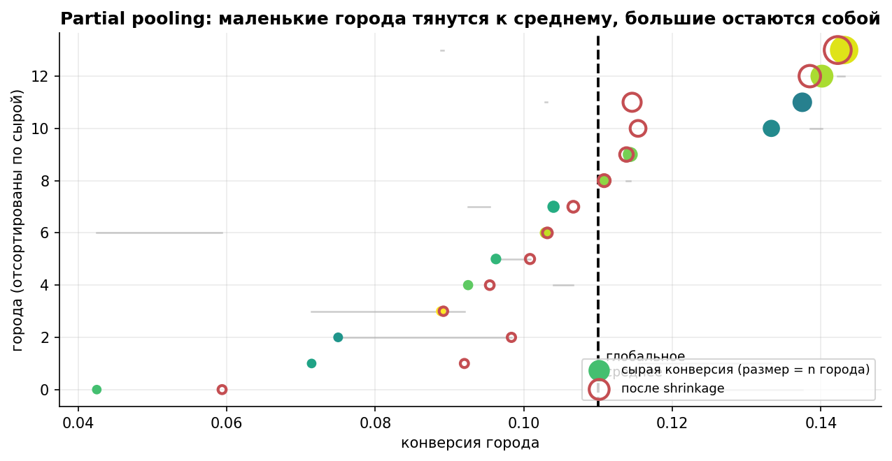
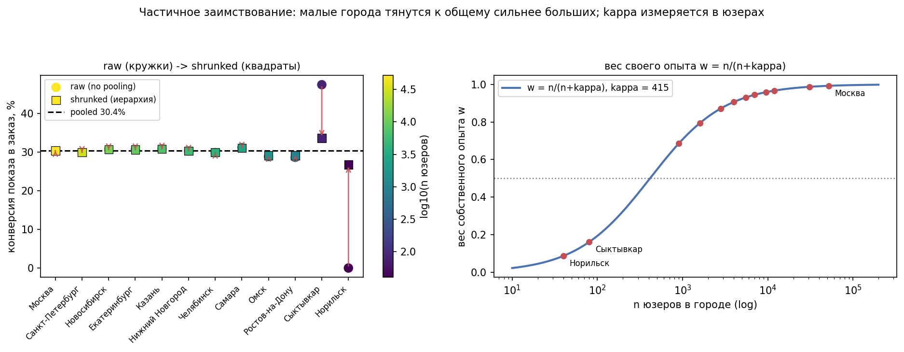
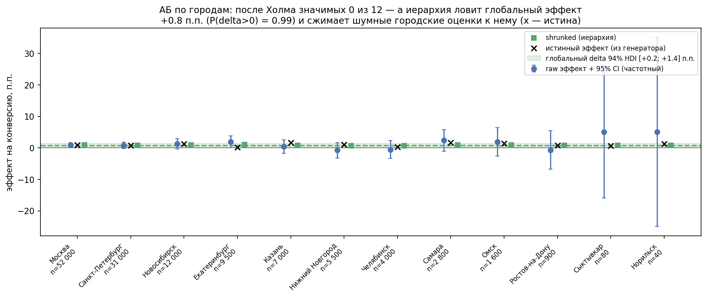
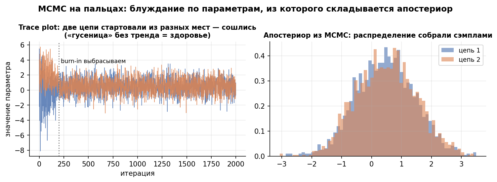

# Урок 5.5 — Иерархические модели: частичное заимствование и MCMC на пальцах

**Цель урока:** перестать выбирать между «каждый сегмент сам по себе» (город с 40 юзерами и конверсией 0% — шум) и «одна метрика на всех» (complete pooling — стирает реальные различия): собрать иерархическую модель, где параметры городов приходят из общего распределения и тянутся к среднему силой, обратно пропорциональной своему n (partial pooling: $\hat p_c \approx w\cdot raw + (1-w)\cdot\mu$, $w = n/(n+\kappa)$); понять, почему такой апостериор уже не считается формулой сопряжённости и как его достаёт MCMC (Метрополис–Гастингс на пять предложений, Гиббс как частный случай, диагностика: trace plot, R-hat, ESS); записать модель на PyMC с диагностикой ArviZ; и применить всё к АБ — глобальный эффект + эффекты по сегментам как правильная альтернатива «нарезке сегментов + поправка Холма» из 4.4 (наши данные: 12 z-тестов после Холма — 0 значимых, иерархия — $\delta = +0{,}83$ п.п. с $P(\delta>0)=99\%$).

## Зачем это аналитику

Квартальный отчёт «ЕдаДома» по гео: конверсия показа в первый заказ по 30 городам. Москва — 52 000 показов, всё стабильно. А внизу таблицы — Норильск: 40 показов, 0 заказов. «Конверсия 0%, регион мёртв, отключаем маркетинг» — говорит отчёт, собранный по принципу «каждый город сам за себя». И он врёт: Wilson-интервал для 0 из 40 — [0%; 8,8%], в нём прекрасно помещаются и 5%, и 8%; закон малых чисел из урока 1.1 в чистом виде.

Ленивое решение — «не паримся, есть же общая конверсия по стране, 30,4%». Это **complete pooling**: одна цифра на все города. Она тоже врёт — только по-другому: города реально различаются (логистика, конкуренция, доходы), и «средняя конверсия по стране» для решений по конкретному городу — это температура по больнице. И в этом выборе нет ничего нового: мы стоим между «низкое смещение, огромная дисперсия» (каждый город сам) и «нулевая дисперсия, смещение» (все города равны).

Иерархическая модель — это третий ответ: **города разные, но не бесконечно разные**. Их конверсии — не 30 независимых констант, а 30 реализаций из одного распределения «конверсий городов ЕдаДома». Тогда маленький город автоматически занимает у больших: Норильск с 40 показами почти весь состоит из общих знаний о городах, Москва с 52 000 говорит сама за себя. Это и называется **частичное заимствование (partial pooling)**, а эффект — **shrinkage**, сжатие к среднему.

Это финальный урок модуля, и он собирает всё: Beta-апостериоры из 5.1 (приор с весом «псевдонаблюдений» — теперь их точное число говорит сам набор городов), байесовский АБ из 5.3 (сегментные эффекты с честными интервалами), и главное — отвечает на вопрос, повисший после 4.4: «нарезка сегментов + Холм защищает от ложных открытий, но сжигает мощность; а как правильно?» Вот как: один глобальный параметр эффекта + сжатые сегментные отклонения. И попутно — «как считать всё это, когда формулы сопряжённости больше нет»: MCMC и PyMC.

## Теория

### 1. Два вруна: no pooling и complete pooling

Формализуем обе наивные стратегии для конверсий по группам (города, сегменты, рестораны):

| | **No pooling** (каждый город сам) | **Complete pooling** (одна конверсия на всех) |
|---|---|---|
| Модель | $k_c \sim \text{Binomial}(n_c, p_c)$, все $p_c$ независимы | $k_c \sim \text{Binomial}(n_c, p)$, один $p$ на всех |
| Оценка города | $k_c/n_c$ (raw) | общее $\sum k_c / \sum n_c$ |
| Чем врёт | **дисперсией**: на $n=40$ биномиальный шум даёт 0% или 47,5% у одинаковых городов | **смещением**: игнорирует гетерогенность; «среднее по стране» ничего не говорит о Норильске |
| Аналог из курса | закон малых чисел (1.1); winner's curse на сегментах (4.4) | усреднение неоднородного — путь к парадоксу Симпсона (4.3) |

Противопоставление — ровно то, что в машинном обучении называется bias–variance trade-off, и как всякая дихотомия оно ложная: между крайностями существует оптимум. Классический результат Штейна (James–Stein, 1961): при трёх и более группах взвешенная комбинация «своё + общее» даёт **меньше суммарной ошибки (MSE), чем raw-оценки каждой группы**, — это не эвристика, а теорема. Мы уже видели её в действии в 5.1 (empirical Bayes на монетном дворе: MSE в 3,1 раза меньше) — теперь сделаем то же честно и с неопределённостью.


*Рис. 1. Partial pooling: маленькие города тянутся к среднему, большие остаются собой.*

### 2. Partial pooling: параметры городов из общего распределения

Иерархическая бета-биномиальная модель для конверсий по городам:

$$\underbrace{k_c \sim \text{Binomial}(n_c,\ p_c)}_{\text{данные города}} \qquad \underbrace{p_c \sim \text{Beta}(\mu\kappa,\ (1-\mu)\kappa)}_{\text{город — из общего распределения}} \qquad \underbrace{\mu, \kappa \sim \dots}_{\text{гиперпараметры — тоже со своими априорами}}$$

Читается сверху вниз как DAG: $\mu, \kappa$ порождают $p_c$, $p_c$ порождают данные $k_c$. Три уровня — отсюда «иерархическая». Данные каждого города тянут его $p_c$ вверх-вниз (правдоподобие), а общее распределение стягивает все $p_c$ к $\mu$ (приор). И город, и «страна» получают своё.

Ключ к пониманию — во что вырождается апостериор одного города при фиксированных $\mu, \kappa$. Это знакомая по 5.1 механика «априорных псевдонаблюдений»:

$$p_c \mid k_c \sim \text{Beta}\big(\underbrace{\mu\kappa}_{\alpha} + k_c,\ \underbrace{(1-\mu)\kappa}_{\beta} + n_c - k_c\big), \qquad E[p_c \mid k_c] = \frac{k_c + \mu\kappa}{n_c + \kappa} = w\cdot\frac{k_c}{n_c} + (1-w)\cdot\mu,\quad w = \frac{n_c}{n_c + \kappa}$$

**Shrinkage-формула**: апостериорная оценка города — взвешенное среднее своего raw и общего $\mu$, где вес своего опыта $w = n/(n+\kappa)$. Градация:

- $n \ll \kappa$: $w \approx 0$ — город почти весь из общего («Норильск 0 из 40 при $\kappa = 400$ → оценка 27%»);
- $n = \kappa$: $w = 0{,}5$ — наполовину свой, наполовину общий;
- $n \gg \kappa$: $w \approx 1$ — большой город говорит сам за себя («Москва при $w = 0{,}99$ не сдвинулась ни на сотую»).

Вторая магия — $\kappa$ **оценивается из данных всех городов вместе**. Если конверсии городов похожи (маленький разброс), $\kappa$ окажется большой → сжатие сильное; если города сильно разные, $\kappa$ маленькая → каждый почти сам по себе. Модель сама узнаёт, сколько заимствовать, — ровно то, что empirical Bayes из 5.1 делал «вручную» (подгонкой Beta к историческим монетам), только теперь $\mu$, $\kappa$ и все $p_c$ оцениваются одновременно, и неопределённость по $\kappa$ честно разъезжает по интервалам городов (HDI Норильска шире, чем у Москвы, — и это правильно).


*Рис. 2. κ измеряется в юзерах: вес города w=n/(n+κ) — сколько «страны» стоит за ним (из практики).*

### 3. Место в пройденном: следующий шаг после dummy из 2.5

В уроке 2.5 мы записали ANOVA как регрессию с dummy-переменными: у каждой группы — **свободный** коэффициент. Это и есть no pooling в регрессионной одежде. Иерархическая модель — следующий шаг по той же лестнице:

- dummy-регрессия (2.5): $\bar{x}_g$ каждой группы сама по себе;
- + ковариата пре-периода → CUPED/ANCOVA (3.5);
- **+ эффекты групп из общего распределения → иерархическая регрессия** (здесь): $\beta_g \sim N(\mu_\beta, \tau)$ вместо «каждый $\beta_g$ свободен».

У Мартина (гл. 3.4) это подано как иерархическая линейная регрессия: те же $X\beta$, только коэффициенты разделяют информацию через общее распределение. Практическое следствие для продуктовых данных: чем мельче нарезка (города × платформы × когорты), тем важнее иерархия — свободных параметров становится десятки, и без сжатия половина из них — чистый шум.

### 4. Иерархия в АБ: глобальный эффект + сегменты — ответ на вопрос из 4.4

В 4.4 мы честно работали с сегментами: заявить до теста, поправка Холма, тест интеракции — и всё равно главный вывод был «нарезка сегментов ломается о множественность и winner's curse». Иерархическая модель — системное решение той же задачи:

$$\hat d_c \sim N(d_c, se_c), \qquad d_c \sim N(\delta, \tau), \qquad \delta \sim N(0, \sigma_\delta),\ \tau \sim \text{HalfNormal}(\cdot)$$

(наверху — правдоподобие в нормальном приближении: оценка эффекта в сегменте $c$ со своей стандартной ошибкой; $d_c$ — истинный эффект сегмента, $\delta$ — глобальный эффект, $\tau$ — разброс эффектов между сегментами). Что это меняет по сравнению с 12 отдельными тестами:

1. **Глобальный вопрос — один тест, без штрафа за множественность.** «Фича в среднем работает?» — это один параметр $\delta$, а не 12 сегментных проверок с поправкой Холма. В нашей практике: 12 z-тестов после Холма дали **0 значимых**, иерархическая модель — $\delta = +0{,}83$ п.п. с $P(\delta>0) = 99\%$ при том же эффекте.
2. **Сегментные эффекты сжимаются** к глобальному: чем меньше сегмент (больше его $se_c$) относительно разброса $\tau$, тем сильнее он прижимается к $\delta$ — тот же принцип, что и вес $w = n/(n+\kappa)$ у конверсий. Winner's curse из 4.4–4.5 лечится структурно: шумный «победитель» не может далеко уйти от общего уровня (в практике: сырой «Норильск +5,0 п.п.» сжался до +0,8 при истине +1,2).
3. **$\tau$ — диагностика гетерогенности**: апостериор $\tau$ около нуля → фича работает на всех одинаково, персонализация не нужна; $\tau$ большой → сегменты реально разные → есть что таргетировать (но каждый сегментный вывод — всё ещё с осторожностью 4.4: shrinkage уменьшает ложные открытия, а не отменяет проверку).

Это и есть форвард, обещанный в 4.4: интеракции в регрессии — частотная половина ответа, иерархическая модель — байесовская, и они решают одну задачу с разных сторон.


*Рис. 3. 12 гипотез с поправкой против одной иерархической: на одних данных — «ничего» vs «фича работает» (из практики).*


### 5. MCMC на пальцах: почему нет формулы и что делает сэмплер

В 5.1–5.3 апостериор считался формулой: сопряжённость Beta–Бернулли давала Beta-апостериор «в голове». Здесь — 14 параметров ($\mu, \kappa, p_1 \ldots p_{12}$), и нормировка $P(\mu,\kappa,p_1..p_{12} \mid \text{данные})$ требует интеграла по 14-мерному пространству. Формулы нет. **MCMC** (Markov Chain Monte Carlo) обходит интеграл хитростью: не считать распределение, а **сгенерировать из него выборку**. С mean'ом цепи ≈ апостериорное среднее, разбросом цепи ≈ апостериорная дисперсия, долей сэмплов выше нуля ≈ $P(\delta > 0)$ — вся байесовская отчётность из 5.2–5.3, добытая симуляцией.

**Метрополис–Гастингс в пять предложений.** (1) Стоим в точке $\theta$ пространства параметров. (2) Предлагаем шаг в случайную сторону: $\theta' = \theta + \text{шум}$. (3) Считаем, во сколько раз в новой точке выше «апостериорная плотность» (правдоподобие × приор): $r = P(\theta' \mid D)/P(\theta \mid D)$. (4) Если $r \geq 1$ — правдоподобие выросло — идём в $\theta'$; если $r < 1$ — идём с вероятностью $r$ (монетка), иначе остаёмся. (5) Повторяем тысячи раз: след блуждания — выборка из апостериора; доля времени в области = вероятностная масса области. Вся соль — в шаге (4): иногда мы принимаем и «худшие» точки, иначе застряли бы в первом же локальном горбе; а отвергнутые шаги оставляют след на месте — отсюда «плато» на trace-plot.

**Гиббс** — частный случай MH: если для каждого параметра его условное распределение при остальных известно в замкнутой форме (сопряжённые кусочки — как в бета-биномиальных иерархиях), сэмплируем из него напрямую, и каждый шаг принимается автоматически ($\alpha = 1$). Так работали классические движки (BUGS, JAGS; в book_about_bayes — Гиббс и Метрополис–Гастингс разобраны подряд). Современный PyMC по умолчанию крутит **NUTS** — тот же принцип «блуждания с приёмом», но шаг и длина шага подстраиваются автоматически под форму апостериора: Метрополис без ручной настройки.

**Диагностика: как понять, что цепи можно верить.**

- **Trace plot** (след параметра по итерациям): здоровая цепь — «хвост гусеницы» (fuzzy caterpillar): плотный шум вокруг уровня без трендов и застреваний. Больная — ползёт (не сошлась), застревает плато (шаг слишком мелкий), мечется змейкой (шаг слишком крупный).
- **Несколько цепей** запускают из разных точек: сошлись к одному «слою» и перемешались — хорошо.
- **R-hat** словесно: сравниваем разброс **между** цепями с разбросом **внутри** каждой. Если цепи сэмплируют из одного распределения, отношение ≈ 1,00; если застряли в разных местах, между-разброс обгоняет внутри-разброс и R-hat растёт. Порог: **≤ 1,01 хорошо, > 1,05 результатам верить нельзя** (у нас 1,003).
- **ESS** (эффективный размер выборки): из-за автокорреляции 4000 итераций стоят как, скажем, 2000 независимых сэмплов; смотрят ESS, а не счётчик итераций.
- **Дивергенции** (NUTS): пометки «сэмплер сломался на этой итерации»; россыпь дивергенций = в апостериоре есть «воронка» (о ней — в подводных камнях).


*Рис. 4. MCMC не считает распределение — он его гуляет; гистограмма следа и есть апостериор.*

### 6. PyMC — индустриальный стандарт, и ArviZ — его приборная панель

Вероятностное программирование — это «описал модель — движок сам сэмплирует». PyMC — стандарт де-факто в Python-экосистеме (в R/других языках тот же класс задач закрывает Stan — гл. 4 book_about_bayes так и называется «Мама, папа, знакомьтесь. Это STAN»). Скелет нашей модели целиком:

```python
import pymc as pm
import arviz as az

with pm.Model() as model:
    mu     = pm.Beta("mu", 2, 5)                              # конверсия среднего города
    kappa  = pm.Gamma("kappa", 2, 0.01)                        # сила сжатия (в юзерах)
    p_city = pm.Beta("p_city", mu * kappa, (1 - mu) * kappa,
                     shape=n_cities)                           # конверсии городов
    pm.Binomial("k", n=n_city, p=p_city, observed=k_city)      # правдоподобие
    idata  = pm.sample(2000, tune=2000, chains=2,
                       target_accept=0.95, random_seed=55)     # NUTS

az.summary(idata, var_names=["mu", "kappa"])    # mean, HDI, ess_bulk, r_hat — диагностика
az.plot_trace(idata, var_names=["mu", "kappa"]) # «гусеницы» + апостериоры
```

Что важно прочитать в этой записи: модель описывается распределениями как будто пишешь генератор данных (prior → prior → likelihood), а `pm.sample` подбирает сэмплер (NUTS) сам; `tune` — разогрев (выбрасывается), `target_accept` — защита от дивергенций. ArviZ работает поверх следа любого движка (PyMC, Stan, NumPyro) — единая приборная панель: `r_hat`, `ess`, HDI, прогнозные проверки из 5.1–5.2. У Мартина всё это в PyMC3; в актуальном PyMC (v5) те же модели переносятся почти без правок.

И мостик вперёд: иерархическая модель — это вероятностная **графическая** модель, где совместное распределение факторизуется по графу ($\mu,\kappa \to p_c \to k_c$). В М6 графы вернутся уже как каузальные DAG, а вопрос изменится с «что вероятно при данных» на «что будет, если вмешаться» — байесовские сети из гл. 3 Applied Causal Inference Course вырастают ровно отсюда.

## Разбор на данных

Из практики `practice_5_5.py` (12 городов, seed зафиксирован; таблица — конверсия показа в первый заказ за месяц).

**Данные и обе крайности.** Москва 15 812/52 000 = 30,4%, СПб 30,0%, …, Ростов 258/900 = 28,7%, Сыктывкар **38/80 = 47,5%**, Норильск **0/40 = 0,0%**. Полная подушка (complete pooling) — 30,35%. «Худший город страны» и «лучший город страны» — соседние строчки с одинаковым шумом: на n = 40–80 биномиальная дисперсия размаха в десятки п.п.

**Иерархическая модель (PyMC, NUTS, 2×2000):** $\mu = 0{,}302$ (94% HDI 0,287–0,319), $\kappa = 415$ юзеров (HDI 44–789 — широковато: 12 городов дают немного информации о гиперпараметре, и это честно видно). Диагностика: R-hat ≤ 1,003, ESS ≥ 2057, след — «гусеница» (`practice_5_5_trace.png`).

**Три оценки рядом** (`practice_5_5_shrinkage.png`):

| город | n | raw | shrunked | вес своего $w$ |
|---|---|---|---|---|
| Москва | 52 000 | 30,4% | 30,4% | 0,99 |
| Ростов-на-Дону | 900 | 28,7% | 29,2% | 0,69 |
| Сыктывкар | 80 | **47,5%** | 33,7% (HDI 28,9–39,4) | 0,16 |
| Норильск | 40 | **0,0%** | **26,8%** (HDI 20,8–32,6) | 0,09 |

Аналитическая формула $(k + \mu\kappa)/(n+\kappa)$ по posterior-mean $\mu, \kappa$ воспроизводит MCMC с точностью до 0,8 п.п. — формула не замена MCMC (интервалы и неопределённость $\kappa$ она не даёт), но идеально объясняет механику. Норильск: 0% → 26,8% — «город почти весь из общего» ($w = 0{,}09$), и его HDI всё ещё шире московского. Сыктывкар сжат с другой стороны — сжатие симметрично и не знает «исключений»: оно про шум, а не про то, что город «плохой».

**Иерархия в АБ против «нарезки + Холм»** (`practice_5_5_ab_segments.png`). Сценарий: тест промо-баннера, истинный глобальный аплифт +1,0 п.п. (по городам разброс $\sigma = 0{,}6$ п.п.), те же 12 городов, сплит 50/50.

- **Частотная нарезка (4.4):** 12 z-тестов; сырых «значимых» — 2 (Москва p = 0,036, Екатеринбург p = 0,043), **после Холма — 0 из 12**: минимальный p = 0,036 → 0,44. Вердикт процедуры: «нечего раскатывать» — эффект в +1 п.п. на фоне поправки за 12 гипотез потерян. Максимальный сырой эффект — Норильск +5,0 п.п. при истине +1,2: winner's curse из 4.4 в полный рост.
- **Иерархическая модель:** $\delta = +0{,}83$ п.п., 94% HDI [+0,19; +1,45], $P(\delta>0) = 99{,}0\%$, $\tau = 0{,}41$ п.п. Глобальный эффект пойман одной гипотезой; сегментные оценки сжаты к нему (Норильск: +5,0 → +0,8) и в среднем **в 3,3 раза точнее сырых** (средняя ошибка против истины 1,37 → 0,42 п.п.).
- Для справки: один pooled z-тест на всей выборке даёт p = 0,0010 — «нарезка с Холмом» проигрывает даже простому «не резать». Иерархия же даёт и глобальный вывод, и честные сегментные интервалы, и оценку гетерогенности $\tau$ — всё в одной модели.

## Подводные камни

1. **«Норильск 0% — регион мёртв, режем бюджет».** Делают: решения по raw-метрикам мелких сегментов. Грозит: закон малых чисел (1.1) — на 40 показах «конверсия 0%» совместима с 8%; резать будем живой рынок (и раскатывать «успех» Сыктывкара — та же ошибка с обратным знаком). Правильно: shrunked-оценка с HDI; показывать маленькие сегменты только через иерархию.
2. **Complete pooling как «простота».** Делают: «не усложняем, есть общая конверсия/общий эффект». Грозит: стирание реальной гетерогенности — решения о городе по средней температуре; в АБ — «эффект есть» при эффекте только у части аудитории (или наоборот, средний ноль при плюсах и минусах по сегментам, которые гасят друг друга). Правильно: $\mu$ (или $\delta$) + $\tau$/$\kappa$ отвечают на два вопроса сразу — «в среднем» и «насколько разные»; если $\tau$ заметно больше нуля — резать по сегментам как минимум задуматься.
3. **Верить MCMC без диагностики.** Делают: запустили `pm.sample`, взяли средние, понесли в отчёт. Грозит: незашедшие цепи (R-hat > 1,05), маленький ESS, дивергенции — числа нестабильны и ни о чём не говорят; в нашей же АБ-модели центрированная параметризация дала 33 дивергенции и R-hat 1,04. Правильно: ритуал `az.summary` (r_hat, ess) + `plot_trace`; при дивергенциях — `target_accept=0.99` и/или нецентрированная параметризация (Мартин, гл. 6): $d_c = \delta + \tau z_c$ с $z_c \sim N(0,1)$ — нам она сняла все дивергенции и R-hat до 1,002.
4. **Слепое сжатие при слабых данных о гиперпараметрах.** Делают: 3–4 сегмента и «модель сама оценит $\kappa$/$\tau$». Грозит: гиперпараметр почти не идентифицируется малым числом групп — силу сжатия молча определяет приор; реальный выброс сегмента задавлен к среднему (смещение), а HDI это не покажет. Правильно: sensitivity по приорам (5.1), смотреть HDI $\kappa$/$\tau$ (у нас $\kappa$: 44–789 — «сжатие есть, но его силу мы знаем грубо»), собирать больше групп.
5. **«Иерархия отменяет дисциплину сегментов из 4.4».** Делают: нарезали 15 разрезов пост-фактум, «но по-байесовски, значит ок». Грозит: HARKing никуда не делся: сжатие снижает ложные открытия, но не превращает шум в сигнал, а пост-фактум выбор «интересного» сегмента остаётся отбором. Правильно: сегменты по-прежнему заявляются до теста; о «своём» эффекте сегмента говорить при HDI $d_c$, отделимом от нуля, и подтверждать таргетную раскатку отдельным тестом.
6. **Стрелять из MCMC по воробьям.** Делают: PyMC-модель для сравнения двух кнопок с биномиальной метрикой. Грозит: минуты сэмплирования и диагностики вместо мгновенной формулы из 5.3, больше мест для ошибок, «чёрный ящик» для стейкхолдеров. Правильно: сопряжённость (5.1–5.3) — сначала; MCMC — когда параметров много/модель сложнее правдоподобия с одним prior'ом; Thompson sampling из 5.4 на две руки тоже живёт на точных Beta.
7. **Забывать, что shrunked-оценка — ассоциация, а не причинность.** Делают: «Норильск после сжатия всё равно ниже среднего — значит, дело в логистике; меняем процесс доставки по выводам модели». Грозит: города не рандомизированы — различия $p_c$ напичканы конфаундерами (доход, конкуренция, погода); сжатие делает оценки стабильнее, не каузальнее. Правильно: иерархия — для прогноза и приоритизации; «что будет, если вмешаться» — вопросы М6 (DiD, matching, байесовские сети).

## Практика

Файл: `practice_5_5.py` (percent-формат, numpy/scipy/matplotlib/pandas + **PyMC/ArviZ**, seed зафиксирован; если PyMC не установлен — `pip3 install --user pymc arviz`). Пять блоков:

1. **Данные**: конверсия показа в заказ по 12 городам (от Москвы 52 000 до Норильска 40) + обе крайности: raw-оценки против полной подушки.
2. **Иерархическая модель в PyMC**: `p_city ~ Beta(mu*kappa, (1-mu)*kappa)`, NUTS 2×2000; диагностика ArviZ: R-hat, ESS, HDI; trace plot (`practice_5_5_trace.png`).
3. **Три оценки рядом**: raw / pooled / shrunked по городам + сверка с аналитической формулой $w\cdot raw + (1-w)\cdot\mu$; shrinkage-график: стрелки raw → shrunked, цвет = размер города, справа кривая $w = n/(n+\kappa)$ с городами на ней (`practice_5_5_shrinkage.png`).
4. **АБ-сценарий «нарезка + Холм»** (урок 4.4): тот же набор городов, истинный глобальный аплифт +1,0 п.п.; 12 z-тестов, сырые «прокрасы», поправка Холма, winner's curse сырого максимума.
5. **Та же задача иерархической моделью** (нецентрированная параметризация — и почему): глобальный $\delta$ с $P(\delta>0)$, сжатые городские эффекты против истины, средняя ошибка raw vs shrunked; сводный график CI против сжатых оценок с истинными эффектами (`practice_5_5_ab_segments.png`).

Что должны увидеть (числа реального запуска):

- $\mu = 0{,}302$, $\kappa = 415$ юзеров; R-hat ≤ 1,003, ESS ≥ 2057 — цепи здоровые;
- Норильск 0,0% → **26,8%** ($w = 0{,}09$), Сыктывкар 47,5% → **33,7%** ($w = 0{,}16$), Москва 30,4% → 30,4% ($w = 0{,}99$) — «маленький город почти весь из общего, большой — из себя»;
- формула сжатия воспроизводит MCMC с точностью ≤ 0,8 п.п. — но интервалы и неопределённость $\kappa$ даёт только MCMC;
- АБ: сырых значимых 2 из 12 → **после Холма 0**; иерархия: $\delta = +0{,}83$ п.п., HDI [+0,19; +1,45], $P(\delta>0) = 99{,}0\%$; городские оценки после сжатия в **3,3 раза** ближе к истине (1,37 → 0,42 п.п. средней ошибки); сырой «победитель» Норильск +5,0 п.п. сжат до +0,8 при истине +1,2 — winner's curse пойман и прижат.

## Домашнее задание

1. Норильск: $k = 0$, $n = 40$; глобальные $\mu = 0{,}30$, $\kappa = 400$. Посчитайте shrunked-оценку и вес собственного опыта города. Что станет с оценкой, когда за месяц придут ещё 360 показов и снова 0 заказов?

<details>
<summary>Ответ</summary>

$w = n/(n+\kappa) = 40/440 = 0{,}09$ — 91% оценки из общего знания. $\hat p = (0 + 0{,}30\cdot400)/440 = 120/440 = 27{,}3\%$. С новыми данными $n = 400$: $w = 0{,}5$, $\hat p = (0+120)/800 = 15\%$ — город наполовину «из себя», и устойчивый ноль уже всерьёз тянет вниз: сжатие не догма, у данных растёт право голоса (при $n \to \infty$ модель сдаётся фактам полностью).
</details>

2. Город с $n = 52\,000$ и raw 30,4% при тех же $\mu, \kappa$: посчитайте $w$ и shrunked-оценку. Почему для больших городов иерархия «ничего не меняет» — и зачем тогда она нужна?

<details>
<summary>Ответ</summary>

$w = 52000/52400 = 0{,}992$; $\hat p = 0{,}992\cdot30{,}4\% + 0{,}008\cdot30\% = 30{,}40\%$ — сдвиг на сотые. Большим городам сжатие не нужно — их сырая оценка уже точная. Нужна оно малым городам (их raw — шум) и всем вместе — через общее $\mu$ и $\kappa$: большие города — это «доноры» подушки, из которой живут маленькие. Один механизм обслуживает обоих, вес $w$ переключает режим автоматически.
</details>

3. Чем иерархическая модель отвечает на вопрос «эффект фичи по сегментам» лучше, чем 12 отдельных тестов с поправкой Холма (4.4)? Назовите два выигрыша и одну вещь, которую иерархия НЕ отменяет.

<details>
<summary>Ответ</summary>

Выигрыши: (1) глобальный эффект — один параметр $\delta$ и одна гипотеза, без штрафа за множественность (в практике: 0 значимых после Холма против $P(\delta>0)=99\%$); (2) сегментные эффекты сжимаются к глобальному пропорционально своей шумности — winner's curse шумных сегментов гасится структурно (+5,0 п.п. → +0,8). НЕ отменяет: дисциплину — сегменты заявляются до теста, «открытие» пост-фактум остаётся отбором (HARKing), а сжатие снижает долю ложных находок, но не создаёт информацию там, где её нет.
</details>

4. На trace-plot параметра одна цепь первые 500 итераций ползёт вверх, потом выходит на уровень; вторая цепь держится заметно ниже первой; R-hat = 1,18. Что сломано и что делать (три шага)?

<details>
<summary>Ответ</summary>

Сломана сходимость: цепи не смешались — «между»-разброс много больше «внутри»-разброса (отсюда R-hat 1,18 ≫ 1,01), выводам верить нельзя. Шаги: (1) увеличить `tune`/выкинуть burn-in — ползущий старт как раз и есть разогрев, но он маскирует проблему, если цепи сошлись в разные места; (2) больше итераций и пере-параметризация (нецентрированная) при дивергенциях/«воронке»; (3) перезапустить с 4 цепями из разных стартов и проверить, что R-hat ≤ 1,01 и ESS достаточный — только тогда читать средние и HDI.
</details>

5. У вас всего 3 сегмента, и prior на $\tau$ (разброс эффектов) — HalfNormal с $\sigma = 2$ п.п. Насколько можно верить оценке гетерогенности? Что сделать перед тем, как докладывать «сегменты точно разные»?

<details>
<summary>Ответ</summary>

Слабо: тремя группами дисперсия разброса почти не идентифицируется — апостериор $\tau$ будет во многом повторять приор, и «сегменты разные» может быть артефактом щедрого приора. Сделать: sensitivity — пересчитать при сдержанном приоре (например, $\sigma = 0{,}5$ п.п.) и убедиться, что вывод жив; посмотреть HDI $\tau$, а не только среднее; по возможности добавить групп (не только города — платформы, когорты) или собрать больше данных. Правило из 5.1 работает и здесь: вывод, живущий только при одном приоре, — не вывод.
</details>

## Шпаргалка

1. Три режима групповых оценок: **no pooling** (raw; врёт шумом на малых n — «Норильск 0%»), **complete pooling** (одна цифра; врёт усреднением гетерогенности), **partial pooling** (взвешенное — оптимум по MSE, теорема Штейна).
2. Модель: $k_c \sim \text{Bin}(n_c, p_c)$, $p_c \sim \text{Beta}(\mu\kappa, (1-\mu)\kappa)$, гиперпараметры — с приорами. Иерархия = априор каждой группы строится из данных всех групп.
3. Shrinkage-формула: $E[p_c \mid k_c] \approx \dfrac{k_c + \mu\kappa}{n_c + \kappa} = w\cdot raw + (1-w)\cdot\mu$, где $w = \dfrac{n_c}{n_c + \kappa}$. **$\kappa$ измеряется в юзерах**: n ≪ κ — город из общего; n ≫ κ — сам по себе.
4. $\kappa$ (и $\tau$ в АБ) оцениваются из данных: похожие группы → сильное сжатие; разные → слабое. Модель сама выбирает, сколько заимствовать; неопределённость гиперпараметров уезжает в HDI.
5. MCMC нужен, когда сопряжённости нет (14-мерный апостериор): он не считает распределение, а генерирует из него выборку; среднее цепи = posterior mean, доля сэмплов > 0 = $P(\delta>0)$.
6. Метрополис–Гастингс: случайный шаг + принять с вероятностью $\min(1, r)$, $r$ — отношение апостериорных плотностей; отвержения оставляют на месте. Гиббс — частный случай с точными условными ($\alpha=1$); NUTS — MH с автотюнингом шага (PyMC по умолчанию).
7. Диагностика: trace «хвост-гусеница» без трендов; R-hat ≤ 1,01 (между-цепной разброс / внутри-цепной; > 1,05 — не верим); ESS вместо счётчика итераций; дивергенции → `target_accept`↑ или нецентрированная параметризация.
8. PyMC-скелет: `with pm.Model(): priors → likelihood; idata = pm.sample(...)`; ArviZ: `az.summary` (r_hat, ess, HDI), `az.plot_trace`. Stan — тот же класс задач в другом движке.
9. Иерархия в АБ: $\hat d_c \sim N(d_c, se_c)$, $d_c \sim N(\delta, \tau)$ — глобальный тест без поправки за множественность + сжатые сегментные эффекты; $\tau$ — мера гетерогенности; winner's curse сегментов гасится структурно.
10. Мостики: dummy-регрессия 2.5 — свободные эффекты групп, иерархия — следующий шаг; empirical Bayes 5.1 — shrinkage с фиксированной подушкой; сегментная дисциплина 4.4 остаётся (заявлено до теста, HDI отделим от нуля); графы → байесовские сети М6.

## Источники

- Освальдо Мартин, «Байесовский анализ на Python» (ДМК Пресс, 2020), гл. 3.4 (иерархическая линейная регрессия — частичное заимствование в регрессионной форме), гл. 6 (смешанные модели, нецентрированная параметризация — лечение «воронки»), гл. 8 (механизмы вывода: MCMC, NUTS, диагностика) — основной источник урока (карточка книги: `materials/local/books-folder.md` §5; PyMC3 → PyMC v5 переносится с минимальными правками).
- Ф. Ульянов (FUlyankin), book_about_bayes, гл. «Цепи Маркова», «Гиббс», «Метрополис-Гастингс» и гл. 4 «Мама, папа, знакомьтесь. Это STAN» — MCMC на пальцах и Stan как альтернативный движок (`materials/web/fulyankin-github.md` §3); его же matstat-AB, неделя 16 — «Байес, PyMC3» с ноутбуками.
- Ci2Lab, Applied Causal Inference Course, гл. 3 (байесовские сети, факторизация по графу) — мостик к М6: иерархическая модель как вероятностная графовая (`materials/local/applied-causal-inference-course.md`).
- Уроки курса: 5.1 (Beta-апостериоры, псевдонаблюдения, empirical Bayes — сжатие в миниатюре), 5.2 (HDI и интерпретации), 5.3 (P(B>A), expected loss), 5.4 (Thompson sampling на точных Beta), 1.1 (закон малых чисел), 2.5 (ANOVA → регрессия с dummy — ступенька к иерархии), 2.4 и 4.4 (Холм, сегменты, winner's curse — та же задача частотными руками), 4.5 (Type M и «shrinkage чинит переоценку»).
- PyMC и ArviZ документация: `pm.sample`, `az.summary`, `az.plot_trace`, R-hat/ESS — рабочий справочник для практики.
