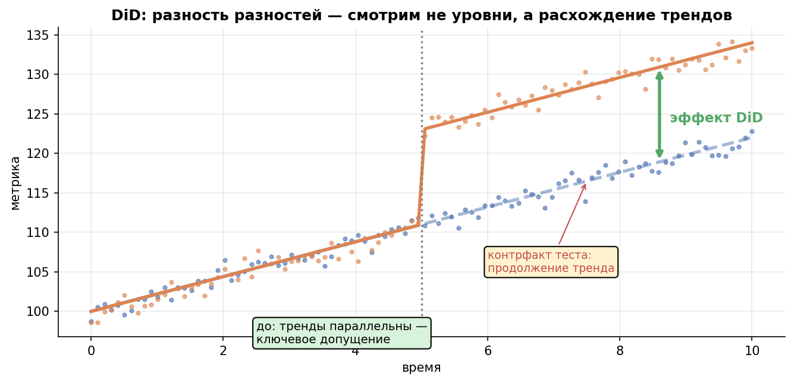
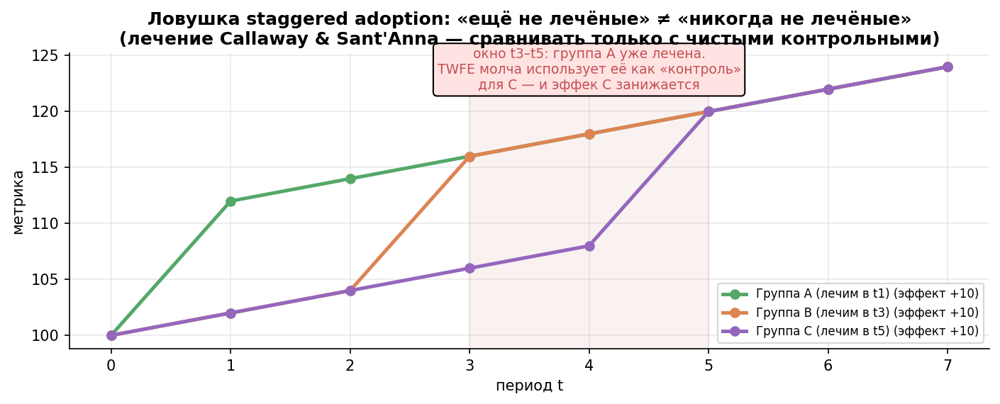
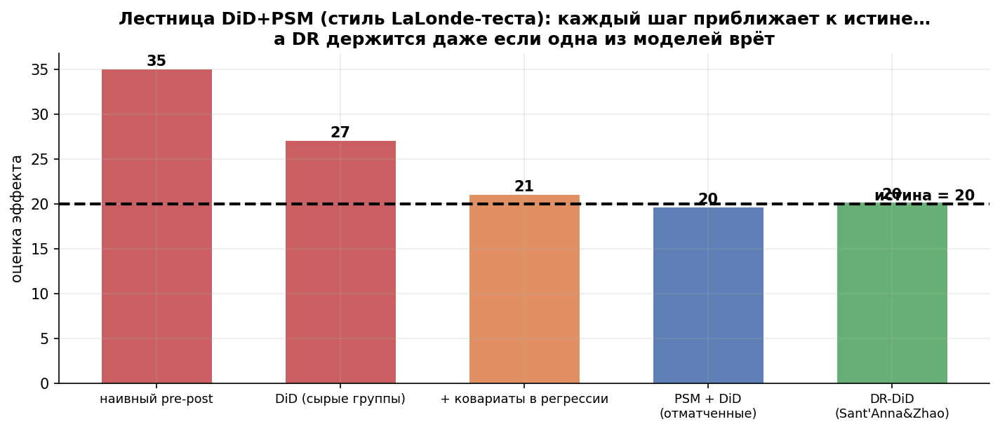
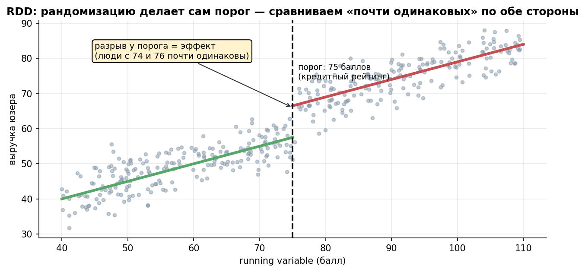
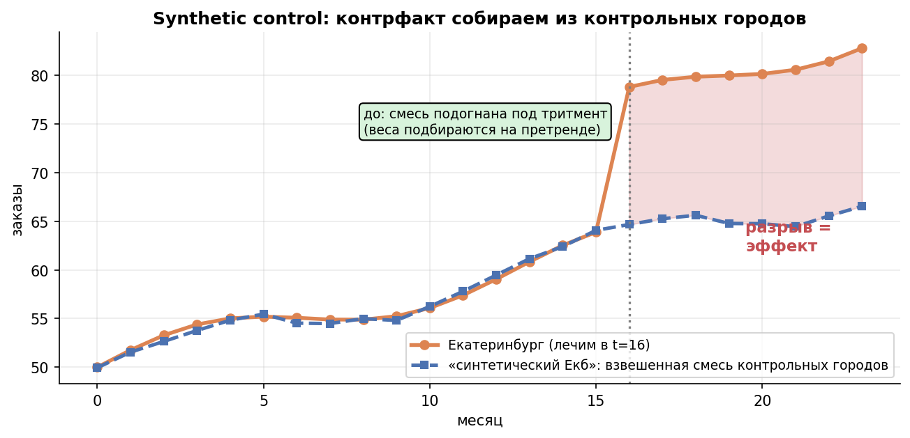
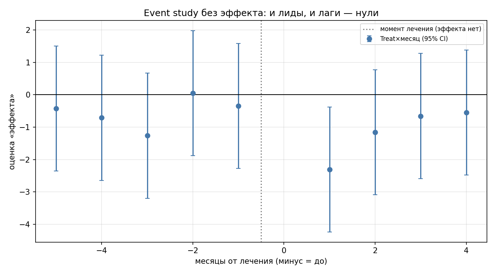
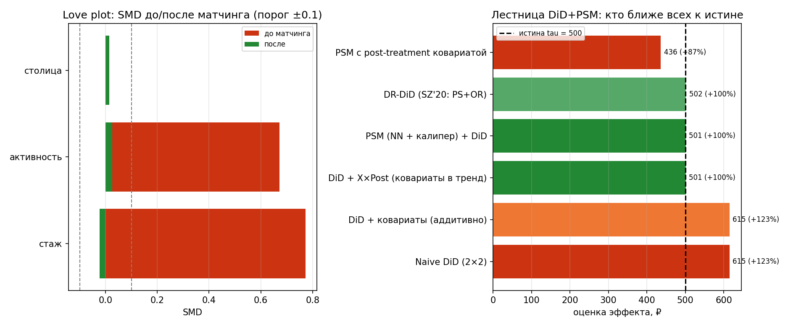

# Урок 6.3 — Квазиэксперименты: строим контроль, когда рандомизации нет

**Цель урока:** научиться конструировать контрольную группу вместо рандомизации — и отдельно доказывать, что она годится. Пройти пять семейств квазиэкспериментов: pre-post (понять, почему это даже не метод, а трамплин), DiD (разность разностей: параллельные тренды, регрессия с Post×Treat, event study для претрендов, ловушка staggered TWFE и лечение Callaway & Sant'Anna), связку DiD+PSM (матчинг выравнивает состав групп → conditional parallel trends; DR-DiD Sant'Anna & Zhao как современный стандарт — состоятелен, если верна хотя бы одна из двух моделей), RDD (порог как «локальная рандомизация» + четыре проверки), ITS/Causal Impact (прогноз как контрфакт) и synthetic control (смесь контролей вместо одного контроля, плацебо-юниты). Для каждого метода — его идентифицирующее предположение (непроверяемое прямо, но поддерживаемое косвенными тестами) и цена, которую он берёт: смещение, дисперсия, локальность или потеря выборки.

## Зачем это аналитику

В «ЕдаДома» А/Б невозможен гораздо чаще, чем кажется из урока 4.3: подписку «Прайм» запустили во всём городе сразу (нет контроля — сплитить поздно); хаб- darkstore открыли в одном городе (юнит один — нет «контрольной половины»); кэшбэк получают все, у кого скоринг ≥ 700 (порог назначил алгоритм, не мы); федеральную акцию с ресторанами дали всем партнёрам сразу; а на тренинг «школа курьеров» менеджеры сами отправили самых перспективных. В каждом случае вопрос один: **где взять контрфакт** — что было бы без воздействия? Уроки 6.1–6.2 показали: корреляция ≠ причинность (конфаундеры, DAG), а потенциальные исходы Y(1)/Y(0) не наблюдаются одновременно. Рандомизация решала это балансом групп; здесь баланс надо **построить** — из другого города, из «двойников», из порога, из прогноза, из смеси контрольных городов.

Метод — не вкусовщина: у каждого свои входные предположения и своя цена. Наивный pre-post съедает тренд (в практике ниже: +493 ₽ вместо истинных +250). DiD требует параллельных трендов — и ломается на staggered-раскатке, если эффекты неоднородны (наивный TWFE занижает на 27%). Связка DiD+PSM покупает более слабое предположение (conditional parallel trends) ценой +35–67% к SE и потери выборки на common support. RDD почти свободен от предположений о сравнимости, но отвечает только про «около порога». Synthetic control держит один юнит, но инференс груб (p-value не мельче 0,1 при 9 плацебо). Иерархия доверия из конспекта Матросова: A/B > DiD/SC > матчинг > CausalImpact > прогноз > до-после — если можно А/Б, делай А/Б; всё ниже — вынужденная мера с гигиеной, которой посвящён этот урок.

Классика, чтобы не думалось, что это экзотика: загрязнение Пекина на Олимпиаде-2008 (меры не назначишь рандомизацией — DiD против контрольных городов: −10% PM10 → −8% смертности), вход Wal-Mart на рынок (DiD по магазинам сети «рядом с Wal-Mart» против «на похожих рынках»), минимальный возраст алкоголя 21 год в США (RDD: +9% смертности ровно в 21), маркетинг казино по порогу прогнозируемой прибыльности (RDD «возникает сам» везде, где скоринг с отсечением). Внутренняя логика одна — и она же в вашем дашборде.

## Теория

### 1. Pre-Post: почему слаб (30 секунд)

«Было 2302 ₽ → стало 2795 ₽, значит подписка дала +21%». Сравнение юнита с самим собой не контролирует время: вместе с воздействием поменялись сезонность, тренд рынка, конкуренты, погода, праздники (урок 4.3 про внешние факторы; в телеграф-серии — «опытный исследователь vs стажёр»: сравнить человека с собой нельзя, время меняется вместе с лечением). На практике из блока 1: тест-город вырос на +493 ₽, но контрольные города сами по себе выросли на +243 ₽ — больше половины «эффекта» подписки на самом деле общий тренд. Pre-post — это не метод, а сырьё, из которого методы вычитают «что было бы и так». Дальше — четыре способа это «что было бы» построить.

### 2. DiD: разность разностей

Идея — вычесть не уровень, а **динамику**: контроль сообщает, как изменился бы тест без лечения. Пекин-2008: «до/после» ломается сезонностью, «Пекин vs другие регионы» — различиями уровней, а их комбинация — (изменение Пекина) − (изменение контроля) — убирает и то, и другое. В таблице 2×2:

$$\widehat{DiD} = (\bar{Y}^{тест}_{после} - \bar{Y}^{тест}_{до}) - (\bar{Y}^{контроль}_{после} - \bar{Y}^{контроль}_{до}).$$

**Идентифицирующее предположение — параллельные тренды**: без лечения тест изменился бы так же, как контроль (плюс no anticipation — эффект не начинается до лечения; контракт подписан в мае — курьеры могли «расслабиться» уже в апреле). Предположение непроверяемо прямо: контрфактичного тренда теста нет в данных. Косвенная поддержка — event study: оценка «эффектов» в каждый месяц относительно лечения, unit FE + time FE + Treat×месяц. До лечения все **лиды** должны быть нулями — в практике: 5 лидов с 95% CI на нуле, max |t| = 2,3; плюс плацебо-период («фейковое» лечение в середине пре-данных, p = 0,47 — ложный эффект не найден). Честная рамка (Roth, Sant'Anna, Bilinski & Poe 2023): pre-test — условие **необходимое, не достаточное**: у теста мало мощности, и прошедший вчера тест не гарантирует параллельности после лечения; плюс TWFE-лиды в staggered сами контаминированы (Sun & Abraham: ложные нарушения при истинной параллельности).

*Рис. 9. DiD: смотрим не уровни, а расхождение трендов; эффект = разрыв с контрфактом «продолжение тренда».*

*Рис. 1. DiD: контроль сообщает контрфактную динамику теста; эффект = вертикальный разрыв после лечения.*

Регрессионная форма — то же самое, но с SE и ковариатами:

$$Y_{it} = \beta_0 + \beta_1 Post_t + \beta_2 Treat_i + \beta_3\, Post_t \times Treat_i + \varepsilon_{it},$$

β₁ — общий сдвиг времени (тренд+сезон), β₂ — постоянное отличие уровней, **β₃ = DiD**. В практике: β₃ = 250,0 ₽ (SE 13,4, p ≈ 2e−75) при истине 250 — а ручная разность разниц даёт ровно то же число. Обобщение на панель — TWFE (two-way fixed effects): юнит- и время-FE плюс индикатор лечения.

**Ловушка staggered adoption.** «Прайм» раскатывается по городам волнами (когорты g = 3, 5, 7) плюс города без него. Наивный TWFE с индикатором D_it не различает «контроль = никогда не лечёные» и «контроль = уже лечёные»: когда эффекты неоднородны и нарастают (τ_it = 100 + 45·(t − g)), TWFE сравнивает поздние когорты с ранними — **вычитает из эффекта чужой накопленный эффект**. В практике: истинный средний эффект 222,5; наивный TWFE 161,6 (−27%); в декомпозиции Goodman-Bacon эти «плохие сравнения» — не баг реализации, а свойство оценщика. Лечение — Callaway & Sant'Anna (2021): считать ATT(g,t) для каждой когорты против **чистого контроля** (или ещё-не-лечёных), потом агрегировать с весами размеров когорт. В практике групповой DiD даёт 223,1 (отклонение +0%), и таблица ATT(g,t) совпадает с истинными 100 + 45·(t−g). Практический гайд пяти авторов современных DiD-методов (Baker, Callaway, Cunningham, Goodman-Bacon, Sant'Anna 2025) систематизирует этот «новый канон»: вне канонического 2×2 наивный TWFE — не вариант по умолчанию.

*Рис. 10. Ловушка staggered: «ещё не лечёные» ≠ «никогда не лечёные» — TWFE молча берёт лечёных как контроль.*

*Рис. 2. Staggered TWFE: в окне t3–t5 группа A уже лечена — наивный TWFE использует её как «контроль» и занижает эффект; Callaway & Sant'Anna сравнивают когорты только с чистым контролем.*

### 3. DiD + PSM: две слабые предпосылки вместо одной сильной

Дилемма. Чистый DiD требует **безусловной** параллельности трендов — сильное допущение, если группы изначально разные (тренинг назначили самым активным — и их тренд выручки другой). Чистый PSM (урок 6.4 впереди, но идею вы знаете из 6.1–6.2) требует selection on observables **по уровням** исхода — тоже сильное: все систематические различия лечёных и контролей должны наблюдаться в X. Связка ослабляет требования: матчинг выравнивает **уровни** по наблюдаемым X, DiD вычитает **постоянные ненаблюдаемые** — остаётся *conditional parallel trends*: тренды параллельны среди похожих (Sant'Anna & Zhao 2020). Историческая линия: Heckman–Ichimura–Todd (1997) ввели conditional DiD-матчинг на программе переобучения JTPA — и заметили, что CI нужен только по **приростам**, а не по уровням; Abadie (2005) — IPW-веса; Stuart et al. (2014) — PS-взвешивание 4 групп (treat/control × pre/post) для repeated cross-sections; SZ (2020) — **DR-DiD**, современный стандарт; Callaway & Sant'Anna (2021) — обобщение на staggered (DRDID внутри R-пакета `did`).

Три реализации связки: (а) **PSM → DiD**: матчинг по pre-treatment ковариатам (propensity из логита, ближайший сосед с калипером 0,2 SD логита), потом разность разностей на отматченных парах; (б) **IPW-DiD**: не отбрасывать, а взвешивать контролей весами ê/(1−ê); (в) **DR-DiD**: outcome-регрессия (OR) остатки + IPW-веса:

$$\hat\tau_{DR} = \underbrace{\overline{r}_{лечёные}}_{r_i = \Delta Y_i - \hat m_0(X_i)} \;-\; \frac{\sum_{контроли} \frac{\hat e(X_i)}{1-\hat e(X_i)}\, r_i}{\sum_{контроли} \frac{\hat e(X_i)}{1-\hat e(X_i)}},$$

где m̂₀ — модель прироста на контролях, ê — propensity. **Double robustness**: оценка состоятельна, если верна ХОТЯ БЫ одна из двух моделей — страховка на ошибку в спецификации; если верны обе — ещё и локально эффективна. В практике это проверяется напрямую: ломаем модель PS (выкидываем конфаундер) — DR держит 500,5; ломаем модель исхода — держит 494,6; ломаем обе — 636,9 (+27%), смещение вернулось.

Кейс тренинга (лекция «Как поймать эффект», слайд 22): наивное сравнение ловит selection bias («обучили лучших»); DiD требует параллельных трендов; матчинг подбирает двойников; **комбинация даёт более надёжную оценку — один метод, одна перспектива**. Это ровно литература LaLonde: программа тренинга NSW с экспериментальным бенчмарком **$1 794**; лестница исправлений (туториал Méndez): naive TWFE $3 621 → +аддитивные ковариаты $3 621 (не двигаются!) → ковариаты×post $1 711 → HIT(1997) $1 770 → Abadie IPW $1 861 → **SZ(2020) DR $1 993** — каждый шаг ближе к бенчмарку, DR устойчивей всех при плохом overlap (PSID).

**Честно: когда комбинация НЕ лучше** (Chabé-Ferret). Если селекция — по *time-invariant* ненаблюдаемым, DiD сам всё вычитает, а матчинг только добавляет шум и смещение через **regression to the mean**: матчинг по шумным pre-treatment исходам (а не по стабильным ковариатам) отбирает контролей с аномально высоким пре-уровнем — их возврат к среднему имитирует «нарушение претрендов». Если селекция — по *time-varying* факторам (классика **Ashenfelter's dip**: у записавшихся на тренинг доход «проваливается» прямо перед ним), DiD не спасает, а матчинг на уровни не чинит тренды — связка наследует проблему. Цена метода измерена: в Stuart et al. (2014, контракт AQC) SE выросли на **35–67%**, SMD после взвешивания ≈ 0, а эффекта на out-of-pocket-расходы не нашли — нулевой результат честной ценой дисперсии. Плюс common support: калипер выкидывает лечёных без двойников — в практике теряется ~1% и ESS контроля падает до 136; докладывать, кого выбросили, обязательно: молчаливый тримминг меняет эстиманд (для кого теперь ATT?). И главное про регрессии: «просто добавить ковариаты в DiD» аддитивно **не работает** — time-invariant X поглощается within-трансформацией (в практике: 615,2 → 615,2; у Méndez: $3 621 → $3 621); ковариата должна входить в **тренд** (X×Post), в веса или в матчинг.

*Рис. 11. Лестница к истине: naive → DiD → +ковариаты → PSM+DiD → DR-DiD; DR держится, даже если одна из моделей врёт.*

*Рис. 3. Лестница DiD+PSM в стиле LaLonde-теста: каждый шаг приближает к истине; DR-DiD держится даже при одной неверной модели.*

*Рис. 12. Love plot: матчинг выровнял ковариаты (SMD<0.1) — но баланс ≠ претренды, те проверяются отдельно.*

*Рис. 4. Love plot: SMD до/после матчинга. Баланс по X — необходимый, но не достаточный шаг: претренды проверяются отдельно и на отматченной выборке.*

### 4. RDD: порог как локальная рандомизация

Если лечение назначается правилом «running variable выше порога» — кэшбэк при скоринге ≥ 700, стипендия при доходе < $50 000, доступ к алкоголю с 21 года — то **рядом с порогом люди почти неотличимы**: у скоринга 699 и 701 одна и та же жизнь. Порог делает рандомизацию за вас — локально. Эффект — разрыв регрессии исхода у порога (локальная линейная с двух сторон; вес — наблюдениям у порога, bandwidth — окно, чувствительность к которому проверяют).

**Sharp vs fuzzy.** Sharp: порог детерминирует лечение (скоринг ≥ 700 → кэшбэк гарантирован) — разрыв = эффект. Fuzzy: порог меняет **вероятность** лечения (кэшбэк дали 70% выше порога и 10% ниже — операторы ошибаются, апелляции) — тогда разрыв исхода делят на разрыв вероятности (Wald; это IV у порога — мостик к уроку 6.4). Кейсы: минимальный возраст алкоголя 21 (Carpenter & Dobkin): +21% «дней употребления» и **+9% смертности ровно в 21 год** (водители, отравления, суициды); маркетинг казино (Hartmann et al.): direct mail по порогу прогнозируемой прибыльности — RDD «возникает сам» везде, где скоринг с отсечением.

Проверки (порог тоже надо защищать):
1. **Плотность running variable у порога (тест МакКрари)**: если у порога — аномальный скоп («подгонка скоринга», манипуляция менеджеров, апелляции), сравнение contaminated. Проверяется гистограммой/ядровой плотностью с двух сторон.
2. **Ковариаты не должны рваться** у порога (демография, стаж, город) — рвутся только через лечение; разрыв в ковариате = найден конфаундер порога.
3. **Плацебо-пороги**: тот же разрыв в точках, где лечения нет (650, 750) — должен быть нулём.
4. **Чувствительность к bandwidth** (окно ±10/±30/±50 баллов) и к функциональной форме — вывод не должен жить только в одном окне.

Цена метода — **локальность**: эффект оценён «у порога» (для юзеров со скорингом ≈ 700), экстраполяция на всю базу — отдельное предметное решение (внешняя валидность из 6.1).

*Рис. 13. RDD: рандомизацию делает порог — сравниваем «почти одинаковых» (74 и 76 баллов) по обе стороны.*

*Рис. 5. RDD: сравниваем «почти одинаковых» по обе стороны порога; разрыв у порога = эффект, у него же — все проверки (плотность, ковариаты, плацебо-пороги).*

### 5. ITS + Causal Impact: прогноз как контрфакт

Когда нет ни второй группы, ни порога, а вмешательство — событие на оси времени («редизайн раскатан всем», «запрет ночных продаж алкоголя» → ночные ДТП), остаётся **interrupted time series**: модель тренда до вмешательства (уровень + тренд + сезонность) экстраполируется вперёд, и разрыв «факт − прогноз» после точки вмешательства — оценка эффекта. Это «RDD по времени», но без локальной рандомизации у порога, поэтому главная угроза — **конфаундер времени**: всё, что случилось одновременно с лечением (праздник, конкурент, погода), попадёт в эффект. Лечение — контрольный ряд: ITS + незатронутый регион = уже знакомая логика DiD.

**Causal Impact** (Google) — инженерная обёртка той же идеи: байесовские структурные временные ряды (BSTS, привет модулю М5) комбинируют тренд, сезонность и **контрольные ряды**, коррелирующие с целевой метрикой до вмешательства (заказы iOS — контроль для Android-релиза), и строят апостериорное распределение контрфакта: «прогноз как контрфакт», с честными доверительными интервалами. Допущение: связь целевого и контрольного рядов стабильна и сама не изменилась от вмешательства (контроль не «загрязнён» спиллбэком — иначе вернитесь к 4.3 про интерференцию). Слабое место всех методов этой семьи: они молча предполагают, что модель претренда правильно специфицирована; смена формы тренда до вмешательства → систематический сдвиг прогноза. Проверки — те же DiD-овские: pretrend-остатки должны быть белым шумом, плацебо-вмешательства на пре-данных — нулями.

*Рис. 6 (VIS-заготовка). ITS/Causal Impact: контрфакт = прогноз модели тренда+сезонность+контрольные ряды; эффект = разрыв «факт − прогноз».*

### 6. Synthetic control: контрфакт из смеси контролей

Один treated-юнит (город с хабом) — DiD нечем вычитать: один «средний контроль» не обязан быть похож. Идея Abadie & Gardeazabal: собрать **«синтетический город»** — взвешенную смесь контрольных городов, где веса подбираются на претренде так, чтобы смесь воспроизводила динамику лечёного города. В отличие от DiD, выравнивается не средний тренд, а **вся траектория претренда** — и это даёт интерпретируемость для стейкхолдеров: «Екатеринбург = 0,3×Пермь + 0,2×Тюмень + …» (в практике: 6 городов с весами 0,06–0,34). Технически — ограниченная регрессия: веса ≥ 0, сумма = 1 (отрицательный город — не объяснишь продакту); в практике решается NNLS по пре-периоду, качество подгонки видно по pre-MSPE (у нас 1,1 при шуме 1,2 — смесь почти идеальна). Эффект = разрыв «факт − синтетик» после вмешательства (в практике: +8,4% при истине +8,0; наивный pre-post того же города: +21,6%).

Инференс при одном юните — **плацебо-юниты** (пермутационная логика): строим синтетиков для каждого контрольного города «как будто лечён он», сравниваем распределение их разрывов с нашим. Метрика — ratio post/pre MSPE: у лечёного города он 103, у плацебо — 0,6–3,3: эффект кричит. Но при 9 плацебо минимальный достижимый p-value = 1/(9+1) = 0,10 — инференс грубый, это честная цена дизайна. Развития: SC+DiD (синтетик минус постоянный сдвиг — забирает и фиксированные различия), и TRoP (тройная робастность: факторная модель + чувствительности + остатки, SC+DiD на остатках — конспект Матросова §33).

*Рис. 14. Synthetic control: контрфакт собираем из контрольных городов, веса подгоняем на претренде.*

*Рис. 7. Synthetic control: веса подбираются на претренде (смесь ≈ факт), после вмешательства разрыв = эффект.*

## Разбор на данных

Из практики `practice_6_3.py` (seed 63, числа воспроизводятся; истина известна — симуляция).

**DiD 2×2 (подписка «Прайм», истина +250 ₽).** Контроль: 2137,6 → 2380,9 (+243,3). Тест: 2301,8 → 2795,1 (+493,3). Наивный pre-post: **+493,3 ₽ (+21,4%)** — тренд и сезонность приписаны подписке. DiD руками: (493,3 − 243,3) = **250,0**. Регрессией: β₃ = **250,0** (SE 13,4, p = 2e−75); β₁ = 243,3 (общий тренд), β₂ = 164,2 (сдвиг уровней — селекция города) — DiD вычитает их сам.

**Pretrend-тесты (данные без эффекта).** Event study с unit/time FE и Treat×месяц: все 5 лидов и 4 лага в пределах ±2,3; 95% CI накрывает ноль у 8 из 9 коэффициентов (при 9 интервалах так и должно быть примерно в 9). Плацебо-период (фейковое лечение на мес 4, только пре-данные): DiD = +0,70, p = 0,47 — ложный эффект не найден. Это и есть поведение теста «в мире, где предположение верно».

*Рис. 8. Event study под H0: все коэффициенты Treat×месяц — нули с шумом; так выглядит «претренды параллельны» в данных.*

**Staggered-ловушка (волны «Прайма», эффекты нарастают: τ_it = 100 + 45·(t−g)).** Истинный средний эффект по лечёным наблюдениям: 222,5. Наивный TWFE: **161,6 (SE 3,1) — занижение на 27%**. Групповой DiD в логике CS(2021) (когорта против никогда-не-лечёных, агрегация ATT(g,t)): **223,1 (SE 1,1, бутстреп) — отклонение 0%**. Таблица ATT(g,t) восстанавливает истинную динамику (когорта g=3: 101,6 / 145,7 / 193,0 / 233,7 / 282,6 / 322,4 / 370,1 / 416,9 против истины 100 / 145 / 190 / …). Механика провала: TWFE берёт уже лечённые когорты как контроль — и вычитает чужой накопленный эффект.

**Synthetic control (хаб в городе 0, истина +8,0%).** Наивный pre-post города: **+21,6%** (съеден ростом рынка). Разрыв факт − синтетик: **+8,4%**. Pre-MSPE = 1,09 при шуме 1,2 — подгонка претренда почти идеальна (веса: 6 городов, максимум 0,34; ограниченный NNLS). Плацебо-юниты: ratio post/pre MSPE лечёного = 103,1 против 0,58–3,28 у плацебо → пермутационный p = 0,10 (минимум при 9 плацебо — грубость признаём честно).

**DiD+PSM (тренинг курьеров: X2 = прошлая активность — конфаундер и в назначении, и в тренде; истина τ = 500).** Лечёных 638 из 1500 (43%); SMD до матчинга: стаж +0,77, активность +0,67, столица 0,00. Лестница:

| оценщик | оценка | % истины |
|---|---|---|
| Naive DiD (2×2) | 615,2 | +23% — безусловные тренды непараллельны |
| DiD + ковариаты (аддитивно) | 615,2 | +23% — не сдвинулось: X поглощается |
| DiD + X×Post (ковариаты в тренд) | 501,2 | 100% |
| PSM (NN + калипер) + DiD | 501,1 (CI 485–516) | 100% |
| DR-DiD (SZ'20: PS + OR) | 501,9 (CI 494–508) | 100% |
| PSM с post-treatment ковариатой | 436,3 | −13% — грабля |

Матчинг: 634 пары из 638 лечёных (потеря 1%), ESS контроля 136, SMD после: −0,02 / +0,03 / +0,01. Double robustness — ломаем по одной модели (истина 500): обе верны → 501,9; PS неверна (без X2) → 500,5; OR неверна → 494,6; обе неверны → 636,9 (+27%) — страховка работает ровно до первой полной аварии. Грабля: «рейтинг качества за первые 2 недели мая» в propensity (на него тренинг уже повлиял) — 436,3 (−13%): матчинг подтягивает контролей с высоким пост-шумом и вычитает часть эффекта.

*Рис. 9. Слева — Love plot: SMD до/после матчинга (все ушли за порог ±0,1). Справа — лестница оценщиков: от наивного +23% через X×Post и PSM к DR у истины; грабля с post-treatment ковариатой — в минус.*

## Подводные камни

1. **«Претренды прошли — значит, всё чисто».** Делают: event study без нарушений → докладывают эффект без оговорок. Грозит: pre-test — необходимое, не достаточное (Roth et al. 2023): мало мощности у короткого пре, чувствительность к функциональной форме, а в staggered TWFE-лиды сами контаминированы (Sun & Abraham: ложные нарушения при истинной параллельности). Правильно: претренды + плацебо-периоды + предметные знания о шоках; для conditional PT — pretrends на отматченной выборке.
2. **Матчинг по post-treatment ковариатам.** Делают: суёт в propensity всё, что есть, включая «рейтинг за первый месяц после» или «пост-активность». Грозит: подтягивание контролей под лечёных по переменной, на которую лечение уже повлияло, — часть эффекта вычитается (в практике: 436 против 500). Правильно: только pre-treatment ковариаты; любую колонку из «после» — вычеркнуть (bad control из 6.1).
3. **«Добавлю ковариаты в DiD-регрессию — и исправлю непараллельность».** Грозит: аддитивные time-invariant ковариаты поглощаются within-трансформацией — оценка не двигается (615,2 → 615,2; у LaLonde $3 621 → $3 621). Правильно: ковариата должна входить в тренд (X×Post, с главными эффектами X!), в веса (IPW/DR) или в матчинг.
4. **Наивный TWFE на staggered-раскатке.** Делают: один индикатор D_it на панели с волнами лечения. Грозит: «уже лечёные» как контрали — занижение на 27% при нарастающих эффектах, иногда и смена знака. Правильно: Callaway & Sant'Anna (ATT(g,t) против чистого контроля), event-study агрегация; при отсутствии чистого контроля — читать про сравнения «ещё не лечёные» осознанно (Practitioner's Guide 2025).
5. **Баланс перепутать с параллельностью.** Делают: SMD ≈ 0 после матчинга → «тренды точно параллельны». Грозит: матчинг выравнивает уровни по наблюдаемым, но не гарантирует тренды; а агрессивный матчинг по шумным пре-исходам создаёт regression to the mean — ложные «претренды» (Chabé-Ferret). Правильно: матчиться по стабильным ковариатам, влияющим на тренд; pretrends проверять на отматченной выборке; совместный pre-test (в `did` — joint p-value).
6. **Молчать про цену комбинации.** Грозит: SE растут (+35–67% у Stuart et al.), экстремальные IPW-веса раздувают дисперсию, калипер выбрасывает лечёных без двойников — и эстиманд незаметно становится «ATT для тех, у кого есть двойники». Правильно: докладывать потерю выборки и ESS, гистограмму весов, и явно формулировать, для кого теперь оценка.
7. **Ashenfelter's dip и прочая time-varying селекция.** Грозит: у лечёных аномальный «провал» прямо перед лечением (записались на тренинг из-за просадки) — DiD интерпретирует восстановление как эффект, матчинг на уровни не чинит. Правильно: смотреть на пре-траектории лечёных (event study!), думать о механизме селекции, при dip — честно обсуждать границы метода (связка не всесильна: Chabé-Ferret).
8. **Synthetic control на коротком претренде.** Грозит: веса подгоняют шум, а не структуру (особенно без ограничений на знаки); инференс по плацебо груб (p ≥ 0,10 при 9 донорах) — «значимость» недостижима по построению. Правильно: веса ≥ 0 и Σ = 1 (NNLS), длинный претренд, отчёт по pre-MSPE и placebo-распределению; интерпретировать состав смеси предметно.

## Практика

Файл: `practice_6_3.py` (percent-формат, numpy/scipy/pandas/matplotlib, seed 63, Agg; OLS везде через `np.linalg.lstsq`, без statsmodels). Что делает:

1. **DiD 2×2 руками и регрессией** (подписка «Прайм»): таблица до/после, наивный pre-post против разности разниц; регрессия с дамми (β₁ тренд, β₂ сдвиг, β₃ = DiD) — наивный 493,3 против истинных 250.
2. **Pretrend-тесты**: event study (unit FE + time FE + Treat×месяц) на данных без эффекта — лиды/лаги нули; плацебо-период на пре-данных.
3. **Staggered-ловушка**: 3 когорты + чистый контроль, эффекты нарастают; наивный TWFE (−27%) против группового DiD в логике Callaway & Sant'Anna (ATT(g,t), бутстреп-SE).
4. **Synthetic control**: хаб в одном городе, 9 доноров; веса — ограниченный NNLS по претренду (неотрицательность, сумма 1); разрыв факт−синтетик; плацебо-юниты с ratio post/pre MSPE и пермутационным p-value.
5. **Мини-кейс DiD+PSM**: панель 1500 курьеров × 6 месяцев, конфаундер в назначении и в тренде, истина τ = 500; лестница naive → +ковариаты (аддитивно и в тренд) → PSM (свой logit-IRLS + ближайший сосед с калипером 0,2 SD логита, SMD/Love plot, ESS, бутстреп по парам) → DR-DiD в духе SZ'20 (OR-остатки + IPW-веса) с проверкой double robustness (ломаем PS и OR по очереди); грабля — post-treatment ковариата в propensity.

Графики: `practice_6_3_did.png`, `practice_6_3_event_study.png`, `practice_6_3_staggered.png`, `practice_6_3_synth.png`, `practice_6_3_psm.png` — рядом со скриптом. Пакетная гигиена: DR-DiD/CS в Python — `differences`, `diff-diff`, `DoubleML`; **`pydid` в PyPI — НЕ про DiD** (это decentralized identity), в `causalml` DiD-оценщика нет (только PSM и DR-Learner).

## Домашнее задание

1. Маркетинговая акция «ЕдаДома» запущена в Перми с июня. Средний чек: Пермь до 950, после 1015; контрольные города до 920, после 945. Посчитайте наивный pre-post и DiD. Какой вывод о «росте на 6,8%» из презентации маркетинга?

Ответ

Наивный: 1015 − 950 = +65 ₽ (+6,8%). DiD: (1015 − 950) − (945 − 920) = 65 − 25 = **+40 ₽ (+4,2%)**. Контрольные города сами выросли на 25 ₽ — это тренд/сезон, а не эффект акции; маркетинг приписал акции чужие 25 ₽ (38% «эффекта»). Вся презентация держится на предположении параллельных трендов — его и надо проверять event study'ем до июня.

2. «Прайм» раскатывается волнами: город A — январь, город B — март, город C — май; эффект в каждом городе нарастает со стажем подписки. Наивный TWFE вернул средний эффект заметно ниже, чем динамический event study по когортам. Объясните механику занижения и что именно делает Callaway & Sant'Anna.

Ответ

TWFE с одним индикатором D_it разрешает «контролями» все, у кого D = 0 в данный момент, — включая города A и B, которые УЖЕ лечены (у них D = 1... но в двухсторонней FE-регрессии сравнения «B против A в мае» остаются в игре как «не-изменившиеся»). Когда B сравнивается с A, из прироста B вычитается накопленный к маю эффект A — поздние когорты «оплачивают» ранние; при нарастающих эффектах это систематическое занижение (в практике: −27%). CS: для каждой когорты g и периода t считается ATT(g,t) только против никогда-не-лечёных (или ещё-не-лечёных с оговорками), потом агрегируется с весами размеров когорт — «плохие сравнения» исключены по построению.

3. В LaLonde-лестнице добавление ковариат аддитивно в TWFE не изменило оценку ($3 621 → $3 621), а включение ковариат × post дало $1 711. Почему аддитивные ковариаты «не работают» и что именно покупает X×Post?

Ответ

Аддитивные time-invariant ковариаты в DiD-регрессии поглощаются within-/FD-трансформацией: они объясняют различие уровней, которое разность разниц и так вычитает, — на различие ТРЕНДОВ они не влияют. Нарушение параллельных трендов у LaLonde-выборки — про то, что состав групп (X) по-разному эволюционирует; X×Post позволяет ковариате входить именно в пост-динамику, т.е. моделирует conditional parallel trends. Та же логика в нашей практике: аддитивно 615,2 (не двинулось), X×Post — 501,2 у истины. (Нюанс спецификации: X×Post добавляют вместе с главными эффектами X.)

4. «ЕдаДома» даёт персональные купоны всем, у кого скоринг лояльности ≥ 700. Опишите план RDD-анализа эффекта купонов на выручку: что сравниваем, что должно быть нулём до анализа, и что меняется, если купон получают лишь 80% выше порога (и 5% ниже — «апелляции»).

Ответ

Сравниваем юзеров чуть ниже и чуть выше 700: локально-линейные регрессии выручки по running variable с двух сторон, разрыв на 700 = эффект. До анализа: (1) плотность скоринга без скачка у 700 (МакКрари — нет подгонки скоринга/апелляций); (2) ковариаты (стаж, платформа, город) непрерывны у порога; (3) плацебо-пороги 650/750 — нулевые разрывы; (4) устойчивость к bandwidth. Если лечение вероятностное (80% vs 5%) — это fuzzy RDD: разрыв исхода делят на разрыв вероятности получить купон (Wald/IV), оценивается эффект для «комплаеров» — тех, кто купон получает именно из-за порога (LATE-логика из 6.2).

5. Почему DR-DiD «прощает» ошибку в одной из моделей — и что происходит, когда неверны обе? Разложите по формуле: что компенсирует что.

Ответ

τ_DR = (средний OR-остаток лечёных) − (IPW-взвешенный средний остаток контролей). Если верна OR (m̂₀ = E[ΔY(0)|X]): остатки контролей — центрированный шум, второе слагаемое ≈ 0 при любых весах; первое = τ. Если верна PS: наклонные веса ê/(1−ê) перевзвешивают контролей так, что их остатки воспроизводят E[ΔY(0)|X, D=1] — систематику неверной OR вычитают именно те, у кого она есть. Ошибка одной модели закрывается другой. Если неверны обе — компенсировать нечему: в практике 636,9 против истины 500 (+27%), т.е. смещение того же порядка, что у наивного DiD. Отсюда практический вывод: DR — страховка спецификации, а не замена мысли о том, какие X вообще нужны (из 6.1).

## Шпаргалка

1. **Карта «где взять контрфакт»**: другой город/группа → DiD; двойники → DiD+PSM; порог → RDD; прогноз (тренд+сезон+контрольный ряд) → ITS/Causal Impact; смесь контролей → synthetic control; рандомизация недоступна, но есть «подталкивание» → encouragement/IV (урок 6.4).
2. **DiD**: (Δтест − Δконтроль); регрессия y ~ Post + Treat + Post×Treat, эффект = β₃; предположение — параллельные тренды + no anticipation. Event study: лиды = нули; плацебо-периоды; pre-test необходим, не достаточен.
3. **Staggered**: наивный TWFE использует уже лечёных как контрали и врёт при неоднородных/нарастающих эффектах; лечение — Callaway & Sant'Anna: ATT(g,t) против никогда-не-лечёных → агрегация. Вне 2×2 TWFE «по умолчанию» не катит.
4. **Ковариаты в DiD**: аддитивно — поглощаются (не работают); X×Post (с главными эффектами), IPW-веса или матчинг — работают. Conditional parallel trends = параллельность среди сравнимых по X.
5. **DiD+PSM**: матчинг только по pre-treatment X; после матчинга — SMD/Love plot (порог 0,1) и pretrends НА ОТМАТЧЕННЫХ; докладывать common support/ESS. Честные минусы: +35–67% SE, RTM при матчинге по шумным пре-исходам, бессилие против Ashenfelter's dip.
6. **DR-DiD (SZ'20)**: OR-остатки + IPW-веса; состоятелен при верной любой одной из моделей, эффективен при обеих; в Python — `differences`/`diff-diff`/`DoubleML` (не `pydid`!, в causalml DiD нет).
7. **RDD**: эффект = разрыв у порога; sharp (порог = лечение) vs fuzzy (Wald: разрыв исхода / разрыв вероятности); проверки — плотность (МакКрари), непрерывность ковариат, плацебо-пороги, bandwidth. Цена — локальность вывода.
8. **ITS/Causal Impact**: контрфакт = прогноз тренда+сезонность(+контрольные ряды, BSTS); слабое место — конфаундер времени и стабильность связи с контролем; pretrend-остатки должны быть шумом.
9. **Synthetic control**: один юнит; веса ≥ 0, Σ = 1 по претренду (NNLS); эффект = разрыв факт−синтетик; инференс — плацебо-юниты (ratio post/pre MSPE, p ≥ 1/(J+1)); интерпретируемая смесь вместо «среднего контроля».
10. **Общий рефрен**: у каждого метода — непроверяемое идентифицирующее предположение; доказывать его косвенно (претренды, плацебо, баланс, плотности) и докладывать цену (SE, выборка, локальность). Иерархия: A/B > DiD/SC > матчинг > CausalImpact > прогноз > pre-post.

## Источники

- `materials/local/causal-inference-doc.md` (конспект Матросова): §30 (DiD + ловушка staggered TWFE + Callaway & Sant'Anna с таблицами), §31 (PSM vs DiD / PSM + DiD: комбинирование), §32 (SC + DiD), §33 (TRoP), §28 (synthetic control: веса, MSPE, пермутационный тест), §34 (RDD), §35 (ITS: алкоголь/ночные ДТП, контрольный регион), §36–38 (прогноз с контрольным рядом, Causal Impact/BSTS), §13 (иерархия доверия методов), §41 (метод → эстиманд: DiD/matching → ATT).
- `materials/web/research-did-psm.md` — главный research для связки: Heckman–Ichimura–Todd (1997, conditional DiD-матчинг, JTPA); Stuart et al. (2014, AQC: 4 группы, SMD ≈ 0, SE +35–67%); Sant'Anna & Zhao (2020, DR-DiD, arXiv:1812.01723); Chabé-Ferret (2015/2017: когда комбинация не лучше, RTM, Ashenfelter's dip); Roth et al. (2023, pretrend-тест — не доказательство); Caetano & Callaway (2024); туториал Méndez (LaLonde-лестница $3 621 → $1 993 против бенчмарка $1 794); пакеты `did`/`DRDID`/`differences`/`diff-diff`/`DoubleML`, ловушка `pydid`.
- `materials/local/lecture-catch-effect.md` — лекция «Как поймать эффект», слайды 15–22: карта методов «от простого к сложному» (Pre-Post → DiD → RDD → Matching → IV) и кейс тренинга (matching + динамика до/после: «комбинация методов даёт более надёжную оценку»).
- `materials/telegram/telegraph-causal-series.md` — ч.4 «Квазиэксперименты» (идентифицирующие предположения; DiD Пекин-2008/Wal-Mart/TV-реклама; RDD стипендия/алкоголь-21; IV encouragement Spotify — мостик к 6.4) + конспекты статей из неё: He, Fan & Zhou (2016, Пекин), Baker, Callaway, Cunningham, Goodman-Bacon & Sant'Anna (2025, «DiD Practitioner's Guide», arXiv:2503.13323), Ailawadi et al. (2010, Wal-Mart), Carpenter & Dobkin (2009, алкоголь-21: +21% дней употребления, +9% смертности), Hartmann, Nair & Narayanan (2011, RDD в казино-маркетинге).
- `materials/web/web-articles.md` — MCP Analytics «Causal Inference Methods» (обзор 9 методов, иерархия валидности, Causal Impact, synthetic control «прозрачен для стейкхолдеров»); koch-kir «Causal Inference from Observational Data» (обзор: matching/IPW/DR, DiD/RDD/ITS/SC как временные дизайны).
- Kohavi et al., гл. 11 (когда A/B невозможен — рамка «вынужденной меры»); HKU L7; Deng гл. 6 (квазиэксперименты); ВШЭ «А/B-тестирование», темы 16–18.
- Внутренние связи: уроки 6.1 (DAG, bad control — почему в матчинг только pre-treatment X) и 6.2 (potential outcomes, ATT/LATE — эстиманды методов); урок 3.5 (CUPED — пре-период как ковариата, родственная логика); далее 6.4 (matching/PSM глубоко, IV, double ML), 6.5 (sensitivity, карта методов, ошибка III рода).
