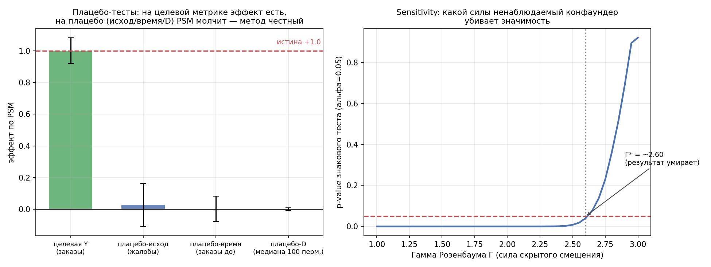
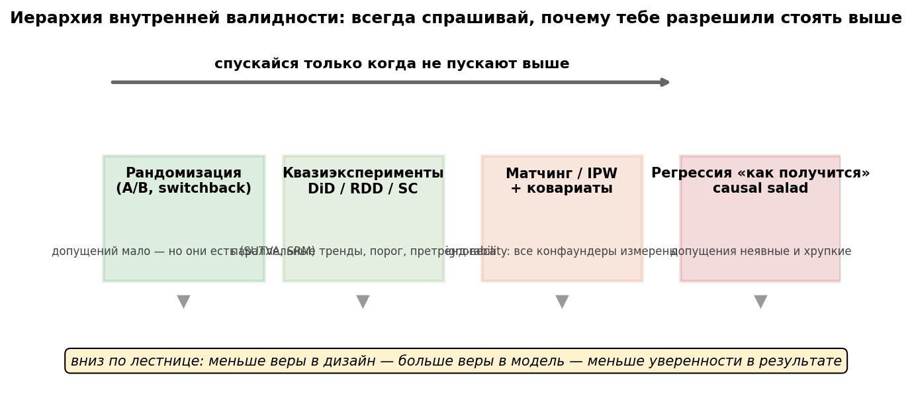

# Урок 6.5 — Доверие к результату и карта методов

**Цель урока:** выстроить культуру refutation — относиться к собственной каузальной оценке как к подозреваемому и добиваться от неё алиби (плацебо-исходы, плацебо-времена, плацебо-экспозиция, отрицательные контроли); овладеть sensitivity-аппаратом — гамма Розенбаума, E-value, дельта Остера: «насколько сильный ненаблюдаемый конфаундер нужен, чтобы убить мой вывод»; закрепить иерархию внутренней валидности и собрать финальное дерево выбора метода всего модуля; научиться распознавать ошибку III рода (прокси-метрики, Гудхарт, медиация) и честно говорить «вывод делать не будем».

## Зачем это аналитику

Вы прошли весь модуль: DAG (6.1), potential outcomes (6.2), квазиэксперименты (6.3), матчинг/IPW/IV/DML (6.4). У вас есть оценка: «подписка „ЕдаПлюс" даёт +1,0 заказ/мес, p < 0,001». И тут в переговорке встречают вопрос, от которого нельзя отмахнуться: «А почему мы должны этому верить?»

В A/B-тестах на этот вопрос отвечала инфраструктура: рандомизация + SRM + A/A-тесты (4.2) — довески доверия автоматизированы. В наблюдательных данных всё иначе: **любая каузальная оценка держится на непроверяемых допущениях** (ignorability, параллельные тренды, exclusion restriction), и единственная защита — попытаться **опровергнуть собственный результат** и посмотреть, выживет ли он. Это не пессимизм, а метод: как SRM был «красной тряпкой» для эксперимента, так плацебо-тесты — красная тряпка для наблюдательного анализа.

Второй вопрос этого урока — стратегический: каждую неделю на «ЕдаДома» приходит новая задача без готового дизайна («подняли цену для всех», «переписали алгоритм выдачи», «хотим понять эффект программ лояльности»). Дерево выбора метода — финальная шпаргалка модуля: от «можно рандомизировать?» до «не делать выводов». И третья линия — самая коварная: даже идеально измеренный эффект бывает **ответом не на тот вопрос** (прокси вместо бизнес-метрики, оптимизация под метрику по Гудхарту, непонятый механизм). Это ошибка III рода — и она не лечится p-value.

## Теория

### 1. Культура refutation: алиби для вашего эффекта

Идея (в [Матросове, §Доверие к результату CI] доведена до чек-листа; в DoWhy это называется refutation tests): все допущения каузальных методов напрямую непроверяемы, но у них есть **косвенные следствия, которые обязаны выполняться**. Проверяем следствия — тесты дополняют друг друга, делаем все:

- **Плацебо-исход** (placebo outcome): прогоните весь пайплайн на метрике, на которую лечение влиять не может (число жалоб на качество, рост пользователя). Эффект «прокрасился» — ваш пайплайн производит артефакты, результату на целевой метрике верить нельзя;
- **Плацебо-время** (pretrend / placebo time): посчитайте эффект «в прошлом» — на предпериоде, когда лечения ещё не было. Наивная разность там будет большой (селекция же никуда не делась!) — это правильная развилка: пайплайн обязан её убрать; остаточный сдвиг = остаточное смещение, которое сидит и в основной оценке;
- **Плацебо-экспозиция** (placebo treatment): перемешайте назначение лечения (пермутация D или фейтовое правило типа «чётность последней цифры телефона»). Наблюдаемый эффект должен выпадать из полученного нуль-распределения — это пермутационный тест для вашей оценки;
- **Отрицательные контроли** (negative controls): исход, который заведомо не трогается лечением (аналог плацебо-исхода), и экспозиция, которая заведомо не трогает исход (негативная экспозиция) — если найдена «связь», где её быть не может, в данных есть общий источник загрязнения;
- **Удаление 10–20% данных**: коэффициент не должен заметно гулять — иначе оценка держится на нескольких аномальных наблюдениях;
- **A/A на предпериоде, MDE на ESS** (из 6.4): алгоритм матчинга на исторических данных должен давать ошибку I рода ≈ α; мощность считать на эффективном размере выборки.


Ключевой предел честности: **пройденные плацебо не доказывают валидность**. Они опровергают конкретные альтернативные объяснения (плохой баланс, спецификацию, artefact пайплайна) — necessary, not sufficient. Остаток риска — ненаблюдаемый конфаундер — закрывается не тестами, а sensitivity-анализом.

### 2. Sensitivity: какой силы конфаундер убьёт вывод

Формулировка вопроса ([Матросов, §Sensitivity]): «Насколько выраженным должен быть ненаблюдаемый конфаундер, чтобы полностью объяснить наш эффект?» Если достаточно слабейшего — результат неустойчив; нужен очень сильный — крепкий.

**Гамма Розенбаума** (для матчинга/парных дизайнов). При честной рандомизации шансы попасть в тест/контроль 50/50; скрытое смещение делает их Γ : 1. Считаем по парам: сколько пар «выиграл» treated; при Γ вероятность победы в паре = Γ/(1+Γ); перебираем Γ, пока p-value знакового теста не поднимется до α — это Γ\*: порог, до которого результат ещё дышит. Интерпретация по шкале из [Матросова]: Γ до 1,15 — слабейший конфаундер убивает, не верить; 1,15–1,5 — приемлемо с оговоркой; 1,5–2 — сопоставимо со значимым A/B; больше 2 — почти непробиваемо. Число Γ — это **отношение шансов** попадания в лечение (1,5 = «в 1,5 раза вероятнее»), не вероятность.

**E-value** (VanderWeele–Ding, для отношений рисков): переводит вопрос sensitivity в одну цифру:

$$E\text{-value} = RR + \sqrt{RR(RR-1)}.$$

Чтение: чтобы **полностью** объяснить наблюдаемую ассоциацию лечение–исход, ненаблюдаемый конфаундер должен быть связан **и с лечением, и с исходом** ассоциацией не слабее RR = E-value каждая (на шкале риск-отношений). E-value ≈ 1 — достаточно пылинки; 1,5 — умеренно; 2+ — крепко. Считают и по границе CI, ближайшей к нулю: E-value нижней границы отвечает на вопрос «что нужно, чтобы убрать хотя бы значимость». Как p-value говорит о значимости, E-value — о **устойчивости к неучтённому**.

**Дельта Остера** (для регрессионных корректировок). Логика: наблюдаемые ковариаты уже сдвинули оценку с $\hat\beta_{naive}$ до $\hat\beta_{ctrl}$ и объяснили $R^2_{ctrl}$ против $R^2_{naive}$. Что если ненаблюдаемая селекция столь же сильна, как наблюдаемая? Формула bounding-оценки:

$$\beta^* = \beta_{ctrl} - \delta \cdot (\beta_{naive} - \beta_{ctrl}) \cdot \frac{R^2_{max} - R^2_{ctrl}}{R^2_{ctrl} - R^2_{naive}},$$

где $R^2_{max} = 1{,}3 \cdot R^2_{ctrl}$ (эмпирическое правило Остера), δ — во сколько раз селекция по ненаблюдаемым сильнее, чем по наблюдаемым. Поднимаем δ, пока $\beta^*$ не занулится: **δ\* и есть мера устойчивости**. Шкала: δ < 1 — результат легко объяснить скрытой переменной; ≈1 — на грани; 1–2 — умеренно устойчив; >2 — хорошо; >3 — крайне устойчив. Быстрый родственник — «индекс стабильности»: отношение $(\beta_{naive} - \beta_{ctrl})/\beta_{ctrl}$.


*Рис. 2. Sensitivity: пока скрытое смещение слабее Γ* — вывод жив; правее — мёртв (из практики).*

Связка трёх инструментов: гамма — для парных дизайнов, E-value — для RR (быстро, одной формулой), дельта — для регрессий; Sensemakr (упомянут в [Матросове]) рисует «какие (сила на лечение × сила на исход) убивают эффект».

### 3. Иерархия внутренней валидности


*Рис. 1. Иерархия внутренней валидности: вниз — больше веры в модель, меньше уверенности в результате; «спускайся только когда не пускают выше».*

*Рис. 3. Иерархия валидности: спускайся вниз только когда не пускают выше.*

Ранг методов по внутренней валидности (пирамида доказательств из [Матросова], §оценка доказательности: A/B с весом 100%, DiD/SC — 50%, матчинг — 33%, CausalImpact — 25%, прогноз — 20%, до-после — 16%; та же иерархия у [MCP Analytics]):

1. **Рандомизация** — допущений мало (но они есть: SUTVA, отсутствие SRM — см. 4.2);
2. **Квазиэксперименты** — DiD/RDD/SC: одно сильное допущение вместо многих (параллельные тренды / чистота порога / качество синтетика), часто проверяемое косвенно (претренды);
3. **Корректировки по ковариатам** — матчинг/IPW/DR: допущение ignorability — «все конфаундеры измерены», принципиально непроверяемое; поэтому этаж ниже и его обязателен sensitivity-аудит;
4. **«Causal salad»** — регрессия «как получится», до-после, прогноз без контрольного ряда: допущения неявные, доверие минимальное.

Два честных уточнения: иерархия — про **внутреннюю** валидность (рандомизированный тест на неправильной аудитории может проиграть аккуратному DiD по внешней); и «разрешение на верхний этаж» не гарантирует качества — кривой A/B со SRM хуже хорошего матчинга. Правило: **всегда спрашивайте, почему вам разрешили стоять выше** — и не спускаться без причины, не подниматься без оснований.

### 4. Ошибка III рода: правильный ответ на неправильный вопрос

Из [shelter_analytics, «CI на пальцах», ч. 4]: даже корректно измеренный каузальный эффект ведёт к неверному решению, если измерено не то, что важно. Два механизма:

**Прокси-метрики.** Эффект «раскрытие использования ИИ снижает доверие потребителей» измерен честно — но переход от «доверия» к продажам/росту — отдельное каузальное предположение. Это не внешняя валидность (там — та же переменная в другом месте/времени), это **перенос вывода с одной переменной на другую**. Лечение: набор взаимодополняющих метрик вместо одной удобной (вспомните согласованность прокси→деньги из 4.4).

**Закон Гудхарта**: «когда показатель становится целью, он перестаёт быть хорошим показателем». Больница с KPI «смертность» начинает избегать тяжёлых пациентов; курьер с KPI «скорость» начинает возить холодную еду. Вопрос к любой метрике: не только «что она измеряет», но и **«как изменится поведение людей, если они начнут её максимизировать?»**. Спасают метрики процесса рядом с метриками результата и наборы показателей, которые сложнее оптимизировать в ущерб цели.

**Медиация / механизм.** «Обучение → производительность +12%» — но через что: навыки или мотивацию? Если мотивацию новизной — при повторении эффект исчезнет. После вопроса «есть ли эффект?» обязан идти «через какой механизм?»: расширение DAG медиаторами, медиационный анализ (Baron–Kenny и наследники), causal discovery как разведка (не замена предметным знаниям и не детектор неизмерённого). Сюда же грабля из 6.4: контролируя медиатор, вы оцениваете **прямой** эффект, а не полный — и докладываете не то, о чём спросили.

### 5. Дерево выбора метода — финальная карта модуля

Сводка слайда 21 вашей лекции и всего М6 (в практике — работающая функция `method_tree`):

```
можно рандомизировать воздействие?
├─ ДА  → A/B-тест (М3–М4: MDE, CUPED, OEC+guardrails) — всегда первый выбор
└─ НЕТ → что мешает?
   ├─ этика / стоимость / долго, но НЕ трогать часть людей можно
   │     └─ есть внешний «толчок» (encouragement)? → ДА → encouragement + IV (Wald/LATE, F>10) (6.4)
   │                                                  → НЕТ → switchback / geo-эксперимент (4.3)
   └─ уже произошло / нельзя не лечить
         └─ есть контрольная группа юнитов?
            ├─ ДА → параллельные тренды правдоподобны (претренды)?
            │     ├─ ДА → DiD (+ PSM для сопоставимости; staggered → Callaway & Sant'Anna) (6.3)
            │     └─ НЕТ → лечение назначается порогом?
            │           ├─ ДА → RDD (эффект локален у порога) (6.3)
            │           └─ НЕТ → лечёный юнит один?
            │                 ├─ ДА → synthetic control / Causal Impact (6.3)
            │                 └─ НЕТ → есть инструмент? → ДА → IV: Wald/2SLS → LATE (6.4)
            │                          └─ НЕТ → конфаундеры измерены и богаты?
            │                                ├─ ДА → matching / IPW / DR (6.4) + плацебо и sensitivity (6.5)
            │                                └─ НЕТ → ВЫВОД НЕ ДЕЛАЕМ
            └─ НЕТ → лечёный юнит один? → ДА → SC/Causal Impact; НЕТ → сравнивать не с чем → НЕ ДЕЛАЕМ
```

Правила пользования: проходить сверху вниз честно (не «выбрать метод под готовый ответ»); каждый узел — вопрос про **факты дизайна**, а не про вкус; на нижних этажах ответ по определению менее надёзден — озвучивать вместе с оговорками.

### 6. Когда НЕ делать выводов

Финальная дисциплина модуля ([shelter_analytics, ч. 4 «Принять неопределённость»; Матросов, §сценарии при перекрытиях]):

- **нет контроля и не будет** — сравнивать не с чем; единственный treated-юнит без доноров — то же самое;
- **плохой overlap** — «для таких, как эти treated, контроля не существует»: ответа в этих данных нет, и никакой метод его не достанет («родить-то родите, но результат потребует соблюдения уж очень многих условий»);
- **MDE на ESS больше ожидаемого эффекта** — дизайн слеп: «нет эффекта» будет означать «не увидели», а не «его нет»;
- **плацебо провалены / знак скачет между спецификациями** — оценка не идентифицирована;
- **эффект объясняется Г < 1,15 или E-value ≈ 1** — слабейший конфаундер убивает;
- **нет теории механизма и метрика-прокси одна** — даже верная цифра не ответит на бизнес-вопрос (ошибка III рода).

«Не делать выводов» — это тоже результат анализа: правильно сформулированное «мы не знаем, и вот что нужно, чтобы узнать» (накопить данные, найти инструмент, дождаться возможности эксперимента) дороже ложной уверенности. Причинное мышление — не устранение неопределённости, а понимание, **что мы знаем, чего не знаем и насколько уверенно можем действовать**.

## Разбор на данных

Полный прогон — `practice_6_5.py` (ниже «Практика»); числа реального запуска. Отправная точка — эффект из 6.4: наивная разность +2,30, PSM (без заимствования, 1214 пар) **+1,000** при истине +1,0.

**Плацебо-тесты.** (а) Плацебо-исход «жалобы»: наивная разность +0,59 (селекция по доходу — подписчики живут в богатых районах) → после PSM +0,028, p = 0,68 — метод убрал селекцию там, где эффекта быть не может. (б) Плацебо-время «заказы прошлого месяца»: наивная разность +1,29 — «эффект» **до** существования подписки, чистая селекция → PSM +0,003, p = 0,94. (в) Плацебо-экспозиция: 100 пермутаций D дают нуль-распределение ±0,08 — наблюдаемый +1,0 далеко за границами, эмпирический p ≤ 0,01. Три плацебо молчат — пайплайн не производит эффект из ничего.

**Sensitivity.** E-value на бинарном исходе «повторный заказ в следующем месяце»: риски 0,418 против 0,276 → RR = 1,52; **E-value = 2,40** (по нижней границе CI — 1,97): чтобы объяснить эффект, скрытому конфаундеру нужны ассоциации RR ≥ 2,4 с лечением **и** с исходом одновременно. Гамма Розенбаума: 909 побед treated из 1214 пар; результат значим до **Γ\* ≈ 2,6** — «почти непробиваемо» по шкале (напомним: на этой же шкале Γ = 1,15 означало бы «не верить»).

**Дерево и аудит.** Семь сценариев «ЕдаДома» прогнаны через `method_tree`: кнопка → A/B; цена для всех → DiD+PSM; скидка по NPS ≥ 8 → RDD; один город-пилот → synthetic control; подписка по желанию → matching/IPW/DR + обязательный аудит; быстрая доставка → чаевые → encouragement IV; «велосипеды безопаснее?» → вывод не делаем. Чек-лист аудита по реальной диагностике: 13 проверок, 0 FAIL, 0 WARN, 2 «вручную» (доменная экспертиза и триангуляция — код их не заменяет).

## Подводные камни

1. **«Плацебо пройдено — значит, конфаундеров нет».** Делают: три плацебо тихие, докладывают «оверлеи чистые, эффект валиден». Грозит: плацебо опровергают конкретные альтернативы (спецификацию, остаточный дисбаланс), но не существование ненаблюдаемого конфаундера — это necessary, not sufficient. Правильно: плацебо + sensitivity + оговорка об идентифицирующем допущении в отчёте.
2. **Плацебо-время смотрят на «прокрас», а не на сдвиг.** Делают: p = 0,049 — «провал», p = 0,051 — «пройдено». Грозит: дихотомизация прячет содержательное: сдвиг в 10% эффекта при p = 0,06 так же опасен. Правильно: смотреть величину плацебо-эффекта относительно основного и его CI; пограничное — озвучивать, не прятать (в [Матросове] — «смена знака» и «удаление 10–20% данных» туда же).
3. **E-value считают на сырой RR без CI и не про шкалу.** Делают: взяли ratio-метрику заказов («RR = 1,8»), подставили в формулу. Грозит: E-value определён для риск-отношений (бинарные исходы); для непрерывных/atio-метрик нужна конвертация или другой метод (гамма/дельта). Правильно: E-value для бинарного исхода, точка и нижняя граница CI; для регрессий — дельта Остера; для пар — гамма.
4. **Гамму читают как вероятность, а пороги — как закон.** Делают: «Γ = 1,3 — значит, конфаундер с вероятностью 30%…». Грозит: Γ — отношение шансов попадания в лечение, и шкала 1,15/1,5/2 — эмпирические ориентиры интерпретации, не пороги значимости. Правильно: докладывать Γ\* с формулировкой «результат доживает до скрытого смещения такого размера»; слабые результаты не «отбраковывать», а снабжать оговоркой.
5. **Иерархию валидности используют как догму.** Делают: «у нас A/B — мы наверху, вопросов нет» или наоборот «DiD недостоверен, только тесты». Грозит: кривой тест (SRM, подглядывание из 3.7, интерференция из 4.3) хуже аккуратного DiD с проверенными претрендами; иерархия — про среднюю надёжность класса, а не про ваш конкретный запуск. Правильно: смотреть проверки конкретного дизайна, а не его бирку.
6. **Прокси-метрику докладывают как бизнес-результат.** Делают: «доверие упало на 0,3 балла — сворачиваем фичу» без связки к деньгам/удержанию. Грозит: ошибка III рода — технически безупречный ответ не на тот вопрос; плюс Гудхарт, если по прокси начнут оптимизировать. Правильно: набор согласованных метрик (4.4), явное предположение «прокси → бизнес-метрика» и проверка длинных эффектов холдаутом (4.5).
7. **Дерево методов используют постфактум для легализации.** Делают: посчитали регрессию, потом нашли в дереве ветку, которая её «разрешает». Грозит: method shopping — перебор спецификаций до значимости (родня p-hacking из 2.4). Правильно: дерево проходится до расчётов, выбор фиксируется в дизайн-доке (4.1), а смена метода по ходу — отдельное решение с оговоркой.

## Практика

Файл `practice_6_5.py` (numpy/scipy, самодостаточный; график `practice_6_5_placebo_sensitivity.png`). Четыре блока:

1. **Плацебо-тесты эффекта из 6.4**: плацебо-исход (жалобы: наивная +0,59 → PSM +0,03, p = 0,68), плацебо-время (заказы до подписки: наивная +1,29 → PSM +0,003, p = 0,94), плацебо-экспозиция (100 пермутаций D: эмпирический p ≤ 0,01). Матчинг здесь без заимствования — пары независимы, SE честная (в 6.4 заимствование было нужно для демонстрации ESS).
2. **Sensitivity**: E-value = RR + sqrt(RR·(RR−1)) = 2,40 (1,97 по нижней границе CI) с человеческой интерпретацией; упрощённая гамма Розенбаума — знаковый тест по парам, поиск Γ\* перебором (у нас ≈ 2,6) + таблица интерпретации.
3. **`method_tree(ситуация)`** — текстовое дерево (можно рандомизировать? → этика/уже произошло → контроль? → тренды? → порог? → один юнит? → инструмент? → ковариаты?) и прогон 7 сценариев «ЕдаДома» — от кнопки (A/B) до «велосипеды безопаснее?» (вывод не делаем).
4. **Чек-лист «каузальный аудит»**: 13 пунктов с автоматическим PASS/WARN/FAIL по диагностике запуска (SMD, overlap, плацебо ×3, Γ, E-value, смена знака) и пунктами «вручную» (домен, триангуляция) — шаблон отчёта для стейкхолдера.

Что нужно увидеть глазами: один и тот же пайплайн на трёх плацебо даёт ноль и только на целевой метрике — эффект; sensitivity-цифры переводят «а вдруг конфаундер?» из рукопожатия в измеримый порог; дерево всегда можно прогнать как функцию — дизайн-решение воспроизводимо.

## Домашнее задание

**Задача 1.** Матчинг: 100 пар, в 62 treated выше контроля; p-value знакового теста при Γ = 1 равен 0,021. Найдите Γ\* — смещение, при котором значимость умирает (подсказка: перебирайте Γ: вероятность победы treated в паре = Γ/(1+Γ); двусторонний биномиальный тест). О чём докладывать?

<details><summary>Ответ</summary>

При Γ = 1: p = 0,5, тест значим (0,021). При Γ = 1,05: p = 1,05/2,05 ≈ 0,512 → p-value ≈ 0,035, ещё значимо. При Γ = 1,09: p ≈ 0,522 → p-value ≈ 0,057 — значимость умерла. Γ\* ≈ 1,1 — по шкале «результату не стоит доверять: достаточно слабейшего скрытого фактора (преимущество ~10%)». Докладывать: эффект статистически виден, но неустойчив к слабейшему скрытому смещению — либо усиливать дизайн (комбинация с DiD, больше ковариат), либо формулировать вывод с этой оговоркой. Мораль: 62 из 100 «на глаз разгромно», а по Розенбауму — хрупко; вот почему считается именно Γ\*, а не p-value.
</details>

**Задача 2.** Исход бинарный, RR = 1,3 (95% CI [1,05; 1,61]). Посчитайте E-value для точки и нижней границы и объясните разницу двумя предложениями.

<details><summary>Ответ</summary>

E-value(1,3) = 1,3 + √(1,3·0,3) = 1,3 + 0,62 ≈ 1,92. E-value(1,05) = 1,05 + √(1,05·0,05) ≈ 1,05 + 0,23 ≈ 1,28. Чтение: чтобы полностью объяснить наблюдаемую ассоциацию, скрытому конфаундеру нужны связи RR ≈ 1,9 с обеими сторонами; но чтобы убрать лишь статистическую значимость (сдвинуть к нижней границе CI) — хватит RR ≈ 1,28. Для почти любого бизнес-фактора 1,28 — реалистичная сила связей, поэтому результат «значим, но хрупок».
</details>

**Задача 3.** Регрессия: β_naive = 2,0 (R² = 0,05), β_ctrl = 1,0 (R² = 0,30), R²max = 1,3·R²_ctrl. Посчитайте β\* при δ = 1 и найдите δ\*, при которой β\* = 0. Каков вердикт по шкале Остера?

<details><summary>Ответ</summary>

R²max = 0,39. β\* = 1,0 − 1·(2,0−1,0)·(0,39−0,30)/(0,30−0,05) = 1,0 − 0,36 = **0,64** — даже при равной силе скрытой селекции эффект остаётся заметным. δ\*: 1,0·(0,25)/(1,0·0,09) ≈ **2,8** — селекция по ненаблюдаемым должна быть почти втрое сильнее наблюдаемой, чтобы обнулить эффект. По шкале (1–2 умеренно, >2 хорошо, >3 крайне) — хорошо устойчивый результат, оговорка не обязательна, но к месту.
</details>

**Задача 4.** Ваш PSM на подписке: плацебо-время дало +0,18 при p = 0,03 (основной эффект +0,9, p < 0,001). Опишите план действий на завтрашнем созвоне.

<details><summary>Ответ</summary>

Содержательно: на предпериоде «эффекта» быть не может — значит, +0,18 (20% основного) — остаточное смещение той же природы, что сидит и в основной оценке: честный интервал для эффекта ≈ [0,7; 0,9]. План: (1) не хоронить результат — плацебо именно для этого и делалось; (2) диагностировать источник: Love plot по предпериодным ковариатам, ужесточить caliper, проверить спецификацию PS; (3) если сдвиг не уходит — комбинация PSM+DiD (снимет фиксированный сдвиг) и sensitivity (Γ, E-value); (4) на созвоне докладывать диапазон с оговоркой, а не точку со звёздочкой.
</details>

**Задача 5.** Команда хочет KPI «доля заказов, доставленных за 30 минут» с бонусами курьерам за рост. Примените закон Гудхарта: два конкретных способа, как метрика вырастёт, а продукт ухудшится, и что добавить в систему метрик.

<details><summary>Ответ</summary>

Способы: (1) курьеры принимают только близкие заказы (метрика растёт, дальние зоны теряют покрытие — заказы отменяются); (2) «успеть любой ценой»: превышение скорости, холодная еда, аварии — метрика растёт, качество и безопасность падают. Добавить: метрики результата (доля отмен, оценки еды «горячая/свежая», инциденты) рядом с метрикой процесса (скорость); guardrails с авто-алертами; оценивать не одну цифру, а набор, который сложно оптимизировать в ущерб. Плюс каузальный вопрос: рост KPI — это эффект управления или селекции заказов? Ответ — экспериментом или DiD.
</details>

## Шпаргалка

1. **Refutation-культура**: оценил — попробуй опровергнуть. Плацебо-исход (метрика без механизма), плацебо-время (предпериод: наивная разность есть, скорректированной быть не должно), плацебо-экспозиция (пермутация D → нуль-распределение), отрицательные контроли, удаление 10–20% данных. Все тесты комплементарны; пройденные — необходимое, не достаточное.
2. **Γ Розенбаума** (пары): P(treated победил в паре) = Γ/(1+Γ); Γ\* — где p-value доходит до α. Шкала: ≤1,15 не верить | 1,15–1,5 с оговоркой | 1,5–2 как значимый A/B | >2 почти непробиваемо.
3. **E-value**: RR + √(RR(RR−1)); для бинарных исходов; «какой силы (RR) должен быть конфаундер с обеими сторонами, чтобы объяснить эффект»; считать точку и нижнюю границу CI.
4. **Дельта Остера**: β\* = β_ctrl − δ·(β_naive − β_ctrl)·(R²max − R²_ctrl)/(R²_ctrl − R²_naive), R²max = 1,3·R²_ctrl; δ\* до нуля: <1 хрупко | 1–2 умеренно | >2 хорошо | >3 крайне устойчиво.
5. **Иерархия валидности**: рандомизация → квази (DiD/RDD/SC) → корректировки (матчинг/IPW/DR) → causal salad. Спуск — только когда не пускают выше; на каждом этаже свои проверки (SRM/A/A; претренды/порог; SMD/overlap/плацебо).
6. **Ошибка III рода** — правильный ответ на неправильный вопрос: прокси ≠ бизнес-метрика (перенос между переменными — отдельное допущение), Гудхарт (метрика-цель умирает; лечится набором метрик процесса и результата), механизм/медиация (полный ≠ прямой эффект; контролируя медиатор — отвечаешь на другой вопрос).
7. **Дерево метода**: можно рандомизировать? → этика/стоимость → encouragement-IV/switchback | уже произошло → контроль? → тренды → DiD(+PSM) | порог → RDD | один юнит → SC/Causal Impact | инструмент → IV(LATE, F>10) | ковариаты → matching/IPW/DR + аудит | ничего → НЕ ДЕЛАЕМ.
8. **Когда не делать выводов**: нет контроля/overlap; MDE на ESS больше эффекта; плацебо провалены / знак скачет; Γ ≤ 1,15 или E-value ≈ 1; метрика-прокси одна без теории. «Мы не знаем, и вот что нужно» — валидный результат анализа.
9. **Эстиманды**: A/B → ATE; матчинг → ATT/SATT; IV → LATE; CATE-модели → τ(x). Каждая цифра в отчёте — с «для кого».
10. **Финальная привычка модуля**: на каждое «потому что» — вопрос «откуда мы знаем, что причина именно это?»; причинное мышление = понимать, что мы знаем, чего не знаем и насколько уверенно действуем.

## Источники

- Сергей Матросов, Google Doc «Causal Inference» (abba_testing, 2026), раздел «Доверие к результату CI» — плацебо ×4, удаление данных, sensitivity (гамма Розенбаума с таблицей порогов и примером, дельта Остера с R²max и шкалой, E-value, Sensemakr), доменная проверка, итоговая таблица проверок — `materials/local/causal-inference-doc.md` + `causal-inference-doc-full.md`. Ядро урока (раздел уникальной глубины по карте источников).
- shelter_analytics, «Causal Inference на пальцах», ч. 4 — идентифицирующие предположения квазиэкспериментов, IV/encouragement, **«правильный ответ на неправильный вопрос»** (медиация, прокси, Гудхарт), «принять неопределённость» — `materials/telegram/telegraph-causal-inference-ch4.md` (дайджест: `materials/telegram/shelter_analytics-digest.md`; исходник: https://telegra.ph/Causal-Inference-na-palcah-CHast-4-08-28).
- Лекция пользователя «Как поймать эффект в данных и объяснить, почему он произошёл», слайд 21 — таблица «ситуация → метод → пример» (заготовка дерева выбора метода) и сл. 22 — «комбинация методов надёжнее одного» — `materials/local/lecture-catch-effect.md`.
- Kohavi et al., «Trustworthy Online Controlled Experiments», гл. 11 — пределы A/B и обзор альтернатив; культура проверок из гл. 12 (SRM как аналог плацебо-логики) — `materials/local/books.md`.
- MCP Analytics, «Causal Inference Methods: A/B Testing, DiD, Propensity Scores & More» — https://mcpanalytics.ai/articles/causal-inference-methods (конспект `materials/web/web-articles.md` §5.2): иерархия валидности «рандомизация → квази → матчинг/корректировки».
- koch-kir, «Causal Inference from Observational Data…» (Medium, 2021) — `materials/web/web-articles.md` §3.5: каркас «когда A/B невозможен» и обзор методов (5-минутное повторение всего модуля).
- VanderWeele T., Ding P. (2017), «Sensitivity Analysis in Observational Research: Introducing the E-Value» (Annals of Internal Medicine) — формула и интерпретация E-value; Rosenbaum P. (2002), «Observational Studies» — границы Γ; Oster E. (2019), «Unobservable Selection and Coefficient Stability» (J. of Business & Economic Statistics) — δ и R²max (по изложению в CI-doc).
- DoWhy documentation — refutation-тесты (плацебо-исход, пермутация лечения, добавление случайного конфаундера) как библиотечная реализация культуры урока: https://microsoft.github.io/dowhy/.
- Связь с пройденным: 6.1–6.4 (весь арсенал модуля), 4.2 (SRM/A/A — «автоматизированное алиби» экспериментов), 4.4 (согласованность прокси→деньги, сегменты), 4.5 (холдауты и долгосрочные эффекты), 3.7 (подглядывание — почему «смотреть по ходу» ломает и наблюдательный анализ), 2.4 (множественность и method shopping).
