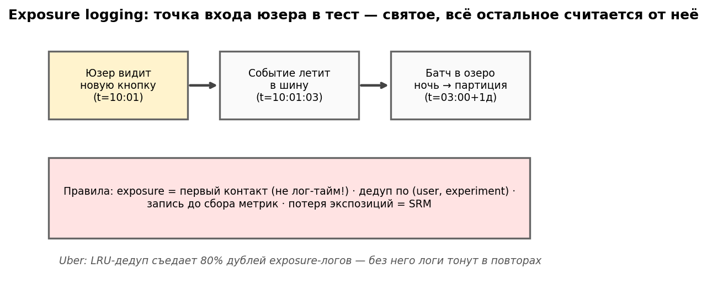
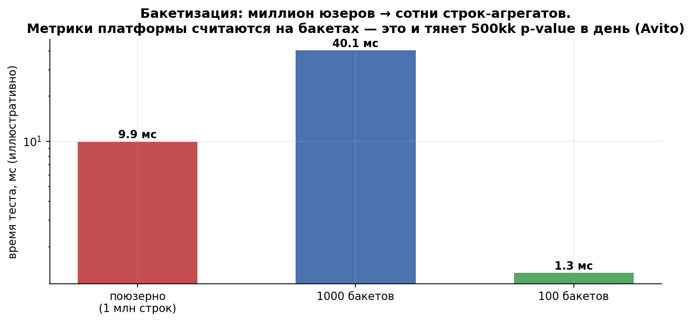

# Урок 7.2 — Данные и вычисления: экономика пайплайна

**Цель урока:** спроектировать путь данных от первого показа до p-value так, чтобы он не врал и не разорял: exposure-лог с честным timestamp первого контакта (не лог-времени — у нас 17,1% экспозиций уезжают в другие сутки) и дедупликацией (без неё асимметричные ретраи дают SRM при p=1,6·10⁻¹¹; LRU-кэш Uber убрал 80% дублей); событие → шина → Parquet-озеро с партиционированием по дате и эксперименту (наш запрос одного теста: 22 тыс. строк из 6 млн — ×273 к полному скану); метрик-хаб с едиными определениями (Airbnb Core/Target/Certified, аудит); выбор режима вычислений — ночной батч для отчётов, стриминг только для guardrail-алертов (оконные аппроксимации стриминга ошибочны на 5–15%; Авито успевает ~0,5 млрд p-value в день батчем «за несколько часов» на небольшом кластере Trino); главный трюк экономии — бакетизация: юзеры → 100–1000 бакетов, агрегаты (n, sum, sum_sq) на (группа × бакет), дельта-метод на бакетных средних (3.3) — статистика не отличается (|Δlift| = 0,003–0,004% между K=100/1000 и поюзерным), а ночная партия 100 экспериментов × 300 метрико-срезов ускоряется ×6 по CPU и ×100 по сканируемым строкам; и политика хранения — сырьё с TTL, вечные агрегаты, юнит-таблица как единственная «персональная» таблица теста.

## Зачем это аналитику

Урок 7.1 дал платформе честный сплит. Теперь вопрос: куда сплит пишет данные и почём они. Пока тестов десять, аналитик может позволить себе джойнить сырые логи в ноутбуке. Когда их сто одновременно, а метрико-срезов — тысячи, пайплайн сам становится продуктом: он либо успевает за ночь и не врёт, либо платформа задыхается — и тогда команды тихо возвращаются к «по ощущению». Пределы ёмкости платформы (сколько тестов/метрик/срезов в день) считаются именно здесь, в экономике данных, а не в статистике.

Две вещи делают этот урок личным для аналитика. Первая: **самые дорогие ошибки въезжают через логи, а не через тесты** — экспозиция залогирована в момент батч-флаша, а не показа; дубли ретраев не дедуплицированы; событие не несёт идентификатор эксперимента — и вот уже группы «не сходятся» или метрики считаются не для той аудитории. SRM-чек из 4.2 ловит часть этого, но лучший сценарий — не ловить, а не порождать. Вторая: **определения метрик**. Если у каждой команды «своя конверсия», эксперименты несравнимы между собой и с бизнес-отчётами; метрик-хаб — это governance, который аналитик выстраивает как владелец метрик, а не потребитель.

## Теория

### 1. Exposure logging: честный лог первого контакта

Три разных события, которые новички склеивают: **assignment** (юзеру посчитан вариант), **exposure** (юзер впервые увидел вариант — знаменатель анализа, ITT), **trigger** (юзер столкнулся с изменённой механикой — база triggering-анализа из 4.4). Логировать нужно экспозицию, в момент показа, до рендера варианта (Авито: экспозиция = показ фичи). Правила выживания:

- **Честный timestamp**: время первого контакта, а не время записи в лог. Между ними — батч-флаш, офлайн-мобайл, ретраи. Наша симуляция: 17,1% экспозиций меняют дату (батч раз в час + офлайн-мобайл ~12 ч), «день-1» по логам — 83 тыс. юзеров против 100 тыс. по контакту: 17% «опоздавших» уезжают в следующие сутки, дневные когорты и «дней в тесте» врут.
- **Дедупликация и идемпотентность**: ретраи сети и повторные отправки создают дубли; если они асимметричны по вариантам (тяжёлый тестовый вариант рендерится дольше и ретраится чаще) — получается SRM: 156 343/160 132 при плане 50/50, p=1,6·10⁻¹¹, «результатам не верить». Дедуп по (юзер, эксперимент) с сохранением МИНИМАЛЬНОГО timestamp чинит: 150 286/149 714, p=0,30. Uber закопал это в инфраструктуру: LRU-кэш на продюсере убрал 80% дублей exposure-логов до Kafka.
- **Самодостаточность события**: каждое событие несёт идентификатор эксперимента/пару «соль+дата» (паттерн Авито) — тогда принадлежность к тесту восстановима постфактум даже при сбоях логгера экспозиций; события не теряются, а пере джойнятся. Предельный случай — LinkedIn: при >100 млрд событий в день назначения не логируются вовсе, а аппроксимируются в Hadoop реплеем хэша.
- **Шина с квотами**: Kafka-топики с квотами и алертами на аномальных продюсеров (Uber: алерт, если один клиент даёт >5% потока) — иначе один баг мобильного клиента съедает озеро.

*Рис. 1. Exposure logging: точка входа юзера в тест — святое; дедуп и честный timestamp, иначе SRM.*

### 2. Событие → шина → озеро: Parquet, партиции, TTL

Промышленный стандарт пути: продюсеры → шина (Kafka) → озеро Parquet → ночные батчи → serving-слой. Что важно на каждом шаге для аналитика:

- **Колоночный формат (Parquet)**: читаем только нужные колонки (у события их десятки, анализу нужны 3–5), кодеки сжимают повторяющиеся id; replay/backfill возможен, пока живы сырые данные.
- **Партиционирование** — по дате и эксперименту. Наша симуляция озера 6 млн строк (100 экспериментов × 30 дней × 2000 строк): запрос «эксперимент #37, дни 10–20» сканирует без партиций 6,00 млн строк, по дате — 2,20 млн, по (дата × эксперимент) — **22 тыс. (0,4% таблицы, ×273 к полному скану, ×15 по времени на одном узле)**. В распределённом движке выигрыш выше: меньше сетевого шаффла.
- **TTL на сырьё**: сырые события живут дни–месяцы (дорого), дальше — только агрегаты. Что именно оставить вечным — §6.
- **Движки поверх озера**: Авито считает отчёты на Trino поверх Parquet-озера (миллиарды строк кликстрима); serving-дашборды — ClickHouse (на тяжёлых агрегациях в 5–10 раз дешевле/быстрее BigQuery по кликбенчмаркам); BigQuery — когда нужна serverless-эластичность. Это выбор под нагрузку, а не мода.

### 3. Юнит-таблица: единственная «персональная» таблица теста

Между сырьём и статистикой — промежуточный слой: **юнит-таблица эксперимента**, одна строка на юнит (группа, экспозиция и её дата, метрики юнита за период после экспозиции). Наш пайплайн: 924 тыс. событий за период → 300 тыс. строк юнит-таблицы (сжатие ×3,1; события до экспозиции отрезаются — ITT). Дальше любой анализ (t-тест, CUPED из 3.5, линеаризация из 3.3, сегменты) читает только её. Это и граница приватизации (персональные данные живут в одном месте с понятным доступом), и граница стоимости: батч анализов не трогает сырьё. Twitter формулирует то же как «как можно больше вычислений в map-фазе»: агрегаты строятся по ключу (юзеру), глобальная статистика — последним шагом.

### 4. Метрик-хаб: единые определения с паспортом

Платформа обязана гарантировать, что «конверсия в заказ» в отчёте теста и в квартальном дашборде — одна величина. Решение — метрик-хаб: централизованные, версионируемые определения метрик с владельцем и аудитом:

- **Airbnb**: иерархия Core (обязательный минимум в каждом тесте) / Target (целевые) / **Certified** — около 50% метрик сертифицированы: SLA на качество, аудит определений; ~2500 метрик в платформе, 50K пар (эксперимент × метрика) в день.
- **Авто-определение как формула** (Яндекс/Авито): метрика = observations + groupBy + фильтры + threshold + агрегация — одна интерпретация на всех, ревью как код; «эксперимент с кривой метрикой умирает на ревью».
- **Twitter**: группы метрик со свойствами агрегации (аддитивные/неаддитивные/mergeable) — корректность распределённых вычислений: неаддитивную метрику нельзя слить из шардов, и это свойство должно быть заявлено в определении.
- **Воспроизводимость отчёта = снапшот определений**: сегодняшний пересчёт полугодовалого теста должен совпадать с тогдашним отчётом — значит, версия формулы метрики фиксируется вместе с результатом (иначе «отчёт плавает», и доверие к платформе умирает).
- **Рекомендация метрик** (Uber, коллаборативная фильтрация Jaccard+Pearson по истории со-выбора) — против «забыл посмотреть важное»; каталог — фундамент guardrail-автоподстановки (7.3).

### 5. Батч vs стриминг: двойной контур вычислений

Стриминг стабильно дороже батча на том же объёме (круглосуточные stateful-кластеры, backfill в два слоя), а главное — **оконные аппроксимации стриминга ошибочны на 5–15% против полного батча** (приходящие «опоздавшие» события, границы окон, поздние экспозиции). Поэтому стандарт индустрии — двойной контур:

- **ночной батч — для отчётов и решений**: полный проход, точные цифры, воспроизводимость. Авито: ~0,5 млрд p-value в день (10k метрик, до 30 тыс. метрико-разрезов на тест, 4000+ экспериментов в год, сотни активных ежедневно) успевают «за несколько часов на небольшом кластере Trino». Airbnb ускорило тот же контур с 24+ часов до ~45 минут не железом, а архитектурой: единица работы = Event Source (~350 штук), каждая таблица сканируется один раз за проход, DAG в Airflow, ~50 срезов предрассчитываются GROUPING SETS.
- **стриминг/мини-батч — только там, где латентность спасает деньги**: guardrail-алертинг и авто-стоп (падение краш-рейта, авторегрессии), health-мониторинг. Правило: решение об остановке теста — по быстрому контуру; решение о раскатке — только по батчу.

### 6. Бакетизация + что хранить: главный трюк экономии

**Бакетизация** (Google KDD'10, Авито, Twitter summary tables): судьба юзера = `bucket = hash(salt, user_id) % K`, K = 100–1000. По каждому (эксперимент × метрика × срез × группа × бакет × день) храним счётчики **(n, sum, sum_sq)** — любые средние, дисперсии и дельта-метод (3.3) считаются из них. Статистика не страдает: ЦПТ по бакетам, на наших данных lift GMV 3,182% (поюзерно) / 3,178% (K=1000) / 3,179% (K=100), |Δ| ≤ 0,004%; ratio-метрика GMV/сессию: z=6,37 поюзерно против z=6,51 по 1000 бакетам. Экономия: анализ читает 2K строк вместо N юнитов (при 300 тыс. юзеров и K=1000 — в 150 раз меньше), а агрегат строится один проходом на эксперимент сразу для всех метрик и срезов.

Наши замеры ночной партии **100 экспериментов × 300 метрико-срезов = 30 000 анализов** (time.perf_counter, лучшая из попыток): поюзерно 0,31 мс/анализ × 300 тыс. строк = 9 с и **9,0 млрд сканируемых строк**; бакетно: GROUP BY 5,9 мс × 100 + 29 мкс × 30 000 = 1,5 с и **90 млн строк (×100 меньше)** — ×6 по CPU на одной ноде, а в озере (Spark/Trino), где платят за шаффл и IO, работает именно отношение строк. Масштаб индустрии: Авито — 200 юзер-бакетов, 14 млн измерений в день вместо миллиардов поюзерных; Twitter — summary tables поверх общих исходников как кэш аналитики; Google — 1000 бакетов как единица аллокации ещё в 2010.

**Что хранить и почём** — таблица решений проектировщика (числа — ориентиры из первоисточников):

| что | хранить как | цена / ориентир | зачем |
|---|---|---|---|
| сырые события | Parquet, партиции дата×эксперимент, **TTL дни–месяцы** | самый дорогой слой; replay/backfill, новые метрики по старым тестам | до TTL |
| юнит-таблица теста | одна строка на юнит, TTL теста + аудит | наш кейс: 924k событий → 300k строк (×3,1) | вход всех анализов, приватизация |
| exposure-лог | дедуп на входе (LRU −80% объёма, Uber), честный ts | без дедупа — SRM (наш p=1,6·10⁻¹¹) | знаменатель ITT |
| агрегаты (тест×метрика×срез×бакет×день) | **вечно**, 2K строк на срез | наш кейс: 90 млн строк вместо 9 млрд (×100); Авито 14 млн измерений/день | отчёты, воспроизводимость |
| stateful-назначения | не хранить: stateless-хэш (7.1) | 26–390 ТБ/день отвергнутой альтернативы LinkedIn | — |
| своя платформа vs вендор | build: ~150 млн ₽/3 года (Авито); buy: velocity 10–20× (клеймы Statsig) | решение 7.4 | — |

Мораль таблицы: сырьё — это страховка «а вдруг пригодится», у неё есть цена; агрегаты — это продукт платформы, они вечны и дёшевы; юнит-таблица — мост между ними с минимально необходимым сроком жизни.

*Рис. 2. Бакетизация: миллион юзеров → сотни строк-агрегатов; так платформа тянет сотни миллионов p-value в день.*

## Разбор на данных

Пайплайн «checkout_redesign» («ЕдаДома», 300 тыс. юзеров, 14 дней) — все числа из практики 7.2, каждый шаг — решение о стоимости:

| этап | было бы «в лоб» | как надо | выигрыш |
|---|---|---|---|
| exposure-лог | сырой, p(SRM)=1,6·10⁻¹¹ | дедуп по (юзер, тест), min-ts | группы 150 286/149 714, p=0,30 |
| timestamp экспозиции | лог-время | время контакта | 17,1% экспозиций в правильных сутках; день-1 = 100 130, а не 83 109 |
| данные для анализа | 924 тыс. событий | юнит-таблица 300 тыс. строк | ×3,1 меньше, ITT-гигиена |
| статистика | поюзерный проход | бакеты (n, sum, sum_sq) | Δlift ≤ 0,004%; строк ×150 меньше на анализ |
| ночная партия 100×300 | 9 с CPU, 9,0 млрд строк | 1,5 с CPU, 90 млн строк | ×6 время, ×100 строки |
| запрос дашборда | 6,00 млн строк | партиция (дата, эксперимент) | 22 тыс. строк, ×273 |

Отдельная строка экономики — идемпотентность: события несут (юзер, тест, соль+дату), поэтому сбой логгера лечится реплеем, а не потерянным днём. И валютная сводка для продакт-лида: пропускная способность платформы «ЕдаДома» при таком пайплайне — сотни экспериментов с тысячами метрико-срезов на «небольшом кластере» — уровень Авито (500 млн p-value/день) достижим без суперкомпьютера именно за счёт дедупа, партиций, юнит-таблиц и бакетов, а не железа.

## Подводные камни

1. **Лог-время вместо времени контакта.** Делают: timestamp записи в лог = timestamp экспозиции. Грозит: 17% экспозиций в неправильных сутках, дневные когорты и «дней в тесте» врут, дневной SRM-мониторинг шумит. Правильно: два поля — контакт и лог; анализу нужен контакт.
2. **Дубли экспозиций без дедупа.** Делают: «Kafka хоть раз отдаст». Грозит: асимметричные ретраи = SRM (наш p=1,6·10⁻¹¹), а симметричные = раздутый знаменатель и левые веса. Правильно: дедуп по (юзер, тест) с min-ts; идемпотентный продюсер (LRU −80%, Uber).
3. **Стриминг как основной контур отчётов.** Делают: «данные в реальном времени — считаем окна в реальном времени». Грозит: 5–15% расхождения с батчем (поздние события, границы окон), два «истинных» отчёта, потеря доверия; и ×N к стоимости. Правильно: батч — истина для решений; стриминг — только guardrail-алерты и авто-стоп.
4. **Каждый отчёт сканирует сырьё заново.** Делают: на каждый тест — свой Hive/Spark-запрос по кликстриму (так выглядел «было» у Airbnb: 24+ часа, многократные сканы, нет чекпойнтов). Грозит: ёмкость платформы = единицы тестов, ночь не резиновая. Правильно: юнит-таблица + агрегаты по бакетам; каждая таблица сканируется один раз за проход (Event Source-паттерн).
5. **Агрегаты без сырья и без версий.** Делают: сырьё выпало по TTL, формулы метрик поправили «по-живому». Грозит: новая метрика на старом тесте невозможна; старый отчёт не воспроизводится. Правильно: сырьё с осознанным TTL; снапшот определения метрики в каждом отчёте; Certified-аудит.
6. **«У каждого своя конверсия».** Делают: метрики в SQL у команд, платформа считает «по-своему». Грозит: тесты несравнимы друг с другом и с бизнес-дашбордами; споры о цифрах вместо решений. Правильно: метрик-хаб (метрика = формула с версией и владельцем; Core/Target/Certified).
7. **Хранить всё вечно «на всякий случай» — или ничего.** Делают: озеро без TTL; или наоборот — только агрегаты. Грозит: в первом случае счёт за хранение и сканы душит платформу (ср. 26–390 ТБ/день отвергнутой альтернативы LinkedIn), во втором — replay/backfill невозможен. Правильно: сырьё с TTL, вечные агрегаты, юнит-таблица на срок аудита.

## Практика

Файл `practice_7_2.py` (percent-формат, numpy/scipy/matplotlib/pandas + hashlib/time, seed, Agg). Пять блоков:

1. **Exposure-лог**: 300 тыс. юзеров, экспозиции в первые 72 ч; дубли от асимметричных ретраев (контроль +4%, тест +7%) → сырой лог 316 475 строк: без дедупа 156 343/160 132, SRM p=1,6·10⁻¹¹; с дедупом p=0,30. Честный timestamp: 17,1% экспозиций меняют дату (батч 1 ч + офлайн-мобайл), день-1: 100 130 по контакту против 83 109 по логам. График `practice_7_2_dedup.png`.
2. **Юнит-таблица**: 924 018 событий → 300 000 строк (×3,1), события до экспозиции отрезаны (ITT).
3. **Бакетизация**: t-тест поюзерно (300k строк) vs бакетные средние K=1000 и K=100 (2k/200 строк): lift GMV 3,182%/3,178%/3,179%, |Δ| ≤ 0,004%; ratio GMV/сессию дельта-методом поюзерно (z=6,37) и по 1000 бакетам (z=6,51).
4. **Экономика (time.perf_counter, лучшая из 30)**: партия 100 экспериментов × 300 срезов: поюзерно 0,31 мс/анализ → 9 с, 9,0 млрд строк; бакетно GROUP BY 5,9 мс × 100 + 29 мкс × 30 000 = 1,5 с, 90 млн строк — ×6 CPU, ×100 строки. График `practice_7_2_buckets.png`.
5. **Партиционирование**: озеро 6 млн строк (100 тестов × 30 дней); запрос одного теста за 11 дней: 6,00 млн / 2,20 млн / 22 тыс. строк — ×273, время ×15. График `practice_7_2_partitions.png`.

## Домашнее задание

**Задача 1.** Из практики: дубли ретраев — контроль +4%, тест +7% на 300 тыс. юзеров дали p=1,6·10⁻¹¹. Какой минимальный перекос доли ретраев между вариантами ещё даёт SRM (p<0,001) при том же N? А при N=3 млн?

Ответ

Перекос знаменателя δ на N юзеров даёт χ² ≈ δ²N (для двух равных групп; 4.2: χ²=z²). Порог p<0,001 — χ²≥10,8. При N=300k: δ≥√(10,8/300 000)≈0,006 — 0,6% перекоса достаточно (у нас асимметрия ретраев 4%/7% дала перекос долей 1,2% → χ²≈45, отсюда и p≈10⁻¹¹). При N=3 млн: δ≥0,19% — на большой базе SRM ловит даже крошечную асимметрию ретраев. Мораль: дедуп — не «гигиена», а условие выживания на масштабе; и чем больше платформа, тем строже требование симметрии логирования.

**Задача 2.** Почему K=100 «хватает» (наш |Δlift|=0,003% к поюзерному), но индустрия часто берёт 1000? Когда K=100 опасен?

Ответ

t-тест на бакетных средних — ЦПТ по K наблюдениям; при K≈100 SE оценки уже асимптотически честна (наши Δlift — тысячные процента). Но: (а) грубые срезы — бакетов должно быть много больше, чем «среднее число юзеров на бакет в срезе» хотя бы в десятки раз, иначе пустые/тощие бакеты и тяжёлые хвосты в средних; (б) тяжёлые хвосты метрик (GMV) требуют больше бакетов на нормальность средних (правило из 2.2: сходимость ЦПТ зависит от скью); (в) если захочется перцентили/бутстрап по бакетам — тоже больше K приятнее. 1000 бакетов Google и «200 у Авито» — компромисс: строки дёшевы (2K строк на срез), а запас прочности бесплатный. K=100 опасен на мелких срезах и скошенных метриках.

**Задача 3.** Спроектируйте TTL: exposure-логи 2 млн юзеров/день × 365 дней, 150 байт/строка после дедупа. Сколько это в озере за год? Что вы оставите навсегда и что удалите через 90 дней?

Ответ

2 млн × 365 × 150 байт ≈ 110 ГБ/год сырых экспозиций (без реплик и кодеков; Parquet сожмёт, но планёр от этого не меняется). Навсегда — агрегаты (тест × метрика × срез × бакет × день): при 1000 бакетов это тысячи строк на тесто-день — копейки, а воспроизводимость отчётов вечна. Юнит-таблицы — на срок аудита теста + N месяцев (у нас ~19 МБ на тест — можно щедрее). Сырьё — TTL 90 дней с партициями по дате: replay недавних инцидентов возможен, старые тесты живут в агрегатах; плюс снапшоты определений метрик к каждому отчёту — иначе «вечные» агрегаты не интерпретируемы.

**Задача 4.** Выведите из дельта-метода (3.3) оценку дисперсии ratio по бакетам: почему Var(R̂) можно считать по величинам (s_j − R·c_j) по бакетам?

Ответ

R̂ = Σs_j/Σc_j. Линеаризация вокруг истинного R: R̂ − R ≈ Σ(s_j − R·c_j)/Σc_j. Бакеты независимы (хэш), поэтому Var(R̂) ≈ Var(s_j − R·c_j)/(K·μ̄_c²), где μ̄_c — среднее c_j. Это ровно однослойный дельта-метод с производными (∂/∂S = 1/μ̄_c, ∂/∂C = −R/μ̄_c): Var = [Var(s) − 2R·Cov(s,c) + R²Var(c)]/(K·μ̄_c²). Практический бонус: считать нужно только ряд (s_j − R·c_j) — одна выборочная дисперсия на K бакетов; и корреляция числителя со знаменателем (проблема ratio из 3.3) учитывается автоматически через Cov.

**Задача 5.** Запрос дашборда: «все эксперименты за вчера» по озеру из практики (100 тестов × 30 дней × 2000 строк). Сколько строк сканируется при трёх схемах партиционирования? Какая схема лучше для этого запроса — и почему всё равно держат обе?

Ответ

Без партиций — 6 млн; по (дата, эксперимент) — 200 тыс. (100 тестов × 2000); по дате только — тоже 200 тыс. (вся партиция дня). Для «за вчера» партиция по дате достаточна и удобнее (меньше мелких файлов). Но запрос «один тест за диапазон дней» (наш основной: ×273 выигрыша) требует разбиения и по эксперименту. Поэтому держат (дата, эксперимент): диапазон по дате режется датой, выбор теста — второй ключей; мелкие файлы контролят компакцией. Общий принцип: партиции под реальные паттерны запросов — «свежесть всего» и «история одного теста».

## Шпаргалка

1. Три события: assignment ≠ exposure ≠ trigger. Логируется экспозиция: первый показ, до рендера варианта; знаменатель анализа — ITT.
2. Честный timestamp: время контакта, не лог-время (у нас 17,1% экспозиций меняют дату из-за батча/офлайна; день-1: 100k против 83k).
3. Дедуп по (юзер, тест) с min-ts; асимметричные ретраи = SRM (4%/7% → p=1,6·10⁻¹¹); идемпотентный продюсер: LRU −80% объёма (Uber).
4. Событие самодостаточно: (юзер, тест, соль+дата) в каждом событии — replay при сбоях логгера (Авито); LinkedIn при >100 млрд событий/день реплеит назначения вместо логирования.
5. Озеро: Parquet (колоночно, только нужные поля), партиции дата × эксперимент (наш кейс: 22 тыс. из 6 млн строк, ×273), TTL на сырьё, вечные агрегаты.
6. Юнит-таблица: одна строка на юнит (группа, экспозиция, метрики после экспозиции); 924k событий → 300k строк; вход всех анализов; граница приватизации.
7. Метрик-хаб: метрика = формула (observations, groupBy, фильтры, агрегация) с версией, владельцем, аудитом; Airbnb Core/Target/Certified (~50% сертифицировано); свойства агрегации (аддитивность/mergeability — Twitter); воспроизводимость = снапшот определений.
8. Батч vs стриминг: батч — истина для отчётов и решений (Авито ~0,5 млрд p-value/день за несколько часов Trino; Airbnb 24 ч → 45 мин: Event Source, один скан на таблицу, GROUPING SETS); стриминг — только guardrail-алерты/авто-стоп; оконные аппроксимации врут на 5–15%.
9. Бакетизация: bucket = hash(salt, user) % K, K=100–1000; хранить (n, sum, sum_sq) на (группа × бакет × метрика × срез × день); статистика — t/дельта на бакетных средних; |Δlift| ≤ 0,004% на наших данных; 2K строк вместо N.
10. Экономика (замер perf_counter): партия 100 тестов × 300 срезов — 9 с → 1,5 с (×6 CPU), 9,0 млрд → 90 млн строк (×100); в озере правит отношение строк. Авито: 200 бакетов → 14 млн измерений/день.
11. Хранение: сырьё дорого (replay — его смысл), агрегаты дёшевы и вечны, юнит-таблица — на срок аудита; stateful-назначения не хранить (26–390 ТБ/день — отвергнутый путь LinkedIn).
12. Двойной контур: быстрый (стриминг) тормозит, глубокий (батч) решает; SRM-гейт между ними — перед любым отчётом (7.3).

## Источники

- Tang et al. (Google, KDD 2010) — 1000 бакетов как единица аллокации и предагрегации — dl.acm.org/doi/10.1145/1835804.1835810; Twitter Engineering (2015) — 3-ступенчатая агрегация, «сколько можно в map-фазе», summary tables, OrderedSerialization −30% CPU, свойства агрегации метрик (`materials/web/research-ab-platform.md` §1).
- LinkedIn Engineering + AICamp-доклад — стриминг назначений в Kafka→Hadoop, аппроксимация назначений при >100 млрд событий/день, 50K writes QPS (`research-ab-platform.md` §1, §3).
- Uber Engineering — «XP» и «100x Faster»: LRU-дедуп exposure-логов (−80% дублей в Kafka), квоты топиков и алерт >5% от одного клиента, BH/FDR, mSPRT-мониторинг (`research-ab-platform.md` §1, §3).
- Airbnb Engineering — «Scaling Airbnb's Experimentation Platform» (24 ч → 45 мин, Event Source ~350, GROUPING SETS ~50 срезов, Core/Target/Certified) и «Designing Experimentation Guardrails» (`research-ab-platform.md` §1, §3).
- Avito — Леньков Д.: HighLoad SPb 2025 «10k метрик, 500 A/B и 500kk p-value каждый день» (паспорт ёмкости, Trino, батч) и доклад 2020 (200 бакетов, 14 млн измерений/день, метрика = формула, соль+дата в событии, ~150 млн ₽/3 года build vs buy) (`research-ab-platform.md` §1, §3, §6).
- Батч vs стриминг: Statsig «Realtime vs Batch Data Pipelines», data-mozart, WJARR-2025-1213 — стриминг дороже, оконные аппроксимации ошибочны на 5–15% (`research-ab-platform.md` §3); ClickHouse/BigQuery-сравнения — там же.
- Kohavi, Tang, Xu — Trustworthy Online Controlled Experiments: гл.12 (client-side и инфраструктура), гл.13 (Instrumentation), гл.14 (randomization unit), гл.16 (Scaling Experiment Analyses) — PDF в базе (`materials/local/books.md`).
- koch-kir, «Бэк-енд А/В-платформы» — компоненты и стоимость бэкенда платформы — https://medium.com/@koch-kir (`materials/web/web-articles.md` §3).
- Уроки курса: 3.3 (дельта-метод/ratio — формулы, здесь применение на бакетах), 4.2 (SRM — детектор ловит то, что порождает плохой лог), 4.4 (triggering), 3.5 (CUPED поверх юнит-таблицы), 7.1 (сплит и экспозиции с версией конфига); вперёд — 7.3 (SRM-гейт и интерфейс), 7.4 (паспорт ёмкости платформы).
