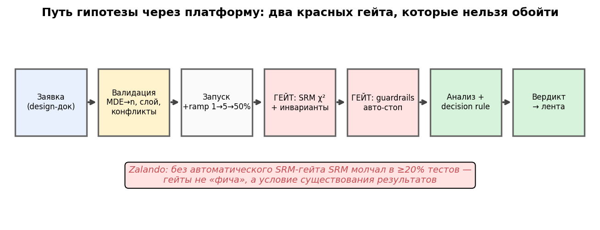
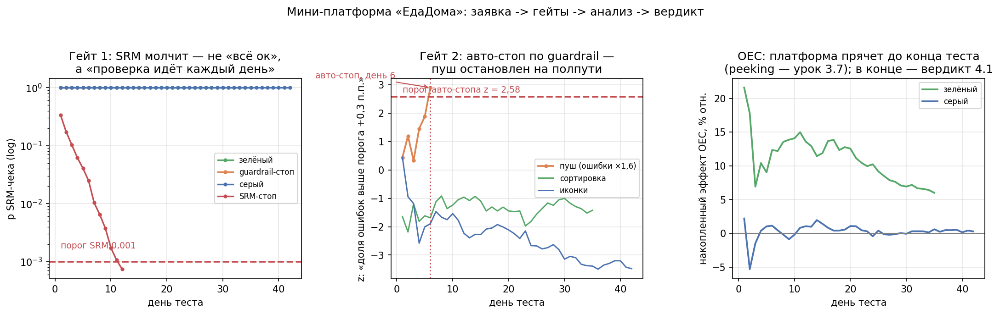

# Урок 7.3 — Интерфейс платформы: от гипотезы до вердикта

**Цель урока:** спроектировать «пользовательский контур» АБ-платформы — путь гипотезы от заявки до вердикта, в котором все проверки, которые мы разбирали четыре модуля, работают автоматически, а не по памяти аналитика: заявка = дизайн-док (гипотеза X→Y→Z, OEC, MDE), и платформа на входе сама считает n (автоподсчёт из формулы 3.1), подставляет метрики из метрик-хаба (7.2) и guardrail-пакет, отклоняет заявку при конфликте в слое (у нас: ED-119 «занято 50%, свободно 50% < 60%»); по ходу теста крутятся три гейта — SRM-гейт как привратник (χ², порог 0,001 — из 4.2; у Zalando без автоматизации SRM молчал в ≥20% тестов, поэтому гейт обязателен), инварианты телеметрии и авто-стоп по guardrails (Optimizely auto-pause, Uber mSPRT, Airbnb sequential; в нашей симуляции пуш остановлен на 6-й день из 14 при «зелёном» OEC +42%); на выходе — анализ (OEC: Уэлч + CUPED из 3.5, вторичные с Холмом из 2.4) и вердикт по decision rule 2×2 из 4.1, который уходит в ленту результатов — «эксперименты как контент» (Eppo KB, Uber pulse). И понять роли: аналитик, продакт и платформа; self-serve против gate.

## Зачем это аналитику

В уроке 7.1 вы построили сплит-сервис, в 7.2 — данные и вычисления. Осталась часть, которую видит каждый пользователь платформы: **интерфейс и процессы**. «ЕдаДома» выросла до трёх команд, и аналитик больше не может быть «человеком-гейтом»: лично проверять SRM каждого теста, помнить, чей guardrail какой, руками считать n, ловить продактов на «давай просто посмотрим, что будет». Каждый такой ручной шаг — место, где однажды ошибутся: не тот порог, забытая метрика, тест на сломанном сплите, результат которого уже уехал в презентацию директору.

Этот урок — про то, как «зашить» дисциплину М3–М4 в систему. Microsoft ExP описывает любую платформу четырьмя контурами (Portal, Execution, Log Processing, Analysis & Reporting) — мы построили первые три в 7.1–7.2, здесь собираем Portal и Reporting вокруг них. Ключевая идея: **платформа — это конвейер доверия**. Заявка на эксперимент — не формальность, а дизайн-док из 4.1 в машиночитаемом виде; гейты — не «галочки», а автоматические привратники, через которые нельзя пройти мимо; вердикт — не «мнение аналитика по итогам», а исполнение правила, подписанного до запуска.

Аналитик в этой конструкции не теряет работу — она меняется: из «исполнителя проверок» он становится **проектировщиком правил** и разбирателем инцидентов (почему сработал гейт — «баг» или «фича»). Именно это отличает зрелую платформу от «сервиса тестов» — и подготавливает финальный шаг урока 7.4: календарь гипотез.

*Рис. 1. Путь гипотезы через платформу: два красных гейта, которые нельзя обойти.*

## Теория

### 1. Заявка = дизайн-док: форма, которая валидирует

Из 4.1 мы знаем чек-лист дизайн-дока. В платформе он становится **формой заявки** — и в этом трансформация не косметическая, а процессуальная:

- **Авито**: заявка на эксперимент — одна страница текста от продакт-аналитика (гипотеза, метрики, аудитория, длительность) — до написания кода; **Яндекс** идёт дальше: конфиг эксперимента — текстовый файл в git, ревью как кода, «эксперимент с кривой метрикой умрёт при ревью»; **Microsoft** («Patterns of Trustworthy Experimentation») — чек-лист pre-experiment stage + ретроспективные A/A до запуска.

Что валидирует платформа автоматически (всё — из пройденного):

| Поле заявки | Автопроверка платформы | Откуда у нас |
|---|---|---|
| Гипотеза X→Y→Z | обязательность полей, фальсифицируемость — ревью | 4.1 |
| OEC | метрика существует в метрик-хабе, у неё есть паспорт (владелец, определение, версия) | 7.2 |
| MDE | автоподсчёт n и длительности; «MDE 16% отн. на p₀=6,2% → n=9 741/группу → 2 недели» | 3.1 |
| Guardrails | автоподстановка guardrail-пакета платформы (пороги уже согласованы) | 4.1 |
| Слой | занятость слоя: суммарные доли ≤ 100%; конфликт → очередь | 4.2, 7.4 |
| Длительность | целыми неделями, не в пятницу, с учётом blackout-недель | 3.1 |

Два выигрыша. Первый — **скорость**: продакт получает расчёт за секунды, а не «зайдите к аналитику на неделе». Второй — **нельзя схалтурить**: платформа не примет заявку без MDE или с метрикой, которой нет в хабе. Валидация — это дизайн-док, у которого не спросишь «а можно потом поменяем метрику» (нельзя: правилом решения 4.1).

### 2. SRM-гейт как привратник

Механику SRM — хи-квадрат долей, порог 0,001, мощность детектора, протокол дебага — мы разобрали в 4.2. Здесь — организационный вывод: **SRM-проверка не «фича отчёта», а гейт, через который нельзя пройти**:

- **Microsoft ExP**: тест, не прошедший SRM, не анализируется — отчёт не показывается вовсе; у ~10% экспериментов с SRM качество и полнота данных страдают ещё сильнее (это маркер «где-то сломан пайплайн», а не только сплит).
- **Zalando (Octopus)**: пока SRM-проверка не была автоматизирована, она **молчала в ≥20% тестов** (для сравнения, у зрелых команд SRM ловится в 6–10% тестов — Kohavi). Вывод Zalando: авто-блокировка результатов до разбора — обязательна. Мораль для проектировщика: проверка, которую надо «помнить делать», не делается. Автоматизация — не опция.

В нашей мини-платформе SRM-гейт крутится каждый день по накопленным данным. Демо-кейс (из практики): телеметрия тестовой группы теряет 4,5% событий (асимметричный фильтр — та же механика, что инцидент «Новинки на главной» из 4.2). На 12-й день из 14: N = 10 020/9 548, χ² = 11,4, p = 7,4·10⁻⁴ < 0,001 — платформа останавливает тест и блокирует отчёт. А что показал бы дашборд без гейта? OEC +38,6%, p<0,001 — «красивый» результат на несравнимых группах, который через неделю уехал бы в план квартала.

### 3. Авто-стоп по guardrails: тормоза платформы

В 4.1 мы назначали guardrails с порогами. На платформе они работают как **автоматический стоп-кран**:

- **Optimizely**: guardrail-метрика с auto-pause — при breach эксперимент останавливается сам;
- **Uber**: mixture-SPRT (mSPRT) с always-valid доверительными интервалами — авто-детект инцидентов без инфляции α, с jackknife/block-bootstrap для коррелированных юзер-дней и поправкой BH;
- **Airbnb**: конвейер «лог-трансформация + CUPED + sequential testing» — быстрый детект регрессий и авто-пауза проблемных экспериментов.

Три принципа проектирования. **Первый: guardrail ≠ OEC.** OEC читается в конце (peeking — 3.7), guardrails — каждый день; «тормоза» встраиваются в платформу один раз, а не в каждый тест руками. **Второй: стоп — по вреду, не по победе.** Автостоп по «OEC значимо вырос на 3-й день» — это то же подглядывание (3.7): ранняя остановка в пользу победителя раздувает α; автоматическая остановка уместна, когда тест **вредит** (guardrail просел, инвариант сломался) — цена продолжения измерима и отрицательна. **Третий: поправка за взгляды обязательна.** Ежедневная проверка guardrail — это множественные взгляды; наш порог z > 2,58 (α≈0,005 на взгляд) — честное упрощение, в проде — mSPRT/GST из 3.7.

В нашей симуляции: пуш о брошенной корзине даёт +42% на OEC, но доля юзеров с ошибкой (crash/JS) выросла в 1,6 раза — на 6-й день из 14 z-статистика просадки пересекает порог, тест остановлен. Вердикт платформы: **не катим, разбор инцидента** — «зелёный OEC» не спасает, потому что эффект не измерен до конца, а вред доказан.

### 4. Мониторинг инвариантов в реальном времени

Инварианты (4.1: «не должны шевельнуться вообще») — метрики качества данных: доля юзеров без единого события, событий на юзера, скорость загрузки логов, SRM. Их мониторинг живёт в **быстром контуре** платформы — в двухконтурной архитектуре из 7.2: ночной батч для отчётов, стриминг/мини-батч для гейтов. Практика индустрии (исследование в materials/web): стриминг стабильно дороже батча на том же объёме — поэтому стримят ровно то, что нужно для авто-стопов, а «все метрики × все срезы» считаются ночью. X5 гоняет SRM-чек ежечасно прямо на дашборде.

Тонкость — пороги и утомление от тревог (alarm fatigue, из 4.2): если инвариантный чек краснеет в 5% случаев «просто так», через месяц его замьютят все. Отсюда пороги 0,001 для автоматических гейтов и разделение: **алерт человеку** (посмотри и реши) vs **авто-стоп** (доказанный вред с поправкой за взгляды). Инвариант, который «постоянно чуть-чуть шумит», — тоже баг дизайна порога, а не реальности.

### 5. Каталог метрик и лента результатов: эксперименты как контент

Результат теста, который никто не увидел, — это поиск решения ценой слота (7.4) без сдачи. Зрелые платформы делают результаты **контентом для всей компании**:

- **Eppo Knowledge Base**: каждый завершённый тест — карточка (название, даты, команда, решение, эффект по primary-метрике, takeaways) — «лента» результатов;
- **Uber pulse**: еженедельные email-дайджесты + авто-отчёты по завершении тестов; рекомендация метрик коллаборативной фильтрацией поверх 1000+ метрик;
- **Airbnb ERF Explorer**: селф-сервис-дрелилка поверх Presto — сегменты без SQL;
- **Home Depot** (GrowthBook Podcast): топ-менеджеры сами ищут в библиотеке экспериментов;
- **Avito**: BI-дашборды со столбцом MDE — сразу видно, «дотянет» ли тест эффект.

Это и есть «институциональная память» из 4.1–4.5 в инженерной упаковке: архив тестов — актив, по которому калибруются приоры, поправки Type M и вероятности успеха для приоритизации (7.4). Наша мини-платформа печатает строку отчёта — «стоп: день 6/14 (GUARDRAIL AUTO-STOP) | OEC +42,2% | вердикт: не катим» — это и есть минимальная карточка для ленты.

### 6. Интеграции: трекер, дашборды, алерты

Честный факт из research-разведки: **готовых модулей «эксперимент ↔ Jira» у мажорных вендоров нет** — это white space. Живые практики: у Яндекса конфиг эксперимента в git привязан к тикету, статус тикета двигает платформа (конвенция + webhook/API); алерты о гейтах уходят в Slack/email команде теста; дашборды платформы встраиваются в BI (Tableau у Avito — со столбцом MDE). Проектируя «ЕдаДома», закладывайте: тикет ↔ эксперимент ↔ решение — двусторонняя связь (номер тикета в заявке, вердикт — комментарием и переходом статуса), иначе календарь (7.4) и лента разъедутся с реальностью разработки.

### 7. Роли: аналитик, продакт, платформа — self-serve vs gate

Кто и что делает в этом конвейере (рамка Microsoft/Avito):

- **Продакт**: приносит гипотезу X→Y→Z, владеет решением по decision rule (4.1), отвечает на «сколько стоит просевший guardrail»;
- **Аналитик**: проектирует правила (пороги гейтов, guardrail-пакеты, метрики хаба), ревьюит заявки, разбирает инциденты гейтов, развивает статистику платформы (CUPED, sequential — 3.5, 3.7);
- **Платформа** (команда): SLA сплита и вычислений, сами гейты, лента, календарь (7.4).

Дилемма **self-serve vs gate**: полный self-serve («любой продакт запускает что угодно») быстр, но автоматизирует хаос — без ревью дизайн-доков очередь забьётся сырыми заявками; ручной гейт на каждый тест превращает платформу в бюрократию и bottleneck. Рабочий паттерн зрелых команд: **автоматические гейты для всех + ревью выборочное** (новые команды и новые механики — обязательно; опытные — по чек-листу автоматически). Платформа здесь — внутренний продукт со своими пользователями, retention которых (доля команд, которые возвращаются с новыми заявками) — не менее важная метрика, чем SRM-алерты.

## Разбор на данных

Прогон трёх заявок через мини-платформу `practice_7_3.py` (слой «ранжирование» на 50% занят живым тестом ED-101; все числа воспроизводятся seed'ом).

**Валидация на входе.** ED-114 «Умная сортировка по ETA» (OEC = конверсия в заказ, p₀ = 23%, MDE +6,5% отн.): платформа считает σ² = p₀(1−p₀), по формуле 3.1 выдаёт **n = 13 061/группу**; слой занят на 50% → тесту достаётся половина трафика → 5 недель. ED-118 «Иконки» с MDE 4% → n = 34 489 → 6 недель: **чувствительность — это время** (3.1), и платформа показывает это до запуска, а не «по ходу». ED-119 отклонён: слой «ранжирование» переполнен — заявка в очередь (урок 7.4).

**Три сценария.**

| заявка | стоп | OEC (95% ДИ, p) | guardrail | вердикт |
|---|---|---|---|---|
| ED-114 сортировка | 35/35, план | +6,0% (+1,9..+10,1, p=0,004) | ошибки +0,06 п.п. < порога | **SHIP** |
| ED-115 пуш | **день 6/14, авто-стоп** | +42,2% (+25,7..+58,6) | ошибки **+1,18 п.п. > +0,3** | **НЕ КАТИМ: инцидент** |
| ED-118 иконки | 42/42, план | +0,3% (−2,4..+2,9, p=0,83) | ок | **НЕТ РЕШЕНИЯ** |

Как читать таблицу. Сортировка: CUPED по пре-конверсии сжал SE на 3% (ρ≈0,24 — на бинарных метриках скромно, 3.5); вторичная выручка +6,0% держит Холма — решение катить по правилу 4.1. Пуш: OEC «зелёный», но авто-стоп оборвал тест на полпути — эффект не измерен до конца, а вред доказан; смотреть на OEC после авто-стопа — ошибка интерпретации (обрыв — не вердикт по OEC). Иконки: серый OEC при **значимом CTR +9,0%** (Holm p<0,01) — знакомая картина 4.1: чувствительный прокси краснеет, драйвер — нет; решение «нет решения» с одним заходом углубления (2.4).

**SRM-гейт.** Тот же пуш с потерей 4,5% событий тест-группы: день 12, N = 10 020/9 548, χ² = 11,4, p = 7,4·10⁻⁴ — стоп, отчёт заблокирован. Без гейта дашборд показал бы OEC +38,6% (p<0,001) — на юзерах, которых осталось непропорционально много «активных». Это и есть цена ручной проверки: не «минус тест», а **ложный результат, который никто не заподозрит**.

*Рис. 2. Панель мониторинга мини-платформы (из практики): слева — p-value SRM-чека по дням (все здоровые тесты выше порога 0,001); в центре — z-статистика guardrail: пуш пересекает порог на 6-й день; справа — накопленный эффект OEC, который платформа прячет до конца теста (peeking, 3.7).*

## Подводные камни

1. **Форма без валидации.** Делают: «форма сбора заявок» в Confluence, поля заполняются по ходу теста. Грозит: дизайн-док, подписанный после результата, — это рационализация (4.1); «у каждого своя конверсия» (7.2). Правильно: платформа не принимает заявку без OEC из хаба, MDE и порогов guardrails — правило до данных.
2. **Ручной SRM «по мере сил».** Делают: аналитик смотрит SRM, «когда делает отчёт». Грозит: у Zalando так молчало ≥20% тестов — с красивыми цифрами на выходе. Правильно: автоматический гейт с блокировкой отчёта; порог 0,001 (не 0,05 — alarm fatigue, 4.2).
3. **Авто-стоп по OEC.** Делают: «остановим тест, как только OEC значимо вырос — все экономят». Грозит: ранние остановки в пользу победителя раздули α — это peeking (3.7), winner's curse (4.5) в чистом виде. Правильно: автоматическая остановка — только по вреду (guardrail/инвариант), с sequential-поправкой (mSPRT/GST); «ранний победитель» — предмет отдельного дизайн-дока с sequential-схемой, выбранной заранее.
4. **Guardrail-порог без поправки за взгляды.** Делают: ежедневный чек по порогу α=0,05. Грозит: за 14 дней взглядов ложный стоп почти гарантирован — инцидент-команда перестанет верить стопам. Правильно: консервативный порог на взгляд (наш z=2,58) или всегда-валидные критерии (Uber mSPRT, ABsmartly GST).
5. **Смотреть OEC после авто-стопа.** Делают: тест остановлен по guardrail, но «эффект же был +42%» — и его вносят в план. Грозит: обрыв теста — не оценка эффекта (мощность не набрана, состав дней неоднороден). Правильно: вердикт «не катим + разбор инцидента»; новая заявка после фикса.
6. **Лента ради ленты.** Делают: дашборд всех тестов со ста метриками и без поля «решение». Грозит: кладбище графиков, которое никто не открывает; знания не накапливаются (4.5: мета-анализ и приоры невозможны). Правильно: карточка Eppo KB — название, команда, даты, **решение**, эффект, takeaways; дайджест «завершённые тесты недели».
7. **Self-serve без ревью — или гейт на всё.** Делают: (а) «продакты сами всё запускают» — платформа автоматизирует хаос; (б) каждое ревью — неделя очереди к аналитику. Грозит: (а) мусорные заявки и SRM-инциденты; (б) команды обходят платформу («потихоньку катим без тестов» — кейс X5 из 4.1: −140 млн ₽/кв). Правильно: автоматические гейты для всех, ревью — по риску (новая команда, новая механика, большой слот).

## Практика

Файл `practice_7_3.py` (percent-формат, numpy/scipy/matplotlib, детерминированные seed'ы, Agg). Мини-платформа в одном скрипте — `class ExperimentPlatform` с полным циклом:

1. **`submit(design_doc)`** — валидация: метрики из метрик-хаба (словарь с паспортами), автоподсчёт n из MDE (формула 3.1 + запас 5%), автоподстановка guardrail-пакета, проверка занятости слоя (пересечения — 4.2). Одна заявка принята с пересчётом MDE→n→недели, одна отклонена («слой переполнен»).
2. **`run(...)`** — симуляция теста по дням с тремя гейтами: SRM (χ², порог 0,001), инвариант «событий на юзера» (|z|>3,29), guardrail авто-стоп (доля ошибок, порог +0,3 п.п., z>2,58 — упрощённый mSPRT). OEC-путь считается «для иллюстрации» — платформа его прячет (peeking).
3. **`analyze` + `verdict`** — OEC: Уэлч + CUPED (θ по пре-периоду, 3.5); вторичные метрики с Холмом (2.4); вердикт по decision rule 2×2 (4.1) — включая ветки «авто-стоп» и «нет решения».
4. **Три сценария**: зелёный (SHIP, p=0,004), guardrail-стоп (день 6/14 при OEC +42%), серый (p=0,83). Бонус: SRM-гейт блокирует сломанный тест (потеря 4,5% событий, p=7,4·10⁻⁴) до всякого анализа.

График: `practice_7_3_monitoring.png` — панель мониторинга из трёх панелей (SRM-путь, guardrail z-путь с авто-стопом, накопленный OEC-эффект).

## Домашнее задание

**Задача 1.** Спроектируйте минимальную форму заявки «ЕдаДома»: 6–8 полей и список автопроверок платформы для каждого. Какое поле нельзя валидировать автоматически и почему?

Ответ

Поля: гипотеза X→Y→Z; OEC (выпадающий список из метрик-хаба); MDE (или «посчитай сам по экономике»); guardrails (дефолт — пакет платформы, пороги редактируемы); слой/слот; юнит рандомизации; владелец решения; blackout-недели (автоподстановка). Автопроверки: метрика есть в хабе; n и длительность пересчитаны (MDE→n→недели); занятость слоя; длительность целыми неделями; пороги guardrails заданы числами. Не валидируется автоматически: фальсифицируемость гипотезы и «X правда про пользователей» — это ревью аналитика; машина проверяет форму, человек — смысл.

**Задача 2.** Guardrail-стоп настроен как ежедневная проверка «ошибки в тесте значимо выше контроля + 0,3 п.п.» при α = 0,05 на взгляд. Тест идёт 14 дней. Оцените вероятность ложного авто-стопа хотя бы раз за тест и предложите фикс.

Ответ

При честном H0 («guardrail цел») каждый взгляд краснеет с вероятностью ~5%; за 14 взглядов хотя бы раз — 1−0,95¹⁴ ≈ 51%. Фиксы: (а) консервативный порог на взгляд — наш z=2,58 даёт α≈0,005 → за 14 дней ≈ 6,8%; (б) всегда-валидный последовательный критерий (mSPRT — Uber, GST — ABsmartly): порог «на взгляд» пересчитывается так, что суммарная вероятность ложного стопа ≤ α при любом числе взглядов (3.7). Бонус: для guardrails можно строже — цена ложного стопа (неделя теста) ниже цены пропущенного вреда.

**Задача 3.** Тест пришёл к концу: OEC +2,1% (p = 0,03), guardrail «отписки» +14% при пороге +5% (значимо). Авто-стопа не было — порог пробит только на полной выборке. Какое решение выдаст платформа и что посчитать команде?

Ответ

По decision rule 2×2 (4.1): строка «OEC значимо ↑», столбец «guardrail просел» → **не катим**, разбор trade-off. Посчитать: денежную ценность +2,1% OEC за горизонт (квартал) против стоимости +14% отписок (упущенная выручка отписавшихся × их доля × горизонт). Если хочется катить — это новый дизайн-док (компенсация вреда, другой порог), а не «плюсы перевесили» на том же тесте. Мораль для платформы: guardrail-порог был задан до запуска — его нельзя «переутвердить» задним числом.

**Задача 4.** Почему авто-стоп по guardrail срабатывает в нашей симуляции на 6-й день, а SRM-гейт (в бонус-сценарии) — только на 12-й? Что это говорит о мощности детекторов?

Ответ

Оба детектора — тесты со своей мощностью, зависящей от размера эффекта и N (4.2: z = δ√N). Guardrail-эффект огромен (ошибки ×1,6 ≈ +1,2 п.п. при пороге 0,3 п.п.) — детектору хватает ~5 000 юзеров на группу. SRM-эффект тоньше: потеря 4,5% группы даёт χ² = (ΔN)²/N, и порог 0,001 требует ~10 000 на группу. Следствие для проектировщика: чем тоньше баг, тем позже гейт его поймает (или не поймает — как фильтр новинок из 4.2, ловимый лишь на больших N); «гейт молчит» на ранних неделях ≠ «тест здоров».

**Задача 5.** Придумайте три velocity-метрики платформы «ЕдаДома» (кроме «числа тестов»), которые вы повесили бы на дашборд руководителя, и объясните, почему «число тестов» — плохая метрика.

Ответ

Например: медианное время «идея → решение» (дни от заявки до вердикта); доля ожидания в этом времени (сколько сидит в очереди на слот — управляемая часть); decision rate (доля заявок, дошедших до вердикта, а не брошенных/оборванных); доля тестов с заблокированным SRM («здоровье платформы»). «Число тестов» плохо, потому что оптимизирует объём, а не ценность: команды нарежут мелкие дешёвые тесты с гигантскими MDE, которые ничего не могут обнаружить (3.1), — KPI будет зелёным, а ценность нулевой. Правильная рамка — ценность и скорость обучения (4.5, 7.4).

## Шпаргалка

1. Платформа = 4 контура (Microsoft ExP): Portal / Execution / Log Processing / Analysis & Reporting; интерфейс — это Portal + Reporting вокруг сплита (7.1) и вычислений (7.2).
2. Заявка = дизайн-док в машиночитаемом виде: гипотеза, OEC из хаба, MDE, guardrails, слой, владелец. Платформа валидирует: автоподсчёт n (3.1), автоподстановка guardrail-пакета, занятость слоёв (4.2), blackout-недели.
3. SRM-гейт — привратник: χ², порог 0,001, непрошедший тест не анализируется (Microsoft). Без автоматизации SRM молчит: Zalando ≥20% тестов, у зрелых 6–10% — автоматизация обязательна.
4. Авто-стоп по guardrails — тормоза платформы: Optimizely auto-pause, Uber mSPRT (always-valid CI), Airbnb log+CUPED+sequential. Стоп — по вреду, не по победе; поправка за взгляды обязательна (3.7).
5. Инварианты — в быстром контуре (стриминг/мини-батч), отчёты — в ночном батче (7.2); пороги гейтов консервативные — alarm fatigue убивает пользу алертов.
6. Анализ на выходе конвейера: OEC — Уэлч + CUPED (3.5), вторичные — Холм (2.4); вердикт — decision rule 2×2 из 4.1, включая «нет решения» и «обрыв ≠ вердикт по OEC».
7. Лента результатов = «эксперименты как контент»: карточка с решением и эффектом (Eppo KB), пульс-дайджесты (Uber), селф-сервис-дрелилка (ERF Explorer), дашборды со столбцом MDE (Avito). Архив — актив для мета-анализа и приоров (4.5, 7.4).
8. Интеграции: готового «эксперимент ↔ Jira» нет у вендоров (white space) — webhook/API + конвенции; закладывайте двустороннюю связь тикет ↔ эксперимент ↔ решение.
9. Роли: продакт владеет решением, аналитик — правилами и разбором инцидентов, платформа — SLA и гейтами. Self-serve + автоматические гейты + выборочное ревью по риску.
10. Аналитик платформы проектирует правила, а не выполняет проверки вручную: каждая ручная проверка — место будущей ошибки; каждая автоматическая — конвейер доверия.

## Источники

- Research-разведка «Проектирование АБ-платформы», §4 «Интерфейс и процессы» — `materials/web/research-ab-platform.md`: дизайн-док как заявка (Avito, Microsoft Patterns, шаблоны), SRM-автоматизация (Zalando ≥20%, Chen et al. 2022, DoorDash), guardrail auto-stop (Optimizely, Airbnb, Uber mSPRT), каталог и лента (Eppo KB, Uber pulse, ERF Explorer, Home Depot), интеграции с трекерами (white space), чек-лист проектировщика пп. 22–26.
- Kohavi, Tang, Xu — Trustworthy Online Controlled Experiments: гл.4 (платформа и культура, зрелость), гл.12–16 (клиентская часть, инструментарий, юниты, ramping/SQR, масштабирование анализа) — PDF в базе (`materials/local/books.md`).
- Gupta et al., «The Anatomy of a Large-Scale Experimentation Platform» (Microsoft, 2018) — рамка 4 контуров: microsoft.com/en-us/research/publication/the-anatomy-of-a-large-scale-experimentation-platform/.
- Zalando Octopus — engineering.zalando.com/posts/2021/01/experimentation-platform-part1.html (SRM молчал в ≥20%, авто-блокировка отчёта, crawl-walk-run).
- Uber XP — uber.com/us/en/blog/xp/ и …/making-ubers-experiment-evaluation-engine-100x-faster/ (mSPRT-мониторинг, авто-валидация, пульс-отчёты); Airbnb Guardrails — medium.com/airbnb-engineering/designing-experimentation-guardrails-ed6a976ec669; Eppo Knowledge Base — docs.geteppo.com.
- Trisigma (t.me/trisigma_avito), дайджест `materials/telegram/trisigma_avito-digest.md`: «Что делает платформа экспериментов» (отличия от раздачи фич), культура и зрелость, экономика (мостик к 7.4).
- Уроки курса: 4.1 (дизайн-док, OEC, guardrails, decision rule 2×2), 4.2 (SRM: χ², порог 0,001, мощность детектора, протокол дебага), 3.1 (MDE→n), 3.5 (CUPED), 3.7 (подглядывание и sequential), 2.4 (Холм), 4.5 (экономика тестов и Type M), 7.1 (сплит-сервис), 7.2 (метрик-хаб, быстрый/глубокий контур); вперёд — 7.4 (платформа как календарь гипотез: очередь, ёмкость, velocity).
