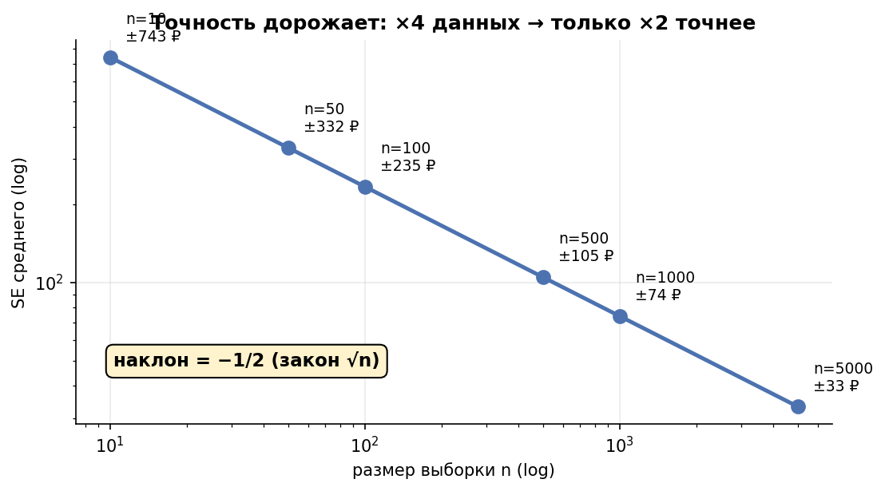
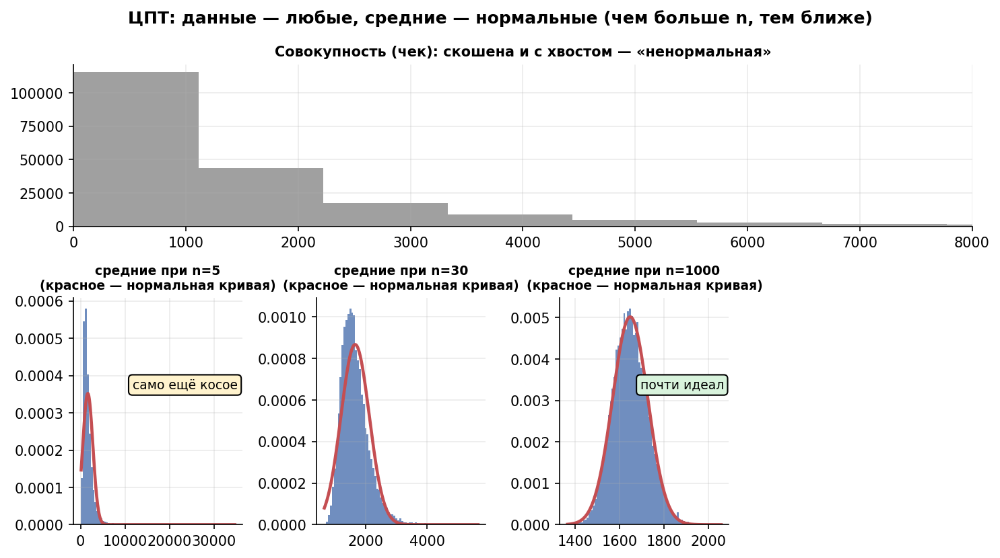
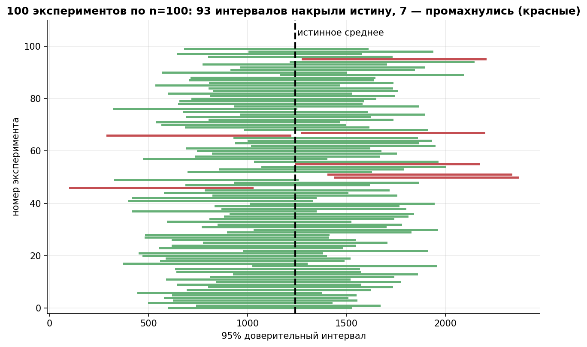

# Урок 1.3 — ЦПТ и доверительные интервалы

**Цель урока:** различать разброс данных и неопределённость оценки; построить CI и объяснить условия его покрытия.

**Перед уроком:** [проверьте зависимости темы](../../PREREQUISITES.md); обозначения — в [словаре](../../GLOSSARY.md).

## Зачем это аналитику

В «ЕдаДоме» мы никогда не видим генеральную совокупность. Все заказы за квартал — лишь реализация гипотетического «процесса заказов», который мы не контролируем. Средний чек, посчитанный на этой неделе, — одна реализация случайной величины; на следующей неделе он будет другим, даже если в продукте ничего не менялось. Пока вы не чувствуете масштаб этого «другого», любая недельная дельта на дашборде для вас — магия.

Отсюда главный вопрос продакта: «средний чек вырос на 40 ₽ — это рост или шум?». Ответить без стандартной ошибки невозможно. Доверительный интервал — это язык, на котором аналитик говорит с бизнесом: не «средний чек 1240 ₽», а «оценка 1240 ₽, 95% CI [1145; 1335] ₽; сопоставим этот диапазон с бизнес-порогом». И это же фундамент всех АБ-тестов (М2–М3): тест — сравнение двух дрожащих оценок, и кто не понимает дрожь одной, не поймёт и дрожь разности.

У ЦПТ есть границы применимости: в нашей симуляции обычный t-интервал на скошенных данных при малом n имеет покрытие 76–90% вместо 95%. Правило 100·skew² — лишь ориентир в некоторых моделях, не ответ «можно ли верить формуле». Для решения проверяем калибровку нужной процедуры на реалистичных данных.

## Теория

### 1. Генеральная совокупность, выборка, оценка

Параметры совокупности ($\mu$, $\sigma$, доля $p$) — константы, которые мы не видим. Статистики выборки ($\bar{x}$, $s$, $\hat{p}$) — то, что мы считаем по данным. Пока данные не собраны, статистика — **случайная величина**; после сбора — реализация. Вся статистика вывода — про распределение этой случайной величины.

Для всего урока рабочая модель «ЕдаДома» (она же в [practice_1_3.py](practice/practice_1_3.py)):

- чек заказа — логнормал: медиана 700 ₽, $\sigma_{\log} = 1{,}2$, откуда истинные $\mu = 700\cdot e^{1{,}2^2/2} \approx 1438$ ₽ и $\sigma \approx 2581$ ₽; асимметрия $s \approx 11{,}2$ — как у настоящих денежных метрик;
- время доставки — равномерное на $[20; 60]$ минут: симметричное, без хвостов, $\mu = 40$, $\sigma = 40/\sqrt{12} \approx 11{,}5$.

Мы знаем истину только потому, что сами сгенерировали данные. В продукте истину не знает никто — в этом и смысл доверительных интервалов.

Ключевые допущения: наблюдения i.i.d. (независимы и одинаково распределены). Оценка $\bar{x}$ несмещённая: $E[\bar{x}] = \mu$ — в среднем по многим выборкам мы попадаем в цель. Но каково рассеяние вокруг цели?

### 2. Стандартная ошибка среднего: $SE = \sigma/\sqrt{n}$

Дисперсия среднего убывает ровно как $1/n$:

$$\mathrm{Var}(\bar{x}) = \frac{\sigma^2}{n}, \qquad SE(\bar{x}) = \frac{\sigma}{\sqrt{n}}, \qquad \widehat{SE} = \frac{s}{\sqrt{n}}$$

Интуиция: при усреднении отклонения отдельных наблюдений частично гасят друг друга; гасятся они по «квадратичному» закону — отсюда корень.

**Не путать $\sigma$ и SE.** $\sigma \approx 2581$ ₽ — разброс *чеков* (отдельный заказ может быть и 300 ₽, и 10 000 ₽). SE — разброс *средних по неделям*: при $n = 100$ заказов $SE = 2581/10 \approx 258$ ₽, при $n = 1000$ — $\approx 82$ ₽. Одна и та же $\sigma$, совершенно разная неопределённость итоговой цифры.

$\sqrt{n}$ — это закон убывающей отдачи данных:

- сузить интервал вдвое → данных в **4** раза больше;
- сузить втрое → в **9** раз больше.

Это правило будет стоить вам многих споров с продактами, обещающими «ещё недельку — и будет точно» (подробнее — М3.1 про размер выборки).

*Рис. 1. Закон убывающей отдачи данных: ×4 наблюдений — только ×2 точнее. Наклон −1/2 на лог-шкалах.*

### 3. ЦПТ: что говорит и чего НЕ говорит

Центральная предельная теорема (для i.i.d. с конечной дисперсией):

$$\frac{\bar{x}_n - \mu}{\sigma/\sqrt{n}} \ \xrightarrow{\ d\ }\ N(0, 1) \qquad \text{при } n \to \infty$$

**Что говорит:** распределение *среднего* (суммы) стремится к нормальному — каким бы диким ни было распределение самих данных. Именно поэтому мы вообще можем строить интервалы для среднего чека, не смотря на его логнормальность.

**Чего НЕ говорит (две типовые ошибки):**

1. *«Раз $n > 30$, то данные можно считать нормальными»*. Нет! ЦПТ ничего не делает с распределением данных — чеки остаются скошенными при любом $n$. Нормальным становится распределение оценки $\bar{x}$. В канале stats_for_science это называют «народной теоремой»: перепутано распределение данных и распределение статистики. Для описания данных — гистограммы, квантили, ECDF (уроки 1.1–1.2); нормальность данных вам для этого не нужна.
2. *«$n = 30$ всегда достаточно»*. Нет: скорость сходимости зависит от формы распределения — чем сильнее асимметрия и тяжелее хвосты, тем больше $n$ нужно. Об этом следующий подраздел.

*Рис. 2. Данные — любые, средние — нормальные: скошенная совокупность сверху; распределения средних при n=5/30/1000 с нормальной кривой. При n=5 само ещё косое.*

### 4. Скорость сходимости: правило Денга $n \sim 100\,s^2$

Насколько большим должен быть $n$? Асимметрия (skewness):

$$s = \frac{E[(X-\mu)^3]}{\sigma^3}$$

Алекс Денг в гл. 8.5 своей книги разбирает этот вопрос через разложение Эджворта: ошибка нормальной аппроксимации на хвостах ведёт себя как $s/\sqrt{n}$. Требуя, чтобы она была меньше 0,25% на 95%-х квантилях, в этом приближении получаем ориентир $n > 122{,}56\,s^2$; если дисперсия неизвестна (наш случай), Kohavi et al. выводят $355\,s^2$. Практическое правило Денга: **порядка $100\,s^2$ наблюдений** — «лучшее правило большого пальца, чем $n > 30$».

Примеры из книги (пересказ):

| Метрика | Асимметрия $s$ | Эвристический ориентир, не гарантия |
|---|---|---|
| Симметричная метрика | ~0 | правило не определяет достаточный n; важны хвосты |
| Метрика с $s = 5$ | 5 | ~2 500 |
| Выручка на пользователя | 17,9 | > 30 000 |
| Та же после винзоризации | 5 | ~2 500 |
| Редкая конверсия, $p = 10^{-4}$ | $\approx 1/\sqrt{p} = 100$ | ~1 000 000 |

Симметричное распределение с редкими очень большими отклонениями может иметь skew=0 и конечную дисперсию, но требовать большой выборки. Например, смесь 0,99·N(0,1)+0,01·N(0,100²) симметрична, а малые выборки часто не содержат редкую компоненту и плохо оценивают её вклад в шум.

Для чека с σ_log=1,2 skew≈11,2, и ориентир $100\,skew^2$ даёт около 12 500 наблюдений. Это эвристика, а не гарантированный или обязательный порог. При n=1000 симуляция даёт покрытие около 94% вместо 95%; оценка покрытия сама имеет Monte Carlo погрешность. Проверяйте именно свою статистику, уровень и покрытие, а не только похожесть гистограммы на колокол.

Важно: правило про $s$ относится к среднему. Для разности средних $\Delta = \bar{Y} - \bar{X}$ при равных группах скошенность частично гасится — Денг отмечает, что симметричность $\Delta$ ускоряет сходимость. Для перцентилей (p95, p99) нужны отдельные условия на распределение около квантили; в уроке 1.4 сравним bootstrap-интервалы и их ограничения.

### 5. Доверительный интервал для среднего и для доли

Раз ЦПТ говорит, что $\bar{x}$ приблизительно нормален, строим интервал (уровень 95%, $z_{0{,}975} = 1{,}96$):

$$\bar{x} \pm z_{0{,}975}\cdot\frac{\sigma}{\sqrt{n}} \quad (\sigma\ \text{известна — редкость}), \qquad \bar{x} \pm t_{0{,}975,\,n-1}\cdot\frac{s}{\sqrt{n}} \quad (\sigma\ \text{оценена})$$

Зачем $t$ Стьюдента: когда $\sigma$ оценена по той же выборке, мы добавляем неопределённость оценки $s$; у $t$-распределения хвосты тяжелее, интервал шире. При $n \to \infty$ различие тает: $t_{0{,}975, 399} = 1{,}966$ против $1{,}96$. При малых $n$ забывать $t$ нельзя (в М2 это станет критерием Стьюдента).

Для доли (конверсия в заказ, доля заказов с промо) — нормальная аппроксимация биномиального:

$$\hat{p} \pm z_{0{,}975}\sqrt{\frac{\hat{p}(1-\hat{p})}{n}}$$

Условие применимости: $n\hat{p} \ge 10$ и $n(1-\hat{p}) \ge 10$ (встречаются варианты с 5). При редких событиях интервала не хватает: конверсия 0,15% может дать отрицательную нижнюю границу — абсурд. Тогда берут **интервал Вильсона** (здесь только знакомимся):

$$\frac{\hat{p} + \frac{z^2}{2n} \pm z\sqrt{\frac{\hat{p}(1-\hat{p})}{n} + \frac{z^2}{4n^2}}}{1 + \frac{z^2}{n}}$$

Он не вылезает за $[0;1]$ и ведёт себя при малых $\hat{p}$ приличнее (числовой пример — в домашнем задании).

### 6. Как правильно читать CI

Правильная (частотная) интерпретация — про **процедуру**, а не про конкретный интервал: «если повторить эксперимент много раз и каждый раз строить интервал по этой формуле, то примерно 95 из 100 интервалов накроют истинное $\mu$» (так это объясняют в симуляторе АБ, урок 5). Именно это мы проверим симуляцией: 5000 «экспериментов», доля накрытий — эмпирическое покрытие.

Неправильно: «с вероятностью 95% истинное $\mu$ лежит в *этом* интервале». Для конкретной пары (фиксированное $\mu$, фиксированный интервал) накрытие — детерминированный факт: либо 0, либо 1. Вероятность 95% — свойство процедуры до того, как мы посмотрели на данные.

Практический компромисс, который все используют: читайте интервал как «разумный диапазон для $\mu$», но помните, что гарантия — ансамблевая. Формулировка «с вероятностью 95% параметр внутри» — это уже *credible interval* байесовцев; его мы честно построим в М5.2.

И последнее: CI лечит только **шум сэмплирования**. Если выборка смещена (опросили только Москву, собрали только залогиненных), интервал будет уверенно накрывать неправильное значение — репрезентативность не измеряется дисперсией.

*Рис. 3. Правильная интерпретация CI — ансамблевая: из 100 экспериментов ~95 интервалов накрывают истинное среднее, ~5 (красные) — промахиваются.*

## Разбор на данных

Мини-выборка: первые 10 чеков недели «ЕдаДома» (₽):

| # | 1 | 2 | 3 | 4 | 5 | 6 | 7 | 8 | 9 | 10 |
|---|---|---|---|---|---|---|---|---|---|---|
| чек | 620 | 540 | 1180 | 890 | 430 | 1540 | 760 | 2010 | 580 | 950 |

Считаем руками:

1. $\bar{x} = 9500/10 = 950$ ₽.
2. Сумма квадратов отклонений: $\sum (x_i - \bar{x})^2 = 2\,248\,600$, значит $s^2 = 2\,248\,600/9 \approx 249\,844$, $s \approx 500$ ₽.
3. $SE = s/\sqrt{n} = 500/3{,}16 \approx 158$ ₽.
4. $t_{0{,}975,\,9} = 2{,}262$; полуширина $= 2{,}262 \cdot 158 \approx 357$ ₽.
5. 95% CI: $950 \pm 357 \Rightarrow [593;\ 1307]$ ₽.

±357 ₽ к среднему чеку 950 — интервал шире трети оценки. С десятью заказами о «росте среднего чека» сказать нечего вообще.

Теперь вся неделя, $n = 400$: $\bar{x} = 1240$ ₽, $s = 960$ ₽. Тогда $SE = 960/20 = 48$ ₽, $t_{0{,}975,399} = 1{,}966$, полуширина $\approx 94$ ₽, CI $[1146;\ 1334]$. Уже обсуждаемо: «рост на 40 ₽» в неделю с такой выборкой — шум. Хотите ±47 ₽ — нужно 1600 заказов (правило ×4 из раздела 2).

Доля заказов с промо: 64 из 400, $\hat{p} = 0{,}16$, $SE = \sqrt{0{,}16\cdot0{,}84/400} = 0{,}0183$, CI $= 0{,}16 \pm 1{,}96\cdot0{,}0183 = [0{,}124;\ 0{,}196]$. Условия $n\hat p = 64 \ge 10$ выполнены — нормальной аппроксимации можно верить.

## Подводные камни

1. **Путают $\sigma$ и SE.** Делают: «std = 960, значит интервал 1240 ± 960·1,96». Грозит: интервал в $\sqrt{n} = 20$ раз шире нужного (или наоборот, если путают в другую сторону, — ложная точность). Правильно: $SE = s/\sqrt{n}$; разброс данных — про наблюдения, разброс оценки — про эксперимент.
2. **«ЦПТ ⇒ данные нормальные при $n > 30$» (народная теорема).** Грозит: например, выбросом средних из-за «китов» там, где ждали симметрии, или применением «нормальных» методов к самим данным. Правильно: нормальна оценка $\bar{x}$, данные не меняются от роста $n$ — описывайте их квантилями и гистограммами.
3. **«С вероятностью 95% $\mu$ лежит в интервале».** Грозит: накопление неверных решений на «вероятностных» правилах; провал на собеседовании. Правильно: 95% — свойство процедуры; проверяется симуляцией покрытия.
4. **Непроверенная калибровка при тяжёлом хвосте.** Ни n=30, ни $100\,skew^2$ не дают универсальной гарантии. Симметричный тяжёлый хвост имеет skew=0, но может давать плохую normal-аппроксимацию. Добирайте данные и оценивайте покрытие по многим исходным выборкам. Bootstrap тоже может недооценивать невидимый хвост; log/винзоризация меняют estimand и допустимы лишь при согласованном вопросе.
5. **Нормальный CI для доли при редких событиях.** Делают: конверсия 3/200, подставляют в $\hat p \pm z\sqrt{\hat p(1-\hat p)/n}$. Грозит: нижняя граница «−0,2%» — интервал физически бессмыслен. Правильно: условие $n\hat{p} \ge 10$; при нарушении — интервал Вильсона.
6. **Зависимые наблюдения считают независимыми.** Делают: 400 заказов 40 юзеров кладут в формулу как 400 i.i.d. Грозит: $SE$ занижен, интервал ложно узкий (Денг, гл. 8.4: $\mathrm{Var}(\bar x)=\sigma^2/n$ верна только при независимости). Правильно: юнит анализа = юнит рандомизации (форвард к М3.2), бутстрап юзерами (урок 1.4).
7. **Ждут, что «данные станут нормальными» с ростом $n$.** Грозит: бесконечное ожидание и непонимание, почему гистограмма чеков всё так же скошена. Правильно: с ростом $n$ сужается распределение *оценки* (SE ~ $1/\sqrt{n}$), форма распределения данных не меняется.

## Практика

Сначала выполните самостоятельную версию [`exercise_1_3.py`](exercises/exercise_1_3.py): прогноз → расчёт → письменное решение. Готовый [practice_1_3.py](practice/practice_1_3.py) ниже — разбор для сверки после попытки.

Файл: [practice_1_3.py](practice/practice_1_3.py) (percent-формат, только numpy/scipy/matplotlib, seed зафиксирован). Что делает:

1. **5000 «экспериментов»**: при каждом $n \in \{5, 30, 100, 1000\}$ сэмплирует выборки чека (логнормал) и времени доставки (равномерное), сохраняет 5000 средних.
2. **Гистограммы 2×4** ([clt_means_histograms.png](images/clt_means_histograms.png)): распределение средних по строкам — чек/доставка, по колонкам — $n$; поверх — нормальная плотность $N(\mu, \sigma^2/n)$ по ЦПТ.
3. **График log-log** ([se_scaling_loglog.png](images/se_scaling_loglog.png)): эмпирическая SE против $\sigma/\sqrt{n}$.
4. **Покрытие 95% t-интервала**: для каждого из 5000 экспериментов строит $\bar{x} \pm t_{0{,}975,n-1}\,s/\sqrt{n}$ и проверяет накрытие истинного $\mu$.

Что должны увидеть (числа реального запуска):

| $n$ | чек: SE теор / эмп | чек: покрытие | доставка: SE теор / эмп | доставка: покрытие |
|---|---|---|---|---|
| 5 | 1154 / 1185 | **76,5%** | 5,2 / 5,2 | 93,4% |
| 30 | 471 / 468 | **84,8%** | 2,1 / 2,1 | 94,7% |
| 100 | 258 / 269 | **89,4%** | 1,2 / 1,2 | 94,9% |
| 1000 | 81,6 / 81,5 | **94,0%** | 0,37 / 0,37 | 95,0% |

- эмпирическая SE совпадает с $\sigma/\sqrt{n}$ при всех $n$ — формула честная;
- наклон SE в log-log: **−0,503** (чек) и **−0,499** (доставка) — закон $1/\sqrt{n}$;
- у чека при $n = 5$ и даже $30$ распределение средних скошено вправо, интервал промахивается в 15–23% случаев; при $n = 1000$ «на глаз» всё нормально, но покрытие 94,0% < 95% — эвристика Денга не заменяет оценку покрытия;
- у симметричной доставки покрытие доходит до 95,0% уже к $n = 1000$, а при $n\ge 30$ практически неотличимо от номинала.

## Домашнее задание

1. По 225 заказам: $\bar{x} = 1480$ ₽, $s = 90$ ₽. Посчитайте SE и 95% t-интервал вручную.

Ответ

$SE = 90/\sqrt{225} = 6$ ₽; $t_{0{,}975,224} \approx 1{,}97$; интервал $1480 \pm 1{,}97\cdot6 \approx [1468;\ 1492]$ ₽.

2. Продакт просит сузить интервал из задачи 1 ещё в 3 раза. Сколько заказов понадобится и почему продакту это не понравится?

Ответ

Ширина ~ $1/\sqrt{n}$: нужно в $3^2 = 9$ раз больше данных, 2025 заказов. Закон убывающей отдачи: каждый следующий множитель точности всё дороже.

3. Асимметрия выручки на пользователя после винзоризации равна 6. Сколько наблюдений на группу нужно по правилу Денга? А если бы асимметрия была 17,9?

Ответ

$100\cdot6^2 = 3600$; для $s = 17{,}9$: $100\cdot17{,}9^2 \approx 32\,000$ (у Денга «более 30 000»). Это значения эвристики, не расчёт мощности и не обязательный n на группу: фактическую калибровку и power проверяют отдельно.

4. Конверсия в подписку «ЕдаДома Плюс»: (а) 20 из 1000 посетителей; (б) 3 из 200. Постройте 95% интервалы. Какой инструмент в каждом случае?

Ответ

(а) $\hat p = 0{,}02$, $n\hat p = 20 \ge 10$ — нормальная аппроксимация допустима: $0{,}02 \pm 1{,}96\sqrt{0{,}02\cdot0{,}98/1000} = [1{,}1\%;\ 2{,}9\%]$.
(б) $n\hat p = 3 < 10$: нормальный интервал $[-0{,}2\%;\ 3{,}2\%]$ — с отрицательной нижней границей, чепуха. Интервал Вильсона: $\approx [0{,}5\%;\ 4{,}3\%]$ — внутри $[0;1]$, им и пользуемся.

5. Коллега: «Мы построили 95% CI среднего чека [1146; 1334], значит вероятность 95%, что истинный средний чек внутри». Что ответите?

Ответ

Истинное $\mu$ — константа, интервал уже посчитан: он либо накрыл, либо нет, вероятность 0 или 1. 95% — свойство *процедуры*: в долгой серии повторений эксперимента такие интервалы накрывают $\mu$ в 95% случаев (и это проверяемо симуляцией покрытия из практики). «Вероятность 95%, что параметр внутри» — байесовский credible interval, другая конструкция (М5.2).

## Шпаргалка

1. $SE(\bar{x}) = \sigma/\sqrt{n}$ (по выборке: $s/\sqrt{n}$) — дрожание **оценки**, а не данных.
2. Точность покупается квадратично: ×2 к точности = ×4 данных; ×3 = ×9.
3. ЦПТ: нормальным становится распределение **среднего**, данные не «нормализуются» никогда.
4. Скорость сходимости зависит от хвостов и моментов; $100\,skew^2$ — ориентир для некоторых скошенных моделей, не универсальный минимум. Симметричный тяжёлый хвост — контрпример к гарантии по одному skew.
5. CI среднего: $\bar{x} \pm t_{0{,}975,n-1}\, s/\sqrt{n}$; $t$ — потому что $\sigma$ оценена; при больших $n$ $t \to z = 1{,}96$.
6. CI доли: $\hat p \pm z\sqrt{\hat p(1-\hat p)/n}$, условие $n\hat p \ge 10$; редкие события — интервал Вильсона.
7. Правильная интерпретация: 95 из 100 **процедур** накрывают $\mu$; «вероятность 95%, что $\mu$ внутри» — неверная (это credible interval, М5).
8. CI лечит только шум сэмплирования; смещение отбора он не чинит.
9. Зависимые данные ломают $SE = \sigma/\sqrt{n}$: юнит анализа = юнит данных (М3.2).
10. Проверяй покрытие симуляцией: 5000 экспериментов честнее любой интуиции.

## Источники

- Симулятор АБ-тестов (karpov.courses), урок 5 «Доверительные интервалы» (частотная интерпретация «95 из 100 экспериментов», нормальный/перцентильный/центральный CI) и урок 2 (выборка, оценки, i.i.d.) — конспект: `materials/local/ab-simulator.md`.
- Alex Deng, *Causal Inference and Its Applications in Online Industry*, гл. 8.4–8.5: дисперсия среднего и условие независимости, ЦПТ, правило $100\,s^2$, примеры с выручкой и редкой конверсией — https://alexdeng.github.io/causal/abstats.html (конспект: `materials/web/alexdeng-causal-book.md`).
- Atlamos, «База: айсберг A/B-тестов» — интерпретация CI, статзначимость ≠ практическая — https://habr.com/ru/companies/kuper/articles/774608/ (конспект: `materials/web/web-articles.md` §4.2).
- stats_for_science (Е. Убогоева), серия постов о ЦПТ: «ЦПТ про среднее» (06.08.2026, «народная теорема»), «ЦПТ» (14.08.2026, сколько нужно $n$ при асимметрии), «Продолжение банкета с CLT» (22.06.2026, логнормальность и сходимость) и пост о доверительном интервале (19.08.2026) — `materials/telegram/stats_for_science-digest.md`.
