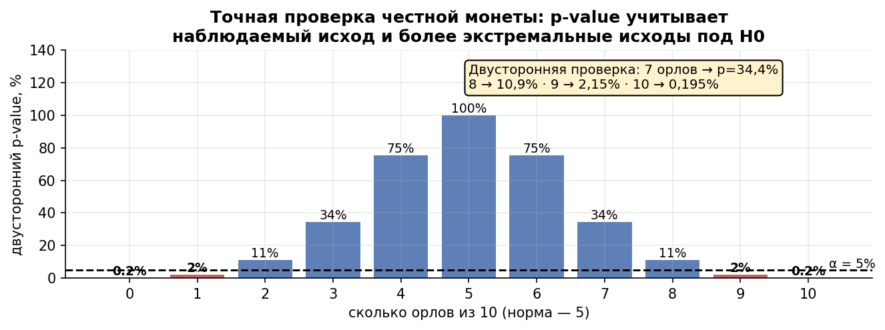
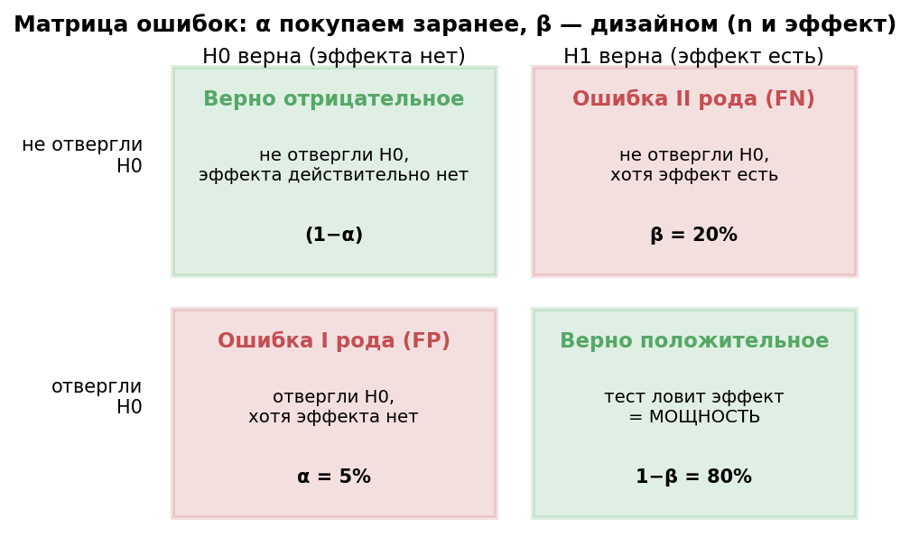
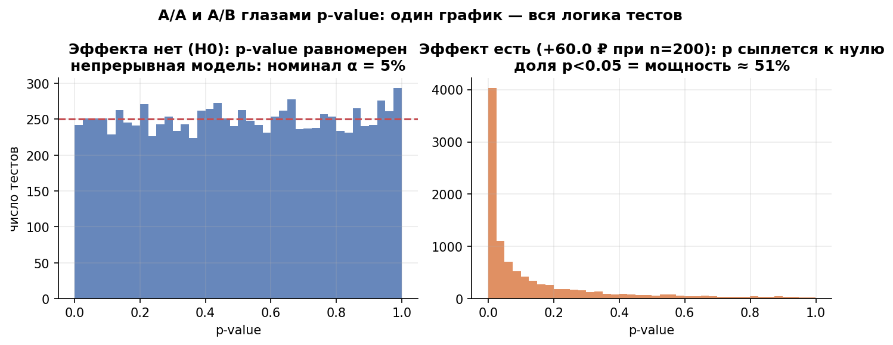
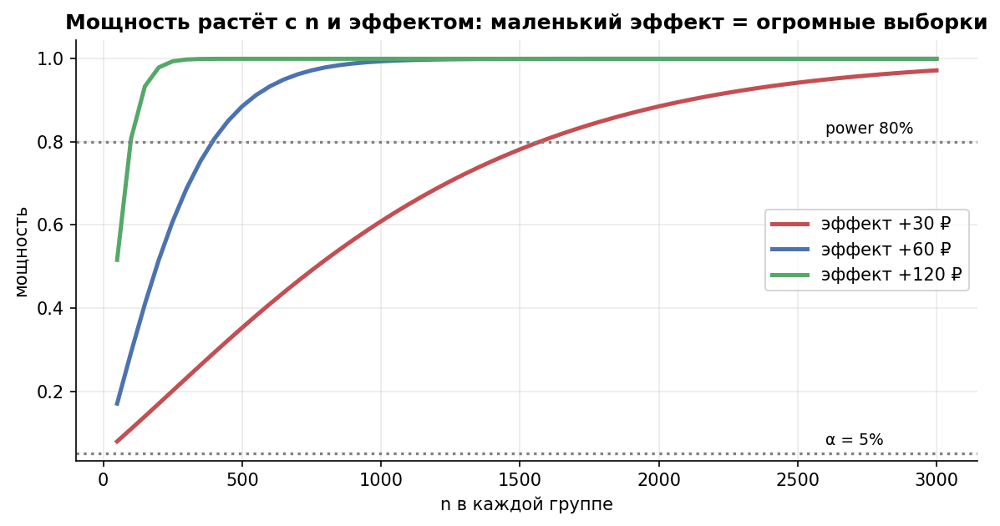
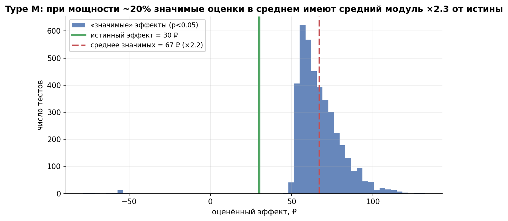

# Урок 2.1 — Логика NHST: нулевая гипотеза, p-value, ошибки I/II рода

**Цель урока:** объяснить H0, p-value, ошибки I/II рода и мощность; проверить их смысл симуляцией.

**Перед уроком:** [проверьте зависимости темы](../../PREREQUISITES.md); обозначения — в [словаре](../../GLOSSARY.md).

## Зачем это аналитику

«ЕдаДома» тестирует новую сортировку ресторанов на главной. Контроль: конверсия в заказ 12,0%. Тест: 13,8%. Продакт спрашивает: «Работает?» — и это неправильный вопрос. Правильный: «чем наблюдаемая разница отличается от того, что породил бы чистый шум?». Мы знаем из урока 1.1, что конверсия на 1000 юзерах гуляет на ±1,3 п.п. просто так; значит, вопрос «+1,8 п.п. — это сигнал или шум» нельзя решить взглядом на дашборд. Нужна процедура.

Такая процедура есть — **NHST** (null hypothesis significance testing, частотная проверка гипотез Фишера–Неймана–Пирсона). Её сила в том, что это контракт с зафиксированными рисками: мы *заранее* объявляем максимальную долю ложных тревог (α), *дизайном* покупаем нужную вероятность поймать эффект (мощность) — и только потом смотрим данные. Без контракта команда раскатывает случайные флуктуации и хоронит реальные улучшения: при 20 «посмотренных» метриках хотя бы одна «прокрасится» с вероятностью 64% (урок 2.4).

Этот урок — фундамент всего курса: АБ-тесты (М3–М4) — это NHST, надетый на рандомизированный эксперимент. И учить его мы будем как всегда: **не верь формуле — проверь симуляцией** — сегодня лично сгенерируем 10 000 миров с эффектом и без и посмотрим на p-value своими глазами.

## Теория

### 1. Гипотезы H0 и H1: презумпция невиновности

Проверка гипотез — это суд. **Нулевая гипотеза H0** — позиция по умолчанию, «эффекта нет, наблюдаемая разница — шум»; **альтернативная H1** — «эффект есть». Формально для разности метрик:

$$H_0:\ \Delta = 0 \qquad \text{против} \qquad H_1:\ \Delta \neq 0$$

Три следствия из судебной аналогии (фрейм Глеба Михайлова, [ГМ 3.1]):

1. **Бремя доказательства — на H1.** «Бизнес-гипотеза» в бытовой речи («новая сортировка поднимет конверсию») — это всегда *альтернативная* гипотеза. Сильное утверждение требует доказательств; «ничего не менялось» — статус-кво.
2. **Данные — улики.** Мы не «доказываем H0 или H1» — мы спрашиваем: насколько данные *противоречат* H0? Достаточно противоречат — отвергаем H0 (выносим «виновный» вердикт эффекту).
3. **«Не отвергли» ≠ «доказали невиновность».** Отсутствие улик — не доказательство невиновности; это «улик недостаточно». Каким бывает «недостаточно» — увидим в разделе про мощность.

Лестница доказательств на монете (H0: монета честная, p = 0,5; 10 бросков). Считаем вероятность *такого же или более сильного* отклонения от нормы (5 орлов):

| Выпало орлов | 5 | 6 | 7 | 8 | 9 | 10 |
|---|---|---|---|---|---|---|
| Вероятность при честной монете | 100% | 75% | 34% | 11% | 2,1% | 0,2% |

Шесть орлов из десяти — заурядно (75%), семь — тоже не довод (34%), девять — уже серьёзно (2,1%). Это и есть вся логика NHST: взвешиваем, насколько данные несовместимы с H0.

**Односторонняя или двусторонняя альтернатива.** По умолчанию рассматриваем оба направления. Односторонний тест законен, когда до данных выбран вопрос о конкретном направлении: например, $H_0:\Delta\le0$ против $H_1:\Delta>0$. Противоположный эффект возможен, но этот тест не служит доказательством улучшения в другую сторону; вред контролируют отдельно. Выбирать направление после просмотра результата нельзя.

### 2. p-value: строгое определение и рабочая формулировка

**Строгое определение**: p-value — вероятность получить такое же или более экстремальное значение статистики, чем наблюдаемое, *при условии, что H0 верна*. Для статистики $T$ и наблюдённого значения $t_{\text{набл}}$:

$$p = P_{H_0}\big(|T| \ge |t_{\text{набл}}|\big)$$

Мини-пример (продолжение монеты): выпало 9 орлов из 10. $p = 2 \cdot P(\ge 9) = 2 \cdot \frac{10+1}{1024} \approx 0{,}021$.

**Рабочая формулировка** ([ГМ 3.3]): p-value — это **potential false positive rate**: «если бы мы отвергали H0 с тем порогом, который дали наши данные, — каким был бы процент ложных срабатываний?». Наблюдали 9/10? Сделай «9 из 10» порогом отвержения — и в каждом 50-м мире будешь объявлять честную монету нечестной (2,1%). Наблюдали 7/10 — порог «7 из 10» даст 34% ложных тревог. p-value переводит любые данные — орлы, рубли, конверсии — в одну стандартную шкалу: **порог уровня, на котором данная статистика оказалась бы в области отвержения; это не вероятность ошибки данного вывода**.

*Рис. 1. Линейка, проградуированная нулевой гипотезой: чем дальше данные от нормы при честной монете, тем меньше p-value.*

Решение принимается сравнением с **уровнем значимости α** — заранее зафиксированным максимумом ложных тревог:

$$p \le \alpha \ \Rightarrow\ \text{отвергаем } H_0 \qquad p > \alpha \ \Rightarrow\ \text{не отвергаем}$$

Ключевое слово — *заранее*: α = 5% или 1% выбирают до данных, исходя из цены ложной тревоги (раздел 4). Сравните с калькулятором из [ГМ 3.3]: significance там так и подписан — «desired maximum FPR», желаемый максимум ложных срабатываний.

### 3. Что p-value НЕ есть

Половина ошибок в промышленности — из этого списка ([Atlamos «База»]; DSM-статья APA, которую пересказывает Денг, — та же боль):

| Заблуждение | Почему нет | Что вместо этого |
|---|---|---|
| «p = 3% — вероятность, что H0 верна» | Частотный подход не приписывает вероятности гипотезам: p считается *при условии* H0. $P(\text{данные} \mid H_0) \ne P(H_0 \mid \text{данные})$ | «Если бы эффекта не было, такие данные случались бы в 3% тестов» |
| «1 − p = 97,7% — уверенность в эффекте» | 1 − p — не «вероятность H1», та же путаница направления вероятности | Степень уверенности — байесовский posterior (М5.2), и он зависит от априорной вероятности H1 |
| «p = 10⁻²⁷ — эффект огромный» | p-value не измеряет размер эффекта: он зависит от n. Тот же +1,8 п.п. даёт p = 0,23 при n = 1000 и p ≈ 8·10⁻⁸ при n = 20 000 (разбор ниже) | Размер эффекта — оценка + CI (+ d Коэна, урок 2.2) |
| «Не отвергли — доказали, что эффекта нет» | «Отсутствие доказательств ≠ доказательства отсутствия». Тест мог просто не хватить мощности | Оценка и CI; проектная мощность только для заранее указанного эффекта |

Меньший p означает большую несовместимость данных с нулевой моделью при её допущениях; это градуированная величина, а не только флажок порога. Он не измеряет размер эффекта, вероятность H0 или вероятность ошибки именно этого вывода. При больших n даже практически малый реальный эффект может дать крошечный p.

### 4. Матрица ошибок 2×2: α, β и мощность

Одна таблица описывает любой критерий — статистический тест, медтест, алерт:

| | **H0 верна** (эффекта нет) | **H1 верна** (эффект есть) |
|---|---|---|
| **Тест не отвергает H0** | верное молчание, вероятность $1-\alpha$ | **ошибка II рода** (ложный пропуск), вероятность $\beta$ |
| **Тест отвергает H0** | **ошибка I рода** (ложная тревога, FP), вероятность $\alpha$ | верное обнаружение = **мощность** $1-\beta$ |

Продуктовые примеры (тест новой механики промоков «ЕдаДома»):

- **FP (α)**: фича бесполезна, но тест «прокрасился» — раскатываем: потрачены недели разработки, интерфейс усложнён, а конверсия не выросла. Команда закрепляет культуру «АБ всё равно что-то покажет».
- **FN (β)**: фича реально давала +3% выручки, тест «не взял» — идея похоронена, прибыль теряется каждый день, автор идеи демотивирован.
- **Мощность (1−β)**: доля миров, в которых настоящий эффект будет пойман.

Ошибка I рода контролируется *порогом* — это свойство анализа, α назначается до теста. Ошибка II рода — свойство *дизайна*: β зависит от объёма выборки и величины эффекта, и «договориться» с ней можно только планированием (n, MDE — урок М3.1). Отсюда практическая асимметрия: α = 5% — обычная цена ложной тревоги; 1% — если раскатка дорогая/рискованная; 10% — для разведочных проверок, где пропуск дороже.

*Рис. 2. Матрица ошибок: α покупаем на этапе анализа, β — дизайном (n, MDE).*

### 5. Распределение p-value и мощность: три рычага

Самый честный портрет критерия — распределение его p-value в «ансамбле миров»:

- **Валидный p-value под H0 удовлетворяет $P(p\le u)\le u$.** Для непрерывного точного теста простого H0 часто получается равномерность. Дискретные точные тесты (например, монета из таблицы) обычно консервативны: при α=5% монета из 10 бросков отвергает в 2,1484% миров. A/A проверяет калибровку с учётом дискретности и Monte Carlo погрешности; неравномерность сама по себе не доказывает поломку.
- **Под H1 p-value скошен к нулю**, и доля p < 0,05 равна **мощности** теста для данного эффекта.

Для двустороннего z/t-теста двух средних (равные группы по $n$, SD $=\sigma$) мощность аппроксимируется формулой:

$$\mathrm{power}=\Phi(\delta-z_{1-\alpha/2})+\Phi(-\delta-z_{1-\alpha/2}),\qquad \delta=\frac{|\Delta|}{\sigma}\sqrt{\frac n2}.$$

Это точная мощность нормальной статистики с известной SE и приближение для t-теста. При достаточно большом положительном δ второе слагаемое мало; при Δ=0 оно необходимо, чтобы получить α, а не α/2.

Три рычага мощности:

1. **n**: вход через $\sqrt{n}$ — вдвое больше данных, в $\sqrt{2}$ дальше от порога. Пример для d = Δ/σ = 0,2: n = 200 на группу → мощность 52%; n = 393 → 80%; n = 1000 → 99%.
2. **Эффект Δ**: вход линейный. Поймать +30 ₽ при σ = 300 (d = 0,1) в 4 раза дороже, чем +60 ₽: ~1570 против ~393 юзеров на группу для 80%.
3. **α**: ослабить порог (5% → 10%) сдвигает $z_{1-\alpha/2}$ с 1,96 до 1,64 — мощность растёт, но растёт и поток ложных тревог.

*Рис. 3. Один график — вся логика тестов: под H0 p-value равномерен (5% ложных тревог по построению), под H1 — сыплется к нулю.*

*Рис. 4. Мощность растёт с n и с размером эффекта: маленький эффект = огромные выборки.*

Важно про границы применимости: **мощность и MDE интерпретируются только на этапе дизайна** ([Atlamos «База»]). После теста «наблюдаемая мощность», посчитанная из наблюдённого эффекта, — псевдометрика (она монотонно связана с p), а сравнение «наблюдаемый эффект < MDE, значит не прокрас» — незаконно: для вывода о величине есть CI. Планированию выборки посвящён урок М3.1.

### 6. Статистическая значимость ≠ практическая: effect size, CI, Type M и Type S

«Статистически значимый» означает отвержение H0 по выбранному правилу с контролируемым риском; это не гарантия существования эффекта и не оценка его величины. На 2 млн юзеров эффект +0,1 п.п. конверсии даст p ≈ 10⁻⁶ — и при этом может не окупить разработку. Решение «стоит ли эффект своих денег» — вне статистики: это бизнес-порог полезности и CI в отчёте (урок М3.1; интерпретация — М4.4).

Стандартный шаблон вывода теста: **оценка эффекта + CI + p + n** («+1,8 п.п., 95% CI [0,5; 3,1], p = 0,007, n = 5000 на группу»). p показывает несовместимость с H0, а не величину эффекта; оценка и CI нужны для решения.

Две ошибки «третьего рода» (Алекс Денг, гл. 8.7) — что происходит с *значимыми* результатами слабых тестов:

- **Type M** (magnitude): условие p < 0,05 отбирает миры, где шум «помог» эффекту. В нашей нормальной модели при мощности около 20% средний модуль *значимой* оценки примерно вдвое больше модуля истинной (в нашей симуляции — ×2,25). Значимый результат слабого теста систематически преувеличен — «проклятие победителя» (winner's curse) АБ-тестов, вернёмся в М4.5.
- **Type S** (sign): доля значимых эффектов *с неверным знаком*. При мощности 20% это доли процента, но при мощности 5–10% — уже единицы процентов: фича, «значимо поднявшая» метрику, изредка на самом деле её роняет.

Практический вывод: значимость без мощности — лотерея с завышенным выигрышем; увидели «прокрас» — первым делом спросите, на какой мощности он пойман.

*Рис. 5. Type M: при малой мощности тест показывает в среднем в ~2 раза больше истины — «значимые» эффекты преувеличены.*

## Разбор на данных

«ЕдаДома» проверяет баннер «Ужин за 15 минут» на главной. Метрика — конверсия в заказ в течение сессии. Двусторонняя проверка, z-тест долей (нормальная аппроксимация — урок 1.3).

| группа | юзеры | заказы | конверсия |
|---|---|---|---|
| контроль A | 1 000 | 120 | 12,0% |
| тест B | 1 000 | 138 | 13,8% |

Считаем руками:

1. Наблюдаемый эффект: $\hat{\Delta} = 0{,}138 - 0{,}120 = +0{,}018$ (+1,8 п.п.).
2. Общая доля: $\hat{p} = (120+138)/2000 = 0{,}129$.
3. Стандартная ошибка разности: $SE = \sqrt{\hat{p}(1-\hat{p})\left(\frac{1}{1000}+\frac{1}{1000}\right)} = \sqrt{0{,}129 \cdot 0{,}871 \cdot 0{,}002} \approx 0{,}0150$.
4. Статистика: $z = 0{,}018 / 0{,}0150 \approx 1{,}20$.
5. p-value: $p = 2(1 - \Phi(1{,}20)) \approx 2 \cdot 0{,}115 = 0{,}23$.
6. 95% CI эффекта: $0{,}018 \pm 1{,}96 \cdot 0{,}0150 = [-0{,}011;\ +0{,}047]$, т.е. **[−1,1; +4,7] п.п.**

Решение: p≈0,23 — H0 не отвергнута. Оценка +1,8 п.п. и 95% CI [−1,1; +4,7] п.п. совместимы и с небольшим вредом, и с полезным ростом. Подставлять наблюдённые +1,8 п.п. в формулу мощности после теста не нужно: это переупаковка p-value. Проектную мощность считают для заранее выбранных сценариев эффекта; результат оценивают по CI и бизнес-порогу.

Теперь та же разница конверсий (12,0% vs 13,8%) на больших выборках — все числа по тем же формулам:

| n на группу | z | p | 95% CI, п.п. | решение |
|---|---|---|---|---|
| 1 000 | 1,20 | 0,23 | [−1,1; +4,7] | не отвергаем |
| 5 000 | 2,68 | 0,007 | [+0,5; +3,1] | отвергаем H0 |
| 20 000 | 5,37 | ≈ 8·10⁻⁸ | [+1,1; +2,5] | отвергаем «с запасом» |

Три вывода из таблицы: (1) p-value — функция данных *и плана*: эффект один и тот же, а вердикт меняется с n; (2) CI сужается как $1/\sqrt{n}$ — в 4 раза данных, в 2 раза уже интервал; (3) p = 8·10⁻⁸ не делает +1,8 п.п. больше — «много ли это для бизнеса» решают бизнес-порог и экономика, а не количество нулей в p.

## Подводные камни

1. **«p = 3% — значит, вероятность случайности 3%».** Делают: пишут в отчёте «вероятность, что рост случаен, — 3%». Грозит: подмена $P(\text{данные} \mid H_0)$ на $P(H_0 \mid \text{данные})$; на редких эффектах реальная доля ложных прокрасов кратно выше p (base rate, М5.2). Правильно: «если бы эффекта не было, такие или более сильные данные случались бы в 3% тестов».
2. **«p = 0,3 — эффекта нет».** Делают: кладут фичу в могилу по «негативу». Грозит: похоронить работающую фичу (ошибка II рода), особенно тестом с мощностью 20–30%. Правильно: «не обнаружили на мощности X% для заранее выбранного эффекта» — и если X мал, тест дорабатывается, а не фича хоронится.
3. **«p = 10⁻²⁷ — эффект грандиозный».** Делают: ранжируют фичи по p-value, продают «сверхзначимость». Грозит: раскатка крошечных бессмысленных эффектов — на больших n значимо всё. Правильно: сортировать по оценке эффекта и CI; p оценивает несовместимость с H0 и не заменяет оценку величины.
4. **α выбирают после взгляда на p.** Делают: «получили p = 0,07 — возьмём α = 10%»; или α = 5%, но «почему бы не односторонний, тогда 0,035». Грозит: реальная доля ложных тревог не контролируется вообще — это p-hacking. Правильно: α и альтернатива фиксируются в дизайн-доке до запуска (М4.1); множественные метрики — поправки (урок 2.4).
5. **Ежедневный пересчёт p на накопляющихся данных.** Делают: смотрят p каждое утро, останавливаются на первом «прокрасе». Грозит: α раздувается с 5% до 20–30% — подглядывание (peeking). Правильно: фиксировать горизонт заранее или последовательные тесты (М3.7).
6. **«Негатив» без вопроса о мощности.** Делают: из таблицы тестов делается вывод «в этой области фичи не работают». Грозит: стратегические решения на процедуре, которая почти ничего не ловит. Правильно: у каждого негатива — мощность дизайна; счётчик похороненных-на-слабой-мощности гипотез.
7. **Раскатка «значимого» эффекта слабого теста как есть.** Делают: тест с мощностью ~20% прокрасился +5% — рапортуют +5%. Грозит: Type M — значимые оценки таких тестов в среднем завышены в ~2 раза (и изредка знак неверен, Type S); после раскатки эффект «не воспроизводится». Правильно: значимость слабого теста — повод уточнить эффект (ретест на большей мощности, М4.5), а не финальная цифра.

## Практика

Сначала выполните самостоятельную версию [`exercise_2_1.py`](exercises/exercise_2_1.py): прогноз → расчёт → письменное решение. Готовый [practice_2_1.py](practice/practice_2_1.py) ниже — разбор для сверки после попытки.

Файл [practice_2_1.py](practice/practice_2_1.py) (percent-формат, только numpy/scipy/matplotlib, seed зафиксирован). Модель: выручка на юзера ~ N(1240; 300²), n = 200 на группу; 10 000 виртуальных тестов. Четыре блока:

1. **(а) A/A**: 10 000 тестов без эффекта — гистограмма p-value ([practice_2_1_pvalue_hist.png](images/practice_2_1_pvalue_hist.png), левая панель).
2. **(б) A/B**: то же, но эффект +60 ₽ (d = 0,2) — правая панель.
3. **(в) Кривые мощности**: n от 100 до 3000 для эффектов +30/+60/+120 ₽, точки-симуляция против теории ([practice_2_1_power_curves.png](images/practice_2_1_power_curves.png)).
4. **(г) Type M/S**: истинный эффект +30 ₽ при n = 250 (мощность ~20%), 30 000 тестов — гистограмма оценок среди значимых ([practice_2_1_type_m.png](images/practice_2_1_type_m.png)).

Что должны увидеть (числа реального запуска):

- (а) p-value равномерен: средний p = 0,499, квартилы по 0,25, **доля p < 0,05 = 5,06%**, p < 0,01 = 1,10%, KS-тест равномерности p = 0,95. Каждый двадцатый A/A-тест «прокрасится» — это норма критерия, а не баг сплит-системы.
- (б) мощность = 50,7% против теории 51,6%; медианный p = 0,048 против 0,5 в A/A — под H1 p-value ссыпается к нулю.
- (в) нормальная формула даёт примерно **1570 / 392 / 98** на группу для d = 0,1 / 0,2 / 0,4. Симуляционная сетка с шагом 100 и 1000 миров даёт грубое пересечение 80%, с Monte Carlo интервалами; она проверяет порядок величины, но не определяет точный необходимый n.
- (г) мощность 20,1%; средняя оценка по всем тестам +29,7 ₽ (несмещённо), а **среди значимых +66,5 ₽ — знаковое отношение ×2,22; Type M по модулям ×2,25**; Type S — 0,8% значимых с обратным знаком.

## Домашнее задание

**Задача 1.** Монету подбросили 10 раз — 9 орлов. Посчитайте p-value (двусторонне) и решение при α = 5%. Почему двусторонне — правильно, даже если вы «ждали» орлов?

Ответ

$p = 2\,\dfrac{C_{10}^9 + C_{10}^{10}}{2^{10}} = 2 \cdot \dfrac{11}{1024} \approx 0{,}021 < 0{,}05$ — отвергаем H0 по заранее заданному правилу; это не исключает ошибку I рода. Если интересует любая нечестность, проверка двусторонняя; заранее выбранная гипотеза о смещении именно к орлам допускает односторонний тест. Направление фиксируют до данных: «ждали орлов» после взгляда на выпавшее — это односторонний тест задним числом, он удешевляет проверку ценой неподконтрольных ложных тревог.

**Задача 2.** Коллега: «p = 0,24, значит с вероятностью 76% эффект есть, просто слабый». Разберите фразу по частям.

Ответ

Две ошибки. (1) $1 - p$ — не вероятность H1: p — вероятность столь же или более экстремального результата выбранной статистики при H0, а не вероятность гипотез. (2) «Просто слабый» — подмена p размером эффекта: p = 0,24 говорит о совместимости с шумом, но не о величине эффекта (смотри CI). Корректно: «при верной H0 столь же или более экстремальная статистика возникает с вероятностью 24%; эффект, если он есть, не исключён — смотрите CI и мощность дизайна».

**Задача 3.** Тот же баннер, но n = 2000 на группу: 240 заказов в контроле (12,0%) против 276 в тесте (13,8%). Посчитайте z и p вручную. Какая мощность была у теста для эффекта +3 п.п.?

Ответ

$\hat p=516/4000=0{,}129$, $SE\approx0{,}01060$, $z\approx1{,}70$, $p\approx0{,}089$. При нормальном приближении и принятой проектной SE мощность для заранее выбранного +3 п.п. около 81%. Но 95% CI эффекта примерно [−0,278; +3,878] п.п.: +3 и +3,5 п.п. не исключены. Проектная мощность не задаёт вероятность того, что истинный эффект меньше MDE после незначимого результата; для исключения заданной границы нужен соответствующий CI/тест.

**Задача 4.** Сколько юзеров на группу нужно, чтобы ловить +2 п.п. конверсии при базовой 12% с мощностью 80% (α = 5%)? Считайте $n \approx 2\,(z_{0{,}975} + z_{0{,}8})^2 \hat{p}(1-\hat{p})/\Delta^2$.

Ответ

$n \approx 2 \cdot 7{,}85 \cdot \dfrac{0{,}12 \cdot 0{,}88}{0{,}02^2} = 15{,}7 \cdot \dfrac{0{,}1056}{0{,}0004} \approx 4\,144$ — около 4 100 юзеров на группу (×4, если эффект +1 п.п.: ~16 600). Это «плата за метрики» из [ГМ 2.3]: вдвое меньше эффект — вчетверо больше выборка. (Полный дизайн — урок М3.1.)

**Задача 5.** Вы прогнали A/A-тест и проверили 100 метрик: у 8 из них p < 0,05. Паниковать? При каком числе «значимых» стоило бы бить тревогу?

Ответ

Если 100 проверок независимы и каждая имеет точный уровень 5%, число отвержений имеет Binom(100,0.05): E=5, SD≈2,18; P(K≥8)≈12,8%. Для метрик одних пользователей независимость не гарантирована, поэтому по одному числу 8 диагноз поставить нельзя. Сравните с A/A-распределением счётчика, полученным при сохранении зависимости метрик; отдельно проверьте дизайн, логи и калибровку каждого критерия.

## Шпаргалка

1. H0 = «эффекта нет, разница — шум» = презумпция невиновности; бремя доказательства на H1; «не отвергли» ≠ «доказали H0».
2. p-value: строго — $P(\text{данные столь же или более экстремальные} \mid H_0)$; рабочее — «потенциальный FPR, если взять наблюдённый эффект за порог».
3. p ≠ P(H0); 1 − p ≠ уверенность; p ≠ размер эффекта; «не отвергли» ≠ «эффекта нет».
4. Решение: p ≤ α, где α — желаемый максимум ложных тревог, зафиксированный ДО данных.
5. Матрица 2×2: ошибка I рода α (ложная раскатка), ошибка II рода β (похороненная фича), мощность 1 − β.
6. α — свойство анализа (порог), β — свойство дизайна (n, эффект): с β договариваются планированием, а не интерпретацией.
7. Двусторонняя normal-мощность: $\Phi(\delta-z)+\Phi(-\delta-z)$, $\delta=|\Delta|/SE$, $z=z_{1-\alpha/2}$. При Δ=0 равна α; симметрична по знаку эффекта.
8. Под H0 валидность означает $P(p\le u)\le u$; равномерность — частный непрерывный случай. Под H1 доля отвержений есть мощность для конкретной альтернативы.
9. Статзначимость ≠ практическая: в отчёте — оценка + CI + p + n; «много ли это» решает бизнес через порог практической важности.
10. Слабый тест + значимость = Type M (эффект преувеличен, при мощности 20% — ×2) и изредка Type S (знак неверен); мощность/MDE живут только на этапе дизайна.

## Источники

- [Заявление ASA о p-value](https://www.amstat.org/asa/files/pdfs/p-valuestatement.pdf): p не является вероятностью гипотезы или размером эффекта; решение не сводится к одному порогу.
- Глеб Михайлов, [SW.BAND] 3.1–3.3 «Проверка гипотез», «P-value» — транскрипты `materials/transcripts/ГМ-3.1-...`, `ГМ-3.2-...`, `ГМ-3.3-P-value.md` (дайджест: `materials/transcripts/_digest.md`): H0 = презумпция невиновности; p-value как potential false positive rate; шкала-линейка 100/75/35/11/2%; препарация официального определения по частям.
- Alex Deng, *Causal Inference and Its Applications in Online Industry*, гл. 8.7 — p-value, power, ошибки Type S и Type M — https://alexdeng.github.io/causal/abstats.html (конспект: `materials/web/alexdeng-causal-book.md`).
- Симулятор АБ-тестов (karpov.courses), урок 2 «Проверка гипотез» — H0/H1, ошибки I/II рода численным экспериментом (1000 повторов), p-value, обзор критериев — `materials/local/ab-simulator.md`.
- X5 Product Analytics, урок 2 — базовые ошибки и закон малых чисел — `materials/local/x5-product-analytics.md`.
- Ульянов FUlyankin, matstat-AB, неделя 9 — проверка гипотез — `materials/web/fulyankin-github.md`.
