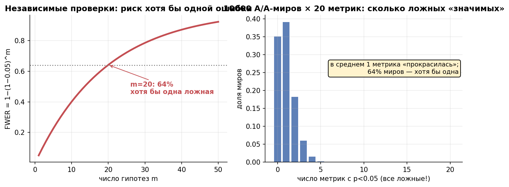
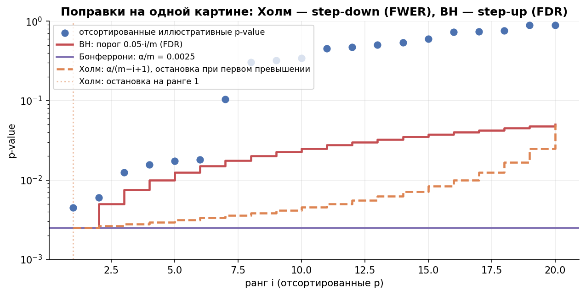
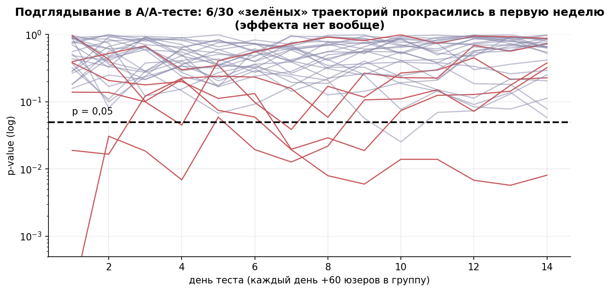

# Урок 2.4 — Множественные сравнения: FWER, FDR, Бонферрони, Холм, BH

**Цель урока:** задать семейство проверок, различить FWER/FDR и применить подходящую поправку.

**Перед уроком:** [проверьте зависимости темы](../../PREREQUISITES.md); обозначения — в [словаре](../../GLOSSARY.md).

## Зачем это аналитику

Онлайн-дашборд «ЕдаДома» после теста новой версии главной страницы: конверсия, средний чек, AOV, число заказов, Retention 7/30, CR в повторный заказ, время сессии, CTR баннера, доля доставок вовремя, NPS… — легко набрать 20 метрик. Каждая проверяется на α = 5%. Вопрос на миллион: какова вероятность, что **хоть одна** прокрасится просто от шума, когда эффекта нет вообще? При независимых тестах ответ: $1-(1-0{,}05)^{20} = 64\%$. Это существенно выше 5% — симулятор АБ прямо называет это примером «20 цветов текста»: кто-то обязательно «откроет» цвет, который ничего не делает. X5 в том же духе: 30 фейковых A/B-тестов дали ~1,5 «значимых» результата; на 18 метрик порог Бонферрони уже не 0,05, а 0,0028.

Проблема шире, чем «много метрик». Сегменты (5 городов × 2 платформы), попарные сравнения четырёх вариантов (6 пар), «второй контроль для надёжности» в А/А/В (koch-kir) — всё это множитель $m$. И особый случай — **peeking**: ежедневный взгляд на p-value — это тоже серия тестов, множественность во времени (мостик к уроку 3.7).

Этот урок — про гигиену: знать, что именно ты контролируешь (вероятность хоть одной ложной тревоги или долю ложных среди открытий), и уметь это посчитать.

## Теория

### 1. Механика: m проверок и FWER

Пусть мы делаем $m$ независимых тестов на уровне $\alpha$, и все нулевые гипотезы верны (мир A/A). Вероятность, что конкретный тест промолчит: $1-\alpha$. Что промолчат все: $(1-\alpha)^m$. Значит, вероятность хотя бы одной ложной тревоги — **FWER** (family-wise error rate):

$$FWER = 1-(1-\alpha)^m$$

| $m$ | 1 | 2 | 5 | 10 | 20 | 40 | 100 |
|---|---|---|---|---|---|---|---|
| FWER при α=5% | 5% | 10% | 23% | 40% | **64%** | 87% | 99% |

Ожидаемое число ложных прокрасок — просто $\alpha \cdot m$: при 20 метриках в среднем **одно ложное отвержение на эксперимент в среднем по повторениям**, даже если ни один эффект не существует. Это и есть «20 метрик — одна прокрасится».

Откуда берётся $m$ на практике:

- метрики дашборда: 10–40 штук;
- сегменты: «а давай посмотрим по Москве отдельно» — каждый разрез это новый тест;
- попарные сравнения >2 групп: $k$ групп → $\binom{k}{2}$ пар (4 группы → 6, см. урок 2.5);
- **А/А/В** (koch-kir): «второй контроль для надёжности» добавляет сравнение A1 vs A2, которое ложно красится в ~α случаев, плюс отбирает трафик у основных сравнений — мощность падает, ошибка растёт. Сплит-систему чинят не вторым контролем в каждом тесте, а SRM-тестом и платформенными А/А (М4.2).

Формула выше требует независимости. При зависимых метриках FWER определяется совместным распределением отвержений. В однофакторной гауссовой модели нашей практики положительная корреляция снижает FWER; для произвольной зависимости это не универсальное правило. Бонферрони и Холм сохраняют FWER-контроль при любой зависимости валидных p-value.

*Рис. 1. 20 независимых тестов: хотя бы одна ложная «находка» в 64% случаев; в среднем 1 из 20 метрик прокрасится просто так.*

### 2. FWER против FDR: что мы контролируем

Два разных определения «ложных открытий»:

- **FWER** — вероятность хотя бы одного ложного открытия среди всех $m$: $\ P(\text{есть хоть одно ложное})$. Строгий стандарт: «ни одной ложной тревоги с вероятностью 95%»;
- **FDR** (false discovery rate) — ожидаемая **доля** ложных среди сделанных открытий: $E\left[\frac{\text{ложные}}{\text{все открытия}}\right]$.

Что выбирать:

| Ситуация | Контролируем | Почему |
|---|---|---|
| ship/no-ship решение по OEC, guardrails | FWER | одна ложная тревога = раскатка пустой фичи |
| разведочный анализ: десятки метрик, сегментов, гипотез | FDR | готовы терпеть долю ложных, лишь бы не пропустить кандидатов |

Ключевое различие на пальцах: FWER отвечает «какова вероятность, что я вообще соврал», FDR — «какую долю моих открытий можно списать на шум». При полном H0 (эффектов нет) оба дают одно и то же — любой FDR-контроль при всех верных H0 вырождается в FWER. Разница проявляется, когда часть гипотез реально живая: BH тогда пропускает существенно больше настоящих эффектов.

### 3. Поправки FWER: Бонферрони и Холм

**Бонферрони** — простейшая из возможных: делим α на число тестов.

$$\text{отвергаем } H_{(i)}, \text{ если } p_{(i)} \le \frac{\alpha}{m}$$

(эквивалентно: скорректированное p-value $\tilde p_{(i)} = \min(m \cdot p_{(i)},\ 1)$). Гарантия FWER ≤ α верна всегда, даже для зависимых тестов — этим Бонферрони и ценен. Цена — консервативность: порог 0,05/20 = 0,0025 убивает мощность, особенно когда метрики коррелированы (а они коррелированы почти всегда). Кейс X5: 18 метрик → требуется p < 0,0028 — «значимость» 0,03 уже не проходит.

**Холм** (1979, step-down) — та же гарантия FWER, но мощнее. Процедура:

1. сортируем p-value по возрастанию: $p_{(1)} \le p_{(2)} \le \dots \le p_{(m)}$;
2. сравниваем по цепочке: $p_{(1)}$ с $\alpha/m$, $p_{(2)}$ с $\alpha/(m-1)$, …, $p_{(i)}$ с $\alpha/(m-i+1)$;
3. отвергаем гипотезы, пока пороги пробиваются; **первый же провал останавливает** процедуру — всё после него не отвергается.

Пороги у Холма не жёстче Бонферрони ни для одного ранга (для первого — равны), поэтому Холм отвергает всё то же и иногда больше. В 1979-м это было маленькой революцией: «бесплатный» выигрыш мощности при тех же гарантиях. Правило по умолчанию: **если контролируете FWER — берите Холм, а не Бонферрони**.

### 4. BH: контроль FDR для десятков метрик

**Бенджамини–Хохберг** (1995, step-up) контролирует не FWER, а FDR на уровне $q$ (обычно 0,05):

1. сортируем p-value: $p_{(1)} \le \dots \le p_{(m)}$;
2. находим максимальный ранг $k$, для которого $p_{(k)} \le \frac{k}{m} q$;
3. отвергаем $k$ гипотез с наименьшими p-value.

Интуиция порога: допускаем более мягкий порог для больших рангов — если среди метрик много настоящих эффектов, «высокий ранг» с маленьким p скорее настоящий, и мы можем позволить себе пропустить больше. BH незаменим в разведке: сотни метрик, сегментов, фичей — там FWER-поправки не оставили бы ничего.

Гарантия BH требует независимости либо подходящей положительной зависимости (PRDS). Перекрывающиеся сегменты не гарантируют PRDS; при произвольной зависимости можно использовать Benjamini–Yekutieli (BY) с порогами iq/(m·∑1/j).

Практическая граница: BH в продуктовом АБ не для принятия решения о раскатке (там FWER или вообще один OEC без поправки), а для составления списка кандидатов «что ещё копнуть».

*Рис. 2. Поправки: Бонферрони режет всё; Холм — тот же контроль FWER, но мягче; BH контролирует FDR и пропускает больше находок.*

### 5. Peeking: множественность во времени

Каждое «посмотрели на p-value» — это тест. Смотрели 14 дней подряд и остановились при первом p < 0,05? Это до 14 тестов, и FWER точно так же ползёт вверх: симуляции X5 показывают, что 27% A/A-траекторий пересекают 0,05 при ежедневных проверках, а фактическая ошибка I рода доезжает до 25–40%. Atlamos формулирует жёстко: продлевать тест после «прокраса» бесполезно — вы уже заглянули.

Накопительные взгляды зависимы, поэтому $1-(1-\alpha)^K$ здесь не точная формула. Простой корректный план: заранее назначить K взглядов и сравнивать каждый валидный fixed-horizon p с α/K. По union bound вероятность хотя бы одного ложного отвержения ≤α независимо от зависимости. Это консервативный вариант; group sequential/alpha-spending или always-valid методы обычно эффективнее (урок 3.7). Нельзя выбирать K задним числом.

*Рис. 3. Подглядывание = множественные сравнения во времени: в A/A-тесте без всякого эффекта треть траекторий «прокрасится» в первую неделю.*

### 6. p-hacking и сад расходящихся тропинок

Формальная множественность (20 метрик) — честная проблема: хотя бы её видно. Хуже — **неявная**: аналитик после взгляда на данные сам выбирает, какой результат показать. Джелмен называет это «садом расходящихся тропинок» (garden of forking paths): на каждом шаге анализа — развилка (какую метрику, какой сегмент, окно до или после outliers-фильтра, неделю или две), и до данных невозможно проверить, сколько тропинок было пройдено. Итог того же рода, что и 20 метрик: «значимый» результат почти гарантирован, но m никто не посчитал — значит, и поправить нельзя. Частный случай — HARKing: гипотеза «после» выдаётся за гипотезу «до» (X5: сегменты, заявленные до теста, — анализ; найденные после — HARKing).

Противоядие — организационное, и оно же самое дешёвое:

- **дизайн-док до запуска** (М4.1): гипотеза X→Y→Z, OEC, guardrails, метод, момент проверки — письменно и до данных;
- **pre-registration / Analysis Plan** (shelter_analytics: признак зрелой экспериментальной культуры);
- сегменты для анализа фиксируются заранее; всё, что нашли по ходу, — генератор новых гипотез (и новых тестов), а не результат этого теста;
- «я проверил только OEC» работает только если OEC был зафиксирован до запуска — иначе вы выбрали максимум задним числом.

## Разбор на данных

Тест «ЕдаДома» закончен, продакт принёс 5 метрик с p-value: **0,60; 0,04; 0,20; 0,01; 0,02**. Сортируем: 0,01; 0,02; 0,04; 0,20; 0,60. Применяем всё, что узнали ($\alpha = 0{,}05$, $m = 5$):

| ранг | p | без поправки | Бонферрони (порог 0,01) | Холм (порог $\frac{0{,}05}{m-i+1}$) | BH (порог $\frac{i}{m} \cdot 0{,}05$) |
|---|---|---|---|---|---|
| 1 | 0,01 | значим | **значим** (0,01 ≤ 0,01) | **значим** (0,01 ≤ 0,010) | **значим** (0,01 ≤ 0,010) |
| 2 | 0,02 | значим | нет (0,02 > 0,01) | нет (0,02 > 0,0125) → стоп | **значим** (0,02 ≤ 0,020) |
| 3 | 0,04 | значим | нет | — | нет (0,04 > 0,030) → k=2 |
| 4 | 0,20 | нет | нет | — | — |
| 5 | 0,60 | нет | нет | — | — |

Итог: **3 значимых без поправки → 1 (Бонферрони) → 1 (Холм) → 2 (BH)**. Скорректированные p-value (как их считает statsmodels): Бонферрони [0,05; 0,10; 0,20; 1; 1], Холм [0,05; 0,08; 0,12; 0,40; 0,60], BH [0,05; 0,05; 0,067; 0,25; 0,60].

Читаем: p = 0,04, который «прошёл» без поправки, не проходит ни одну — при 5 метриках это уже шумовая территория. Разница Холм/BH видна на ранге 2: у Холма первый же провал (0,02 > 0,0125) остановил всю процедуру, а BH пропустил вторую метрику — контролирует вместо FWER долю ложных, поэтому может позволить себе лишнее отвержение.

И обратный расчёт на салфетке: сколько независимых проверок можно сделать при полном H0, чтобы FWER не превысил 20%? $1-0{,}95^m \le 0{,}2 \Rightarrow m \le \ln 0{,}8/\ln 0{,}95 \approx 4{,}3$ — **четыре метрики**. Дальше без поправок нельзя, а с поправками — привет, Холм.

## Подводные камни

1. **«У нас одна метрика — OEC, поправки не нужны».** Делают: не поправляют, потому что «решаем по одной метрике». Грозит: рядом guardrails, диагностические метрики и сегменты — реальное $m$ = 10–20, FWER = 40–64%. Правильно: считать все проверки семейства (или честно решать только по OEC, зафиксированному до теста, без подглядываний в остальные).
2. **Бонферрони «всё режет» → не поправляем вовсе.** Делают: видят порог 0,0025, пугаются, отказываются от поправок. Грозит: ложные катки едут в прод. Правильно: Холм — тот же FWER, но мощнее; BH — если метрик десятки и допускается доля ложных.
3. **Путают FDR с «мягким FWER».** Делают: докладывают «BH контролирует ошибки на 5%». Грозит: отдельное открытие BH может оказаться ложным с вероятностью много выше 5% — контролируется доля, не каждая тревога. Правильно: для ship-решения — FWER (Холм); FDR — для разведочных списков кандидатов.
4. **А/А/В «для надёжности».** Делают: добавляют второй контроль в каждый продуктовый тест. Грозит: лишние попарные сравнения растят ошибку I рода, а отбор трафика снижает мощность всех сравнений (koch-kir). Правильно: сплит проверяют SRM-тестом и периодическими А/А на уровне платформы (М4.2), а не вторым контролем в каждом тесте.
5. **Peeking как «мониторинг».** Остановка при первом p<0,05 без плана раздувает ошибку. Заранее фиксируйте горизонт либо последовательное правило: в том числе Бонферрони α/K на K запланированных взглядов; более эффективные group-sequential процедуры — в М3.7.
6. **Forking paths задним числом.** Делают: после данных выбирают выигрышную метрику/сегмент/окно и показывают один «значимый» результат. Грозит: невидимая множественность — m неизвестно, поправить нельзя, репликация умрёт. Правильно: дизайн-док/Analysis Plan до запуска; находки «по ходу» — гипотезы для новых тестов.
7. **Поправки «в лоб» на весь дашборд из 200 метрик.** Делают: крутят Холм на всех метриках платформы. Грозит: порог 0,00025 — мощность убита даже у живых эффектов; при этом decision rule и так не «все 200 должны прокраситься» (shelter, гл. 3 серии: типы метрик success/guardrail/quality — поправки должны ложиться на реальное правило принятия решения, включая распределение α и β между типами). Правильно: один OEC без поправки + guardrails с их порогами, α-аллокация зафиксирована в дизайн-доке.

## Практика

Сначала выполните самостоятельную версию [`exercise_2_4.py`](exercises/exercise_2_4.py): прогноз → расчёт → письменное решение. Готовый [practice_2_4.py](practice/practice_2_4.py) ниже — разбор для сверки после попытки.

Файл: [practice_2_4.py](practice/practice_2_4.py) (percent-формат, numpy/scipy/statsmodels, seed зафиксирован). Что делает:

1. **1000 A/A-миров × 20 метрик**: доля миров с ≥1 «значимой» метрикой без поправок и с поправками; среднее число прокрасок.
2. **Холм и BH руками** (`holm_adjust`, `bh_adjust` — скорректированные p-value) + сверка с `statsmodels.stats.multitest.multipletests` до 1e-12; сравнение числа отвержений на 5 метриках из разбора и на 20 метриках (6 с реальным эффектом).
3. **Кривая FWER от m** (1–50): теория $1-(1-\alpha)^m$ против симуляции; отдельно — коррелированные метрики (ρ = 0,5).

Что должны увидеть (числа реального запуска):

- A/A × 20 метрик без поправок: **66%** миров с «открытием» (теория 64%), в среднем **1,01** ложной прокраски на мир, максимум 5 из 20;
- с любой поправкой (Бонферрони, Холм, BH) FWER возвращается к номиналу: **5,4%** миров — при полном H0 все поправки эквивалентны по уровню, разница — в мощности;
- 20 метрик, из них 6 с реальным эффектом: Бонферрони и Холм отвергли **0**, BH — **5**: вот где проявляется цена консервативности и выигрыш FDR;
- кривая FWER: m=10 → 41%, m=20 → 64%, m=50 → 92%; корреляция метрик (ρ=0,5) снижает до 28/41/62% — ниже формулы, но в разы выше номинала.

## Домашнее задание

1. Команда проверяет 40 метрик без поправок. Каков FWER? Предположите независимость и полный H0. Сколько метрик максимум можно проверить, чтобы FWER не превысил 20%?

Ответ

$FWER = 1-0{,}95^{40} = 87\%$. Обратная задача: $1-0{,}95^m \le 0{,}2 \Rightarrow m \le \ln(0{,}8)/\ln(0{,}95) \approx 4{,}3$, то есть **4 метрики**. Дальше либо поправки, либо сокращение семейства — что, кстати, само по себе лучшая стратегия: меньше метрик → выше мощность каждой.

2. p-value пяти метрик: 0,004; 0,008; 0,011; 0,30; 0,60. Примените Бонферрони, Холм и BH (α = q = 0,05). Сравните с разбором урока.

Ответ

Бонферрони (порог 0,01): отвергаются 0,004 и 0,008 — **2**. Холм: пороги 0,01; 0,0125; 0,0167; 0,025; 0,05 — пробиваются первые три (0,011 ≤ 0,0167) — **3**. BH: пороги 0,01; 0,02; 0,03; 0,04; 0,05 — k = 3 — **3**. Сравните с разбором (там 1/1/2): чуть меньшие p-value — и Холм уже обгоняет Бонферрони, потому что step-down «разрешает» более мягкие пороги для следующих рангов. Именно поэтому Холм — дефолт для FWER.

3. Продакт предлагает схему А/А/В: «проверим, что два контроля не различаются, и против обоих протестируем фичу — так надёжнее». Разберите по koch-kir: что это делает с ошибкой I рода и мощностью? Как чинить «надёжность» правильно?

Ответ

Три группы → до трёх сравнений: A1 vs A2 (ложно красится в ~α миров — и это ещё не значит, что сплит исправен), фича vs A1, фича vs A2; попарные тесты зависимы из-за общих групп, так что 1−0,95³≈14% — лишь ориентир для независимых проверок, не точный FWER этого дизайна. Плюс трафик делится на три части: мощность каждого сравнения падает (при том же объёме — заметно, см. М3.1). «Надёжность» чинят платформенно: SRM-тест после каждого запуска (порог p < 0,001) и регулярные А/А-тесты аудитом пайплайна (М4.2), а не вторым контролем в каждом эксперименте.

4. Команда смотрела кумулятивный p-value 14 дней и остановила тест при первом «прокрасе» на 9-й день. Почему итоговый p = 0,03 — не p = 0,03? Что стоило сделать?

Ответ

Это не один тест, а минимум девять взглядов — множественность во времени: «остановиться на первом прокрасе» означает выбрать минимум из серии зависимых тестов, и фактическая ошибка I рода уходит в 25–40% (X5: 27% A/A-траекторий пересекают 0,05). p = 0,03 здесь — p «в мире, где мы договорились смотреть только на 9-й день». Правильно: длительность и размер зафиксировать до запуска (дизайн-док, М3.1) или использовать последовательные критерии, которые позволяют смотреть много раз, не ломая уровень (mSPRT и семейство — М3.7).

5. Аналитик прогнал 120 сегментов × 15 метрик и рапортует: «сегмент „таргет на iOS в Казани“ значим (p = 0,008), BH-поправка применена». Что вас настораживает и что спросить?

Ответ

m=1800 само по себе не исключает прохождение p=0,008 через BH. Например, 300 значений p=0,008 и 1500 значений p=0,5 дают k=300, порог 0,05·300/1800≈0,008333 и adjusted p=0,048 для первых 300. BH выбирает максимальный подходящий k, а не проверяет все p по первому порогу. Запросите полный вектор p, семейство, max-k/adjusted p, условия зависимости и план подтверждения разведочной находки.

## Шпаргалка

1. Для независимых тестов точного уровня α при полном H0 $FWER = 1-(1-\alpha)^m$: m=20 → 64%, m=40 → 87%; ожидание ложных прокрасок = $\alpha m$.
2. «m» — это не только метрики: сегменты, попарные пары ($\binom{k}{2}$), второй контроль в А/А/В, взгляды на p-value.
3. FWER = «вероятность хоть одной ложной тревоги» — для ship-решений; FDR = «доля ложных среди открытий» — для разведки.
4. Бонферрони: α/m для валидных p-value, FWER≤α при любой зависимости; может быть консервативен.
5. Холм: сортировка + пороги $\alpha/(m-i+1)$, шаг вниз до первого провала; тот же FWER, мощнее Бонферрони — дефолт для FWER.
6. BH: максимальный k с $p_{(k)}\le(k/m)q$, отвергнуть ранги 1…k. FDR-контроль гарантирован при независимости или PRDS; для произвольной зависимости подходит консервативный BY. Количество гипотез не заменяет выбор FDR/FWER.
7. Зависимость может менять FWER в обе стороны относительно независимости; в приведённой гауссовой модели положительная корреляция снижает его, но это не общее правило.
8. Peeking — множественность во времени. Корректны фиксированный горизонт, Бонферрони на заранее заданные K взглядов или обоснованный последовательный метод.
9. p-hacking/форкинг — невидимая множественность: поправить нельзя, потому что m неизвестно; лечится дизайном до данных.
10. Дизайн-док до запуска: гипотеза, OEC, guardrails, сегменты, метод, момент проверки — лучшая «поправка» (Analysis Plan, pre-registration).
11. Не крути поправки на весь дашборд вслепую: роли метрик разные (success/guardrail/diagnostic), α можно распределять по правилу принятия решения (shelter).

## Источники

- Симулятор АБ-тестов (karpov.courses), урок 10 «Множественное тестирование» + семинар 10.1: пример «20 цветов текста», FWER при независимых тестах, поправки Бонферрони и Холма — `materials/local/ab-simulator.md`.
- X5 Product Analytics, урок 2 «Статистика без формул»: симуляция 30 фейковых A/B (~1,5 «значимых»), «техасский снайпер» (p-hacking), кейс 18 метрик → порог 0,0028; урок 3: peeking 25–40%, 27% A/A-траекторий — `materials/local/x5-product-analytics.md`.
- koch-kir, «Не стоит проводить А/А/В-тест!» — второй контроль: лишние попарные сравнения растят ошибку, отбор трафика режет мощность, сплит чинят SRM/А/А платформенно — `materials/web/web-articles.md` §3.3a.
- shelter_analytics (В. Шереметьев), серия «Множественная проверка гипотез в АБ», ч. 1 (механика «прокрасов», FWER/FDR, поправки) и гл. 3 ч. 1–2 (типы метрик, почему поправки «в лоб» не ложатся на decision rules, распределение α/β) — `materials/telegram/shelter_analytics-digest.md` (ссылки в §4).
- Kohavi, Tang, Xu, «Trustworthy Online Controlled Experiments», гл. 17 (множественное тестирование) и гл. 3 (мисинтерпретации, peeking) — `materials/local/books.md` §1.
- Atlamos, «База: айсберг A/B-тестов» — «продлевать тест после прокраса бесполезно»; статзначимость ≠ практическая — `materials/web/web-articles.md` §4.2.
