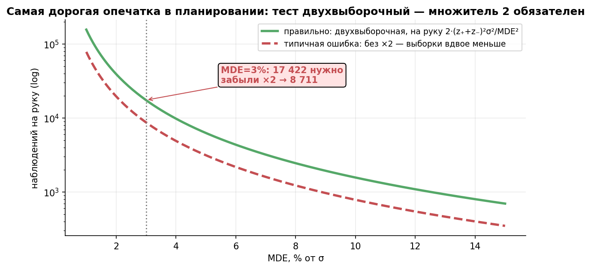
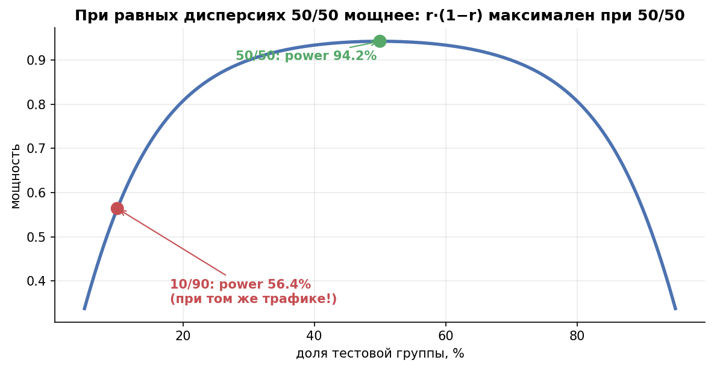
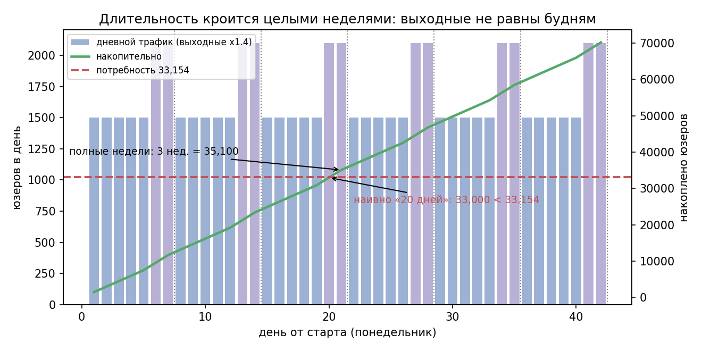

# Урок 3.1 — Дизайн: размер выборки, MDE, мощность

**Цель урока:** рассчитать n на группу, общий N и мощность; различать MDE и бизнес-порог, спланировать набор и созревание метрики.

**Перед уроком:** [проверьте зависимости темы](../../PREREQUISITES.md); обозначения — в [словаре](../../GLOSSARY.md).

## Зачем это аналитику

«ЕдаДома» хочет протестировать новую сортировку ресторанов на главной. Продакт: «Давай просто запустим на недельку и посмотрим». Проблема в том, что «посмотрим» — это тоже дизайн, только неявный и почти всегда плохой: либо тест с мощностью 25% часто пропустит полезный эффект (урок 2.1: «негатив» слабого теста почти ничего не утверждает), либо, наоборот, ежедневные взгляды на дашборд раздувают ложные тревоги (урок 3.7). Всё, что решает судьбу теста — α, β, MDE, n, длительность — фиксируется *до* запуска, в дизайн-доке. Этот урок — про то, как это считать.

И это не теория ради теории. В марте 2026 в канале shelter_analytics разбирали **реальную типичную ошибку**: аналитик считал размер выборки по *одновыборочной* формуле, забыл множитель 2 — и вместо необходимых **17 422 наблюдений получил 8 711**. Тест запустили, «негатив» посчитали доказательством. Симуляции показали: мощность такого теста — **50,8% вместо проектных 80%**. Вероятность пропустить такой эффект становится близка к половине. Ниже разберём, откуда берётся этот множитель, почему мощность падает примерно до 50,8% в данной аппроксимации (это не совпадение, а арифметика) и как не наступить на те же грабли.

## Теория

### 1. Формула для двух выборок — и откуда берётся двойка

Из урока 2.1 знаем: чтобы тест ловил эффект $\Delta$ с мощностью $1-\beta$ при уровне $\alpha$, нужно, чтобы «сигнал» превышал «порог шума»:

$$\Delta \ge (z_{1-\alpha/2} + z_{1-\beta}) \cdot SE(\hat\Delta)$$

В АБ-тесте мы сравниваем **два** средних, и дисперсия разности — сумма двух дисперсий. При равных группах по $n$ наблюдений:

$$SE(\hat\Delta) = \sqrt{\frac{\sigma^2}{n} + \frac{\sigma^2}{n}} = \sigma\sqrt{\frac{2}{n}}$$

Отсюда рабочая формула размера группы:

$$\boxed{\ n = \frac{2\,(z_{1-\alpha/2} + z_{1-\beta})^2\,\sigma^2}{\Delta^2}\ }$$

где $\Delta$ — MDE (эффект, который планируем обнаружить с заданной мощностью), $\sigma^2$ — дисперсия метрики на юзера (по пре-периоду). Для конверсии $\sigma^2 = p(1-p)$. Стандартный набор $\alpha = 5\%$, мощность 80% даёт $(1{,}96 + 0{,}84)^2 = 7{,}85$, и формула запоминается как «$15{,}7 \cdot \sigma^2/\Delta^2$».

**Двойка — это и есть цена сравнения двух групп.** Одновыборочная формула (клинические испытания «до/после», калибровка датчика) имеет $n \approx (z_1+z_2)^2\sigma^2/\Delta^2$ — в два раза меньше. Калькуляторы из учебников и статей часто приводят именно её, а читатель копирует «n наблюдений» в дизайн АБ-теста. Результат — как в посте shelter_analytics: 8 711 вместо 17 422.

*Рис. 1. Самая дорогая опечатка в планировании: тест двухвыборочный — множитель 2 обязателен (8 711 → 17 422).*

### 2. Чем грозит потерянная двойка: мощность 50,8%

Пусть аналитик целился в 80% мощности, но набрал ровно **половину** нужной выборки. Аргумент мощности $\Delta/SE$ уменьшится в $\sqrt{2}$ раз, и фактическая мощность:

$$\Phi\!\Big(\frac{(z_{1-\alpha/2}+z_{1-\beta})}{\sqrt{2}} - z_{1-\alpha/2}\Big) = \Phi\Big(\frac{2{,}80}{1{,}41} - 1{,}96\Big) = \Phi(0{,}02) \approx 50{,}8\%$$

Это приближённый результат нормальной модели с одинаковой фиксированной дисперсией: при α=5% и целевой мощности 80% половина рассчитанного n даёт около 50,8%. Для конверсий дисперсия меняется вместе с p, а для малых выборок приближение может быть неточным; проверяем мощность симуляцией конкретного анализа.

Считаемый пример «ЕдаДома»: конверсия в заказ $p_0 = 12\%$, MDE $\Delta = +1$ п.п., $\sigma^2 = 0{,}12 \cdot 0{,}88 = 0{,}1056$:

- по одновыборочной формуле (ошибка): $n = 7{,}85 \cdot 0{,}1056 / 0{,}01^2 \approx 8\,289$;
- правильно: $n = 2 \cdot 8\,288{,}4 \approx 16\,577$ юзеров на группу.

И обратное направление — MDE при фиксированном трафике: $\Delta = (z_1+z_2)\,\sigma\sqrt{2/n}$. Если у вас есть только 5 000 юзеров на группу, то MDE $= 2{,}80 \cdot 0{,}325 \cdot \sqrt{2/5000} \approx 1{,}82$ п.п. — меньшие эффекты обнаруживаются с мощностью ниже целевых 80%.

### 3. Общая формула через сплит r: почему 50/50 оптимален

Пусть в тест уходит доля $r$ трафика, в контроль $1-r$ (при том же объёме $N$ всего). Тогда:

$$N_{\text{всего}} = \frac{(z_{1-\alpha/2}+z_{1-\beta})^2\,\sigma^2}{\Delta^2}\cdot\frac{1}{r(1-r)}$$

При **равных дисперсиях и одинаковой стоимости наблюдений** r(1−r) максимальна при r=0,5: при фиксированном N оптимален 50/50. Перекос 10/90 требует в 0,25/0,09≈2,78 раза больше наблюдений. При разных дисперсиях оптимум n_B/n_A=σ_B/σ_A; при разных стоимостях на юнит n_B/n_A=(σ_B/σ_A)√(c_A/c_B). Ограничения риска могут оправдывать иной сплит.

В примере koch-kir при том же объёме трафика дисбаланс стоил падения мощности с ~0,79 до ~0,64; точная цифра зависит от того, где вы находитесь на кривой мощности — в нашем примере ниже (практика, блок 3) при 10/90 падение ещё жёстче: с 0,81 до 0,40. Несбалансированный сплит оправдан только когда: (а) «рискованная» версия требует малого раскатки — 10% теста как страховка; (б) тритмент физически применим к малой доле юзеров (фича только для платной подписки, которая у 5%); (в) контроль дорог (дорогие предложения с большой скидкой). Во всех остальных случаях — 50/50.

*Рис. 2. Балансированный сплит при равных дисперсиях и стоимости оптимален 50/50: r·(1−r) максимален в середине.*

### 4. MDE — это бизнес-решение

**MDE** — истинный эффект, который данный дизайн обнаруживает с заданной мощностью, например 80%, при выбранном α. **Минимально полезный бизнес-эффект** — порог окупаемости решения. Его используют как цель планирования, но не смешивают с MDE: статистически значимый эффект меньше планового MDE возможен и может быть полезен.

1. **Экономика изменения.** Новая сортировка стоит 6 недель разработки. Сколько стоит +0,5 п.п. конверсии «ЕдаДома» в год? Если раскатка окупается только при +2 п.п. — это и есть MDE; тест с MDE +0,5 п.п. ловит эффекты, которые никому не нужны.
2. **История тестов.** Распределение эффектов похожих изменений (персонализация, ранжирование): если за два года 80% эффектов были в пределах ±1 п.п., MDE +3 п.п. почти гарантирует «негатив», MDE +0,3 п.п. — вечный тест.
3. **Цена теста.** Трафик = время = отложенные гипотезы. Если честный MDE требует 6 месяцев — это не тот тест; дробите метрику на более чувствительную (3.5: CUPED), меняйте дизайн или признавайте, что фичу надо запускать без теста по другим основаниям.

В дизайн-доке до запуска фиксируют бизнес-порог, плановый MDE, α, мощность и решение при каждом исходе. Обратный расчёт достижимого MDE по трафику полезен для переговоров; он не делает более крупный эффект автоматически экономически достаточным.

### 5. Длительность: полные недели и сезонность

Из $n$ на группу и дневного трафика получается длительность — но не делением на дневной средний, а с тремя поправками:

- **Недельная сезонность.** Одновременные руки видят одинаковые календарные даты и при 13-дневном тесте. Полные недели нужны, когда целевой эффект должен представлять типичный недельный цикл: эффект и состав аудитории могут различаться по дням. Это вопрос переносимости результата и целевой популяции, а не автоматическое условие несмещённости.
- **Полные циклы поведения.** Зарплатные циклы (конец месяца), праздники, день запуска — не в пятницу вечером, когда половина команды смотрит на наполовину прогревшиеся кэши. Правило из Симулятора: длительность = целое число недель, старт в один и тот же день недели.
- **Запас 5–10%.** Боты, потери телеметрии, вылетевшие из сплита юзеры — чистый n на анализ будет меньше проектного (Симулятор, урок 3).

Считаем: нужно $2 \times 16\,577 = 33\,154$ юзеров; трафик 1 500/будень и 2 100/выходной (неделя $= 11\,700$, среднее $1\,671$/день). Наивно: $33\,154 / 1\,671 \approx 19{,}8$ → «20 дней». Честно: 3 полные недели (21 день, набираем 35 100) — разница небольшая, но именно она страхует от неполной недели в конце.

*Рис. 3. Календарь набора: выходные ×1,4 — «20 дней» наивного расчёта превращаются в 3 полные недели (из практики).*

### 6. Мощность живёт только на дизайне; проверка дизайна синтетическими A/A

Три следствия из «мощность — свойство дизайна» (Atlamos, «айсберг»):

1. **Длительность не выбирают по текущему p-value.** До запуска задают fixed horizon либо sequential rule. Независимые от исхода изменения набора и blinded sample-size re-estimation требуют заранее описанного правила; «продлим до значимости» нарушает исходную калибровку.
2. **MDE не порог решения.** Наблюдаемую оценку показывают с CI и сопоставляют с бизнес-порогом. Значимость возможна ниже MDE; при p>α целевой эффект может оставаться совместимым с данными. MDE отвечает «что планировали обнаруживать с данной мощностью», CI — «какие эффекты согласуются с результатом».
3. **Observed power по наблюдаемому эффекту не добавляет информации к p-value.** После теста можно оценить чувствительность к заранее выбранному эффекту при фактически набранном n и SD, явно указав допущения. Для вывода об эффекте используют CI; частотный CI сам по себе не задаёт вероятность параметра.

И финальный гигиенический шаг: **синтетические A/A на исторических данных** (Симулятор, урок 4). До запуска режем исторический трафик случайным сплитом 1 000 раз и прогоняем свой пайплайн анализа. Ожидание: p-value равномерны, доля p<0,05 ≈ 5% (урок 2.1). Если A/A «прокрашивается» в 15% прогонов — сломан не тест, а дизайн: зависимые данные (следующий урок), кривой сплит, сезонность в периодах. Это самый дешёвый способ поймать ошибку дизайна — до того, как она стоила месяц трафика.

## Разбор на данных

Дизайн-док «ЕдаДома», новая сортировка. База: конверсия в заказ $p_0 = 12\%$ ($\sigma^2 = 0{,}1056$), α = 5%, мощность 80%, сплит 50/50, трафик 1 671 юзер/день в среднем. Считаем $n$ на группу для четырёх MDE — и тут же «наивный» расчёт без двойки:

| MDE (абс.) | Без ×2 (ошибка) | Правильно (×2) | Всего юзеров | Дней «наивно» | Полных недель |
|---|---|---|---|---|---|
| +2,0 п.п. | 2 073 | **4 145** | 8 290 | 5,0 | 1 |
| +1,5 п.п. | 3 684 | **7 368** | 14 736 | 8,8 | 2 |
| +1,0 п.п. | 8 289 | **16 577** | 33 154 | 19,8 | 3 |
| +0,7 п.п. | 16 916 | **33 831** | 67 662 | 40,5 | 6 |

Как читать: каждый ряд показывает компромисс между чувствительностью и трафиком. При MDE +1 п.п. формула без ×2 даёт 8 289 вместо 16 578 на группу; потери мощности проверяем моделью и симуляцией.

Проверка расчёта одной строки руками: MDE +1,5 п.п. → $\sigma^2/\Delta^2 = 0{,}1056/0{,}000225 = 469{,}3$; $n = 2 \cdot 7{,}85 \cdot 469{,}3 = 7\,367$; запас 5% → ~7 700 на группу, 2 полные недели.

## Подводные камни

1. **Забытый множитель 2.** Делают: берут формулу/калькулятор с $n = (z_1+z_2)^2\sigma^2/\Delta^2$ и пишут в дизайн-док. Грозит: половина выборки, мощность 50,8% вместо 80%, пропускаете примерно половину эффектов размера MDE. Правильно: формула для двух выборок; проверка приёмом из практики — сверка симуляцией.
2. **σ² «на глаз».** Делают: подставляют σ конверсии из чужого кейса, дисперсию выручки за другой период, SD по тесту (которого ещё нет). Грозит: n ошибается в разы — σ входит в формулу квадратично. Правильно: σ по пре-периоду той же длины, что и тест, на том же юните; для конверсии — $\hat p(1-\hat p)$; пересчитывать n под каждую ключевую метрику и брать максимум.
3. **MDE не согласуют с задачей.** Рассчитать доступный MDE по трафику допустимо, но если он заметно больше типичного полезного эффекта, мощность мала. Обсудите метрику, длительность и риск пропуска; не называйте серый результат доказательством бесполезности.
4. **«Продлим до прокраса».** Делают: план 2 недели → на 10-й день p=0,20 → «пока не зазеленеет». Грозит: α раздувается до 20–30% (peeking, 3.7), раскатываются флуктуации. Правильно: горизонт в дизайн-доке; хочется останавливаться по данным — последовательные тесты (3.7).
5. **Небаланс сплита «от осторожности».** Делают: 10/90 «чтобы меньше рисковать». Грозит: при том же трафике SE ×1,67, мощность проседает (0,81 → 0,40 в нашем примере); для возврата к 80% нужно ×2,78 трафика. Правильно: 50/50 по умолчанию; перекос — только по явным причинам (безопасность, применимость фичи к малой доле).
6. **Неполные циклы.** При одновременной рандомизации 13 дней не делают состав будней/выходных различным между руками. Риск — оценить эффект на смеси дней, отличающейся от целевого периода, особенно при взаимодействии воздействия с днём недели. Выберите целевые циклы и окно дозревания заранее.
7. **Дизайн не проверен A/A.** Делают: посчитали n — и сразу в бой. Грозит: сломанный пайплайн (зависимые данные, утечка, кривой сплит) обнаружится по «странным прокрасам» уже на боевом тесте. Правильно: синтетические A/A на исторических данных — 1 000 прогонов, p-value равномерны, доля p<0,05 ≈ 5%.

## Практика

Файл [practice_3_1.py](practice/practice_3_1.py) (percent-формат, numpy/scipy/matplotlib, seed зафиксирован). Четыре блока:

1. **Калькулятор n↔MDE↔power** — три z-функции + сверка симуляцией: для трёх MDE расчётное n даёт симулированную мощность ≈80%, а «половинная» выборка (забытый ×2) — ≈50,8%.
2. **Кривая n(MDE)** с двумя линиями — наивной и правильной ([practice_3_1_mde_curve.png](images/practice_3_1_mde_curve.png)): аннотация разрыва ×2 (8 289 → 16 577) и история 8 711 → 17 422.
3. **Мощность от сплита r** при фиксированном трафике: аналитика (точная формула через $SE(r)$) против симуляции для r ∈ {0,5 … 0,1} ([practice_3_1_split_power.png](images/practice_3_1_split_power.png)).
4. **Сколько дней ждать**: дневной трафик с выходными ×1,4, накопительное набегание 33 154 юзеров, наивные 20 дней против 3 полных недель ([practice_3_1_calendar.png](images/practice_3_1_calendar.png)).

Что должны увидеть (числа реального запуска):

- блок 1: симулированная мощность на расчётном n: 77–79% при трёх MDE (формула чуть оптимистична: она берёт $\sigma^2$ при $p_0$, а под H1 дисперсия на капельку больше, плюс t вместо z); на половине выборки — **46,8–49,7% против теории 50,8%** — сюжет поста shelter воспроизводится на наших данных;
- блок 3: теория учитывает оба хвоста двустороннего теста. Точки симуляции используют независимые бинарные выборки; актуальные значения для сплитов 50/50, 30/70, 20/80, 10/90 печатает практика. При равных дисперсиях 10/90 требует ×2,78 трафика для прежней точности.
- блок 4: наивных 20 дней не хватает (33 000 < 33 154 к концу субботы), полные 3 недели дают 35 100.

## Домашнее задание

**Задача 1.** Коллега показал дизайн-док: конверсия 20%, MDE +1 п.п., α=5%, мощность 80% — «нужно 12 546 юзеров на группу». Проверьте расчёт. Какая мощность получится на самом деле?

Ответ

$\sigma^2 = 0{,}2 \cdot 0{,}8 = 0{,}16$; правильная формула: $n = 2 \cdot 7{,}85 \cdot 0{,}16/0{,}01^2 = 25\,100$. Коллега посчитал без двойки — ровно половина (12 546 ≈ одновыборочное $7{,}85 \cdot 0{,}16/0{,}0001 = 12\,556$ с его округлениями). Мощность на половине выборки при целевых 80%: $\Phi((z_{0{,}975}+z_{0{,}8})/\sqrt{2} - z_{0{,}975}) \approx 50{,}8\%$ — расплата в нормальной аппроксимации за потерянную двойку.

**Задача 2.** Базовая конверсия 12%. Сколько юзеров на группу нужно, чтобы ловить +1,5 п.п. с мощностью 90% (α = 5%)?

Ответ

$(z_{0{,}975}+z_{0{,}9})^2 = (1{,}96+1{,}28)^2 = 10{,}51$; $n = 2 \cdot 10{,}51 \cdot 0{,}1056/0{,}000225 = 9\,863$ — около 9 900 на группу. Сравните с 7 368 для 80%: +10 п.п. мощности стоит +34% выборки — мощность дешевеет медленнее, чем растёт.

**Задача 3.** Команда предлагает сплит 20/80 «чтобы контроль был побольше и понадёжнее». Во сколько раз больше суммарного трафика понадобится для той же мощности, что при 50/50? А при 10/90?

Ответ

Множитель $0{,}25/(r(1-r))$: при 20/80 — $0{,}25/0{,}16 = 1{,}56$ раза; при 10/90 — $0{,}25/0{,}09 = 2{,}78$ раза. «Надёжный контроль» не растёт от размера — точность разности ограничена меньшей группой; лишний трафик в 80% почти не покупает мощности.

**Задача 4.** Тест спроектирован: 40 000 юзеров на группу, трафик 3 000/будень и 4 500/выходной. Сколько недель длить тест? Что изменится, если старт в пятницу?

Ответ

Неделя = $5 \cdot 3\,000 + 2 \cdot 4\,500 = 24\,000$; нужно $80\,000$; $80\,000/24\,000 = 3{,}33$ → **4 полные недели** (96 000). Старт в пятницу — цикл сместится: тест захватит лишнюю пятницу-выходные в конце при неполной первой неделе; держите старт и финиш в один день недели (и не в пятницу).

**Задача 5.** У вас жёстко ограничено: 2 недели трафика по 11 700 юзеров/нед (23 400 всего), конверсия 12%, α=5%, мощность 80%, сплит 50/50. Какой MDE вытянет такой тест?

Ответ

$n = 5\,850$ на группу: $\Delta = 2{,}80 \cdot \sqrt{0{,}1056} \cdot \sqrt{2/5\,850} = 2{,}80 \cdot 0{,}325 \cdot 0{,}0185 = 0{,}0168$ — MDE ≈ **+1,7 п.п.**. Теперь это переговоры: если бизнесу нужно ловить +1 п.п. — двух недель мало (нужно 33 154 юзера, 3 недели); если достаточно +1,7 п.п. — дизайн валиден.

## Шпаргалка

1. Дизайн до запуска: гипотеза, метрика, α, β, MDE, n, длительность — фиксируются в дизайн-доке; «посмотрим по ходу» = неявный плохой дизайн.
2. $n = \dfrac{2(z_{1-\alpha/2}+z_{1-\beta})^2\sigma^2}{\Delta^2}$ на группу; **двойка — плата за две выборки** ($SE^2 = \sigma^2/n + \sigma^2/n$); стандарт α=5%, power=80% → $n \approx 15{,}7\,\sigma^2/\Delta^2$.
3. Забыт ×2 → выборка вдвое меньше → мощность около 50,8% в нормальной аппроксимации при исходных α=5% и power=80%. Это не универсальная константа для любой метрики/малой выборки.
4. MDE — эффект с заданной мощностью у выбранного дизайна. Бизнес-порог окупаемости задают отдельно и используют для планирования; значимость ниже MDE возможна и не определяет полезность.
5. Сплит: $N = (z_1+z_2)^2\sigma^2\Delta^{-2}/(r(1-r))$ — минимум при r=0,5; 10/90 стоит ×2,78 трафика; перекос — только по явным причинам.
6. Длительность целыми неделями: недельная сезонность (выходные ×1,4), один день старта/финиша, запас 5–10% на потери.
7. Мощность/MDE живут только на дизайне: не продлевать «до прокраса» (peeking → 3.7), не сравнивать наблюдаемый эффект с MDE — для этого CI.
8. Обратный расчёт: MDE при данном n: $\Delta = (z_1+z_2)\sigma\sqrt{2/n}$; вдвое меньше эффект = вчетверо больше выборка.
9. Перед запуском — синтетические A/A на исторических данных: 1 000 прогонов, p-value равномерны, доля p<0,05 ≈ α; сломанный A/A = сломанный дизайн.
10. σ² берите на юните анализа из пре-периода той же длины; для конверсии $\sigma^2 = \hat p(1-\hat p)$; считать под каждую ключевую метрику — брать максимум.

## Источники

- shelter_analytics (Влад Шереметьев), пост «Размер выборки и MDE — типичная ошибка» (~08.03.2026) — забытый множитель 2: 8 711 вместо 17 422 наблюдений; симуляции: мощность 50,8% вместо 80% — конспект: `materials/telegram/shelter_analytics-digest.md`, рубрика ТОП-15, №4.
- koch-kir, «Мощность А/В-теста с неравными выборками» (12.10.2021) — https://medium.com/@koch-kir — формулы мощности при неравных группах, при равных дисперсиях сбалансированный сплит мощнее (~0,79 против ~0,64 в их примере), когда небаланс оправдан (конспект: `materials/web/web-articles.md` §3.4).
- Симулятор АБ-тестов (karpov.courses), урок 3 «MDE. Sample size. Дизайн эксперимента» — формула n, выбор MDE (экономика, прошлые тесты), длительность целыми неделями, запас 5–10%, старт не в пятницу; урок 4 «Тестирование дизайна» — синтетические A/A/A/B на исторических данных, распределение p-value — `materials/local/ab-simulator.md`.
- Atlamos (Павел Мосин), «База: айсберг A/B-тестов» — https://habr.com/ru/companies/kuper/articles/774608/ — «мощность/MDE интерпретируются только на дизайне; наблюдаемый эффект нельзя сравнивать с MDE — для этого CI»; «продлевать тест после прокраса бесполезно» (конспект: `materials/web/web-articles.md` §4.2).
- Kohavi, Tang, Xu, *Trustworthy Online Controlled Experiments*, гл. 17 — планирование мощности и длительности — `materials/local/books.md`.
- X5 Product Analytics, урок 3 — дизайн эксперимента, расчёт выборки — `materials/local/x5-product-analytics.md`.
