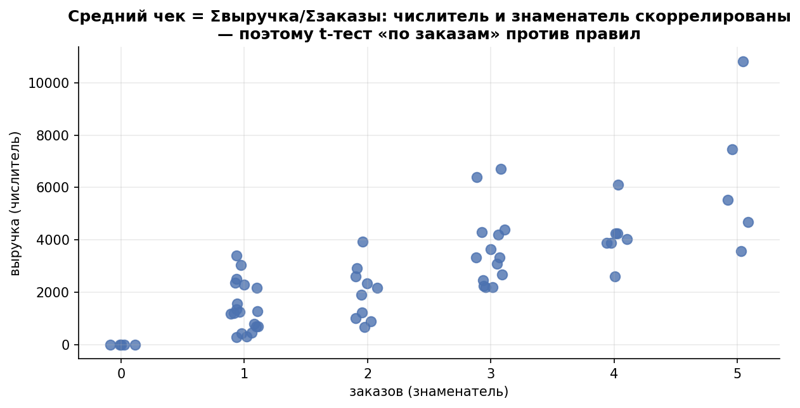

# Урок 3.3 — Ratio-метрики: средний чек, CTR

**Цель урока:** различать ratio сумм и среднее индивидуальных отношений; применить пользовательский bootstrap, дельта-метод и линеаризацию.

**Перед уроком:** [проверьте зависимости темы](../../PREREQUISITES.md); обозначения — в [словаре](../../GLOSSARY.md).

## Зачем это аналитику

«ЕдаДома» тестирует блок «добавь к заказу» (комбо-напитки): гипотеза — растёт средний чек. Средний чек — не среднее по юзерам, а **ratio**: вся выручка делить на все заказы, $\text{ARPU}/\text{заказов на юзера}$. У такой метрики два свойства, которые ломают привычный инструментарий:

1. **Юнит изменения мельче юнита рандомизации** (урок 3.2): чек «живёт» на заказе, рандомизируем юзеров — и заказы одного человека зависимы.
2. **Числитель и знаменатель зависимы**: юзер с большим числом заказов вносит вклад и в сумму выручки, и в счётчик заказов; знаменатель — случайная величина, а не константа.

Наивные обходы тоже не спасают: t-тест по заказам даёт ложные прокрасы (30% вместо 5% в практике 3.2), а «среднее юзерских чеков» — это *другая метрика*, которая может ехать в сторону, противоположную глобальному чеку. Между тем ratio-метрики — это почти все денежные метрики продукта: чек, CTR, выручка на сессию, конверсия в оплату на уровне показов. Этот урок — про то, как их тестировать честно: тремя способами, из которых линеаризация ещё и открывает весь арсенал поюзерных техник урока 3.5 (CUPED).

*Рис. 1. Числитель и знаменатель ratio-метрики скоррелированы — поэтому t-тест «по заказам» против правил.*

## Теория

### 1. Три вида метрик — и почему ratio особый

Из «айсберга» Atlamos: (1) **доли** — бинарный исход на юните (конверсия в заказ); (2) **поюзерные средние** — сумма значений юнита, делённая на число юнитов (выручка на юзера); (3) **ratio** — сумма сумм к сумме счётчиков (средний чек = $\sum_i X_i / \sum_i Y_i$, где $X_i$ — выручка юзера $i$, $Y_i$ — его заказы). Первые два вида — «среднее на юните рандомизации», для них работают t-тесты из М2. Третий — «среднее на *другом* юните», и вот тут стандартные критерии молча ломаются (koch-kir: скидка на доставку не меняет число заказов — поюзерная метрика, t-тест ок; но средний чек — ratio, t-тест уже некорректен).

Формально ratio-метрика — это оценка $R = \mu_X/\mu_Y$, где $\bar X, \bar Y$ — средние числителя и знаменателя **на юзера**: $\hat R = \bar X/\bar Y = \sum X_i/\sum Y_i$. Ключ к анализу — всегда держать числитель и знаменатель на одном юните (юзере).

### 2. Почему наивный t-тест ломается (две поломки)

**Поломка 1: зависимость наблюдений.** Пул всех заказов и сравниваем группы t-тестом — это в точности ошибка урока 3.2: заказы одного юзера коррелируют, SE занижена, уровень A/A уезжает за 15–30%.Atlamos: на A/A p-value неравномерны, растёт ошибка I рода — в продукте раскатываются «механики-пустышки».

**Поломка 2: «среднее средних» — не то же самое, что глобальное ratio.** Кажется, что выход — усреднить юзерские чеки и сравнить средние. Но это другая метрика:

$$\underbrace{\frac{\sum X_i}{\sum Y_i}}_{\text{глобальный чек (взвешен заказами)}} \neq \underbrace{\frac{1}{n}\sum \frac{X_i}{Y_i}}_{\text{среднее юзерских чеков (равный вес юзерам)}}$$

Мини-пример расхождения: юзер А сделал 1 заказ на 1 200 ₽, юзер Б — 5 заказов по 400 ₽. Глобальный чек $= (1\,200+2\,000)/6 = 533$ ₽; среднее юзерских чеков $= (1\,200+400)/2 = 800$ ₽. Теперь тест *удвоил* число заказов у юзера Б (новые — по 400 ₽): глобальный чек падает до $(1\,200+4\,000)/11 = 473$ ₽, а среднее юзерских чеков не меняется вовсе (800 ₽) — метрика «глуха» к частоте. Направления могут разойтись и в противоположные стороны: фича, увеличивающая число мелких заказов, роняет глобальный чек и поднимает среднее юзерских. Разные estimands могут дать противоположные продуктовые выводы; выбирайте целевой вопрос заранее (Симулятор, урок 12: «среднее средних — не сонаправлено с ratio»; Atlamos: «предусреднённое среднее»).

### 3. Способ 1: бутстрап юзерами

Из урока 1.4 бутстрап умеет строить распределение любой статистики. Для ratio единственное правильное применение: **семплировать юзера целиком** — пару $(X_i, Y_i)$ неразделимо, — и на каждой итерации пересчитывать $\hat R^* = \sum X_i^*/\sum Y_i^*$ по обеим группам (Atlamos, «Бутстрап»: для ratio семплировать юзеров целиком с числителем и знаменателем). Распределение $\hat\Delta^* = \hat R_B^* - \hat R_A^*$ (с недавтировкой — рецентрированием на наблюдаемую разность, как в ДЗ Ульянова) даёт p-value и CI.

Кластерный bootstrap удобен для сложной статистики и проверки аналитических приближений. Его точность зависит от числа независимых пользователей, хвостов, редкости событий и устойчивости знаменателя; это не безусловный эталон. Bootstrap можно сочетать со стратификацией и CUPED: ресэмплируют пользователей и воспроизводят согласованный оценщик, включая необходимые стадии обучения/коррекции.

### 4. Способ 2: дельта-метод

Линеаризуем дробь первым порядком Тейлора вокруг математических ожиданий $(\mu_X, \mu_Y)$:

$$\hat R = \frac{\bar X}{\bar Y} \approx R + \underbrace{\frac{1}{\mu_Y}(\bar X - \mu_X) - \frac{\mu_X}{\mu_Y^2}(\bar Y - \mu_Y)}_{\text{линейная часть}}$$

Дисперсия линейной комбинации — комбинация дисперсий и ковариаций:

$$\boxed{\ \mathrm{Var}(\hat R) \approx \frac{1}{n}\cdot\frac{\sigma_X^2 + R^2\sigma_Y^2 - 2R\,\sigma_{XY}}{\bar Y^2}\ }$$

Здесь все моменты оценены на пользователях. Для разности ratio дисперсии независимых рук складываются, затем строится z-интервал. Это асимптотический delta-method: проверяем достаточное число событий, положительный устойчивый знаменатель и влияние тяжёлых хвостов. Универсального порога «n>100 достаточно» нет.

Считаем на пальцах масштаб: $\sigma_X = 1\,900$ ₽, $\sigma_Y = 1{,}4$ заказа, $\mathrm{cov} = 1\,450$, $R = 880$ ₽, $\bar Y = 2{,}5$, $n = 900$:

$$\mathrm{Var}(\hat R) = \frac{1\,900^2 + 880^2\cdot1{,}4^2 - 2\cdot880\cdot1\;450}{900\cdot2{,}5^2} = \frac{2\,574\,864}{5\,625} \approx 458 \quad\Rightarrow\quad SE(\hat R) \approx 21{,}4\ \text{₽}$$

(числитель дроби: $3\,610\,000 + 1\,516\,864 - 2\,552\,000 = 2\,574\,864$; знаменатель: $n\bar Y^2 = 900\cdot6{,}25 = 5\,625$). Заметьте роль ковариации: положительная корреляция числителя и знаменателя *вычитает* дисперсию — усреднение по большему числу заказов стабилизирует дробь.

### 5. Способ 3: линеаризация — дельта-метод, развёрнутый в поюзерный сигнал

Разглядим в формуле дельта-метода линейную комбинацию… на уровне юзера. Определим **сигнал юзера**:

$$L_i = X_i - R_{\text{контр}}\cdot Y_i$$

где $R_{\text{контр}}$ — глобальное ratio в контрольной группе. Тогда:

- в контроле $\bar L = \bar X - R_{\text{контр}}\bar Y = 0$ по построению (свойство «калибровки»);
- При фиксированном общем R дисперсия **одного** сигнала Var(L)=Var(X)+R²Var(Y)−2R·Cov(X,Y). Для разности средних независимых рук SE²=s²_L,A/n_A+s²_L,B/n_B. Если R оценён из текущего контроля, эта формула используется как асимптотическое приближение; при заметном изменении знаменателя следует применять delta-method непосредственно к R_B−R_A.
- При положительном meanY_B выполняется **точное тождество** meanL_B−meanL_A=meanY_B·(R_B−R_A). Поэтому знак сохраняется точно и точечная оценка ratio-эффекта равна meanL_B/meanY_B; неопределённость оцениваем отдельно. t-тест по L и delta-test близки в стандартном локальном сценарии, но не тождественны для любых знаменателей.

Что это покупает (главное преимущество по Atlamos): сигнал стал **поюзерным**, а значит к нему применимы все техники снижения дисперсии — CUPED (3.5), стратификация, пост-стратификация, вейв-анализ, бакетирование. Связка «линеаризация + CUPED» — стандарт промышленных платформ (в Купере внедрена в прод); для потока из сотен метрик это единственный масштабируемый путь: бутстрап на сотни метрик не напасёшься.

В этом рецепте R берётся из текущего контроля, поэтому meanL_A=0. Другие заранее обоснованные коэффициенты возможны, но тогда нужно заново определить оценщик и его SE; потеря нулевого среднего сама по себе не доказывает смещение. Пользователи без заказов остаются в выборке. Для выручки/числа заказов Y=0 означает X=0; для произвольных ratio это не обязательное свойство.

### 6. Какой способ когда

| Способ | Уровень A/A | Мощность | Цена | Когда брать |
|---|---|---|---|---|
| наивный t по заказам | **сломан** (15–30%) | «высокая» фиктивно | дёшев | никогда |
| среднее юзерских чеков | держит | — | дёшев | только если бизнесу нужна именно поюзерная метрика |
| бутстрап юзерами | держит | ≈ дельта | медленный | эталон/проверка, разовые сложные метрики |
| дельта-метод | держит | базовая | O(данных) | стандарт для point-in-time анализа |
| линеаризация | держит | базовая + CUPED-буст | дёшев, поюзерный сигнал | платформенный стандарт, мониторинг, CUPED |

Согласование способов — часть валидации: при устойчивом знаменателе и достаточном числе событий p-value трёх корректных способов близки; если бутстрап и дельта-метод расходятся вдвое — редкие события или малая выборка, и это флаг «осторожно» (koch-kir: проблема редких событий на малых n; у Ульянова для этого случая — пуассоновский бутстрап).

## Разбор на данных

Мини-тест «ЕдаДома»: блок «добавь к заказу», 4 юзера в контролле и 4 в тесте (в реальности — тысячи; тут — чтобы увидеть каждое число). $(X_i$ — выручка за неделю, $Y_i$ — заказы$)$:

| | Юзер 1 | Юзер 2 | Юзер 3 | Юзер 4 | Σ |
|---|---|---|---|---|---|
| Контроль $(X, Y)$ | (2 400, 3) | (900, 1) | (1 500, 2) | (3 000, 5) | (7 800, 11) |
| Тест $(X, Y)$ | (2 200, 2) | (1 000, 1) | (1 700, 2) | (3 300, 4) | (8 200, 9) |

**Глобальные чеки:** контроль $R_A = 7\,800/11 = 709{,}1$ ₽; тест $R_B = 8\,200/9 = 911{,}1$ ₽; разность $+202$ ₽ (+28,5%).

**Средние юзерских чеков** (для контраста): контроль $(800+900+750+600)/4 = 762{,}5$; тест $(1\,100+1\,000+850+825)/4 = 943{,}8$ — близко, но это другая метрика (и на 4+4 юзерах разность $\approx +181$ ₽).

**Линеаризация руками.** $R_{\text{контр}} = 709{,}1$; сигналы $L_i = X_i - 709{,}1\,Y_i$:

| | Юзер 1 | Юзер 2 | Юзер 3 | Юзер 4 | среднее |
|---|---|---|---|---|---|
| Контроль $L$ | +272,7 | +190,9 | +81,8 | −545,5 | **0,0** ✓ |
| Тест $L$ | +781,8 | +290,9 | +281,8 | +463,6 | **+454,5** |

Средний сигнал контроля равен нулю, теста —454,5₽; Welch по сигналам даёт |t|≈2,07. Эффект среднего чека **точно** равен 454,5/2,25=202,02₽, потому что делить нужно на среднее число заказов в тесте. Деление на контрольные 2,75 даёт 165,29₽ и является отдельным приближением при стабильном знаменателе; расхождение здесь нельзя списывать только на большой процент эффекта.

## Подводные камни

1. **t-тест по заказам/кликам/показам.** Делают: «средний чек — это среднее чеков, сравню средние». Грозит: зависимость заказов юзера → α 15–30% на A/A (урок 3.2, практика 3.3) — раскатка пустышек. Правильно: один из трёх способов; наивный — никогда.
2. **«Среднее средних» вместо глобального ratio.** Делают: усреднили юзерские чеки и успокоились. Грозит: метрика не сонаправлена глобальной (мини-пример раздела 2) — фича «подняла чек» по отчёту и уронила выручку. Правильно: знать, что бизнес имеет в виду под «средним чеком» — глобальное ratio; поюзерное среднее честно называть поюзерным.
3. **Смешение определения сигнала и оценщика эффекта.** Контрольный коэффициент обеспечивает meanL_A=0; при другой точке линеаризации нельзя автоматически использовать те же формулы. Для effect estimate и CI на исходном ratio удобно считать R_B−R_A и delta variance отдельно.
4. **Дельта-метод «по заказам», а не по юзерам.** Делают: подставляют в формулу дисперсии чека и числа заказов как независимые агрегаты. Грозит: ковариация $\sigma_{XY}$ оценена на неправильном юните — вся $\mathrm{Var}(\hat R)$ мимо. Правильно: $X_i, Y_i$ — пара на юзере, ковариация на юзерном уровне.
5. **Редкий знаменатель.** При малом числе событий ratio и bootstrap нестабильны независимо от числа пользователей. Проверить нулевые знаменатели, распределение user-level сумм и покрытие интервалов в реалистичной симуляции; собрать больше событий либо выбрать другой заранее определённый estimand. Poisson bootstrap сам по себе не создаёт недостающую информацию.
6. **Интерпретация «чек вырос» без взгляда на числитель и знаменатель.** Делают: $R$ значимо вырос — рапортуют «покупают дороже». Грозит: $R = X/Y$ растёт и при падении $Y$ (меньше, но дороже заказов; каннибализация частоты). Правильно: рядом с ratio всегда смотреть на числитель и знаменатель по отдельности (плюс guardrail-метрики, М4.1).
7. **Бутстрап по заказам вместо бутстрапа юзерами.** Делают: ресемплируют заказы внутри групп «чтобы побольше итераций». Грозит: тот же самый провал независимости, но ещё и в бутстрапе. Правильно: единица ресэмплирования = юнит рандомизации, пара $(X_i, Y_i)$ целиком.

## Практика

Файл [practice_3_3.py](practice/practice_3_3.py) (percent-формат, numpy/scipy/matplotlib, seed зафиксирован). Датасет: 2 000 юзеров на группу; заказы $m_i \sim 1+\text{Poisson}(2)$; чеки логнормальные с юзер-эффектом (наследие практики 3.2); $X_i$ — выручка, $Y_i$ — заказы. Четыре блока:

1. **Демо**: один A/A и один A/B (+8% к чеку) — глобальный чек, среднее юзерских чеков и p-value всех четырёх способов на одних данных.
2. **A/A: уровень** — 500 прогонов четырёх способов, доля p<0,05 ([practice_3_3_aa_level.png](images/practice_3_3_aa_level.png)).
3. **A/B: мощность** — 500 прогонов с эффектом +8% к чеку ([practice_3_3_ab_power.png](images/practice_3_3_ab_power.png)).
4. **Согласие**: корреляция p-value дельта-метода, линеаризации и бутстрапа на A/A ([practice_3_3_agreement.png](images/practice_3_3_agreement.png)).

Что должны увидеть (числа реального запуска):

- блок 1: на A/A наивный p-value либеральнее честных (0,70 против 0,79–0,80); на A/B все четыре «значимы», но наивный — по сломанной причине; глобальный чек и среднее юзерских чеков — заметно разные числа;
- блок 2: уровень A/A — наивный = **20,6%**, бутстрап = **4,6%**, дельта-метод = **5,0%**, линеаризация = **4,8%**;
- блок 3: мощность при +8% к чеку: бутстрап 83,0%, дельта-метод 83,4%, линеаризация 83,2% — тройка согласована; наивный 96,0% — «мощность» на сломанном уровне (20,6% ложных срабатываний), ей нельзя доверять;
- блок 4: p-value дельта-метода и линеаризации совпадают практически точно (r = 1,000, медиана отношений 1,000) — в этом генераторе знаменатель не меняется и приближения близки; бутстрап коррелирует с ними на r = 0,998.

## Домашнее задание

**Задача 1.** Юзер А: 1 заказ на 1 500 ₽; юзер Б: 4 заказа по 500 ₽. Посчитайте глобальный чек и среднее юзерских чеков. Тест увеличил число заказов юзера Б вдвое (новые — по 500 ₽): что стало с каждой метрикой?

Ответ

До: глобальный $= (1\,500+2\,000)/5 = 700$ ₽; среднее юзерских $= (1\,500+500)/2 = 1\,000$ ₽. После: глобальный $= (1\,500+4\,000)/9 = 611$ ₽ (упал на 13%), среднее юзерских — по-прежнему 1 000 ₽ (не заметило ничего). Глобальная метрика видит и размер, и частоту; поюзерная — только размер.

**Задача 2.** Контроль: 900 юзеров, $\bar X = 2\,200$ ₽, $\bar Y = 2{,}5$ заказа, $\sigma_X = 1\;900$, $\sigma_Y = 1{,}4$, $\mathrm{cov}(X,Y) = 1\;450$. Чему равен глобальный чек и его SE? Какой эффект на чеке тест сумеет поймать с мощностью 80% ($\alpha=5\%$, тест и контроль равны)?

Ответ

$R = 2\,200/2{,}5 = 880$ ₽. $\mathrm{Var}(\hat R) = (1\,900^2 + 880^2\cdot1{,}4^2 - 2\cdot880\cdot1\;450)/(900\cdot2{,}5^2) = 2\,574\,864/5\,625 \approx 458$ → $SE \approx 21{,}4$ ₽. SE разности двух групп $= 21{,}4\sqrt2 \approx 30{,}2$; MDE $= 2{,}8\cdot30{,}2 \approx 85$ ₽ (~9,6% чека). Заметьте: без ковариации в формуле SE был бы $\sqrt{(3\,610\,000+1\,516\,864)/5\,625} \approx 30{,}2$ ₽ на группу — зависимость числителя и знаменателя снизила SE в 1,4 раза.

**Задача 3.** $R_{\text{контр}} = 709{,}1$ ₽. Юзеры теста: $(X, Y)$ = (2 200, 2), (1 000, 1), (1 700, 2), (3 300, 4). Посчитайте $L_i$, средний сигнал и пересчёт в эффект на чек. Почему средний сигнал контроля обязан быть нулём?

Ответ

$L$ в тесте:781,8;290,9;281,8;463,6, среднее454,5. Среднее Y_B=9/4=2,25, поэтому Δ_R=454,5/2,25=202,02₽ точно. В контроле meanL_A=meanX_A−R_A·meanY_A=0 по определению R_A.

**Задача 4.** У вас 200 ratio-метрик и CUPED на выручке. Почему линеаризация, а не бутстрап? Что теряете, выбирая дельта-метод вместо линеаризации?

Ответ

Bootstrap требует B пересчётов оценщика и обычно дороже аналитического delta-method. Линеаризованные сигналы удобно использовать как covariates/исходы для variance reduction. Это инженерное преимущество, а не запрет на CUPED или стратификацию внутри bootstrap. Выбор зависит от точности, стоимости и сложности оценщика.

**Задача 5.** На A/A-тесте дельта-метод дал p = 0,04, бутстрап — p = 0,11. Что дальше?

Ответ

Сначала проверить одинаковый estimand и единицу ресэмплирования, число событий, стабильность знаменателя и Monte Carlo error bootstrap. Отношение двух маленьких p-value само по себе не универсальная диагностика. При систематическом расхождении проверять фактический уровень и покрытие каждого метода на реалистичных A/A и A/B.

## Шпаргалка

1. Ratio-метрика: $R = \sum X_i/\sum Y_i = \bar X/\bar Y$ — числитель и знаменатель на **юзере**, парой; юнит изменения мельче юнита рандомизации.
2. Наивный t по заказам/кликам некорректен дважды: зависимость наблюдений (3.2) + случайный зависимый знаменатель; уровень A/A 15–30% вместо 5%.
3. Среднее юзерских средних ≠ глобальное ratio: равные веса юзерам против весов по заказам; может расходиться по направлению — решать можно только по той метрике, которую имеете в виду.
4. Bootstrap пересэмплирует пользователя с парой (X,Y); при редких событиях и нестабильном знаменателе может плохо аппроксимировать распределение.
5. Delta-method: Var(R)≈[Var(X)+R²Var(Y)−2R·Cov(X,Y)]/(n·meanY²); применимость определяется распределением и числом событий, не универсальным n>100.
6. L=X−R_A·Y, meanL_A=0; Δ_R=meanL_B/meanY_B точно. Для SE разности ratio учитываются моменты каждой руки; t по L лишь приближение к delta-test.
7. В рецепте R_A берётся из контроля; users с Y=0 остаются. Для чеков X=0 при Y=0; проверять это отдельно для других ratio.
8. Линеаризация — платформенный стандарт: поюзерный сигнал открывает CUPED (3.5), стратификацию, бакеты, мониторинг.
9. Редкие события/малые n: согласие способов — часть валидации; расходятся — осторожно (пуассоновский бутстрап, укрупнение юнита).
10. Итог теста ratio: рядом числитель и знаменатель по отдельности — «чек вырос за счёт меньшего числа заказов» это не победа (guardrails, М4.1).

## Источники

- Atlamos (Павел Мосин), «Линеаризация: зачем и как укрощать ratio-метрики в A/B-тестах» — https://habr.com/ru/companies/kuper/articles/768826/ — сломанный уровень наивного критерия, «предусреднённое среднее», сонаправленность с глобальной метрикой, эквивалентность дельта-методу, открытие CUPED/стратификации (конспект: `materials/web/web-articles.md` §4.1).
- Atlamos, «Бутстрап: швейцарский нож аналитика в A/B-тестах» — https://habr.com/ru/articles/762648/ — для ratio семплировать юзеров целиком; ограничения масштабирования (§4.3).
- koch-kir, «Кластерные эксперименты, ч.1» (16.11.2025) — https://medium.com/@koch-kir — юнит изменения мельче юнита анализа; дельта-метод как метод Уэлча 1949; совпадение дельта-метода и линеаризации при n>100; проблема редких событий (конспект: `materials/web/web-articles.md` §3.1).
- Симулятор АБ-тестов (karpov.courses), урок 12 «Анализ метрик отношения» — пользовательские метрики vs метрики отношения; среднее средних не сонаправлено; бутстрап по пользователям; дельта-метод; линеаризация; урок 13 — пайплайн «ускорение доставки» с линеаризацией — `materials/local/ab-simulator.md`.
- Alex Deng, *Causal Inference and Its Applications in Online Industry*, гл. 11 «Misc Topics» — дельта-метод и асимптотическая нормальность ratio-оценщиков — https://alexdeng.github.io/causal/misc-topics.html (конспект: `materials/web/alexdeng-causal-book.md`).
- shelter_analytics (Влад Шереметьев), серия «Дельта-метод в АБ-тестах», ч. 1–2 (14.09 и 21.09.2025) — https://telegra.ph/Delta-metod-v-AB-testah-CHast-1-09-14 , https://telegra.ph/Delta-metod-v-AB-testah-CHast-2-09-21 — вывод, кейсы, «отказ от бутстрапа в проде» (конспект: `materials/telegram/shelter_analytics-digest.md`).
- Ульянов FUlyankin, yet_another_matstat_course — рукописный конспект `lectures_hand_22&23/lec21_ratio_stratif.pdf` (АБ для метрик отношения: линеаризация и дельта-метод), ДЗ `hw_2023_matstat/hw03_A-B test_results.ipynb` (бутстрап ratio-метрики кликов/сессий с рецентрированием) — `/Users/user/Desktop/курсы/статистика и АБ/yet_another_matstat_course/` (дайджест: `materials/web/fulyankin-github.md`).
