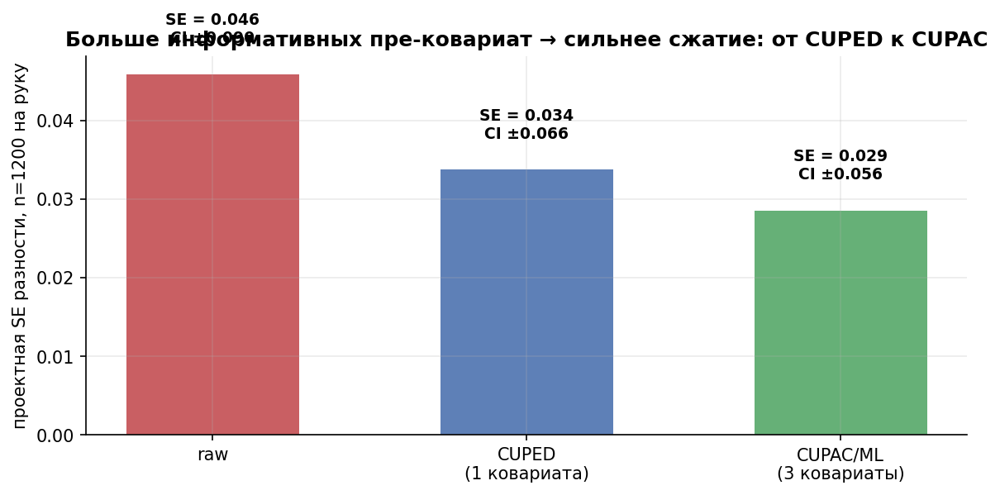
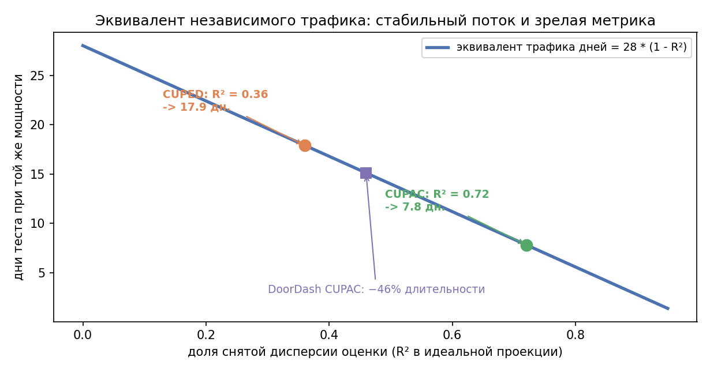
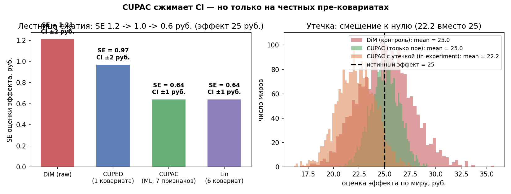

# Урок 3.6 — Продвинутое снижение дисперсии: ML-ковариаты и регрессионная поправка

**Цель урока:** снизить дисперсию с помощью независимого или out-of-fold прогноза, сохранив эффект и корректную неопределённость.

**Перед уроком:** [проверьте зависимости темы](../../PREREQUISITES.md); обозначения — в [словаре](../../GLOSSARY.md).

## Зачем это аналитику

«ЕдаДома» тестирует «умную корзину» (пересборка рекомендаций на главном экране). Метрика — выручка юзера за 2 недели теста. Урок 3.5 дал CUPED по одной ковариате «выручка пре-периода»: корреляция с метрикой $\rho \approx 0{,}6$ → $R^2 \approx 0{,}36$ → SE сжимается всего в $1/\sqrt{1-0{,}36} = 1{,}25$ раза. Эквивалент независимого трафика 28 дней — около 18 при стабильном потоке и зрелой метрике. Неплохо, но обидно: в пре-данных юзера ещё заказы, частота визитов, любимые категории, средний чек — сигнала там на $R^2 \approx 0{,}7$. Забрать его целиком линейный CUPED по одной переменной не может.

Второй вопрос — безопасность. Руководитель DATA-команды справедливо боится: «вы натравите ML на A/B-тест, он что-то напредсказывает, и мы перестанем доверять цифрам». Урок отвечает на этот страх точно: где проходит граница между легальной ковариатой и утечкой, и какая регрессионная поправка при стандартных условиях асимптотически не увеличивает дисперсию относительно классической разности средних.

Третий — стратегический: скорость экспериментов это не «p-value порезвее», а связка методов. У Авито связка CUPED/CUPAC + последовательное тестирование (урок 3.7) ускорила проверку гипотез «в пару дюжин раз» — не потому, что каждый метод волшебный, а потому что выигрыши перемножаются: $0{,}3 \times 0{,}5$ от длительности — это уже почти семикратное ускорение.

## Теория

### 1. От одной ковариаты ко многим: $R^2$ — универсальная валюта

CUPED из 3.5: $Y_{cv} = Y - \theta X$, $\theta = \mathrm{cov}(Y,X)/\mathrm{var}(X)$, дисперсия оценки эффекта умножается на $(1-\rho^2)$. Обобщение на $p$ ковариат — это регрессия: вычти из $Y$ его предсказание $\hat Y = f(X_1,\dots,X_p)$, и дисперсия умножится на

$$\mathrm{Var}(\hat\delta_{adj}) = \mathrm{Var}(\hat\delta_{DiM}) \cdot (1 - R^2),$$

где $R^2$ — предсказательная сила ковариат (доля объяснённой дисперсии метрики). Все следствия из 3.5 пересчитываются автоматически:

- сжатие SE: $1/\sqrt{1-R^2}$ (SE — это $\sigma/\sqrt{n}$, поэтому корень);
- эквивалентный трафик: $1/(1-R^2)$ — Microsoft ExP так и называет это «effective traffic multiplier»: при $R^2 = 0{,}4$ медианный множитель 1,66 (+22% мощности);
- длительность теста: $\text{дни}_{new} = \text{дни}_0 \cdot (1-R^2)$ — перевод n в дни требует новых независимых юнитов, зрелости метрики и согласованного временного окна.

Единственное, что изменилось против 3.5: теперь мы управляем не «какую одну ковариату взять», а «какое $R^2$ набрать». И тут симметрия ломается в приятную сторону: одна ковариата даёт $\rho^2$ одной переменной, а набор — частный $R^2$ всей регрессии, то есть вклады ковариат складываются (с поправкой на их взаимную корреляцию).

*Рис. 1. Больше информативных пре-ковариат → сильнее сжатие: от CUPED (одна ковариата) к CUPAC (ML по многим).*

### 2. CUPAC (DoorDash): ковариата = ML-предсказание метрики

CUPAC = **C**ontrol **U**sing **P**redictions **A**s **C**ovariates (Jeff Li, DoorDash, 2020). Ковариата — не сырой признак, а предсказание метрики $\hat Y = f(X_{pre})$, обученное любой мощной моделью (у DoorDash — градиентный бустинг на сотнях признаков):

$$Y_{adj} = Y - \theta \hat Y, \qquad \theta \approx 1,$$

$\theta$ оценивается по данным эксперимента, как в CUPED (у модели, обученной на $Y$, он получается около 1). Выбор модели — чистая задача ML: максимизируй out-of-sample $R^2$ по метрике.

Почему это легально. Ключевое требование к ковариате — независимость от тритмента (урок 3.5). Предсказание $\hat Y$ — функция только пре-признаков $X_{pre}$, измерённых до рандомизации; тритмент на них повлиять не мог. Поэтому:

- Модель можно обучать на экспериментальных outcome **с cross-fitting**: для каждого пользователя прогноз получают только моделью, которая не видела его Y. Альтернатива — независимая историческая обучающая выборка. Одних pre-features недостаточно: обученные параметры f тоже зависят от данных.
- **нельзя** использовать признаки, собранные во время теста и затронутые тритманом (число сессий в эксперименте, CTR на новом экране...) — это утечка, шаг 4 практики покажет смещение;
- Число фолдов и алгоритм фиксируют заранее; оценивают out-of-fold качество. Итоговый treatment contrast вычисляют regression adjustment с назначением, центрированным прогнозом и взаимодействием, используя robust SE. Прогноз не заменяет причинный оценщик.

Цифры DoorDash: −46% длительности тестов на основном трафике; в switchback-экспериментах логистики (Tang et al.) — −25% и больше.

### 3. Поправка на бустинге: Яндекс BDT

Poyarkov, Drutsa, Khalturin и др. (Яндекс + Microsoft, KDD 2016) сделали роверно тот же ход раньше и строже: заменили линейную regression adjustment на **бустинг решающих деревьев** (регрессия $Y$ на пре-ковариаты) и проверили на **161 реальном онлайн-эксперименте** (редкость: не симуляции, а прод). Итог: нелинейная поправка дополнительно снижает дисперсию там, где линейная почти не помогает — ловит пороги, взаимодействия, «тяжёлых» юзеров с другим поведением. Это прямой предок CUPAC и ML-RATE: «предскажи $Y$ по пре-данным чем угодно мощным — и вычти».

### 4. Lin (2013): асимптотические гарантии регрессионной поправки

История: Freedman (2008) раскритиковал OLS-поправку в рандомизированных экспериментах — при неверной спецификации она может и смещать оценку, и **ухудшать** её точность, а классические SE врут. Lin («Agnostic notes…», AoAS 2013) ответил конструкцией:

$$Y_i = \alpha + \tau T_i + (X_i - \bar X)\beta + T_i \cdot (X_i - \bar X)\gamma + \varepsilon_i,$$

то есть: (1) ковариаты **центрируются**, (2) включаются **полные взаимодействия** $T \times X$, (3) SE — **гетероскедастичность-робастные** (HC). Три гарантии:

1. $\hat\tau$ состоятелен для ATE **при любой спецификации** $X$ — хоть полностью неверной;
2. асимптотическая дисперсия $\hat\tau$ **никогда не больше**, чем у разности средних (разница — положительно полуопределённая матрица): «поправка ничего не стоит»;
3. Без взаимодействий теряется гарантия неухудшения асимптотической точности, но не сама состоятельность additive OLS в рандомизированном эксперименте при стандартных условиях.

Связь с продом прямая: Microsoft ExP в «Deep Dive into Variance Reduction» (2022) пишет, что CUPED с **раздельными коэффициентами по рукам** = ANCOVA-2 = оценщик Lin — и именно в таком виде зашит в платформу как «правильный CUPED». ByteDance (arXiv 2509.13944) пришла к той же рекомендации независимо. Разбор «Точки над CUPED» (abba_testing) показывает на симуляциях, откуда берётся разница сценариев оценки $\theta$: pooled-коэффициент (Booking, Walmart) против раздельных по рукам (Netflix, Airbnb, Meta, Microsoft) — вторые и есть Lin-мир со страховкой от гетерогенных эффектов.

Практический вывод: OOF-прогноз вместе с центрированием, взаимодействиями и робастными SE — обоснованная конструкция при условиях cross-fitting/регрессии. Теорема Lin для фиксированного набора ковариат не разрешает произвольное обучение на собственных outcomes; ML-вариант требует своих условий. Конечная выборка может проиграть DiM.

### 5. Один каркас: CUPED/CUPAC/ML-RATE как doubly robust (Jeunen)

Jeunen (arXiv 2603.08370) показывает: разность средних — это IPS-оценка с оптимальным контрольным вариатом, а CUPED, CUPAC и ML-RATE структурно эквивалентны **doubly robust** регрессии: оценка соединяет предсказание модели $\mu(X)$ и известный propensity ($1/2$ у рандомизации). В рандомизированном A/B propensity известен точно, поэтому корректный doubly robust оценщик с известным propensity и соответствующими условиями обучения сохраняет состоятельность; произвольное in-sample вычитание прогноза этой гарантии не имеет (та же мораль, что у Lin, только из каузальной теории). Это мост к М6: всё семейство «предскажи и вычти» — одна математика с разными $f$.

### 6. Чувствительность = мощность × распределение эффектов (Денг, гл. 10)

Что значит «метрика чувствительная»? Не «у неё маленькая дисперсия», а «она **детектит эффекты, которые на ней реально случаются**»:

$$\text{чувствительность} \sim \int \text{power}(\delta; n, \sigma)\, dF(\delta),$$

где $F$ — распределение истинных эффектов на этой метрике (из истории экспериментов). Два следствия:

- снижение $\sigma$ (CUPED/CUPAC) сдвигает всю кривую мощности влево — детектится больше эффектов из того же $F(\delta)$; это дешевле, чем наращивать $n$ или повышать допустимый α (что увеличивает риск ложных находок);
- сравнивать метрики только по дисперсии нельзя: метрика с меньшей $\sigma$, но с микроскопическими типичными эффектами может проигрывать «шумной» метрике, на которой эффекты большие.

И еще одно предупреждение от ExP: выигрыш VR крайне неравномерен — на одной поверхности >68% метрик почти без выигрыша, на другой >55% метрик дают >1,2×. Считать надо **на конкретную метрику**, а не «в среднем по платформе».

### 7. Когда CUPED/CUPAC НЕ помогает

- **Нет пре-данных.** Новые юзеры, iOS-атрибутация, быстрый рост на новые рынки — истории просто нет. Выходы: ковариаты из **in-experiment** данных с поправкой $\tau(X)$ (Deng, KDD 2023: вычитай из ковариаты оценку её собственного «эффекта тритмана»), гибрид pre + in-experiment (Etsy, arXiv 2410.09027), взвешивание по прогнозу **дисперсии** юнита (Meta: −17% дисперсии, вместе с CUPED ≈ −50%).
- **Слабая корреляция.** $R^2 < 0{,}1$ — выигрыш мизерный ($1/\sqrt{0{,}9} = 1{,}05$): не тратим усилия.
- **Нестационарность и сломанный логинг.** Ковариата из «другого мира» (смена схемы событий, сезонность) теряет корреляцию — проверять на A/A.
- **Переобученная модель.** In-sample $R^2$ врёт; реальный выигрыш оценивать только out-of-sample.
- **Ratio.** Наивная раздельная коррекция числителя и знаменателя без совместного SE некорректна. Можно использовать линеаризованные сигналы либо совместный control-variate/delta оценщик с ковариацией.
- **Кластеризация.** VR применяется на юните рандомизации (урок 3.2), иначе фиктивный выигрыш.

*Рис. 2. Дни теста × (1−R²): доля снятой дисперсии переводится в эквивалент трафика при стабильном потоке и зрелой метрике (из практики).*

### 8. Кейс Авито: связка методов, «в пару дюжин раз быстрее»

Канал Trisigma (команда экспериментов Авито) описывает эволюцию так (перевод поста Нишат Хана «Три достижения, изменившие A/B-тестирование»): (1) запрет бездумного подглядывания → (2) последовательное тестирование → (3) CUPED. Их кейс: связка CUPED/CUPAC с последовательным тестированием ускорила проверку гипотез **в пару дюжин раз**. Математика перемножения: снизил длительность вдвое через CUPAC, ещё вдвое через правильный юнит и линеаризацию, поймал крупные эффекты за дни через sequential — и скорость проверки выросла на порядок, без роста трафика. Именно этому («быстрее и не соврать») и посвящён финиш М3: уроки 3.6 + 3.7.

## Разбор на данных

Из практики [practice_3_6.py](practice/practice_3_6.py) (n = 10 000 на руку, истинный эффект +25 руб. выручки, ковариаты: выручка/заказы/активность пре-периода + нелинейные признаки):

| оценщик | оценка, руб. | SE | CI 95% | сжатие SE |
|---|---|---|---|---|
| DiM (raw) | 26,22 | 1,21 | [23,8; 28,6] | — |
| CUPED (1 ковариата, $R^2 = 0{,}36$) | 25,14 | 0,97 | [23,2; 27,0] | ×1,25 |
| CUPAC (7 признаков, $R^2 = 0{,}72$) | 24,55 | 0,64 | [23,3; 25,8] | ×1,89 |
| Lin (те же ковариаты + $T{\times}X$, HC1) | 24,54 | 0,64 | [23,3; 25,8] | ×1,89 |

Салфеточная проверка: $1/\sqrt{1-0{,}36} = 1{,}25$ — CUPED сжал ровно на теорию; CUPAC добавил ещё ×1,51 за счёт доп. ковариат, нелинейности ($x_1^2$, $x_1 x_2$) и порогового члена «тяжёлые юзеры». Пересчёт в длительность: 28 дней $\times (1-0{,}36) = 18$ дней с CUPED, $\times (1-0{,}72) = 8$ дней с CUPAC.

Lin на шумовых ковариатах в этом прогоне даёт близкую к DiM стандартную ошибку. Один прогон иллюстрирует поведение, но не доказывает теорему. При конечном n добавление бесполезных ковариат может увеличить дисперсию; гарантии Lin асимптотические.

Главная ошибка (2000 миров, n = 2000 на руку): в CUPAC добавили фичу «активность в первые дни теста», затронутую тритманом:

| оценщик | средняя оценка | смещение | покрытие 95% ДИ |
|---|---|---|---|
| DiM (контроль) | 25,04 | +0,04 | 96,0% |
| CUPAC (только пре-признаки) | 25,03 | +0,03 | 95,6% |
| CUPAC с утечкой (in-experiment фича) | 22,25 | **−2,75** | **68,9%** |

Утечка съела 11% эффекта и треть покрытия ДИ, и это **не шум**: с ростом $n$ оценка сходится не к 25, а к 22,2. A/A-тест такую ковариату не поймает (в A/A нет эффекта, который можно съесть) — ловит только дизайн-ревью признаков и A/B с известным эффектом.

## Подводные камни

1. **Утечка через in-experiment фичи.** Делают: «добавим в CUPAC всё, что есть, включая поведение в тесте». Грозит: ковариата коррелирует с тритманом, «съедает» эффект, оценка смещается к нулю, ДИ врёт (68% вместо 95%). Правильно: только пре-признаки; для in-experiment ковариат — поправка $\tau(X)$ (Deng KDD'23); на каждый новый признак — вопрос «мог ли тритмент на него повлиять?».
2. **Оценивать выигрыш по in-sample $R^2$.** Делают: обучили модель на эксперименте, увидели $R^2 = 0{,}9$, пообещали «тесты в 10 раз быстрее». Грозит: переобучение, реальное сжатие сильно меньше. Правильно: out-of-sample $R^2$/cross-fitting, финальная проверка — A/A и эмпирическая SE по мирам.
3. **Наивная регрессионная поправка без центрирования и взаимодействий.** Делают: `Y ~ T + X` классическим OLS. Грозит: кейс Freedman — при гетерогенных эффектах и несбалансированных ковариатах можно и сместить, и ухудшить точность. Правильно: Lin — центрирование, $T \times X$, робастные SE.
4. **Пропуски пре-данных.** Импутация средним/нулём с missing indicator сохраняет целевую популяцию. Ограничение заранее определённым сегментом с историей меняет estimand и должно быть названо в отчёте; фильтрация по поведению после treatment может нарушить сопоставимость.
5. **Обещать выигрыш «в среднем по платформе».** Грозит: на половине поверхностей VR почти не даёт (ExP: >68% метрик без выигрыша на одной из поверхностей). Правильно: считать на каждую метрику по её $R^2$, публиковать «effective traffic multiplier» метрики.
6. **Путать снижение дисперсии с лечением хвостов.** Грозит: киты остаются в остатках, SE ковариатной поправки считается от тяжёлого хвоста. Правильно: VR и винзоризация/лог (урок 3.4) решают разные задачи и хорошо сочетаются.
7. **CUPAC по ratio-метрике без линеаризации.** Грозит: поправка на числитель и знаменатель по отдельности не переносится на отношение. Правильно: линеаризация из 3.3 → VR на линеаризованной метрике (рецепт ShareChat).

## Практика

Файл: [practice_3_6.py](practice/practice_3_6.py) (percent-формат, numpy/scipy/matplotlib/pandas, без sklearn — роль «ML» играет `numpy.linalg.lstsq` по 7 признакам, seed зафиксирован). Что делает:

1. **Синтетика** «ЕдаДома»: n = 20 000, три пре-ковариаты + нелинейности + пороговый эффект «тяжёлых» юзеров.
2. **Лестница оценщиков**: DiM → CUPED (1 ковариата, $\theta$ по пулу) → CUPAC (предсказание по 7 признакам): SE 1,21 → 0,97 → 0,64; CI, $R^2$, пересчёт в экономию дней.
3. **Lin-оценка**: центрирование + взаимодействия + HC1-робастные SE; проверка «do no harm» на шумовых ковариатах (SE = 1,21 = DiM).
4. **Симуляция утечки**: 2000 миров с in-experiment фичей — смещение −2,75 руб., покрытие 68% против 95–96%.
5. **График экономии дней** от $R^2$ с точками CUPED/CUPAC и ориентиром DoorDash (−46%).

Графики: [practice_3_6_variance_reduction.png](images/practice_3_6_variance_reduction.png) (SE-лестница + гистограммы смещения), [practice_3_6_days_saving.png](images/practice_3_6_days_saving.png) (дни от $R^2$).

*Рис. 3. Лестница DiM → CUPED → CUPAC и цена утечки: ковариата из окна теста смещает оценку (из практики).*

## Домашнее задание

1. Пре-метрика коррелирует с метрикой теста на $\rho = 0{,}6$. Во сколько раз CUPED сожмёт SE, сколько «эквивалентного трафика» появится и что станет с длительностью теста?

Ответ

$R^2 = \rho^2 = 0{,}36$. SE сжимается в $1/\sqrt{1-0{,}36} = 1{,}25$ раза; эквивалентный трафик $1/(1-0{,}36) = 1{,}56$ (как будто юзеров стало на 56% больше); длительность $\times (1-0{,}36) = 0{,}64$ — эквивалент трафика 28 дней превращается в 18 при стабильном наборе независимых пользователей; календарные циклы и дозревание проверяют отдельно.

2. Почему CUPAC-модель можно обучать на данных самого эксперимента (включая таргет $Y$), но нельзя добавлять признаки, собранные во время теста?

Ответ

Pre-features независимы от назначения, но обученная на собственном Y функция f наследует зависимость от T через Y. Запоминающая модель даёт prediction_i=Y_i и остатки 0 — эффект полностью теряется. Поэтому использовать чужие фолды либо независимую историю и корректный treatment estimator. Cross-fitting не исправляет feature W, непосредственно изменённую treatment: такой признак требует отдельного метода и причинного обоснования.

3. Перечислите три ингредиента оценщика Lin и три гарантии, которые они дают. Что из этого пропадает в наивном `Y ~ T + X`?

Ответ

Ингредиенты Lin: центрирование, T×X, robust SE. При стандартных условиях рандомизации, фиксированном числе ковариат и необходимых моментах Lin состоятелен и не ухудшает **асимптотическую** дисперсию относительно DiM. Additive OLS без interactions также состоятелен при этих условиях, но способен ухудшить точность; классические homoskedastic SE могут быть некорректны. Гарантия не означает «в любой конечной выборке SE обязательно меньше».

4. В вашем тесте 30% юзеров — новые, без пре-истории. Опишите три стратегии работы с ними и их риски.

Ответ

(а) Оставить всех, применить общую импутацию и missing-indicator: это сохраняет целевую популяцию, но не обещает одинаковый выигрыш для новичков. (б) Заранее ограничить анализ наличием пре-истории допустимо, если она не затронута воздействием; вывод тогда только о пользователях с историей. (в) Признаки периода теста требуют отдельного доказательства инвариантности/корректного оценщика; cross-fitting посттритментную утечку не лечит.

5. Метрика A имеет вдвое меньшую дисперсию, чем метрика B, но история тестов показывает: на A истинные эффекты в среднем вдвое мельче. Какая метрика чувствительнее и почему это не «вопрос про σ»?

Ответ

Если Var(A)=Var(B)/2, то σ_A=σ_B/√2. При δ_A=δ_B/2 стандартизованный эффект δ_A/σ_A=(δ_B/σ_B)/√2: при том же дизайне A менее чувствительна. Равенство получилось бы, если бы вдвое уменьшились и SD, и эффект. Сравнивать нужно δ/σ и распределение типичных эффектов, а не одну дисперсию.

## Шпаргалка

1. Многоковариатный CUPED: $\mathrm{Var} \times (1-R^2)$; SE × $\sqrt{1-R^2}$; эквивалентный трафик $1/(1-R^2)$; эквивалент трафика × $(1-R^2)$.
2. CUPAC (DoorDash): ковариата = ML-предсказание $\hat Y$ по пре-признакам; модель любая, цель — out-of-sample $R^2$; обучать на эксперименте с cross-fitting либо на независимой истории; признаки не затронуты treatment. Результат: −46% длительности.
3. Яндекс BDT (KDD'16): бустинг вместо линейной поправки, 161 реальный эксперимент, ловит нелинейности и «разное поведение тяжёлых юзеров».
4. Lin (2013): центрирование + взаимодействия $T{\times}X$ + HC-SE ⇒ состоятельность при стандартных условиях и асимптотическая дисперсия ≤ DiM («нельзя ухудшить»); ExP/ByteDance: раздельные коэффициенты по рукам = «правильный прод-CUPED».
5. Jeunen: CUPED/CUPAC/ML-RATE — одно семейство doubly robust оценок; в рандомизированном тесте при корректном cross-fitting/оценщике плохой прогноз не нарушает асимптотическую состоятельность.
6. Чувствительность метрики = мощность × распределение истинных эффектов; VR дешевле, чем трафик; сравнивать метрики по паре (σ, F(δ)), а не по σ.
7. Когда НЕ помогает: нет пре-данных (новые юзеры → in-experiment ковариаты с $\tau(X)$, гибрид Etsy, variance-weighting Meta), слабое $R^2 < 0{,}1$, нестационарность/сломанный логинг, переобучение.
8. Главный грех — утечка: фича, затронутая тритманом, смещает оценку к нулю (покрытие ДИ падает с 95% до ~68%); A/A её не ловит, ловит дизайн-ревью признаков.
9. Ratio-метрики: сначала линеаризация (3.3), потом CUPAC (рецепт ShareChat: GBDT-контрольные вариаты, −30% данных).
10. Кейс Авито: связка «CUPED/CUPAC + sequential + правильный юнит» — ускорение проверки гипотез в пару дюжин раз; выигрыши методов перемножаются.

## Источники

- Guo et al., [Machine Learning for Variance Reduction in Online Experiments (MLRATE)](https://arxiv.org/abs/2106.07263): cross-fitting и регрессионная поправка для out-of-fold прогнозов.

- Deng, Xu, Kohavi, Walker. «Improving the Sensitivity of Online Controlled Experiments by Utilizing Pre-Experiment Data» (CUPED, WSDM 2013) — `materials/web/research-sensitivity.md` §1.
- Microsoft ExP. «Deep Dive Into Variance Reduction» (2022) — формула $(1-R^2)$, «effective traffic multiplier», CUPED с раздельными коэффициентами = Lin — там же §2.
- Li (DoorDash). «CUPAC: Control Using Predictions as Covariates» (2020) — там же §6; Tang et al., CUPAC в switchback — §7-ссылка.
- Poyarkov et al. «Boosted Decision Tree Regression Adjustment…» (Яндекс/Bing, KDD 2016) — там же §5.
- Lin. «Agnostic Notes on Regression Adjustments to Experimental Data» (AoAS 2013) — там же §25 и раздел «CUPED–ANCOVA–Lin».
- Jeunen. «Unifying On- and Off-Policy Variance Reduction» (arXiv 2603.08370) — там же §26; `materials/web/research-arxiv.md`.
- Deng. «Causal Inference and Its Applications…», гл. 10 «Improving Metric Sensitivity» (чувствительность = мощность × эффекты) и KDD'23 «Variance Reduction Using In-Experiment Data» (τ(X)-поправка) — `materials/web/alexdeng-causal-book.md`, `materials/web/research-sensitivity.md` §3.
- Etsy (Lin & Crespo, arXiv 2410.09027), Meta variance-weighted (Liou & Taylor), ShareChat ratio-VR (arXiv 2401.04062), LLM-ковариаты (arXiv 2606.08853) — `materials/web/research-sensitivity.md` §7–16.
- Larsen et al. «Statistical Challenges in Online Controlled Experiments» (arXiv 2212.11366), раздел 2 — `materials/web/research-sensitivity.md` «Обзоры».
- Trisigma (Avito): CUPED-серия, «Типичные вопросы про CUPED», кейс «ускорение проверки гипотез в пару дюжин раз», перевод «Три достижения» (peeking → sequential → CUPED) — `materials/telegram/trisigma_avito-digest.md`.
- abba_testing, «Точки над CUPED» (сценарии θ: pooled vs по рукам, Booking/Walmart против Netflix/Airbnb/Meta/Microsoft) — `materials/telegram/abba_testing-digest.md`.
