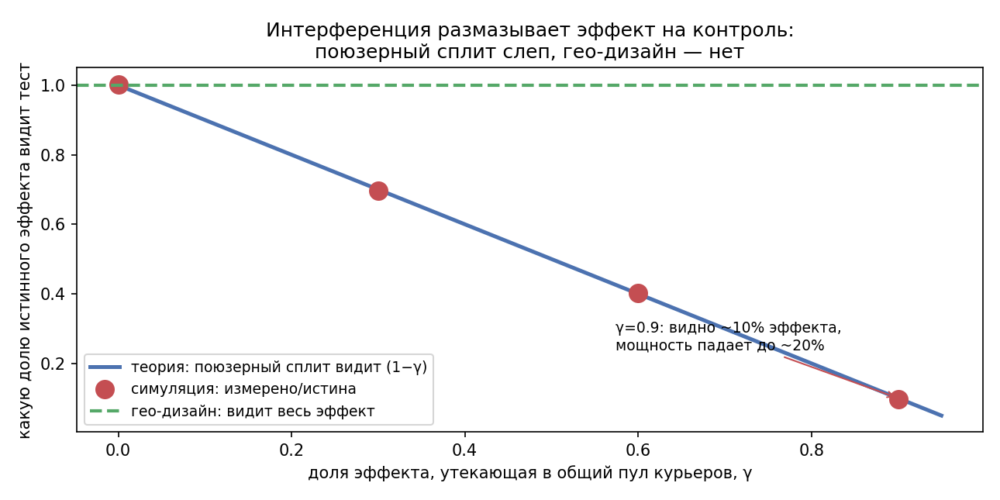
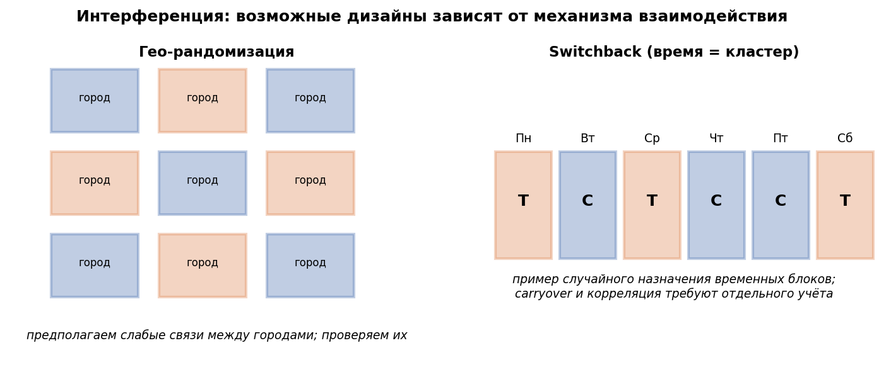
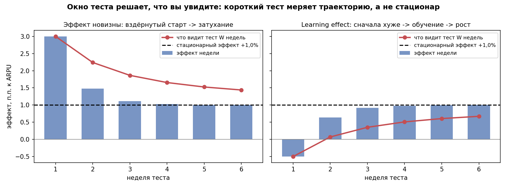
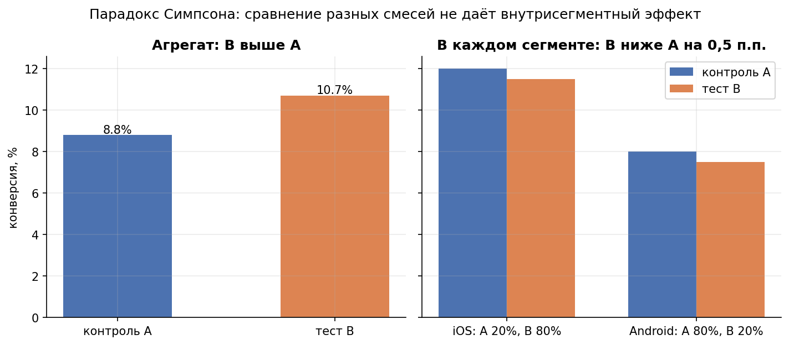

# Урок 4.3 — Валидность и ловушки: когда тесту нельзя верить

**Цель урока:** найти угрозы внутренней и внешней валидности; выбрать единицу рандомизации и допустимый trigger.

**Перед уроком:** [проверьте зависимости темы](../../PREREQUISITES.md); обозначения — в [словаре](../../GLOSSARY.md).

## Зачем это аналитику

Урок 4.2 научил проверять **прибор**: сплит честный (SRM), платформа откалибрована (A/A). Но даже идеальный прибор измеряет невалидный эксперимент. Тест «умная очередь курьеров» проходит SRM, A/A зелёное — и всё равно врёт: тестовые юзеры и контрольные делят одних курьеров, рандомизация не может «поровну» разделить общий ресурс. Тест «стикеры-пожелания» даёт значимый агрегатный рост конверсии — а внутри обеих платформ фича вредит. Тест на cookie-id за 4 недели теряет треть юзеров из-за того, что cookie «протухают».

Кохави начинает с закона Туаймана и главы про trustworthiness именно поэтому: сначала вопрос «можно ли верить результату», и только потом «что он говорит». Порядок жёсткий: **валидность → потом статистика**. Статистически значимый результат невалидного теста — это просто уверенно неправильное число. На практике половина работы аналитика на этом этапе — не про t-тесты, а про данные, идентификаторы, состав групп и устройство продукта.

И это ещё и вопрос денег: невалидный тест стоит дважды — как потерянное время и как неправильное решение (X5: раскат без проверки −140 млн ₽/квартал — та же цена у «валидного на вид» теста с систематическим смещением).

## Теория

### 1. Два вида валидности: что именно ломается

**Внутренняя валидность** — «разница между группами объясняется вариацией, а не чем-то ещё, на этой популяции за это время». Угрозы: нарушение SUTVA (интерференция между юнитами), selection/survivorship в популяции анализа, SRM, различающиеся потери телеметрии, неправильный юнит рандомизации/анализа (3.2), пересечения тестов с взаимодействием. Внутренняя валидность ломает саму оценку — вплоть до знака.

**Внешняя валидность** — «эффект из окна теста перенесётся на полную раскатку и на следующие месяцы». Угрозы: эффект новизны и primacy, learning effects, ramp-up (эффект на 5% трафика ≠ эффекту на 100% — ёмкость рынка кончается), сезонность, дифференциальный отток. Внешняя валидность ломает перенос: оценка «правильная», но только для первых двух недель или только для ранних адаптеров.

Практическое различие: внутренняя проверяется **данными и дизайном** (SRM, инварианты, чек-лист ниже), внешняя — **механизмом и временем** (кривые эффекта по неделям, долгие окна, холдауты — задел на 4.5, Kohavi гл.23).

### 2. Интерференция между юнитами: SUTVA на двухстороннем рынке

Фундамент RCT — предпосылка SUTVA (гл.22 Kohavi; из М6 — потенциальные исходы): $Y_i(z) = Y_i(z_i)$ — поведение юзера не зависит от того, какой вариант достался **другим**. Для UI-фичи «новая карточка ресторана» это почти правда. Для «ЕдаДома» как рынка — ложь: курьеры, рестораны, ассортимент и цены общие. Тестовая группа с умной очередью забирает курьеров раньше — контрольные ждут дольше; тестовые юзеры заказывают чаще — ресторан занят — контрольные уходят. Это и есть интерференция (leakage, network effects, spillover).

Два режима смещения:

- **положительный спилловор** — выигрыш теста частично «разливается» на контроль через общий ресурс. Поюзерный тест видит лишь $(1-\gamma)\cdot\delta$: улучшение распределено между всеми, а разница групп — только «неразлитая» часть;
- **перераспределение** — фича меняет приоритет (очередь, ранжирование, выкуп слота): тесту лучше **за счёт** контроля. Поюзерный тест завышает эффект, а при полной раскатке выигрыш исчезает целиком — делить уже нечего.

Упрощённая модель первого режима (её симулируем): эффект каждого тестового юзера $\delta$, доля $\gamma$ уходит в общий пул и раздаётся всем поровну. Тогда тестовый юзер получает $\delta(1-\gamma) + \gamma\delta p$, контрольный — $\gamma\delta p$, разница групп $= \delta(1-\gamma)$, а полная раскатка ($p=1$) даёт каждому $\delta$. Поюзерный тест **занижает** глобальный эффект ровно в $1-\gamma$ раз. Заметьте: A/A-тест эту проблему не ловит — при выключенной фиче пул пуст, ложных срабатываний положенные ~5% (наша симуляция: 4,8%). Интерференция проявляется только тогда, когда фича включена и работает.

*Рис. 1. Спилловер на двухстороннем рынке: поюзерный сплит видит лишь (1−γ)·δ эффекта, A/A этого не замечает (из практики).*

### 3. Лечение: кластерная, гео-рандомизация и switchback

Идея общая: сделать кластером рандомизации такую группу, внутри которой юниты взаимодействуют, а **между** которой — нет. Спилловор остаётся внутри кластера и не портит сравнение.

- **Кластерная рандомизация** — кластер = группа связанных юзеров: зона доставки, ресторан, школа (если бы тестировали образовательный продукт). Вариант назначается кластеру целиком. Цена из 3.2: design effect $= 1 + (m-1)\cdot\mathrm{ICC}$ — эффективный размер выборки падает, MDE растёт; держите кластеров побольше (30–60+), а не кластеры покрупнее.
- **Гео-рандомизация** — частный случай: кластер = город/район. 60 зон дают уже приличную оценку; главный минус — «гео-шум» (зоны сильно различаются) лечится стратификацией по пре-периоду и CUPED (3.5).
- **Switchback** — время как кластер: весь рынок (или каждый город) получает A и B поочерёдными окнами — день, неделя, час. Серия Дани Никольского в Trisigma: почему обычный t-тест не подходит (окна зависимы: тренды, день недели, погода), почему нужен carryover-контроль — эффект окна тянется в следующее (курьеры «застревают» на заказах из прошлого окна). Диагностика — PACF остатков: значимые лаги = немарковость (кейс ARMA-Design в ride-tech: лаги 5–6 часов требовали дизайна с памятью). Лечится изоляционными паузами между окнами или моделями с carryover. Плюс switchback: достаточно одного города. Минус: эффект усреднён по окнам, чувствительность ниже.

Правило выбора: слабая интерференция (UI, тексты, персонализация) → юзерный сплит; ограниченная ёмкость или ценообразование, водители/курьеры, товарный сток, социальные фичи → кластер/гео/switchback. Признак «емкостного» продукта: метрика одной группы заметно зависит от доли теста $p$ — тогда поюзерный сплит отвечает не на тот вопрос.

*Рис. 2. Два возможных дизайна: гео-кластеры и временные блоки. Их пригодность зависит от межкластерных связей, carryover и схемы анализа.*

### 4. Пересечение экспериментов: величина, а не факт

Оверлап-платформа из 4.2 гонит тесты параллельно на одном трафике. Пересечение аудиторий — не грех само по себе: koch-kir — важно, **какая доля** аудиторий пересекается и насколько фичи могут конфликтовать. 0,1% пересечения при конверсии в единицы процентов — пренебрежимо; 30% аудитории, где оба теста меняют один экран — уже нет.

Что говорит индустрия (разбор Trisigma): в Microsoft проанализировали миллионы пар тестов — значимое взаимодействие нашли у ~0,002% пар (1 на 50 000). Вывод не «пересечения безвредны», а «паника дороже»: систематический health-чек дешевле тотального разнесения тестов. На практике (доклад hh.ru) эффекты часто мультипликативны, и ключевое — замечать **конфликтующие** пары, а не любые.

Проверка взаимодействия — факториальная **таблица 2×2**: юзеры, попавшие в оба теста, разбиваются на четыре клетки (контроль-контроль, A-контроль, контроль-B, A-B); в регрессии это main effects + interaction: значимый коэффициент взаимодействия — повод разнести тесты по времени или аудиториям. Сначала проверьте SRM обоих тестов: «взаимодействие» может оказаться сломанным расписанием экспериментов. Полная ортогонализация нереальна: для 6 экспериментов это $2^6 = 64$ комбинаций (koch-kir) — потому и живём с оверлапом плюс чеки (детекция взаимодействий как часть диагностики платформы — Deng, гл.9).

### 5. Эффект новизны и learning effects: эффект — не константа

Классические траектории (Kohavi гл.3, 23):

- **novelty**: новый элемент интерфейса притягивает внимание и клики → эффект вздёрнут на старте и затухает. Стационар +1,0%: первая неделя показывает +3,0%, двухнедельный тест — +2,2%, шестинедельный всё ещё +1,4% (наша симуляция). Решение по короткому тесту переоценивает долгосрочный эффект в разы.
- **primacy/learning**: наоборот, юзерам надо научиться → сначала хуже. Стационар +1,0%: первая неделя −0,5% («фича вредит, откатываем!»), две недели ≈ 0, шесть недель +0,7%. Короткий тест **хоронит рабочую фичу** — это цена ошибки II рода на уровне программы (сколько таких уже похоронено?).

Что делать: длительность ≥ 2 недель и целыми неделями (4.1; X5: «день 1 — любопытство, день 14 — правда»); смотреть недельную траекторию эффекта и решать по плато, а не по первой неделе; для настоящих долгосрочных эффектов (привыкание, retention) — длинные тесты и holdout-когорты (Kohavi гл.23, подробно в 4.5). Кейс-ориентир: редизайн тулбара Gmail — суммарно «зелёные» тесты обещали линейный рост, метрика вышла в плато («Why is my A/B test flat?»).

*Рис. 3. Новизна и обучение: траектории эффекта по неделям — окно теста решает, что вы увидите (из практики).*

### 6. Cookie churn против account-id

Юнит рандомизации должен быть **стабильным** (Deng, гл.7; Kohavi гл.14). Анонимный веб-юзер идентифицируется cookie — а cookie живут плохо: чистка, смена устройства, инкогнито — за месяц «умирает» порядка половины cookie. Что происходит с тестом: юзер возвращается с новым cookie → хэш назначает его в другой вариант → он «дробится» между вариантами: часть заказов в тесте, часть в контроле. Эффект размывается к нулю, дисперсия растёт, а на длинных окнах состав групп дрейфует (выжившие cookie — систематически активнее). Проверка: доля «сменявших» идентификатор за окно; лечение: account/user-id везде, где пользователь логинится (доставка еды — почти всегда), для анонимов — короткие окна и поправки на churn. Юнит анализа — тот же, что юнит назначения (3.2), иначе dependence ломает α.

### 7. Survivorship, selection и ITT против triggered-анализа

**Survivorship bias** (X5, самолёты Вальда): фильтр «смотрим только тех, кто активен/до конца с нами» — это conditioning на post-treatment переменной: «убрали промокод — средний чек активных вырос» (новички просто ушли). **ITT (intention-to-treat)**: анализируем всех, кому назначен вариант, независимо от того, «дошла» ли фича — это сохраняет случайность сплита.

**Triggered-анализ** сужает популяцию до тех, кто мог столкнуться с воздействием. Для сохранения рандомизации trigger должен определяться до различий вариантов или корректно логироваться контрфактически: сработал бы он при любом назначении? Одинаковая строка фильтра в двух руках недостаточна, если treatment меняет само открытие корзины. Определите eligibility, момент включения, окно и triggered-complement. Клики по новой функции — post-treatment поведение и не являются безопасным фильтром. ITT включает всех назначенных в исходную eligible-популяцию, в том числе не увидевших вариант.

### 8. Парадокс Симпсона: агрегат против сегментов

Числовой пример из практики (тест «стикеры-пожелания к заказу», фича катилась через новый клиент приложения, поэтому в triggered-аудитории теста мобильных оказалось 85% против 50% в контроле; мобильные конвертятся вдвое лучше web):

| сегмент | конверсия контроль | конверсия тест | разница | z | p |
|---|---|---|---|---|---|
| mobile | 12,25% | 11,08% | **−1,16 п.п.** | −4,58 | <0,001 |
| web | 6,18% | 5,04% | **−1,14 п.п.** | −3,66 | 0,0003 |
| агрегат | 9,22% | 10,18% | **+0,96 п.п.** | +5,12 | $3\cdot10^{-7}$ |

Внутри обеих платформ фича **вредит**, в агрегате — значимо «помогает»: агрегатное среднее — взвешенное по составу, а составы групп различаются ($\chi^2 = 13\,903$ — «сегментный SRM»: состав по платформе должен совпадать, и его расхождение — красный флаг сам по себе). Парадокс в чистом виде невозможен в честном RCT по пре-тритмент сегментам (составы совпадают по построению) — он симптом: асимметричный триггер (наш случай), дифференциальный отток, бот-трафик, смешение популяций. Противоядие: проверять баланс состава по ключевым пре-сегментам (это инвариант!), смотреть сегменты до вывода, а при неоднородных эффектах не доверять агрегату без стратификации (3.5). Но помните X5: разрез по сегментам «до нужного результата» — это уже confirmation bias и множественность; дисциплина сегментов — в 4.4.

*Рис. 4. Парадокс Симпсона: агрегат выигрывает, оба сегмента проигрывают — микс сегментов различается.*

### 9. Телеметрия: различающиеся потери событий

Тест измеряется событиями в логах. Если тестовый клиент теряет события иначе, чем контрольный, метрики смещены **дифференциально** — и никакая статистика это не исправит: новый SDK в тестовой сборке не досылает часть `purchase`, и «выручка упала на 3%» при нулевом реальном изменении; или тестовая страница грузит больше событий, часть таймаутится. Deng (гл.7): хрупкая телеметрия инвалидирует тест — это одна из главных причин невалидности в больших системах. Родственная болезнь — MDM, metric denominator mismatch (гл.9): числитель метрики считается из одной таблицы событий, знаменатель из другой, и их популяции расходятся.

Проверяйте отдельно: (1) назначения и pre-treatment признаки; (2) полноту и задержки телеметрии; (3) продуктовые outcomes — сессии, показы, краши. Рост событий может быть реальным эффектом. SRM считают по уникальным единицам и ожидаемым долям, а различие числа событий не называют автоматически SRM.

### 10. Чек-лист валидности: гейт перед анализом

Собираем урок в процедуру (в практике — рабочая python-функция `validity_checklist`):

1. SRM: сплит соответствует плану ($\chi^2$, порог тревоги 0,001).
2. A/A платформы свежее; инвариантные метрики не разошлись.
3. Юнит анализа = юнит назначения; идентификатор стабильный (account-id > cookie).
4. SUTVA: юниты не делят ресурс; для рынка — кластерный/гео/switchback дизайн.
5. Пересечения: доля пересечения известна; для конфликтных пар — 2×2-проверка.
6. Длительность: ≥ 2 целых недель; сезонный цикл покрыт.
7. Траектория эффекта на плато (новизна/обучение не активны) или решение по длинному окну.
8. Популяция анализа: ITT либо trigger с обоснованной независимостью eligibility от treatment; одинаковой записи фильтра недостаточно.
9. Телеметрия: полнота проверена по механизму логирования; одинаковые доли потерь не доказывают отсутствие смещения.
10. Защитные метрики оценены относительно предзаданных границ вреда. Краши и latency являются outcomes.

Пока есть «красные» пункты — p-value не читаем: это не формальность, а страховка от уверенно неправильного числа.

## Разбор на данных

Кейс 1 — **«умная очередь курьеров»** (двусторонний рынок). Первый пилот: поюзерный сплит 50/50, 2 000+2 000 юзеров, 2 недели. Результат: время доставки −0,4 мин, p ≈ 0,2 — «эффекта нет». Чек-лист валидности: интерференция — СТОП (курьеры общие, это рынок с ограниченной ёмкостью), длительность — ок, всё остальное зелёное. Диагноз: не «фича не работает», а «дизайн слеп». Симуляция спилловора подтверждает: при $\gamma = 0{,}9$ поюзерный сплит видит 9,8% истинного эффекта (−4,0 → −0,4 мин), мощность 22% — рабочую фичу хороним в 4 мирах из 5. Редизайн: гео-рандомизация по зонам доставки (кластеры = зоны, утечка заперта внутри) + стратификация зон по пре-периоду. Результат гео-теста: −4,0 мин, 95% CI [−4,6; −3,4] — весь эффект, значимо. Два теста — противоположные решения, разница только в валидности дизайна.

Кейс 2 — **«стикеры-пожелания»** (Симпсон + selection). Дашборд показывает агрегат: конверсия 9,22% → 10,18%, p = 3·10⁻⁷ — «победа, катим на всех». Аналитик режет по платформе: в mobile −1,16 п.п., в web −1,14 п.п. — фича вредит везде. Причина: фича доступна только в новом клиенте → асимметричный triggered-фильтр → в тесте 85% мобильных против 50% в контроле (сегментный SRM, $\chi^2 = 13\,903$). Правильное действие: вернуть ITT по всем рандомизированным или симметричный триггер «открыл корзину» в обеих группах — и повторить чтение. Агрегат после исправления состава показывает вред — тест закрыт, сэкономлены деньги и репутация.

Кейс 3 — **новинка, которая тает**. Тест «новая навигация» на 1 неделе: +3,0% ARPU, катим. Через квартал метрика на месте — а тест был честный! Просто стационарный эффект +1,0%, а окно в 1 неделю измерило вздёрнутый старт. Правило: недельная кривая эффекта обязана выйти на плато до чтения результата (у нас — с 3-й недели), иначе вердикт — по длинному окну.

## Подводные камни

1. **«Рандомизация всё исправит».** Делают: на двухстороннем рынке/соцфиче/общем ресурсе рандомизируют юзеров. Грозит: спилловор — тест измеряет $(1-\gamma)\delta$ (или перераспределённый артефакт), при $\gamma\to1$ рабочая фича «не прокрашивается». Правильно: думать о SUTVA на этапе дизайна; рынок → кластер/гео/switchback.
2. **Поюзерный тест на маркетплейсе как источник «сверхэффектов».** Делают: фича-приоритет показывает +8% и её катят. Грозит: при 100% раскатки делить нечего — эффект исчез (перераспределительный режим). Правильно: вопрос дизайна — «что будет при p=100%», а не «что видит тест при p=50%».
3. **Switchback без carryover-диагностики.** Делают: чередуют A/B часовыми окнами и сравнивают t-тестом. Грозит: эффект окна тянется в следующее → окна зависимы, α сломана. Правильно: PACF остатков до дизайна, изоляционные паузы/модели с carryover (серия Trisigma).
4. **Паника или игнор пересечений.** Делают: либо требуют полного разнесения всех тестов, либо не смотрят вовсе. Грозит: в первом случае — очередь тестов на месяцы (цена скорости), во втором — редкий, но настоящий конфликт фич портит оба теста. Правильно: величина пересечения + health-чек 2×2 (Microsoft: взаимодействий ~0,002% пар — чек дешевле паники).
5. **Короткое окно на новинке/learning-фиче.** Делают: читают результат первой недели. Грозит: +3,0% вместо стационарных +1,0% (переоценка) или −0,5% вместо +1,0% (хороним рабочую фичу). Правильно: ≥ 2 недель, кривая эффекта на плато, долгие эффекты — холдаут (4.5).
6. **Cookie как юнит на длинном тесте.** Делают: 4-недельный тест на анонимов. Грозит: половина cookie за месяц churn'ится — юзеры дробятся между вариантами, эффект к нулю, состав дрейфует. Правильно: account-id; для анонимов — короткие окна и оценка churn'а как инварианта.
7. **Фильтр «только видевшие фичу» без симметрии.** Делают: сравнивают кликнувших в тесте со всеми в контроле. Грозит: selection/survivorship → смещение или Симпсон (наш кейс: агрегат +0,96 п.п. при вреде в обоих сегментах). Правильно: ITT по умолчанию; triggered — только по симметричному правилу, и проверять баланс состава по пре-сегментам.
8. **Телеметрию проверяют «на глаз».** Делают: после релиза клиента не перезапускают A/A и не смотрят инварианты. Грозит: дифференциальные потери событий → систематически смещённая метрика, тест невалиден при любых p-value. Правильно: SRM по уникальным eligible-пользователям, pre-инварианты и проверки полноты телеметрии — в автоматическом чек-листе каждого теста.

## Практика

Файл: [practice_4_3.py](practice/practice_4_3.py) (percent-формат, numpy/scipy/matplotlib/pandas, seed зафиксирован). Что делает:

1. **Симпсон-симуляция**: мобильные/web конверсии; внутри сегментов тест хуже (−1,16 и −1,14 п.п., оба значимо), в агрегате «лучше» (+0,96 п.п., $z=5{,}1$); сегментный SRM $\chi^2 = 13\,903$. График [practice_4_3_simpson.png](images/practice_4_3_simpson.png).
2. **Спилловор на рынке**: 400 миров для $\gamma \in \{0; 0{,}3; 0{,}6; 0{,}9\}$: поюзерный сплит видит $(1-\gamma)\cdot\delta$ (−2,79; −1,61; −0,39 мин при δ=−4), при γ=0,9 мощность 22%; гео-дизайн видит −4,0 мин всегда; A/A при выключенной фиче — 4,8% ложных срабатываний (интерференцию не ловит). График [practice_4_3_spillover.png](images/practice_4_3_spillover.png).
3. **Новизна/обучение**: недельные траектории и кумулятив «что видит тест W недель»: новизна 1 нед +3,0% → 6 нед +1,44% (стационар +1,0%); обучение 1 нед −0,5% (хороним фичу) → 6 нед +0,67%. График [practice_4_3_novelty.png](images/practice_4_3_novelty.png).
4. **Чек-лист валидности как python-функция** `validity_checklist(cfg)`: 11 пунктов со статусами OK/ПРОВЕРИТЬ/СТОП и действием на каждый; прогон «умной очереди курьеров»: 2 СТОП (интерференция рынка, окно 1 неделя), 3 ПРОВЕРИТЬ — до исправления результат не читаем.

## Домашнее задание

1. В тесте «стикеры» контроль: 60% мобильных с конверсией 12%, 40% web с 6%; тест: 80% мобильных с 11,4%, 20% web с 5,3%. Посчитайте агрегатные конверсии и объясните, почему тест «выигрывает» в агрегате и проигрывает в обоих сегментах.

Ответ

Контроль: 0,6·12 + 0,4·6 = 9,6%. Тест: 0,8·11,4 + 0,2·5,3 = 10,22%. В агрегате +0,62 п.п. — потому что в тесте выше доля «конверсионных» мобильных, и это перевешивает вред внутри каждого сегмента. Агрегатное среднее — взвешенная сумма сегментных средних с весами состава, а не «средняя конверсия вообще». Симпсон исчезает, если сравнивать сегмент с сегментом или пересчитать обе группы с одинаковыми весами (пост-стратификация из 3.5): с весами контроля тест = 0,6·11,4+0,4·5,3 = 8,96% — хуже контроля на 0,64 п.п.

2. В модели спилловора (доля γ эффекта утекает в общий пул) покажите, что измеренная разница групп $\delta(1-\gamma)$ не зависит от доли теста $p$, а вот улучшение контрольной группы — зависит. Какой это даёт практический способ заподозрить интерференцию по данным одного теста?

Ответ

Разность: тест получает $\delta(1-\gamma)+\gamma\delta p$, контроль $\gamma\delta p$ — разность $\delta(1-\gamma)$ без $p$. Но сдвиг контроля относительно своей пре-метрики равен $\gamma\delta p$ и растёт с $p$. Практический детектор: сравнить контроль теста с внешним «нетронутым» холдаутом или с пре-периодом (с поправкой на сезонность) — если контроль «улучшился» на фоне не-участников, часть эффекта утекла в него. Второй сигнал: повторить тест с другим $p$ (например, 10% и 50%) — измеренный эффект не должен зависеть от доли раскатки; если зависит — интерференция.

3. Новизна: стационар +1%, добавка первой недели +2 п.п., затухание с τ = 0,7 нед. Кумулятивный эффект W недель ≈ $1 + A\tau/W$ (п.п. при $A$ в п.п./нед). Сколько недель нужно, чтобы кумулятив отличался от стационара меньше чем на 10%?

Ответ

$A\tau/W < 0{,}1 \Rightarrow W > 2\cdot0{,}7/0{,}1 = 14$ недель. Вывод отрезвляющий: остаток новизны выветривается медленно (интеграл экспоненты), и «подождать ещё недельку» не лечит — нужны либо долгие окна/холдауты для критичных решений (4.5), либо честная оговорка в отчёте: «эффект измерен на траектории, стационарная оценка ниже».

4. Недельный cookie churn 10%. Какая доля 4-недельного теста «сменит» идентификатор хотя бы раз ($1-0{,}9^4$)? К чему это приводит, если юнит — cookie?

Ответ

$1-0{,}9^4 \approx 34\%$. Каждый третий юзер вернётся с новым cookie — хэш отправит его, возможно, в другой вариант: наблюдения дробятся между группами, эффект размывается к нулю, α и SE некорректны (зависимость нарушена). Лечение: account-id как юнит; оценка churn как инварианта (доля «новых» id в группах должна совпадать); для анонимов — короткие окна.

5. Возьмите свой текущий/последний тест и прогоните по чек-листу из 10 пунктов теории. Какой пункт чаще всего оказывается не-OK? Напишите для него конкретное действие (дизайн-уровня, не «следить внимательнее»).

Ответ

Без модели; типичные лидеры по «красноте» в индустрии: популяция анализа (asymmetric triggered), длительность < 2 недель и юнит (session вместо user). Действия соответственно: пересчитать ITT / симметричный триггер; перестроить календарь тестов (правило max(выборка, 2 недели) из 4.1); миграция юнита на account-id + перезапуск A/A. Суть упражнения — чек-лист должен генерировать решения, а не галочки.

## Шпаргалка

1. Порядок чтения теста: валидность → статистика → решение. Значимый результат невалидного теста — уверенно неправильное число.
2. Внутренняя валидность — «разница = эффект здесь и сейчас» (SUTVA, ITT, телеметрия, юниты); внешняя — «перенесётся на 100% и на другие недели» (новизна, обучение, ramp-up).
3. SUTVA: $Y_i(z)=Y_i(z_i)$. Двусторонний рынок (курьеры/водители/сток/цены) нарушает: поюзерный сплит видит $(1-\gamma)\delta$ при положительном спилловоре или артефакт перераспределения.
4. Лекарства: кластерная/гео-рандомизация (кластер = зона/город, design effect $1+(m-1)\cdot$ICC) и switchback (время как кластер; PACF-диагностика carryover, изоляционные паузы).
5. A/A не ловит интерференцию: спилловор проявляется только при включённой фиче. Детектор — контроль против холдаута/пре-периода, повтор с другой долей $p$.
6. Пересечение тестов: важна величина, а не факт (Microsoft: ~0,002% пар взаимодействуют); конфликт проверяется таблицей 2×2; сначала SRM обоих тестов.
7. Новизна/обучение: эффект — траектория; 1 неделя может показать +3,0% или −0,5% при стационаре +1,0%. ≥ 2 недель, решение по плато недельной кривой; долгие эффекты — холдаут.
8. Идентификатор: account-id > cookie; за месяц churn'ится ~половина cookie — эффект дробится. Юнит анализа = юнит назначения.
9. ITT по умолчанию; triggered-анализ — только с симметричным правилом триггера; survivorship-фильтры («активные», «дошедшие») — selection bias.
10. Симпсон = сигнал: в честном RCT составы пре-сегментов совпадают; переворот агрегата означает асимметричный триггер/отток/смешение. Проверяйте сегментный SRM.
Проверять отдельно: (1) назначения и pre-treatment признаки; (2) полноту и задержки телеметрии; (3) продуктовые outcomes — сессии, показы, краши. Рост событий может быть реальным эффектом. SRM считают по уникальным единицам и ожидаемым долям, а различие числа событий не называют автоматически SRM.и) + SRM по событиям + A/A после каждого релиза клиента.
12. Чек-лист валидности (SRM, A/A, юнит/id, SUTVA, пересечения, длительность, плато эффекта, популяция, телеметрия, инварианты) — гейт: пока есть СТОП, p-value не читаем.

## Источники

- Kohavi, Tang, Xu — Trustworthy Online Controlled Experiments, гл.3 (закон Туаймана, угрозы внутренней/внешней валидности, survivorship, ITT, новизна, сегменты, Симпсон), гл.12–14 (client-side эксперименты, instrumentation/телеметрия, выбор юнита рандомизации и идентификаторов), гл.20 (triggering), гл.22 (SUTVA, leakage/интерференция, изоляция и детекция), гл.23 (долгосрочные эффекты) — PDF в базе (`materials/local/books.md`).
- Deng A., «Causal Inference and Its Applications in Online Industry», гл.7 (инфраструктура: cookie churn → account-id, хрупкая телеметрия), гл.9 (диагностика платформы: A/A, SRM, детекция взаимодействий, MDM) — https://alexdeng.github.io/causal/abintro.html, https://alexdeng.github.io/causal/abdiagnosis.html (`materials/web/alexdeng-causal-book.md`).
- koch-kir, «Влияние экспериментов друг на друга» — величина пересечения вместо факта, 2×2-проверка взаимодействия, 2⁶=64 и альтернативы (`materials/web/web-articles.md`).
- Trisigma (t.me/trisigma_avito): серия про switchback ч.1–3 + гайд Дани Никольского (почему не подходит t-тест, carryover, инфраструктура), разбор Microsoft «A/B Testing Interactions» (~0,002% взаимодействующих пар; health-чеки), доклад hh.ru про пересекающиеся A/B, «Why is my A/B test flat?» (`materials/telegram/trisigma_avito-digest.md`).
- X5 Product Analytics Academy, урок 1 — три злодея мышления: survivorship (самолёты Вальда), парадокс Симпсона (онбординг Чижика), confirmation bias (`materials/local/x5-product-analytics.md`).
- Уроки курса: 3.2 (кластеризация и design effect), 3.5 (пост-стратификация), 4.1 (длительность и календарь), 4.2 (SRM, A/A, оверлап-слои); вперёд — 4.5 (холдауты, долгосрочные эффекты).
