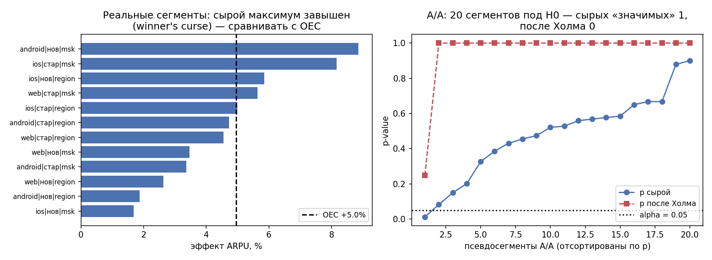
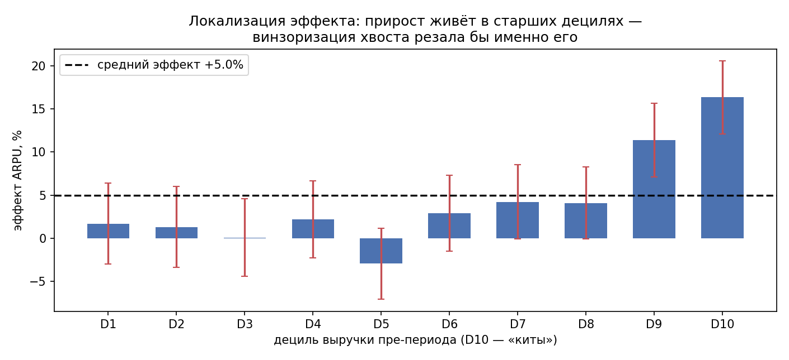

# Урок 4.4 — Интерпретация и решение: от p-value к вердикту

**Цель урока:** собрать пользовательскую таблицу, оценить эффект и ограничения, написать обоснованное решение.

**Перед уроком:** [проверьте зависимости темы](../../PREREQUISITES.md); обозначения — в [словаре](../../GLOSSARY.md).

## Зачем это аналитику

Всё, что было до этого, — прибор и гигиена: дизайн-док (4.1), сплит и SRM (4.2), валидность (4.3). Остался последний шаг, на котором обнуляются все предыдущие: **чтение результата**. «Прокрасилось — катим» — это не анализ, а передача решения монетке: p-value ничего не знает о цене разработки, о том, что CI от −0,2% до +4,8%, что guardrail просел, что эффект живёт только у «китов», а сегмент-победитель — шум.

Atlamos («айсберг A/B-тестов») формулирует жёстко: A/B-тест контролирует вероятность ошибки I рода, а **вывод делает аналитик** — по величине эффекта, CI и согласованности метрик. Этот урок — конвейер такого вывода: как прочитать все числа сразу (эффект/CI/p/мощность), как проверить механизм (иерархия метрик), как не обмануть себя сегментами и перцентилями, как перевести проценты в деньги и как всё это упаковать в одну карточку, по которой продакт принимает решение. И финальная сборка модуля: полный пайплайн от сырых логов до вердикта — то, что в Симуляторе (уроки 13–14) называется «анализ и вывод».

Сквозной кейс: тест «умные рекомендации в корзине», дизайн-док которого мы писали в 4.1. Сегодня он заканчивается — и заканчивается не тем вердиктом, который обещал «прокрас».

## Теория

### 1. Читать результат по-взрослому: четыре числа вместо одного

Взрослый результат теста — это:

1. **Оценка эффекта** в единицах метрики: +90 ₽ ARPU, а не «+5%» без базы, и не «значимо».
2. **Доверительный интервал** — диапазон эффектов, совместимых с данными: $[+65; +114]$ ₽. CI — главный артефакт отчёта: он отвечает на вопрос «а сколько может быть на самом деле», в выбранной процедуре неопределённости; это не гарантированная граница всех возможных эффектов. Нижняя граница CI сравнивается с порогом практической значимости — не p-value.
3. **p-value** — мера несовместимости наблюдаемой статистики с моделью H0. При одном и том же тесте меньший p означает более сильную несовместимость, но не больший экономический эффект и не вероятность истинности H0. Поэтому p читают вместе с оценкой и CI; информация не исчезает при пересечении 0,05.
4. **Контекст мощности**: какой эффект тест вообще мог поймать (MDE из дизайн-дока, то есть эффект с заданной мощностью). Наблюдаемый эффект выше/ниже MDE не подтверждает и не опровергает гипотезу — для этого существует CI. И наоборот: значимость в маломощном тесте подозрительна — отобранные «прокрасы» систематически преувеличены (Type M из 2.1; глубже — в 4.5).

Три типовых вывода из четвёрки: CI целиком выше порога практичности → эффект и доказан, и окупается; CI накрывает порог → значимость есть, а решения нет — думать про экономику и риск; CI широченный в обе стороны → тест был слеп, «отсутствие значимости ≠ отсутствие эффекта».

Интервал и бизнес-порог сравнивают в одной шкале. Для относительного lift $\mu_T/\mu_C-1$ нельзя просто поделить границы CI абсолютной разности на наблюдённое среднее контроля: baseline тоже оценён с ошибкой. В практике каждый бутстреп заново выбирает пользователей обеих рук и считает и разность, и отношение средних. Порог +3% сравнивается с CI отношения; это бизнес-порог, а MDE определяется отдельным расчётом мощности.

### 2. Согласованность метрик: иерархия от прокси к деньгам

Метрики теста — не плоский список, а **иерархия** (4.1): микрометрики механики (клики, CTR) → поведенческие (конверсия, частота заказов) → деньги (ARPU, маржа) → долгосрочные (retention, LTV — обычно прокси). Два свойства иерархии:

- **чувствительность выше у механики**: фича меняет клики раньше и сильнее, чем выручку (айсберг: «чувствительность максимальна там, где работает механика — клики раньше ARPU»). Поэтому diagnostic-метрики смотрят первыми — они объясняют, *как* фича работает.
- **интерпретация — у денег**: клики ничего не стоят и ничего не приносят; решение принимается по OEC и guardrails.

**Согласованность** — проверка механизма: если гипотеза из дизайн-дока «рекомендации → больше кликов → больше заказов → выше ARPU», то сонаправленные сдвиги всей цепочки повышают доверие (эффект идёт через заявленный механизм), а противонаправленные — сигнал бедствия: CTR↑ при конверсии↓ — Гудхарт (юзеры кликают, но не покупают: рекомендации отвлекают), ARPU↑ при guardrail-просадке — эффект куплен ценой доставки (наш кейс ниже). Согласованность не доказывает причинность (все метрики коррелированы), но рассинхрон — повод остановиться и разобраться, а не «зачесть победу по максимуму».

### 3. Сегменты и HTE: соблазн «найти, где выигрывает»

После теста с серым OEC рука сама тянется: «а если порезать по платформам/городам/когортам — может, где-то выигрывает?» Это самая опасная кнопка в интерфейсе аналитика. Каждый разрез — новая проверка гипотезы: 15 независимых проверок при α=5% дают ~54% шанса найти «значимый» сегмент под H0 (2.4); а найденный максимум ещё и **завышен** — среди многих шумных оценок наибольшая почти наверняка удачно отклонилась вверх (winner's curse, он же Type M; мостик к 4.5). Двойной удар: ложное открытие и переоценённый эффект — «раскатим на сегмент X, там же +9%» разочарует даже если эффект там правда есть.

Честный протокол:

- **сегменты заявлены в дизайн-доке до теста** (X5: «заявленные до — анализ; найденные после — HARKing»), и на каждый была мощность;
- **поправки на множественность** для семьи сегментов — Холм/Бонферрони для FWER (2.4), BH если сегментов много и допускаем FDR;
- **интеракции вместо попарных тестов**: регрессия $Y \sim T + S + T\times S$ — один тест «эффект различается по сегментам», а не 12 отдельных «в сегменте s эффект значим». Значимой интеракции нет → говорить «для сегмента X фича лучше» не на чем;
- **находка пост-фактум — гипотеза для нового теста**, не основание раскатки; для серьёзных HTE (таргетированные раскатки) — CATE-модели, это уже М6.

*Рис. 1. «Техасский снайпер»: нарезка сегментов до нужного результата — после поправки Холма победитель исчезает (из практики).*

### 4. Локализация эффекта: децили и перцентили

Вопрос, который решается до сегментов: **где эффект живёт** — в теле распределения или в хвосте. Перцентильный анализ (Atlamos, «Бутстрап»): делим юзеров на децили по **пре-периодной** метрике (выручка до теста), в каждом дециле — эффект и CI. Зачем:

- **диагноз неоднородности**: эффект только в D9–D10 — «фича для китов»; эффект в теле — «фича для всех». У нас: D1–D6 около нуля (CI накрывают 0), D9 +11,4%, D10 +16,3%;
- **связь с обработкой метрики из 3.4**: если эффект живёт в хвосте, агрессивная винзоризация (P95 и жёстче) вырезала бы его из теста — «значимых изменений нет» при +5% ARPU. Обратное тоже верно: эффект в теле — обрезка может повысить мощность, но всё равно меняет estimand. Перцентильный анализ — это проверка, *что* именно измерял ваш тест;
- **интерпретация продукта**: «рекомендации помогают тем, кто и так заказывает много» — это другая продуктовая история, чем «помогают всем», и другая экономика.

Критическая тонкость: децили задаются по пре-метрике; пороги можно взять по независимой исторической/control pre-выборке, а применять к пре-значению каждого пользователя. Контрольные квантили текущего outcome не делают разбиение по post-outcome безопасным. Нарезка по **post-метрике** («дециль выручки в тесте») — это selection: в верхний дециль теста попадут юзеры, чью выручку подняла фича, — «эффект в хвосте» получится артефактом сортировки по результату (collider из М6).

*Рис. 2. Децильная локализация по пре-метрике: эффект в D9–D10 — хвост; помни урок 3.4 про винзоризацию (из практики).*

### 5. Статистическая значимость ≠ практическая

Статзначимость отвечает «эффект есть?», практическая — «он стоит того?». Перевод в бизнес-единицы — обязанность аналитика, а не стейкхолдера:

$$\text{эффект} \times \text{база} \times \text{горизонт} \to \text{деньги}: \quad +90\ \text{₽/юзер} \times 2\ \text{окна} \times 600\,000\ \text{юзеров} \approx +108\ \text{млн ₽/мес}.$$

Порог практической значимости фиксируется **до теста** (бизнес-порог отдельно от MDE, 3.1): «раскатываем, если ARPU ≥ +3%» — тогда вердикт — сравнение нижней границы CI с порогом (у нас +3,6% > 3% — порог пройден даже в pessimistic-сценарии). Симметричная ловушка — значимый, но ничтожный эффект: +0,1% конверсии на 10 млн юзеров даст p-значение с десятком нулей и ноль смысла, если не окупает поддержку фичи. И третья: **цена эффекта** — guardrail-просадка и стоимость разработки входят в ту же арифметику (наш кейс: 108 млн ₽/мес выгоды против роста опозданий на 0,6 п.п.).

### 6. Коммуникация стейкхолдерам: карточка теста

Отчёт — это не дашборд со ста метриками, а одна карточка (X5, урок 3: гипотеза, OEC, guardrails, MDE, n, длительность, результаты, решение, владелец). Правила:

- одно решение — одна метрика (OEC), остальное — контекст; guardrails — стоп-сигнал, а не «ещё мнение»;
- эффект + CI + p рядом (не CI без p и не p без CI), вторичные — с пометкой поправки;
- деньги и порог практичности — в отчёте, а не в устной легенде;
- рекомендация из трёх слов: **roll / hold / iterate** — по decision rule из дизайн-дока (4.1), плюс следующий шаг и владелец;
- язык: «B лучше A на 5% (CI 3,6–6,3%)», а не «мы на 95% уверены, что B лучше» (p-value — не вероятность гипотезы, 2.1); без «прокрасилось».

Отдельная дисциплина — куда идёт результат после решения: карточка теста попадает в базу экспериментов (institutional memory, Kohavi гл.8), эффект — в мета-анализ программы (4.5). Без этого компания платит за каждый тест заново.

### 7. Финальный пайплайн: от сырых логов до вердикта

Сборка всего модуля в один конвейер (в практике — работающий код):

1. **Логи → юнит-таблица**: события (заказы, клики, показы) агрегируются на юните рандомизации; дедуп, стабильный id (4.3), атрибуты юзера (платформа, гео, пре-период).
2. **Метрики**: поюзерные величины; ratio-метрики — линеаризация/дельта-метод (3.3); при необходимости — винзоризация с проверкой, где эффект (3.4 + шаг локализации), CUPED по пре-периоду (3.5).
3. **Валидация** (гейт, 4.2–4.3): SRM, инварианты, телеметрия, состав сегментов. Не зелёное — не читаем.
4. **Тесты**: OEC — заранее заданная гипотеза; guardrails — направление вреда, margin и свой error budget. Для разрешения раскатки исключаем недопустимый вред по односторонним границам, в примере с Bonferroni на два ограничения. Вторичные метрики и сегменты — с выбранным контролем множественности. Незначимость guardrail не доказывает безопасность.
5. **Локализация**: децили по пре-метрике, эффект по децилям с CI.
6. **Вердикт**: decision rule 2×2 (OEC × guardrails) + порог практичности по нижней границе CI → roll / hold / iterate.
7. **Отчёт-карточка** + запись в базу тестов.

Это же — каркас «Симулятора» уроков 13–14: анализ реальных А/Б-наборов от сырых данных до вывода. Отсюда открывается 4.5: что происходит с программой тестов, когда таких карточек становится сотня.

## Разбор на данных

Тест **«умные рекомендации в корзине»** (дизайн-док из 4.1): юзеры, открывавшие корзину, около 40 000 на руку, 2 недели, α = 5%, MDE 3%, порог практической значимости +3% ARPU. Прогон по пайплайну (практика [practice_4_4.py](practice/practice_4_4.py)):

**Валидация:** 39923/40077 пользователей, SRM p≈0,59. Показы на пользователя анализируются как диагностический outcome, не как универсальный инвариант. В учебной DGP назначение и полнота данных известны; в реальном тесте их проверяют независимо.

**OEC (ARPU)**: 1 807 → 1 897 ₽: **+90 ₽ (+5,0%)**, 95% CI $[+65; +114]$ ₽ (+3,6…+6,3%), $p = 2{,}6\cdot10^{-12}$. Нижняя граница +3,6% выше порога практичности 3% — даже pessimistic-сценарий окупается. Экономика: +90 ₽ × 2 окна × 600 тыс. юзеров ≈ **+108 млн ₽/мес**.

**Guardrails:** доля опоздавших заказов — sum(late)/sum(orders), а не среднее пользовательских долей с нулями для незаказывавших. Практика использует user-level delta SE. Допустимый рост опозданий +0,5 п.п., поддержки +0,2 п.п.; безопасность требует верхнюю одностороннюю границу ниже margin, с Bonferroni на два ограничения. Значимое улучшение не является нарушением; p>0,05 относительно нуля не означает «всё хорошо». Точные значения выводятся обновлённой практикой.

**Secondary (Холм на 3 гипотезы):** CTR, конверсия в заказ и средний чек. Конверсия и support используют фактические размеры рук 39923/40077. Для CR 78,40→78,91% сырой p около 0,08; после Holm вывод зависит от всего семейства. Совпадение направления с OEC — диагностическая информация, а не доказательство механизма; незначимость среднего чека не доказывает нулевой вклад.

**Локализация (децили пре-выручки)**: D1–D6 — около нуля (CI накрывают 0); D7 +4,2%; D9 **+11,4%** [7,3; 15,4]; D10 **+16,3%** [12,4; 20,3]. Эффект живёт в хвосте — «фича для китов»; жёсткая винзоризация из 3.4 срезала бы его, и тест показал бы «ничего».

**Сегменты**: среди 12 заявленных (платформа × новизна × гео) сырой победитель «android-новые-Москва»: +8,9% (p = 0,021), после Холма p = 0,19 — не значим; против +5,0% на OEC — классический winner's curse. A/A-контроль процедуры: 20 псевдосегментов под H0 — сырой анализ находит «победителя» (−10,2%, p = 0,012), Холм гасит (p_adj = 0,25).

**Вердикт по decision rule 2×2 (OEC↑, guardrail↓): HOLD** — не раскатывать: чинить влияние на доставку (порог ожидания рекомендера, предзагрузка зон) и перетестировать. Это и есть урок чтения результатов: p-value шикарный, деньги огромные — а катить нельзя, и это видно только если прочитать **все** числа, а не только «прокрас».

## Подводные камни

1. **«Прокрасилось/не прокрасилось».** Делают: решение по p-value без величины и CI. Грозит: значимый нулевой эффект раскатывают, insignificance в слепом тесте хоронит рабочую фичу. Правильно: эффект + CI + p + контекст мощности; сравнение с порогом практичности — по нижней границе CI.
2. **Наблюдаемый эффект сравнивают с MDE.** Делают: «эффект +1,8% меньше MDE 2% — значит, его нет». Грозит: смешение дизайна и анализа (мощность живёт до теста). Правильно: MDE — на этапе планирования; после теста — CI (айсберг).
3. **Сегмент-победитель после факта.** Делают: режут 10–15 разрезов до первого «значимого». Грозит: ложное открытие + завышенный эффект (winner's curse) → раскатка на сегмент не приносит обещанного. Правильно: сегменты в дизайн-доке, Холм/Бонферрони, тест интеракции $T\times S$; пост-фактум-находка — гипотеза нового теста.
4. **Децили по post-метрике.** Делают: «эффект в верхнем дециле выручки **теста**». Грозит: сортировка по результату — «эффект в хвосте» как артефакт selection. Правильно: децили по пре-периоду или контрольным квантилям.
5. **Сонаправленность как доказательство механизма.** Делают: «CTR и ARPU выросли — гипотеза подтверждена». Грозит: метрики коррелированы, любая общая причина даёт «согласованность»; а рассинхрон (CTR↑ CR↓) пропускают как «шум вторичных». Правильно: согласованность — плюс к доверию, рассинхрон — обязательный стоп-вопрос; интеракции и локализация объясняют, кому и как фича работает.
6. **Значимость без экономики.** Делают: +0,1% (p = 10⁻¹²) катят как «победу». Грозит: эффект не окупает поддержку; решения в масштабе 10 млн юзеров принимаются по статистике вместо денег. Правильно: перевод в ₽/дни/юнит-экономику в каждой карточке, порог практичности — до теста.
7. **«Деньги важнее guardrail».** Делают: OEC +5% и 108 млн ₽/мес, «опоздания подождут». Грозит: раскатка ухудшения доставки на всю базу — retention-эффект наступит позже и дороже (долгосрочные эффекты, 4.5). Правильно: decision rule 2×2 из дизайн-дока: guardrail-просадка блокирует ROLL независимо от OEC.
8. **Отчёт без решения и владельца.** Делают: таблица из 40 метрик «для информации». Грозит: решение всё равно принимает самый громкий голос; институциональная память пустеет. Правильно: карточка с рекомендацией roll/hold/iterate, следующим шагом, владельцем — и записью в базу тестов.

## Практика

Файл: [practice_4_4.py](practice/practice_4_4.py) (percent-формат, numpy/scipy/matplotlib/pandas, seed зафиксирован). Полный мини-пайплайн на синтетике «ЕдаДома»: 141 310 заказов у 80 000 юзеров. Что делает:

1. **Логи → юнит-таблица**: генерация событий (заказы с выручкой и минутами доставки, показы/клики рекомендаций, пре-выручка юзера), агрегация на юзера; эффект заложен в частоту заказов и растёт по децилям пре-выручки (D1–D6 +1%, D9 +8%, D10 +14%).
2. **Валидация**: SRM (p = 0,59), отдельная диагностика показов (p = 0,86). Показ — продуктовый outcome; такой p сам по себе не подтверждает полноту логов. В синтетике механизм логирования известен.
3. **Тесты**: OEC ARPU — Уэлч + перцентильный бутстреп-CI по юзерам; guardrails — доля опозданий (8,48% → 9,18%) и поддержка (4,92% → 5,21%); безопасность обеих не подтверждена по верхним границам относительно margins; secondary — CTR и чек дельта-методом (3.3), конверсия z-тестом, на троицу — поправка Холма.
4. **Локализация**: эффект по децилям пре-выручки с 95% CI — рост к хвосту: D9 +11,4%, D10 +16,3% (график [practice_4_4_deciles.png](images/practice_4_4_deciles.png)).
5. **Сегменты «до» и «после»**: 12 заявленных сегментов — сырой победитель +8,9% (p = 0,021) умирает после Холма (p = 0,19), завышение против OEC +5,0%; A/A-режим: 20 псевдосегментов под H0 — 1 «значим» сырым анализом, 0 после Холма (график [practice_4_4_segments.png](images/practice_4_4_segments.png)).
6. **report()**: шаблон-функция карточки для стейкхолдеров (эффект, CI, guardrails, secondary с поправкой, локализация, деньги, рекомендация) + `decide()` — decision rule 2×2 с порогом практичности; вердикт кейса: HOLD — неприемлемый вред guardrails не исключён.

## Домашнее задание

1. Примените поправку Холма вручную к p-значениям 0,011; 0,042; 0,20. Какие гипотезы отвергаются при FWER 5%? Что изменилось бы при Бонферрони?

Ответ

Сортируем: 0,011; 0,042; 0,20. Холм: $0{,}011\cdot3=0{,}033$; $0{,}042\cdot2=0{,}084$; $0{,}20\cdot1=0{,}20$; с монотонностью: adj = (0,033; 0,084; 0,20). Отвергается только первая ($0{,}033<0{,}05$). Бонферрони дал бы (0,033; 0,126; 0,60) — вывод тот же, но Холм равномерно не хуже, а на «средних» гипотезах заметно мягче ($0{,}084 < 0{,}126$). Мораль: порядок и кратность имеют значение — «p=0,042 значим в одиночку» не значит «значим в семье».

2. Эффект +0,4 п.п. конверсии (база 32%), 95% CI [+0,1; +0,7] п.п., база 800 000 заказов/мес, маржа 190 ₽/заказ, стоимость поддержки фичи 1,5 млн ₽/мес. Значим ли эффект? Окупается ли? Какой вердикт?

Ответ

Статистически эффект отличен от нуля по указанному CI. Если 800000 — число заказов при CR=32%, знаменатель конверсии равен 800000/0,32=2,5 млн. Дополнительная маржа: 0,004×2,5 млн×190=1,9 млн ₽/мес; диапазон по CI — 0,475…3,325 млн. После затрат 1,5 млн диапазон −1,025…+1,825 млн: точечная оценка выгодна, окупаемость по всему CI не подтверждена. Решение зависит от заранее согласованного отношения к риску; нельзя утверждать «не окупается даже по верхней границе».

3. Почему децильный анализ нельзя делать по выручке **периода теста**, и что покажет такой анализ у фичи, повышающей крупные заказы, даже если на малых заказах эффекта нет?

Ответ

Нарезка по post-метрике — conditioning на результат: в верхние децили теста юзеры попадают частично **благодаря** эффекту, и сравнение «верхний дециль теста vs верхний дециль контроля» сравнивает разные популяции (selection/collider). У фичи, поднимающей крупные заказы: юзеры с эффектом «мигрируют» вверх — в D9–D10 теста соберутся поднявшиеся, и разница там вздуется; в нижних децилях теста останутся «не затронутые», и там может появиться ложный отрицательный сдвиг. Правильно: децили по пре-периоду (или квантилям контроля) — тогда в каждом дециле сопоставимые популяции, и «миграция» видна как эффект, а не как сортировка.

4. OEC-эффект +1,8%, 95% CI [−0,2; +3,8]%, порог практичности 3%. Какой вердикт и что делать команде, если тест уже шёл 3 недели при MDE 2,5%?

Ответ

Вердикт: ITERATE (не HOLD «навсегда»): CI одновременно накрывает и ноль, и бизнес-порог — тест был слеп относительно вопроса. Продлевать вслепую нельзя (peeking/3.7, связь повторного теста с общей процедурой решений фиксируется заранее). Что делать: поднять чувствительность — CUPED по пре-периоду (3.5), винзоризация после проверки локализации (3.4), ratio-метрики линеаризацией (3.3) — и запустить повторный тест с MDE ниже порога; либо принять решение без теста, если цена ошибки мала.

5. Сколько «значимых» сегментов в среднем найдёт сырой анализ среди 15 сегментов под H0 (α = 5%)? Какова вероятность найти хотя бы один? Почему находка «у нас в сегменте iOS-Москва эффект +7%, p = 0,03» в серии из 15 разрезов — не новость?

Ответ

Ожидание: $15 \cdot 0{,}05 = 0{,}75$ сегмента; $P(\geq 1) = 1-0{,}95^{15} \approx 54\%$ — примерно в каждом втором таком исследовании найдётся «победитель», которого нет. Плюс отбор максимума: заявленный +7% — завышенная оценка самого удачного из 15 шумов (winner's curse). Новость начинается после поправки (Холм: порог для минимума p ≈ 0,05/15 ≈ 0,0033), предрегистрации сегментов или отдельного подтверждющего теста.

## Шпаргалка

1. Четыре числа результата: эффект (в единицах метрики) + CI + p + мощность/MDE из дизайна. «Прокрасилось» — не результат.
2. CI — главный артефакт: нижняя граница сравнивается с порогом практической значимости; p сверхмало — свойство больших n, не силы эффекта.
3. MDE и мощность живут на дизайне; наблюдаемый эффект с MDE не сравнивают. Значимость в маломощном тесте → подозрение на Type M.
4. Иерархия метрик: механика (клики/CTR) чувствительнее, деньги (ARPU) — интерпретируемее. Сонаправленность цепочки — плюс к доверию механизму; рассинхрон (CTR↑ CR↓) — стоп-вопрос (Гудхарт).
5. Решение — по OEC + guardrails (decision rule 2×2 из 4.1): guardrail-просадка блокирует ROLL при любом OEC.
6. Сегменты: заявлены до теста, поправка Холм/Бонферрони, тест интеракции $Y\sim T+S+T\times S$ вместо 12 попарных; пост-фактум-находка — гипотеза, не раскатка (HARKing).
7. Winner's curse: максимум по шумным оценкам завышен (наш кейс: сегмент +8,9% против OEC +5,0%; A/A: 1 из 20 «значим» сырым, 0 после Холма).
8. Локализация: децили по ПРЕ-метрике с CI; эффект в хвосте (D9–D10) — винзоризация опасна (3.4), эффект в теле — резать можно; децили по post-метрике — selection-артефакт.
9. Практическая значимость: эффект × база × горизонт → ₽, минус стоимость поддержки; порог фиксируется до теста (3.1).
10. Карточка отчёта: гипотеза, дизайн, валидность, OEC (эффект+CI+p), guardrails, secondary (с поправкой), локализация, деньги, рекомендация roll/hold/iterate + владелец + следующий шаг; запись в базу тестов.
11. Пайплайн: логи → юнит-таблица → метрики (3.3–3.5) → валидационный шлюз (4.2–4.3) → тесты (Холм на secondary/сегментах) → локализация → вердикт → карточка. Это финал одного теста и вход в 4.5 — программу экспериментов.

## Источники

- Atlamos (Habr), «База: айсберг A/B-тестов» — вывод делает аналитик по согласованности метрик; p-value не «вероятность гипотезы»; наблюдаемый эффект не сравнивают с MDE; статзначимость ≠ практическая — https://habr.com/ru/companies/kuper/articles/774608/ (`materials/web/web-articles.md`).
- Atlamos (Habr), «Бутстрап: швейцарский нож аналитика» — перцентильный анализ по децилям как локализация эффекта, CI бутстрепом — https://habr.com/ru/articles/762648/ (`materials/web/web-articles.md`).
- Kohavi, Tang, Xu — гл.15 (ramping и решение о раскатке, SQR), гл.20 (triggered-анализ и чувствительность), гл.8 (institutional memory: куда идёт карточка теста), гл.3 (сегменты, интерпретация, Туайман) — PDF в базе (`materials/local/books.md`).
- Deng A., «Causal Inference…», гл.8.7 (p-value, мощность, Type S/M) — https://alexdeng.github.io/causal/abstats.html (`materials/web/alexdeng-causal-book.md`).
- Симулятор АБ-тестов (karpov.courses), уроки 13–14 — анализ и вывод на «сырых» данных, финальная сборка пайплайна (`materials/local/ab-simulator.md`).
- X5 Product Analytics Academy, урок 3 (карточка завершённого теста, decision rule 2×2, пограничный p) и урок 4 (сегментация против HARKing, «выбери 2 из 3») — `materials/local/x5-product-analytics.md`.
- Trisigma (t.me/trisigma_avito): разбор Netflix «Evaluating Decision Rules Across Many Weak Experiments» — правила roll/не-roll и winner's curse на корпусе тестов (мостик к 4.5) (`materials/telegram/trisigma_avito-digest.md`).
- Уроки курса: 2.4 (Холм/Бонферрони), 2.1 и 4.5 (Type M / winner's curse), 3.3 (дельта-метод), 3.4 (винзоризация и хвост), 3.5 (CUPED), 1.4 (перцентильный бутстреп), 4.1 (decision rule, дизайн-док), 4.3 (валидационный гейт).
