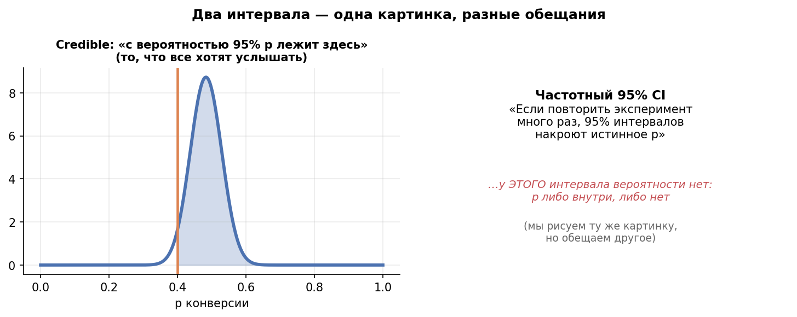
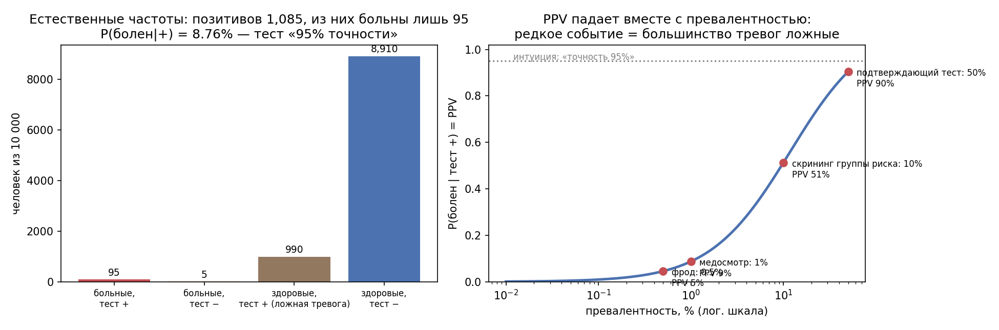

# Урок 5.2 — Интерпретация: credible vs confidence, вероятности по-человечески

**Цель урока:** различать CI и байесовский интервал, посчитать base rate и P(B>A) с явными условиями модели.

**Перед уроком:** [проверьте зависимости темы](../../PREREQUISITES.md); обозначения — в [словаре](../../GLOSSARY.md).

## Зачем это аналитику

Урок 1.3 закончился обещанием: «формулировка "с вероятностью 95% параметр внутри" — это уже credible interval байесовцев; его мы честно построим в М5.2». Сегодня выполняем. Проблема, ради которой всё затевается: продакт «ЕдаДома» читает отчёт «95% CI конверсии баннера = [10,1%; 14,2%]» и слышит «конверсия с вероятностью 95% лежит между 10,1 и 14,2%». Аналитик знает (урок 1.3), что это неправда — но правильная формулировка про «95 из 100 повторений эксперимента» убивает разговор: стейкхолдер думает про *этот* баннер, а не про ансамбль несуществующих повторений.

Байесовский credible interval говорит ровно то, что хочет услышать бизнес — и делает это честно, потому что в байесовской оптике параметр действительно случаен. Байесовская модель также даёт $P(B>A)$ — «вероятность, что новый баннер лучше старого», прямой ответ на вопрос, который все задают аналитику; ; отдельно разберём base rate fallacy — ошибку «точность 99%, значит почти всё поймали», на которой горят антифроды, скоринги и скрининги.

И рамка дисциплины: этот урок — про *перевод*, а не про «байес лучше». В рассматриваемом большом регулярном примере при слабом prior credible и CI численно близки (проверим в практике); различие — в том, что вам разрешено про них говорить.

## Теория

### 1. Доверительный vs credible: две интерпретации одного числа

Та же задача — 120 заказов на 1000 визитов (12,0%) — двумя языками:

| | Частотный 95% CI (Вильсон) | Байесовский 95% credible, плоский априор |
|---|---|---|
| число | [10,13%; 14,16%] | [10,13%; 14,16%] |
| что случайно | интервал (процедура), параметр фиксирован | параметр, интервал фиксирован |
| что можно говорить | «если повторять эксперимент и строить интервал по этой формуле, ~95% интервалов накроют истинную конверсию» | «с вероятностью 95% конверсия лежит в этом интервале» |
| когда определена «95%» | до данных — свойство процедуры | после данных — свойство апостериора |

Контраст с уроком 1.3: там мы честно говорили, что для конкретного (фиксированного) параметра и конкретного интервала накрытие — факт 0 или 1, а «95%» живёт в ансамбле. Байесовец кладёт случайность *в параметр*: конверсия — случайная величина, мы посмотрели на её апостериор Beta(121, 881) (плоский априор Beta(1,1) + 120/880) и отрезали 2,5% хвостов — вероятность 95% приписана интервалу законно.

Почему числа совпали? Слабый prior добавил мало относительно 1000 наблюдений, и апостериор оказался «данными в байесовской упаковке»; равносторонний credible Beta почти повторяет интервал Вильсона (расхождение в практике — 0,002 п.п.). Но это совпадение хрупкое: с информативным априором Beta(8,92) (историческая конверсия 8%) credible уезжает в [9,81%; 13,60%] — а частотный CI остался при своих, ему неоткуда взять историю. При достаточно информативных данных слабые priors дают близкие интервалы; это асимптотическое совпадение, а не отказ от prior.

*Рис. 1. Одно число, две валюты: гарантия CI — на ансамбль, вероятность credible — на этот интервал.*

### 2. Почему стейкхолдеры понимают второе и не понимают первое

Люди рассуждают о единичных событиях на ура: «вероятность дождя 70%», «шанс доставки за 30 минут — 90%». Ансамблевое «в 70% дней с такими условиями…» никому не нужно — думать ансамблем нечеловечно. Поэтому:

- интерпретация CI как вероятностного высказывания — **самая распространённая ошибка применения статистики** (тот же список, что в уроке 2.1 про p-value);
- она же — **наименее фатальная**, если априор плоский: числа совпадают, «неправильная» интерпретация даёт правильное число;
- и она становится **реально опасной**, когда априор информативен (credible уехал) или когда «95%» используют как гарантию там, где нужны частотные свойства (раздел 7).

Практический протокол: в отчёте подписывать, чьи это 95%. «95% credible (априор Beta(8,92) из истории запусков)» — легитимно как есть; «95% CI Вильсона» — читать как «разумный диапазон», а вероятностную фразу не произносить. Смешение валют — ошибка №7 урока 5.1.

### 3. P(B>A): высказывание, которого все ждут

Два апостериора — контроль A: Beta(601, 4401), тест B: Beta(646, 4356) (баннер, n = 5000 на группу, плоские априоры). Сэмплируем из обоих Монте-Карло (Курт: «в скольких мирах B лучше A»), сравниваем пары:

$$P(B > A) = \Pr\big(\theta_B > \theta_A \mid D\big)$$

Это ровно то, что спрашивает продакт: «новый баннер лучше?» — «с вероятностью 91%». Никаких «отвергаем/не отвергаем», никакого пересказа через вероятность данных. Словарь перевода (проверен в практике Монте-Карло):

| z-статистика | p двустороннее | частотный вердикт (α=5%) | P(B>A) | 1 − p одностороннее |
|---|---|---|---|---|
| 0,52 | 0,60 | не отвергаем | 69,7% | 69,8% |
| 1,00 | 0,32 | не отвергаем | 84,1% | 84,2% |
| 1,36 | 0,17 | не отвергаем | **91,4%** | 91,4% |
| 1,98 | 0,047 | отвергаем | 97,7% | 97,6% |
| 2,48 | 0,013 | отвергаем | 99,3% | 99,3% |

Три чтения таблицы. Первое: при больших n, нормальной аппроксимации, положительном B−A и слабых априорах $P(B>A) \approx 1 - p_{\text{одностор}}$ — это **перевод, а не новая информация**: «92%» звучат увереннее «p = 0,17», но содержат ровно то же. Второе: психологически перевод решает — «p = 0,17» стейкхолдер слышит как «тест провален», «вероятность 91%, что баннер лучше» — как «почти наверняка лучше», поэтому вместе с вероятностью нужно указывать величину эффекта, интервал и условия модели. Третье: настояще-новое у байеса — вопросы, которых у p-value нет вовсе: $P(B > A + 0{,}5\ \text{п.п.})$, ожидаемый лифт $E[B-A]$, риск просадки $P(B < A - 1\ \text{п.п.})$, expected loss как правило остановки (урок 5.3).

*Рис. 2. Отдельный численный пример из урока 5.3: A=1012/10000, B=1063/10000, Beta(1,1); P(B>A)≈88%, двусторонний p≈0,237. Таблица выше показывает другие z-значения.*

### 4. Base rate fallacy: медицинский тест на пальцах

Классика (числа из [Ravichandran]). Скрининг: чувствительность 95% (больной получает «+»), специфичность 90% (здоровый получает «−»). Болезнь редкая — 1%. Вопрос: человек получил «+» — какова вероятность, что он болен? Интуиция орёт «95%!» и ошибается в 11 раз.

Считаем **естественными частотами** «на 10 000 человек» — способ, после которого формула Байеса становится очевидной:

| | тест «+» | тест «−» | всего |
|---|---|---|---|
| **больны** (1% = 100) | 95 | 5 | 100 |
| **здоровы** (9 900) | 990 | 8 910 | 9 900 |
| **итого** | **1 085** | 8 915 | 10 000 |

$$P(\text{болен} \mid +) = \frac{95}{95 + 990} = \frac{95}{1085} \approx 8{,}76\%$$

Из каждых ~11 положительных болен один. Формула Байеса просто разворачивает условие: тест характеризуется $P(+ \mid \text{болен}) = 95\%$, а решение требует $P(\text{болен} \mid +)$ — и между ними стоит превалентность, которая у редких болезней топит результат: 990 ложных тревог от 9 900 здоровых перекрикивают 95 находок. PPV растёт с превалентностью (кривая в практике): при 10% — уже 54%, при 50% — 90%; на редких событиях доминируют ложные тревоги.

*Рис. 3. Естественные частоты на 10 000: 95 больных из 1 085 положительных = 8.76% (из практики).*

### 5. Прокси к бизнесу: «точность 99%» ни о чём

Та же арифметика — про антифрод «ЕдаДома». Вендор: «модель ловит фрод с точностью 99,5%». Фрод — редкое событие: 0,5% заказов. Чувствительность 90%, ложные срабатывания 1% честных заказов. Естественные частоты на 10 000 заказов: 50 фродовых → поймано 45; 9 950 честных → 99 заморожены зря. Из 144 алертов фрод — 45: $P(\text{фрод} \mid \text{алерт}) = 31\%$. Два вывода:

1. **Метрика «accuracy» на дисбалансе бессмысленна**: модель «все заказы честные» даёт accuracy 99,5%, ничего не делая. Классификационный аналог — accuracy paradox; ловите его в каждом питче.
2. **Без превалентности характеристики модели не интерпретируются**: те же 90%/1% в категории с фродом 5% дали бы PPV 83% — совсем другая экономика. Спрашивать надо: какова базовая ставка события и что стоит ложная тревога (заморозка честного заказа = саппорт + задержка + испорченный вечер клиента).

Это же — подводный камень «точности» скорингов, алертов, скринингов кандидатов: везде, где событие редкое, инвертируйте условие и считайте естественные частоты.

### 6. Правило Кромвеля: данные перевешивают, но медленно

Правило Кромвеля (Курт пересказывает письмо Оливера Кромвеля: «помыслите, что вы можете ошибаться»): не приписывайте никакой гипотезе априорную вероятность 0 — данные никогда её не поднимут. Мягкая версия — про скорость: **данные перевешивают априор, но при сильном априоре — медленно**. Арифметика урока 5.1: скептик с априором Beta(90,10) и честная монета — нужно ~700 бросков, чтобы апостериорное среднее опустилось до 0,55. В практике этого урока то же в АБ-форме: скептический априор «баннеры почти не меняют конверсию» с весом 1000 юзеров опускает P(B>A) с 91,4% до 89,4%, с весом целой выборки (5000) — до 83,5%: мнение эксперта не отменяет данные, но и не сдаётся мгновенно.

Практическое следствие: сильное априорное убеждение в отчёте — не украшение и не нейтральность, а позиция с весом; показывайте P(B>A) при нескольких априорах, и видно будет, чья позиция выигрывает.

### 7. Когда байесовские вероятности НЕ легитимны

$P(B>A) = 91\%$ — это высказывание об убеждении при данном априоре и данной модели. Оно **не является** частотной гарантией, и выдавать его за гарантию — подмена (зеркальная к CI-ошибке из раздела 2). Три зоны, где нужны именно гарантии:

1. **Внешние требования к доказательствам:** формат анализа задаётся конкретным протоколом и регулятором. Байесовские методы могут применяться, но operating characteristics дизайна, включая остановку, должны быть обоснованы; нельзя подменять требуемую error-rate гарантию одной posterior probability.
2. **Поток однотипных решений**: АБ-платформа гонит сотни тестов в квартал, и бизнес управляет долей ложных раскаток по всему потоку. Частотные гарантии аддитивны по ансамблю; байесовские вероятности — только при калибровке (отдельная работа: проверять, что в 90% тестов с P=90% B действительно лучше).
3. **Останавливаемость**: миф «байес позволяет останавливаться когда захочешь,$p$-хакинг невозможен» — ложь; при агрессивном подглядывании (урок 3.7) байесовские критерии тоже накручиваются, просто медленнее и иначе. Честный разбор — урок 5.3.

Итоговая рамка модуля: частотник продаёт гарантию процедуры, байесовец — вероятность утверждения. Обман — продавать одно под видом другого.

## Разбор на данных

Баннер «Завтраки за 199 ₽» на главной «ЕдаДома». Метрика — конверсия в заказ, n = 5000 на группу: контроль A — 600 заказов (12,0%), тест B — 645 (12,9%).

**Частотный разбор** (инструменты М2.1): $\hat{\Delta} = +0{,}9$ п.п.; $SE = 0{,}66$ п.п.; $z = 1{,}36$; $p = 0{,}173$ — не отвергаем H0; 95% CI эффекта $[-0{,}4;\ +2{,}2]$ п.п. Отчёт: «статистически значимого эффекта не обнаружено». Продакт слышит «баннер не работает» — и это неверный вывод из верного расчёта: при5000 на руку мощность против+1п.п. составляет примерно33%; результат часто останется незначимым, но «почти наверняка» — преувеличение

**Байесовский разбор** (плоские априоры, Монте-Карло 300 000 сэмплов): апостериоры A: Beta(601, 4401), B: Beta(646, 4356). Читаем с апостериора всё, что спрашивает бизнес:

| вопрос стейкхолдера | ответ |
|---|---|
| «B лучше A?» | $P(B>A) = 91{,}4\%$ |
| «Насколько лучше?» | ожидаемый лифт $E[B-A] = +0{,}90$ п.п. |
| «А если требовать запас?» | $P(B > A + 0{,}5\ \text{п.п.}) = 72{,}7\%$ |
| «Как сильно можем проиграть?» | $P(B < A - 1\ \text{п.п.}) = 0{,}2\%$ |

Формулировка для отчёта: «с вероятностью 91% баннер лучше; ожидаемый эффект +0,9 п.п.; вероятность проигрыша более 1 п.п. — 0,2%». Это то же самое z = 1,36, но в валюте решения.

Проверка устойчивости (правило раздела 6): скептический априор «баннеры не работают» с весом 1000 юзеров → P(B>A) = 89,4%; с весом 5000 (целая выборка) → 83,5%. Вывод «скорее работает, но недоказанно уверенно» живёт при всех априорах.

Рекомендация: эффект маловероятно отрицательный и с большой вероятностью положительный, но уверенность 91% — это не 97–98%, при которых обычно раскатывают (соответствие p ≈ 0,047–0,08 из словаря). Варианты: докатать выборку (n вырастет — P(B>A) уйдётся к 0 или 100%), или решение по expected loss с учётом стоимости раскатки — аппарат урока 5.3. Заодно base-rate-санитария решения: фича дежурная, таких баннеров в квартал 40, априорная доля работающих ~20% — как редкая болезнь, она съедает уверенность (тема байес-факторов и априорных шансов — Курт гл. 16–18, следующий урок).

## Подводные камни

1. **«С вероятностью 95% параметр в этом CI».** Делают: частотный CI читают как credible. Грозит: накопление решений на «вероятностях», которых не было; провал на собеседовании. Правильно: CI — ансамблевая гарантия (урок 1.3); вероятностная фраза легальна только для credible и только с указанием априора.
2. **P(B>A) = 91% читают как «+91% роста».** Делают: путают вероятность превосходства с размером эффекта. Грозит: протокол с фантастической экономикой. Правильно: P(B>A) — про знак, размер — E[B−A] и перцентили апостериора; в отчёте всегда пара «вероятность + эффект».
3. **Требуют от P(B>A) частотного порога.** Делают: «раскатываем при P(B>A) > 95%» без калибровки, как будто это гарантия FPR 5%. Грозит: доля ложных раскаток не контролируется (априоры плывут от теста к тесту). Правильно: порог по P(B>A) — бизнес-правило (с expected loss, 5.3); если нужна гарантия по ансамблю — частотный контроль или калибровка вероятностей.
4. **«Точность 99%» без превалентности.** Делают: покупают антифрод/скрининг по accuracy. Грозит: 99% алертов — честные клиенты (при редком событии); или модель «всё негативно» побеждает в тендере. Правильно: precision (PPV) на реальной базовой ставке + стоимость ложной тревоги; инвертировать условие естественными частотами.
5. **Естественные частоты на тесном знаменателе.** Делают: превалентность 0,1% считают «на 100 человек» — больных меньше одного, округление съедает всю арифметику. Грозит: «нулевых больных нельзя поймать» и прочие артефакты. Правильно: знаменатель, при котором редкая ветка даёт целые числа (0,1% — на 100 000).
6. **Списывают расхождение CI/credible на «шум».** Делают: видят credible [9,8%; 13,6%] против CI [10,1%; 14,2%] и не могут объяснить разницу. Грозит: доверие к обоим числам падает, вопрос «какое верное?» без ответа. Правильно: оба верные в своих валютах; расхождение = вклад априора (здесь 100 псевдонаблюдений истории) — и это полезная диагностика чувствительности, а не баг.
7. **Миф о бесплатном подглядывании.** Делают: «мы байесы, смотрим P(B>A) каждый день и останавливаемся на 95%». Грозит: накрутка уверенности при агрессивном мониторинге — зеркальный peeking из урока 3.7. Правильно: останавливаемость — свойство процедуры, его проверяют (expected loss, гарантии остановки — урок 5.3), а не получают автоматически сменой школы.

## Практика

Файл [practice_5_2.py](practice/practice_5_2.py) (percent-формат, numpy/scipy/matplotlib/pandas, seed зафиксирован). Три блока:

1. **CI vs credible на одной задаче** (120/1000): Вальд, Вильсон, credible при трёх априорах ([practice_5_2_ci_vs_cri.png](images/practice_5_2_ci_vs_cri.png)).
2. **Base rate**: естественные частоты на 10 000 + кривая PPV от превалентности + антифрод «ЕдаДома» ([practice_5_2_base_rate.png](images/practice_5_2_base_rate.png)).
3. **P(B>A) Монте-Карло** (600/5000 против 645/5000) против p-value + словарь перевода + чувствительность к скептическому априору ([practice_5_2_p_b_over_a.png](images/practice_5_2_p_b_over_a.png)).

Что должны увидеть (числа реального запуска):

- Вильсон [10,13%; 14,16%] и credible-плоский [10,13%; 14,16%]: расхождение **0,0024 п.п.** — одно и то же число в двух валютах; информативный априор Beta(8,92) уводит credible в [9,81%; 13,60%];
- base rate: P(болен|+) = **8,76%** (95 из 1 085 позитивов), «точность 95%» означает «болен каждый одиннадцатый»; антифрод: P(фрод|алерт) = **31,1%**, при том что тривиальная модель «все честные» даёт accuracy 99,5%;
- P(B>A) = **91,4%** при p = 0,173 — это близко к 1 − p_одностороннее в данном большом бинарном примере со слабым prior; равенство не является универсальным; словарь: p = 0,60/0,32/0,13/0,047/0,013/0,003 ↔ P(B>A) = 70/84/93/98/99,3/99,8%;
- скептический априор (среднее 12%): вес 1000 → 89,4%, вес 5000 → 83,5% — данные перевешивают любое мнение (Кромвель), но сильное мнение умирает медленно.

## Домашнее задание

**Задача 1.** Экспресс-тест: чувствительность 99%, специфичность 99%, превалентность 0,1%. Положительный результат — с какой вероятностью человек болен? Посчитайте естественными частотами на 100 000 человек.

Ответ

На 100000 человек:99 истинных и 999 ложных положительных, PPV=99/1098≈9,0%. После второго положительного результата получится≈91% только при conditional sensitivity/specificity99%/99% в этой отобранной группе, например при условной независимости ошибок тестов по статусу болезни. При зависимых ошибках такой автоматический пересчёт неверен.

**Задача 2.** Антифрод «ЕдаДома» v2: чувствительность 90%, ложные срабатывания 2%, фрод — 0,3% заказов. Из 100 алертов сколько честных заказов заморожено зря? Какая accuracy у модели и у тривиальной «все заказы честные»?

Ответ

На 100 000 заказов: фрод 300 → пойман 270; честных 99 700 → заморожено 1 994. P(фрод|алерт) = 270/2264 ≈ 11,9% — из 100 алертов зря заморожено **~88**. Accuracy модели = (270 + 97 706)/100 000 ≈ 98,0%; тривиальная модель даёт 99,7% — «хуже» по accuracy, хотя не калечит честные заказы. Метрика для редких событий — precision/recall и деньги, не accuracy.

**Задача 3.** Тест дал двусторонний p = 0,06. Коллега-байесовец говорит: «P(B>A) ≈ 97%». Он прав? Что изменится с информативным априором и что сказать продакту?

Ответ

При слабом prior, нормальном приближении и **положительном** наблюдаемом B−A: P(B>A)≈1−p_two/2=.97. При отрицательном знаке это≈.03. Сам p=.06 не определяет ни знак, ни размер эффекта. Информативный prior меняет результат; показываем sensitivity и posterior effect interval.

**Задача 4.** Аналитик доложил: «Конверсия лендинга — 12,0%, 95% CI [11,2%; 12,8%], значит с вероятностью 95% конверсия лежит между 11,2% и 12,8%». Исправьте фразу двумя способами: честная частотная формулировка и легальная байесовская.

Ответ

Частотная: «если строить интервал по этой формуле в повторениях эксперимента, ~95% интервалов накроют истинную конверсию; про этот конкретный интервал — "разумный диапазон"». Байесовская: «95% credible = [11,2%; 12,8%] при априоре ___ (плоском/историческом) — с вероятностью 95% конверсия здесь». Вероятностная фраза становится легальной только после того, как построен credible и назван априор.

**Задача 5.** Вендор сообщает: «P(B>A) = 99%» на тесте с n = 50 на группу. Что проверить, прежде чем нести результат продакту?

Ответ

Чек-лист подозрительного: (1) какой априор — информативный априор, «дружащий» с B, легко делает 99% из слабых данных (чувствительность: пересчитать при плоском); (2) размер эффекта — при n = 50 даже огромная разность оценена с гигантской ошибкой, смотреть E[B−A] и credible эффекта; (3) сколько тестов прогнано и как часто смотрели (подглядывание накручивает и байесовские вероятности — камень №7); (4) калибровка вендора: в скольких его исторических «99%» B действительно был лучше. Высокая вероятность — не гарантия, и точно не размер эффекта.

## Шпаргалка

1. CI: «в 95% повторений интервал накроет параметр» — свойство процедуры, до данных. Credible: «с вероятностью 95% параметр здесь» — свойство апостериора, после данных.
2. При плоском априоре credible ≈ Вильсон (расхождение доли п.п.): числа одинаковые, речи разные. Информативный априор уводит credible — и это диагностика чувствительности.
3. В отчёте подписывать, чьи 95%: «95% credible (априор …)» — можно читать вероятностно; «95% CI» — нельзя.
4. $P(B>A) \approx 1 - p_{\text{одностороннее}}$ в больших регулярных выборках, нормальной аппроксимации и при слабом prior; для другого prior/модели это не универсальный перевод; словарь: p=0,32↔84%, p=0,17↔91%, p=0,047↔98%.
5. Новое у байеса — не P(B>A), а остальной комплект: $E[B-A]$, $P(B>A+\delta)$, риск просадки, expected loss (5.3).
6. Base rate: инвертировать условие естественными частотами; «точность 95%» + превалентность 1% → P(болен|+) = 8,76% (каждый 11-й).
7. Accuracy на дисбалансе — ни о чём: «все честные» дают 99,5%. Мерить precision на реальной базовой ставке + цена ложной тревоги.
8. Знаменатель естественных частот — чтобы редкая ветка была целыми числами (0,1% → на 100 000).
9. Правило Кромвеля: не следует присваивать prior probability0 возможной гипотезе; данные могут преодолеть сильное, но не исключающее истину убеждение, но сильное — медленно (вес 5000 юзеров скинул 91,4% лишь до 83,5%).
10. Байесовская вероятность — не частотная гарантия: регуляторика, поток тестов, останавливаемость — зоны гарантий; не продавать одно за другое (зеркально к камню №1).

## Источники

- Уилл Курт, «Байесовская статистика…» (ДМК Пресс, 2021), гл. 13 (credible-интервалы через CDF/квантили), гл. 16–18 (коэффициент Байеса, апостериорные шансы, «когда данные не убеждают» — почему слабые данные не дают уверенности) — интерпретационное ядро урока (карточка: `materials/local/books-folder.md` §4).
- Освальдо Мартин, «Байесовский анализ на Python» (ДМК Пресс, 2020), гл. 1.3 (обобщение апостериора, HDI, прогнозирующие проверки) и гл. 5 (сравнение моделей, коэффициенты Байеса).
- Iuliia Averianova, «Байесовская статистика для специалистов по данным» (Medium, 2021) — https://medium.com/nuances-of-programming/байесовская-статистика-для-специалистов-по-данным-37d77c8e0daa (конспект: `materials/web/web-articles.md` §1): confidence ≠ credible «X% вероятности, что параметр внутри»; правило Кромвеля.
- Vaidyanathan Ravichandran, «Bayesian Statistics for Learners…» (LinkedIn, 2025) — https://www.linkedin.com/pulse/bayesian-statistics-learners-comprehensive-vaidyanathan-ravichandran-f8rtc/ (конспект: `materials/web/web-articles.md` §2): base rate fallacy с числами 95%/90%/1% → 8.76%; таблица сравнения подходов; критика байесовства.
- MCP Analytics, «Causal Inference Methods: A/B Testing, DiD, Propensity Scores & More» — https://mcpanalytics.ai/articles/causal-inference-methods (конспект: `materials/web/web-articles.md` §5.2): байесовский A/B как вероятностные утверждения («94% что B лучше A минимум на 3%»), ранняя остановка, цена — априор.
- Контраст с пройденным: урок 1.3 (анатомия CI и ансамблевая гарантия; обещание про credible), урок 2.1 (p-value = хвостовая вероятность статистики при H0; таблица заблуждений), урок 3.7 (peeking — почему останавливаемость не бывает бесплатной), урок 4.4 (коммуникация результатов стейкхолдерам — сюда ложится язык P(B>A)).
