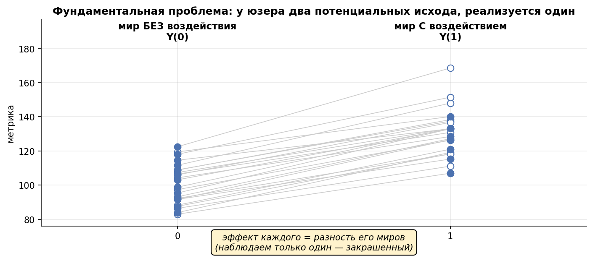

# Урок 6.2 — Potential outcomes: Y(1) и Y(0)

**Цель урока:** сформулировать эффект через потенциальные исходы, выбрать estimand и назвать условия идентификации.

**Перед уроком:** [проверьте зависимости темы](../../PREREQUISITES.md); обозначения — в [словаре](../../GLOSSARY.md).

## Зачем это аналитику

Продакт «ЕдаДома» приходит с вопросом: «Что будет с заказами, если продадим подписку „Прайм“ (бесплатная доставка) всем новым юзерам?» Это вопрос про **вмешательство** — $P(Y \mid do(X))$ из урока 6.1. И у него есть два соблазнительных ответа из наблюдательных данных, оба неверные:

- **«Посмотрим на тех, у кого уже есть»**: действующие подписчики заказывают на ~4 заказа в месяц больше остальных. Так говорят в 6.1: в подписку самоотбираются «голодные» — это конфаундер, а не эффект.
- **«Посмотрим до/после»**: после запуска Прайма заказы выросли на 9%. Этот соблазн ещё коварнее — сравнение «с самим собой» кажется чистым, ведь это те же люди. Почему это тоже не эффект — центральный вопрос этого урока.

Всё, что вы проходили в М1–М5, отвечало на вопросы про *наблюдаемые* данные: описать, сравнить, предсказать. Потенциальные исходы — грамматика, которая заставляет явно выписать, **какой ответ на какой вопрос вы вообще ищете**, и показывает, почему без эксперимента или сильных допущений этот ответ не восстановить. Это самый короткий путь к пониманию, за что именно мы платим рандомизацией — и что покупаем вместо неё в оставшихся уроках модуля.

## Теория

### 1. Два мира: потенциальные исходы и фундаментальная проблема

Для каждого юзера $i$ и воздействия $T$ определим **потенциальные исходы**:

$$Y_i(1) — \text{что будет с } i \text{ под лечением}, \qquad Y_i(0) — \text{что будет без него}.$$

Индивидуальный эффект (ITE): $\tau_i = Y_i(1) - Y_i(0)$. Наблюдаем же мы всегда ровно один из двух миров — тот, который реализовался:

$$Y_i^{obs} = T_i \cdot Y_i(1) + (1 - T_i) \cdot Y_i(0),$$

второй исход — **контрфакт**, потерянный безвозвратно. Это и есть **фундаментальная проблема каузального вывода** (Рубин; Ci2Lab CH-2): нельзя наблюдать один и тот же объект одновременно с воздействием и без. Интуиция из серии «CI на пальцах» (ч. 2): таблетка от головной боли и два параллельных мира — вы в одном приняли её, в другом нет, и разницу не увидит никто.

*Рис. 1. Потенциальные исходы в двух мирах; закрашен один наблюдаемый исход каждого юнита.*

Таблица двух миров (числа модельные, считаем руками):

| юзер | аппетит | T (самоселекция) | Y(0), мес | Y(1), мес | наблюдаем |
|---|---|---|---|---|---|
| А | высокий | 1 | 12,0 | 13,5 | **13,5** |
| Б | высокий | 1 | 10,0 | 11,5 | **11,5** |
| В | средний | 1 | 9,0 | 10,5 | **10,5** |
| Г | средний | 0 | 7,0 | 8,5 | **7,0** |
| Д | низкий | 0 | 6,0 | 7,5 | **6,0** |
| Е | низкий | 0 | 4,0 | 5,5 | **4,0** |

«Божественная перспектива» (полная таблица) даёт $\mathrm{ATE} = \overline{Y(1) - Y(0)} = 1{,}5$ заказа. В реальности серые столбцы потеряны: аналитик видит только 13,5; 11,5; 10,5; 7,0; 6,0; 4,0 — и любую статистику приходится строить из них. Взгляд Денга (гл. 4): это **задача о пропущенных данных** — у каждого юзера не хватает ровно одного из двух исходов, и весь каузальный вывод — про то, при каких условиях пропуски «лечатся».

### 2. Эстиманды: сначала вопрос, потом метод

Раз контрфакт потерян, оцениваем не индивидуальные эффекты, а их **средние по группам** — и здесь начинается дисциплина эстимандов: «в чём эффект?» — это несколько разных вопросов.

| Вопрос продакта | Эстиманд | Определение | Чем отвечаем |
|---|---|---|---|
| «Что будет, если включим всем?» | **ATE** | $E[Y(1) - Y(0)]$ | рандомизация (А/Б); 6.4 при допущениях |
| «Что принесло уже случившееся тем, кто воспользовался?» | **ATT** | $E[Y(1) - Y(0) \mid T{=}1]$ | матчинг, DiD (6.3–6.4) |
| «В каком сегменте эффект больше?» | **CATE** | $E[Y(1) - Y(0) \mid X{=}x]$ | CATE-модели (6.4) |
| «Какова польза этому конкретному юзеру?» | **ITE** | $Y_i(1) - Y_i(0)$ | **недоступен принципиально** |
| «Эффект для тех, кого стимул реально подтолкнул?» | **LATE** | эффект для **compliers** | IV / encouragement (6.4, вскользь) |

Вскользь о compliers (подробнее — 6.4 и конспект Матросова, §10): когда лечение не назначается, а *предлагается*, популяция распадается на never-takers / always-takers / compliers (и дефайеров, которых обычно исключают монотонностью). Рандомизированный стимул (баннер, уведомление) двигает только compliers — и инструментальные методы оценивают эффект именно для них, а не для всех. Spotify прямо строит на этом encouragement-дизайны. Мораль урока: **эстиманд фиксируется до анализа** — это не педантизм, а та же дисциплина, что фиксация H0 и α до данных (урок 2.4): поменяешь вопрос по ходу — получишь «значимость» из гибкости.

*Рис. 2. ATE, ATT и CATE усредняют эффекты по разным популяциям.*

### 3. Почему «до/после» — не эффект: декомпозиция наивной разности

«Сравним юзера с самим собой» не решает проблему контрфакта, а подменяет его: **время меняется вместе с лечением**. Между «до» и «после» успевают: сезонность (январские каникулы — все дома, доставка растёт), тренды и акции конкурентов, параллельные релизы, внешние шоки, регрессия к среднему (запустили после аномально плохого месяца — М1.1, закон малых чисел). Кейс из серии «CI на пальцах» (ч. 3): внутренний чат-бот «дал +2% задач» по сравнению до/после, а сезонная компонента за тот же период была −5%.

Формально обе наивные конструкции ломает одна и та же алгебра. Для сравнения «участвовавшие vs нет»:

$$\underbrace{E[Y \mid T{=}1] - E[Y \mid T{=}0]}_{\text{наивная разность}} = \underbrace{E[Y(1) - Y(0) \mid T{=}1]}_{\text{ATT}} + \underbrace{\left(E[Y(0) \mid T{=}1] - E[Y(0) \mid T{=}0]\right)}_{\text{смещение отбора}}$$

(вывод: прибавить и вычесть $E[Y(0)\mid T{=}1]$ и применить consistency). Считаем на таблице из п. 1: наивная разность $= 11{,}83 - 5{,}67 = +6{,}17$; ATT $= 1{,}5$; смещение отбора $= 10{,}33 - 5{,}67 = +4{,}67$; проверка: $1{,}5 + 4{,}67 = 6{,}17$. Второе слагаемое — **разница базовых уровней** тех, кто попал в лечение и кто нет: голодные шли в «Прайм» и без него с более высоким Y(0). Для «до/после» — та же структура, только роль отбора играет «время другое»: $E[Y_{after}] - E[Y_{before}]$ = эффект + (что бы изменилось без лечения). Это одно равенство — самый рабочий инструмент урока: **любая наивная оценка = эффект для участников + смещение**, и вся задача каузального вывода — обнулить второе слагаемое, не убив первое.

### 4. SUTVA: где продукт ломает потенциальные исходы

Чтобы $\tau_i = Y_i(1) - Y_i(0)$ вообще имело смысл, лечение должно быть **стабильным единичным воздействием** — SUTVA (stable unit treatment value assumption), два пункта (Денг, гл. 4; конспект Матросова, §11):

1. **No interference**: $Y_i(t)$ не зависит от того, кто ещё получил лечение. Мой исход — функция моего лечения, не чужого.
2. **Consistency**: «лечение» — одна чётко определённая версия вмешательства; если написал $Y_i(1)$, то любой юзер с T=1 получил *то же самое* вмешательство, и $Y_i^{obs} = Y_i(T_i)$.

Где это ломается в продукте (все примеры — «ЕдаДома»):

- **Спилловор**: купон «приведи друга» — тестовый юзер делится промокодом с другом из контроля; чужое лечение течёт в твой исход.
- **Двусторонний маркетплейс**: тестовые юзеры занимают курьеров и слоты ресторанов — у контрольных растёт время доставки. Даже честная рандомизация юзеров интерферирует через общий ресурс (вы видели это в М4.3 как network effects).
- **Социальные функции**: отзывы, рейтинги, шеринг корзины — их читают и контрольные.
- **Ограниченный инвентарь**: реклама и промо каннибализируют общий спрос.

Consistency ломается тише: «новая выдача» на iOS и Android — разные бэкенды; «Прайм» в разных городах — разные условия; эффект лечения меняется во времени (новизна, М4.3). Формально это значит, что $Y(1)$ — не одно значение, а семейство, и «эффект» размыт.

Цена нарушения — в практике шага 3: при прямом эффекте купона 2,0 и утечке к другу 1,2 полная раскатка даст 3,2 заказа, а поюзерный А/Б увидит ~2,0 — **занижение на 37%** при идеально честной рандомизации. Лечение — в дизайне: юнит рандомизации там, где живёт интерференция (кластеры, гео, switchback — М4.3), и хирургически точное определение лечения в дизайн-доке (каких юзеров, какая версия, какой горизонт).

### 5. Рандомизация: почему А/Б — золотой стандарт

Монетка назначает T, не глядя на юзера — значит формально:

$$T \perp (Y(0), Y(1)) \quad \Rightarrow \quad E[Y \mid T{=}1] - E[Y \mid T{=}0] = E[Y(1)] - E[Y(0)] = \mathrm{ATE}$$

(та же декомпозиция из п. 3, но смещение отбора обнулилось: $E[Y(0)\mid T{=}1] = E[Y(0)\mid T{=}0]$). Прочитайте внимательно, *что именно* уравнялось: группы сравнимы **в среднем по всему — включая ненаблюдаемое**. Ни одна регрессия на наблюдаемых ковариатах такого не даёт: регрессия выравнивает по тому, что вы измерили и включили; монетка — по appetite, скрытым планам на отпуск и вкусу к суши. Именно поэтому А/Б — золотой стандарт: главное допущение ($T \perp (Y(0), Y(1))$) мы **делаем сами** дизайном, а не постулируем про мир. При рандомизации и ATT $=$ ATE (монетка не выбирает, кому лечение — эффект для получивших равен эффекту для случайного).

Две честные оговорки. Первая: «в среднем» — не «в конкретной выборке»; баланс проверяют A/A-тестами и SRM-чеками (М4.2), а не верой. Вторая: рандомизация убивает **смещение, но не шум**. Что остаётся за бортом золота: SUTVA (п. 4), комплайнс (лечение предлагают — получают не все; ITT из М4 отвечает «эффект предложения», LATE — эффект для compliers) и внешняя валидность (эффект на тесте ≠ эффект на всей популяции при гетерогенности — CATE, 6.4).

### 6. Ignorability: что придётся постулировать без монетки

Если рандомизации нет, чтобы та же алгебра сошлась, нужно условие **ignorability / unconfoundedness** (Денг, гл. 4; конспект Матросова, §11):

$$(Y(0),\, Y(1)) \perp T \mid X \quad — \text{«после учёта } X \text{ назначение лечения не зависит от потенциальных исходов»},$$

плюс **positivity**: у каждого значения X есть ненулевой шанс оказаться и в лечении, и в контроле (иначе $E[Y(0)\mid X{=}x]$ не оценить вовсе). По-русски: среди учтённых ковариат X должен лежать **весь backdoor-путь** из урока 6.1 — всё, что двигает и вступление в «Прайм», и заказы. Это тот же самый смысл в другом языке: SCM/PO — два фреймворка об одном (конспект, §4).

Три неприятные правды об ignorability: (1) она **непроверяема напрямую** — контрфактов в данных нет, «проверить независимость от Y(0), Y(1)» нельзя в принципе; (2) она не покупается объёмом — «мы законтролировали 30 ковариат» не приближает выполнимость (и часто ухудшает: коллайдеры из 6.1); (3) косвенные проверки возможны и обязательны — баланс ковариат, A/A на пре-периоде, плацебо-исходы, чувствительность к ненаблюдаемому (всё это — арсенал урока 6.5). Что с ней делают: методы 6.4 (матчинг, propensity score, IPW, doubly robust, DML) **эксплуатируют** ignorability при наблюдаемых X; методы 6.3 (DiD, RDD, synthetic control) **заменяют** её другими идентифицирующими предположениями (параллельные тренды, непрерывность на пороге). Выбор между ними — всегда выбор, какому непроверяемому условию вы верите больше.

## Разбор на данных

Полный прогон — [practice_6_2.py](practice/practice_6_2.py); здесь — числа реального запуска (seed зафиксирован) и их чтение.

**Шаг 1, два мира.** 5 000 юзеров, «аппетит» $U \sim N(0,1)$, вступление по самоселекции $p = \sigma(1{,}5U)$, истинный эффект всем $+1{,}5$ заказа. Божественная перспектива: ATE $= +1{,}50$. Наблюдаемая наивная разность: $+4{,}54$. Декомпозиция сходится копейка в копейку: наив $=$ ATT $({+}1{,}50)$ $+$ смещение отбора $({+}3{,}04)$. Корреляция — четыре заказа, причинность — полтора: разница и есть цена самоселекции.

**Шаг 2, рандомизация чинит.** Та же DGP, 2 000 параллельных миров: вступление назначает монетка 50/50. Распределение оценки по мирам: самоселекция — среднее $+4{,}64$ при sd 0,07 (узкий сгусток вокруг неверного числа — точность ≠ правильность); рандомизация — среднее $+1{,}50$ при sd 0,10. 95% CI накрывает истинный ATE в 94% миров. Точно как в теории: монетка убирает смещение, шум остаётся (его лечат объёмом и CUPED — М3.5).

**Шаг 3, SUTVA.** Пары друзей: прямой эффект купона 2,0, положительный spillover 1,2. При независимом поюзерном назначении чужое лечение в среднем одинаково в обеих группах, поэтому разность оценивает прямой эффект 2,0. Полная раскатка меняет оба назначения и даёт 3,2. Отдельная рандомизация пар целиком оценивает этот общий эффект; анализируем средние независимых пар, а не пользователей как независимые строки.

**Шаг 4, ATT ≠ ATE.** При $\tau_i=-1+2{,}2U$ получаем ATE около −1 заказа/мес, ATT около +0,12, наивную разность около +3,20. Это разные ответы о числе заказов. Из них нельзя вывести прибыльность подписки без платы, выручки и затрат; для экономического решения нужен отдельный outcome маржи.

## Подводные камни

1. **«До/после» как эффект.** Делают: «после запуска Прайма заказы +9%». Грозит: сезонность, тренды, параллельные релизы, регрессия к среднему едят эффект целиком или рисуют его из ничего (кейс чат-бота: «+2%» при сезонной компоненте −5%). Правильно: контрфакт «что было бы без запуска» — контрольная группа (DiD, 6.3), не прошлое того же объекта.
2. **Наивная разность — не «примерно эффект».** Делают: «ну смещение есть, но порядок величины верный». Грозит: в практике смещение $+3{,}04$ при эффекте $+1{,}5$ — оценка втрое больше; знак может переворачиваться (Симпсон из 6.1 — тот же механизм). Правильно: наивная разность = ATT + смещение; пока второе слагаемое не обосновано равным нулю, у вас нет оценки эффекта вообще.
3. **Эстиманд выбирают по ходу анализа.** Делают: посчитали три разности, показали ту, что «звучит лучше». Грозит: та же гибкость, что p-hacking (М2.4), только без p-value. Правильно: вопрос → эстиманд → метод фиксируются в дизайн-доке до данных (М4.1); ATE/ATT/CATE не взаимозаменяемы (практика: −1,02 / +0,12 / ...).
4. **Интерференция юзеров.** Разность зависит от exposure и доли лечёных. Положительный spillover в нашей аддитивной модели занижает эффект полной раскатки. Конкуренция за курьеров может ухудшать контроль и завышать его. Направление смещения нельзя переносить между механизмами. Выбираем единицу назначения и явно определяем интересующий contrast.
5. **Размытое лечение (consistency).** Делают: «эффект Прайма» при разных условиях по городам/платформам/версиях. Грозит: Y(1) — не одно вмешательство; оценка — среднее по неясной смеси. Правильно: определение лечения в дизайн-доке (какая версия, какой горизонт, кому показывается); разнородные версии — отдельные тесты.
6. **«30 ковариат = ignorability выполнена».** Делают: контролируют всё, что нашлось, и объявляют сравнение чистым. Грозит: ненаблюдаемое (скрытый аппетит, планы) остаётся в смещении, а коллайдеры из 6.1 добавляют новое. Правильно: ignorability непроверяема прямо — обосновывать доменно, проверять косвенно (баланс, A/A на пре-периоде, плацебо — 6.5), считать sensitivity-анализ.
7. **Перенос оценки не туда.** Делают: эффект на добровольцах RCT объявляют эффектом «для всех» (или наоборот: ATT подают как прогноз раскатки). Грозит: при неоднородности ATE ≠ ATT по знаку (−1,02 против +0,12 в практике) — решение будет противоположным. Правильно: эстиманд = вопрос решения; перенос между популяциями — отдельное обоснование (внешняя валидность).

## Практика

Файл [practice_6_2.py](practice/practice_6_2.py) (numpy/pandas/matplotlib, seed зафиксирован, графики сохраняются в `images/` этого модуля). В симуляции доступна божественная перспектива — генерируются оба мира, наблюдается один; это единственный способ увидеть смещение глазами. Четыре блока (кейс «ЕдаДома Прайм»):

1. **Два мира**: таблица Y(0)/Y(1)/ITE для первых юзеров; наивная разность и декомпозиция «наив = ATT + смещение отбора».
2. **Рандомизация чинит**: 2 000 миров, одна DGP — гистограмма оценок при самоселекции vs монетке; честный подсчёт покрытия 95% CI (300 миров).
3. **SUTVA-нарушение**: спилловор купона в парах друзей; поюзерный сплит vs кластерный по парам; механика сокращения бета-слагаемого ([practice_6_2_sutva.png](images/practice_6_2_sutva.png)).
4. **ATT ≠ ATE**: неоднородный эффект $\tau(U)$ + самоселекция; scatter индивидуальных эффектов с линиями ATE/ATT ([practice_6_2_att_ate.png](images/practice_6_2_att_ate.png)).

Что должны увидеть (числа реального запуска):

- наив $+4{,}54$ $=$ ATT $+1{,}50$ $+$ смещение $+3{,}04$ при истинном ATE $+1{,}50$ — декомпозиция сходится точно;
- рандомизация: центр на $+1{,}50$ (sd 0,10), CI накрывает истину в 94% миров; самоселекция: $+4{,}64$ (sd 0,07) — смещение стабильно, шум не при чём;
- SUTVA: поюзерный сплит $+1{,}97$ (только прямой эффект 2,0), полная раскатка 3,2, отдельный кластерный тест оценивает эффект около $+3{,}2$; занижение 37%;
- эстиманды: ATE $-1{,}02$, ATT $+0{,}12$, наив $+3{,}20$ — три ответа на три разных вопроса, включая противоположные решения.

## Домашнее задание

**Задача 1.** По таблице (эффект неоднороден!) посчитайте ATE, ATT, наивную разность и покажите декомпозицию. Что оценит разность средних, если T назначить честной монеткой?

| юзер | T | Y(0) | Y(1) |
|---|---|---|---|
| А | 1 | 12 | 14 |
| Б | 1 | 10 | 11 |
| В | 0 | 9 | 10 |
| Г | 0 | 7 | 9 |
| Д | 0 | 6 | 6,5 |
| Е | 0 | 4 | 4,5 |

Ответ

ITE: +2; +1; +1; +2; +0,5; +0,5. ATE $= 7/6 \approx +1{,}17$; ATT $= (2+1)/2 = +1{,}5$ (в лечение попали с большими эффектами); наивная разность $= 12{,}5 - 6{,}5 = +6{,}0$; смещение отбора $= E[Y(0)\mid T{=}1] - E[Y(0)\mid T{=}0] = 11 - 6{,}5 = +4{,}5$; проверка: $1{,}5 + 4{,}5 = 6{,}0$. При монетке оценка несмещённа для ATE (в ожидании по жребиям); в конкретной реализации из 6 юзеров разброс огромен — может уйти даже в минус; несмещённость — про среднее по всем возможным жребиям (в практике: sd 0,10 при n=5000).

**Задача 2.** «Прайм» запустили 10 января, к февралю заказы на юзера +9% к декабрю. Назовите минимум три конкретных угрозы интерпретации «эффект Прайма = +9%» и скажите, какая конструкция контроля закрыла бы каждую.

Ответ

(1) Сезонность: январские каникулы — все дома, доставка естественно растёт к декабрю (корпоративы, другие паттерны) — закрыло бы сравнение с контрольным сегментом/городами без Прайма (DiD, 6.3). (2) Регрессия к среднему: если запускали после аномально слабого декабря, рост был бы и без Прайма — закрыла бы рандомизация или хотя бы pretrends на длинном пре-периоде. (3) Параллельные изменения: новогодние промо, маркетинг, релизы других фич — контрольная группа делит с вами всё, кроме лечения. (4) Композиция: в январе мог смениться микс новичков/старичков — стратификация по когортам. Общий принцип: контрфакт «что было бы без запуска в этот же момент» ≠ «тот же объект в прошлом».

**Задача 3.** Фича «шеринг корзины»: юзер делится списком покупок, получатель (в любой группе) тоже меняет поведение. Какой юнит рандомизации выберете и какой эстиманд честно оценит поюзерный А/Б в этих условиях?

Ответ

Интерференция идёт через получателей шера. Возможны кластеры соцграфа, гео-дизайн или switchback, если они действительно ограничивают spillover и carryover. Поюзерный тест оценивает contrast при конкретном механизме и доле назначения. Он не обязан совпадать с полной раскаткой; направление отличия зависит от механизма. В аддитивном примере с положительным spillover он ниже общего эффекта, при конкуренции за ресурс может быть выше.

**Задача 4.** Продакт формулирует три вопроса: (а) «включать ли Прайм в онбординг всем новичкам?»; (б) «сколько пользы принёс Прайм купившим в прошлом квартале?»; (в) «кому из новичков предлагать в первую очередь?». Назовите эстиманд для каждого и чем его честно оценивать.

Ответ

(а) ATE на популяции новичков — рандомизированный тест с предложением подписки в онбординге (если оценивать «эффект предложения», ITT; если «эффект использования» — LATE для compliers, 6.4); (б) ATT — матчинг/DiD на исторических данных (6.3–6.4), потому что «купившие» — самоселекция; (в) CATE по признакам юзера — CATE-модели/uplift (6.4), а сегментные разрезы RCT как самая честная учительница гетерогенности (с осторожностью М4.4).

**Задача 5.** Для наблюдательного сравнения «участники Прайм vs остальные» выпишите X, необходимое для ignorability, и пометьте: что «ЕдаДома» реально наблюдает, а что придётся проксировать. Какая часть вашего списка ненаблюдаема в принципе?

Ответ

Типовой список: частота заказов и средний чек до вступления (наблюдается), гео/плотность ресторанов (наблюдается), размер домохозяйства (частично), склонность к подпискам вообще и планованные изменения образа жизни (переезд, диета, отпуск — не наблюдается), ожидаемая частота заказов на горизонте (именно она и «двигает» вступление — не наблюдается в принципе). Вывод: ignorability для Прайма сомнительна — «скрытый аппетит» влияет и на T, и на Y(0); поэтому 6.4 будет окружать такое сравнение валидацией (баланс, A/A на пре-периоде), а 6.5 — sensitivity-анализом к ненаблюдаемому.

## Шпаргалка

1. Потенциальные исходы: $Y_i(1)$, $Y_i(0)$; наблюдается один, $Y^{obs} = T \cdot Y(1) + (1-T) \cdot Y(0)$; второй — потерянный контрфакт (фундаментальная проблема каузального вывода).
2. Каузальный вывод = задача о пропущенных данных: у каждого юзера не хватает ровно одного из двух исходов.
3. Эстиманд до метода: ATE «что будет всем» / ATT «что принесло воспользовавшимся» / CATE «где эффект больше» / ITE (недоступен) / LATE (compliers, при стимулах). При рандомизации ATT = ATE.
4. Ключевая декомпозиция: наивная разность $=$ ATT $+$ смещение отбора по базовому уровню $E[Y(0)\mid T{=}1] - E[Y(0)\mid T{=}0]$.
5. «До/после» — не эффект: время — конфаундер (сезонность, тренды, регрессия к среднему); контрфакт строится контрольной группой, не прошлым.
6. SUTVA = no interference (мой исход не зависит от чужих лечений) + consistency (лечение — одна чёткая версия). Продукт ломает: спилловоры, двусторонний маркетплейс, соцфункции, разные версии/условия.
7. Цена интерференции: поюзерный тест оценивает эффект при данной доле лечения; в аддитивной модели практики полная раскатка = прямой эффект + spillover (в практике 2,0 против 3,2 — занижение 37%).
8. Рандомизация: $T \perp (Y(0), Y(1))$ — группы уравнены в среднем по всему, включая ненаблюдаемое; убирает смещение, не шум; главное допущение создаём дизайном. Остаются: SUTVA, комплайнс (ITT/LATE), внешняя валидность.
9. Для идентификации через adjustment нужно ignorability: $(Y(0), Y(1)) \perp T \mid X$ + positivity — непроверяемо прямо; покупается доменной аргументацией и косвенными проверками (баланс, A/A на пре-периоде, плацебо — 6.5).
10. SCM/DAG (6.1) и PO — два языка одного: ignorability = «все backdoor-пути закрыты наблюдаемыми X».

## Источники

- С. Матросов, конспект «Causal Inference» (abba_testing) — `materials/local/causal-inference-doc.md`: §6 (potential outcome, модель Рубина, таблица «Джо»), §7 (фундаментальная проблема, ITE), §8 (рандомизация как балансировка потенциальных исходов, ATT=ATE), §10 (ATE/ATT/LATE, типология compliers, таблица «метод → эстиманд»), §11 (SUTVA, ignorability).
- Alex Deng, «Causal Inference and Its Applications in Online Industry» — `materials/web/alexdeng-causal-book.md`: гл. 3 (рандомизированный эксперимент, устранение selection bias), гл. 4 (PO-фреймворк: контрфактическая пара, unconfoundedness, SUTVA, связь с missing data, IPW/doubly robust — превью 6.4).
- Ci2Lab, Applied Causal Inference Course — `materials/local/applied-causal-inference-course.md`: CH-2 (лестница причинности, do-оператор, фундаментальная проблема, A/B как do(X)), CH-4 (SCM, контрфакты, сквозной пример с расчётом ATE).
- Влад Шереметьев, серия «Causal Inference на пальцах» (shelter_analytics) — `materials/telegram/telegraph-causal-series.md`: ч. 2 (таблетка и параллельные миры, Y(1)−Y(0), почему «сравнить с собой» не работает, три кейса выбора контрфакта: TheraBot/самокаты/программа лояльности, unconfoundedness), ч. 3 (рандомизация как золотой стандарт, spillover/SUTVA, non-compliance и ITT).
- Связь с пройденным: урок 6.1 (DAG/конфаундеры — тот же смысл в другом языке), уроки 3.1/3.2 (дизайн А/Б и юнит рандомизации), 4.2 (A/A и SRM — как проверяют «уравнивание в среднем»), 4.3 (интерференция, network effects, switchback/geo), М2.4 (дисциплина фиксации допущений до данных). Дальше: 6.3 (квазиэксперименты — заменители ignorability), 6.4 (матчинг/PSM/IPW/DML — эксплуатация ignorability), 6.5 (проверка доверия: баланс, плацебо, sensitivity).
