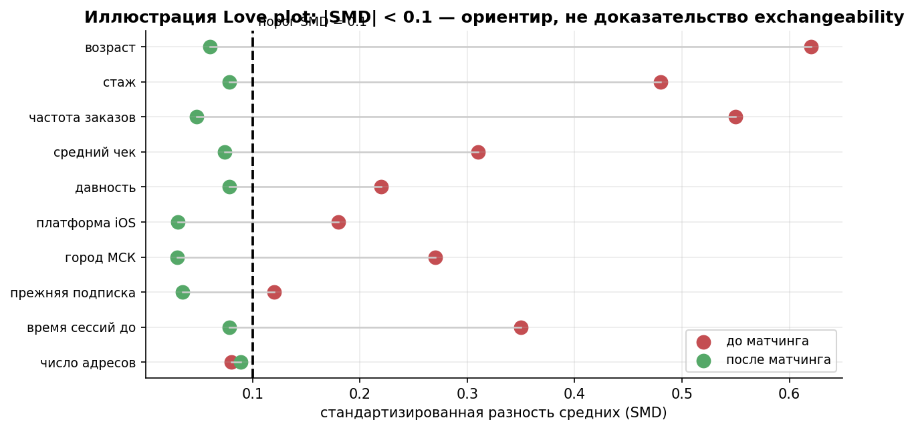
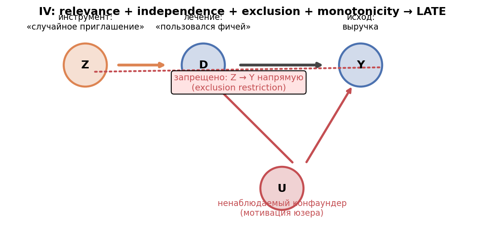
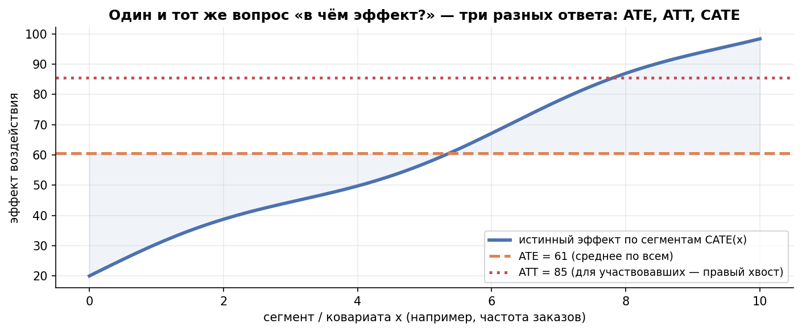

# Урок 6.4 — Наблюдательные данные: матчинг, IPW, IV, double ML

**Цель урока:** сравнить adjustment, matching, IPW, doubly robust, IV и ML-оценщики по цели, допущениям и неопределённости.

**Перед уроком:** [проверьте зависимости темы](../../PREREQUISITES.md); обозначения — в [словаре](../../GLOSSARY.md).

## Зачем это аналитику

В 6.3 вы закрыли сценарий «воздействие уже выкачено, но есть динамика до/после» — DiD, RDD, синтетический контроль. Остался самый частый и самый скользкий случай: **одиночный срез наблюдательных данных**. На «ЕдаДома» подписка «ЕдаПлюс» (бесплатная доставка за 299 ₽/мес) доступна всем — кликнул и подписался. Рандомизации нет, до/после нет, порога нет. Продакт спрашивает: «Подписка увеличивает заказы?» Наивный ответ дают два SQL-запроса: у подписчиков 7,2 заказа/мес, у остальных — 4,8. «+50%, раскатываем!» — и это чистейший selection bias: подписку берут активные пользователи из богатых районов мегаполисов, которые и без подписки заказывают больше (вы это видели в 6.1 на DAG и в 6.2 на potential outcomes).

Урок отвечает на три вопроса, которые остаются после 6.3:

1. **Вся вариация лечения — «грязная».** В DiD грязный уровень групп вычитался трендом; в RDD грязь отсекалась порогом. А если нет ни времени, ни порога — остаётся **selection on observables**: надеяться, что все конфаундеры измерены, и выравнивать группы по ним руками. Это и есть матчинг/IPW/DR.
2. **А если конфаундер ненаблюдаемый?** Тогда нужна внешняя вариация, пришедшая «извне», — **инструментальная переменная**: рандомизируем не лечение, а *побуждение* к нему (encouragement design — так делали Spotify: уведомление → прослушивание подкаста → удержание).
3. **Кому эффект?** Средний эффект — это часто «в среднем по больнице»: сегменты из 4.4 просят CATE, и для этого есть целый зоопарк (S/T/X/R-Learners, Causal Forest), а поверх — библиотеки DoWhy/EconML/CausalML.

Главный урок честности: методы этого урока **не доказывают причинность — они уменьшают смещение при названных допущениях**. Диагностика (SMD, overlap, ESS) — не галочка в чек-листе, а сама суть метода; её и незаметность ненаблюдаемых конфаундеров разбираем в 6.5.

## Теория

### 1. Постановка: чему верим, когда балансируем ковариаты

Формально, чтобы сравнивать подписчиков с неподписавшимися как рандомизированные группы, нужны (терминология 6.2 и [Матросов, §PSM]):

- **Unconfoundedness / ignorability**: $(Y(0),Y(1)) \perp D \mid X$. После учёта допустимого набора X назначение не связано с потенциальными исходами. Определение $P(D=1\mid X)$ само по себе этого не обеспечивает.
- **Positivity / common support**: $0 < e(X) < 1$ для всех — у каждого есть шанс оказаться в обеих группах, контрфакт существует;
- **SUTVA**: подписка одного не меняет заказы другого (никаких «поделился бесплатной доставкой с соседом»).

Эти допущения **непроверяемы напрямую** — в отличие от рандомизации, которая делает их почти бесплатными. Всё дальнейшее — способы хотя бы приблизить баланс и честно проверить то, что проверить можно.

### 2. Матчинг: «двойники» из лекции

Идея из вашей лекции «Как поймать эффект» (сл. 19–24): для каждого подписчика найти **двойника** — неподписавшегося с похожими стажем, регионом, активностью — и усреднить разности пар. Механика:

- **NN-matching**: ближайший сосед по расстоянию; обычно не одного, а k соседей (для юзеров 10–20, для кластеров типа магазинов 1–5) с усреднением — меньше дисперсии;
- **Caliper**: максимально допустимое расстояние. Классика — $0{,}2 \cdot SD$ **логита** propensity score. Почему логит, а не сам скор: разница PS 0,50→0,60 и 0,90→1,00 «одинаковая» по цифрам, но в хвостах означает совсем разных людей; логит растягивает хвосты: $\mathrm{logit}(0{,}9) - \mathrm{logit}(1{,}0) = 2{,}2 - \infty$;
- treated без допустимого контроля исключаются. Тогда оценивается ATT для **оставленных treated**, а не автоматически для всех участников. SATT означает sample average treatment effect on the treated и не является названием «сегментного ATT». Явно определите и целевую популяцию, и sample/population estimand.

Матчинг по ковариатам в лоб страдает проклятием размерности (с 10 признаками «ближайший» уже не близкий). Решение Розенбаума–Рубина (1983): свести все ковариаты к одному числу.

### 3. Propensity score: одна цифра вместо многомерия

$$e(X) = P(D{=}1 \mid X) \approx \text{logistic}(-2{,}2 + 0{,}45\,\text{активность} + 0{,}8\,\text{доход} + 0{,}7\,\text{мегаполис})$$

— вероятность подписки при данных характеристиках. Ключевая теорема: **при одинаковой вероятности попасть в лечение ковариаты в среднем сбалансированы** — матчинг по одному скалу балансирует весь вектор $X$ (это «балансирующий скор»). Обычно это логистическая регрессия (10 строк руками — практика ниже), можно и градиентный бустинг.

Что класть в PS-модель ([Матросов, §выбор предикторов]):

- **хорошие** — конфаундеры (влияют и на $D$, и на $Y$): активность в предпериоде, доход района, город;
- **плохие** — коллайдеры и медиаторы: контролируя их, вносите или убиваете смещение;
- **нейтральные** — переменные «не про то»: лишь шумят и ухудшают overlap.

Отдельная грабля — **data leakage**: предиктор, который «знает» будущий treatment (просмотр премиум-контента для премиум-статуса). Он даёт идеальное разделение $e \to 1$ против $e \to 0$, overlap исчезает, пары не строятся. Почти всегда утечка = **post-treatment переменная**. Правило: в PS входят только характеристики *до* воздействия.

### 4. Честь метода: SMD, Love plot, common support, ESS

Матчинг без диагностики — ритуал. Четыре обязательных проверки:

**SMD (standardized mean difference)** — размер дисбаланса ковариаты:

$$SMD = \frac{\bar{x}_{treated} - \bar{x}_{control}}{\sqrt{(s_t^2 + s_c^2)/2}}, \qquad |SMD| < 0{,}1 \text{ — диагностический ориентир.}$$

Почему не t-тест, к которому тянется рука из М2 ([Матросов], 4 аргумента): на больших данных t-test «прокрасит» разницу в 0,2 года возраста (p-value мал, SMD ≈ 0 — баланс ок); на малых — не увидит реальный дисбаланс; чем больше метрик, тем больше «случайно значимых»; зависимые ковариаты делают p-value зависимыми. SMD не про «значим/не значим», а про **размер** дисбаланса — и ему всё равно на n.

**Love plot** — все ковариаты по оси Y, SMD по X, вертикальные линии ±0,1: точки «до» (красные, далеко) и «после» матчинга (зелёные, в трубе). Один график вместо таблицы — и сразу видно, что матчинг не вытянул.

**Common support / overlap** — гистограммы логита PS двух групп: пересечение должно быть существенным. Хвост без пересечения = зона, где контрфакта не существует («нет неподписавшихся-миллионеров, похожих на подписчика из спального района»).

**ESS (effective sample size)**: $(\sum w_i)^2 / \sum w_i^2$ — скольким «полноценным» наблюдениям эквивалентна взвешенная выборка. Веса [3,9; 0,1; 0; 0] при 4 строках дают ESS ≈ 1,05 — вся выборка схлопнулась в одного человека, стандартные ошибки взлетают. ESS обязана быть в MDE-расчёте после матчинга (дизайна-то не было).

*Рис. 1. Иллюстрация баланса наблюдаемых ковариат; малый SMD не доказывает exchangeability.*

**Критика Кинга: PSM парадоксален.** Гэри Кинг («Why Propensity Scores Should Not Be Used for Matching») показал: выбрасывая непарные наблюдения, PSM может **ухудшить** баланс ковариат (парадокс PSM), и результат сильно зависит от спецификации логистической модели. Его альтернативы:

- **CEM (Coarsened Exact Matching)**: грубо нарезать ковариаты на страты («Ж 31–40», «М 20–30»…), оставить только страты с обеими группами, внутри — регрессия с весами (контроль подтягивается весом к массе лечения). Свойство MIB: удаление страт **гарантированно** не ухудшает баланс. Цена — проклятие размерности и потеря выборки;
- **MDM (Mahalanobis Distance Matching)**: расстояние, учитывающее ковариации признаков, — «евклидово, но с поправкой на корреляции и масштабы».

Практический вывод: PS — удобная *статистика* для балансировки и весов, но монополии у неё нет; CEM/MDM — разумные альтернативы, а «PSM vs CEM vs MDM» проверяется итоговым SMD, а не модой.

### 5. IPW: взвесить, а не выбросить

Инвертирование propensity score — вместо выбрасывания непохожих перевзвесить похожих, построив **псевдопопуляцию**, где лечение не зависит от $X$:

$$w_i = \frac{D_i}{e(X_i)} + \frac{1-D_i}{1-e(X_i)}, \qquad \widehat{ATE}_{IPW} = \frac{\sum w_t Y}{\sum w_t} - \frac{\sum w_c Y}{\sum w_c}.$$

Интуиция из [Матросов, §IPSM]: в тесте 8 «магазинов с единорогами» и 1 «с бегемотами», в контроле 2 и 5 — взвешивание $1/e$ и $1/(1-e)$ выравнивает массы страт (пример с суммами весов 10 против 6 — перевзвешенная псевдопопуляция сбалансирована).

Проблема: **экстремальные веса**. Контроль с e=0,98 получает вес 50. В показанной нормированной Hájek-оценке умножение всех весов группы на P(D=d) не меняет ни оценку, ни ESS: константа сокращается. Такая стабилизация не лечит отсутствие overlap. Возможные решения — уточнить целевую популяцию и trimming/overlap weights либо явно принять bias–variance trade-off ограничения весов. После любого изменения снова проверяются баланс, ESS и смысл estimand.

### 6. Doubly robust: страховка из двух моделей

$$\widehat{ATE}_{DR} = \frac{1}{n}\sum_i \left[\hat\mu_1(X_i) - \hat\mu_0(X_i) + \frac{D_i(Y_i - \hat\mu_1(X_i))}{e(X_i)} - \frac{(1-D_i)(Y_i - \hat\mu_0(X_i))}{1-e(X_i)}\right]$$

Две модели: исхода $\hat\mu_d(X)$ и propensity $\hat e(X)$. При exchangeability и overlap AIPW состоятелен, если корректна хотя бы одна nuisance-модель и выполнены условия оценивания. Если μ верна, условные остатки имеют нулевое среднее. Если e верна, взвешенные остатки **компенсируют ошибку μ**, а не обязаны исчезать: $E[D(Y-\hat\mu_1)/e\mid X]=\mu_1-\hat\mu_1$. При ошибке обеих моделей защиты нет; пропущенный конфаундер способен испортить обе сразу.

### 7. IV: рандомизируем не лечение, а побуждение

Матчинг/IPW/DR живут под допущением «всё важное измерено». Если нет — эндогенность не лечится балансировкой. Инструментальная переменная $Z$ — внешняя вариация, «мягкий рандомизатор» (пример из вашей лекции: расстояние до офиса → частота посещений → продуктивность).

**Три условия валидности + монотонность** ([Матросов, §IV]):

1. **Релевантность**: $Z$ заметно двигает $D$ (проверяемо!);
2. **Экзогенность**: $Z$ не связан с ненаблюдаемыми конфаундерами $U$;
3. **Исключающее ограничение**: $Z$ влияет на $Y$ *только через* $D$ (нет прямого пути);
4. **Монотонность (no defiers)**: $Z$ меняет вероятность лечения только в одну сторону — нет людей, подписавшихся *из-за отказа* от пуша.

Условия 2–3 непроверяемы статистически — только предметные знания. Отсюда источники инструментов: естественные эксперименты (лотерея призыва), география (близость к вузу; ливень → скорость доставки → чаевые — кейс прямо из «ЕдаДома»-мира), лаги (опасно: автокорреляция конфаундеров).

*Рис. 2. Для LATE нужны relevance, independence, exclusion и monotonicity.*

**Wald руками** (мини-таблица [Матросова], 8 человек):

| | $E[X \mid Z]$ | $E[Y \mid Z]$ |
|---|---|---|
| $Z=0$ | 0,25 | 0,75 |
| $Z=1$ | 0,75 | 1,25 |

$$\widehat{Wald} = \frac{E[Y \mid Z{=}1] - E[Y \mid Z{=}0]}{E[D \mid Z{=}1] - E[D \mid Z{=}0]} = \frac{1{,}25 - 0{,}75}{0{,}75 - 0{,}25} = 1{,}0.$$

Смысл: «эффект пуша на заказы, поделённый на эффект пуша на подписку» — нормируем сдвиг исхода на сдвиг лечения. Вывод (приложение [Матросова]): $\mathrm{Cov}(Z,Y) = p(1-p)\,[E[Y|Z{=}1] - E[Y|Z{=}0]]$ и аналогично для $X$, поэтому $\mathrm{Cov}(Z,Y)/\mathrm{Cov}(Z,X)$ = отношению разностей средних — это и есть Wald = «регрессия Y на Z, делённая на регрессию D на Z».

**2SLS**: (1) регрессия $D$ на $Z$ → предсказанный $\hat D$ («очищенный от $U$»); (2) регрессия $Y$ на $\hat D$. С одним инструментом и одним лечением 2SLS **совпадает с Wald** точка в точку, и обобщается на ковариаты и несколько инструментов. Стандартные ошибки берут из IV-оценщика; обычный SE второй OLS-регрессии неверен, поскольку её регрессор оценён.

**Слабый инструмент.** Если Z почти не двигает D, знаменатель Wald близок к нулю и отношение нестабильно. F-статистика первого этапа полезна как диагностика; F=10 — исторический ориентир, не универсальная гарантия малой ошибки или корректности CI. Учитывайте число инструментов, гетероскедастичность и weak-IV-robust inference. В практике слабый первый этап даёт гораздо более широкий разброс Wald.

**LATE.** IV оценивает эффект только для **compliers** — тех, кто изменил поведение из-за инструмента (пушуясь — подписался; был бы без пуша — нет). Always-takers (подписались бы всё равно) и never-takers (не подписались бы никогда) встречаются в обеих группах $Z$ и взаимно сокращаются. Эти типы определяются потенциальным получением лечения D(1), D(0); их нельзя отождествлять с uplift-типами по Y(1), Y(0). Поэтому IV-результат — **локальный** ответ, и экстраполяция «раскатим на всех — получим столько же» незаконна.

**Encouragement design (Spotify).** Практическая схема: не можете рандомизировать лечение — рандомизируйте стимул. Spotify оценивал эффект прослушивания подкаста на удержание: уведомление показывали случайной доле пользователей; уведомление → прослушивание → удержание. Условия: уведомление реально поднимает прослушивание (релевантность), и влияет на удержание только через прослушивание (exclusion — спорно: пуш сам по себе может раздражать!). Это «A/B-тест вокруг IV»: дизайн рандомизирован, но оценка — через Wald, и её эстиманд — LATE для «отзывается на пуш»-сегмента.

### 8. Double ML: Фриш–Вауг–Ловелл на службе причинности

Интуиция из [koch-kir]: **теорема Фриш–Вауг–Ловелла (FWL)** — коэффициент при $D$ в регрессии $Y$ на $[D, X]$ равен коэффициенту регрессии *остатков* $Y$ на *остатки* $D$ (после вынимания $X$ из обоих). Значит, эффект можно считать так ([Матросов, §DML], алгоритм Черножукова):

1. ML-модель No1: $D \sim X$ → остатки $\tilde D$ (часть лечения, не объяснимая ковариатами);
2. ML-модель No2: $Y \sim X$ → остатки $\tilde Y$;
3. $\tilde Y \sim \tilde D$: наклон оценивает параметр выбранной PLR-модели; его интерпретацию задаём заранее.

Это **частично линейная модель (PLR)**: $Y=\theta D+g(X)+\varepsilon$, $E[\varepsilon\mid D,X]=0$. При постоянном эффекте θ регрессия остатков идентифицирует θ. При неоднородном бинарном treatment её предел — $E[e(X)(1-e(X))\tau(X)]/E[e(X)(1-e(X))]$, что в общем не равно ATE или ATT. Для ATE при гетерогенности используют, например, IRM/AIPW score. Cross-fitting строит nuisance-прогнозы на чужих фолдах; ортогональность снижает чувствительность к ошибке nuisance-оценок при условиях на скорость их сходимости. Ни ML, ни cross-fitting не создают exchangeability. Практика содержит отдельное cross-fitting-демо PLR против AIPW для гетерогенного эффекта.

### 9. CATE-зоопарк: кому эффект, а не «в среднем»

В 4.4 вы осторожно смотрели сегменты в A/B. Здесь — тот же вопрос для наблюдательных данных: $\tau(x) = E[Y(1) - Y(0) \mid X = x]$. Первое честное ограничение ([Матросов, §Causal Forest]): индивидуальный эффект $Y_i(1) - Y_i(0)$ **ненаблюдаем в принципе** — любая модель предсказывает CATE, средний эффект для *похожих на вас*, а не «ваш личный» эффект.

*Рис. 3. ATE, ATT и CATE усредняют эффекты по разным популяциям.*

- **S-Learner**: одна модель $f(X, D) \to Y$; эффект $= f(x, 1) - f(x, 0)$. Риск: при слабом $D$ модель «размазывает» гетерогенность;
- **T-Learner**: две модели — на treated и на control, разность. Риск: при 10 тыс. treated против 1 млн control модель treated имеет меньше информации, ошибка weaker-модели напрямую попадает в CATE;
- **X-Learner**: кросс — эффекты treated достраиваются моделью control и наоборот (pseudo-outcomes), итог взвешивается propensity; силён при дисбалансе групп;
- **R-Learner**: минимизация потерь на остатках DML ($\tilde Y - \tau(X)\tilde D$) — «CATE поверх двойного ML»;
- **Causal Forest**: лес, который строится на DML-остатках и **сплитится по гетерогенности эффекта** (не по прогнозу $Y$): ищет разбиения, где $\tau_{left}$ и $\tau_{right}$ устойчиво различаются, с честным учётом неопределённости. Выход: персональные оценки + сегментация.

Все они — исследовательский инструмент: сегменты, найденные CATE-моделью, нужно **валидировать на независимых данных** (переобучение + множественные сравнения из 2.4 никуда не делись), а лучший финал — проверить найденный сегмент A/B-тестом.

### 10. Библиотеки: когда какую звать

| Библиотека | Сила | Когда звать |
|---|---|---|
| **DoWhy** | графовая логика: DAG, идентификация, **refutation-тесты** (плацебо, добавление конфаундеров) | нужен каркас «оценил — проверить доверие», эффект-оценка + аудит (урок 6.5 построен на этой культуре) |
| **EconML** (Microsoft) | DML, DR-Learner, Causal Forest, IV-методы от econ-мира | серьёзный ATE/CATE с ML-нюансами, IV/2SLS, heterogeneity-анализ |
| **CausalML** (Uber) | uplift-моделирование, meta-learners S/T/X, DR | маркетинговые uplift-задачи: кому слать кампанию (та же типология compliers) |

Правило: пока учитесь — руки и numpy (практика ниже); в бою — библиотека, но **диагностика (SMD, ESS, плацебо) остаётся вашей работой**, автоматизируется только арифметика.

## Разбор на данных

Полный прогон — [practice_6_4.py](practice/practice_6_4.py) (ниже «Практика»); здесь — числа реального запуска и что они значат. Данные: 4000 юзеров «ЕдаДома», DGP с известной истиной — $e(D{=}1 \mid X) = \sigma(-2{,}2 + 0{,}45\,\text{act} + 0{,}8\,\text{inc} + 0{,}7\,\text{mega})$, $Y = 3 + 0{,}6\,\text{act} + 0{,}9\,\text{inc} + 0{,}7\,\text{mega} + 1{,}0 \cdot D + \varepsilon$. **Истинный эффект подписки = +1,0 заказ/мес** (однородный, чтобы ATE = ATT = LATE и оценки было с чем сверять). Подписались 46%.

**Лестница к истине** (это же — стиль LaLonde-теста из 6.3: прогнать метод на данных, где истина известна):

| оценщик | эффект | ошибка |
|---|---|---|
| наивная разность | **+2,447** | +1,45 |
| регрессия $Y \sim X + D$ | +0,986 | −0,01 |
| PSM (1:1, caliper $0{,}2\,SD$ логита) | +0,940 | −0,06 |
| IPW (все веса) | +0,898 | −0,10 |
| IPW после транкации p99 | +1,100 | +0,10 |
| doubly robust (AIPW) | **+0,969** | −0,03 |

Наивная разность завышена из-за селекции. Остальные методы сравниваются по допущениям, estimand, смещению и дисперсии. Их порядок в таблице не является лестницей качества: в данной реализации регрессия ближе к истине, чем PSM или IPW. Чтобы сравнить качество оценщиков, нужны многократные симуляции, а не ранжирование одной случайной реализации.

**Честь метода**: SMD до матчинга 0,76 / 0,65 / 0,25 (активность / доход / мегаполис) → после 0,01 / 0,04 / 0,05 — все в трубе ±0,1 (Love plot на графике практики). Калипер выбросил 7 treated — целевая популяция ограничилась оставленными treated. ESS контроля после матчинга с заимствованием пар — 414 против 2172 строк: повторное использование двойников съедает эффективный размер. IPW: максимальные веса 1/e = 31 и 1/(1−e) = 58, ESS по группам ~1110 из 1828/2172 — экстремальные веса; транкация p99 поднимает ESS контроля до 1581 ценой небольшого смещения (+1,10).

**Doubly robust — 4 сценария**: обе модели верны → +0,97; propensity врёт (выкинули активность), исход верен → +0,98 (держится!); propensity верна, исход врёт → +0,91 (держится); врут обе → +1,93 (уехала). Двойная устойчивость — не «двойная безнаказанность».

**Грабля с post-treatment ковариатой**: новый DGP, где весь эффект подписки идёт через медиатор M («заказы здоровой еды»), полный эффект +0,72. Матчинг по конфаундерам «до» → +0,80 (ловит полный эффект). Матчинг по $[X, M]$ → **+0,11**: сравнивая «одинаковых по здоровому питанию», мы заблокировали канал и спросили «сколько даст подписка при выключенном механизме». В этом специально заданном DGP контроль M блокирует механизм. В общем случае такая корректировка может вносить новое смещение и не идентифицирует прямой эффект без дополнительных допущений.

**IV**: encouragement «рандомный пуш» (аналог Spotify). Сильный инструмент (первый этап +0,24, F = 250): наивная регрессия $Y \sim D$ даёт +1,75 (смещена вовлечённостью U), Wald = **+1,015**, 2SLS = +1,015 (совпадение с Wald — один инструмент). Слабый (F = 6): Wald одной реализации +1,64; на 300 симуляциях медиана ещё терпима (+1,10), но межквартильная ширина 2,08 против 0,45 у сильного и **24% оценок |Wald| > 3** — деление шума на почти-ноль.

## Подводные камни

1. **Post-treatment ковариата / утечка в propensity-модели.** Делают: «добавим в PS заказы за месяц после подписки — точность модели вырастёт». Грозит: эффект зануляется или переворачивается (в практике: +0,72 → +0,11) — модель подбирает контроль «такой же по эффекту лечения». Правильно: в PS — только переменные *до* воздействия; не добавляйте post-treatment переменные ради предсказания назначения; допустимость полного набора pre-X проверяют по DAG.
2. **Баланс проверяют t-тестом.** Большое p-value не доказывает баланс. При фиксированном SMD мощность увеличивается с n; малая выборка пропускает существенные отличия. Показывайте размеры отличий и распределения ковариат, оценивая их связь с исходом; порог 0,1 — только ориентир.
3. **Экстремальные веса IPW без диагностики.** Делают: посчитали $\sum w Y / \sum w$ и радуются узкому интервалу. Грозит: три контрола с весом 50 решают весь результат; ESS схлопнулась, интервал ложно узкий. Правильно: гистограмма весов + ESS обязательны; обоснованное ограничение целевой популяции либо ограничение весов с честной оговоркой о смещении; сомнительно — уточняйте overlap триммингом, а не транкацией вслепую.
4. **Слепая экстраполяция после caliper/тримминга.** Делают: выбросили непарных, посчитали ATT и доложили «эффект подписки = X». Грозит: результат — про сегмент, где сопоставление вообще возможно (ATT среди оставленных treated), а не про базу; раскатка на всех даст другое. Правильно: explicitly назвать эстиманд (ATE/ATT/LATE — таблица «метод → эстиманд»), долю выброшенных и кому они.
5. **Слабый инструмент принимают на веру.** Делают: любой Z, который «вроде коррелирует с D», — и вперёд по формуле Wald. Грозит: знаменатель ≈ 0, оценка взрывается (24% |Wald|>3 на симуляциях), CI бессмысленные. Правильно: первый этап всегда на отчёт — сдвиг $E[D \mid Z]$ и F-статистика, порог F > 10; при слабом первом этапе — не «чинить формулой», а искать другой инструмент.
6. **Exclusion restriction «доказывают» значимостью.** Делают: «Z значим в первой стадии, значит инструмент валиден». Грозит: релевантность — единственное проверяемое условие; пуш может влиять на отток сам по себе (раздражение от уведомлений), ливень — на чаевые не только через скорость. Правильно: условия 2–3 — предметные знания + косвенные проверки (плацебо, негативные контроли — урок 6.5); IV-вывод всегда с оговоркой об этом.
7. **CATE-модель без валидации сегментов.** Делают: прогнали Causal Forest, нашли «эффект только у новых юзеров из мегаполисов», сразу катят таргетинг. Грозит: переобучение + множественные сравнения (М2.4) рисуют гетерогенность из шума. Правильно: сегменты валидировать на отложенных данных, а ключевое решение — подтверждать A/B-тестом на найденном сегменте.

## Практика

Файл [practice_6_4.py](practice/practice_6_4.py) (numpy/scipy-стиль, всё руками, seed зафиксирован; графики [practice_6_4_love_plot.png](images/practice_6_4_love_plot.png), [practice_6_4_iv.png](images/practice_6_4_iv.png)). Четыре блока:

1. **Лестница к истине** — синтетика с известным эффектом (+1,0): наивная разность → регрессия → PSM → IPW → транкация → DR. Пропенсити-модель — логистическая регрессия методом Ньютона (15 строк numpy, никакого чёрного ящика); матчинг 1:1 по логиту PS с caliper $0{,}2\,SD$.
2. **Честь метода**: SMD до/после с флагами, Love plot, common support гистограммами, ESS контроля, максимальные веса IPW до/после транкации; 4 сценария «какая модель врёт» для doubly robust.
3. **Грабля**: матчинг по $[X, M]$ с пост-тритмент медиатором — эффект +0,80 → +0,11 при прямой компоненте 0.
4. **IV**: encouragement-дизайн «рандомный пуш»: сильный инструмент (F = 250) — наив +1,75 против Wald/2SLS +1,015 ≈ LATE; слабый (F = 6) — Wald одной реализации +1,64 и распределение на 300 симуляциях (медианы почти равны, хвосты дикой ширины).

Что нужно увидеть: в этой симуляции известна истина, но одна реализация не доказывает преимущества оценщика. Баланс считают по фактической matched-выборке; повторный контроль уменьшает независимую информацию. DR-свойство асимптотическое, а не обещание точного результата. Слабый инструмент может давать тяжёлые хвосты Wald; PLR и AIPW при неоднородности отвечают на разные вопросы.

## Домашнее задание

**Задача 1.** Пуш получили 2000 юзеров: подписались при пуше — 620, без пуша — 380 (из своих 2000). Средние заказы: с пушем 6,1, без — 5,5. Посчитайте Wald вручную и объясните каждой цифре, откуда она.

Ответ

Первый этап: $E[D \mid Z{=}1] - E[D \mid Z{=}0] = 0{,}31 - 0{,}19 = 0{,}12$ — пуш двигает подписку на 12 п.п. Wald $= (6{,}1 - 5{,}5)/0{,}12 = +5{,}0$ заказов. Осторожно: знаменатель 0,12 мал — проверьте F первого этапа, прежде чем верить пятёрке; и это LATE для compliers (12% базы), а не эффект подписки для всех.

**Задача 2.** В вашем PSM после матчинга SMD по доходу = 0,14, по активности = 0,03. Коллега: «Сделаем t-тест, p-value по доходу 0,28 — не значимо, всё ок». Что ответите и что сделаете с матчингом?

Ответ

SMD 0,14 — размер наблюдаемого отличия, который надо оценить с учётом силы связи дохода с исходом. p=0,28 не доказывает баланс. При фиксированном SMD мощность t-теста растёт с n: большая выборка замечает меньшие различия, малая может пропустить существенные. Можно пересмотреть PS-модель, matching distance/caliper или целевую популяцию; затем проверить баланс всей matched-выборки. Порог 0,1 — диагностический ориентир, не гарантия отсутствия смещения.

**Задача 3.** IPW: у трёх из 10 000 контролей $e(X_i) \approx 0{,}995$. Какие веса они получат, что станет с ESS и интервалом, и какие два стандартных лечения вы примените?

Ответ

Вес контроля $1/(1-e)=200$. Если у остальных вес 1, то ESS=$10597^2/129997\approx864$. Умножение весов контроля на P(D=0) оставит этот ESS и нормированное среднее неизменными. Изучаем, для каких X нет достаточного контроля; варианты — сузить target population, выбрать overlap estimand или ограничить веса с анализом внесённого смещения. Дисперсию считаем для фактической процедуры, а не подставляем число исходных строк.

**Задача 4.** Команда выбрала инструмент для эффекта «быстрая доставка → чаевые»: ливень в районе (замедляет курьеров). Сформулируйте три условия валидности + монотонность для этого инструмента и назовите по одному реальному способу, чтобы каждое сломалось.

Ответ

Релевантность: ливень действительно снижает скорость (проверяемо — первый этап, F). Экзогенность: ливень не связан с ненаблюдаемыми ковариатами курьера/клиента — ломается, если в дождь заказывают преимущественно определённый тип клиентов (сам selection). Исключающее ограничение: ливень влияет на чаевые только через скорость — ломается, если дождь меняет настроение/щедрость клиента или размер заказа (мокрые коробки, холодная еда): появляется прямой путь Z→Y. Монотонность: ливень замедляет всех или никого, «гонщиков наоборот» нет — ломается, если часть курьеров в дождь едет быстрее объездными. Итог: условия 2–3 непроверяемы статистически — только предметные рассуждения и косвенные тесты.

**Задача 5.** Объясните без формул, почему X-Learner надёжнее T-Learner при дисбалансе групп (1 млн контроля против 10 тыс. treated), и при чём тут propensity score в его схеме.

Ответ

T-Learner обучает две модели отдельно, и «модель на 10 тыс.» недоучена — её ошибка напрямую попадает в разность $\hat\mu_1 - \hat\mu_0$. X-Learner кросс-использует информацию: для treated достраивает контрфакт хорошо обученной контрольной моделью ($f_0$), для контроля — моделью treated; получаются pseudo-outcomes (приближённые индивидуальные эффекты), по ним обучаются модели эффекта, а итоговое объединение взвешивается propensity: где $e(X)$ мала (почти все в контроле), надёжнее оценка эффекта через treated-ветку, и наоборот. Сильная модель «страхует» слабую сторону — та же философия, что и doubly robust.

## Шпаргалка

1. **Допущение наблюдательных данных**: unconfoundedness (всё важное измерено) + positivity ($0 < e(X) < 1$) + SUTVA. Непроверяемо напрямую — проверяем то, что можно (баланс, overlap), остальное — оговорка и sensitivity (6.5).
2. **Матчинг**: NN по логиту PS, k соседей (юзеры 10–20, кластеры 1–5), caliper = $0{,}2\,SD$ логита; непарные выбрасываются → эстиманд ATT для оставленных treated (целевая популяция меняется). Соотношение контроль:тест желательно ≥ 5:1.
3. **Propensity score**: $e(X) = P(D{=}1 \mid X)$ — обычно логистическая; только pre-treatment переменные; утечка выглядит как идеальное разделение и отсутствие overlap.
4. **Диагностика:** распределения pre-X, Love plot, overlap, ESS. |SMD|<0,1 — ориентир, а не достаточное условие обменимости. PSM иногда ухудшает баланс; альтернативу выбирают по дизайну и estimand. Калипер/тримминг требуют описать оставленную популяцию.
5. **IPW**: веса $D/e$ и $(1-D)/(1-e)$ — псевдопопуляция без селекции; враг — экстремальные веса (ESS, гистограмма весов); решение — пересмотр overlap/estimand или ограничение весов с оговоркой о смещении; диагностика та же SMD/overlap.
6. **Doubly robust (AIPW)**: $\hat\mu_1 - \hat\mu_0$ + поправки остатков на $e(X)$; состоятелен, если верна **хотя бы одна** из моделей; врут обе — не спасается. Стандарт для ATE.
7. **IV**: Z — «мягкий рандомизатор»; условия: релевантность (проверяема, F>10), экзогенность, исключающее ограничение (оба непроверяемы), монотонность (no defiers); $Wald = \Delta_Z Y / \Delta_Z D$; 2SLS = Wald при одном инструменте + SE; эстиманд — **LATE для compliers** (типы compliance определяются потенциальным получением treatment, а uplift — потенциальным исходом).
8. **Encouragement design**: рандомизируем побуждение, не лечение (Spotify: пуш → подкаст → удержание); A/B вокруг IV; ограничения — exclusion restriction и локальность.
9. **Double ML**: FWL — эффект = регрессия остатков $Y$ на остатки $D$ после вынимания $X$ ML-моделями + cross-fitting (остатки на чужих фолдах); ортогональность ослабляет чувствительность к ошибкам моделей.
10. **CATE-зоопарк**: S (одна модель, размазывает), T (две, страдает от дисбаланса), X (кросс + PS-веса — для дисбаланса), R (потери на DML-остатках), Causal Forest (сплиты по гетерогенности на DML-остатках). Индивидуальный эффект ненаблюдаем — всегда CATE; сегменты валидировать (holdout/АБ).
11. **Библиотеки**: DoWhy — идентификация + refutation-культура; EconML — DML/DR/Causal Forest/IV; CausalML — uplift/meta-learners. Диагностика — ваша, не библиотечная.
12. **Таблица эстимандов**: A/B → ATE; матчинг/IPW (по дизайну) → ATT или ATE; IV → LATE; CATE-модели → τ(x). Докладывая эффект, всегда называйте, *для кого* он.

## Источники

- Сергей Матросов, Google Doc «Causal Inference» (abba_testing, 2026) — разделы: Инструментальные переменные (Wald с ручным расчётом и выводом, 2SLS, F>10, источники IV, слабые инструменты, LATE), PSM (требования, caliper, выбор предикторов, валидация: SMD/Love plot/ESS, A/A на предпериоде), Критика PSM Гэри Кинга → CEM/MDM, Double Robust, Double ML, Causal Forest, S/T/X/R-Learners, Доверие к результату (плацебо ×4, гамма Розенбаума, дельта Остера, E-value) — `materials/local/causal-inference-doc.md` + полный текст `causal-inference-doc-full.md`. Ядро урока.
- koch-kir, «Causal Inference from Observational Data, или как провести А/В-тест без А/В-теста» (Medium, 2021) — конспект `materials/web/web-articles.md` §3.5: potential outcomes, conditioning (matching/IPW), doubly robust, IV-стимулирующее письмо, double ML через Фриш–Вауг–Ловелла, библиотеки CausalML/DoWhy/EconML.
- Alex Deng, «Causal Inference and Its Applications in Online Industry», гл. 4 Potential Outcomes Framework — https://alexdeng.github.io/causal/rcm.html (конспект `materials/web/alexdeng-causal-book.md`): ignorability, propensity/IPW/DR, overlap — формальная сторона.
- Ф. Улянкин (ppilif): «Эээээксперименты 01: АБ-тест, причинность, ATE, SUTVA, ATET» — https://www.youtube.com/watch?v=ApuNyVe3eZs и «Base yet another matstat 15: Uplift-моделирование и мэтчинг» — https://www.youtube.com/watch?v=95oqy91VTZc (конспект `materials/web/ppilif-lectures.md`): каузальный язык потенциальных исходов, типология compliers/uplift.
- Лекция пользователя «Как поймать эффект в данных и объяснить, почему он произошёл» (слайды 19–24): matching-«двойники», IV «расстояние до офиса», таблица выбора метода, «комбинация методов надёжнее одного» — `materials/local/lecture-catch-effect.md`.
- Spotify Engineering, «Encouragement Designs and Instrumental Variables for A/B Testing» (2023) — https://engineering.atspotify.com/2023/08/encouragement-designs-and-instrumental-variables-for-a-b-testing/ (разобрано в `materials/telegram/telegraph-causal-inference-ch4.md` §IV): пуш-уведомление как инструмент.
- Gary King, «Why Propensity Scores Should Not Be Used for Matching» — критика PSM и CEM/MDM (по изложению в CI-doc).
- Rosenbaum P., Rubin D. (1983) — propensity score matching; Stock J., Yogo M. — пороги слабых инструментов; Chernozhukov V. et al. — Double Machine Learning (по изложению в CI-doc).
- Связь с пройденным: 6.1 (DAG: конфаундер/коллайдер/медиатор), 6.2 (potential outcomes, ATE/ATT/LATE, SUTVA), 6.3 (DiD+PSM, LaLonde-тест), 2.4 (множественные сравнения — валидация CATE-сегментов), 3.5 (ковариаты и CUPED — родство регрессионной корректировки), 4.4 (сегменты и HTE).
