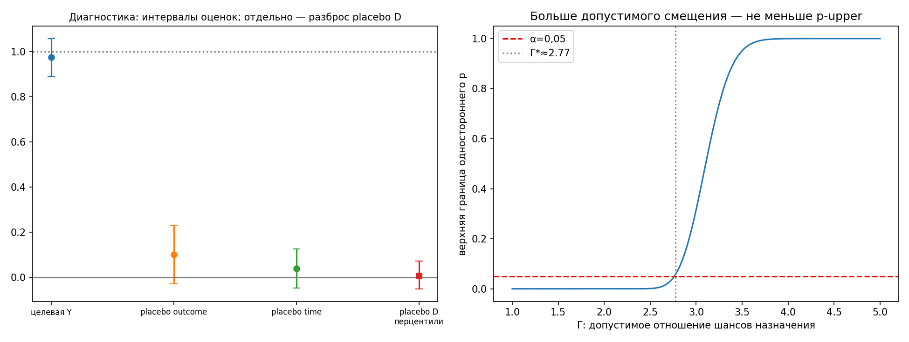
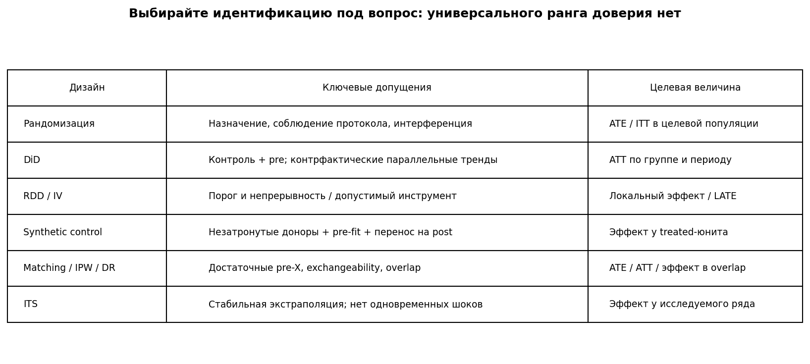

# Урок 6.5 — Доверие к результату и выбор дизайна

**Цель урока:** различать диагностическую проверку, статистическую неопределённость и идентифицирующее допущение; правильно читать placebo и sensitivity-анализ; выбирать метод по вопросу и механизму назначения.

**Перед уроком:** [проверьте зависимости темы](../../PREREQUISITES.md); обозначения — в [словаре](../../GLOSSARY.md).

## Зачем это аналитику

Оценка «подписка дала один дополнительный заказ» требует трёх отдельных обоснований: какой эффект и для кого измеряется; почему построенный контрфакт подходит; какова неопределённость оценки. Малое p-value отвечает только на часть последнего вопроса при принятой модели. Никакая комбинация зелёных проверок не доказывает отсутствие скрытого confounding.

## Теория

### 1. Что проверяют placebo и negative controls

**Отрицательный контроль исхода** — переменная, на которую лечение не может влиять, но которая может отражать интересующий источник confounding. Такое отсутствие влияния надо обосновать. Например, число жалоб не является автоматически отрицательным контролем для подписки: подписка может увеличить число заказов, а через него и жалобы. В практике отсутствие влияния на условный placebo-outcome специально задано в генераторе.

**Placebo-время** — анализ до реального воздействия. Неожиданная разница может указывать на состав групп, неверную динамику или anticipation. Её величина и неопределённость важнее механического сравнения p с 0,05. Смещение в прошлом не обязано равняться смещению после запуска; вычитать прошлый placebo-effect из основного без дополнительной модели нельзя.

**Placebo-treatment** — замена назначения независимой случайной переменной. После этой операции метод должен оценивать около нуля. Это проверка поведения процедуры на изменённых данных. Глобальное перемешивание observational D меняет связь D–X и overlap, поэтому полученный разброс нельзя автоматически использовать как нулевое распределение основного ATT. В практике мы показываем распределение placebo-оценок, а статистическую неопределённость исходной оценки считаем отдельно.

**Устойчивость к составу данных** — повторный анализ при исключении заранее определённых подмножеств, диагностике влияния отдельных наблюдений и разумных спецификациях. Сравниваем изменения с их ожидаемым шумом и выясняем причину. Смена знака между наивной и скорректированной оценкой может быть правильным снятием confounding: пример Симпсона из 6.1 именно такой.

Проверки способны обнаружить отдельные несоответствия. Незначимое placebo не доказывает эквивалентность нулю, а случайное значимое placebo возможно и при корректной модели. При нескольких проверках учитываем множественность; при задаче «исключить существенное смещение» заранее определяем допустимую величину и оцениваем мощность/интервал относительно неё.

### 2. Sensitivity: явные модели оставшегося смещения

**Γ Розенбаума.** В непересекающихся matched pairs допускаем, что два человека с одинаковыми учтёнными X имеют разные шансы получить лечение из-за ненаблюдаемого. Γ ограничивает отношение этих шансов; это не отношение вероятностей. При Γ=1 внутри пары assignment обмениваем, при Γ>1 допускается скрытый отбор.

Для заранее выбранной положительной альтернативы и знакового теста под **sharp null** верхняя граница p-value равна

$$p_{upper}(\Gamma)=P\{B\geq W\},\qquad B\sim\mathrm{Binomial}\left(n,\frac{\Gamma}{1+\Gamma}\right),$$

где W — число положительных разностей, n — число ненулевых пар. Это worst-case граница по допустимому смещению, а не двусторонний тест при единственной известной вероятности. Она не уменьшается при росте Γ. Γ* — первое пересечение границей уровня α. Если сетка закончилась раньше, говорим только, что пересечение не найдено в проверенном диапазоне. Для отрицательной или двусторонней альтернативы нужно заранее выбрать соответствующую процедуру.

Γ не имеет универсальных порогов «как A/B» или «почти непробиваемо». Интерпретируем его относительно предметно правдоподобного скрытого отбора и выбранного теста. Результат относится к принятой модели sensitivity и sharp null, а не ко всем возможным нарушениям дизайна.

**E-value для риск-отношения.** При RR≥1:

$$E=RR+\sqrt{RR(RR-1)}.$$

Для защитной ассоциации RR<1 сначала используем 1/RR. Пусть a и b характеризуют две связи скрытого confounder с treatment и outcome после учёта X. Совместная граница смещения имеет вид $B=ab/(a+b-1)$. E — значение a=b, достаточное в наихудшем случае для объяснения наблюдаемого RR. Это **не** требование, чтобы обе связи по отдельности превышали E: одна может быть слабее, если другая сильнее. Например, для RR≈1,52 подходят a=2 и b≈3,17, хотя E≈2,41.

Считают E для оценки и для границы CI, ближайшей к RR=1. Если CI включает 1, E его границы равен 1. При защитном RR берут верхнюю границу. Сам CI должен учитывать дизайн: для парных бинарных исходов нужна ковариация внутри пары. E не измеряет вероятность отсутствия confounding; «большое» значение оценивается в предметном контексте. Для других шкал нужна обоснованная конвертация или иной sensitivity-метод.

**δ Остера.** Для регрессионных корректировок можно исследовать, как ненаблюдаемая селекция соотносится с наблюдаемой. Часто используется приближённая формула

$$\beta^*\approx\beta_{ctrl}-\delta(\beta_{naive}-\beta_{ctrl})\frac{R^2_{max}-R^2_{ctrl}}{R^2_{ctrl}-R^2_{naive}}.$$

Её применяют при допущениях о пропорциональной селекции и сопоставимых регрессионных спецификациях; это не универсальная поправка. R²max — sensitivity-параметр в [R²ctrl;1], а не наблюдаемая истина. Ориентир min(1;1,3R²ctrl) можно включить в сетку вместе с другими обоснованными значениями. При почти равных R² знаменатель нестабилен. δ*, обнуляющую β*, сообщают вместе с выбранным R²max и оговорками; универсальной шкалы «δ>2 хорошо» нет.

*Рис. 1. Диагностика и sensitivity на синтетическом примере*

### 3. Карта методов вместо рейтинга доверия

Выбор начинается с **estimand, популяции, горизонта и механизма назначения**, а затем с доступного контрфакта. Допущения методов не вложены друг в друга: parallel trends не сильнее и не слабее ignorability в универсальном смысле. Проценты доверия по названию метода не определены.

| Доступный дизайн | Что нужно обосновать | Для кого ответ |
|---|---|---|
| Рандомизированное назначение | корректность назначения/анализа, интерференция, attrition и определённость treatment | эффект назначения в целевой экспериментальной популяции |
| DiD | untreated control, pre-data, контрфактическая параллельность, no anticipation, отсутствие spillover | обычно ATT для заданных когорт/периодов |
| RDD | непрерывность потенциальных исходов либо явно принятая local-randomization модель; отсутствие других изменений на пороге | эффект около порога; fuzzy — для local compliers |
| IV | relevance, independence, exclusion и условия интерпретации, включая monotonicity | LATE в бинарном encouragement-дизайне |
| Synthetic control | незатронутые доноры, достаточно pre-data, подходящий pre-fit и модель переноса на post | эффект для treated unit |
| CausalImpact / ITS | стабильность прогноза, незатронутые контрольные ряды, если используются, отсутствие неучтённых одновременных шоков | эффект заданного вмешательства и периода |
| Adjustment: matching/IPW/DR | допустимые pre-treatment X, exchangeability, overlap, корректные nuisance-модели в требуемом смысле | ATE/ATT/иной явно выбранный estimand |

Одна ситуация может допускать несколько дизайнов. Сравниваем их предположения и ограничения, а не выбираем тот, где результат значимее. Если рандомизация подходит, она позволяет задать механизм назначения; geo/switchback/encouragement тоже требуют собственного обоснования. Этический запрет на withholding не исчезает от смены единицы рандомизации.

Один treated-юнит без donor pool не позволяет применить synthetic control. ITS без внешнего контроля — другая модель, которая особенно уязвима к одновременным шокам. Функция `method_tree` в практике теперь возвращает **список кандидатных дизайнов** по явно указанным условиям; она не подтверждает эти условия за аналитика.

*Рис. 2. Карта дизайнов и их допущений без универсального ранга доверия.*

### 4. Ответить на нужный бизнес-вопрос

Число заказов, доверие, клики и выручка — разные outcomes. Даже корректная оценка одного не определяет автоматически эффект другого. Для решения о подписке нужны затраты, плата и маржа, а не только ATE заказов. Если показатель становится KPI, заранее рассмотрите, как можно улучшить его ценой вреда продукту; используйте связанные outcome- и guardrail-метрики.

Для вопроса о механизме нужны дополнительные допущения. Контроль медиатора блокирует часть total effect, но не гарантирует direct effect: mediator–outcome confounding и посттритмент-конфаундеры требуют отдельного анализа. Различайте общий эффект и конкретный controlled/natural direct effect.

### 5. Когда данные не дают требуемого ответа

Причины: нет подходящего контрфакта или overlap для выбранной популяции; неопределённость не исключает важные противоположные решения; наблюдаются не объяснённые нарушения диагностик; результат чувствителен к правдоподобному скрытому смещению; измеренный outcome не связан с решением необходимыми данными/допущениями. Вместо механического «PASS/FAIL по p» сообщаем, что установлено, что остаётся неидентифицированным и какие данные/дизайн помогут.

## Разбор и практика

[practice_6_5.py](practice/practice_6_5.py) использует учебный DGP с **действительно дискретными X** и exact matching без повторного использования контролей. Это намеренно более простой случай, чем nearest-neighbor PSM из 6.4: в паре X совпадают точно. После исключения непарных estimand относится к оставленным treated. При принятой модели независимых outcomes и пар парный large-sample SE применим; для произвольного PSM, reused controls или неточного баланса переносить его нельзя.

1. Основная оценка и placebo-outcome/time на тех же парах: показываются оценки и интервалы, без объявления p>0,05 доказательством нуля.
2. Независимое placebo-D: показывается разброс новых оценок; это не p-value исходного ATT.
3. Парный RR-CI и E-values; односторонняя Γ-bound с заранее положительной альтернативой и монотонной кривой.
4. Несколько ситуаций проходят через карту допустимых методов; отсутствие доноров проверяется отдельно.
5. Аудит выводит диагностические величины и вопросы, оставшиеся для предметного обоснования, без рейтинга «доказанности».

## Домашнее задание

**1.** Placebo-время дало +0,18, основной эффект +0,9. Можно ли назвать [0,7;0,9] интервалом эффекта?

Ответ

Нет. Неизвестны перенос смещения между периодами, его направление и неопределённость обоих оценок. Исследуем источник placebo-разницы и модель динамики. Можно показать sensitivity-анализ для явно выбранных сценариев смещения, но он не становится доверительным интервалом автоматически.

**2.** RR=1,5 с CI [0,95;2,2]. Каков E-value ближайшей границы? Если RR=0,7 с CI [0,55;0,89], какую границу брать?

Ответ

В первом случае E границы равен 1: CI уже включает RR=1. Во втором используем 0,89, инвертируем её и применяем формулу. Само значение E оценивается с учётом правдоподобных конфаундеров, а не порога 2.

**3.** В знаковом sensitivity-тесте p-upper стал больше α при Γ=2,7. При увеличении Γ до 5 программа снова выдала маленький p. Что проверить?

Ответ

Модель допускает всё больше смещения, поэтому worst-case p-upper не может уменьшаться. Вероятна подмена supremum-границы двусторонним тестом при единственном p=Γ/(1+Γ). Нужны правильный хвост/сторона альтернативы и тест монотонности.

**4.** Для города есть 24 месяца истории, но нет ни доноров, ни незатронутых контрольных рядов. Подходит ли synthetic control?

Ответ

Нет. Возможен ITS при отдельно обоснованных допущениях о продолжении динамики и отсутствии одновременных шоков. История сама по себе не создаёт наблюдаемый контроль. Если допущения неприемлемы, текущие данные не идентифицируют требуемый эффект.

**5.** βnaive=2, βctrl=1, R²naive=0,05, R²ctrl=0,30. При R²max=0,39 вычислите приближённую β* для δ=1. Можно ли выдать общий вердикт «надёжно»?

Ответ

β*≈1−(2−1)(0,39−0,30)/(0,30−0,05)=0,64. Это результат конкретного sensitivity-сценария. Нужно обосновать пропорциональную селекцию и R²max, показать другие сценарии и сопоставить их с предметным знанием. Число 0,64 не является автоматически нижней границей доверительного интервала.

## Шпаргалка

- Estimand и идентификация предшествуют вычислению.
- Placebo проверяет определённое следствие модели; отсутствие значимости не доказывает ноль.
- Γ — граница отношения шансов скрытого назначения; E-value — совместная сила связей, δ — параметр модели селекции.
- У sensitivity нет универсальной шкалы доверия и эквивалентности A/B.
- Matching без повторов недостаточен для любой инференции: нужны условия о балансировке и стохастической структуре данных.
- Отчёт содержит estimate, подходящую uncertainty, целевую популяцию, допущения, диагностику и пределы переноса.

## Источники

- [Rosenbaum, sensitivitymv: авторская документация, senmv/amplify](https://cran.r-project.org/web/packages/sensitivitymv/sensitivitymv.pdf).
- [Ding & VanderWeele, Sensitivity Analysis Without Assumptions](https://arxiv.org/abs/1507.03984).
- [VanderWeele, Ding & Mathur, Technical Considerations in the Use of the E-value](https://biostats.bepress.com/harvardbiostat/paper215/).
- [DoWhy: Placebo Treatment Refuter](https://www.pywhy.org/dowhy/v0.11/user_guide/refuting_causal_estimates/refuting_effect_estimates/placebo_treatment.html).
- Oster (2019), «Unobservable Selection and Coefficient Stability» — условия и ограничения regression sensitivity; приближённая формула выше не заменяет полную процедуру статьи.
- [Abadie & Imbens, On the Failure of the Bootstrap for Matching Estimators](https://www.nber.org/papers/t0325).
