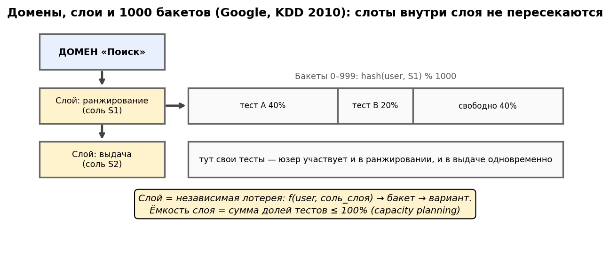
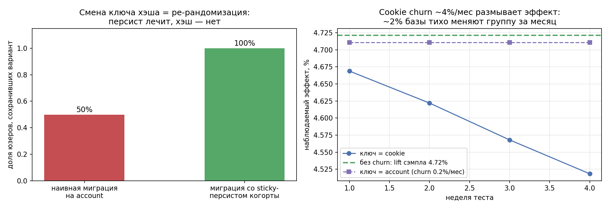
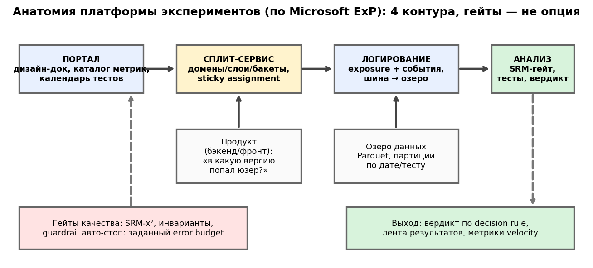

# Урок 7.1 — Сплит-инфраструктура платформы

**Цель урока:** спроектировать назначение по доменам и слоям, сохранить варианты при ramp и воспроизвести их из снимка конфига.

**Перед уроком:** [проверьте зависимости темы](../../PREREQUISITES.md); обозначения — в [словаре](../../GLOSSARY.md).

## Зачем это аналитику

В М4 вы пользовались сплит-системой как чёрным ящиком и ловили её поломки (4.2: SRM, A/A-аудит). В 7.1 вы перестаёте быть пассажиром и садитесь за проектирование. «ЕдаДома» выросла: шесть команд превратились в двадцать, непересекающихся аудиторий на всех нет, очередь гипотез злая, и продакты спрашивают не «что покажет тест», а «сколько тестов в неделю мы можем себе позволить». Ответ на этот вопрос — не в статистике теста, а в устройстве платформы: сколько слоёв, какие доли, какой хэш, где хранится назначение, что происходит при миграции ключа.

Аналитик здесь — главный проектировщик, потому что только он видит оба конца: как дизайн теста (MDE, мощность из 3.1) превращается в требование к слоту трафика, и как решение инженеров (смена хэша, stateful-сервис, CDN-политики) превращается в смещение метрик. Ошибка на этом уровне стоит дороже любой ошибки в тесте: сломанный сплит ломает все тесты сразу — с правильными p-value и красивыми графиками (4.2). И наоборот: грамотная сплит-инфраструктура — это когда двадцать команд вообще не догадываются о существовании друг друга.

## Теория

### 1. Анатомия платформы: четыре компонента

Разбор платформы Microsoft ExP (Gupta et al., 2018) даёт дефолтную блок-схему, на которую ложатся и Google-инфраструктура 2010-го, и современные вендоры:

```
[1. Портал экспериментов]          [2. Сервис назначений (EES)]
    UI создания теста,              кто в какой группе: хэш+соль+конфиг,
    конфиг, ревью, права            раздача конфигов сервисам/SDK
          │ конфиг (версионированный)      │ вариант на запросе
          └────────────┬───────────────────┘
                       ▼
         [3. Логирование]  exposure- и продуктовые события → шина → озеро
                       │
                       ▼
         [4. Анализ и отчёты]  метрики × статистика × SRM-гейт × дашборды
```

Портал — это workflows и дисциплина (заявка-дизайн-док из 4.1; у Яндекса конфиг эксперимента — текстовый файл в git с ревью как кода). Сервис назначений — герой этого урока. Логирование и анализ — герой 7.2. Kohavi (гл.4) добавляет к архитектуре ось зрелости: crawl-walk-run — от ручных тестов на общем слое до оверлап-инфраструктуры с тысячами параллельных экспериментов, и вопрос build vs buy, к которому мы вернёмся в 7.4 (ориентир стоимости своей платформы — ~150 млн ₽ за 3 года у Авито).

Масштаб, на который настраиваются лидеры: тысячи A/B в месяц на одной платформе (Microsoft), 41 000 A/B и до 35 трлн вычислений назначений (LinkedIn), >1000 параллельных тестов (Uber, Booking). Это не хвастовство, а паспорт ёмкости — та величина, которую вы проектируете.

### 2. Домены → слои → 1000 бакетов: ёмкость как инженерная величина

В 4.2 вы работали со слоями как с «независимыми лотереями». Google KDD'10 (Tang, Agarwal, O'Brien, Meyer) достраивает это до полной системы из трёх вложенных понятий:

- **Домен** — доля трафика (например, «поиск» на 100%, «логистика» на 50% курьерского);
- **Слой** — подмножество параметров внутри домена, своя соль: `ranking`, `ui`;
- **Эксперимент** — изменение параметров на доле трафика слоя: диапазон бакетов.

```
домен «search» (100%)
├── слой «ranking»  (соль R): [test50: 0–499][test25: 500–749][test10: 750–849]…[free]
└── слой «ui»       (соль U): [banner60: 0–599][icons30: 600–899][free: 900–999]
домен «logistics» (50%)
└── слой «courier_algo» (соль C): 1000 бакетов свободны
```

Ключевой ход — **1000 бакетов на слой**: `bucket = f(cookie, layer) % 1000`. Юзер всегда «сидит» в своём бакете, а эксперимент занимает диапазон. Следствия: (а) аллокация теста — это выделение диапазона, а не «пересылка людей», расширение enrollment сохраняет прежние arm только при независимом arm-хэше или сохранённом назначении; (б) ёмкость слоя конечна и видна — карта занятости как карта переговорных; (в) конфликты ловятся до запуска («нужно 10%, макс. свободный непрерывный диапазон 5%» — наш конфликт-детектор в практике).

**Приоритетные типы аллокации** (KDD'10): если у юзера есть стабильный user_id — хэшируем его; иначе cookie; иначе cookie+date (однодневная стабильность); иначе — random с пометкой **bias-id** (случайное назначение не смешивается с хэш-стабильным: у него другой механизм и оно потенциально смещено — бот, приватный режим). Это список приоритетов, а не меню: первый доступный ключ выигрывает.

**Launch-слои**: выкатка победителя — отдельный publish-слой в дефолтном домене; он задаёт новые дефолты параметров и делает ramp-up (1%→5%→100%, SQR-фреймворк из 4.1) без создания нового эксперимента. Параметр живёт максимум в одном обычном слое и одном launch-слое — так выкат не конфликтует с тестами. У Авито та же идея заострена **тройным солением**: соль слоя + shuffle-соль эксперимента + соль эксклюзивной группы (~10% базы), дающая и независимость, и гарантированное взаимное исключение для критичных тестов.

**Ёмкость и цена слота.** Слой = 1000 бакетов, значит на одном слое помещается floor(1/s) тестов доли s: четыре по 25%, десять по 10%, двадцать по 5%. Цена слота — из 3.1: доля f даёт выборку N·f, а MDE ∝ 1/√N, то есть **MDE(f) = MDE(100%)·√(1/f)** и длительность на тот же MDE растёт в 1/f раз. По формуле KDD'10 для 95%/80%: $N_{total} \approx 4(z_{0.975}+z_{0.8})^2(CV/\theta)^2$ — для метрики GMV/юзера с CV≈2,5 и базы 2 млн юзеров за 2 недели: MDE на 100% = 0,99%, на 25% — 1,98%, на 5% — 4,43% (в 4,47 раза крупнее). Отсюда проектировочный расчёт: 20 команд × тест на 25% → нужно 5+ слоёв; тесты по 5% доступны только для жирных эффектов (или длительных). Это и есть вход в «платформа как календарь гипотез» (7.4).


*Рис. 1. Домены, слои и 1000 бакетов (Google KDD'10): слои — независимые лотереи, ёмкость слоя планируют.*


### 3. Хэш: осознанный выбор функции

Три требования вы знаете из 4.2 (детерминизм — stateless-сплит; равномерность — точность долей; лавинность — хорошее перемешивание; независимость солей/слоёв проверяют отдельно). Вопрос этого урока практический: **какую функцию брать**. Ответ Microsoft (arXiv 2212.08771, эмпирическая проверка независимости назначений): **SpookyHash и MD5 дают независимые сплиты, FNV — нет**. Наши измерения на последовательных id (практика 7.1) показывают, откуда берётся отказ:

| проверка | MD5 | FNV-1a |
|---|---|---|
| лавинность (соседние id) | 64,0 из 128 бит | **10,7 из 64 бит** |
| переворот каждого бита | 0,46–0,54 | **0,00–0,99** (бит #36 не переворачивается никогда) |
| равномерность 1000 бакетов (соль A) | p=0,11 | **p≈10⁻³⁴** |
| та же проверка (соль B) | p=0,51 | p=1,00 — «прошла» |
| независимость двух солей (χ², 10×10) | p=0,80 | **p<0,0001** (χ²=315) |

Механика отказа: FNV XOR-ит вход в младшие биты и умножает на простое — диффузия младших бит слабая, а `bucket = hash % 1000` чувствителен к структуре выходных бит (для 1000 это не буквально выбор младших бит). Соль не лечит: она меняет отображение, но не структуру. Самое коварное — непредсказуемость: с одной солью тест равномерности проходит, с другой валится; а корреляция между слоями (главная угроза оверлап-инфраструктуры) не ловится «на глаз» вообще. Отсюда правило: хэш выбирается один раз, на весь флит сервисов, и проверяется на A/A-аудите (4.2) — равномерность, независимость солей, гистограммы p-value. Рабочие варианты: MD5 (LinkedIn: проекция md5(salt‖member_id) на [0,1); Microsoft: проверено), MurmurHash3 (стиль LinkedIn/Twitter-эпохи, Spark/Elasticsearch), xxHash и SpookyHash (быстрые, проходят тесты). Кросс-языковая ловушка: одна и та же функция в Python и Java может отличаться кодировкой/endianness/сидом — сплит, собранный двумя сервисами, молча расходится; фиксируйте байтовую сборку строки (соль|разделитель|id) в спеке.

### 4. Sticky assignment: где физически живёт назначение

Назначение должно переживать запросы, сессии и рестарты сервисов. Два полюса:

**Stateless (паттерн LinkedIn):** назначение нигде не хранится — детерминированный хэш и есть «хранилище». Любой сервис в любой момент пересчитывает `variant = f(salt, member_id)` и получает тот же ответ. Результат: 99,98% вычислений локально в сервисах, ~0,02% походов в бэкенд; 41 000 тестов, до 35 трлн вычислений назначений. Альтернатива «честный RNG + хранилище» отвергнута по CAP: при сетевом разделе выбор между «отдать stale-назначение» и «недоступность»; а по объёму — 240× больше cache QPS и 26–390 ТБ/день логов. Stateful — это ещё и режим отказа: упало хранилище → платформа остановилась.

**Sticky assignment при ramp.** Фиксированная позиция на [0,1) сама не сохраняет вариант: если граница A/B проходит через позицию пользователя, группа изменится. Используйте независимые хэши для допуска в эксперимент и arm, расширяйте только enrollment; либо храните уже выданный вариант и назначайте новые доли только новым участникам. В практике sticky_map хранит старый вариант при миграции cookie→account. Контракт включает версию, доменную долю и число бакетов; from_snapshot восстанавливает все эти поля.

**Идентификатор и цена его смены.** cookie — сразу у всех, но живёт месяцы и «протухает» (cookie churn ~4%/мес, Deng гл.7); account_id — стабилен, но появляется поздно и не у всех. Смена ключа хэширования посреди теста — это **не апгрейд, а ре-рандомизация**: лавинный эффект означает, что новый ключ даёт независимое назначение. Наши числа (практика): миграция cookie→account для 35% залогиненных — вариант сохранили 49,8%, сменили группу 17,6% всей базы; идущие тесты размыты, лечится переходным окном: для стартовавшей когорты sticky-карта старых назначений до конца теста (100% сохранили), новые юзеры — сразу по новому ключу. Фоновый churn без привязки к аккаунту: за 4 недели затронут 3,9% юзеров, ~2,0% тихо меняют группу — наблюдаемый эффект +4,72% проседает до +4,52% (−0,20 п.п.), на аккаунт-ключе — 4,71%. Это цена «анонимного» юнита, которую надо знать до дизайна (выбор юнита — 3.2, cookie churn подробно — 4.3).


*Рис. 2. Миграция ключа сплита: без sticky-моста половина юзеров меняет группу; мост держит когорту до конца теста (из практики).*

### 5. Производительность: сплит на горячем пути

Назначение вычисляется на каждом запросе — это самый горячий код платформы. Кейс LinkedIn выше — про архитектуру. Кейс Uber — про доставку конфига: конфиги экспериментов раздаются тем же пайплайном, что feature flags (диффузия по хостам), вычисление варианта локально в клиенте: p99 латентности решения 10 мс → 100 мкс; shadow-тест (20 млн вычислений/с, совпадение с эталоном 99,999%) поймал 13 багов до продакшна. Сервис-альтернатива — централизованный сплит-сервис в стиле Ocelot (LinkedIn): до 800K QPS, но это уже инфраструктурный проект с собственным SLO. Правило проектирования: сначала локальный расчёт по конфиг-снапшоту (стоимость — секунды диффузии обновлений), сервис — когда нужен контекст, недоступный клиенту.

Обязательный элемент — **версионирование конфига**: каждая мутация (добавить тест, сменить долю) = новая версия; экспозиция несёт версию; анализ воспроизводит назначение по снапшоту. Без этого ночной пересчёт вчерашнего теста даст другой сплит, чем живой сервис. В нашей практике сплит-сервис версионирует каждую аллокацию (v5 → v12 за один запуск), снапшот неизменен.

### 6. Feature flags vs эксперименты; edge и мобильный контур

Флаги и эксперименты — разные слои, не замена друг другу: **флаг — про безопасный выкат** (kill switch, постепенная раскатка кода), **эксперимент — про измерение**. У LaunchDarkly эксперимент — «временный флаг»: salt флага + user key → детерминированный бакетинг; пересоздание соли = ре-рандомизация с потерей непрерывности (см. §4). Взаимное исключение: experiment layers (LaunchDarkly) / namespaces — непересекающиеся диапазоны [0,1) (GrowthBook). Гочча, стоившая кому-то тестов: в одном namespace эксперименты обязаны использовать **один и тот же hash attribute** (user_id или cookie — что-то одно), иначе исключительность молчит и ломается (issues GrowthBook #3794, #4497). Это же ограничение — наш §4: смешение ключей внутри схемы = скрытая ре-рандомизация.

**Edge/SSR:** edge-worker перехватывает запрос до origin: читает/ставит cookie, отдаёт HTML правильного варианта с первого байта (redirectless). Клиентские тесты медленнее (блокируют рендер), серверные без edge отнимают кэш CDN. Цена сплита видна на кэше: hit rate групп падает (кейс Walton: 11% против 1,5% в группах ~600 юзеров — вариативный HTML дробит кэш) → делить общие content-hashed ассеты между вариантами, ограничивать число групп, вовремя останавливать тест; метрики скорости считать с поправкой (FCP − TTFB), иначе тест «ускоряющих» изменений меряет собственный кэш-штраф.

**Мобильный контур:** SDK-бакетинг детерминирован и работает офлайн — хэш user_id/device_id локально, без сети (Optimizely, Amplitude, AB Tasty Bucketing mode: SDK скачивает один конфиг-снапшот кампаний против Decision API на каждое решение). Exposure-события копятся в очередь и уезжают при появлении сети — отсюда специфичные для мобайок запаздывающие логи и необходимость дедупа (7.2).


*Рис. 3. Анатомия платформы: портал, сплит-сервис, логирование, анализ — и гейты, которые нельзя обойти.*

## Разбор на данных

Проектирование сплита «ЕдаДома» на 20 команд (все числа — из практики 7.1). Шаг 1 — карта слоёв: домен «search» (100%): слои `ranking`, `ui`, два чекаут-слоя; домен «logistics» (50%): `courier_algo`; плюс CRM-слой. Итог: 6 слоёв → 24 одновременных теста по 25% или 120 по 5%. Шаг 2 — паспорт чувствительности: GMV/юзера CV≈2,5, база 2 млн/2 нед → MDE на 100% трафика 0,99% (N_total ≈ 31,4·(s/θ)²); тест на 25% имеет MDE 1,98%, на 5% — 4,43%. Вывод для бэклога: для MDE около 1% нужен почти весь этот двухнедельный трафик; для меньшего MDE — больше пользователей или снижение дисперсии; «быстрые» 5%-слоты — для грубых проверок.

| доля слоя | тестов на слой | MDE (отн.) | MDE к 100% | длительность × к полному слою |
|---|---|---|---|---|
| 100% | 1 | 0,99% | 1,00 | 1 |
| 50% | 2 | 1,40% | 1,41 | 2 |
| 25% | 4 | 1,98% | 2,00 | 4 |
| 10% | 10 | 3,13% | 3,16 | 10 |
| 5% | 20 | 4,43% | 4,47 | 20 |

Шаг 3 — конфликты: запрос «ещё один ranking-тест на 10%» при занятых 100% бакетов ловится детектором ДО запуска: «нужно 100 бакетов, макс. свободный непрерывный диапазон 0»; фрагментация ловится так же (в `ui` свободно 10% суммарно, но непрерывного куска на 15% нет). Шаг 4 — инцидент миграции: платформа переводит идентификацию на account_id посреди квартала; наивное переключение в слое с идущим тестом — 17,6% базы меняют группу (49,8% залогиненных сохранили вариант — это лотерея, а не стабильность); правильный протокол — переходное окно со sticky-картой (100% сохранили) + перенос старта новых тестов на новый ключ. Фоновая цена cookie-юнита: churn 4%/мес за 4-недельный тест размывает эффект на 0,20 п.п. (4,72%→4,52%) — аргумент за account-юнит там, где он есть (35% базы).

## Подводные камни

1. **Слабый хэш «потому что быстрый».** Делают: FNV/самописный микс ради наносекунд. Грозит: непредсказуемые отказы — равномерность валится с одной солью (p≈10⁻³⁴) и проходит с другой (p=1,0), корреляция слоёв невидима без χ²-таблицы. Правильно: MD5/Murmur3/xxHash/SpookyHash + обязательный A/A-аудит платформы (4.2).
2. **Смена ключа/соли на живом тесте.** Делают: «переведём слой на account_id в выходные». Грозит: лавинный эффект → ~50% мигрирующих меняют группу (наш кейс: 17,6% базы), эффект размывается без всякого SRM. Правильно: переходное окно со sticky-персистом старой когорты; смена соли = новый тест.
3. **Пересчёт старого варианта по новым границам.** Фиксированный бакет не спасает от смены A/B, если границы вариантов передвинули. Правильно: независимый хэш варианта и расширение только допуска, либо сохранённый вариант старых участников; новые доли применяются только к новым участникам.
4. **Смешение hash attribute в одном namespace/слое.** Делают: тест А по user_id, тест В по cookie в одном исключающем namespace. Грозит: исключительность молча ломается (гочча GrowthBook #3794), пересечения без детекта. Правильно: один ключ на namespace, приоритетная лестница KDD'10 на уровне платформы.
5. **Stateful-сплит «для надёжности».** Делают: RNG + хранилище назначений. Грозит: CAP-дилемма на каждом сетевом разделе, 240× cache QPS и до 390 ТБ/день (расчёт LinkedIn), остановка платформы при падении хранилища. Правильно: stateless-хэш по умолчанию; персист — только переходные окна.
6. **Edge-варианты, дробящие кэш.** Делают: уникальный HTML/ассеты на вариант. Грозит: hit rate CDN 11% против 1,5% — тесты «скорости» меряют кэш-штраф сплита, метрики врут. Правильно: redirectless-подмена до origin, общие content-hashed ассеты, скорость мерить как FCP − TTFB.
7. **Конфиг без версий.** Делают: «конфиг и так в git». Грозит: анализ не воспроизводим — ночной пересчёт по новому конфигу даёт другой сплит, экспозиции не бьются с назначениями (SRM из ниоткуда). Правильно: версия в каждой экспозиции, анализ по снапшоту версии.

## Практика

Файл [practice_7_1.py](practice/practice_7_1.py) (percent-формат, numpy/scipy/matplotlib/pandas + hashlib/time, seed, Agg). Четыре блока:

1. **Лаборатория хэшей** (20k последовательных id): лавинность MD5 64,0/128 против FNV 10,7/64; переворот каждого бита (FNV: 0,00–0,99, бит #36 прикован); равномерность 1000 бакетов — FNV p≈10⁻³⁴ с одной солью и p=1,0 с другой; независимость двух солей χ²=315 (p<0,0001) против MD5 p=0,80. График [practice_7_1_hash.png](images/practice_7_1_hash.png).
2. **Сплит-сервис классом**: домены (search 100%, logistics 50%) → слои с солями → 1000 бакетов; first-fit аллокация слотов; конфликт-детектор с диагностикой («нужно 10%, свободно 0%» / фрагментация «свободно 10%, но непрерывного куска на 15% нет»); версии конфига v5→v12 и неизменность снапшота; приоритетная лестница assign(user_id → cookie). График [practice_7_1_capacity.png](images/practice_7_1_capacity.png) (карта занятости слоёв + кривая MDE ×√(1/f)).
3. **Ёмкость**: таблица «доля → тестов на слой → MDE → недель»; N_total ≈ 31,4·(s/θ)² на CV=2,5 и 2 млн юзеров: 0,99% на 100%; сценарий 6 слоёв → 24×25% или 120×5%.
4. **Sticky**: 120k юзеров, 35% с account_id — наивная миграция (49,8% сохранили, 17,6% базы сменили группу) против sticky-перехода (100%); churn 4%/мес × 4 недели: 3,9% затронуты, ~2,0% сменили группу, эффект 4,72%→4,52% (cookie) против 4,71% (account). График [practice_7_1_sticky.png](images/practice_7_1_sticky.png).

## Домашнее задание

**Задача 1.** У вас 4 слоя, каждый на 1000 бакетов. Бэклог: 8 тестов по 25% и 3 теста по 10%. Сколько тестов запустится параллельно? Что делать с остатком очереди — и какой MDE получит тест на 10%, если эталонный MDE слоя на 100% равен 0,8%?

<details><summary>Ответ</summary>

На одном слое floor(1/0,25)=4 теста по 25% → на 4 слоях 16 слотов по 25%, значит 8 тестов по 25% садятся свободно (2 слоя заняты под 4+4), остаётся 2 слоя: в них floor(1/0,1)=10 слотов по 10% → 3 теста по 10% проходят. Все 11 запускаются; свободные слоты — в резерв (ramp-up, launch-слои, A/A-аудит). MDE теста на 10% = 0,8%·√(1/0,1) = 0,8%·3,16 ≈ 2,5%. Или тот же MDE 0,8% — за 10 недель вместо одной.
</details>

**Задача 2.** FNV с солью A прошёл тест равномерности (p=1,0), с солью B — провалил (p≈10⁻³⁴). Коллега говорит: «Значит, надо просто проверить каждую новую соль тестом — и всё». Где ошибка, и какой минимальный набор проверок вы включите в аудит хэша?

<details><summary>Ответ</summary>

Ошибка: равномерность — не единственное требование; главная угроза оверлап-инфраструктуры — корреляция назначений между солями/слоями, которая не проявляется в одномерном тесте равномерности (у нас FNV валит именно парный χ² независимости: 315 против ~99 ожидаемых). Плюс «прошёл тест» ≠ «безопасен»: тест имеет мощность только против проверяемой альтернативы, отказ непредсказуем по солям. Минимальный аудит: равномерность бакетов (χ²), лавинность/битовые вероятности, независимость пары солей (таблица K×K, χ²), и на живой платформе — A/A-аудит с равномерностью p-value (4.2). Решение «менять хэш на MD5/Murmur3» дешевле вечного тестирования солей.
</details>

**Задача 3.** Платформа «ЕдаДома» через месяц переводит все слои с cookie на account_id. В слое `ranking` идёт тест (осталось 3 недели из 4). Опишите протокол миграции: что происходит с идущим тестом, с новыми тестами, с юзерами без account_id.

<details><summary>Ответ</summary>

Идущий тест: доигрывает на старом ключе — для всех, кто получил назначение до даты миграции, sticky-карта cookie→вариант живёт до конца теста (иначе ~50% залогиненных меняют группу — ре-рандомизация посреди теста). Новые тесты: стартуют сразу по account_id (новая соль или та же — но новая когорта). Юзеры без account_id: остаются на cookie-приоритете — ровно как лестница KDD'10 (user_id → cookie): ключ выбирается по доступности, а не приказом. После естественной смерти старой когорты карта выключается. Попутно: экспозиции продолжают нести версию конфига; A/A-тест в переходный период — обязательно.
</details>

**Задача 4.** Почему в KDD'10 случайное назначение (без хэша) помечено bias-id и не смешивается с хэш-назначениями? Что плохого в «просто рандоме» для юзеров без id?

<details><summary>Ответ</summary>

Random не детерминирован: тот же юзер на следующем запросе/сервере получает другое назначение — sticky пропадает, эффект размывается (каждая смена группы работает как потерянная единица наблюдения). Но хуже: контингент без id (боты, приватный режим, Deep Links без cookie) — систематически нерепрезентативная популяция; их «случайные» назначения не несут интерпретируемого эксперимента. Поэтому: (а) random только как последний приоритет, (б) с маркировкой bias-id, чтобы аналитик мог исключить эти наблюдения из анализа, а не молча смешать с честной рандомизацией.
</details>

**Задача 5.** Оцените объём: LinkedIn считает до 35 трлн назначений в день stateless-хэшем. Если хранить назначение (юзер × эксперимент × вариант = ~50 байт), сколько это терабайт в день? Почему stateful-вариант отвергнут и что такое CAP-проблема сплита?

<details><summary>Ответ</summary>

35 трлн × 50 байт = 1,75 ПБ/день записей назначений (по оценке LinkedIn альтернатива стоила бы 26–390 ТБ/день логов и 240× cache QPS — в зависимости от дедупа и охвата; порядок тот же: сотни терабайт ежедневно). Stateless-хэш делает хранение ненужным: назначение — чистая функция от (соль, id). CAP: при сетевом разделе (partition) приходится выбирать между согласованностью (consistency — все серверы отдают одно назначение) и доступностью (availability — отвечать всегда): хранилище назначений заставляет выбирать, хэш — снимает дилемму, потому что состояния нет.
</details>

## Шпаргалка

1. Платформа = 4 компонента (ExP): портал (заявки/конфиг) → сервис назначений (EES) → логирование → анализ. Слои урока: 7.1 — сплит, 7.2 — данные/вычисления, 7.3 — интерфейс, 7.4 — календарь.
2. KDD'10: домен (доля трафика) → слой (свои параметры + своя соль) → 1000 бакетов; эксперимент = диапазон бакетов; `bucket = f(unit, layer) % 1000`.
3. Приоритетная аллокация: user_id → cookie → cookie+date → random+bias-id (не смешивать random с хэшем). Launch/publish-слой в дефолтном домене для выката и ramp-up; параметр — максимум в одном обычном + одном launch-слое.
4. Ёмкость: на слое floor(1/s) тестов доли s; MDE(f) = MDE(100%)·√(1/f), длительность ×1/f; N_total ≈ 31,4·(s/θ)² (95%/80%). Тонкие эффекты — большие доли или время.
5. Хэш: детерминизм/равномерность/лавинность (4.2) + эмпирика MS: SpookyHash/MD5 ок, FNV нет (лавинность 10,7/64; независимость солей χ²=315; отказ зависит от соли — непредсказуем). Рабочие: MD5, MurmurHash3, xxHash, SpookyHash. Кросс-языковая сборка строки — в спеке.
6. Sticky: фиксированная позиция не гарантирует сохранение варианта при изменении границ. Разделяйте допуск и назначение независимыми хэшами либо сохраняйте уже выданный вариант; версию назначения логируйте.
7. Смена ключа/соли = ре-рандомизация: миграция cookie→account — переходное окно со sticky-картой (иначе ~50% мигрирующих меняют группу; наш кейс 17,6% базы). Cookie churn ~4%/мес → ~2% базы тихо мигрируют за месяц (эффект −0,2 п.п. на 4 нед).
8. Производительность: конфиг-снапшот + локальный расчёт (Uber: p99 10 мс → 100 мкс; shadow 20 млн/с, 99,999%, 13 багов); сплит-сервис — когда нужен серверный контекст (Ocelot до 800K QPS). Stateful-RNG: CAP + 240× QPS + 26–390 ТБ/день — отвергнуто.
9. Флаги ≠ эксперименты: флаг — выкат (kill switch), эксперимент — измерение (временный флаг). Взаимное исключение: layers/namespaces; один hash attribute на namespace (гочча GrowthBook).
10. Edge: redirectless-подмена до origin, HTML варианта с первого байта; общие ассеты — иначе hit rate CDN 11% vs 1,5%; скорость мерить FCP − TTFB.
11. Мобайл: SDK-бакетинг офлайн по конфиг-снапшоту; exposure в очередь до сети → запаздывающие логи и дубли (см. 7.2).
12. Версия конфига в каждой экспозиции; анализ реплеит по снапшоту — иначе SRM из ниоткуда и невоспроизводимые отчёты.

## Источники

- Tang D., Agarwal D., O'Brien D., Meyer M. — «Overlapping Experiment Infrastructure: More, Better, Faster Experimentation» (Google, KDD 2010) — домены/слои/1000 бакетов, приоритетные аллокации, bias-id, launch-слои, capacity, формулы объёма с явным n на руку и N_total — dl.acm.org/doi/10.1145/1835804.1835810 (`materials/web/research-ab-platform.md` §1).
- Gupta S. et al. — «The Anatomy of a Large-Scale Experimentation Platform» (Microsoft, 2018) — 4 компонента; Microsoft ExP: тысячи A/B/мес, SRM-гейт; arXiv 2212.08771 — эмпирика хэшей: SpookyHash/MD5 ок, FNV нет — exp-platform.com (`research-ab-platform.md` §1).
- LinkedIn Engineering — «Assigning Variants at Scale» + «Making the LinkedIn Experimentation Engine 20x Faster» + AICamp-доклад — MD5(salt‖member_id), 99,98% локально, 41k A/B, 35 трлн вычислений, CAP-отказ stateful (240× QPS, 26–390 ТБ/день), Ocelot (`research-ab-platform.md` §1–2, §6).
- Uber Engineering — «XP» + «Making Uber's Experiment Evaluation Engine 100x Faster» — конфиги как фичафлаги, p99 10 мс→100 мкс, shadow 20 млн/с, 99,999%, 13 багов; LRU-дедуп exposure-логов (→ 7.2) (`research-ab-platform.md` §1).
- Avito — Леньков Д., «Инфраструктура A/B-тестирования» (2020) — тройное соление (слой/shuffle/эксклюзивная ~10%), 200 юзер-бакетов; HighLoad SPb 2025 — 4000+ экспериментов/год; buy-vs-build ~150 млн ₽/3 года (`research-ab-platform.md` §1, §6).
- Kohavi, Tang, Xu — Trustworthy Online Controlled Experiments: гл.4 (платформа и культура, зрелость, build vs buy), гл.12 (client-side), гл.14 (randomization unit), гл.15 (ramping, SQR) — PDF в базе (`materials/local/books.md`).
- Deng A., «Causal Inference…», гл.7 — хэш-рандомизация, cookie churn → account-id; koch-kir, «Бэк-енд А/В-платформы» — компоненты бэкенда платформы — https://alexdeng.github.io/causal/abintro.html (`materials/web/alexdeng-causal-book.md`, `materials/web/web-articles.md` §3).
- Philip Walton — «Performant A/B Testing with Cloudflare Workers» — edge-назначение, cookie-позиция на [0,1), кэш-кейс 11% vs 1,5%; GrowthBook docs — sticky bucketing, namespaces, гочча единого hash attribute (issues #3794, #4497); LaunchDarkly — experiment layers, «эксперимент = временный флаг»; Optimizely/AB Tasty — SDK-бакетинг офлайн vs Decision API (`research-ab-platform.md` §2).
- Уроки курса: 4.2 (хэш/SRM/A/A — фундамент, здесь углубление), 3.1 (MDE/мощность — цена слота), 3.2 (юнит рандомизации), 4.1 (ramp-план и launch), 4.3 (cookie churn подробно), 4.5 (экономика экспериментов); вперёд — 7.2 (данные и вычисления), 7.4 (календарь гипотез и ёмкость платформы).


Для равных рук с общей дисперсией σ² формула: n_arm≈2(z.975+z.8)²σ²/δ²; N_total=2n_arm≈31,4σ²/δ². Коэффициент около 16 относится к **одной руке**. При unequal variances/costs оптимальное распределение может отличаться от 50/50. Доля слоя применяется после допуска в домен; эти две лотереи используют независимые соли.
