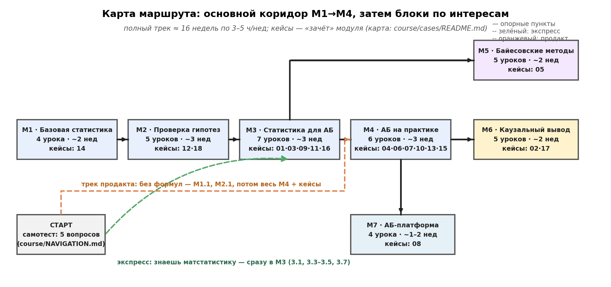

# Навигация по курсу: как двигаться

Курс большой: 7 модулей, 36 уроков, 35 практик, 18 кейсов, 7 скиллов. Эта страница — ваш маршрутный лист: определите свой трек, проходите уроки в правильном порядке и сверяйтесь с «выходными билетами» модулей.

---

## Шаг 0. Самотест: куда вставать (5 минут)

Ответьте на 5 вопросов (честно, без гугла):

1. Медиана выборки {1, 2, 3, 100} — это…?
2. 95%-й доверительный интервал означает, что…
3. p-value = 0.03 — это вероятность, что…
4. Чтобы удвоить чувствительность теста (уменьшить MDE вдвое), выборку надо…
5. Ваш A/B-тест значим, но SRM (соотношение групп 47/53 при плане 50/50). Что делаете?

Ответы и вердикт

1. 2,5 (среднее 1 и 3). Не ответили — начните с **М1.1**.
2. Процедуру, которая в 95% экспериментов накрывает истинное значение; НЕ «вероятность 95%, что параметр внутри» (это credible interval — М5.2). Смутились — **М1.3 + М5.2**.
3. НЕ «вероятность, что H0 верна», а вероятность увидеть такие (или сильнее) данные, если H0 верна. Ошиблись — это самое важное: **М2.1**.
4. Увеличить в 4 раза (SE ∝ 1/√n). Не уверены — **М3.1**.
5. Результатам не верить, чинить сплит-систему (М4.2). Не знали, что такое SRM — **М4.2** обязателен.

**Вердикт:** 0–2 верных → полный трек с М1. **3–4** → экспресс-трек. **5 из 5** → сразу кейсы 02, 09, 16: решаются легко — переходите к М5–М7.

---

## Четыре трека

### Трек 1. «С нуля» — полный (≈16 недель, 3–5 ч/нед)

Для джунов, студентов и всех, кто давно трогал статистику.

| Недели | Модуль | Уроки | Зачёт (кейсы) |
|---|---|---|---|
| 1–2 | М1 Базовая статистика | 1.1 → 1.2 → 1.3 → 1.4 | кейс 14 |
| 3–5 | М2 Проверка гипотез | 2.1 → 2.2 → 2.3 → 2.4 → 2.5 | кейсы 18, 12 |
| 6–8 | М3 Статистика для АБ | 3.1 → 3.2 → 3.3 → 3.4 → 3.5 → 3.6 → 3.7 | кейсы 01, 11, 16 |
| 9–11 | М4 АБ на практике | 4.1 → 4.2 → 4.3 → 4.4 → 4.5 → 4.6 | кейсы 04, 06, 07, 10, 13, 15 |
| 12–13 | М5 Байесовские методы | 5.1 → 5.2 → 5.3 → 5.4 → 5.5 | кейс 05 |
| 14–15 | М6 Каузальный вывод | 6.1 → 6.2 → 6.3 → 6.4 → 6.5 | кейсы 02, 17 |
| 16 | М7 АБ-платформа | 7.1 → 7.2 → 7.3 → 7.4 | кейс 08 |

Финиш: скилл `method-roadmap` + все кейсы как финальный экзамен.

### Трек 2. «Экспресс» — я знаю матстатистику (≈4–6 недель)

Вы спокойно считаете интегралы и знаете, что такое t-распределение, но не работали с АБ-платформами. Самотест: 3–4 из 5.

1. **М3**: 3.1 (MDE), 3.2 (юниты), 3.3 (ratio), 3.5 (CUPED), 3.7 (sequential) — ядро профессии; 3.4, 3.6 — по необходимости.
2. **М4 целиком** — здесь больше практики, чем математики: OEC, SRM, интерпретация, холдауты.
3. **Кейсы 01–18** — если кейс 02 (Lyft) и 09 (Авито MDE) решаются без подсказок, вы уже middle+.
4. Далее по интересам: **М5** (бандиты) или **М6** (каузалика) или **М7** (платформа).

### Трек 3. «Продакт» — меньше формул, больше решений (≈3–4 недели)

Вы принимаете решения по тестам, но не считаете их сами. Самотест: 0–2 из 5, и это нормально — формулы не ваш инструмент.

1. **М1.1** (когда среднее врёт) и **М2.1** (что реально означает p-value) — чтение, без практики.
2. **М4 целиком** — ваш домашний модуль: цикл эксперимента, OEC/guardrails, валидность, интерпретация, экономика. Практики — глазами: «что бы я решил?»
3. **Все 18 кейсов** — читать как художественную литературу; вопросы в конце — всерьёз.
4. **Скиллы** `design-ab-test` и `analyze-ab-test` — как чек-листы к разговору с аналитиком.
5. Опционально: М3.1 (откуда берётся длительность теста) — без формул, по таблице.

### Трек 4. «Прокачка» — я провожу АБ-тесты каждый день (≈2–4 недели)

Вы работающий АБ-аналитик. Двигайтесь по слабым местам:

- Не использовали CUPED/ML-поправки → **М3.5, М3.6** + кейс 03.
- Подглядываете в дашборд теста → **М3.7** (sequential) + кейс 18.
- «Зелёный тест не воспроизводится» → **М4.4, 4.5** + кейсы 12, 15, 16.
- Интерференция и сетевые эффекты → **М4.5**, кейсы 02, 09, 10, 13.
- Байес и бандиты → **М5** целиком + кейс 05.
- Каузалика без эксперимента → **М6** + дорожная карта `method-roadmap` + кейсы 02, 17.
- Строите платформу → **М7** + кейсы 04, 08.

Входной фильтр: кейсы 02, 09, 16. Решаются за вечер без чтения теории — модули М3–М4 можно пролистать.

---

## Как проходить один урок (ритуал 1–1,5 часа)

1. **«Цель» и «Зачем аналитику»** (5 мин) — если кейс-сюжет не про вас, урок можно отложить.
2. **Теория** (20–30 мин) — каждое правило проверено симуляцией: не верьте формуле, откройте практику и убедитесь.
3. **Практика** `practice_*.py` (20–30 мин) — запускайте целиком, потом меняйте параметры (эффект, n, seed) и смотрите, что меняется. Сломать симуляцию — лучший способ понять её.
4. **ДЗ** в конце урока (10–15 мин) — сначала письменно, потом `
`.
5. **Шпаргалка** урока — скопируйте в свой конспект.
6. После последнего урока модуля — **кейсы-зачёты** (карта: `Уроки/Кейсы/README.md`).

## Выходные билеты модулей

«Можете двигаться дальше, если…»

| Модуль | Выходной билет | Кейсы-зачёты |
|---|---|---|
| М1 | объясните коллеге, почему средняя выручка «врёт» на скошенных данных и что с этим делать; посчитаете CI для медианы бутстрепом | 14 |
| М2 | объясните p-value словами без «вероятность, что H0 верна»; выберете тест для конверсии/чека/рангов; знаете, зачем поправки при 10 метриках | 18, 12 |
| М3 | посчитаете n для заданного MDE; объясните, зачем винзоризация, CUPED и sequential — и чем они отличаются | 01, 03, 09, 11, 16 |
| М4 | напишете дизайн-док с OEC и guardrails; проверите SRM; примете решение по серому результату (и объясните, почему «продлить ещё недельку» — плохо) | 04, 06, 07, 10, 13, 15 |
| М5 | посчитаете P(B>A) и expected loss; решите, когда бандит уместнее теста | 05 |
| М6 | по дорожной карте выберете метод для «нельзя рандомизировать»; проверите предпосылки DiD и скажете, когда выводам верить нельзя | 02, 17 |
| М7 | спроектируете сплит со слоями и бакетами; посчитаете экономику слота и решите buy vs build | 08 |

## Если застрял

| Симптом | Куда идти |
|---|---|
| «Не понимаю p-value вообще» | урок 2.1 → кейс 18 → кейс 12 |
| «Путаюсь, какой тест выбирать» | скилл `choose-stat-test` → уроки 2.2–2.3 |
| «Откуда берётся длительность теста?» | урок 3.1 → скилл `design-ab-test` |
| «Метрика скачет, эффект не виден» | 1.2 (дисперсия) → 3.4 (винзоризация) → 3.5 (CUPED) → кейсы 03, 16 |
| «Тест зелёный, раскатили — эффекта нет» | 4.4 (интерпретация) → 4.5 (холдауты) → кейсы 12, 15, 16 |
| «SRM! что делать?» | 4.2 → 7.2 |
| «Группы влияют друг на друга» | 4.5 + кейсы 02, 09, 10, 13 → 6.2 (SUTVA) |
| «Нельзя рандомизировать» | скилл `method-roadmap` → М6 целиком |
| «Босс требует остановить тест пораньше» | 3.7 (sequential) + кейс 18 |
| «Считать руками лень, что почитать по автоматизации» | М7 + скилл `ab-platform-design` |

## Карта ресурсов (что где лежит)

| Ресурс | Путь | Когда |
|---|---|---|
| Уроки | `course/content/M1..M7/lesson-*.md` | основной путь |
| Практики | `course/content/M*/practice_*.py` | с каждым уроком |
| Кейсы | `course/cases/` | зачёт модуля, закрепление |
| Детальный план | `course/plan.md` | что внутри каждого урока, источники |
| Скиллы-шпаргалки | `skills/` | после М2 (тесты), М3–М4 (дизайн/анализ), М5, М6, М7 |
| Дорожная карта метода | `skills/method-roadmap` | «как измерить эффект Х» — в любой момент |
| Граф знаний | `obsidian-vault/` | повторение и связи концепций |

## Чеклист прогресса

- [ ] Самотест пройден, трек выбран
- [ ] М1 — кейс 14 решён
- [ ] М2 — кейсы 18, 12 решены
- [ ] М3 — кейсы 01, 11, 16 решены
- [ ] М4 — кейсы 04, 06, 07, 10, 13, 15 решены
- [ ] М5 — кейс 05 решён
- [ ] М6 — кейсы 02, 17 решены
- [ ] М7 — кейс 08 решён
- [ ] Финал: дорожная карта `method-roadmap` читается как план на завтра

> Кейс «решён» = письменно ответили на все вопросы, сравнили с разбором, поняли каждую ссылку на урок. Если ссылка непонятна — вернитесь к уроку: кейсы честно возвращают к теории.
