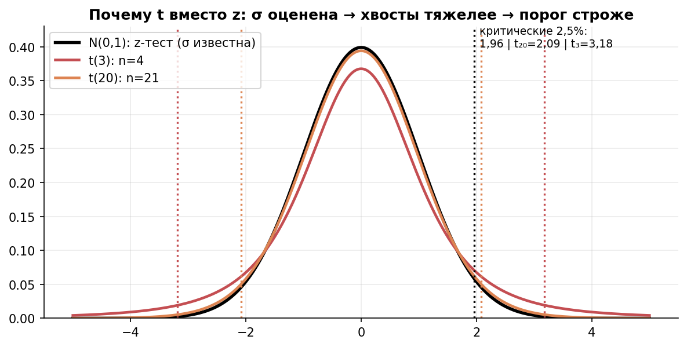
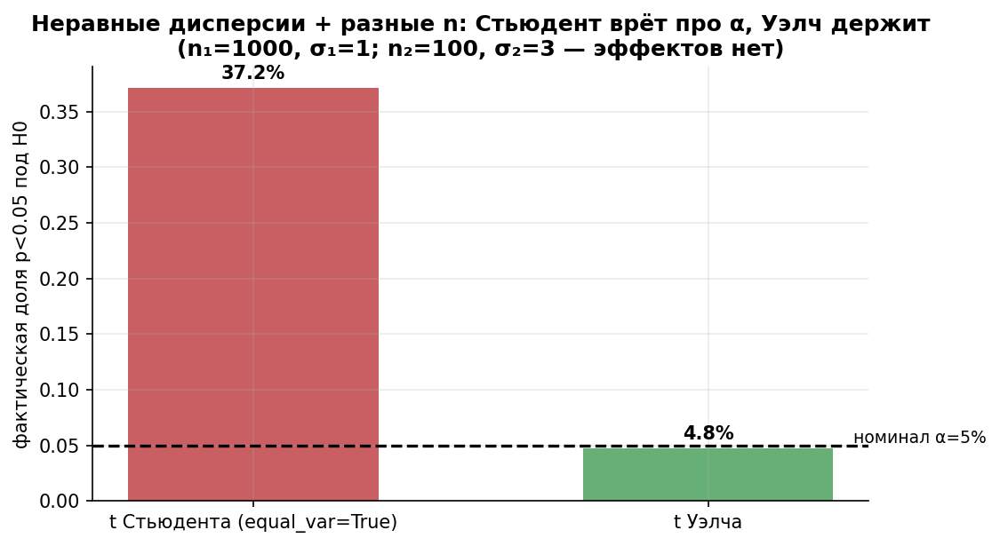
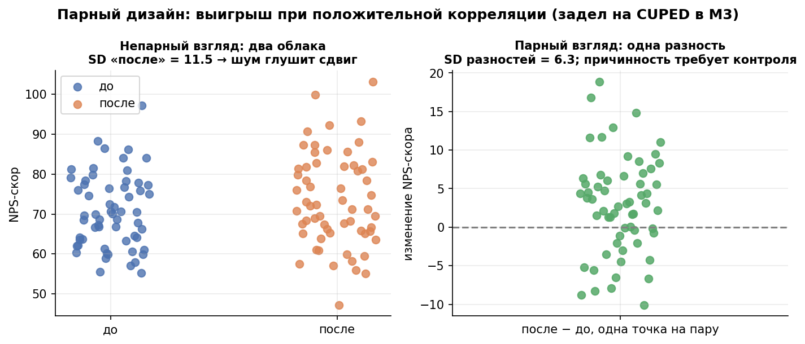
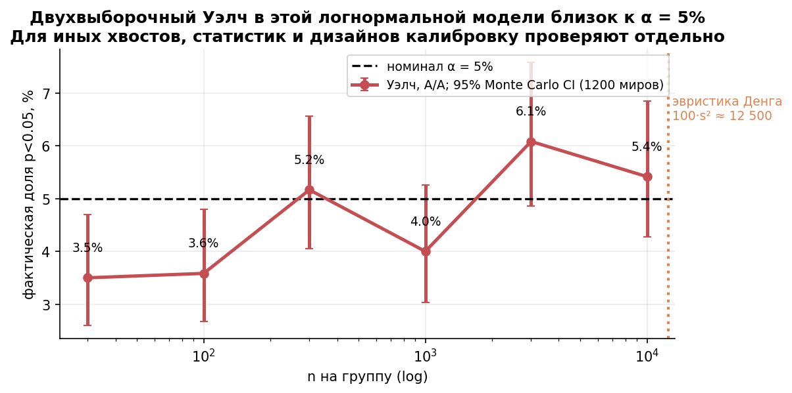

# Урок 2.2 — t-тесты и условия применимости

**Цель урока:** выбрать независимый или парный анализ и учесть дисперсию и зависимость наблюдений.

**Перед уроком:** [проверьте зависимости темы](../../../course/PREREQUISITES.md); обозначения — в [словаре](../../../course/GLOSSARY.md).

## Зачем это аналитику

В уроке 2.1 мы вертели p-value на конверсиях и учебной нормальной выручке. Реальные метрики «ЕдаДома» — средний чек (логнормальный!), время доставки, число заказов на юзера — и σ генеральной совокупности для них никто не знает. z-тесту нужна известная σ; t-тест заменяет её оценкой $s$ — и именно он рабочая лошадка числовых метрик в АБ-тестах. Но у t-теста есть версии и условия, и их нарушение **молча** ломает уровень значимости.

История, случающаяся каждый месяц: аналитик прогнал `scipy.stats.ttest_ind(a, b)` — а у него `equal_var=True` по умолчанию. В тесте шла акция «двойной кэшбэк», SD чека выросло втрое (дисперсия — в девять раз), группа к тому же меньше — и фактическая доля ложных прокрасов уехала с 5% к 37%: ложное отвержение происходит примерно в 37% A/A-экспериментов (а все значимые результаты этих A/A ложны). Никакой ошибки в коде нет — ошибочна версия теста. Ниже мы устроим это безобразие лично и посмотрим, как держится тест Уэлча.

Вторая тема урока — парный дизайн. Когда наблюдения «до/после» принадлежат одному юзеру, анализ разностей выключает межпользовательский шум — и тот же эффект ловится на выборке в ~10 раз меньше. Это первая встреча с идеей снижения дисперсии, на которой стоит весь современный АБ-стек (CUPED — М3.5).

## Теория

### 1. От z к t: оценка σ делает хвосты тяжелее

В уроке 1.3 мы строили CI уже знакомым приёмом: раз σ неизвестна, подставляем $s$ и расширяем интервал квантилем Стьюдента. Тест — та же конструкция. Статистика:

$$t = \frac{\bar{x} - \mu_0}{s/\sqrt{n}} \qquad \text{(одновыборочный случай)}$$

Пока σ известна, величина $z = (\bar{x}-\mu)/(\sigma/\sqrt{n})$ стандартно нормальна. Замена $\sigma \to s$ добавляет неопределённость: $s$ сама флуктуирует, у маленьких выборок она то занижена, то завышена — статистика получает **тяжелее хвосты**. Распределение Стьюдента с $df = n-1$ и есть точная поправка на это (при нормальных данных). При $df \to \infty$ оно сходится к нормали: $t_{0{,}975,\,9} = 2{,}262$, $t_{0{,}975,\,30} = 2{,}042$, $t_{0{,}975,\,\infty} = 1{,}96$.

Смысл самой статистики важнее таблицы: **$t$ = эффект / SE — сигнал, измеренный в единицах собственного шума**. $t = 2$ — «эффект вдвое больше своей стандартной ошибки»; большой $t$ — маленький p (урок 2.1). Вся разница между версиями t-теста — в том, *какой* эффект и *какой* SE подставлять.

*Рис. 1. От z к t: σ оценена по выборке → хвосты тяжелее → критический порог строже (1,96 → 3,18 при n=4).*

### 2. Четыре t-теста: какой когда

| Тест | Вопрос | Статистика | df | Когда в «ЕдаДома» |
|---|---|---|---|---|
| Одновыборочный | среднее = норме $\mu_0$? | $t = \dfrac{\bar{x}-\mu_0}{s/\sqrt{n}}$ | $n-1$ | время доставки против SLA 35 мин |
| Стьюдент (pooled) | две независимые группы равны? | $t = \dfrac{\bar{y}-\bar{x}}{s_p\sqrt{1/n_1+1/n_2}}$ | $n_1+n_2-2$ | — только при $\sigma_1^2 = \sigma_2^2$ (допущение!) |
| **Уэлч** | те же группы без допущения | $t = \dfrac{\bar{y}-\bar{x}}{\sqrt{s_1^2/n_1+s_2^2/n_2}}$ | формула Уэлча (ниже) | **дефолт всех A/B** |
| Парный | «после» ≠ «до» у тех же юзеров? | $t = \dfrac{\bar{d}}{s_d/\sqrt{n}}$ | $n-1$ | NPS до/после обучения; пре/пост на юзере |

Здесь $s_p^2 = \dfrac{(n_1-1)s_1^2+(n_2-1)s_2^2}{n_1+n_2-2}$ — «объединённая» дисперсия, и в этом pooled-тесте всё его коварство (раздел 3).

Парный тест — это одновыборочный тест, применённый к **разностям** $d_i = y_i - x_i$: средний сдвиг $\bar d$ против нуля. Интуиция «почему это законно»: каждый юзер — сам себе контроль, межпользовательские различия (кто фанат суши, кто заказывает семье из пяти человек) вычитаются.

### 3. Почему Стьюдент ломается, а Уэлч держит

Стьюдент предполагает: обе группы — выборки из совокупностей с *одной* дисперсией, и $s_p$ оценивает её честно. Если $\sigma_1 \ne \sigma_2$, то и дисперсия разности средних не равна $s_p^2(1/n_1+1/n_2)$: pooled-ошибка — средневзвешенная, и куда она сместится, зависит от сочетания «где шум × где n»:

- **большая дисперсия в маленькой группе** → $s_p$ недооценивает шум разности → SE занижен → t раздут → **α взлетает** (ложные прокрасы);
- **большая дисперсия в большой группе** → SE завышен → тест «тихо» консервативен → эффекты хоронятся (β растёт).

Числовой пример (воспроизведём симуляцией в практике): контроль $n_1 = 1000$, $\sigma_1 = 300$ ₽; тест $n_2 = 100$, $\sigma_2 = 900$ ₽ (акция разогнала разброс чеков). Честный $SE = \sqrt{300^2/1000 + 900^2/100} = \sqrt{90 + 8100} \approx 90{,}5$ ₽, а Стьюдент подставит $s_p\sqrt{1/1000+1/100} \approx 41{,}3$ ₽ — шум занижен в 2,19 раза. Порог $t > 1{,}96$ фактически означает $z > 0{,}9$ — и α становится $\approx 37\%$ вместо 5%.

Тест **Уэлча** выбрасывает допущение равных дисперсий: SE считается по каждой группе отдельно, а степени свободы штрафуются формулой Уэлча–Саттертуэйта (без вывода):

$$t = \frac{\bar{y}-\bar{x}}{\sqrt{\dfrac{s_1^2}{n_1}+\dfrac{s_2^2}{n_2}}}, \qquad df = \frac{\left(\dfrac{s_1^2}{n_1}+\dfrac{s_2^2}{n_2}\right)^2}{\dfrac{(s_1^2/n_1)^2}{n_1-1}+\dfrac{(s_2^2/n_2)^2}{n_2-1}}$$

df может быть дробным. При одинаковых выборочных дисперсиях совпадают SE Стьюдента и Уэлча, но при разных n их df обычно различаются. Полное совпадение статистики и df получается при одинаковых n и выборочных дисперсиях. Уэлч — разумный дефолт для средних независимых групп: он снимает допущение равных дисперсий, но не исправляет зависимость, малый n или тяжёлые хвосты. В SciPy: `stats.ttest_ind(a,b,equal_var=False)`.

При одинаковых n pooled-SE совпадает с Welch-SE и при разных выборочных дисперсиях; однако pooled-df при неодинаковых генеральных дисперсиях не делает t-распределение точным. Баланс групп снижает уязвимость, но не заменяет обоснование анализа.

*Рис. 2. Неравные дисперсии + разные n: Стьюдент врёт про α (37%), Уэлч держит номинал.*

### 4. Парный дизайн как снижение дисперсии

Парный t-тест силён не «математикой разностей», а физикой: до и после юзер — один и тот же, и его уровень метрики общий. Дисперсия разности:

$$s_d^2 = s_x^2 + s_y^2 - 2\,r\,s_x s_y$$

где $r$ — корреляция внутри пары. При $s_x=s_y=12$ и $r=0{,}9$ получаем $s_d\approx5{,}37$, то есть в 2,24 раза меньше SD одной метрики. Для сравнения средних независимых групп по n наблюдений SE=$\sqrt{288/n}$, для n пар SE=$\sqrt{28{,}8/n}$: выигрыш в SE равен $\sqrt{10}$, в числе пар против n на каждую независимую группу — примерно 10. При нулевой/отрицательной корреляции такого выигрыша нет.

Два предупреждения:

1. **Парный до/после — не эксперимент.** Он отвечает «изменилось ли?», но не «из-за фичи?»: сезонность, маркетинг, макроэффекты не вычитаются вместе с юзером. Причина ≠ изменение — это сквозная тема модуля 6. Парный *тест* корректен; парный *вывод о причинности* — нет.
2. **В классическом A/B пары нет**: юзер либо в тесте, либо в контроле. Идея «юзер — сам себе контроль» там реализуется пре-экспериментальными данными: метрика «до» становится ковариатой — это CUPED, а парная разность — его частный случай (урок М3.5).

*Рис. 3. Парный дизайн = снижение дисперсии при положительной корреляции: SD разностей вдвое меньше — задел на CUPED в М3.*

### 5. Условия применимости: независимость и «нормальность средних»

У t-теста три классических условия — по убыванию важности:

**1. Независимость наблюдений — главное и без компромиссов.** Формула $SE = s/\sqrt{n}$ — свойство независимых данных; зависимость (все заказы юзера как отдельные строки, кластеры курьеров) занижает SE — интервалы ложно узкие, α уезжает. Лечится только выбором правильного юнита анализа: юнит анализа = юнит рандомизации (Симулятор 12; подробно — М3.2). Это условие нельзя «проверить тестом», только спроектировать.

**2. Нормальность исходных данных даёт точное t-распределение; для больших n используют приближение распределения студентизированного среднего.** Правило $100\,skew^2$ — ориентир для некоторых скошенных распределений, а не обязательный минимальный n и не гарантия ЦПТ. Для логнормалы σ_log=1,2 оно даёт около 12 500, но двухвыборочная разность может калиброваться раньше. Симметричные тяжёлые хвосты имеют skew=0, что вовсе не гарантирует хорошую аппроксимацию. Shapiro сырых данных не отвечает на вопрос о калибровке теста; проверяйте уровень, покрытие CI и мощность на реалистичных моделях, с Monte Carlo интервалами.

Полезная деталь: разность двух независимых одинаково скошенных средних почти симметрична, поэтому **двухвыборочный тест выносливее одновыборочного** (Денг отмечает симметричность Δ как ускоритель сходимости; виден и в нашей практике). Если тест не держит номинал, увеличьте данные или выберите метод с проверенными условиями. Бутстрап не создаёт невидимые хвосты; обычная перестановка требует обменяемости, а ранги и трансформации могут менять проверяемый эффект (урок 2.3).

**3. Равенство дисперсий** — лечится автоматически выбором Уэлча (раздел 3). Предварительный F-тест на равенство дисперсий («сначала проверю, можно ли Стьюдента») — антипаттерн: сам шумный, решает не то и при малых n часто ошибается; Welch часто используют по умолчанию при подходящем estimand и независимых группах.

*Рис. 4. A/A на логнормальном чеке: двухвыборочный t-тест держит α (ЦПТ), но чем скошеннее — тем больше нужно n (правило Денга).*

### 6. d Коэна и отчёт: CI с эффектом важнее p

p-value не сравним между тестами: он зависит от n (урок 2.1). Стандартизованный размер эффекта сравним:

$$d = \frac{\bar{y}-\bar{x}}{s_p} \qquad \text{(Коэн; парный случай: } d_z = \bar{d}/s_d\text{)}$$

Ориентиры Коэна 0,2 / 0,5 / 0,8 — «малый/средний/большой» для поведенческих наук; в продукте типичные эффекты — d = 0,05–0,1, и это нормально (миллион юзеров × малые эффекты = деньги). Польза d: через него считается выборка — $n \approx 2(z_{0{,}975}+z_{0{,}8})^2/d^2$ на группу (та же формула, что в практике 2.1: d = 0,2 → 393 юзера).

Итоговый формат вывода теста: **оценка эффекта + CI + p + n (+ d)**: «+40 ₽, SD=300 ₽ в обеих группах, SE≈9,487 ₽, 95% CI [21,4; 58,6], p≈0,000025, d≈0,13, n=2000 на группу». CI и тест согласованы (ноль вне 95% CI ⇔ p < 0,05 — урок 1.4), но CI информативнее: показывает величину и точность, а не только «не шум».

## Разбор на данных

**Часть 1. Двухвыборочный тест, руками.** Пилот новой сортировки: выручка на юзера за неделю (₽), по 5 юзеров в группах (n учебно-крошечный — реальные n считает М3.1):

| контроль | 800 | 900 | 1000 | 1100 | 1200 |
|---|---|---|---|---|---|
| тест | 1000 | 1100 | 1200 | 1300 | 1400 |

1. Средние: $\bar{x} = 1000$, $\bar{y} = 1200$; эффект $+200$ ₽.
2. Суммы квадратов отклонений одинаковые: $\sum(x_i-\bar x)^2 = \sum(y_i-\bar y)^2 = 100\,000$, значит $s_x^2 = s_y^2 = 100000/4 = 25\,000$.
3. Pooled: $s_p^2 = 25\,000$, $s_p \approx 158{,}1$.
4. $SE = 158{,}1\sqrt{1/5+1/5} = 158{,}1 \cdot 0{,}632 \approx 100{,}0$.
5. $t = 200/100 = 2{,}0$, $df = 8$; критическое $t_{0{,}975,\,8} = 2{,}306$.
6. $p \approx 0{,}080$ — при α = 5% **не отвергаем**.

Уэлч на тех же данных даст $t = 200/\sqrt{25000/5+25000/5} = 2{,}0$ и $df = 8$ — идентично (дисперсии и n равны, Уэлч вырождается в Стьюдента). А теперь главное: $d = 200/158{,}1 \approx 1{,}27$ — эффект *огромный* по Коэну, но пяти наблюдений не хватило. «Не отвергли» здесь ничуть не значит «эффекта нет» — это урок 2.1 в чистом виде.

**Часть 2. Парный против непарного, одни данные.** NPS-скор 8 курьеров до и после тренинга по коммуникации:

| курьер | 1 | 2 | 3 | 4 | 5 | 6 | 7 | 8 |
|---|---|---|---|---|---|---|---|---|
| до | 62 | 70 | 58 | 74 | 66 | 78 | 60 | 72 |
| после | 71 | 72 | 65 | 79 | 74 | 79 | 67 | 76 |
| разность $d$ | +9 | +2 | +7 | +5 | +8 | +1 | +7 | +4 |

Парный: $\bar d = 43/8 = 5{,}375$; $\sum(d_i - \bar d)^2 = 57{,}875$, $s_d^2 = 8{,}27$, $s_d \approx 2{,}88$; $SE = 2{,}88/\sqrt{8} \approx 1{,}02$; $t = 5{,}375/1{,}02 \approx 5{,}3$ при $df = 7$ → $p \approx 0{,}001$ — сдвиг есть.

Непарный (те же 16 чисел как две группы): $s_{\text{до}}^2 \approx 51{,}1$, $s_{\text{после}}^2 \approx 26{,}7$; $s_p^2 \approx 38{,}9$; $SE = \sqrt{38{,}9 \cdot 0{,}25} \approx 3{,}12$; $t = 5{,}375/3{,}12 \approx 1{,}7$ при $df = 14$ → $p \approx 0{,}11$ — «значимого сдвига нет».

Одни данные, два вердикта: разность групповых средних та же (+5,4), но SE втрое толще — разброс *между* курьерами (от 58 до 78) задавил сдвиг *внутри* курьера. Экономия: отношение дисперсий $2 \cdot 38{,}9 / 8{,}27 \approx 9{,}4$ — парному дизайну нужно примерно **в 9 раз меньше наблюдений**. В scipy: `stats.ttest_rel(after, before)` против `stats.ttest_ind(after, before)` — попробуйте оба на этой таблице.

## Подводные камни

1. **`ttest_ind(a, b)` с забытым `equal_var=False`.** Делают: дефолт scipy (Стьюдент) на группах с разными σ и n. Грозит: фактическая α до 37% — 37% A/A-экспериментов дают ложное отвержение; или обратная конфигурация — тест тихо не отвергает вообще. Правильно: Welch для средних независимых групп (`equal_var=False`) с проверкой калибровки.
2. **Shapiro на сырых данных как «проверка условий t-теста».** Делают: «p < 0,05 ⇒ данные не нормальны ⇒ t-тест нельзя». Грозит: на больших n отвергается всегда (и незачем), на малых — не защищает; тест заброшен зря или выбран неподходящий «непараметрический» с другой H0 (урок 2.3). Правильно: проверяйте студентизированную статистику симуляцией уровня и покрытия; 100·skew² — только ориентир.
3. **«n = 30 достаточно» на скошенном чеке.** Универсального порога нет: одновыборочный и двухвыборочный тесты могут иметь разную калибровку. Оцените уровень, покрытие CI и мощность на реалистичных данных. Добор данных не меняет вопрос; log/ранги/винзоризация могут менять estimand, а bootstrap не гарантирует исправления малого n.
4. **Зависимые строки как независимые.** Делают: 50 000 заказов 8 000 юзеров кладут в t-тест. Грозит: SE занижен (заказы одного юзера похожи), ложно узкие CI, ложные прокрасы. Правильно: агрегировать до юнита рандомизации (юзер) — 8 000 наблюдений, а не 50 000 (М3.2).
5. **Парные данные гонят непарным тестом.** Делают: до/после через `ttest_ind`. Грозит: мощность потеряна кратно (в нашем разборе p = 0,11 вместо 0,001) — реальные эффекты хоронятся. Правильно: `ttest_rel` / анализ разностей. Обратно — непарные данные парным — вообще невозможно (нет пар).
6. **Парный до/после как доказательство эффекта фичи.** Делают: «NPS вырос после обучения ⇒ обучение сработало». Грозит: сезонность/новости/отбор смешались с эффектом; вывод о причине не обоснован. Правильно: причинность — рандомизация (М3–М4) или квазиэксперименты (М6); парный тест — только про «изменилось ли».
7. **Отчёт из одного p-value.** Делают: «p = 0,04, раскатываем». Грозит: значимый крошечный или Type-M-завышенный эффект уезжает в продакшн (урок 2.1). Правильно: оценка + CI + d + n; решение — через MDE и цену эффекта (М3.1, М4.4).

## Практика

Сначала выполните самостоятельную версию [`exercise_2_2.py`](exercises/exercise_2_2.py): прогноз → расчёт → письменное решение. Готовый [practice_2_2.py](practice/practice_2_2.py) ниже — разбор для сверки после попытки.

Файл [practice_2_2.py](practice/practice_2_2.py) (percent-формат, только numpy/scipy/matplotlib, seed зафиксирован). Четыре блока:

1. **(а) равные дисперсии, n₁ = n₂ = 1000**: 10 000 A/A — эмпирическая α Стьюдента и Уэлча ([practice_2_2_student_welch.png](images/practice_2_2_student_welch.png), левая панель).
2. **(б) неравные дисперсии + разные n** (n = 1000/SD 300 против n = 100/SD 900) и обратная конфигурация — правая панель.
3. **(в) парный vs непарный** на одних данных (NPS 60 курьеров): SD групп против SD разностей, оба теста, CI, экономия выборки ([practice_2_2_paired.png](images/practice_2_2_paired.png)).
4. **(г) скошенный чек** (логнормал: медиана 700, $\sigma_{\log} = 1{,}2$): эмпирическая α одно- и двухвыборочного t-теста при n = 30/300/3000 ([practice_2_2_skew_alpha.png](images/practice_2_2_skew_alpha.png)).

Что должны увидеть (числа реального запуска):

- (а) Стьюдент 5,07% и Уэлч 5,07% — в «своём» мире (равные σ, равные n) Стьюдент безупречен.
- (б) Стьюдент **37,67%** против Уэлча 4,81%; честный SE = 90,5 ₽, pooled считает 41,3 ₽ — шум занижен в 2,19 раза, теория предсказывает α = 37%. Обратная конфигурация: Стьюдент **0,000%** — сломан тихо, эффекты не ловятся; Уэлч и там держит 4,94%.
- (в) сдвиг +2,14 при SD до/после 13,9/16,1, но SD разностей 6,4 (корреляция 0,92): парный t = 2,61, p = 0,012, CI [+0,5; +3,8]; непарный t = 0,78, p = 0,44, CI [−3,3; +7,6]. Для 80% мощности: ~69 юзеров против ~776 на группу — **экономия ×11,2**.
- (г) правило Денга для этого чека: ~12 463 наблюдения. Одновыборочный t: α = **15,1% / 7,8% / 5,1%** при n = 30/300/3000 — к номиналу только на горизонте тысяч. Двухвыборочный A/A (Уэлч): 3,6% / 4,4% / 5,2% — держит номинал уже с малых n: разность двух скошенных средних симметричнее (асимметрия частично гасится).

## Домашнее задание

**Задача 1.** Выручка 6 юзеров до и после программы лояльности, разности: +120, +80, +150, −40, +100, +70 ₽. Парный t-тест руками: $t$, df, решение при α = 5%.

Ответ

$\bar d = 480/6 = 80$; $\sum(d_i-\bar d)^2 = 21\,400$; $s_d^2 = 21\,400/5 = 4\,280$, $s_d \approx 65{,}4$; $SE = 65{,}4/\sqrt{6} \approx 26{,}7$; $t = 80/26{,}7 \approx 3{,}0$ при $df = 5$. Критическое $t_{0{,}975,\,5} = 2{,}571 < 3{,}0$ — отвергаем H0, p ≈ 0,030: средняя выручка после отличается от средней до; причинное влияние программы этим дизайном не установлено. Заметьте: одна разность отрицательная — тест работает с этим сам, «выбросом» её делать не нужно.

**Задача 2.** Группа 1: n₁ = 100, s₁² = 400; группа 2: n₂ = 50, s₂² = 1600. Посчитайте SE Уэлча и его df. Скольким df соответствовал бы Стьюдент и почему они так различаются?

Ответ

$SE = \sqrt{400/100 + 1600/50} = \sqrt{4 + 32} = 6$. $df = \dfrac{(4+32)^2}{4^2/99 + 32^2/49} = \dfrac{1296}{0{,}162 + 20{,}90} \approx 61{,}5$. Стьюдент дал бы $n_1+n_2-2 = 148$: pooled-подход верит большой группе, усредняя дисперсии. Уэлч «понимает», что основная неопределённость — в малой шумной группе, и придвигает df к её объёму. Разница критических значений при таких df невелика, но при ещё более контрастных группах становится существенной.

**Задача 3.** Контроль: n = 2000, SD чека 300 ₽. Тест: n = 500, SD 600 ₽ (наплыв новичков по акции). Посчитайте честный SE и pooled-SE. Во что превратится α = 5% у Стьюдента?

Ответ

Честный $SE = \sqrt{300^2/2000 + 600^2/500} = \sqrt{45 + 720} \approx 27{,}7$ ₽. Pooled: $s_p^2 \approx 143\,975$, $SE_{\text{Стьюдент}} = \sqrt{143\,975 \cdot (1/2000 + 1/500)} \approx 19{,}0$ ₽. Шум занижен в 1,46 раза, порог $z = 1{,}96$ фактически соответствует $z \approx 1{,}35$: $\alpha \approx 2\Phi(-1{,}35) \approx 18\%$ — ложное отвержение почти в каждом пятом A/A-эксперименте. Уэлч считает честный SE — и держит 5%.

**Задача 4.** Какой тест (одновыборочный / Стьюдент / Уэлч / парный / не t-тест): (а) среднее время доставки против SLA 35 мин; (б) A/B чека при сплите 50/50, но в тесте стартовала акция; (в) NPS одних и тех же юзеров до/после редизайна приложения; (г) конверсия в заказ в двух группах по 5 000 юзеров.

Ответ

(а) одновыборочный (сравнение с константой; только помните про скошенность времени — правило Денга); (б) Уэлч — акция меняет не только среднее, но и разброс (дисперсии наверняка неравны); (в) парный (разности тихие — юзер сам себе контроль; но причинность — только с контрольной группой); (г) это доля, а не среднее непрерывной величины — z-тест долей (как в разборе урока 2.1); t-тест по 0/1 формально тоже работает при больших n, но зачем.

**Задача 5.** Эффект +40 ₽ при pooled SD 300 ₽. Посчитайте d Коэна и оцените n на группу для мощности 80% (α = 5%). Сверьте с кривыми мощности из [practice_2_1.py](practice/practice_2_1.py).

Ответ

$d = 40/300 \approx 0{,}133$. $n \approx 2(z_{0{,}975}+z_{0{,}8})^2/d^2 \approx 883$ на группу; для плана округляем вверх до 900. Это между кривыми d = 0,1 (1570) и d = 0,2 (393) из практики 2.1. Здесь рассчитан дизайн, а не получен результат: будущие оценка, CI и p пока неизвестны. Если в завершённом опыте по 900 наблюдений на группу получились именно Δ̂=40 ₽ и s₁=s₂=300 ₽, Welch дал бы SE≈14,14 ₽, 95% CI [12,3; 67,7] ₽ и p≈0,00473.

## Шпаргалка

1. $t$ = эффект/SE — сигнал в единицах собственного шума; замена σ → s делает хвосты тяжелее, лечится распределением Стьюдента с df.
2. Четыре теста: одновыборочный (среднее vs норма), Стьюдент pooled (нужна σ₁ = σ₂), **Уэлч — дефолт A/B**, парный (разности «до/после»).
3. Уэлч: $SE=\sqrt{s_1^2/n_1+s_2^2/n_2}$, df Уэлча–Саттертуэйта. Совпадает со Стьюдентом полностью при равных n и выборочных дисперсиях; независимость и хвосты всё равно требуют проверки.
4. Стьюдент ломается на сочетании «разные дисперсии × разные n»: α до 37% или тихий ноль; при равных n SE у него тот же, что у Уэлча.
5. Парный: $s_d^2 = s_x^2+s_y^2-2rs_xs_y$; высокая корреляция до/после = тишина; экономия n пропорциональна отношению дисперсий (×5–×10 типично); задел на CUPED (М3.5).
6. Условия по важности: независимость (проектируется, не проверяется) >> нормальность *средних* (ЦПТ) > равенство дисперсий (лечится Уэлчем).
7. $100\,skew^2$ — ориентир для некоторых распределений, не гарантия и не обязательный минимум; симметричный тяжёлый хвост опровергает универсальность. Проверяйте конкретную процедуру.
8. Чек любого теста — A/A-симуляция фактической α, а не Shapiro на сырых данных.
9. d Коэна = Δ/s_p (ориентиры 0,2/0,5/0,8; в продукте 0,05–0,1 — норма); n ≈ 2·7,85/d² на группу для 80% мощности.
10. Отчёт: оценка + CI + p + n (+ d); CI и p согласованы (0 вне 95% CI ⇔ p < 0,05), но CI говорит о величине.

## Источники

- Симулятор АБ-тестов (karpov.courses), урок 2 «Проверка гипотез» и урок 2.1 (семинар) — от самодельного порогового критерия к t-тесту, ошибки I/II рода численным экспериментом 1000 повторов, t-test на практике — `materials/local/ab-simulator.md`.
- HKU «Digital Experimentation Methods», L2–L3 — t-тесты, условия применимости, размер эффекта — `materials/local/digital-experimentation-course.md`.
- Alex Deng, *Causal Inference and Its Applications in Online Industry*, гл. 8.4–8.5 — независимость как условие $SE=\sigma/\sqrt{n}$, ЦПТ и правило $100\,s^2$, симметричность Δ — https://alexdeng.github.io/causal/abstats.html (конспект: `materials/web/alexdeng-causal-book.md`).
- Глеб Михайлов, [SW.BAND] 4.1 «Некоторые продвинутые концепции» — метод проверки применимости теста через фактический FPR; карта «какой тест когда» (z / t / бутстрап / Манн–Уитни / трансформация) — `materials/transcripts/ГМ-4.1-Некоторые-продвинутые-концепции.md`.
- Atlamos, «База: айсберг A/B-тестов» — статзначимость ≠ практическая, CI в отчёте, чувствительность и преобразования сигналов — https://habr.com/ru/companies/kuper/articles/774608/ (конспект: `materials/web/web-articles.md` §4.2).
- Лагутин гл. 3, Севастьянов — формальная теория t-распределения и критериев (справочная подпорка; см. `materials/local/books.md`).
- Урок 1.3 этого курса — ЦПТ, $SE = \sigma/\sqrt{n}$, правило Денга, покрытие t-интервалов (таблица скошенности/coverage — основа блока (г) практики).
