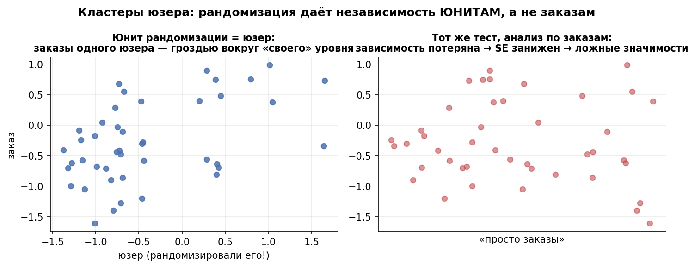
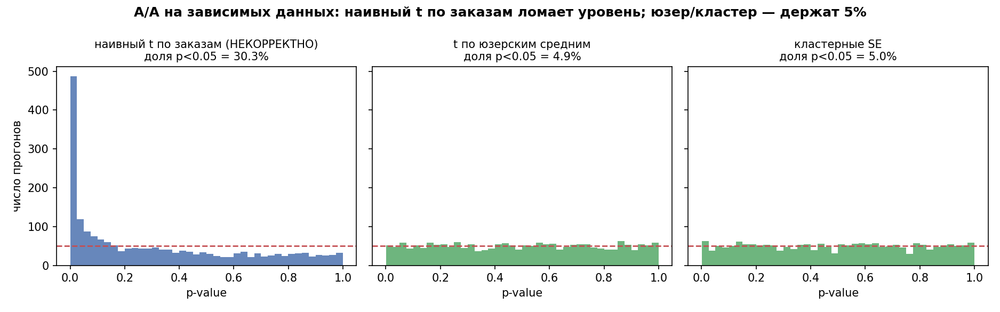
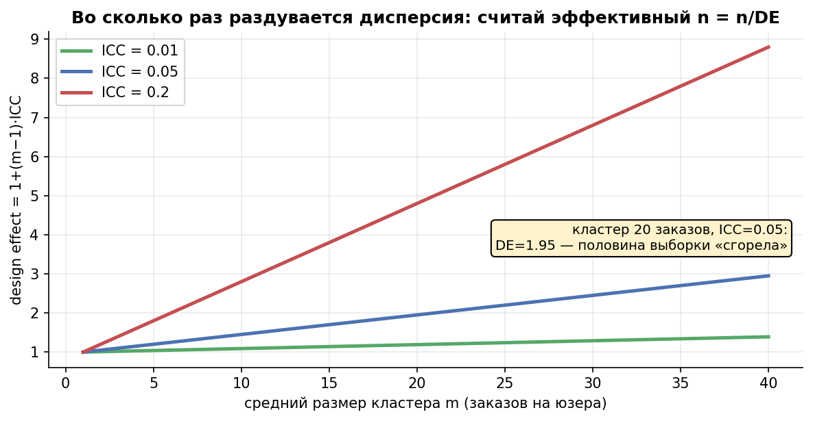

# Урок 3.2 — Юнит рандомизации и анализа

**Цель урока:** выбрать единицу назначения и неопределённости; оценить последствия кластеризации и повторных измерений.

**Перед уроком:** [проверьте зависимости темы](../../../course/PREREQUISITES.md); обозначения — в [словаре](../../../course/GLOSSARY.md).

## Зачем это аналитику

«ЕдаДома» запускает промо «бесплатная доставка первого заказа». Сплит-система умеет рандомизировать что угодно — вопрос, что именно рандомизировать. Варианты из реальных обсуждений:

- **по заказам** — «так быстрее наберём, заказов же больше»;
- **по сессиям** — «по открытию приложения»;
- **по юзерам** — стандарт;
- **по зонам доставки / курьерам** — «промо меняет нагрузку на зону, заказы теста и контроля пересекаются».

В основном примере назначение делается **по пользователю**, и все его заказы получают один вариант. Заказы внутри пользователя коррелируют, поэтому тест по всем событиям как независимым занижает SE. Другой дизайн — случайно назначать отдельные заказы одного пользователя в разные руки: тогда учитывают также ковариацию между руками внутри пользователя, а не применяют формулу двух независимых кластерных выборок. Такой within-user дизайн возможен без carryover и интерференции.

*Рис. 1. При независимых пользователях анализ учитывает их кластеры (юзерам), а не их заказам — кластеры зависимы.*

## Теория

### 1. Юнит рандомизации и юнит анализа: четыре кандидата

**Юнит рандомизации** — то, что бросают в тест/контроль монеткой (randomization unit); **юнит анализа** — строка датасета, на которой считается критерий (analysis unit). Кандидаты в «ЕдаДома»:

| Юнит | Когда бывает юнитом рандомизации | Что важно |
|---|---|---|
| **юзер** | интерфейсные фичи, промо, прайсинг | базовый случай; все события юзера внутри одной группы |
| **сессия** | редко оправдан | юзер попадает в обе группы → его поведение «перетекает», эффект размывается и нарушает независимость |
| **заказ** | почти никогда | один юзер = несколько заказов → наблюдения зависимы (тема этого урока); плюс эффект «полфичи» у одного человека |
| **кластер** (гео-зона, курьер, ресторан) | когда эффект *физически не изолировать* по юзам: логистика, маршруты, ценообразование зоны | лечит интерференцию (SUTVA), но вставляет внутрикластерную корреляцию и съедает размер выборки |

**Рабочее правило:** определите механизм назначения и зависимость исходов; рассчитывайте неопределённость на уровне независимых кластеров. Часто удобно агрегировать до юнита рандомизации, но строки анализа могут оставаться событиями при корректных кластерных SE. Рандомизация делает назначение независимым от потенциальных исходов; она не гарантирует независимость самих исходов и не устраняет интерференцию.

### 2. Что ломается, когда юнит анализа мельче: занижение SE

Модель правды: у юзера $i$ есть $m$ заказов $y_{i1},\dots,y_{im}$ с внутрикластерной корреляцией

$$\rho = \mathrm{corr}(y_{ij}, y_{ik}) = \frac{\tau^2}{\tau^2 + \sigma^2},$$

где $\tau^2$ — дисперсия «юзерского уровня» (бюджет, вкус), $\sigma^2$ — шум отдельного заказа. Дисперсия среднего по $n$ юзерам × $m$ заказов — уже не $\sigma_{\text{total}}^2/(nm)$, а

$$\mathrm{Var}(\bar y) = \frac{\sigma_{\text{total}}^2}{nm}\big(1 + (m-1)\rho\big), \qquad \sigma_{\text{total}}^2 = \tau^2+\sigma^2.$$

Наивный t-тест по заказам использует первую формулу без скобки — и **занижает SE в $\sqrt{1+(m-1)\rho}$ раз**. Статистика раздувается во столько же раз, и фактический уровень значимости:

$$\alpha_{\text{факт}} = 2\Phi\!\Big(-\frac{1{,}96}{\sqrt{1+(m-1)\rho}}\Big)$$

Считаем для правдоподобных величин: $m=4$ заказа на юзера, $\rho = 0{,}25$ → SE занижен в 1,32 раза → $\alpha_{\text{факт}} = 2\Phi(-1{,}48) \approx 14\%$. Для $m=6$, $\rho=0{,}44$ (наши параметры из практики): $\sqrt{3{,}3}=1{,}81$ → $\alpha_{\text{факт}} \approx 28\%$ по формуле и 30% в симуляции. Каждый третий-четвёртый A/A-тест «прокрашивается» — раскатываются «механики-пустышки».

Интуиция без формул: информация живёт в юнитах рандомизации. У вас 6 000 юзеров — значит, «независимых бросков монеты» примерно 6 000, и никакие 30 000 заказов не сделают их больше. Заказы — это повторные замеры одних и тех же людей.

*Рис. 2. A/A-тест: наивный t по заказам даёт α≈30% (заниженные SE), по юзерам — честные 5% (из практики).*

### 3. ICC и design effect: сколько стоит кластеризация

Скобка $1+(m-1)\rho$ — **design effect** (DEFF). Она конвертирует «наблюдения» в «эффективные наблюдения»:

$$n_{\text{эфф}} = \frac{n_{\text{набл}}}{1+(m-1)\rho}$$

Пример: 30 000 заказов у 5 000 пользователей, m=6 и ρ=0,44 дают DEFF=3,2, то есть 9 375 эквивалентных независимых **заказов**. Это поправка к дизайну, ошибочно посчитанному по дисперсии отдельных заказов. Если n уже рассчитан по дисперсии пользовательских агрегатов, повторно умножать его на DEFF нельзя.

- $\rho$ для чеков одного юзера в продуктовых данных обычно 0,2–0,5; для гео-кластеров — формально меньше (0,01–0,1 на уровне города), но при сотнях юзеров на город DEFF всё равно взрывается;
- DEFF растёт линейно по $m$: кластеры по 2–3 наблюдения почти бесплатны, по 50 — катастрофа;
- при неравных кластерах берут средний размер $\bar m$ (поправка на разброс размеров — второстепенна, пока CV размеров < 0,5).

Оценка $\rho$ по данным — однофакторный дисперсионный анализ: $\widehat{ICC} = \dfrac{MS_B - MS_W}{MS_B + (m_0-1)MS_W}$, где $MS_B$/$MS_W$ — меж- и внутрикластерные средние квадраты, $m_0$ — эффективный средний размер кластера. В практике реализуем и сверим с истинным значением генератора.

### 4. Лекарство: кластерные SE (ЦПТ по кластерам)

Если независимы кластеры — пусть ЦПТ и работает по кластерам. Для метрики «среднее значение на наблюдение» агрегируем юниты в кластерные суммы $S_i = \sum_j y_{ij}$, $m_i$ — размер кластера, и оцениваем

$$\hat\theta = \frac{\sum_i S_i}{\sum_i m_i}, \qquad SE^2(\hat\theta) = \frac{\sum_i (S_i - \hat\theta\, m_i)^2}{\big(\sum_i m_i\big)^2}$$

Это ratio-оценщик по кластерам: невязки S_i−θm_i измеряют вклад каждого кластера. Для конечной выборки умножают SE² на G/(G−1), где G — число кластеров. При одинаковом m оценка и исправленная дисперсия совпадают с анализом пользовательских средних; для точного совпадения p-value нужен тот же t-reference, а не нормальный z-reference.

Три практических следствия:

1. **Считает правильную неопределённость**: в A/A доля p<0,05 возвращается к 5% (проверим симуляцией).
2. **Число кластеров — вот что играет роль n**: ЦПТ по кластерам требует «достаточно» кластеров (ориентир от 30–50 на группу); 5 000 юзеров в 4 зонах — это 4 наблюдения, а не 5 000, как бы SE ни считались.
3. **Кластерные SE в регрессиях** (в statsmodels — `cov_type="cluster"`) — тот же принцип на языке М2.5: обычные SE ошибочны, когда корреляция внутри кластеров.

### 5. Кластерная рандомизация: когда юзера мало

Иногда мельчать нельзя в другую сторону — эффект *перетекает* между юзерами (нарушение SUTVA из М6.1): новая логистика маршрутов ускоряет доставку и тесту, и контролю в той же зоне; промо в городе меняет поведение ресторанов для всех. Тогда рандомизируют **кластеры**: зоны доставки, города, курьеров. Цена — та же ICC: юзеры в одной зоне похожи (доход, кухня, плотность), и DEFF умножает требуемый размер выборки из урока 3.1 на $1+(\bar m - 1)\rho_{\text{гео}}$. Сотни юзеров на город при $\rho_{\text{гео}} = 0{,}02$ — уже DEFF $\approx 5$–$10$: гео-тесты живут неделями-месяцами. Альтернативы, которые смягчают цену: switchback (включение/выключение по времени, М4.3), парный матчинг городов, двухуровневые дизайны. Но правило неизменно: учитываем зависимость на уровне рандомизации.

*Рис. 3. Кластерная рандомизация лечит интерференцию, но сжигает эффективный n: DEFF = 1+(m−1)·ICC.*

### 6. Мостик к следующему уроку: ratio-метрики

Самый частый случай «юнит анализа мельче юнита рандомизации» — пользовательские кластеры в **ratio-метриках**: средний чек = $\sum$ выручки / $\sum$ заказов, CTR = $\sum$ кликов / $\sum$ показов. Юнит рандомизации — юзер, юнит изменения — заказ/клик. Числитель и знаменатель зависимы (юзер с большим числом заказов тянет и сумму, и счётчик), и наивный t-тест по заказам ломается ровно тем же механизмом, что в разделе 2, — но лечится уже не только кластерными SE, а целым семейством способов (бутстрап юзерами, дельта-метод, линеаризация). Это урок 3.3.

## Разбор на данных

Мини-датасет: 6 юзеров контрольной группы «ЕдаДома», по 2 заказа каждый (чеки, ₽):

| Юзер | Заказы | Среднее юзера |
|---|---|---|
| u1 | 660, 740 | 700 |
| u2 | 540, 620 | 580 |
| u3 | 790, 870 | 830 |
| u4 | 590, 670 | 630 |
| u5 | 500, 580 | 540 |
| u6 | 750, 830 | 790 |

**Наивный путь** (12 «независимых» заказов): среднее 678,3; SD заказов = 118,1; $SE_{\text{наивный}} = 118{,}1/\sqrt{12} = 34{,}1$ ₽.

**Честный путь** (6 юзерских средних): SD средних = 115,8; $SE = 115{,}8/\sqrt{6} = 47{,}3$ ₽.

SE занижена в 47,3/34,1 = **1,39 раза**. Если бы это был A/B-тест, фактический α: $2\Phi(-1{,}96 \cdot 34{,}1/47{,}3) = 2\Phi(-1{,}41) \approx 16\%$ — втрое больше номинала.

Теперь ICC по ANOVA. Для каждой пары SS_W=40²+40²=3200 при одной степени свободы; MS_W=3200. MS_B=2·Var(средних пользователей)=26833,3. Поэтому ICC=(26833,3−3200)/(26833,3+3200)=0,7869, DEFF=1,7869. Асимптотическое отношение SE≈√DEFF=1,337; фактические оценки на шести кластерах отличаются из-за конечных df. Сравнивать их как точное тождество нельзя.

## Подводные камни

1. **t-тест по заказам/кликам/показам при рандомизации по юзерам.** Делают: «заказов больше — тест мощнее». Грозит: SE занижен в $\sqrt{\text{DEFF}}$ раз, α с 5% уезжает к 15–30%, раскатка пустышек. Правильно: анализ на юните рандомизации (юзерские средние) или кластерные SE.
2. **Сессия как юнит рандомизации «по привычке».** Делают: сплит по открытию приложения. Грозит: один юзер в обеих группах; поведение и эффект перетекают (юзер видел новую сортировку — ищет её в «контрольной» сессии); независимости нет ни между сессиями, ни внутри. Правильно: юзер (или cookie/аккаунт — М4.3 про cookie churn).
3. **Забытый DEFF при кластерной рандомизации.** Делают: посчитали n по формуле урока 3.1 на юзерах и запустили гео-тест. Грозит: мощность в разы ниже проектной — DEFF при сотнях юзеров на город легко ×5–10. Правильно: $n_{\text{эфф}} = n/\text{DEFF}$ в знаменателе формулы; дизайнить по числу кластеров.
4. **Кластерных SE мало, если кластеров мало.** Делают: 4 зоны, 5 000 юзеров, кластерные SE посчитаны — «всё честно». Грозит: ЦПТ по 4 кластерам не работает; асимптотика по кластерам, а не по наблюдениям. Правильно: ориентир 30+ кластеров на группу; иначе — точные перестановки по кластерам (М2.3) или другой дизайн (switchback).
5. **ICC по тесту, а не по пре-периоду.** Делают: оценивают ρ на данных эксперимента и удивляются «странной» величине. Грозит: ρ сама оценена с шумом, а в тесте ещё и смешана с эффектом. Правильно: оценивать по историческим A/A-данным на том же юните/кластере; DEFF — часть дизайн-дока.
6. **«Независимость» проверяют взглядом на корреляцию юзеров.** Делают: «корреляция заказов 0,4, но это же разные заказы». Грозит: подмена independence в смысле критерия (i.i.d. строки датасета) содержательной «похожестью». Правильно: вопрос не «похожи ли», а «порождает ли рандомация независимые строки»; если строка мельче юнита рандомизации — зависима по построению.
7. **Среднее юзерских средних как «исправление».** Делают: заменили заказы на юзерские средние и думают, что теперь измеряют то же самое. Грозит: для метрик «среднее на юзера» — да; для глобальных ratio (средний чек) среднее средних — другая метрика (может расходиться по направлению, урок 3.3). Правильно: знать, какая метрика нужна бизнесу — поюзерная или глобальная ratio.

## Практика

Файл [practice_3_2.py](practice/practice_3_2.py) (percent-формат, numpy/scipy/matplotlib, seed зафиксирован). Модель: юзеры «ЕдаДома» с заказами; чек юзера $= e^{u_i + e_{ij}}$, $u_i$ — «уровень кошелька» (корреляция заказов внутри юзера), $m_i = 1 + \text{Poisson}(5)$ заказов на юзера (в среднем 6), 500 юзеров на группу, 2 000 A/A-прогонов. Четыре блока:

1. **A/A: три критерия** — наивный t по заказам, t по юзерским средним, кластерные SE (ratio-оценщик по кластерным суммам): гистограммы p-value и доли p<0,05 ([practice_3_2_aa_levels.png](images/practice_3_2_aa_levels.png)).
2. **Оценка ICC** однофакторным ANOVA на данных без эффекта — сверка с истинным значением генератора.
3. **DEFF и эффективный n** для одной реализации: сколько стоят ~6 000 заказов 1 000 юзеров.
4. **А/B с реальным эффектом +3% к чеку**: мощность трёх критериев ([practice_3_2_power.png](images/practice_3_2_power.png)).

Что должны увидеть (числа реального запуска):

- блок 1: доля p<0,05 — **наивный по заказам = 30,3%** (при номинале 5%), **по юзерам = 4,9%**, **кластерные SE = 5,0%** — гистограмма наивного p-value перевешена к нулю, двух остальных — равномерна;
- блок 2: $\widehat{ICC} = 0{,}438$ против истинного 0,438 (SD повторов 0,019) — ANOVA-оценка восстанавливает ρ по данным;
- блок 3: DEFF = 3,27 → 6 071 заказ 1 000 юзеров стоит **1 858 эффективных наблюдений** — в 3,3 раза меньше «строк датасета»; предсказанное завышение SE ×1,81;
- блок 4: при эффекте +3% «мощность» наивного 43,5% — но куплена она сломанным уровнем (30% ложных срабатываний в A/A); честные критерии дают 13,2% (юзерские средние) и 12,0% (кластерные SE) — сопоставимы между собой, а разница с наивным — целиком иллюзия.

## Домашнее задание

**Задача 1.** 10 000 заказов принадлежат 2 000 юзерам; ICC чеков внутри юзера 0,3. Сколько независимых наблюдений вы реально имеете? Каким станет фактическое α наивного t-теста по заказам?

Ответ

$m = 5$, DEFF $= 1 + 4 \cdot 0{,}3 = 2{,}2$ → эффективных наблюдений $10\,000/2{,}2 \approx 4\,545$. SE занижен в $\sqrt{2{,}2} = 1{,}48$ раза; $\alpha_{\text{факт}} = 2\Phi(-1{,}96/1{,}48) = 2\Phi(-1{,}32) \approx 18{,}6\%$. Каждый пятый A/A «прокрасится».

**Задача 2.** В вашем продукте CTR считают по показам, сплит — по юзерам. Коллега предлагает «усилить тест: строк побольше». Оцените DEFF, если юзер видит в среднем 40 показов, а ICC кликов одного юзера 0,02. Почему даже маленькая ICC опасна при больших m?

Ответ

DEFF $= 1 + 39 \cdot 0{,}02 = 1{,}78$: 40 показов стоят 22 независимых наблюдения. ICC умножается на $(m-1)$: при больших m даже крошечная корреляция конвертирует «миллионы показов» в десятки тысяч эффективных. Наивный α: $2\Phi(-1{,}96/\sqrt{1{,}78}) \approx 12\%$.

**Задача 3.** Гео-тест: 40 городов, в среднем 250 юзеров в городе, ICC по выручке между юзерами одного города 0,04. Сколько эффективных наблюдений? Хватит ли этого для MDE +2% выручки при SD выручки 25% от средней?

Ответ

DEFF $= 1 + 249 \cdot 0{,}04 = 10{,}96$; $n_{\text{эфф}} = 10\,000/10{,}96 \approx 912$. MDE при $n_{\text{эфф}}$ на группу 456: $2{,}8 \cdot 0{,}25 \cdot \sqrt{2/456} \approx 5{,}8\%$ — тест видит только огромные эффекты. Вывод: либо больше городов (не юзеров!), либо чувствительная метрика, либо switchback.

**Задача 4.** Почему кластерные SE «чинят» уровень, но не делают тест мощнее анализа по юзерским средним? Откуда тогда берётся выгода кластерного подхода перед «просто юзерскими средними»?

Ответ

При равных кластерах кластерный ratio-оценщик и t-тест на юзерских средних — одна и та же статистика (эквивалентность из раздела 4); чиня SE, мы просто возвращаем честную неопределённость — мощность определяется числом юнитов рандомизации и ICC. Выгода кластерного подхода проявляется при неравных $m_i$: он корректно взвешивает кластеры (анализирует глобальное «среднее на наблюдение»), работает в регрессиях с ковариатами (CUPED, стратификация — 3.5) и единообразен для ratio-метрик (3.3).

**Задача 5.** A/A-тест по заказам прокрасился с p = 0,03. Назовите три проверки до вывода «сплит сломан».

Ответ

(1) Юнит анализа мельче юнита рандомизации — p посчитан по зависимым заказам? Пересчитать на юзерах/кластерными SE. (2) Одна метрика или много? При 20 просмотренных метрика p=0,03 — норма (урок 2.4). (3) SRM: совпадают ли размеры групп с планом (хи-квадрат, М4.2)? И только если p по-прежнему «странный» на правильном юните — подозревать сплит-систему (А/A-аудит, синтетические прогоны из 3.1).

## Шпаргалка

1. Юнит рандомизации = чему бросили монету; юнит анализа = строка датасета критерия; **анализ на юните рандомизации**, MDE/power — на юните анализа.
2. Рандомизация даёт независимость только между юнитами назначения; всё мельче — зависимые повторные замеры одних и тех же юнитов.
3. Наивный t по зависимым наблюдениям занижает SE в $\sqrt{1+(m-1)\rho}$ раз: α с 5% уезжает к 15–30% — «механики-пустышки».
4. $\mathrm{ICC} = \tau^2/(\tau^2+\sigma^2)$ — корреляция двух наблюдений внутри кластера; типично 0,2–0,5 для чеков/кликов юзера.
5. DEFF $= 1+(m-1)\cdot$ICC; $n_{\text{эфф}} = n/\text{DEFF}$; при больших m опасна даже ICC 0,02; в дизайн-док — DEFF на юните анализа.
6. Кластерные SE: ЦПТ по кластерам; $SE^2 = \sum_i(S_i - \hat\theta m_i)^2 / (\sum_i m_i)^2$; при равных кластерах = t-тест на кластерных средних.
7. Асимптотика — по кластерам: 4 зоны = 4 наблюдения; ориентир 30+ кластеров на группу, иначе перестановки/switchback.
8. Кластерная рандомизация (гео/курьер/ресторан) лечит интерференцию (SUTVA), но её DEFF умножает выборку урока 3.1 — гео-тесты дорогие по времени.
9. ICC оценивают ANOVA-оценкой на исторических данных того же юнита; не по тесту с эффектом.
10. Ratio-метрики (чек, CTR) — частный случай «мельче юнита рандомизации» + зависимость числителя и знаменателя → способы урока 3.3.

## Источники

- koch-kir, «Кластерные эксперименты, ч.1. Юниты тестирования и анализа, симуляции зависимых данных» (16.11.2025) — https://medium.com/@koch-kir — юнит рандомизации ≠ юнит анализа; пример со скидкой на доставку; ICC и design effect = 1+(m−1)·ICC; рекомендация «юнит анализа = юнит назначения» (конспект: `materials/web/web-articles.md` §3.1).
- Alex Deng, *Causal Inference and Its Applications in Online Industry*, гл. 8 «Statistical Analysis of A/B Tests» — randomization unit vs analysis unit, оценка дисперсии, CLT — https://alexdeng.github.io/causal/abstats.html (конспект: `materials/web/alexdeng-causal-book.md`); гл. 3.1 — три механизма рандомизации, включая clustered.
- Симулятор АБ-тестов (karpov.courses), урок 13 «Полный пайплайн» — эксперимент «ускорение доставки» с рандомизацией по курьерам — `materials/local/ab-simulator.md`.
- Atlamos (Павел Мосин), «Линеаризация: зачем и как укрощать ratio-метрики» — https://habr.com/ru/companies/kuper/articles/768826/ — сломанный уровень наивного критерия, ложные «механики-пустышки» (конспект: `materials/web/web-articles.md` §4.1).
- HKU Digital Experimentation Methods, L5 — кластеризация наблюдений в экспериментах — `materials/local/digital-experimentation-course.md`.
- Kohavi, Tang, Xu, *Trustworthy Online Controlled Experiments*, гл. 11–12 — интерференция и сетевые эффекты, сплит-система — `materials/local/books.md`.
