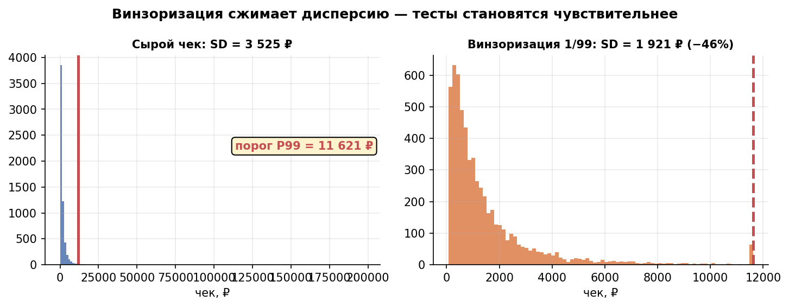
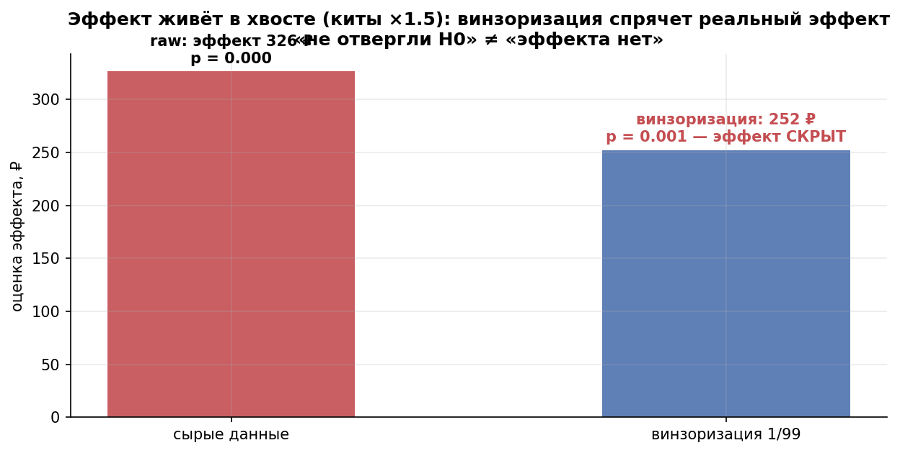
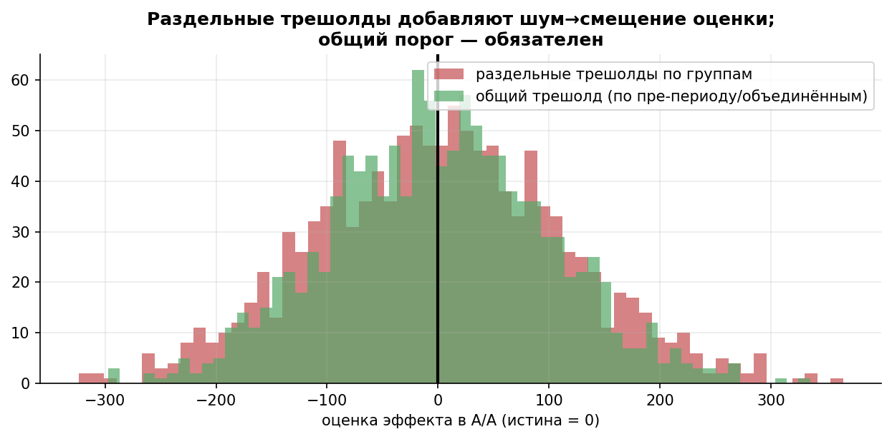

# Урок 3.4 — Выбросы и трансформации метрик: винзоризация под микроскопом

**Цель урока:** оценить, как log, обрезка и винзоризация меняют целевую величину и чувствительность к тяжёлому хвосту.

**Перед уроком:** [проверьте зависимости темы](../../../course/PREREQUISITES.md); обозначения — в [словаре](../../../course/GLOSSARY.md).

## Зачем это аналитику

Чек «ЕдаДома» логнормален: медиана 900 ₽, среднее 2 394 ₽, SD 5 952 ₽ — SD в 2,5 раза больше среднего, потому что 5% пользователей-«китов» заказывают на десятки тысяч. Напомним из М1: «Илон Маск заходит в Пятёрочку» — и среднее резко меняется, хотя типичный покупатель прежний. Но в АБ-тесте киты бьют не только по среднему: они бьют по **мощности**. SE среднего пропорционален σ, а нужный размер выборки — σ² (урок 3.1). Хвост раздувает σ → тест не замечает реальные изменения → команда рискует пропустить полезные фичи.

Соблазн очевиден: «порежем выбросы». И вот тут заказчик курса прав, требуя критического разбора: **винзоризация — это не «очистка данных», а выбор другой величины для измерения**. Она может спасти мощность (эффект «в теле» распределения: у нас мощность 26% → 47%), а может тихо уничтожить результат теста (эффект «на китах»: 58% → 4%, оценка эффекта 482 → 0 ₽). Разница — в том, где живёт эффект, а вы этого не знаете, пока не посмотрели. Этот урок — про то, как пользоваться острым инструментом и не порезаться.

## Теория

### 1. Почему киты убивают мощность

Механика из М1–М2, собранная в одну цепочку:

$$\text{киты} \Rightarrow \sigma \uparrow \Rightarrow SE = \sigma/\sqrt{n} \uparrow \Rightarrow t = \frac{\text{эффект}}{SE} \downarrow \Rightarrow \text{мощность} \downarrow,\ MDE \uparrow$$

$$n \approx \frac{(z_{1-\alpha/2}+z_{1-\beta})^2 \cdot 2\sigma^2}{\Delta^2} \quad \text{— зависимость от } \sigma \text{ квадратичная!}$$

На наших данных (практика, шаг 1): логнормальный чек с σ_log = 1,4 даёт SD = 5 952 ₽. Винзоризация — замена значений за порогом самим порогом:

| метрика | SD, ₽ | SD меньше | n для той же мощности |
|---|---|---|---|
| raw чек | 5 952 | — | 1,00 |
| винзоризация 1/99 (порог 23 385 ₽) | 3 686 | −38% | 0,38 |
| винзоризация 5/95 (порог 8 999 ₽) | 2 358 | −60% | **0,16** |

Винзоризация 5/95 уменьшает SD примерно в 2,5раза. **При том же численном эффекте на новой шкале** это соответствует≈16% исходного n. Для одной и той же фичи эффект также меняется: сравнивать нужно (σ_new/Δ_new)²/(σ_raw/Δ_raw)². По уменьшению одной дисперсии нельзя обещать ту же мощность для сырого ARPU или календарное сокращение 14→2 дня.

*Рис. 1. Винзоризация сжимает дисперсию (SD −38% при 1/99) — тесты становятся чувствительнее.*

### 2. Арсенал: пять способов, пять эстимандов

- **Фильтрация (удаление)** — выбросы исключаются совсем. Легитимна только для *сломанных* наблюдений: боты, дубли, сбои телеметрии, нулевые «зависания» датчиков. Удалять живых китов нельзя: это деньги. Правило симулятора (урок 6): доля отфильтрованных не должна зависеть от результата или назначения; различие долей исключения требует диагностики.
- **Клиппинг (цензурирование)** — всё выше константы C заменяется на C. Отличается от винзоризации только источником порога: фиксированная бизнес-константа (например, «чек не бывает больше 100 000 ₽») вместо перцентиля данных.
- **Винзоризация** — значения за перцентилями [p, 100−p] заменяются на эти перцентили: `np.clip(x, P_p, P_{100−p})`. Крайние случаи 1/99 и 5/95. Стандарт де-факто в индустрии, «почти всегда безопаснее удаления» (X5).
- **Лог-трансформация** — монотонный перевод: сжимает правый хвост, превращает мультипликативные эффекты («+10% всем») в аддитивные. Меняет шкалу: среднее логарифмов ≠ логарифм среднего; тестируется геометрическое среднее.
- **Ранги** — предельный случай: значения заменяются рангами (Манн–Уитни из 2.3). Максимальная устойчивость к хвосту, но проверяет стохастическое превосходство, а не разность средних, и эффект в «₽ на юзера» из неё не достать.

Общее у всех пяти: **каждый — это другая метрика**. t-тест на log-чеке отвечает на вопрос «изменилось ли среднее лог-чеков», а не «изменилась ли выручка». Это не делает их запрещёнными — это делает выбор осознанным решением, которое надо зафиксировать до теста.

### 3. Как выбирать порог: 1/99 против 5/95

Правило: **минимальная агрессивность, дающая нужную чувствительность**. Практический алгоритм:

1. Взять исторические данные (пре-период), построить кривую `SD(p)` для перцентиля порога от 0,1% до 10%.
2. Кривая обычно имеет «колено»: первые полпроцента хвоста дают большую часть снижения SD, дальше отдача падает, а цена (искажение эстиманда) растёт.
3. Выбрать точку у колена; проверить на исторических же данных, что A/A-уровень держится (шаг 5 подраздела 4).

У нас: 1/99 уже забирает 38% SD, 5/95 — 60%. Более агрессивный порог даёт больше мощности на «теле», но тем жесточе прячет эффект на хвосте (см. ниже). Отсюда типичный дефолт — 1/99 (или 0.5/99.5): он менее агрессивен, но также может скрыть реальный эффект хвоста. 5/95 — уже осознанная ставка «моя фича не может работать на китах»; такая ставка должна быть письменно обоснована в дизайн-доке.

### 4. Критические нюансы — сердце урока

**(1) Один трешолд на обе группы, посчитанный по пре-периоду или объединённой выборке.** Если порог считается отдельно в каждой группе по данным эксперимента, он становится функцией данных, которые уже содержат эффект (и шум). Последствия измеримы (практика, шаг 4):

| политика порога | A/A: доля p<0,05 | A/B на китах: E[оценка] ± SD |
|---|---|---|
| общий, по пре-периоду | 5,2% | 0 ± 76 ₽ (честный «ноль» своего эстиманда) |
| общий, по pooled выборке | 5,3% | ≈ 0 ± 76 ₽ |
| **раздельные по группам** | **16,3%** | 119 ± 210 ₽ — «число ни про что» |

Раздельные оценённые пороги с наивным SE могут нарушить уровень (каждая группа прижимается к своему случайному квантилю — фиктивная разница) и делают оценку зависимой от шума экстремалей. Три политики — три разных ответа о деньгах.

**(2) Винзоризация меняет эстиманд.** Заменяя хвост порогом, вы договариваетесь измерять «средний чек с прижатым хвостом». Если фича работает именно на китах (программа лояльности для корпоративных клиентов), эффект попадает под нож: в нашей практике истинный эффект +482 ₽ (+20% выручки) после 5/95 превратился в оценку 0 ₽, мощность упала до 4% — уровня A/A. «Значимого эффекта нет» ≠ «эффекта нет»: это «мы перестали его измерять». Классический сценарий потери денег: тест «не прокрасил» → фичу закопали → а киты тем временем ушли туда, где фича была.

**(3) Новые киты.** Фиксированный исторический порог применяется ко всем новым пользователям по одному правилу. Доля за порогом — дополнительный **outcome**, на который фича может влиять, а не инвариант наподобие SRM. Её различие показывает изменение хвоста и само по себе не доказывает ошибку рандомизации.

**(4) Хвост — часть денежного эффекта.** Применимость трансформации к OEC решается через бизнес-цель и ожидаемое расположение эффекта. Нельзя заранее объявить хвост ARPU статистическим шумом: там могут находиться и основной доход, и вред фичи.

**(5) Проверка трансформации: A/A + симуляции + перцентильный анализ.** Перед внедрением: (а) A/A на исторических данных — доля p<0,05 ≈ 5% и p-value равномерны (урок 4.2); (б) синтетические A/B с эффектами «в теле» и «в хвосте» — трансформация должна видеть то, что вы обещаете; (в) после теста — перцентильный анализ эффекта: разность средних по децилям базового уровня показывает, *где* живёт эффект (у нас: D1–D9 ≈ 0, D10 = +4 684 ₽). Если эффект в верхних децилях — винзоризация вам враг.

*Рис. 2. Опасный побочный эффект: если эффект живёт в хвосте (киты ×1.5), винзоризация его спрячет — «не отвергли H0» ≠ «эффекта нет».*

*Рис. 3. Раздельные трешолды по группам ломают тест (смещение и раздутый α); порог — один, из пре-периода.*

### 5. Как оформить правильно: дизайн-док и единый контур

Винзоризация легитимна тогда и только тогда, когда она **предварительно зарегистрирована**. В дизайн-доке теста (шаблон — урок 4.1) до запуска фиксируются:

- сама трансформация и перцентили: «ARPU винзоризуется 1/99 по порогу, посчитанному на пре-периоде 28 дней до старта»;
- источник порога: фиксированное число из пре-периода (лучший вариант — воспроизводимо) или правило «pooled по объединённой выборке» (чуть шумнее, допустимо);
- что происходит с юзерами без пре-истории (новички): к ним применяется общее правило или заранее обоснованный порог сегмента — главное, одинаково в группах;
- параллельные метрики: сырая выручка с собственным CI, доля пользователей за порогом как secondary outcome, проверки качества логирования отдельно;

И второе: **единый контур на все метрики платформы**. Если чек винзоризуется в отчёте одной команды на 5/95, а другой — на 1/99, эксперименты несравнимы, а каждый аналитик получает степень свободы подкрутить порог до нужного p-value (p-hacking через трансформацию). Порог — часть определения метрики, а не решение аналитика после теста.

## Разбор на данных

Тест «ЕдаДома»: фича «корпоративные профили» (заказ для офиса). Ожидание продакта: киты (топ-5% по чеку) увеличат заказы в ~1,5 раза. Дизайн: n = 2 000 юзеров на группу, α = 5%. Чек ~ LogNormal(медиана 900 ₽, σ_log = 1,4). Пороги из пре-периода: P95 = 8 999 ₽, P99 = 23 385 ₽. Симуляция 1 500 миров (практика, шаги 2–3):

| метрика | эффект на китах (+482 ₽ = +20% выручки) | эффект в теле (+239 ₽ = +10% всем) |
|---|---|---|
| | мощность / сохранили эффект | мощность / оценка |
| raw | 58% / 100% | 26% / +242 ₽ |
| винзоризация 1/99 | 39% / 45% | 37% / +200 ₽ |
| винзоризация 5/95 | **4% / −0%** | 47% / +143 ₽ |
| log | 7% / ~0% | 58% / +0,096 log |

Три вывода. Первый: для эффекта «в теле» трансформации работают — log поднимает мощность с 26% до 58%, 5/95 до 47%; при этом оценки в ₽ расходятся (242/200/143) — каждая метрика измеряет своё. Второй: для эффекта «на китах» 5/95 — катастрофа: реальный +20% выручки даёт мощность 4%, то есть тест честно молчит в 96% миров; log тоже слеп (эффект у 5% юзеров почти не сдвигает E[log чека]) — «слабое место» логарифма, о котором забывают. Третий: перцентильный анализ (разность по децилям базового чека) однозначно локализует эффект: D1–D9 = −1…+2 ₽, D10 = +4 684 ₽ — никакая агрегированная метрика не заменит этот график при ответе «а где эффект живёт?».

Правильный дизайн для этой фичи: основная метрика — raw ARPU (или ARPU топ-дециля как отдельная метрика), винзоризация — только как дополнительная «метрика тела», guardrail на хвост — сырая выручка китов. И наоборот, для «скидки на доставку» (эффект в теле) винзоризация 5/95 сокращает тест в разы без потери смысла.

## Подводные камни

1. **Раздельные пороги по группам.** Делают: «в каждой группе отсекли свои 5%». Грозит: обычный Welch не учитывает оценку собственных квантилей каждой руки; его α может вырасти. Для такого estimand нужен специальный корректный SE или bootstrap всей процедуры. Правильно: один порог на обе группы, посчитанный по пре-периоду или объединённой выборке.
2. **Порог, пересчитанный по ходу теста.** Делают: «посмотрели на гистограмму после первой недели и поправили порожек». Грозит: это peeking + p-hacking в одном флаконе — уровень α не контролируется. Правильно: порог зафиксирован в дизайн-доке до запуска; менять — только с новым тестом.
3. **«Эффекта нет» после винзоризации.** Делают: 5/95, p = 0,2, фича закопана. Грозит: эффект на китах спрятан трансформацией — потерянные деньги и мотивация команды. Правильно: перед выводом — перцентильный анализ эффекта и guardrail на сырую метрику хвоста; «не отвергли H0» ≠ «эффекта нет».
4. **Винзоризация денежной метрики при решении о хвосте.** Делают: винзоризуют выручку топ-клиентов «для стабильности». Грозит: статистика молча приняла бизнес-решение «хвост не важен». Правильно: если решение касается хвоста — хвост и есть метрика (сырая или по сегменту китов).
5. **Фильтрация живых китов как «выбросов».** Делают: IQR-правило 1,5× выкинуло 7% самых платящих. Грозит: смещение оценки и удаление источника эффекта; у X5 IQR-удаление агрессивнее винзоризации ровно поэтому. Правильно: фильтровать только сломанные наблюдения (боты, дубли, сбои); правило фильтрации задаётся до анализа, влияние фичи на исключение проверяется отдельно.
6. **Забытая проверка A/A-уровня трансформации.** Делают: внедрили комбинированную трансформацию (log + винзоризация + бакеты) и верят ей. Грозит: составные процедуры легко ломают равномерность p-value — и все тесты врут. Правильно: каждая трансформация проходит A/A на исторических данных и синтетические A/B (тело/хвост) до боя.
7. **Сравнение оценок эффекта между разными трансформациями.** Делают: «в этом тесте +143 ₽ (5/95), в прошлом +240 ₽ (raw) — эффект просел». Грозит: числа — про разные эстиманды, сравнение бессмысленно. Правильно: сравнивать эффекты только в одной метрике; конверсию из log-эффекта в ₽ делать через модель, а не в лоб.

## Практика

Файл: [practice_3_4.py](practice/practice_3_4.py) (percent-формат, numpy/scipy/matplotlib/pandas, seed зафиксирован). Что делает:

1. **Киты и дисперсия**: SD сырого чека (5 952 ₽) против винзоризации 1/99 (3 686) и 5/95 (2 358) и лог-метрики; перевод в выборку при одинаковом численном эффекте на соответствующей шкале (5/95 → 16% исходной).
2. **Эффект в хвосте** (топ-5% китов ×1,5, n = 2 000, 1 500 миров): мощность raw 58% / 1-99 39% / 5-95 **4%** / log 7%; сколько эффекта сохранила каждая метрика (5/95 — 0%) + перцентильный анализ по децилям (эффект весь в D10 по невоздействованной baseline-метрике).
3. **Эффект в теле** (всем ×1,1): мощность raw 26% / 5-95 47% / log 58% — трансформации работают, оценки в ₽ расходятся (эстиманд!).
4. **Раздельные трешолды**: A/A-уровень шести политик (раздельные — 16,3% против 5% у общих) + A/B на китах: три политики дают 480±245, 0±76 и 119±210 ₽ — три разных ответа.
5. **A/A-уровень всех трансформаций**: raw, винзоризации, log, ранги (Манн–Уитни) держат 5%.

Графики: [practice_3_4_sd.png](images/practice_3_4_sd.png) (хвост и пороги), [practice_3_4_tail.png](images/practice_3_4_tail.png) (мощность метрик + децили эффекта), [practice_3_4_thresholds.png](images/practice_3_4_thresholds.png) (уровень политик порогов + дрейф оценок).

## Домашнее задание

1. SD чека 5 952 ₽, после винзоризации 5/95 — 2 358 ₽. Тест планировался на 14 дней при фиксированном MDE — до скольких дней сократился бы? Во сколько раз меньше юзеров нужно?

Ответ

При одинаковом численном Δ на соответствующей шкале n_new/n_raw=(2358/5952)²≈0,157. Это≈2,2 дня эквивалентного независимого трафика вместо 14. Для той же фичи нужно дополнительно учесть, во сколько раз изменился Δ после clipping; календарную длительность ограничивают зрелость метрики, новые независимые пользователи и целевые циклы поведения.

2. Продакт запускает фичу для корпоративных клиентов (эффект ожидается только на китах) и просит вас «для стабильности» винзоризовать ARPU по 5/95. Ваш ответ?

Ответ

Нельзя: по нашей симуляции такая винзоризация прячет эффект на китах полностью (оценка 0 ₽ при истинных +20% выручки, мощность = уровню A/A). Правильный дизайн: основная метрика — raw ARPU или ARPU по сегменту китов (топ-дециль по пре-периоду), винзоризованная метрика — дополнительная для «тела»; плюс перцентильный анализ в отчёте. И явно зафиксировать в дизайн-доке, что решение о фиче принимается по сырой выручке, а не по винзоризованной.

3. Почему в A/A раздельные пороги по группам накачивают долю p<0,05 (у нас — с 5% до 16%)? Качественно объясните механизм.

Ответ

Порог каждой группы — выборочный перцентиль, случайная величина с большой собственной дисперсией (в хвосте данных мало). Прижимая каждую группу к её случайному порогу, мы добавляем к разности средних дополнительный шум, коррелированный с хвостом именно этой группы. Эффекта нет, а разность «дышит» сильнее, чем в сырых данных → t-статистика превышает порог чаще, чем в 5% миров. Общий порог (лучше фиксированный из пре-периода) одинаков для групп, и этот шум вычитается.

4. Эффект «+10% всем» (в теле). Какие средние оценки дадут метрики raw / 1-99 / 5-95 на одних данных (истина +239 ₽) и что докладывать бизнесу?

Ответ

Каждая трансформация имеет собственный эффект, CI и проверяемую гипотезу. В отчёте отдельно показать raw ARPU и winsorized/log metrics с названиями шкал. Значимый эффект E[logY] или E[clip(Y)] **не делает** эффект E[Y] значимым. Перенос между шкалами возможен только при явно обоснованной модели, а не через сочетание raw-оценки и чужого p-value.

5. В эксперимент пришли новые пользователи, которых нет в пре-периоде, и среди них — новые киты. Что делать с порогом винзоризации?

Ответ

Применить зарегистрированное правило к новым пользователям. Доля за порогом может различаться из-за эффекта фичи и должна показываться как outcome; она не является инвариантом рандомизации. Не менять порог на основании результатов, чтобы получить удобный p-value.

## Шпаргалка

1. При планировании сравнивать стандартизованные эффекты Δ/σ; уменьшение SD трансформацией может сопровождаться уменьшением самого эффекта.
2. Инструменты: фильтрация (только сломанные данные), клиппинг (порог-константа), винзоризация (порог-перцентиль), log (мультипликативные эффекты → аддитивные), ранги (максимум устойчивости, минимум интерпретируемости).
3. Порог: минимальная агрессивность у «колена» кривой SD(p); дефолт 1/99; 5/95 — письменно обоснованная ставка «фича не работает на хвосте».
4. Один трешолд на обе группы: из пре-периода (идеал — фиксированное число) или pooled; раздельные = α 16% и «число ни про что».
5. Винзоризация меняет эстиманд: эффект на китах прячется целиком; «не отвергли H0» ≠ «эффекта нет».
6. Новые киты клиппируются общим историческим порогом; доля за порогом — outcome, который может измениться от фичи.
7. Метрика = деньги и решение о хвосте → хвост не винзоризовать, он и есть предмет решения.
8. Проверка трансформации до боя: A/A-уровень 5% + синтетические A/B (эффект в теле и в хвосте) + перцентильный анализ после.
9. Порог фиксируется в дизайн-доке до запуска и един для всех метрик контура — иначе это p-hacking через трансформацию.

## Источники

- X5 Product Analytics Academy, урок 4 «A/B по-взрослому» — работа с выбросами: IQR, винзоризация «почти всегда безопаснее», цифры снижения выборки до 59%/41% — `materials/local/x5-product-analytics.md`.
- Симулятор АБ-тестов (karpov.courses), урок 6 «Повышение чувствительности» — фильтрация выбросов (std ↓ ~10 раз), «доли фильтруемых не должны различаться», «большие платежи — основной доход» — `materials/local/ab-simulator.md`.
- Deng A., «Causal Inference...», гл. 8–9 — оценка дисперсии перцентильных метрик, поиск выбросов как диагностика качества эксперимента — https://alexdeng.github.io/causal/abstats.html (`materials/web/alexdeng-causal-book.md`).
- ВШЭ/karpov.courses «A/B-тестирование: углубленный курс», тема 7 — чувствительность и трансформации метрик — `materials/web/hse-ab-course.md`.
- Kohavi, Tang, Xu, «Trustworthy Online Controlled Experiments», гл. 8 — variance и outliers в онлайн-метриках — `materials/local/books.md` §1.
- Atlamos (Habr), «База: айсберг A/B-тестов» §преобразования сигналов — винзоризация в ряду CUPED/линеаризации/рангов — https://habr.com/ru/companies/kuper/articles/774608/ (`materials/web/web-articles.md`).
