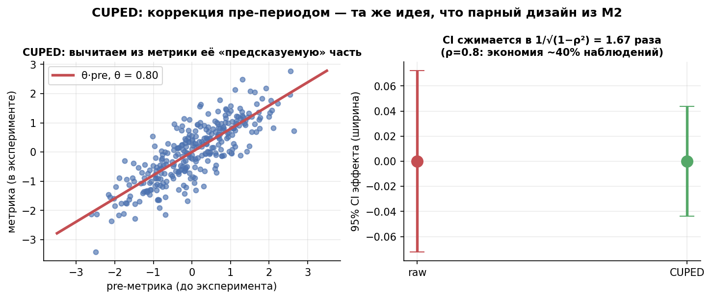
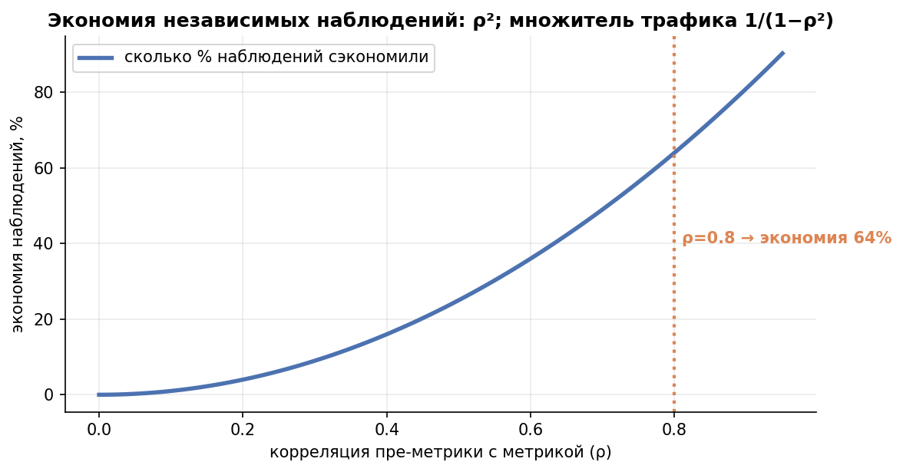

# Урок 3.5 — Снижение дисперсии: CUPED и семейство

**Цель урока:** применить CUPED с допустимыми ковариатами, связать его с регрессией и отделить экономию дисперсии от календарного срока.

**Перед уроком:** [проверьте зависимости темы](../../../course/PREREQUISITES.md); обозначения — в [словаре](../../../course/GLOSSARY.md).

## Зачем это аналитику

Урок 3.1 показал: n ~ σ². Урок 3.4 — как уменьшить σ, пожертвовав хвостом метрики. Но есть способ уменьшить шум, **ничего не выбрасывая из метрики**: у каждого юзера «ЕдаДома» уже есть история — выручка за 4 недели до теста, число заказов, город, платформа. Эта история предсказывает поведение в тесте (повторяющееся поведение: correlation трат до/после — симулятор, урок 9). Вычтем предсказуемую часть — останется чистый шум, и тот же эффект станет виден на выборке в разы меньше.

Цепочка ценности (X5, урок 4): меньше дисперсия → меньше выборка → быстрее тест → больше тестов за квартал при том же трафике. У X5 CUPED снял 42% дисперсии и срезал выборку с 570 до 330 на группу; в нашей практике (ниже) ρ = 0,8 даёт −64% наблюдений. Это самая «дорогая» тема модуля: каждый выигранный день теста — это дни, которые команда не ждёт.

И вторая причина: CUPED — это **та же регрессия из 2.5**, только без экзотики. Кто понял «дописал столбец пре-периода в дизайн-матрицу — получил ANCOVA», уже умеет CUPED. Урок собирает это в один фреймворк с стратификацией и линеаризацией.

## Теория

### 1. Идея и вывод: знакомая формула дисперсии разности

Парный дизайн из 2.2 экономил выборку, потому что «до» и «после» коррелируют: $s_d^2 = s_x^2 + s_y^2 - 2 r s_x s_y$ — вычитание $2 r s_x s_y$ гасит разброс. В классическом A/B пары нет: юзер либо в тесте, либо в контроле. Но у каждого юзера есть его **пре-метрика** $X$ (значение той же метрики до эксперимента) — «юзер сам себе контроль» ещё раз, теперь в роли ковариаты.

Определим скорректированную метрику $Y_{cv} = Y - \theta X$ и посчитаем её дисперсию — той же формулой разности из 2.2, только с коэффициентом $\theta$:

$$\mathrm{Var}(Y - \theta X) = \mathrm{Var}(Y) + \theta^2\mathrm{Var}(X) - 2\theta\,\mathrm{Cov}(X, Y)$$

Минимизируем по $\theta$ (приравниваем производную к нулю):

$$\theta^* = \frac{\mathrm{Cov}(X, Y)}{\mathrm{Var}(X)}, \qquad \mathrm{Var}(Y_{cv}) = \mathrm{Var}(Y) - \frac{\mathrm{Cov}^2(X,Y)}{\mathrm{Var}(X)} = \mathrm{Var}(Y)\,(1 - \rho^2)$$

где $\rho$ — корреляция ковариаты с метрикой. Это вся математика CUPED (Deng et al., 2013). Следствия:

- SE среднего сжимается в $1/\sqrt{1-\rho^2}$ раз: ρ=0,6 → ×1,25; ρ=0,8 → ×1,67 (наша симуляция: 1,23 и 1,66 — теория работает);
- нужный n падает в $1/(1-\rho^2)$ раз: экономия = ρ²: 36% и 64% наблюдений; тест 14 дней → 9 и 5 дней;
- парная разность «после − до» из 2.2 — частный случай с θ=1; CUPED просто подбирает θ под данные. При ρ→1 метрика почти детерминирована своей историей — и тесту почти не нужен шум.

При фиксированном, независимо оценённом θ рандомизация даёт E[meanX_B−meanX_A]=0, поэтому поправка несмещённа. Если θ оценён на том же эксперименте, он зависим от дисбаланса: точная несмещённость не следует из X⊥T. При стандартных условиях оценщик состоятелен, а конечновыборочное смещение/SE проверяют отдельно.

*Рис. 1. CUPED: вычитаем «предсказуемую» часть метрики; CI сжимается в 1/√(1−ρ²) — та же идея, что парный дизайн из М2.*

### 2. Выбор ковариаты: пре-метрика — главный рецепт, и почему нельзя «пост»

Требования к ковариате: (а) измерена **до** начала теста — эффекта тритмента в ней быть не может; (б) сильно коррелирует с метрикой; (в) определена одинаково для всех юзеров обеих групп.

Главный рецепт: **значение той же метрики в пре-периоде**. Повторяющееся поведение — самый сильный предиктор: выручка юзера за 4 недели до теста коррелирует с выручкой в тесте на 0,7–0,9. Практические кандидаты: ARPU пре-периода, число заказов, давность регистрации, город/платформа (слабее — идут дополнением).

Почему нельзя взять «что-нибудь порелевантнее из эксперимента» — например, метрику первой недели теста (корреляция же выше!)? Потому что такая ковариата **заражена эффектом**: тестовая группа уже отличается от контроля, и вычитание $\theta X$ вычитает часть самого эффекта. Наша симуляция (практика, шаг 5): ковариата, содержащая 80% эффекта, дала оценку 0,098 при истинных 0,200 — **съедено 51% эффекта**, и SE при этом не лучше правильного CUPED. Это тот же подводный камень №6 из 2.5 («ковариата, заражённая тритментом»), теперь с числами.

Отдельно: длина пре-периода — компромисс (shelter, гл. 3–4). Длиннее — стабильнее ковариата и выше ρ (больше наблюдений усредняется); но слишком длинный пре-период захватывает «другой продукт» (сезонность, промо, другая аудитория) и слабее представляет текущее поведение — корреляция падает обратно. Практическое правило: пре-период той же длины, что и сам тест (± кратный цикл сезонности: 1–2 недели — минимум, 4 — часто оптимум), вплотную примыкающий к старту; ρ проверить на исторических данных до запуска.

### 3. CUPED = ANCOVA = регрессия с ковариатой

Из 2.5: ANOVA — это регрессия с dummy; CUPED — та же регрессия с дописанным столбцом пре-периода (ANCOVA):

$$Y_i = \beta_0 + \beta_1 T_i + \beta_2 X_i + \varepsilon_i$$

Коэффициент β₁ точно равен разности средних Y−θX, **если θ взят из этой же ANCOVA-регрессии**. Он оценивается после удаления групповых средних из X и Y: θ=Σ(X−meanX_T)(Y−meanY_T)/Σ(X−meanX_T)². Pooled Cov(X,Y)/Var(X) без T даёт асимптотически близкий, но вообще не тождественный коэффициент. Практика использует residualization и одинаковые соглашения о дисперсии.

Технические детали, которые спрашивают на собеседованиях (shelter, гл. 1–4):

- **ANCOVA-1:** общий slope с учётом T. **ANCOVA-2/Lin:** разные slopes в руках через центрированные X и T×X, robust SE. Это два допустимых оценщика с разными свойствами; раздельные slopes не запрещены. Подробнее — урок 3.6.
- Центрирование X (вычитание $\bar{X}$) не меняет оценку эффекта — константа вычитается в обеих группах (проверено в практике); влияет только на «ноль» шкалы $Y_{cv}$.
- Оценка θ на тех же данных, что и тест, практически безвредна: это один параметр на n наблюдений; A/A-уровень держится (наш симуляционный уровень — 4,6%).
- MultiCUPED добавляет несколько ковариат. Состоятельность и точность зависят от дизайна, размерности и корректных SE; взаимодействия и Lin — урок 3.6. Нельзя обещать, что каждый новый признак обязательно улучшит малую выборку.

### 4. Стратификация и пост-стратификация: старшие родственники

**Стратификация** — дизайн-приём *до* рандомизации: юзеры заранее делятся на страты (город, платформа, формат магазина), и внутри каждой страты сплит 50/50 проводится отдельно. **Пост-стратификация** — спасение *на анализе*: группы уже сформированы случайно, но доли страт немного разъехались; оценка — взвешенное среднее страт-средних с генеральными весами:

$$\hat\Delta_{ps} = \sum_s w_s\left(\bar{y}^{(s)}_{test} - \bar{y}^{(s)}_{ctrl}\right), \qquad \sum_s w_s = 1$$

В этой симуляции post-stratification и regression с dummy дают близкие SE. Но веса OLS зависят от назначения/размеров страт и не всегда равны заранее заданным генеральным w_s. Для точного совпадения надо согласовать веса, interactions и контраст. Какая ковариата полезнее — определяется её предсказательной силой; непрерывная переменная не обязана быть лучше категориальной.

### 5. Ratio-метрики: сначала линеаризация, потом CUPED

Для ratio можно корректировать совместные числитель/знаменатель с их covariance либо использовать линеаризованные пользовательские сигналы. Нормировку эффекта и SE согласуют с целевым ratio; обычный t-тест по сигналам не универсально тождественен delta-method при изменении знаменателя (3.3). Комбинация с CUPED требует оценки совместной дисперсии, а не автоматического перемножения произвольных выигрышей.

### 6. Экономика: сколько дней и денег экономит CUPED

Считается напрямую: экономия наблюдений = ρ². При ρ = 0,8 (типично для ARPU с 4-недельным пре-периодом): −64% выборки; объём независимого трафика 14 дней → около 5 дней; необходимую календарную длительность проверяют отдельно. При ρ = 0,6: −36% → 9 дней. Обратная сторона: чтобы сохранить MDE при урезанном трафике, платформа должна знать ρ заранее — его меряют на исторических данных при дизайне (и пере-проверяют на A/A).

Ориентиры из индустрии: X5 — дисперсия −42% (выборка 570 → 330 на группу); σ метрики 151 → 114 (CUPED) → 94 (CUPAC, ML-прогноз по 40 фичам — −61% против −43% у CUPED, ценой ML-инфраструктуры, урок 3.6). Симулятор (урок 9) начинает с того же: метрика-разность «до/после» снижает дисперсию в разы при сохранении эффекта — это CUPED с θ=1.

*Рис. 2. Чем сильнее «якорь» пре-периода, тем короче тест: экономия наблюдений = ρ² (при ρ=0.8 — 64%).*

## Разбор на данных

Тест «ЕдаДома»: умные рекомендации блюд в корзине. Метрика — ARPU (₽/юзер), эффект ожидается +2%. Преф-период — 28 дней до старта, ρ(ARPU_pre, ARPU_test) = 0,8 по историческим данным. Дизайн: α = 5%, мощность 80%.

**Дизайн без CUPED** (урок 3.1): в стандартизованных единицах (Δ = 0,02 при σ = 1) $n = 2(z_{0{,}975}+z_{0{,}8})^2/\Delta^2 = 2 \cdot (1{,}96+0{,}84)^2/0{,}02^2 \approx 39\,200$ юзеров на группу — 14 дней трафика (~2 800 юзеров в день на группу).

**Дизайн с CUPED**: n × (1−ρ²) = 39 200 × 0,36 ≈ 14 100 юзеров — 5 дней. Либо при тех же 14 днях MDE падает с 2,0% до 1,2% (эффект ×$\sqrt{1-\rho^2}$ = 0,6) — видны более тонкие изменения.

**Анализ** (симуляция с теми же параметрами, практика): при n = 1000 всего (около 500 на руку) мощность raw 32% → CUPED 74%; SE оценки ×1,66; среднее симуляционное смещение мало (+0,0007 при δ=0,1). Порядок действий аналитика: θ по остаткам X,Y после удаления средних рук → $Y_{cv}$ → t-тест → эффект отчитан в исходных единицах метрики (CUPED не меняет масштаб эффекта, в отличие от винзоризации из 3.4!). A/A-уровень: 4,6% ложных срабатываний, p-value равномерен (KS p = 0,89) — процедура честна.

**Пост-стратификация по городам** на тех же данных: SE −17% (0,0434 → 0,0361) против −38% у CUPED (0,0267): город — грубая категория, а пре-ARPU — непрерывный «профиль» юзера. В отчёт идёт CUPED; страты остаются в дизайне сплита как гигиена.

## Подводные камни

1. **Ковариата, заражённая тритментом.** Делают: берут «порелевантную» ковариату из периода теста (метрика первой недели, клики на новую фичу). Грозит: ковариата коррелирует с эффектом → вычитание съедает эффект (наша симуляция: −51% оценки) — систематически заниженные результаты. Правильно: только пре-периодные ковариаты; проверить, могла ли фича повлиять на ковариату; для затронутых ею переменных требуется отдельный метод.
2. **Несогласованный коэффициент и SE.** Не смешивать naive pooled slope, ANCOVA-1 и ANCOVA-2. Раздельные центрированные slopes с корректным итоговым контрастом и robust SE допустимы. Пересчёт статистик для мониторинга требует согласованной fixed/sequential процедуры, а не особого запрета на сам θ.
3. **Слишком длинный или кривой пре-период.** Делают: пре-метрика за год («чтобы стабильнее») или захватывают период чужой распродажи. Грозит: ковариата описывает «другой продукт» — ρ падает, выигрыш испаряется. Правильно: пре-период вплотную к тесту, длиной с тест (± цикл сезонности), без аномальных событий; ρ проверить на истории.
4. **Новые пользователи без истории.** Одинаковая импутация нулём или средним до учёта результата сама по себе не создаёт treatment bias. Добавьте индикатор missing history и проверьте качество прогноза. Исключение заранее определённого pre-treatment сегмента меняет целевую популяцию; исключение по затронутому фичей поведению может внести selection bias.
5. **Ratio и коррекция.** Нельзя независимо скорректировать числитель и знаменатель, затем забыть их совместную ковариацию. Удобный рецепт — линеаризованные user-level сигналы; возможны и совместные control-variate/delta оценщики отношения с корректным SE.
6. **«CUPED не помог — метод плохой».** Делают: берут слабую ковариату (ρ = 0,2), получают −4% дисперсии и разочаровываются. Грозит: метод списан, выигрыш потерян. Правильно: выигрыш = ρ² и зависит от качества ковариаты; если одна ковариата слаба — их много (регрессия с несколькими, ML-прогноз: CUPAC, урок 3.6); но если метрика не имеет истории (новый продукт), честно признать: снижать дисперсию нечем.
7. **Путают стратификацию и пост-стратификацию.** Делают: «мы применили стратификацию на анализе». Грозит: смешение дизайна и анализа: стратификация балансирует сплит до рандомизации, пост-стратификация лишь перевзвешивает после. Правильно: называть вещи именами; на случайном сплите пост-страт ≈ CUPED со стратой-ковариатой — и обычно проще взять CUPED с непрерывной пре-метрикой.

## Практика

Файл: [practice_3_5.py](practice/practice_3_5.py) (percent-формат, numpy/scipy/matplotlib/pandas, seed зафиксирован). Что делает:

1. **SE raw против SE CUPED** при ρ = 0,6/0,8 (400 миров): сжатие 1,23 и 1,66 против теории 1,25 и 1,67; экономия наблюдений ρ²; тест 14 дней → 9/5 дней; мощность при n = 1000 всего: 32% → 74%.
2. **CUPED руками и через OLS**: θ = 0,807; разность средних $Y_{cv}$ = +0,10135 = коэффициент при T (+0,10135); центрирование X не меняет эффект.
3. **Пост-стратификация** (3 города): SE raw 0,0434 → взвешенное среднее 0,0361 → регрессия с дамми 0,0362 (то же) → CUPED с непрерывной пре-метрикой 0,0267.
4. **A/A-уровень CUPED**: 3000 миров, доля p<0,05 = 4,6%, p-value равномерен (KS p = 0,89).
5. **Неправильный CUPED** с пост-тритмент ковариатой (γ = 0,8): оценка 0,098 при истине 0,200 — съедено 51% эффекта; у пре-CUPED в этой симуляции средняя оценка близка к истине (0,2003) и точнее.

Графики: [practice_3_5_se.png](images/practice_3_5_se.png) (сжатие SE против теории 1/√(1−ρ²)), [practice_3_5_bias.png](images/practice_3_5_bias.png) (равномерность A/A p-value + смещение неправильной ковариаты).

## Домашнее задание

1. Посчитайте сжатие SE и экономию наблюдений для ρ = 0,5; 0,7; 0,9. Для скольких дней теста хватит 14 дней при ρ = 0,9?

Ответ

Сжатие SE = 1/√(1−ρ²): ρ=0,5 → 1,15; 0,7 → 1,40; 0,9 → 2,29. Экономия наблюдений = ρ²: 25%, 49%, 81%. При ρ = 0,9 тест 14 дней сжимается до 14·(1−0,81) ≈ 2,7 → ~3 дней. Заметьте нелинейность: между ρ=0,5 и ρ=0,9 выигрыш растёт с 1,33× до 5,26× по выборке — качество ковариаты решает сильнее, чем кажется.

2. Выведите Var(Y_cv) = Var(Y)(1−ρ²) из формулы дисперсии разности (2.2), не подглядывая в урок.

Ответ

Var(Y−θX) = Var(Y) + θ²Var(X) − 2θCov(X,Y). Производная по θ: 2θVar(X) − 2Cov = 0 → θ* = Cov/Var(X). Подставляем: Var(Y_cv) = Var(Y) + Cov²/Var(X) − 2Cov²/Var(X) = Var(Y) − Cov²/Var(X). Делим Cov²/Var(X) на Var(Y): Cov²/(Var(X)Var(Y)) = ρ². Итого Var(Y)(1−ρ²). Геометрия: это остаток регрессии Y на X — «то, что X не объясняет».

3. Аналитик предлагает ускорить тест так: ковариата — ARPU за первую неделю эксперимента («корреляция с итоговым ARPU аж 0,95!»). Что не так и что покажет симуляция такого CUPED?

Ответ

Ковариата измерена после старта и содержит эффект тритмента: у тестовой группы первая неделя уже «подкрашена» фичей. Вычитание θX вычитает часть эффекта — оценка смещается к нулю. В нашей симуляции (γ=0,8) съедено 51% эффекта; размер смещения зависит также от θ и механизма образования ковариаты. Высокая корреляция здесь — признак проблемы, а не качества: корреляция с outcome сама по себе не измеряет корреляцию с treatment effect. Только пре-период.

4. Почему θ считается на объединённых группах и почему это не смещает оценку эффекта?

Ответ

Рандомизация делает pre-treatment X независимым от назначения в среднем по назначениям. Для фиксированного θ коррекция разности X имеет нулевое ожидание. Оценённый по этим же данным θ зависит от данных, поэтому его нельзя выносить из математического ожидания без доказательства: обычная регрессионная поправка имеет малое конечновыборочное смещение и асимптотические гарантии. Общий и отдельные slopes сравниваются как ANCOVA-1 и Lin.

5. Тест на новых пользователях (трафик из рекламной кампании): у 40% юзеров нет пре-истории. Что делать с CUPED и каким будет выигрыш?

Ответ

Применить одинаковую импутацию средним/нулём и добавить missing indicator. Выигрыш зависит от разброса и предсказуемости обеих подгрупп: доля покрытых×ρ² — только приближение при сопоставимых дисперсиях и подходящем межсегментном учёте. Оценить SE полного анализа на исторических A/A/A/B, не обещать универсальные 38%.

## Шпаргалка

1. CUPED: $Y_{cv} = Y - \theta X$, $\theta = \mathrm{Cov}(X,Y)/\mathrm{Var}(X)$; $\mathrm{Var}(Y_{cv}) = \mathrm{Var}(Y)(1-\rho^2)$ — вывод через формулу дисперсии разности (2.2).
2. Выигрыш: SE × $\sqrt{1-\rho^2}$; экономия наблюдений = ρ² (0,6 → 36%, 0,8 → 64%, 0,9 → 81%); 14 дней → 5 при ρ = 0,8.
3. Ковариата: та же метрика в пре-периоде; измерена до теста, определена одинаково для всех; θ — на объединённых группах, центрирование X на эффект не влияет.
4. Ковариата, изменённая воздействием, может сместить эффект к нулю. Время измерения само по себе не заменяет доказательство инвариантности; пре-период — основной безопасный рецепт.
5. ANCOVA-1: регрессия Y ~ 1 + T + X, θ из этой регрессии: коэффициент при T равен разности средних $Y_{cv}$; ковариат много — MultiCUPED/CUPAC (3.6).
6. Преф-период: вплотную к тесту, длиной с тест (± сезонный цикл); слишком длинный = «другой продукт», ρ падает.
7. Стратификация задаёт дизайн, пост-стратификация взвешивает средние после назначения. Regression adjustment со стратами может быть близок, но точное равенство требует одинаковых весов и контраста; непрерывные ковариаты не всегда лучше категорий.
8. Ratio допускает линеаризацию или совместную коррекцию числителя/знаменателя; нормировку эффекта и SE согласуют с целевым отношением.
9. Новички без истории: imputation средним сегмента, доля непокрытых — инвариант; выигрыш оценивается на всей популяции с учётом дисперсий подгрупп.
10. Проверка перед боем: A/A-уровень CUPED ≈ 5% + равномерность p-value; масштаб эффекта не меняется (в отличие от винзоризации 3.4).

## Источники

- shelter_analytics (В. Шереметьев), «CUPED под микроскопом»: гл. 1–2 (вывод θ, оценка, теоремы), гл. 3–4 (CUPED = регрессия/ANCOVA, MultiCUPED, выбор пре-периода), гл. 5–7 (CUPED для ratio, обобщение стратификации, пост-нормировка) — https://telegra.ph/CUPED-pod-mikroskopom-Glavy-1-2-02-02-2 (`materials/telegram/shelter_analytics-digest.md`).
- Deng A., «Causal Inference...», гл. 10 «Improving Metric Sensitivity» — variance reduction, CUPED, ρ², связь с ANCOVA/regression adjustment — https://alexdeng.github.io/causal/sensitivity.html (`materials/web/alexdeng-causal-book.md`).
- Deng A., Xu Y., Kohavi R., Longbotham R. «Improving the Sensitivity of Online Controlled Experiments by Utilizing Pre-Period Data» (CUPED, 2013) — первоисточник формулы.
- Симулятор АБ-тестов (karpov.courses), урок 9 «CUPED» — повторяющееся поведение, diff-метрика, ковариаты на платформе — `materials/local/ab-simulator.md`.
- X5 Product Analytics Academy, урок 4 — CUPED/CUPAC: дисперсия −42%, выборка 570→330, σ 151→114→94 — `materials/local/x5-product-analytics.md`.
- Atlamos (Habr), «Линеаризация: зачем и как укрощать ratio-метрики» — связка линеаризация + CUPED в платформе Купера — https://habr.com/ru/companies/kuper/articles/768826/ (`materials/web/web-articles.md`).
- Уроки 2.2 (парный дизайн, $s_d^2 = s_x^2+s_y^2-2rs_xs_y$) и 2.5 (ANOVA = регрессия, ANCOVA-мостик) — наш внутренний фундамент.
