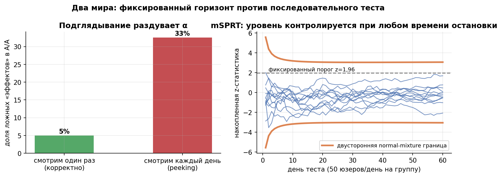
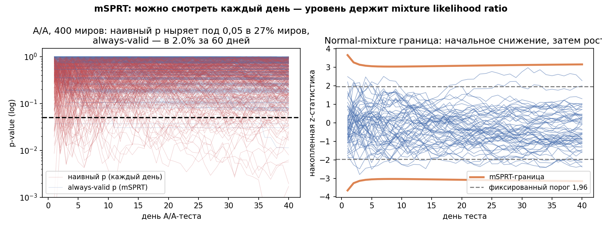
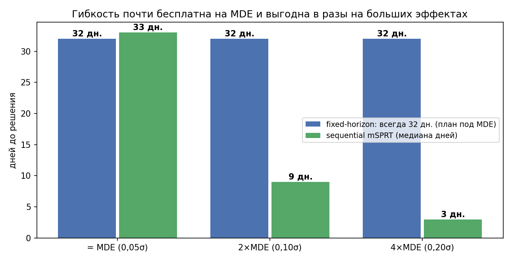

# Урок 3.7 — Подглядывание и последовательное тестирование

**Цель урока:** сравнить фиксированную и последовательную остановку по риску за весь путь и заранее выбрать допустимый протокол.

**Перед уроком:** [проверьте зависимости темы](../../../course/PREREQUISITES.md); обозначения — в [словаре](../../../course/GLOSSARY.md).

## Зачем это аналитику

«ЕдаДома» запускает редизайн карточки ресторана. Тест рассчитан на 4 недели. Проходит 6 дней — продакт открывает дашборд: p-value = 0,04. Руки чешутся объявить победу и раскатить. Знакомо? Это одна из самых частых ошибок в A/B-тестировании (Кохави называет её в топе индустриальных; каналы abba_testing и stats_for_science повторяют её симуляцией за симуляцией).

Fixed-horizon анализ предполагает заранее определённую выборку и правило решения. **Сам просмотр** не меняет α, если не влияет на остановку, метрики, фильтры или вмешательство. Ошибка возникает, когда решение адаптируют к текущему шумному результату. Мониторинг качества и безопасности возможен, но его действия и статистические выводы нужно описать отдельно.

Но у проблемы есть и вторая сторона: бизнес реально хочет останавливать тесты раньше, когда эффект очевиден, и мгновенно глушить фичу, когда она вредит (guardrails). Для этого существуют **последовательные тесты** — процедуры с обоснованными правилами промежуточного анализа (always-valid допускают произвольные взгляды при своих условиях; group sequential следует своему протоколу). Цена — консервативность: чуть позже детекция эффекта размера MDE, зато часто более ранняя — крупного. Вместе с CUPAC (урок 3.6) это и есть связка «в пару дюжин раз быстрее» из кейса Авито.

## Теория

### 1. Почему подглядывание раздувает α

Пусть эффектов нет (A/A), данные накапливаются, и мы каждый день считаем p-value по всем накопленным данным. При каждом отдельном взгляде $P(p < 0{,}05) = 5\%$. Но правило решения «остановиться, как только p < 0,05» — это $P(\min_k p_k < 0{,}05)$, а минимум по многим шумным величинам мал не бывает. Накопленная статистика — это случайное блуждание: под H0 она многократно «ныряет» к границе и возвращается. В практике (20 000 миров, 28 ежедневных проверок): $\alpha = 27{,}4\%$; за 60 дней — $33{,}1\%$. Формула нижней границы интуитивна: даже две независимые проверки дают $1-0{,}95^2 = 9{,}75\%$; накопленные p-value положительно коррелированы, поэтому рост медленнее независимого случая, но не останавливается.

Отсюда три следствия (все проверены в практике):

- **ранний прокрас — преувеличенный «эффект»**: среди миров, где тест прокрасился на 14-й день, оценка эффекта в среднем вдвое дальше от нуля, чем к 28-му дню (type M из М2 на минималках: побеждают миры, где шум рано пошёл в сторону «эффекта»);
- **прокрас не доживает до финала**: только 35% миров с прокрасом на 14-й день остаются значимыми на 28-й;
- **продление не чинит**: политика «посмотрели на 14-й день; прокрас — стоп-победа; не прокрас — продлеваем до 42-го и решаем по финалу» даёт $\alpha = 8{,}5\%$ — лучше, чем 27%, но не 5%: вторая проверка «заряжена» результатом первой (это тот же донабор выборки после взгляда, что в abba-разборе «нельзя донабирать после прокраса»: падает покрытие ДИ, «подлог со штрафом»).

*Рис. 1. Подглядывание = множественные сравнения во времени: α растёт с 5% до 30%+; sequential-граница растёт и держит уровень.*

### 2. Решение А: group sequential — заранее назначенные взгляды с поправкой

Если моменты взгляда известны заранее (например, 4 промежуточных анализа), альфа делят между ними:

- **O'Brien-Fleming**: границы очень строгие в начале и почти номинальные в конце (для 4 взглядов при $\alpha=5\%$: $|z| \approx 4{,}0 \to 2{,}9 \to 2{,}3 \to 2{,}0$) — ранняя остановка только для сильных эффектов, финальная мощность почти не страдает;
- **Pocock**: одна постоянная граница на все взгляды ($|z| \approx 2{,}36$ при 4 взглядах) — останавливаться легче рано, но финал дороже;
- **альфа-спендинг Lan-DeMets**: обобщение — «бюджет» $\alpha$ тратится по любой заранее выбранной функции времени; позволяет назначать взгляды не ровно по расписанию.

Ограничение: взгляды должны быть запланированы **до** начала теста; импровизированный «а посмотрим ещё раз» ломает гарантии. Это язык клинических trials (DSMB-мониторинг) и большинства платформ с фиксированным расписанием мониторинга.

### 3. Решение Б: mSPRT и always-valid p-value — смотреть когда угодно

Путь из серии abba_testing (5 частей): шансы и байесовский фактор $K$ (шкала Kass & Raftery: от «не стоит упоминания» до «железобетонно») → отношение правдоподобий → **SPRT Вальда**: считай $\Lambda_k$ — накопленное отношение правдоподобий — и останавливайся при выходе за пороги. Проблема классического SPRT: нужно **точное** значение альтернативы $H_A$ и известная $\sigma$ (исторические данные). Решение — **смесь по $\lambda$** (mSPRT, mixture SPRT; Johari et al., Optimizely):

$$\Lambda_k = \int \frac{p(\text{данные}_k \mid \delta = \lambda)}{p(\text{данные}_k \mid \delta = 0)} \, \pi(\lambda)\, d\lambda,$$

для нормальных данных с известной дисперсией и смеси $\lambda \sim N(0, \tau^2)$ это считается аналитически (см. практику): $\Lambda_k = \sqrt{\dfrac{v_k}{v_k + \tau^2}} \exp\!\left(\dfrac{x_k^2\, \tau^2}{2 v_k (v_k + \tau^2)}\right)$, где $x_k$ — накопленная разность средних, $v_k$ — её дисперсия.

Три ключевых факта:

1. **$\Lambda_k$ — неотрицательный мартингейл под H0** (смесь мартингейлов), поэтому по неравенству Вилля $P(\max_k \Lambda_k \geq 1/\alpha) \leq \alpha$ — **при любом правиле остановки**, хоть смотри каждую секунду. В практике: always-valid p-value за 60 ежедневных проверок прокрасился в 2,0% миров — уровень держится (неравенство консервативно).
2. **always-valid p-value**: $\tilde p_k = \min(1, \min_{j \le k} 1/\Lambda_j)$ — p-value, валидный одновременно во все моменты времени. Именно его можно вешать на дашборд вместо наивного p.
3. **Граница normal-mixture mSPRT:** при q=τ²/v её квадрат в z-шкале равен (1+1/q)[2log(1/α)+log(1+q)]. При фиксированном τ и v∝1/n она асимптотически растёт как √logn. В начале граница может снижаться: в практике 3,66→3,04→3,20. LIL-границы порядка√loglogn строятся другими confidence-sequence методами.

*Рис. 2. mSPRT в действии: наивный p ныряет под 0,05 в A/A, always-valid p — почти никогда (из практики).*

Параметр $\tau$ (масштаб смеси) выбирается из исторических данных о типичных эффектах: $\tau \approx$ ожидаемый MDE; грубый $\tau$ делает процедуру консервативнее, но не ломает валидность. Дальнейшая эволюция — always-valid/confidence sequences: аналоги t-теста и линейных моделей с непрерывным мониторингом (arXiv 2210.08589 — anytime-valid Lin для Netflix-кейсов; 2212.14411 — непараметрический delayed-start mSPRT), а индустрия («Три достижения», Trisigma) ставит mSPRT/sequential в стандарт платформ рядом с CUPED.

### 4. Решение В: байесовский взгляд (форвард в М5)

«Постериорная вероятность превосходства можно мониторить хоть каждый день — она же не p-value!» Аббревиатура знакомая, дьявол в деталях (полный разбор — модуль М5):

- мониторинг апостериорного распределения сам по себе не «тратит альфу» — у неё другой математический статус; но и частотной гарантии $\alpha$ он не даёт;
- правило остановки всё равно влияет: «остановиться, когда P(B>A) = 95%» в A/A срабатывает чаще 5% — если мерить ложные победы частотно;
- спасают те же идеи, но в байесовской упаковке: прогнозные вероятности, expected loss (стоп, когда ожидаемые потери от решения меньше порога), и цена ошибки, а не «значимость».

Практический вывод на сегодня: байесовский мониторинг легитимен, когда решение принимается в терминах потерь и оговорки проговорены; «в M5 можно останавливаться когда угодно» — правда только с этими оговорками.

### 5. Цена гибкости и когда sequential оправдан

Sequential — не волшебная таблетка (прямая цитата духа stats_for_science): за право смотреть каждый день платят консервативностью границы. Из практики (fixed спроектирован под MDE = 0,05σ = 32 дня, ежедневный mSPRT):

| истинный эффект | fixed-horizon | sequential (медиана) |
|---|---|---|
| = MDE (0,05σ) | 32 дня, детект 80% | 33 дня, детект 83% за 60 дн. |
| 2×MDE (0,10σ) | всё равно ждём 32 дня | **9 дней** |
| 4×MDE (0,20σ) | всё равно ждём 32 дня | **3 дня** |
| вред −2×MDE (guardrail) | узнаем в конце | **9 дней** |

Когда оправдан: длинные тесты и дорогие фичи (раньше решение — раньше выгода, экономика теста из abba-серии «цена времени»); раннее обнаружение вреда (guardrails: сильный негативный эффект пробивает границу за дни); непредсказуемая эффективность (трафик плавает, MDE плавает). Когда избыточен: короткие дешёвые тесты с чётким горизонтом — там проще один взгляд в назначенный день.

Финальная сборка М3: **CUPAC снижает дисперсию (дни × (1−R²)), sequential разрешает раннюю остановку (дни × ещё сколько-то), правильный юнит и линеаризация держат валидность** — это и есть «в пару дюжин раз быстрее» Авито.

*Рис. 3. Цена и выгода sequential: на MDE почти бесплатно, на больших эффектах — решение в разы быстрее, вред ловится за 9 дней (из практики).*

## Разбор на данных

Из практики [practice_3_7.py](practice/practice_3_7.py): A/A-тест «ЕдаДома», 200 юзеров/день на руку, 20 000 миров, ежедневный z-тест по накопленным данным.

**Инфляция альфы.** Один взгляд на 28-й день: 5,0% (номинал). Ежедневный мониторинг со стопом при $p<0{,}05$: 27,4% за 28 дней, 33,1% за 60. Политика «взгляд на 14-й + продление до 42-го»: 8,5%.

**Судьба раннего прокраса.** Среди миров, прокрасившихся на 14-й день: к 28-му значимы только 35%; средняя оценка «эффекта» в день прокраса в 2,0 раза дальше от нуля, чем финальная. Ранний прокрас — это выборка «удачно пошедшего шума».

**mSPRT.** Смесь $\lambda \sim N(0, (0{,}1\sigma)^2)$, always-valid p-value $\tilde p_k = \min(1, \min_j 1/\Lambda_j)$: прокрас за 60 ежедневных проверок — 2,0% миров (гарантия $\leq 5\%$ держится). Граница $|z|$: 3,66 (день 1) → 3,04 (день 7) → 3,11 (день 28) → 3,20 (день 60) против фиксированного 1,96.

**Скорость.** Fixed спроектирован под MDE 0,05σ → 32 дня. Sequential: эффект = MDE — медиана 33 дня (паритет: цена гибкости); 2×MDE — 9 дней; 4×MDE — 3 дня; вред −2×MDE — 9 дней при 100% детекции за 60 дней.

## Подводные камни

1. **Просмотр и адаптация — разные действия.** Если план и финальное решение неизменны, просмотры не раздувают α. Если по p-value изменили срок, выбрали метрику или решили остановиться, нужен анализ адаптивной процедуры. Для непрерывных решений заранее используют sequential-критерий.
2. **Продление/донабор после взгляда.** Грозит: $\alpha = 8{,}5\%$ вместо 5% в простейшем сценарии и хуже — в многошаговом; покрытие ДИ падает. Правильно: длительность фиксировать заранее (с запасом на сезонность, урок 3.1); захотел продлить — это новый взгляд, переводи в sequential-рамку или перезапускай.
3. **Останавливаться по прокрасу — «эффект» завышен.** Грозит: type M — в день раннего прокраса оценка в среднем вдвое дальше от нуля, бизнес калибруется на переоценённые эффекты. Правильно: репортить оценку эффекта по корректной процедуре (например, по всем данным к запланированному горизонту или со смещение-скорректированным оценщиком), а не по дате остановки.
4. **Group sequential с импровизированными взглядами.** Делают: «у нас O'Brien-Fleming, но посмотрим ещё на 20-й день, не по расписанию». Грозит: границы посчитаны под расписание, гарантии съезжают. Правильно: alpha-spending (Lan-DeMets) допускает отклонения, но функция траты фиксируется до запуска.
5. **mSPRT с кривыми $\tau$ или неизвестной $\sigma$.** Грозит: смесь по «не той» шкале → потеря мощности; $\sigma$, оцененная криво (новая метрика!), ломает и mSPRT, и SPRT. Правильно: $\tau$ из истории экспериментов (то самое «нужны исторические данные»), $\sigma$ — по пре-периоду, для новых метрик — непараметрические confidence sequences.
6. **«Sequential всегда быстрее».** Грозит: на эффекте размера MDE sequential не быстрее (медиана 33 против 32) и детектит скромнее при жёстком потолке дней. Правильно: продавать sequential не как «ускорение», а как «валидность мониторинга + возможность ранней реакции на крупные эффекты и вред».
7. **Sequential поверх peeking-культуры без CUPED.** Грозит: платите консервативностью границы, не купив главного ускорения. Правильно: сначала снизь дисперсию (уроки 3.4–3.6), потом уже торгуйся со временем.

## Практика

Файл: [practice_3_7.py](practice/practice_3_7.py) (percent-формат, numpy/scipy/matplotlib/pandas, seed, Agg). Что делает:

1. **A/A с ежедневным peeking**: эмпирическая $\alpha$ при 1–60 проверках (кривая инфляции: 5% → 27,4% → 33,1%); политики «стоп при p<0,05», «взгляд на 14-й + продление до 42-го» (8,5%); судьба прокраса (35% доживают до финала, преувеличение ×2,0).
2. **Упрощённый mSPRT** на нормальных данных: смесь $\lambda \sim N(0, \tau^2)$, $\Lambda_k$ аналитически, always-valid p-value; A/A-уровень 2,0% за 60 ежедневных проверок; normal-mixture граница $|z|$:3,66→3,04→3,20.
3. **Дни до решения** fixed vs sequential при эффекте = MDE / 2×MDE / 4×MDE и вреде −2×MDE (33 / 9 / 3 и 9 дней против 32).

Графики: [practice_3_7_peeking.png](images/practice_3_7_peeking.png) (инфляция α + политики), [practice_3_7_msprt.png](images/practice_3_7_msprt.png) (наивный p против always-valid; растущая граница), [practice_3_7_speed.png](images/practice_3_7_speed.png) (дни до решения).

## Домашнее задание

1. Аналитик смотрит A/A-тест каждый день в течение 21 дня и останавливается при $p<0{,}05$. Оцените сверху эмпирическую $\alpha$ и объясните одной фразой, почему это не 5%.

Ответ

Это $P(\min_{k \le 21} p_k < 0{,}05)$ — вероятность хотя бы одного «прокраса» за 21 шумную проверку. Даже если бы p были независимы, $1-0{,}95^{21} = 66\%$; накопленные p положительно коррелированы (одни и те же данные), поэтому реально меньше — порядка 20–30% (в практике при 28 днях — 27%). Суть: тест с фикс-горизонтом — обещание одного взгляда; максимум по дням — уже другая статистика.

2. Тест прокрасился на 10-й день из 28 запланированных. Продакт предлагает «остановиться, эффект очевиден»; стейкхолдер — «продлить до 35 дней, чтобы убедиться». Что не так с обоими предложениями и что делать?

Ответ

Остановка по прокрасу: $\alpha$ раздута (максимум по проверкам), а оценка эффекта в ранний прокрас систематически завышена (type M; в практике — ×2 в день прокраса). Продление: не возвращает номинал — вторая проверка обусловлена первой (в практике политика 14→42 дала 8,5%), плюс покрытие ДИ падает. Правильно: (а) если мониторинг нужен был заранее — использовать sequential-критерий (mSPRT/always-valid p) и останавливаться по его границе; (б) если дизайна не было — довести до запланированного горизонта и смотреть один раз; (в) на будущее: заложить sequential или group sequential в дизайн-док до запуска.

3. Почему граница mSPRT в z-шкале растёт со временем, и из какого «закона» эта скорость роста?

Ответ

Для данной нормальной смеси решаем logΛ=log(1/α): z²=(1+v/τ²)[2log(1/α)+log(1+τ²/v)]. При v∝1/n главный член —logn, поэтому z~√logn. Закон повторного логарифма описывает предельные колебания процесса и мотивирует более тесные confidence sequences; он не является формулой этой фиксированной normal-mixture границы.

4. Чем always-valid p-value отличается от обычного p-value и что позволяет неравенство Вилля?

Ответ

Обычный p-value валиден только в один наперёд заданный момент ($P(p \le \alpha) \le \alpha$ при H0); адаптивный выбор момента решения по последовательности обычных p нарушает заявленный уровень. Always-valid $\tilde p_k = \min(1, \min_{j\le k} 1/\Lambda_j)$ удовлетворяет $P(\exists k: \tilde p_k \le \alpha) \le \alpha$ — одновременно для всех моментов. Неравенство Вилля: для неотрицательного мартингейла (смесь SPRT $\Lambda$ с $E[\Lambda_0]=1$ под H0) $P(\sup_k \Lambda_k \ge 1/\alpha) \le \alpha$ — при любом правиле остановки. Отсюда правило: на дашборд вешаем $\tilde p$, а не наивный p.

5. Команда хочет внедрить sequential. Сформулируйте два аргумента «за» (один про скорость, один про риск) и одно честное предупреждение.

Ответ

За: (1) крупные эффекты и вред детектятся за дни, а не к концу горизонта (в практике: 4×MDE — 3 дня против 32; guardrail −2×MDE — 9 дней) — это и деньги, и безопасность пользователей; (2) валидность при любой частоте мониторинга закрывает культурную дыру «все и так подглядывают». Предупреждение: на эффекте размера MDE sequential не быстрее фикса (медиана 33 против 32 дней) — выигрыш в скорости даёт связка с variance reduction (CUPAC), а сам по себе sequential покупает корректность и раннюю реакцию, а не «тесты в 5 раз быстрее».

## Шпаргалка

1. Фикс-горизонт: α гарантируется для заранее выбранного финального правила, даже если дашборд смотрели без изменения плана. Peeking = множественные сравнения по времени: 28 ежедневных проверок → α ≈ 27%, 60 → 33%.
2. Ранний прокрас: оценка эффекта завышена (~×2) и в 2/3 случаев не доживает до финала. Продление/донабор после взгляда не чинит α (14→42 даёт 8,5%).
3. Group sequential: взгляды и границы — заранее; O'Brien-Fleming — строгий старт, мягкий финал (≈4,0→2,0); Pocock — константа (≈2,36); альфа-спендинг Lan-DeMets — гибкое расписание трат.
4. SPRT Вальда: Λ — накопленное отношение правдоподобий, стоп по порогам; нужны точная альтернатива и σ.
5. mSPRT: смесь по λ (λ ~ N(0, τ²), τ ≈ MDE из истории) снимает «точную альтернативу»; Λ — мартингейл под H0 → неравенство Вилля → валидность при любой остановке.
6. Always-valid p-value: $\tilde p_k = \min(1, \min_{j\le k} 1/\Lambda_j)$ — вешать на дашборд вместо наивного p.
7. У данной normal-mixture граница сначала снижается, затем растёт как√logn; LIL-оптимальные confidence sequences — отдельное построение.
8. Байесовский мониторинг (М5): «останавливаться когда угодно» — только с оговорками (правило остановки всё равно влияет; гарантии в терминах потерь, не α).
9. Скорость: на MDE sequential ≈ fixed; на 2–4×MDE и на вреде — в разы быстрее. Sequential продаёт валидность и раннюю реакцию, CUPAC — ускорение; вместе — «в пару дюжин раз» (Авито).
10. Гигиена: длительность и критерий — в дизайн-док до запуска; σ из пре-периода; для новых метрик — confidence sequences.

## Источники

- abba_testing (С. Матросов), серия mSPRT ×5 (апрель 2025): шансы → Bayes factor (Kass & Raftery) → likelihood ratio → SPRT Вальда → смеси; «Остановка теста по серии значимых p-value» (самодельный критерий, семейное α); «ДИ ч. 2 — донабор аудитории после прокраса» — `materials/telegram/abba_testing-digest.md`.
- stats_for_science (Е. Убогоева), серия sequential ×3: «'Sequential' или почему нельзя подглядывать» (10 взглядов → ~20%; Pocock/O'Brien-Fleming, alpha-spending Lan-DeMets, always-valid, confidence sequences); «Последовательное тестирование, ч. 1»; «Sequential — не волшебная таблетка» — `materials/telegram/stats_for_science-digest.md`.
- Trisigma (Avito): переводы Нишат Хана «Три достижения, изменившие A/B» (peeking → sequential → CUPED) и про непрерывный мониторинг/FWER; дискуссия «sequential убивает воспроизводимость»; кейс «в пару дюжин раз быстрее» — `materials/telegram/trisigma_avito-digest.md`.
- Deng. «Causal Inference and Its Applications…», гл. 8 §continuous monitoring (открытые вызовы анализа A/B) — `materials/web/alexdeng-causal-book.md`.
- Larsen, Stallrich, Sengupta, Deng, Kohavi, Stevens. «Statistical Challenges in Online Controlled Experiments» (arXiv 2212.11366), раздел 5 Optional stopping: mSPRT/always-valid (Optimizely), GSPRT, group sequential — `materials/web/research-sensitivity.md` «Обзоры».
- arXiv-свип `materials/web/research-arxiv.md`, блок anytime-valid/sequential: 2606.18366 (поправка выборки для always-valid), YEAST 2406.16523, 2210.08589 (anytime-valid линейные модели/регрессионная поправка, кейс Netflix), 2212.14411 (непараметрический delayed-start mSPRT, Netflix).
- Kohavi, Tang, Xu. «Trustworthy Online Controlled Experiments», гл. 17 — peeking и опциональная остановка в платформенных экспериментах (сквозной учебник курса).
