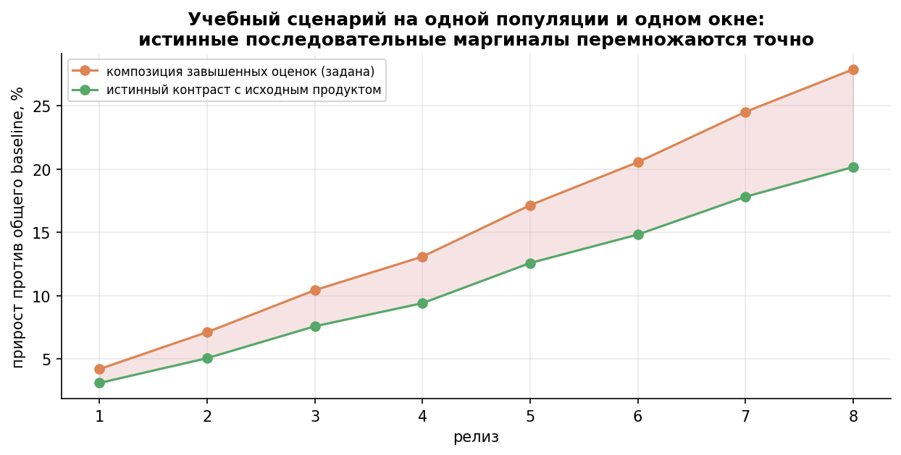
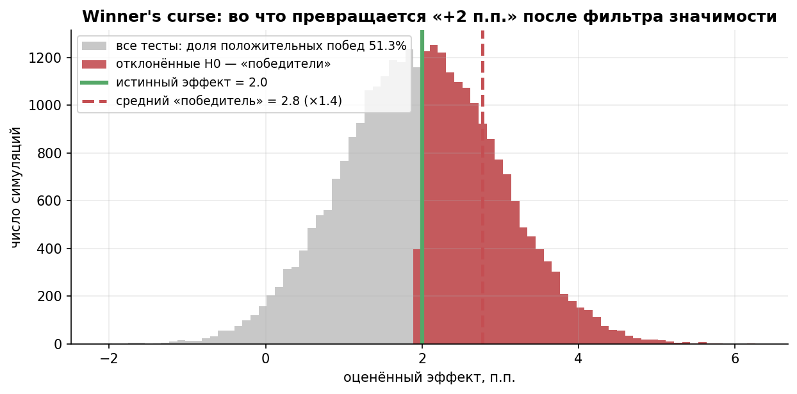
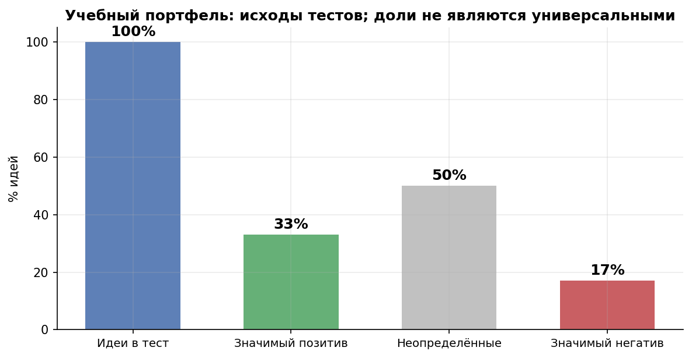

# Урок 4.5 — Проблемы АБ в бизнесе: кумулятивные эффекты, холдауты, экономика

**Цель урока:** различать маргинальные и совместные эффекты, отбор победителей и календарную экспозицию; посчитать экономику программы.

**Перед уроком:** [проверьте зависимости темы](../../../course/PREREQUISITES.md); обозначения — в [словаре](../../../course/GLOSSARY.md).

## Зачем это аналитику

Конец года в «ЕдаДома». Продакт открывает вики экспериментов и складывает: F1 +2,9%, F2 +4,2%, F4 +5,1%, F8 +3,7% — все зелёные, все в проду. Итого «мы добавили +15,9% выручки». А финансовый директор показывает график фактической недельной выручки: прирост есть, но заметно меньше. Разговор начинается с «АБ-тесты не работают» и заканчивается «кто съел мой прирост?» — ровно так называется лонгрид Искандера Мирмахмадова (Trisigma) про кумулятивные эффекты фич.

Проблема в том, что каждый тест отвечал на свой вопрос: «фича F против мира без F **в момент запуска**». А в конце года мы спрашиваем другое: «прод со всеми фичами против прода без всех фич». Между этими вопросами — три ловушки:

1. **Контроль дрейфует.** Фича F8 тестировалась не против «голого» продукта, а против прода, где уже живут F1, F2, F4. «Эффект фичи» — не константа, он зависит от окружения, а окружение меняется каждый месяц.
2. **Фичи взаимодействуют.** Умная сортировка каталога и бейдж «Хит» каждый по отдельности дают +5%, а вместе +3,6% — сортировка уже подняла хиты наверх, бейдж дублирует сигнал (Eppo: «The Whole Is Less Than the Sum of Its Parts»). Сумма зелёных может быть не просто меньше — «зелёная сумма» может оказаться красной.
3. **Отбор переоценивает победителей.** Катим мы только значимо-положительное — то есть те тесты, где шум случайно помог (winner's curse, он же Type M из урока 2.1). Airbnb (KDD'18) показал: наивная сумма эффектов запущенных фич +40,65%, а несмещённая оценка суммарного эффекта — +30,62%.

Это урок не про один тест, а про **программу экспериментирования**: как мерить суммарный эффект (холдауты), как калибровать платформу (мета-анализ, ретесты) и сколько всё это стоит (экономика). Здесь заканчивается «статистика одного теста» и начинается эксперименты как бизнес-функция.

## Теория

### 1. Кумулятивные эффекты: каждый тест против актуального контроля, а контроль дрейфует

Год в «ЕдаДома» — это не 10 параллельных тестов, а последовательность: F1 катим в январе, F2 в феврале тестится против «январь+F1», F4 в апреле — против «январь–март со всеми живыми фичами». Что из этого следует:

- **launch-тест меряет маргинальный эффект** — эффект фичи *поверх* текущего состояния прода, а не «эффект фичи вообще». Если новая фича каннибализирует уже живую, маргинальный эффект честно это покажет — но тогда «эффект старой фичи» из её теста полугодичной давности уже не актуален.
- **Последовательные маргинальные эффекты согласуются с общим эффектом** при одной популяции, временном контексте и шкале: абсолютные разности телескопируются, относительные lift перемножаются. Взаимодействия уже входят в маргинал новой фичи поверх текущего продукта. Отдельно измеренные эффекты A против старого продукта и B против старого продукта не определяют совместный эффект A+B.
- **кривая эффектов выходит в плато.** Перевод «Why is my A/B test flat?» (Trisigma) и кейс редизайна тулбара Gmail: если суммировать выигранные тесты, метрика должна была бы расти линейно, а она растёт с затуханием — «кристаллизация» и липкость метрик, кумулятивные эффекты, carryover фич между тестами.
- Отдельная боль — **feature carryover и пересечения**: пользователь, попавший в тест F2, унёс impressions и привычки дальше; аудитория следующего теста уже «испорчена» предыдущими (лонгрид «Кто съел мой прирост?»).

*Рис. 1. Синтетическая композиция заданных завышенных маргинальных оценок и истинного общего контраста. Это учебная иллюстрация, не данные холдаута Airbnb.*

Важно проговорить, чего здесь **нет**: это не нарушение SUTVA внутри одного теста (интерференция между вариантами — урок 4.3), и не параллельные пересекающиеся тесты (урок 4.2). Это проблема агрегации во времени: каждый тест внутренне валиден, невалидна — сумма.

### 2. Взаимодействия фич: сумма зелёных ≠ зелёная сумма

Если $\theta_i$ — эффекты отдельных фич против одного исходного продукта, произведение $\prod_i(1+\theta_i)-1$ описывает совместный эффект лишь в модели без взаимодействий. В практике взаимодействия задаются отдельным множителем. Если же измерены последовательные маргинальные эффекты против актуального продукта, взаимодействия уже включены в них: к их произведению второй раз поправку не применяют. Взаимодействия в продукте — норма, а не экзотика:

- **каннибализация**: сортировка и бейдж продают одни и те же рестораны; скидка из пуша и скидка на главной съедают друг друга;
- **ограниченное внимание**: пользователь готов воспринять 1–2 изменения на экране; пятая «улучшалка» за квартал уходит в шум;
- **прокси-метрики конфликтуют**: каждая фича выигрывала свою OEC (урок 4.1), а разные OEC не обязаны складываться в выручку.

Eppo («The Whole Is Less Than the Sum of Its Parts») прямо называет типовой паттерн: запускаешь 10 фич, сумма обещанных аплифтов двузначная, а холдаут показывает треть от неё. Практическое следствие: **батчить или тестить по отдельности?** Кохави отвечает так: тестить по отдельности (интерпретируемость, локализация эффекта, меньше рисков), но периодически **батчить запущенные фичи** и сверять их сумму с длинным холдаутом — это «мета-анализ наоборот». Батчить до теста имеет смысл, когда фич мелкие и тестов на всех не хватает (экономия трафика), но тогда платите невозможностью понять, кто именно работает.

### 3. Winner's curse и Type M: отобранные победители систематически переоценены

Механизм — отбор по значимости. Пусть в учебной модели $\hat\delta\sim N(\delta,SE^2)$, $SE$ известна, а «зелёный» означает $\hat\delta/SE>z_{1-\alpha/2}$. Тогда

$$E[\hat\delta\mid\text{зелёный}]=\delta+SE\frac{\varphi(z_{1-\alpha/2}-\delta/SE)}{1-\Phi(z_{1-\alpha/2}-\delta/SE)}.$$

Добавка положительна, но её размер зависит от отношения истинного эффекта к SE и от правила отбора. На рисунке $\delta=2$ п.п., $SE=1$ п.п., $\alpha=0{,}05$: вероятность зелёного исхода около 51,6%, а средняя оценка среди победителей — около 2,77 п.п. Для эффекта, дающего примерно 80% мощности в той же нормальной модели, среднее завышение среди положительных победителей составляет около 12,5%. Это расчёты для заданных условий, а не универсальные коэффициенты для всех A/B-тестов.

**Type M** у Gelman & Carlin — ожидаемое отношение $|\hat\delta|/|\delta|$ при условии статистической значимости; оно определено при $\delta\ne0$. Для слабого сигнала это отношение может быть большим. MDE — плановый параметр, он не равен неизвестному истинному эффекту и не может автоматически служить знаменателем Type M.

Универсальная поправка «разделить каждую наблюдённую оценку на один коэффициент» отсюда не следует: истинный эффект неизвестен, а в портфеле эффекты различаются. Для коррекции нужны явно заданная модель распределения эффектов и отбора, исторические данные (включая незначимые тесты) и проверка на независимой части истории. Возможные подходы — моделирование отбора, иерархический shrinkage и независимый ретест; каждый имеет собственные предпосылки. Скорректированная оценка также требует оценки неопределённости.

На уровне года это умножается: мы суммируем завышенные оценки только тех фич, которые прошли отбор. Airbnb (Lee & Shen, KDD'18, «Winner's Curse: Bias Estimation for Total Effects of Features in OCE») построил несмещённую оценку суммарного эффекта запущенных фич: наивная сумма +40,65%, скорректированная — +30,62% (пример из их поста «Selection Bias in Online Experimentation»). Инструменты той же семьи: пост-селекционный вывод (Deng, 2019), байесовский shrinkage частично чинит Type M (обзор arXiv 2608.12949 — мостик к М5).

*Рис. 2. Гистограмма оценок при истинном эффекте 2 п.п. и SE 1 п.п.; отбираются оценки выше 1,96 п.п. Вероятность такого исхода около 51,6%, среднее отобранных оценок около 2,77 п.п.*

Отдельная свежая ветка — Netflix («Evaluating Decision Rules Across Many Weak Experiments»): сами правила «катить/не катить» можно оценивать на корпусе исторических тестов. Наивный путь (одни и те же данные и решают, и меряют выигрыш) — winner's curse на уровне корпуса; Netflix применил кросс-валидацию (половина данных решает, половина меряет north star) и получил +33% к накопленной метрике на 123 исторических тестах. Комментарий Искандера: подбор правила под свои данные сам создаёт winner's curse — страховка только одна, исторический холдаут.

### 4. Холдаут-группы: сверка суммы релизов с глобальным приростом

Если вопрос звучит «сколько нам реально дали все эксперименты за год», ответ даёт **global / long-term holdout**: 1–10% юзеров, изолированных от **всех** запущенных фич на квартал и дольше. Тогда прирост метрики «прод против холдаута» — несмещённая оценка кумулятивного эффекта программы (Eppo: «unbiased, but noisy»).

Кейсы, на которые стоит ссылаться:

- **Airbnb**: приведённые выше +40,65% и +30,62% иллюстрируют статистическую коррекцию отбора; это сравнение нельзя выдавать за результат long-term holdout.
- **Disney Streaming (Universal Holdout Groups)**: универсальный холдаут как прод-механика — кумулятивный эффект фич, который короткие тесты не видят, измеряется постоянно; «штраф за velocity» измерим и это ок;
- **X5**: Глобальная контрольная группа (GCG) в CVM — построение со стратификацией по активности (иначе холдаут «дохнет» от отличий в составе), доклад AHA-26 «эффект от тысячи кампаний»; митап с Trisigma про кумулятивный эффект фич;
- **Netflix**: исторический холдаут как перевалидация decision rules (см. выше);
- **Kohavi / GrowthBook**: «батчить запущенные фичи и сверять сумму предсказанных эффектов с лонг-раннинг холдаутом» — прямая рекомендация.

Про **цену холдаута**. Держать 5% юзеров год без фич = отдать ~5% ценности всех релизов (если фичи в сумме дают +10%, холдаут стоит 0,5 п.п. выручки год) + риск ухудшить их опыт. Test & Roll (Feit & Berman) математизирует компромисс: при асимметричных приорах оптимальные размеры групп меньше классических расчётных — «1% на год» рационален, а не «сколько не жалко». Практические гайдлайны:

- размер и длительность холдаута проектировать **от ширины CI**, которую готовы принять (в практике 10 тыс. юзеров холдаута дают месячную полуширину несколько п.п.; точность определяется объёмами обеих рук и вариативностью метрики);
- стратифицировать по активности (X5) и не трогать холдаут другими экспериментами — иначе он деградирует в «ещё один слой»;
- сверять не каждый месяц, а по накоплению (квартал–полгода) — и смотреть не только на точечную разницу, а на **разрыв «композиция оценок минус сопоставимый холдаут»**: рост разрыва требует проверки отбора, временных окон, популяций и шума; сам по себе он не доказывает взаимодействия.

### 5. Мета-анализ и ретесты: калибровка платформы на корпусе тестов

Корпус тестов — актив (Kohavi, гл. 8 «Institutional Memory and Meta-Analysis»): по нему оценивают распределение истинных эффектов (Bing/Kohavi KDD'13: лишь ~⅓ идей улучшают целевые метрики; Georgiev «What Can Be Learned From 1001 A/B Tests?» — эмпирика распределений эффектов и реальной мощности «в дикой природе»), калибруют поправки Type M и приоры для байесовских оценок (мостик в М5), и проверяют сами правила решений (Netflix).

Три независимых подтверждения одной гипотезы при π=.2, power=.8 и α=.05 дают в этой двухсостоянийной модели posterior .2×.8³/(.2×.8³+.8×.05³)≈99,90%. Три разных значимых гипотезы — другой вопрос: при posterior .8 для каждой вероятность истинности всех трёх равна .8³=51,2% при независимости. Коррелированные повторения нельзя считать независимыми.

### 6. Экономика экспериментирования: скорость против качества

Сколько тестировать — не методологический, а денежный вопрос. Рамка из серии abba «Экономика A/B-теста» (3 части):

- **Цена ошибок (ч. 1)**: L1 (потери от ложного роллаута) × α + L2 (потери от пропущенной хорошей фичи) × β, обе — с учётом **срока жизни фичи**. Оптимальные α/β выводятся из минимизации суммарных потерь, а не берутся «5%/20% по умолчанию».
- **Цена времени (ч. 2)**: каждая неделя теста — неделя без роллаута. Тестировать, пока предельная ценность информации выше цены дня задержки (та же логика, что у SPRT из урока 3.7).
- **Ценность информации (ч. 3, EVI/VOI)**: тест = покупка информации о знаке и размере эффекта; приоритизация бэклога по EVI, а не «по мнению руководителя».

В практике этого урока калькулятор даёт неожиданный для многих вывод: **длительность покупает мощность (защиту от пропуска), но не защиту от ложного роллаута** — P(ложный зелёный | эффекта нет) = α/2 при любом n. От ложных роллаутов защищает α (и guardrails-мониторинг после раскатки), от пропусков — мощность, и оптимум между задержкой и пропуском конечен: в наших числах 5 недель для ценной фичи и 3 недели для дешёвой короткоживущей. Ужесточение α с 0,05 до 0,005 снижает ложный роллаут в 10 раз, но ради той же мощности тест удлиняется в ~1,7 раза.

Масштаб экономики культуры (Trisigma, интервью «Коммерсанту» и исследование рынка): **80% гипотез не дают значимого эффекта, но ~10% негативных — именно они спасают бизнес от факапов**; ценность программы экспериментов — не только прирост от зелёных, но и предотвращённые вреды. Своя платформа — от ~150 млн ₽ и 3 года, готовая — от ~2,5 млн ₽/год (buy vs build зависит от масштаба и зрелости); аргумент за build — глубина интеграции и данные, против — скорость и методологическая экспертиза «из коробки». KPI «доля зелёных тестов» — яд: он вознаграждает p-hacking и переоценку (управленческий кейс abba про KPI на значимость и невоспроизводимость, повторяющиеся игры по Шеллингу); правильные KPI программы — суммарный прирост по холдауту, скорость цикла идея→решение, доля ретестов, подтвердивших эффект.

*Рис. 3. Учебная иллюстрация портфеля 33% / 50% / 17%. Эти доли заданы для примера и не являются универсальными частотами компаний.*

## Разбор на данных

Из практики [practice_4_5.py](practice/practice_4_5.py) (все числа воспроизводятся seed'ом).

**Winner's curse (2000 миров по 10 фич).** Портфель года: истинные эффекты от −2% до +4,5%; тест 60 тыс. юзеров на руку при CV метрики 2,3 даёт SE аплифта 1,33 п.п. — вероятности значимо-положительного исхода от 2,5% (нулевые фичи) до 92%. В среднем за год зелёных 4,0 из 10. Средний **заявленный** эффект зелёных +4,11% при среднем **истинном** +3,47% у этих же фич — переоценка ×1,18; итог года по отчётам +16,5% против истинных +13,9% — «+2,6 п.п. воздуха». Коэффициент ×1,18 относится только к этому заданному портфелю и правилу отбора.

**Взаимодействие двух фич.** Сортировка и бейдж по +5%, взаимодействие −6%: наивная сумма +10,25%, фактический эффект пары +3,63%. Тесты спроектированы под MDE +5% (80% мощности): в демонстрационном мире сортировка +6,7% (p=0,0002, зелёный), бейдж +4,9% (p=0,0068, зелёный), а совместный тест A+B против контроля +2,5% (p=0,16, **серый**). На 10 тыс. миров: A зелёный в 79%, B — в 78%, A+B — только в 52%; сценарий «оба зелёные, вместе серый» — 24% миров. Обе фичи «работают», а пара не проходит собственный тест.

**Холдаут-сверка.** Практика 4.5 использует единую функцию outcome для launch-контрастов и набора фич, постоянную пользовательскую активность и месячный шум. Произведение истинных последовательных lift восстанавливает итоговый множитель. Разницу между оценённой композицией и холдаутом объясняем отбором победителей, шумом и разной экспозицией во времени. Годовая средняя включает месяцы до раскаток; её нельзя напрямую сравнивать с декабрьским уровнем. Обновлённые таблицы и CI печатает практика. Для относительного lift дельта-метод учитывает обе оценённые средние: $SE^2\approx[s_T^2/n_T+(\bar Y_T/\bar Y_H)^2s_H^2/n_H]/\bar Y_H^2$. Годовой CI рассчитывается по годовым суммам каждого пользователя, сохраняя зависимость его месяцев.

**Экономика теста.** Горизонт — 26 недель от текущей даты. Для полезной фичи потеря = prior×ценность×[w+(1−power(w))×(26−w)]. Для нулевой фичи эксплуатационные затраты отдельно от эффекта OEC: (1−prior)×α/2×затраты×срок до отката. При prior=.4 этот член 46,8 тыс. ₽, не 78 тыс. Минимум данного примера остаётся 5 недель; это результат заданных параметров, не универсальная длительность.

## Подводные камни

1. **Суммировать зелёные аплифты в презентации для CFO.** Делают: «10 тестов, сумма +25%». Грозит: обязательства, которые продукт не выполнит (в практике композиция заявленных оценок расходится с контрастом холдаута; актуальные числа выводит скрипт). Правильно: сначала выбрать сопоставимые контрасты и шкалу композиции; затем показать неопределённость и модель коррекции отбора рядом со свежим замером холдаута.
2. **Холдаут «для галочки»: 0,5% юзеров на две недели.** Грозит: CI шире любого мыслимого эффекта — холдаут молчит даже когда прирост есть (в практике первые месяцы ДИ с полушириной в несколько п.п.). Правильно: проектировать от целевой ширины CI (юзеры × длительность), 1–10% на квартал+, стратификация по активности (X5).
3. **Контаминация холдаута.** Делают: в холдаут «посмотреть» новым экспериментом, промо или фичей. Грозит: холдаут перестаёт быть «миром без всего» — оценка кумулятивного эффекта занижается/смещается. Правильно: холдаут исключается из всех сплит-слоёв (урок 4.2), правила ротации и пополнения фиксируются заранее.
4. **Лечить winner's curse ужесточением α «задним числом» или продлением теста.** Грозит: α не зависит от n — длительность покупает мощность, а не защиту от ложного роллаута; а «пожёстрче порог» после взгляда на данные — это то же подглядывание (урок 3.7). Правильно: мощность закладывать в дизайн, поправку Type M калибровать на корпусе тестов, сумму сверять холдаутом.
5. **Ретест «перекинуть кубик» и вывод «платформа сломана».** Грозит: серый ретест зелёного — это ожидаемо в 4 сценариях (ошибка I рода, смена аудитории, novelty, методология), а «сломанность» не доказана. Правильно: ретесты планировать заранее, методологию фиксировать, решение — по устойчивости, не по одному p-value.
6. **KPI «доля зелёных тестов» / «80% побед».** Грозит: команда оптимизирует прокрасы (p-hacking, сегменты, метрики), эффекты переоценены, невоспроизводимость растёт (кейс abba про KPI на значимость). Правильно: KPI программы — суммарный прирост по холдауту, скорость цикла, воспроизводимость ретестов.
7. **«Тест любой ценой» и «катим без теста» одновременно.** Грозит: дорогие длинные тесты на дешёвых обратимых фичах и роллаут без проверки дорогих необратимых. Правильно: явная экономика — L1/L2, срок жизни фичи, EVI; дешёвое и обратимое — короткие тесты или быстрые попытки, дорогое и необратимое — полная строгость.

## Практика

Файл: [practice_4_5.py](practice/practice_4_5.py) (percent-формат, numpy/scipy/matplotlib/pandas, seed, Agg). Что делает:

1. **Год из 10 фич, 2000 миров**: портфель эффектов + шум теста → отбор зелёных → winner's curse (заявленное против истинного у отобранных: ×1,18 на среднем, +2,6 п.п. на сумме года).
2. **Факториал 2×2**: A и B по +5%, взаимодействие −6%; демонстрационный мир (оба зелёные, вместе серый) + вероятности на 10 тыс. миров (79%/78%/52%, искомый паттерн 24%).
3. **Холдаут-сверка**: 200 тыс. юзеров, 95/5, помесячная раскатка только зелёных, каннибализация пар 0,5%, общая сезонность ×0,96–×1,12; помесячная таблица «заявлено накопительно против холдаута ± CI» и итоговая таблица: отдельные истинные эффекты, заявленные оценки и годовой контраст холдаута с CI. Числа печатаются из текущей симуляции; различия календарных окон разбираются отдельно.
4. **Калькулятор экономики**: ожидаемые потери (задержка + пропуск + ложный роллаут) по неделям 1–8, оптимум 5 недель против 3 недель для дешёвой фичи, обмен α↔длительность (×1,7).

Графики: [practice_4_5_winners_curse.png](images/practice_4_5_winners_curse.png) (зелёные над диагональю), [practice_4_5_interaction.png](images/practice_4_5_interaction.png) (столбики A/B/наивная сумма/факт с CI), [practice_4_5_holdout.png](images/practice_4_5_holdout.png) (помесячная сверка с CI-лентой), [practice_4_5_economics.png](images/practice_4_5_economics.png) (кривые стоимостей и оптимум).

## Домашнее задание

1. Год дал 4 зелёных теста с заявленными эффектами +2,9%, +4,2%, +5,1%, +3,7%. Холдаут в декабре показывает +8,5% (95% ДИ +3,9..+13,2). Что ответить продакту, который «просто сложил» +15,9%, и из чего состоит разрыв?

Ответ

Сначала уточняем, что измерял каждый тест. Если это последовательные маргинальные lift в одном контексте, их композиция равна $(1{,}029)(1{,}042)(1{,}051)(1{,}037)-1\approx16{,}9\%$, а взаимодействия уже входят в маргиналы: вычитать их повторно нельзя. Если это эффекты фич против общего исходного продукта, для совместного эффекта нужна отдельная оценка взаимодействий. Затем сравниваем одинаковые популяции и окна: декабрьский уровень не равен среднему эффекту за год. Отбор положительных значимых оценок и шум могут объяснять часть разрыва, но из двух чисел нельзя количественно разложить его причины. Нужны совместная неопределённость композиции, сопоставимый контраст холдаута и проверка его целостности; один месячный интервал этого не заменяет.

2. Две фичи по +5% каждая с взаимодействием −6%. Команда смотрит только на отдельные тесты. Сколько они «запишут» в план и сколько получится фактически? Что изменить в процессе?

Ответ

Запишут +10% (или +10,25% при мультипликативном сложении). Фактически $\left[(1{,}05)(1{,}05)(0{,}94) - 1\right] \approx +3{,}6\%$ — и совместный тест при мощности, спроектированной под +5%, будет серым примерно в половине миров (в практике — зелёный в 52%). Процесс: либо факториальный тест 2×2 с явным членом взаимодействия, либо рассматривать сумму как эвристический прогноз (не гарантированную верхнюю границу) и сверять пару холдаутом; при дефиците слотов — батчить фичи и мерить батч, жертвуя интерпретируемостью.

3. Спроектируйте глобальный холдаут «ЕдаДома»: сколько юзеров, на какой срок, как часто сверять и что делать с итогом? Обоснуйте числа.

Ответ

Из практики: холдаут 10 тыс. юзеров даёт помесячный 95% ДИ с полушириной в несколько п.п. — годится только для крупных программных эффектов. Логика проектирования: (1) зафиксировать минимальный суммарный эффект, который хотим видеть (скажем, +5%); (2) подобрать n × длительность так, чтобы половина ширины ДИ была заметно меньше эффекта (юзеров больше или копить месяцы — годовая агрегация в практике учитывает постоянные различия активности пользователей; её актуальный CI печатает скрипт); (3) стратифицировать по активности (X5/GCG), исключить холдаут из всех сплит-слоёв; (4) сверять раз в квартал, трекать не точку, а разрыв «сумма релизов − холдаут»: он растёт → проверяем отбор, шум, популяции и окна, не приписывая причину автоматически; (5) цена: ~доля холдаута × суммарный эффект (5% юзеров без фич, дающих +10%, стоит ~0,5 п.п. выручки) — Test & Roll оправдывает малые долгие холдауты при асимметричных приорах.

4. Покажите на цифрах практики, почему «продлить тест, чтобы уж точно не ошибиться» не снижает вероятность ложного роллаута. Что реально её снижает?

Ответ

$P(\text{значимо зелёный} \mid \theta = 0) = \alpha/2 = 2{,}5\%$ при любом объёме выборки — с ростом n растёт только мощность (в практике: 34% → 93% за 1–5 недель), а распределение p-value под H0 остаётся равномерным (урок 2.1). Поэтому ожидаемая стоимость ложного роллаута в калькуляторе — константа 46,8 тыс. ₽ при нулевом эффекте OEC и отдельных эксплуатационных затратах на всех неделях. Снижают её: меньшее α (0,05→0,005 даёт 2,5%→0,25%, ценой ×1,7 длительности при той же мощности), guardrails-мониторинг после роллаута и быстрый откат (уменьшает L1·срок), а также pre-registration гипотез (меньше «подгонок» = меньше эффективная множественность).

5. CTO предлагает писать свою A/B-платформу. Какие три вопроса вы зададите, прежде чем соглашаться (подсказка: экономика и зрелость)?

Ответ

(1) Объём и стоимость потока гипотез: сколько тестов в год и какая цена неверного решения — если тестов десятки в квартал и решения дорогие, платформа окупается; сравнивайте полный TCO собственной и готовой платформы на одном горизонте, по текущим требованиям и предложению поставщика. (2) Зрелость культуры: есть ли методолог, дизайн-доки, дисциплина метрик — платформа без культуры автоматизирует хаос; доли успешных и вредных гипотез зависят от продукта и чувствительности, поэтому ценность платформы оценивают по качеству решений и затратам. (3) Кто будет поддерживать SLA сплит-системы, SRM-мониторинг, CUPED/sequential — build означает найм команды экспериментов; иначе buy/поддержка готовой и фокус на методологии (холдауты, мета-анализ).

## Шпаргалка

1. Каждый launch-тест меряет **маргинальный** эффект против актуального (дрейфующего) контроля — «эффект фичи вообще» не существует.
2. Сумма зелёных ≠ зелёная сумма: эффекты мультипликативны, фичи каннибализируются (+5% +5% −6% → +3,6%, а не +10%; Eppo: целое < суммы частей).
3. Winner's curse: положительный значимый отбор повышает среднюю оценку; величина смещения зависит от распределения эффектов, SE и правила отбора. Type M использует истинный эффект, не MDE. Коррекция требует модели и независимой проверки, а не универсального делителя.
4. Global/long-term holdout (1–10% на квартал+, стратификация по активности) — несмещённая, но шумная оценка кумулятивного эффекта программы; сверять «сумма релизов vs холдаут» (Disney Universal Holdout, X5 GCG; Airbnb — отдельный пример коррекции отбора).
5. Холдаут проектировать от ширины CI; цена = доля холдаута × суммарный эффект; Test & Roll: малые долгие холдауты рациональны.
6. Сезонность/дрейф не смещают холдаут-сравнение (рандомизация), но съедают доверие к «сложенным» отчётам.
7. Мета-анализ корпуса: ~⅓ идей выигрывают (Kohavi KDD'13), 1001 тест Georgiev; ретесты планировать заранее — серый ретест бывает по 4 причинам, «платформа сломана» — не первая из них.
8. Экономика: потери = задержка (растёт линейно) + пропуск (падает с мощностью) + α/2 × L1 (не зависит от длительности!); оптимум конечен (в практике 5 нед против 3 для дешёвой фичи); α↔длительность обмениваются ~×1,7 за 0,05→0,005.
9. KPI «доля зелёных» — яд; KPI программы: прирост по холдауту, скорость цикла, воспроизводимость. Buy vs build: 150 млн ₽/3 года против 2,5 млн ₽/год (Trisigma) — вопрос масштаба и зрелости.
10. Батчить или по отдельности: тестить по отдельности (интерпретируемость), батчи — для сверки холдаутом (Kohavi); батчить до теста — только при дефиците слотов.

## Источники

- Trisigma (t.me/trisigma_avito), дайджест `materials/telegram/trisigma_avito-digest.md`: лонгрид «Кто съел мой прирост?» (декабрь 2024; кумулятивные эффекты, feature carryover); перевод «Why is my A/B test flat?» (Gmail toolbar, плато); разбор Netflix «Evaluating Decision Rules Across Many Weak Experiments» (winner's curse на корпусе, кросс-валидация +33%, исторический холдаут); митап с X5 «кумулятивный эффект от фичей»; культура/экономика: buy vs build (150 млн ₽/3 года vs 2,5 млн ₽/год; 80% гипотез без эффекта, 10% негативных), исследование зрелости культуры.
- abba_testing (С. Матросов), дайджест `materials/telegram/abba_testing-digest.md`: серия «Экономика A/B-теста» ч.1–3 (L1/L2 и срок жизни, цена времени, EVI/VOI); Type M error (модельные примеры смещения отбора и калибровка на истории; предпосылки обсуждены выше); «Ретесты: у меня всё получ... не получилось» (4 причины, правила); «Серия тестов и переоценка вероятностей» (3 зелёных подряд <90%); Глобальная контрольная группа X5 (построение, стратификация по активности, доклад AHA-26); управленческий кейс про KPI на зелёные тесты.
- `materials/web/research-gaps.md`, задача 3 (холдауты/winner's curse): Lee & Shen, «Winner's Curse...» (Airbnb, KDD'18) + Airbnb Eng «Selection Bias in Online Experimentation» (+40,65% vs +30,62%, пуассоновская модель потока фич); Deng «On Post-selection Inference» (2019); Disney Streaming «Universal Holdout Groups»; Eppo «Holdouts» и «The Whole Is Less Than the Sum of Its Parts»; GrowthBook «Why Summing Wins Overstates» + «Holdouts» (рекомендация Kohavi батчить и сверять); Feit & Berman «Test & Roll» (arXiv 1811.00457; малые холдауты рациональны); Kohavi et al. KDD'13 (~⅓ выигрышных идей); Georgiev «1001 A/B Tests»; байесовский shrinkage против Type M (arXiv 2608.12949, мостик к М5).
- Kohavi, Tang, Xu. «Trustworthy Online Controlled Experiments»: гл. 4 (платформа и культура, зрелость, build vs buy), гл. 8 (институциональная память и мета-анализ), гл. 23 (долгосрочные эффекты: holdout, cohort, post-period, time-staggered) — по карте `materials/local/books.md`.

### Как интерпретировать ретест и стоимость ошибки

При мощности 80% реальный эффект не получит значимость примерно в 20% повторений при условиях планирования. Это отдельная причина серого ретеста наряду с изменением аудитории, новизной, методикой и false positive. Сравнивайте оценки и интервалы, а не только два флажка значимости.

Постоянная вероятность α/2 относится к положительному отвержению **при точечном нуле** в симметричном двустороннем тесте. Если плохая фича снижает ту же OEC на δ<0, вероятность ошибочно значимого плюса = 1−Φ(zcrit−δ/SE(w)) и падает с объёмом. Это не тот же случай, что нулевая по OEC фича с отдельными затратами эксплуатации.
