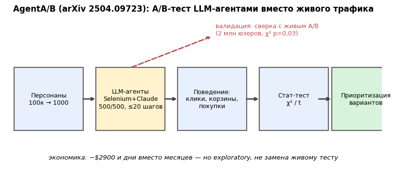

# Урок 4.6 — Аутлук: LLM-агенты в АБ (AgentA/B)

**Цель урока:** оценить, что симуляция LLM-агентов может проверить до живого эксперимента и какие выводы не подтверждены.

**Перед уроком:** [проверьте зависимости темы](../../../course/PREREQUISITES.md); обозначения — в [словаре](../../../course/GLOSSARY.md).

## Зачем это аналитику

Авторы AgentA/B опросили шестерых практиков екома, которые катят тесты на аудиториях от миллиона человек. Картина знакомая любому аналитику «ЕдаДома»: путь от идеи до финального решения занимает от трёх месяцев до года; трафика на все гипотезы не хватает; тесты на пересекающиеся куски интерфейса стоят в очереди друг за другом. До живого теста доезжает малая часть гипотез, а ранние прототипы не проверяются никак — «показали коллегам и спросили, все ли ок».

Урок 4.5 закрыл экономику этого узкого места: каждая неделя теста стоит денег, слоты трафика — дефицит, EVI приоритизирует бэклог. Здесь — короткий аутлук на инструмент, который обещает «дешёвые претесты»: не замену живому A/B, а симуляционную фазу до него. Относиться к нему стоит как к синтетической фокус-группе (формулировка abba_testing): грубый, но дешёвый фильтр гипотез — при честных оговорках про валидность.

## Теория

### 1. Идея: симуляционная фаза перед живым тестом

Пайплайн AgentA/B:

1. **Персоны.** LLM генерирует ~100 000 персон (возраст, доход, профессия, привычки в покупках), из них сэмплируют 1000 и раскидывают 500/500 — классический **between-subject** A/B (каждая персона видит один вариант; контекст агента можно сбросить; paired-дизайн возможен, но требует явного моделирования общего persona и случайности запусков).
2. **Агенты на живом сайте.** Каждый агент через Selenium ходит по настоящему Amazon.com: ищет, кликает товар, применяет фильтры, покупает или уходит. Под капотом — Claude 3.5 Sonnet.
3. **Состояние — не скриншот.** Страницу парсят в урезанный JSON (товары, цены, фильтры) — агент читает структурированное состояние, а не пиксели; сессия обрезается на 20 действиях.
4. **Статистика — обычная.** Конверсии «купил/не купил» по рукам сравнивают стандартными критериями (в статье — χ²).


*Рис. 1. AgentA/B: персонаны → LLM-агенты → поведение → стат-тест, с валидацией живым A/B.*

### 2. Что показали авторы

Тест-кейс авторов — сокращение панели фильтров. В опубликованном описании есть несогласованность: 403/500 против 414/500 дают Pearson χ²≈0,809, p≈0,368; указанное авторами χ²=5,51 при df=1 само соответствует p≈0,019, а не .03. Разные части статьи также приводят 403 и 404 покупки. Поэтому по этим числам мы не воспроизводим заявленную значимость. Сообщение авторов о сравнении с живым A/B следует читать как предварительное свидетельство, отдельно от проверенного расчёта; один совпавший знак не доказывает переносимость симулятора.

Читать это надо аккуратно: одно сравнение на одном сайте, один совпавший знак и невоспроизведённый по таблице p-value — это «многообещающе», а не «доказано». Это претест для приоритизации, а не замена живого теста.

### 3. Ограничения: валидность симуляции

- **Персона ≠ живой пользователь.** LLM-персоны — не вероятностная выборка популяции: у них смещённые распределения привычек, нет настоящих бюджетных ограничений, лени и контекста. Ошибка «средний пользователь LLM» вместо «средний пользователь».
- **Обобщение и новизна.** Вердикт Искандера (Trisigma): пока у агентов нет скилла к обобщению, сравнимого с человеческим, симуляционные пользователи не заменят живой трафик даже в грубом приближении. Реальные пользователи реагируют на то, что агенты не видят (эстетика, доверие, привычка).
- **Свежесть и хрупкость.** Живой сайт дрейфует: DOM меняется, Selenium-селекторы ломаются; повторы запусков не обязаны быть стабильны (стохастичность LLM — фиксируйте temperature и seed, считайте это честным источником шума).
- **Одна метрика ≠ продукт.** Конверсия агента — узкая прокси; guardrails, долгосрочные эффекты и кумулятивные взаимодействия из урока 4.5 агентный слой не видит в принципе (нет «года жизни» у симуляции).

Границы применимости: **exploratory, не confirmatory** — груминг и приоритизация бэклога, грубая прикидка импакта до живого теста, сравнение ранних прототипов. Не для финальных решений о роллауте.

### 4. Когда пробовать

- **мало трафика** (ниша, B2B, новый рынок) — живой тест на MDE невозможен, агентный даёт хоть какую-то оценку;
- **длинные циклы** — очередь гипотез длиннее, чем пропускная способность слотов (та самая боль практиков из опроса);
- **дорогие качественные оценки до теста** — связка с EVI из 4.5: $2900 за претест выгодно, когда он переупорядочивает бэклог и экономит слоты живого трафика;
- prerequisite'ы (из рецепта abba «синтетическая фокус-группа»): история экспериментов с описанными гипотезами (откуда брать распределение персон и эффектов), профили юзеров из данных (кластеризация, опросы), валидация персон UX-исследователями — и обязательно **калибровка**: гоняйте агентные версии уже завершённых живых тестов и меряйте сонаправленность, прежде чем верить претестам на новых.

## Разбор на данных

Числа кейса Amazon (arXiv 2504.09723, пересказ Trisigma): 1000 агентов (500/500), между-субъектный дизайн на живом Amazon.com; тритмент — фильтр-панель с отсечением опций похожести <80%; покупки 414 vs 403, χ²(1)=5,51, p=0,03; средний чек $55→$61 (незначимо); живой параллельный тест на 2 млн пользователей — совпадение направления; стоимость 875 млн токенов ≈ $2900 и скорость «быстрее двух недель набора трафика».

Для сравнения масштабов (из практики 4.5): один launch-тест «ЕдаДома» — 60 тыс. юзеров на руку, чтобы увидеть +3–4% с SE аплифта 1,3 п.п.; претест за $2900 не конкурирует с этим по точности — он конкурирует с «показали коллегам» (нулевой ценой и нулевой валидностью) и выигрывает у него условно: у AgentA/B воспроизводимый протокол, явный критерий успеха и цена ошибки — «не то направление в приоритете», а не «не тот роллаут».

## Подводные камни

1. **Принимать агентный тест за доказательство.** Грозит: роллаут по p=0,03 на 1000 симулированных сессиях с невалидированными персонами. Правильно: агентный результат — приоритет бэклога и претест, финальное решение — только живой тест (или явное решение без теста, если ставка мала).
2. **Не калибровать симуляцию на истории.** Грозит: сонаправленность с живыми тестами не измерена — «работает» только в воображении. Правильно: прогон агентных версий 10–20 завершённых живых тестов, отчёт о согласии знаков/рангов до того, как доверять новым претестам.
3. **Персоны «из головы LLM».** Грозит: стохастический сэмпл из «среднего пользователя языковой модели». Правильно: персоны из своих данных (кластеры поведения, опросы, заказы), стратификация как в холдаутах из 4.5.
4. **Забывать про стоимость токенов при масштабировании.** Грозит: $2900 на тест × еженедельный поток — бюджет претестов обгоняет бюджет живой платформы. Правильно: стратифицированные выборки персон, обрезка сессий, дешёвые модели для рутины и дорогие для решений (та же логика, что Test & Roll из 4.5 — размер претеста из его ценности).
5. **Хрупкая инфраструктура.** Грозит: сайт дрейфует, селекторы и JSON-схема ломаются, тишина в логах выглядит как «нет эффекта». Правильно: мониторинг прохождений сценариев (свого рода SRM-чек агентного слоя), версионирование схемы состояния.

## Практика

Практики-файла нет — урок опциональный. Мини-демо «персоны + протокол» (проверено запуском; вывод ниже):

```python
import numpy as np

def make_personas(n=1000, seed=7):
    """Мини-генератор персон AgentA/B: возраст, бюджет, цель, терпение."""
    rng = np.random.default_rng(seed)
    ages = rng.integers(18, 70, n)
    budgets = np.round(rng.lognormal(7.0, 0.4, n), -2)  # руб. на заказ
    goals = rng.choice(["ужин быстро", "экономия", "праздник", "здоровое"],
                       n, p=[0.45, 0.25, 0.15, 0.15])
    patience = rng.choice([3, 6, 10, 20], n, p=[0.2, 0.3, 0.3, 0.2])
    return [{"id": i, "age": int(a), "budget": float(b), "goal": g,
             "max_actions": int(p)}
            for i, (a, b, g, p) in enumerate(zip(ages, budgets, goals, patience))]

def agent_protocol(personas, variants=("A", "B"), seed=11):
    """Between-subject раскладка персон по вариантам + план теста."""
    rng = np.random.default_rng(seed)
    arm = rng.choice(variants, len(personas))
    return [{"persona": p["id"], "arm": a, "goal": p["goal"],
             "budget": p["budget"], "max_actions": p["max_actions"],
             "успех": "дошёл до заказа в рамках бюджета и терпения"}
            for p, a in zip(personas, arm)]

personas = make_personas(n=1000)
plan = agent_protocol(personas)
print(len(plan), sum(p["arm"] == "A" for p in plan), sum(p["arm"] == "B" for p in plan))
```

Вывод: `1000 507 493` — 1000 персон, раскладка 507/493. В реальном AgentA/B дальше подключается Selenium-драйвер живого сайта и LLM-цикл «прочитай JSON-состояние → выбери действие», а критерий успеха фиксируется до запуска (дизайн-док из урока 4.1 никто не отменял — даже для агентов).

## Домашнее задание

1. Почему AgentA/B — between-subject дизайн, хотя «агента можно запустить дважды»? Что бы нарушилось при within-subject прогоне?

<details>
<summary>Ответ</summary>

Память и перенос: второй прогон того же агента по другому варианту не независим с первым (персона «помнит» интерфейс, фильтры, цены), плюс site-эффекты порядка — эффект варианта смешивается с порядком показа. Between-subject с независимыми персонами 500/500 сохраняет структуру обычного A/B: независимые юниты, сравнение групп, χ²/t как в живом тесте. (Контраст: interleaving из урока 4.3 — осознанный within-дизайн для ранжирования, там перенос — это фича, а не баг.)
</details>

2. Чем агентный претест отличается от фокус-группы и почему «сонаправленность с живым тестом» — ключевая метрика его качества?

<details>
<summary>Ответ</summary>

Фокус-группа: 5–8 живых людей, качественные высказывания, малая выборка и сильные эффекты интервьюера. Агентный претест: сотни-тысячи структурированных сессий, количественная метрика (конверсия, чек), воспроизводимый протокол, цена ~$2900. Но оба инструмента не измеряют «истинный» эффект — только его симуляционную/мнение-версию, поэтому внешняя валидность проверяется ретроспективной калибровкой: доля совпадений знака (и ранга) с уже завершёнными живыми тестами. Без измеренной сонаправленности претест — фокус-группа с большим числом нулей.
</details>

3. Из экономики урока 4.5: живой тест фичи стоит 5 недель ожидания (упущено ~0,8 млн ₽), агентный претест — $2900 (~0,25 млн ₽) и 2 дня. Когда претест оправдан, а когда — нет?

<details>
<summary>Ответ</summary>

Оправдан, когда меняет решение до живого теста: переупорядочивает бэклог (EVI претеста > цены), отсеивает явно провальные прототипы до занятия слота трафика, даёт грубую оценку размера для дизайна живого теста (MDE из 3.1). Не оправдан: финальное решение о роллауте (валидность не доказана), простые дешёвые изменения (претест дороже и дольше, чем «покатить и откатить»), и любые случаи, когда результат претеста всё равно не изменит план — тогда это $2900 за уверенность, которую никто не использует.
</details>

4. Вы хотите повторить AgentA/B для «ЕдаДома». Перечислите четыре компонента, которые придётся построить, и главный риск каждого.

<details>
<summary>Ответ</summary>

(1) Генератор персон из своих данных (заказы, активность, опросы) — риск: персоны «из LLM», смещение к среднему; (2) парсер состояния сайта/приложения в урезанный JSON — риск: хрупкость к дрейфу интерфейса, нужен мониторинг прохождений; (3) LLM-цикл действий с бюджетом шагов — риск: стохастичность и цена токенов, фиксировать seed/temperature и стратифицировать выборку; (4) протокол успеха и статистика (критерий, α, юнит) — риск: превратить претест в confirmatory-заявление; фиксировать в дизайн-доке, интерпретировать как exploratory и калибровать на истории живых тестов.
</details>

## Шпаргалка

1. Боль: живой трафик — дефицит; 3 мес – год от идеи до решения, очереди тестов, прототипы «проверяем показом коллегам».
2. AgentA/B (arXiv 2504.09723): 1000 LLM-агентов с персонами (500/500, between-subject), Selenium на живом сайте, JSON-состояние, ≤20 действий, Claude 3.5 Sonnet.
3. Результат: фильтр-панель − опции <80% похожести: 414 vs 403 покупки, χ²(1)=5,51, p=0,03; чек $55→$61 нз; направление совпало с живым тестом на 2 млн юзеров.
4. Экономика: 875 млн токенов ≈ $2900 за претест, быстрее 2 недель набора трафика; конкурирует с «нулевой валидностью», не с живым тестом.
5. Ограничения: персона ≠ живой пользователь (нет вероятностной выборки), обобщение/новизна вне досягаемости агентов, хрупкость к дрейфу сайта, одна метрика — не продукт (guardrails и кумулятивные эффекты не видны).
6. Применение: exploratory — приоритизация бэклога, претест прототипов, грубая оценка импакта; финальные решения — только живым тестом.
7. Обязательная калибровка: агентные повторы завершённых живых тестов, метрика — сонаправленность знаков/рангов; персоны — из своих данных, не из головы LLM.

## Источники

- Trisigma (t.me/trisigma_avito), дайджест `materials/telegram/trisigma_avito-digest.md` + полный пересказ в `materials/telegram/_raw/trisigma_avito_p1.md`: пост-разбор arXiv:2504.09723 «Agent A/B: Automated and Scalable A/B Testing on Live Websites with Interactive LLM Agents» (Amazon & Northeastern; v1 04.2025, v4 03.2026) — пайплайн, эксперимент с фильтр-панелью, χ² p=0,03, сходимость с живым тестом на 2 млн, $2900/1000 агентов, вердикт «инструмент приоритизации, не замена».
- abba_testing (С. Матросов), дайджест `materials/telegram/abba_testing-digest.md`: «Эй-Ай в AB — синтетическая фокус-группа» (миллионы ИИ-ботов как претест; условия: история экспериментов + таблица участия + профили юзеров; ограничения по токенам и сонаправленность) — русскоязычный аналог той же идеи.
- Связи внутри курса: экономика теста и EVI — урок 4.5; дизайн-док и OEC — 4.1; валидность и interleaving — 4.3; MDE и дефицит трафика — 3.1; байесовский shrinkage для претестов — М5.
