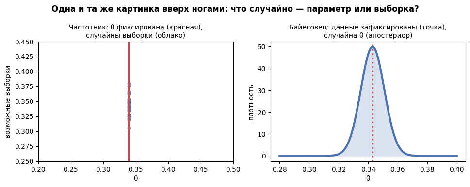
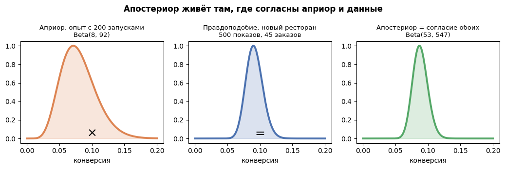
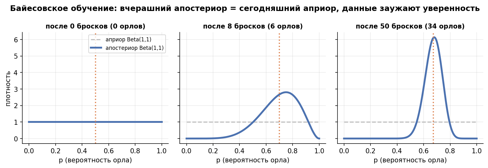

# Урок 5.1 — Байесовский вывод: априор, правдоподобие, апостериор

**Цель урока:** обновить prior данными, получить posterior и объяснить зависимость вывода от модели.

**Перед уроком:** [проверьте зависимости темы](../../../course/PREREQUISITES.md); обозначения — в [словаре](../../../course/GLOSSARY.md).

## Зачем это аналитику

На платформу «ЕдаДома» каждый месяц заезжает ~200 новых ресторанов. В первый день у карточки ресторана бывает 150 показов и 11 заказов. Частотный аппарат из М1–М4, который вы уже владеете, скажет: «конверсия 7,3%, 95% CI [3,7%; 11,0%]» — и промолчит на вопросы, которые задаёт продакт:

- «Какова вероятность, что этот ресторан конвертит выше 6% — порога алерта?»
- «Кто в выдаче выше: ресторан с 2 заказами из 2 (100%!) или с 85 из 100 (85%)?»
- «Вчера мы уже смотрели данные этого ресторана. Сегодня пришёл новый день — как обновить вывод, а не начинать с нуля?»

Все три вопроса — про **вероятности утверждений о параметре**, а частотная статистика такие вероятности не выдаёт принципиально (урок 2.1: p-value — хвостовая вероятность статистики при гипотезе, не наоборот). Байесовский вывод — это второй, легальный способ рассуждать о неопределённости: он берёт то, что вы знаете *до* данных (на платформе уже 200 прошлых запусков!), перемножает с тем, что сказали данные, и выдаёт распределение убеждений, из которого прямым счётом берутся ответы на вопросы продакта.

И сразу рамка честности (вернёмся в 5.2–5.3): байес не «лучше» частотного подхода — у него другая валюта. Частотный подход предоставляет **гарантии по ансамблю повторений** (контроль α, мощность — контракт из урока 2.1), байесовец — **вероятностные высказывания об этом параметре** при явно названном априоре. Хороший аналитик владеет обеими и понимает, какие утверждения из них следуют.

## Теория

### 1. Смена оптики: кто случайный, а кто фиксирован

Всё различие двух школ — в одном перевороте:

| | Частотный подход (М1–М4) | Байесовский подход (М5) |
|---|---|---|
| Параметр $\theta$ (конверсия) | фиксированная, но неизвестная константа | случайная величина с распределением |
| Данные $D$ | случайны (до отбора): «выборка — одна из возможных» | фиксированы: «мы увидили то, что увидели» |
| Что выдаёт процедура | оценки, CI, p-value — с гарантиями на повторениях | апостериорное распределение $P(\theta \mid D)$ |
| Вопрос-максимум | «какие данные вероятны, если $\theta$ такая?» | «какие $\theta$ вероятны, вот такие данные?» |
| Вероятность — это | предел частоты в повторениях | степень убеждения, которую данные обновляют |

Вероятность как частота vs степень доверия — это различие в интерпретации вероятности ([Averianova, Medium]): фреквентист думает ансамблем «1000 таких же экспериментов», байесовец — «насколько я уверен в этом утверждении сейчас». Отсюда и запреты частотного подхода: если $\theta$ — константа, «вероятность, что конверсия выше 6%» просто не определена (для конкретного значения это 0 или 1, мы лишь не знаем, какое). Байесовец разрешает себе называть конверсию случайной — и вопрос становится осмысленным.

*Рис. 1. Две оптики: частотник фиксирует параметр и рандомит выборки, байесовец — наоборот.*

### 2. Теорема Байеса: три части, каждая своими словами

$$\underbrace{P(\theta \mid D)}_{\text{апостериор}} \propto \underbrace{P(D \mid \theta)}_{\text{правдоподобие}} \cdot \underbrace{P(\theta)}_{\text{априор}}$$

Курт объясняет её на Lego: у формулы две степени свободы, теорема Байеса пересобирает вероятность из «данных при гипотезе» в «гипотезу при данных». Части:

- **Априор $P(\theta)$** — убеждение о параметре *до* того, как мы посмотрели на данные. «Платформа знает: новые рестораны в первый месяц конвертят в среднем в 8%». Требование дисциплины (Ульянов, гл. 3): априор выбирается **до** сбора данных, и вы должны быть готовы **поставить на него деньги**. Априор — это позиция, а не украшение.
- **Правдоподобие $P(D \mid \theta)$** — насколько наблюдаемые данные вероятны при каждом значении $\theta$. Это та же функция, что в MLE (урок 1.2): «если конверсия равна 8%, вероятность увидеть 11 заказов из 150 — такая, если 12% — вот такая». Правдоподобие — единственная часть, куда входят данные.
- **Апостериор $P(\theta \mid D)$** — обновлённое убеждение: пропорционально произведению двух предыдущих. Значения $\theta$, которые хорошо согласованы и с априором, и с данными, получают высокую плотность; остальные — низкую.
- **Нормировка** (знаменатель полной формулы) — константа, которая превращает «пропорционально» в распределение с площадью 1; для расчётов её часто можно игнорировать ([Averianova]).

Апостериор отвечает на любые вопросы прямой выкладкой: $P(\theta > 6\%)$ — хвост апостериора; прогноз следующего заказа — среднее апостериора; «лучший ресторан» — сравнение апостериоров (5.2–5.3).

*Рис. 2. Апостериор = произведение априора и правдоподобия: живёт там, где согласны опыт и новые данные.*

### 3. Априор: три веса

| Тип | Пример для доли | Что утверждает | Когда брать |
|---|---|---|---|
| Неинформативный | Beta(1,1) — равномерный на [0;1]; Jeffreys Beta(0,5; 0,5) | Beta(1,1) flat; Jeffreys имеет U-образную плотность и инвариантен к перепараметризации | нет истории, хотим минимального вмешательства |
| Слабоинформативный | Beta(2,2) | «доля вряд ли 0% или 100%, что-то в середине» | история сомнительна, но физика подсказывает границы |
| Информативный / empirical Bayes | Beta(8,92) из 200 прошлых запусков | «новые рестораны живут около 8%» | есть накопленная история однотипных объектов |

Empirical Bayes оценивает гиперпараметры prior по данным объектов. Для конверсий нужно отделить межобъектную вариацию от биномиального шума и учесть разные n: использовать beta-binomial marginal likelihood или корректные моменты. В практике prior оценивается по отдельным историческим монетам, а не берётся из известных параметров генератора. Plug-in EB не включает неопределённость гиперпараметров целиком; bootstrap истории или полная иерархия помогают её оценить.

### 4. Сопряжённость Beta-Бернулли: арифметика в голове

Для доли (Бернулли-данные: заказ/не заказ, клик/не клик) и Beta-априора апостериор — снова Beta, и обновление сводится к сложению:

$$\theta \sim \mathrm{Beta}(\alpha, \beta) \ + \ k \text{ успехов},\ m \text{ неудач} \ \Rightarrow\ \theta \mid D \sim \mathrm{Beta}(\alpha + k,\ \beta + m)$$

**«Апостериор = априор + данные»** — в самом буквальном смысле. Почему это считается в голове:

- апостериорное среднее $= \dfrac{\alpha + k}{\alpha + \beta + n}$ — априорные успехи лежат в числителе с настоящими, априорный вес — в знаменателе с объёмом выборки;
- вес априора $\alpha + \beta$ показывает, скольким наблюдениям вы приравняли своё «до-знание»: Beta(8,92) — это «поверьте 100 показам истории прежде, чем поверите 100 новым показам»;
- апостериорное прогнозное — вероятность успеха следующего наблюдения — равно тому же среднему: $\Pr(\text{заказ}) = \dfrac{\alpha + k}{\alpha + \beta + n}$. Никакой отдельной формулы.

### 5. Последовательное обновление: вчера постериор — сегодня приор

Байесовский вывод естественно поточный: апостериор после вчерашних данных служит априором для сегодняшних:

$$\text{Beta}(\alpha,\beta) \xrightarrow{\text{день 1}} \text{Beta}(\alpha+k_1, \beta+m_1) \xrightarrow{\text{день 2}} \text{Beta}(\alpha+k_1+k_2, \beta+m_1+m_2) \to \dots$$

Последовательное обновление эквивалентно пакетному при той же модели. Частотные оценки тоже можно пересчитывать порциями; проблема optional stopping касается правила решения и его error rates, а не арифметики обновления. Байесовская остановка также не получает частотную калибровку автоматически — урок 5.3.

*Рис. 3. Последовательное обновление: вчерашний апостериор = сегодняшний априор.*

### 6. Считаем руками: Beta(2,2) + 7 орлов из 10

Слабоинформативный априор «монета скорее нормальная»: Beta(2,2), среднее 0,5, вес 4 псевдоброска. Выпало 7 орлов и 3 решки:

$$\text{Beta}(2,2) \to \text{Beta}(2+7,\ 2+3) = \text{Beta}(9,5)$$

| величина | априор | MLE (только данные) | апостериор |
|---|---|---|---|
| среднее | $2/4 = 0{,}500$ | $7/10 = 0{,}700$ | $9/14 = 0{,}643$ |
| 95%-интервал | [0,094; 0,906] | — | [0,386; 0,861] |

Апостериорное среднее 0,643 — между 0,5 априора и 0,7 данных, ближе к данным: у данных 10 голосов, у априора 4. Интервал всё ещё широченный — 10 бросков мало о чём говорят, но направление сдвига видно невооружённым глазом. Это и есть вся механика урока.

### 7. А если сопряжённости нет?

Beta-Бернулли — счастливое исключение. Средний чек не Бернулли, эффект баннера — не одна доля, иерархия ресторанов — не сопряжённая модель. Общий рецепт: задать априор и правдоподобие как угодно, а апостериор считать численно — сеткой (grid) для 1–2 параметров или **MCMC** (сэмплирование: гуляем по пространству параметров так, чтобы частота визитов была пропорциональна апостериору). Историческая причина господства частотной школы — именно вычислительная: до MCMC апостериор был «не берётся интегралом»; сегодня это строки в PyMC. Практика PyMC/MCMC — урок 5.5; здесь всё считается в голове.

### 8. Байес в продукте помимо АБ-тестов

- **Скоринг и рейтинги**: усадка (shrinkage) конверсий новых ресторанов к платформенному априору — ровно empirical Bayes из практики ниже; так же сглаживают рейтинги фильмов/товаров.
- **Прогноз**: апостериорное прогнозное распределение — честный прогноз следующего заказа/клика с неопределённостью, а не одна цифра.
- **Фрод/спам-фильтры**: наивный Байес — исторически первое массовое применение ([Ravichandran, LinkedIn]).
- **АБ-платформы**: байесовские движки (VWO, Google Optimize в прошлом) отдают P(B>A) вместо p-value — разбор в 5.2–5.3; бандиты (5.4) — Thompson sampling прямо сэмплирует из Beta-апостериоров.

## Разбор на данных

Задача скоринга нового ресторана «Суши Мастер». История: 200 прошлых запусков, конверсия первого месяца — в среднем 8%, разброс соответствует **Beta(8, 92)** (вес 100 показов). Это априор. Первая неделя нового ресторана по дням: день 1 — 11 заказов на 150 показов, день 2 — 13 на 180, дни 3–7 суммарно — 66 на 870 (итого 90 из 1200, сырая конверсия 7,5%).

Последовательное обновление (вчерашний апостериор = сегодняшний априор):

| шаг | данные | апостериор | среднее | 95% credible | P(конверсия > 6%) |
|---|---|---|---|---|---|
| до данных | — | Beta(8, 92) | 8,0% | [3,6%; 14,0%] | 75,7% |
| день 1 | 11/150 | Beta(19, 231) | 7,6% | [4,7%; 11,2%] | 83,0% |
| день 2 | +13/180 | Beta(32, 398) | 7,4% | [5,2%; 10,1%] | 87,7% |
| неделя | +66/870 | Beta(98, 1202) | 7,5% | [6,2%; 9,0%] | **98,7%** |

Считаем ключевые строки руками: после дня 1 апостериор Beta(8+11, 92+139) = Beta(19, 231), среднее $19/250 = 7{,}6\%$ — сырой MLE 7,3% подтянут к платформенным 8% (вес априора 100 против 150 данных). К концу недели: Beta(8+90, 92+1110) = Beta(98, 1202), среднее $98/1300 = 7{,}54\%$ — априор с весом 8% от выборки уже почти не двигает оценку, зато интервал сузился с ~10,5 п.п. до ~2,9 п.п.

Ответы продакту — прямо из апостериора:

1. «Вероятность, что ресторан конвертит выше 6%?» — $P(\theta > 0{,}06 \mid D) = 98{,}7\%$ (хвост апостериора).
2. «Прогноз конверсии на следующий показ?» — 7,5% (среднее апостериора = прогнозное).
3. «Ресторан в алерт?» — нет: не только среднее выше 6%, но и P = 98,7% почти не оставляет сомнений.

Проверка чувствительности (обязательный шаг): с плоским априором Beta(1,1) апостериор Beta(91, 1111), среднее 7,57%, интервал [6,1%; 9,1%] — практически то же; со скептическим «новичкам без отзывов не верю — 5%» Beta(5, 95) среднее 7,31%. При 1200 показах вывод устойчив к априору. При 150 (день 1) — уже нет: там средние 7,895% (flat) / 7,6% (8,92) / 6,4% (5,95) различались заметно, и выбор априора был частью ответа.

## Подводные камни

1. **Априор подгоняют под нужный результат.** Делают: «посмотрели данные, подобрали априор, при котором P(B>A) = 97%». Грозит: prior hacking — та же болезнь, что p-hacking (урок 2.4), только субъект ещё более пластичный. Правильно: априор фиксируется до данных (дизайн-док, М4.1), готовность «поставить деньги» (Ульянов); в отчёте — чувствительность к 2–3 априорам.
2. **Плоский априор на редких событиях.** Делают: конверсию 3/20 оценивают с Beta(1,1). Грозит: вес априора 2 наблюдения тащит среднее к 18,2% (Beta(4,18)), хотя слабоинформативный Beta(1,9) для «конверсия заведомо меньше половины» даёт 13,3% — при малых n разница в полтора раза. Правильно: если априорная информация есть (конверсии бывают 1–15%, а не 50%) — закодировать её хотя бы слабо; «плоский» — не «нейтральный», он тоже голосует.
3. **Двойной учёт данных в empirical Bayes.** Делают: априор подогнан по конверсиям тех же 1200 показов, на которых потом обновляются. Грозит: данные говорят дважды — интервал ложно узкий, неопределённость занижена. Правильно: априор из *другого* периода/объектов; честная иерархия — модель с частичным пулингом (5.5).
4. **Забывают вес априора.** Делают: берут Beta(50, 50) «для устойчивости» и 100 бросков данных. Грозит: априор с весом 100 псевдонаблюдений перекрикивает выборку (в практике ниже: среднее 0,585 против 0,667 при плоском). Правильно: вес априора = α+β сопоставлять с n и показывать в отчёте; «насколько данных нужно, чтобы перевесить априор» — вопрос из ДЗ.
5. **Усохшая оценка скрывает звезду.** Делают: скорят всех новеньких shrinkage к средней и могут понизить оценку необычно хорошего ресторана в первый день. Грозит: систематическое занижение сильных новичков (и завышение слабых) — цена MSE-оптимальности. Правильно: усадка — для *оценки*, а не для *решения*; для решений смотреть апостериор целиком и собирать данные (бандиты, 5.4).
6. **Формулу α+=успехи тянут на несопряжённую задачу.** Делают: «средний чек — тоже доля, обновлю Beta». Грозит: модель не соответствует данным, «апостериор» бессмыслен. Правильно: сопряжённость — свойство пары распределений; вне её — сетка или MCMC (5.5).
7. **Смешение валют в одном предложении.** Делают: «с вероятностью 95% эффект в интервале [−0,4; +2,2] п.п., значит тест значим». Грозит: credible-высказывание приписано частотной гарантии (или наоборот) — собеседующий спросит «чей это 95%?». Правильно: каждая цифра — со своей интерпретацией; словарь перевода — урок 5.2.

## Практика

Файл [practice_5_1.py](practice/practice_5_1.py) (percent-формат, numpy/scipy/matplotlib/pandas, seed зафиксирован). Монета с истинным p = 0,7 — учебная модель любой доли. Четыре блока:

1. **Последовательное обновление** трёх априоров — Beta(1,1), Beta(5,2), Beta(50,50) — по сетке 1/5/20/100/500 бросков ([practice_5_1_sequential.png](images/practice_5_1_sequential.png)).
2. **Таблица «априор → апостериор после 100 бросков»** (в этом сиде 67 орлов / 33 решки): среднее, 95% credible, $P(p>0{,}5)$, прогноз следующего орла.
3. **Чувствительность**: три априора на одном графике при n=100 и n=500 ([practice_5_1_priors_fade.png](images/practice_5_1_priors_fade.png)).
4. **Empirical Bayes**: 1000 новых монет из Beta(6,4), по 5 бросков; prior оценивается beta-binomial MLE по отдельной истории 1000 монет×20 бросков (получилось Beta(6,21;4,24)). Сравниваются raw, empirical и oracle Bayes ([practice_5_1_empirical_bayes.png](images/practice_5_1_empirical_bayes.png)).

Что должны увидеть (числа реального запуска):

- после 100 бросков: Beta(1,1) → Beta(68,34), среднее **0,667**; Beta(5,2) → Beta(72,35), 0,673; Beta(50,50) → **Beta(117,83), 0,585** — сильный априор с весом 100 псевдобросков тянет вниз на 8 п.п.;
- разброс средних между априорами: **0,088 при n=100 → 0,030 при n=500** — влияние априора тает как $1/n$, но у весомого априора тает медленно;
- $P(p>0{,}5)$: 99,97% / 99,99% / 99,21% — «монета честная» умерла при всех априорах; прогноз орла = среднее апостериора (66,7% / 67,3% / 58,5%);
- монетный двор: 14,6% монет получают MLE 0% или 100%; байесовская оценка усаживает их к средней двора, **MSE 0,0446 → 0,0144 (в 3,1 раза точнее)**, а SD разброса оценок 0,258→0,083 против истинного 0,146 — байесовская оценка «шумит» даже меньше, чем истинные значения, потому что тянет к среднему. Именно так скорят новеньких «ЕдаДома».

## Домашнее задание

**Задача 1.** Априор Beta(3, 3), данные: 2 орла из 6. Выпишите апостериор, посчитайте среднее до и после. Куда сдвинулось убеждение и почему ровно на столько?

Ответ

Апостериор Beta(5, 7); среднее было $3/6 = 0{,}5$, стало $5/12 \approx 0{,}417$. Данные (2/6 ≈ 0,33) тянут вниз с весом 6, априор сопротивляется с весом 6 — итог ровно посередине между 0,5 и 0,33: $(3+2)/(6+6)$. Ровно на столько — потому что вес априора равен объёму данных, и голоса делятся пополам.

**Задача 2.** Виджет «Закажи снова»: платформённый априор Beta(6, 194) (средний CTR 3%, вес 200 показов). За тест пришло 40 кликов на 800 показов (5,0%). Посчитайте апостериор и его среднее. Сравните с MLE и объясните разницу.

Ответ

Апостериор Beta(46, 954), среднее $46/1000 = 4{,}6\%$ — между априорными 3% и MLE 5,0%: 800 данных против 200 псевдопоказов истории, данные перевесили в соотношении 4:1, но история всё ещё тянет на полпункта. MLE 5,0% игнорирует то, что виджеты в среднем кликаются в 3% — при следующей неделе с нулевым трендом он был бы завышен.

**Задача 3.** Коллега-скептик ставит априор Beta(90, 10) («монета почти всегда даёт орла»). Монета на самом деле честная. Сколько примерно бросков понадобится, чтобы апостериорное среднее опустилось до 0,55?

Ответ

Среднее апостериора $= (90 + k)/(100 + n)$, где при честной монете $k \approx n/2$. Решаем $(90 + 0{,}5n)/(100+n) \le 0{,}55$: $90 + 0{,}5n \le 55 + 0{,}55n \Rightarrow n \ge 700$. Априор с весом 100 псевдобросков перевешивается выборкой того же порядка — «данные побеждают, но платить приходится семикратной выборкой». Это пример веса сильного prior. Правило Кромвеля отдельно предупреждает о нулевой prior probability/support: данные не добавляют массу туда, где prior исключает значение.

**Задача 4.** Ресторан А: 2 заказа из 2 показов. Ресторан Б: 85 из 100. Платформенный априор Beta(8, 92). Чья байесовская оценка конверсии выше и на сколько? Что бы было при сортировке по сырой конверсии?

Ответ

А: Beta(10, 92), среднее $10/102 = 9{,}8\%$. Б: Beta(93, 107), среднее $93/200 = 46{,}5\%$. По сырой конверсии А (100%) «лучше» Б (85%) — абсурд: два показа не доказывают совершенство. Байес усаживает А к платформенным 8% (двум показам не дали переубедить априор со весом 100), и Б справедливо впереди. Так работает скоринг новинок без «магии 100%».

**Задача 5.** Докажите себе арифметикой, что последовательное обновление тремя порциями (k₁,m₁), (k₂,m₂), (k₃,m₃) даёт тот же апостериор, что одна порция (k₁+k₂+k₃, m₁+m₂+m₃). Почему это свойство — фундамент для «обновляемых» дашбордов?

Ответ

По индукции: Beta(α,β) → Beta(α+k₁, β+m₁) → Beta(α+k₁+k₂, β+m₁+m₂) → Beta(α+k₁+k₂+k₃, β+m₁+m₂+m₃) — сложение ассоциативно, порядок порций не важен. Поэтому байесовский дашборд конверсии ресторана может пересчитываться хоть каждый час: вчера закончили с апостериором — сегодня начали с него же, без переприготовления истории, и без «наказания» за то, что смотрели данные по ходу (с оговорками про остановку тестов — урок 5.3).

## Шпаргалка

1. Частотный p-value=P_H0(T(D*) не менее экстремальна, чем T(D_obs)): хвостовая вероятность по выбранной статистике, а не likelihood конкретного датасета. Байесовский posterior=P(θ|D) зависит также от prior.
2. Теорема Байеса: апостериор $\propto$ правдоподобие × априор. Априор — убеждение до данных (готовность ставить деньги); правдоподобие — единственная часть с данными; апостериор — обновлённое убеждение.
3. Априоры: неинформативный Beta(1,1)/Jeffreys Beta(0,5;0,5), слабоинформативный Beta(2,2), информативный/empirical Bayes (подгонка Beta к историческим конверсиям).
4. Вес априора = α+β псевдонаблюдений; конкурирует с объёмом данных. Beta(50,50) = «поверьте 100 броскам истории».
5. Beta-Бернулли: успехи идут в α, неудачи в β. Апостериорное среднее $(\alpha+k)/(\alpha+\beta+n)$; прогноз следующего события = то же число.
6. Последовательное обновление: вчерашний апостериор = сегодняшний априор; итог не зависит от порядка и порций.
7. Влияние априора тает как $1/n$ (разброс средних 0,088 → 0,030 от n=100 к n=500) — но весомый априор умирает медленно: до 0,55 при весе 100 нужно ~700 честных бросков.
8. Чувствительность — часть отчёта: считать при 2–3 априорах; вывод, живущий только при одном априоре, — не вывод.
9. Без сопряжённости: сетка или MCMC (PyMC) — урок 5.5; «не берётся интегралом» больше не аргумент.
10. Продуктовые применения помимо АБ: скоринг/shrinkage новинок, прогнозные распределения, спам-фильтры, бандиты (5.4), байесовские АБ-платформы (5.3).

## Источники

- Уилл Курт, «Байесовская статистика: Star Wars, LEGO, резиновые уточки и многое другое» (ДМК Пресс, 2021), гл. 6–9 (условная вероятность, теорема Байеса на Lego, априор/правдоподобие/апостериор, выбор априоров) и гл. 13–14 (плотности, интервалы, оценка параметров с априорами) — основная интуиция урока (карточка книги: `materials/local/books-folder.md` §4).
- Освальдо Мартин, «Байесовский анализ на Python» (ДМК Пресс, 2020), гл. 1–2: байесовский вывод с одним параметром, задача о монете, обобщение апостериора — практическая сторона (PyMC ждёт в 5.5).
- Iuliia Averianova, «Байесовская статистика для специалистов по данным» (Medium, 2021) — https://medium.com/nuances-of-programming/байесовская-статистика-для-специалистов-по-данным-37d77c8e0daa (конспект: `materials/web/web-articles.md` §1): две школы, априор×правдоподобие→апостериор, сходимость противоположных априоров, правило Кромвеля.
- Vaidyanathan Ravichandran, «Bayesian Statistics for Learners: A Comprehensive Walkthrough» (LinkedIn, 2025) — https://www.linkedin.com/pulse/bayesian-statistics-learners-comprehensive-vaidyanathan-ravichandran-f8rtc/ (конспект: `materials/web/web-articles.md` §2): итеративное обновление, Beta-Бернулли с числами, критика и ответы.
- Ф. Ульянов (FUlyankin), book_about_bayes, гл. 3 «Что такое Байесовский подход и кому он сдался» (априор как денежная ставка, вывод Beta-апостериора вручную, задача о рыбалке) и гл. 4 «Мама, папа, знакомьтесь. Это STAN» (монетка, численный вывод) — `/Users/user/Desktop/курсы/статистика и АБ/book_about_bayes/`.
- Лагутин М. Б., «Наглядная математическая статистика», §3.5; Spanos A., *Probability Theory and Statistical Inference*, §11.3 — формальная сторона байесовского вывода (по плану курса).
- Контраст с пройденным: урок 1.2 (распределения, MLE), урок 1.3 (CI и ансамблевая гарантия), урок 2.1 (p-value = хвостовая вероятность статистики при H0), урок 3.7 (подглядывание — почему «смотреть по ходу» в NHST запрещено, а в байесе естественно).
