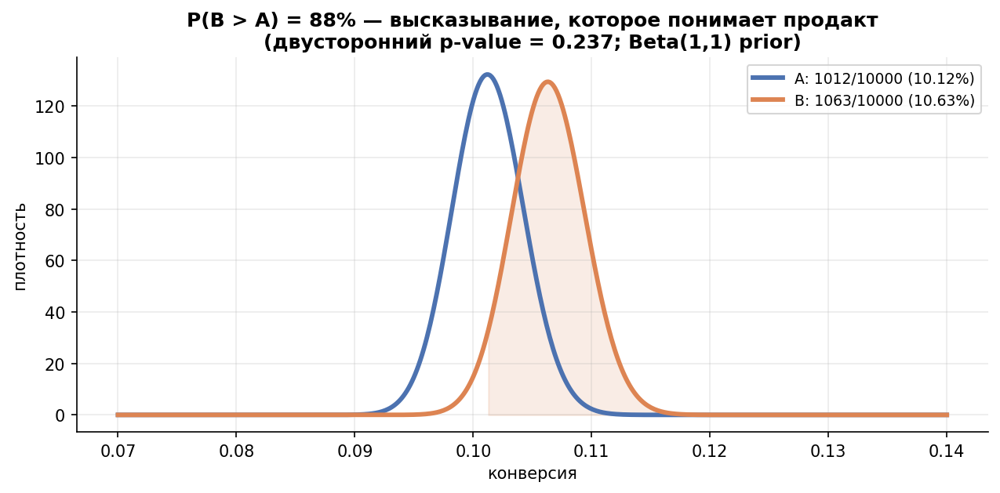
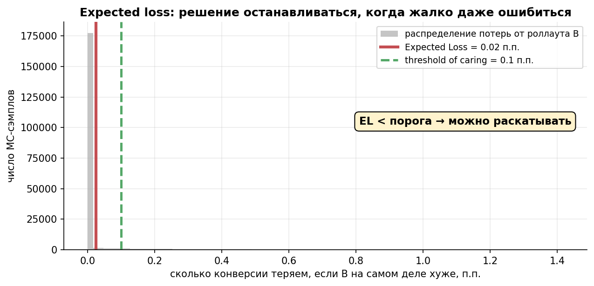
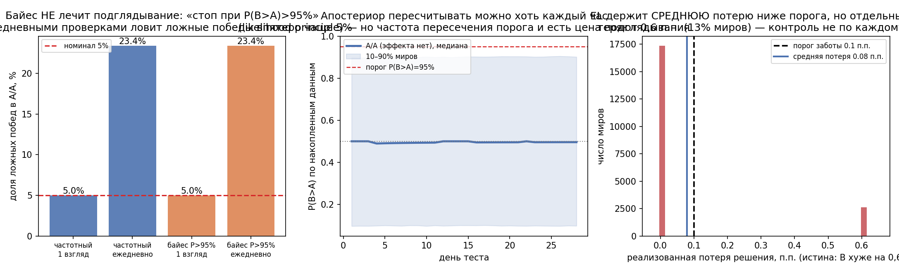

# Урок 5.3 — Байесовский A/B: P(B>A), expected loss, когда останавливаться

**Цель урока:** сопоставить posterior probability, ROPE и expected loss, выбрать правило решения и проверить его operating characteristics.

**Перед уроком:** [проверьте зависимости темы](../../../course/PREREQUISITES.md); обозначения — в [словаре](../../../course/GLOSSARY.md).

## Зачем это аналитику

«ЕдаДома» две недели проводит тест нового экрана оплаты. Горизонт прошёл, на дашборде p = 0,24 — «серый». Продакт приходит с двумя вопросами: «То есть B не лучше?» и «Сколько мы теряем, если всё-таки раскатим?». На языке NHST ответить нельзя: «не отвергли H0» — не «не лучше» и уж точно не «сколько теряем». А на языке байеса — можно, и это дословно второй вопрос: **expected loss** — ожидаемые потери решения «раскатить B». В нашем тесте (ниже, разбор): P(B>A) = 88%, а ожидаемые потери от раскатки B — 0,025 п.п. конверсии. Если бизнесу плевать на доли пункта меньше 0,1 п.п. — решение уже созрело, вопреки «серому» p-value.

Байесовский posterior можно обновлять по мере данных, но правило остановки P(B>A)>.95 имеет собственные frequentist operating characteristics. EL<ε ограничивает **апостериорную ожидаемую потерю** решения при выбранных модели и prior. Это не равномерная гарантия частотной средней реализованной потери для каждой возможной истины.

Третий сценарий — коммуникация. «94% вероятность, что B лучше A минимум на 3%» (формулировка MCP Analytics) продаётся стейкхолдерам лучше, чем «p = 0,07» — это не реклама, а факт о том, как люди понимают неопределённость. Байесовский A/B — это в первую очередь инструмент **говорить на языке решений и денег**.

## Теория

### 1. Полный пайплайн за четыре шага (без единого MCMC)

Всё строительство из урока 5.1: конверсия — Бернулли, априор Beta — сопряжённый. Для каждой группы:

$$\theta_A \mid D \sim \mathrm{Beta}(1 + c_A,\ 1 + n_A - c_A),\qquad \theta_B \mid D \sim \mathrm{Beta}(1 + c_B,\ 1 + n_B - c_B),$$

где $c$ — заказы, $n$ — визиты (приор Beta(1,1); информативный — из истории, урок 5.1). Дальше Монте-Карло — Курт (гл. 15) называет это «подсчётом миров»:

1. насэмплировать $s_A^{(1..M)}$, $s_B^{(1..M)}$ из апостериоров (M = 100–200 тыс., мгновенно в numpy);
2. **P(B>A)** = доля миров, где $s_B > s_A$: $\frac{1}{M}\sum \mathbb{1}[s_B^{(j)} > s_A^{(j)}]$;
3. любые величины о разности: квантили, HDI, P(B > 1.03·A) — «лучше минимум на 3%»;
4. всё то же — замкнутыми формулами, без сэмплов: P(B>A) для целочисленных бета-параметров считается суммой (Evan Miller, её же использует Стуччо):

$$P(B>A) = \sum_{i=0}^{\alpha_B - 1} \frac{\mathcal{B}(\alpha_A + i,\ \beta_A + \beta_B)}{(\beta_B + i)\,\mathcal{B}(1+i,\ \beta_B)\,\mathcal{B}(\alpha_A,\ \beta_A)}.$$

В практике: MC дал 0,8820, формула — 0,8815. Сэмплы нужны не потому, что «иначе нельзя», а потому, что удобно: одна пара массивов обслуживает любую следующую метрику (аплифт, EL, ROPE, вероятность +3%).

Репо Twitter (`bayesian-ab-testing`) устроено ровно этими шагами как конвейер: (1) правдоподобия для конверсий/выручки → (2) априоры и апостериоры → (3) Монте-Карло → (4) гипотезы: P(B>A), ожидаемый аплифт → (5) **decision rules: expected loss, posterior odds** → (6) много вариантов сразу. Мы в этом уроке проходим шаги 1–5.

*Рис. 1. P(B>A): в 88% возможных миров B лучше — высказывание, которое понимает продакт.*

### 2. Expected loss: сколько стоит ошибиться, если раскатить B

P(B>A) отвечает «кто скорее лучше», но молчит про **величину**. Классический тупик: P(B>A) = 88%, а разница может быть и +0,5 п.п., и 0 — вероятность превосходства не читается в деньгах. Крис Стуччо (VWO SmartStats) предлагает считать потери решения напрямую:

$$\mathrm{EL}_B = E[\max(\theta_A - \theta_B,\ 0)] \approx \frac{1}{M}\sum_j \max(s_A^{(j)} - s_B^{(j)},\ 0).$$

EL_B — средняя потеря решения «выбрать B» по всему апостериорному распределению. В мирах, где B≥A, потеря равна нулю. Это не условная величина «сколько теряем, если ошиблись»: последняя равна EL_B/P(A>B), когда знаменатель ненулевой. Симметрично EL_A — ожидаемая потеря выбора A.

- **чувство масштаба**: если разность примерно нормальна с центром $\mu = m_B - m_A$ и $\sigma = \sqrt{v_A + v_B}$, то $\mathrm{EL}_B = \sigma\,\varphi(\mu/\sigma) - \mu\,\Phi(-\mu/\sigma)$; при $\mu = 0$ (полная неопределённость) $\mathrm{EL} = 0{,}4\,\sigma$ — ожидаемые потери порядка 40% от ширины неопределённости;
- **точное вычисление**: замкнутая сумма (тот же Миллер/Стуччо) или численное интегрирование $E[A \cdot F_B(A)] - E[B \cdot (1 - F_A(B))]$ — в практике сходится с MC до третьего знака (0,0251 против 0,0250 п.п.);
- **EL в обе стороны**: $\mathrm{EL}_B$ мал, а $\mathrm{EL}_A$ велик — данные уже «за B»; оба малы — разница не важна; оба велики — данных мало (см. ROPE ниже).

*Рис. 2. Expected loss: красный хвост «если катим B, а он хуже» — стоп, когда хвост дешевле порога.*

### 3. Правило остановки: threshold of caring

Финальная сборка Стуччо — **порог заботы**: ε назначает бизнес («нам неинтересны разницы конверсии меньше 0,1 п.п.»), и правило остановки звучит:

$$\text{стоп и раскатываем лидера, когда } \min(\mathrm{EL}_A,\ \mathrm{EL}_B) < \varepsilon.$$

Что это покупает по сравнению с фиксированным горизонтом из М3:

- **порог — это бизнес-решение, а не статистическое**. 0,1 п.п. конверсии «ЕдаДома» — это конкретные заказы в месяц; α = 5% — абстракция. VWO продаёт эту логику как «риск в единицах конверсии»;
- **Решение и эквивалентность различаются.** Небольшой EL делает решение приемлемым в модели потерь, но сам по себе не доказывает практический ноль. Практическую эквивалентность можно оценивать и байесовским ROPE, и частотными equivalence tests, например TOST.
- **Ориентир при почти нулевой наблюдаемой разности:** EL≈sqrt(2p(1−p)/n)/sqrt(2π), поэтому n≈p(1−p)/(π·ε²). При p=.10 это 0,02865/ε²: ε=.1 п.п.→около 28650 на руку; ε=.01 п.п.→около 2,865 млн. Это ориентир в точке posterior mean difference≈0, не универсальное среднее время остановки.

При отдельных фиксированных истинных эффектах частотный риск проверяют отдельно; в конкретном исходе реализованная потеря может превышать ε. При вынужденном завершении максимального горизонта без EL<ε пороговое обещание также не выполнено.

### 4. ROPE: альтернативный язык «практического нуля»

Крушке (Kruschke) предлагает другой способ убить двусмысленность: **ROPE** (region of practical equivalence) — интервал $[-\delta, +\delta]$, внутри которого разница для бизнеса не существует (тот же 0,1 п.п., что и ε). Критерий по 95% HDI разности:

- Нижняя граница HDI выше +δ → B практически лучше; верхняя ниже −δ → B практически хуже.
- HDI целиком **внутри** ROPE → варианты практически эквивалентны (можно останавливаться);
- HDI **пересекает** границу ROPE → данных мало, продолжаем.

Разница с EL: ROPE — критерий **утверждения о мире** («эффект есть / эквивалентны»), EL — критерий **решения** («катить не страшно»). Они могут расходиться на одних данных (в разборе ниже: EL говорит «катим, потеря 0,025 п.п.», ROPE — «неопределённость», потому что HDI шириной 1,7 п.п. болтается через ноль). Оба честны: просто отвечают на разные вопросы. И общая ловушка ROPE: доказать эквивалентность (HDI внутрь узкого ROPE) требует гигантских выборок — в практике на миллион наблюдений на руку.

### 5. Три языка одних данных: когда p-value и P(B>A) расходятся

При плоском априоре и больших n односторонний p-value и P(B>A) — почти одно и то же число: $P(B>A) \approx 1 - p_{\text{одностор}}$ (в A/A-симуляции практики: односторонний частотный «один взгляд» 5,0% ложных побед против 5,0% у байесовского порога 95%). Расхождения — там, где есть чему расходиться:

1. **мало данных + информативный априор**: p-value глух к приору (и этим честен), байес его впитывает. «Эксперт обещал конверсию ~30%» = Beta(300,700): при 200 визитах P(B>A) = 100% при p-value 0,35 — расхождение создано априором, не данными (практика, сценарий 5);
2. **значимость без практической значимости**: p = 0,049, а апостериорная разница 0,6 п.п. с EL = 0,003 п.п. — частотный язык кричит «зелёный!», язык потерь говорит «разница есть, но дешёвая — решайте по ε»;
3. **«практическая эквивалентность»**: обычный superiority NHST такого действия не даёт (для этого существуют частотные TOST/equivalence tests) (p = 1,0 — «не отвергли»), у байеса с ROPE есть («практически эквивалентны») — но платой за этот язык и служит требуемый миллион наблюдений;
4. **направление мысли**: p-value — вероятность при H0 получить статистику не менее экстремальную, чем наблюдаемая (урок 2.1: всё, что «или экстремальнее»), P(B>A) — вероятность гипотезы при данных. Числа близки, смысл разный, и при общении со стейкхолдерами вторая формулировка не врёт в голове слушателя.

### 6. Байес и подглядывание — честная версия

Самая эксплуатируемая фраза в байесовском маркетинге: «апостериор можно пересчитывать хоть каждый час — смотреть можно сколько угодно». Разбираем на части (это форвард-ответ на п. 4 урока 3.7):

**Что правда.** При корректной модели наблюдений, фиксированном prior и игнорируемом механизме остановки posterior обновляется по тем же правилам независимо от расписания взглядов. Для адаптивного отбора данных/информативной остановки это нужно обосновать. Просмотр без изменения решения не создаёт peeking-инфляцию.

**Что неправда.** «Значит, правило "стоп при P(B>A) > 95%" можно проверять ежедневно без последствий». Если мерить его частотно (доля миров A/A, где правило объявило победителя), получаем инфляцию того же сорта, что у наивного p-value: в практике (20 000 миров, 28 дней, ежедневные проверки) — **23,4%** ложных побед против 5,0% при одном взгляде (частотный аналог: 23,4%). Дэвид Робинсон (varianceexplained) разобрал это симуляцией: «peeking immunity» — миф; байесовская вероятность не «тратится» при взглядах, но **правило остановки по ней** имеет частотные свойства, и они не те, что обещаны. Правило остановки всегда живёт в частотном мире последствий.

**Что гарантирует EL-порог.** При остановке posterior expected loss выбранного действия меньше ε, если расчёт точен. При корректной prior-predictive модели и остановке, удовлетворяющей этому условию, усреднение даёт аналогичный Bayes risk bound. Для фиксированных истинных параметров frequentist risk может отличаться; три симуляционных сценария не доказывают bound для всех θ. Сильный ошибочный prior может рано и уверенно выбрать худшую руку. Нужны sensitivity и operating-characteristic curves по эффектам/priors.

Выберите гарантию под задачу: модельный риск и posterior — для байесовского решения; частоту ошибок проверяйте у конкретной процедуры. Требования внешнего отчёта зависят от области и протокола; байесовские дизайны также могут калиброваться по частотным характеристикам.

*Рис. 3. Байес не лечит подглядывание: ежедневный стоп по P>95% даёт 23% ложных побед — как частотный peeking (из практики).*

### 7. Априор при малых n: спекуляции задавливают данные

Правило из 5.1: приор «весит» свои $a+b$ псевдонаблюдений. В байесовском A/B это становится риском: при больших n любой разумный приор тает (в практике к n = 20 000 спекулятивный Beta(300,700) сдвигает медиану лишь на 0,8 п.п. — 13,8% против 13,0% у flat), но при малых n приор решает всё: на 200 визитах медиана конверсии B — 27,2% при истине 13%, и P(B>A) = 100%. Никакие данные этого не чинят, пока выборка не догонит вес априора. Гигиена: (1) слабоинформативные приоры по умолчанию (Beta(1,1) или empirical Bayes из истории 5.1); (2) sensitivity-анализ: пересчитать P(B>A)/EL при 2–3 приорах — если вывод прыгает, честный ответ «данных мало», а не «B лучше»; (3) спекулятивные приоры («эксперт обещает +20 п.п.») — только как явно подписанный сценарий, не как база решения.

### 8. Когда байесовский A/B лучше частотного — и когда хуже

Лучше:

- **дорогие решения и цена ошибки монетизируется**: EL прямо отвечает «сколько теряем, если ошибёмся» — то, что в частотном мире требует раздельного расчёта экономики (урок 4.5);
- **малые выборки / редкие события**: обоснованный prior стабилизирует оценку; убедитесь, что ответ не целиком определяется спорным prior. Частотные точные/асимптотические методы тоже существуют, а информативность зависит от эффекта и числа событий.
- **коммуникация**: «94% что B лучше A минимум на 3%» (MCP Analytics) читается без перевода; в практике — даже серый по p-value тест оказался решённым на языке EL;
- **естественная работа с вариантами > 2 и «серым» исходом**: сравнения через апостериор попарно, «нет разницы» как первый класс результат (twitter-репо, гл. 6; дальше — бандиты в 5.4, где апостериор вообще становится алгоритмом).

Хуже:

- **нужен контроль α/FWER**: один posterior threshold не обеспечивает его автоматически; требуется специально калиброванная процедура.
- **внешний протокол задаёт метод анализа**: согласуйте байесовский или частотный дизайн с его требованиями заранее.
- **нет обоснованного prior/likelihood**: проведите sensitivity-анализ; частотный подход тоже зависит от дизайна и предпосылок.

Прагматичный итог, общий с уроком 5.2: это не религия, а два интерфейса к одним данным. P(B>A) и EL — для решений и людей; p-value и sequential — для гарантий и отчётов.

## Разбор на данных

Из практики [practice_5_3.py](practice/practice_5_3.py) (seed 53, все числа воспроизводятся).

**Главный тест: новый экран оплаты.** A: 1 012 заказов на 10 000 визитов (10,12%), B: 1 063 на 10 000 (10,63%). Апостериоры Beta(1013, 8989) и Beta(1064, 8938). Три языка: **p = 0,237** («не отвергаем H0»); **P(B>A) = 88,2%** (MC, 200 тыс. сэмплов; замкнутая формула — 88,15%; P(B > 1,03·A) = 68% — «лучше минимум на 3%»); **EL(B) = 0,025 п.п.** (MC; численным интегрированием 0,0251) против EL(A) = 0,54 п.п. — данные уже «за B». Порог заботы 0,1 п.п.: **катим B** — апостериорная ожидаемая потеря составляет 0,025 п.п. ROPE ±0,1 п.п.: 95% HDI разности [−0,33; +1,36] п.п. пересекает ROPE — «неопределённость». Три ответа, ни один не противоречит: p-value и ROPE говорят «утверждать рано», EL — «решать можно».

**Пять сценариев** (пороги: p < 0,05; P(B>A) > 95%; EL < 0,1 п.п.):

| сценарий | p-value | P(B>A) | EL(B), п.п. | ROPE |
|---|---|---|---|---|
| крупный эффект (+3 п.п., n=5k) | 0,0000 зелёный | 1,000 катим | 0,000 | различие подтверждено |
| мелкий эффект (+0,6 п.п., n=20k) | 0,048 зелёный | 0,976 катим | 0,003 | неопределённость |
| нет эффекта (n=1 млн) | 1,0 серый | 0,497 — | 0,017 — | **практически эквивалентны** |
| мало данных (n=200) | 0,35 серый | 0,82 ждём | 0,31 | неопределённость |
| мало данных + априор «30%» | 0,35 серый | **1,000 катим** | 0,000 | «различие подтверждено» |

Ключевая строка — пятая: данные те же, что в четвёртой, но 1000 псевдонаблюдений «эксперта» развернули вердикт на 180°. И третья: чтобы ROPE сказал «эквивалентны», понадобился миллион визитов на руку — доказать «нет разницы» дороже, чем найти разницу.

**Чувствительность к априору** (истина: конверсия B = 13%): при n = 200 медиана B со спекулятивным приором 27,2% против 13,3% у flat; при n = 20 000 — 13,8% против 13,0%. Погрешка априора тает как его вес/(вес+n).

**Подглядывание** (A/A, 2 000 юзеров/день на руку, 28 дней, 20 000 миров): один взгляд — частотный 5,0% / байесовский 5,0% ложных побед; ежедневные проверки — 23,4% / **23,4%**. EL-правило: медианная остановка — 2-й день, из остановок только 6,1% сопровождались «P(B>A) > 95%» — правило останавливается не «побеждать», а «решать».

**Диагностика EL-правила на трёх истинах.** При эффектах±.6 п.п. симуляция дала среднюю реализованную потерю около.08 п.п., при нуле —0. Это результаты этих сценариев, а не theorem Eθ(loss)≤ε для всехθ. В 13% сценариев с B хуже выбранB с потерей.6 п.п.; отдельно требуется sensitivity по prior и более широкая сетка эффектов.

## Подводные камни

1. **«Байес разрешает подглядывать».** Делают: вешают P(B>A) на дашборд и останавливаются при 95% когда угодно, считая себя застрахованными. Грозит: в A/A ложные победы в 23% миров (против 5% при одном взгляде) — та же инфляция, что у наивного p-value (23,4%). Правильно: мониторить апостериор — да; останавливаться — по EL-порогу (цена решения), а для отчётных гарантий — sequential из 3.7.
2. **Читать EL-порог как α.** Делают: «EL < 0,1 п.п., значит вероятность ошибки меньше 5%». Грозит: EL оценивает апостериорную ожидаемую потерю, а не частоту ошибок: в 13% миров раскатывается худший вариант с потерей в 6 раз выше порога. Правильно: явно формулировать, какое обещание вам нужно — средние потери (EL), частота ложных побед (α/sequential) или интервал на эффекте (HDI/ROPE).
3. **Спекулятивный априор при малых n.** Делают: «эксперт уверен, что будет 30%» → Beta(300,700) → при 200 визитах P(B>A)=100%, катим. Грозит: решение принял априор, не данные; при ретесте с б́ольшим n «эффект» испарится (медиана 27% → 13,8% по мере роста n). Правильно: слабые/empirical-Bayes приоры + sensitivity-анализ; спекуляции — отдельным сценарием с подписью.
4. **«P(B>A) = 97% — значит эффект большой».** Грозит: вероятность превосходства не о размере: при гигантском n она будет 97% и при разнице +0,01 п.п. Правильно: про размер — апостериор разности (HDI, EL, P(B > 1,03·A)); «вероятность» и «величина» — два разных числа.
5. **ROPE без расчёта цены.** Делают: назначают ROPE ±0,1 п.п. и ждут «эквивалентности» на двухнедельном тесте. Грозит: HDI шириной в п.п. никогда не влезет в узкий ROPE — тест будет «вечным»; либо (хуже) расширят ROPE задним числом до HDI. Правильно: ширину ROPE и трафик согласовывать заранее (в практике: миллион на руку для ±0,1 п.п. при 10% конверсии) — это то же планирование выборки.
6. **Останавливаться по EL «на автопилоте» без guardrails.** Грозит: EL по одной метрике говорит «дёшево», а второй метрикой (средний чек, возвраты) B проседает — байесовская механика множественность не лечит, она просто не видит метрики, которую вы не промоделировали. Правильно: guardrails из урока 4.1 остаются; для многих метрик — иерархическая модель (5.5) или честные поправки.
7. **Неподтверждённая гарантия.** Не заменяйте заявленный α/FWER posterior вероятностью без калибровки. Укажите требования протокола, prior/likelihood, правило остановки и проверенные частотные характеристики.

## Практика

Файл: [practice_5_3.py](practice/practice_5_3.py) (percent-формат, numpy/scipy/matplotlib/pandas, seed, Agg). Что делает:

1. **Полный пайплайн с нуля**: конверсии → Beta-апостериоры → 200 тыс. MC-сэмплов → P(B>A) (со сверкой с замкнутой формулой Миллера–Стуччо), EL обеих сторон (со сверкой с численным интегрированием), 95% HDI, ROPE-вердикт, P(B > 1,03·A).
2. **5 сценариев** частотный против байесовского: p-value / P(B>A) / EL / ROPE, включая «мало данных + спекулятивный априор» (расхождение создал приор).
3. **Чувствительность**: спекулятивный Beta(300,700) против flat при n = 200…20 000 — приор «весит» свои псевдонаблюдения.
4. **Подглядывание**: A/A 20 000 миров, четыре правила остановки (односторонний частотный/байесовский × один взгляд/ежедневно) + EL-правило: ложные победы, день остановки.
5. **Три истины** для EL-правила (+0,6 / 0 / −0,6 п.п.): день решения, доля раскаток B, средняя реализованная потеря против порога.

6. **Сетка эффектов и priors:** 9 эффектов от −2 до +2 п.п. × 3 priors, 2000 миров на ячейку. Таблица показывает realized loss, долю выбора B, выполнение порога и день остановки. Сильный ошибочный Beta(300,700) при отрицательном эффекте — явный контрпример универсальной частотной гарантии EL. Используется нормальная аппроксимация posterior; это диагностический расчёт.

Графики: [practice_5_3_posteriors.png](images/practice_5_3_posteriors.png) (апостериоры + гистограмма разности с EL/ROPE), [practice_5_3_scenarios.png](images/practice_5_3_scenarios.png) (p-value против 1−P(B>A) по 5 сценариям), [practice_5_3_peeking.png](images/practice_5_3_peeking.png) (ложные победы 4 правил; траектории P(B>A); реализованные потери EL-правила).

## Домашнее задание

1. Тест: A — 500 заказов на 5 000 визитов, B — 650 на 5 000. Выпишите оба апостериора (приор Beta(1,1)), посчитайте P(B>A) «на пальцах» через нормальное приближение и EL(B) по формуле $\sigma\varphi(\mu/\sigma) - \mu\Phi(-\mu/\sigma)$. Что скажет правило Стуччо при пороге 0,1 п.п.?

Ответ

Апостериоры Beta(501, 4501) и Beta(651, 4351); средние 10,0% и 13,0%, дисперсии ≈ 2,0e−5 и 2,3e−5 → $\mu = 0{,}03$, $\sigma = \sqrt{4{,}3 \cdot 10^{-5}} \approx 0{,}0065$. P(B>A) ≈ Φ(0,03/0,0065) = Φ(4,6) ≈ 1,0. EL(B) = 0,0065·φ(4,6) − 0,03·Φ(−4,6) ≈ 0,0065·1e−5 − 0 ≈ 0,0000001 — практически ноль: разница +3 п.п. при SE 0,65 п.п. не оставляет сценариев «A лучше». Правило: катим немедленно (и правильно делаем — в практике этот сценарий дал EL = 0,000 п.п., P(B>A) = 1,000).

2. Стейкхолдер: «P(B>A) = 97%, катим!». Вторая метрика (guardrail) в этом же тесте: P(B>A) = 62% при пороге заботы втрое жёстче. Почему нельзя останавливаться по первой и что ответить?

Ответ

Для выбранного действия B необходимо проверить **EL_B** по каждой guardrail в согласованном направлении и единицах. Минимум EL_A/EL_B на каждой метрике может соответствовать разным действиям и не разрешает раскатку B. Пример: основная метрика предпочитаетB, guardrail —A; решение требует совместной функции потерь либо ограничений на риск каждого guardrail.

3. А/A-тест, ежедневные проверки, правило «стоп при P(B>A) > 95%». Объясните одной фразой, почему это не «бесплатно», и назовите два корректных выхода.

Ответ

Апостериор пересчитывать можно (likelihood principle), но правило остановки по нему — частотная процедура: максимум вероятности по дням пробивает порог чаще, чем один взгляд (в практике 23,4% против 5,0% в A/A). Выходы: (1) правило Стуччо — останавливаться по EL < ε, принимая posterior expected loss вместо частотной гарантии ошибок; (2) если нужны гарантии по ошибкам — always-valid p-value / mSPRT из урока 3.7 (граница растёт со временем, уровень держится при любых взглядах).

4. Бизнес говорит: «нам неинтересны разницы конверсии меньше 0,05 п.п.». Прикиньте, какой трафик на руку понадобится EL-правилу, чтобы дойти до порога (конверсия ~10%), и сравните с 0,1 п.п.

Ответ

При posterior mean difference≈0: n≈.02865/ε² дляp=.1. Приε=.05 п.п.=.0005 получаем≈114592 на руку; приε=.1 п.п.≈28648. Уменьшениеε вдвое требует вчетверо больше наблюдений в этом приближении. Это не прогноз среднего дня sequential остановки.

5. Почему на языке ROPE «доказать эквивалентность» дороже, чем «найти различие»? Оцените порядок n для ROPE ±0,1 п.п. при конверсии 10% и желаемой ширине HDI вдвое уже ROPE.

Ответ

ROPE±.1 п.п. имеет ширину.2 п.п. Для HDI вдвое уже требуется ширина≈3.92σ<.1 п.п., то естьσ<.0002551. Приp=.1 n≈.18/σ²≈2,77 млн на руку. Это расчёт ширины около нулевой оценки, а полное попадание интервала вROPE зависит ещё и от его центра; у фактического теста нужен расчёт мощности эквивалентности.

## Шпаргалка

1. Пайплайн без MCMC: Beta(1+c, 1+n−c) по группам → MC-сэмплы → P(B>A) = доля миров; любые производные (HDI, EL, P(B>1,03A)) из тех же сэмплов. Замкнутые формулы (Миллер/Стуччо) — для проверки без сэмплирования.
2. Expected loss Стуччо: EL(B) = E[max(A−B,0)] — «сколько теряем, если раскатим B, а правда за A»; при нормальном приближении EL = σφ(μ/σ) − μΦ(−μ/σ); при μ=0 EL ≈ 0,4σ.
3. Threshold of caring: выбирать действие с минимальным posterior EL и останавливаться при EL<ε. При≈нулевой разности иp=.1 ориентир n≈.02865/ε², ε в долях; календарное время/максимальный горизонт планируются отдельно.
4. ROPE ±δ (Крушке): HDI внутри ROPE → эквивалентны; вне → различие; пересекает → данных мало. ROPE — про утверждение, EL — про решение; могут расходиться на одних данных. Эквивалентность дороже доказательства (миллион на руку для ±0,1 п.п.).
5. односторонний p-value≈1−P(B>A) для B>A при больших n и flat-приоре; расходятся: мало данных + приоры (приор решает всё: P=100% при p=0,35), значимость без практической значимости, «принять H0» (в NHST нет, у ROPE есть).
6. Posterior можно обновлять при корректной модели и игнорируемом механизме остановки. Ежедневный порог P(B>A)>95% в симуляции дал около 23% ложных побед; это свойство процедуры, а не универсальный уровень всех байесовских методов.
7. EL<ε контролирует posterior expected loss при принятой модели/prior. Prior-predictive average и frequentist risk при фиксированномθ — разные величины; три проверенных сценария не дают uniform guarantee.
8. Априор весит (a+b) псевдонаблюдений: при n=200 спекулятивный Beta(300,700) задаёт медиану 27% против истины 13%; к n=20 тыс. тает. Sensitivity-анализ обязателен при малых n.
9. Байесовский подход полезен для модельных вероятностей и потерь, но требует prior/likelihood и sensitivity. Если нужны α/FWER, проверяют калибровку конкретного дизайна; запрета на байесовские отчёты или эквивалентность в частотной статистике нет.
10. Гигиена: EL по всем метрикам решения (guardrails!), априор защищаем, порог ε фиксируем до теста, для отчётов — sequential/always-valid (3.7), решения — байес.

## Источники

- Курт У. «Байесовская статистика…»: гл. 4–5 (биномиальное распределение и бета-априор конверсии), гл. 15 (байесовский А/В-тест через Монте-Карло, «в скольких мирах B лучше A») — карта в `materials/local/books-folder.md`.
- Stucchio C. «Easy Evaluation of Decision Rules in Bayesian A/B testing» (2014) и VWO SmartStats Technical Whitepaper (2015): expected loss, threshold of caring, замкнутые формулы для беты, «риск в единицах конверсии» — `materials/web/research-gaps.md` §Задача 2 (прямые ссылки).
- Twitter Open Source, `github.com/twitter/bayesian-ab-testing`: инженерный конвейер байесовского A/B (likelihoods → priors → MC → P(B>A) → decision rules: expected loss, posterior odds → multiple variants).
- Miller E. «Formulas for Bayesian A/B Testing» (evanmiller.org): замкнутые формулы P(B>A) для беты/гаммы/логнормала — практикум без MCMC.
- Robinson D. «Is Bayesian A/B Testing Immune to Peeking? Not Exactly» (varianceexplained.org): симуляционная критика «peeking immunity» — фундамент п. 6.
- «Bayesian Inference Procedures for A/B Testing: An Overview» (arXiv 2608.12949, 2026): свежий обзор процедур; байесовский shrinkage против Type M — мостик к М4.5.
- MCP Analytics «Causal Inference Methods» §Bayesian A/B: «94% что B лучше A минимум на 3%», ранняя остановка, цена — априор — `materials/web/web-articles.md`.
- abba_testing (С. Матросов), `materials/telegram/abba_testing-digest.md`: серия mSPRT ×5 (шансы → Bayes factor Kass & Raftery → likelihood ratio → SPRT → смеси — частотный контраст из урока 3.7); False Positive Risk и priors через base rate (архив p8, «серия тестов и переоценка вероятностей»).
- Kruschke J. «Doing Bayesian Data Analysis» — ROPE и HDI-критерий (стандартная ссылка; сам источник в папке курса отсутствует, изложение по общепринятой схеме).
- Урок 3.7 (подглядывание, mSPRT, always-valid p-value) — частотная рамка, контрастом к которой построен п. 6; урок 4.5 (экономика теста: L1/L2, цена ошибки) — EL как её встроенная версия.
