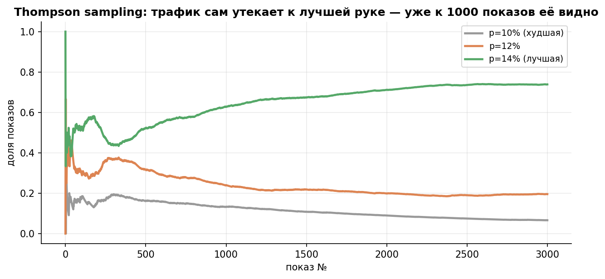
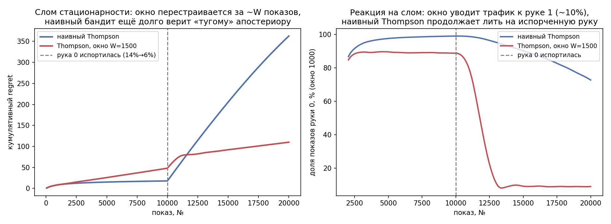
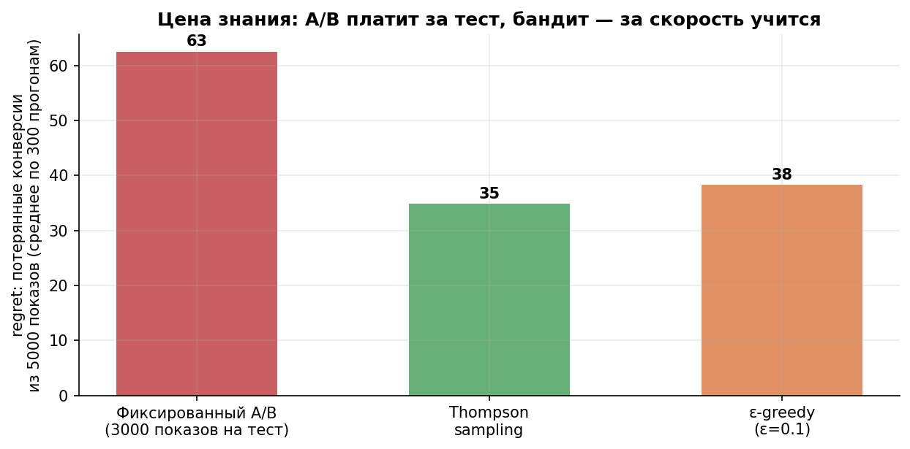

# Урок 5.4 — Бандиты: Thompson sampling вместо теста

**Цель урока:** сравнить эксперимент и адаптивное распределение трафика; проверить Thompson sampling при стационарности и дрейфе.

**Перед уроком:** [проверьте зависимости темы](../../../course/PREREQUISITES.md); обозначения — в [словаре](../../../course/GLOSSARY.md).

## Зачем это аналитику

У «ЕдаДома» промо-кампания: три креатива баннера «Завтраки за 199 ₽», конверсия в заказ у них 10% / 12% / 14% (правда неизвестна). Кампания живёт 10 000 показов — сутки. Классический путь — A/B-тест с равным сплитом: треть трафика каждому, в конце объявляем победителя. Посчитаем цену: оракул (сразу лить лучший) дал бы 1 400 конверсий; равный сплит даёт в среднем 0,12 × 10 000 = 1 200. **Двести конверсий — плата за «сначала все узнаем, потом решим»**. А если кампания короткая и после неё креатив выбрасывается — «потом» вообще не наступает: знание умерло вместе с кампанией, заплатили за него впустую.

Это конфликт **exploration vs exploitation**: «исследовать» (накапливать информацию) против «использовать» (брать лучшее из уже известного). A/B-тест — крайняя стратегия: сначала 100% exploration (жёсткое расписание показов), потом 100% exploitation. Бандит (multi-armed bandit — «многорукий бандит», по аналогии с казино: несколько автоматов-«рук» с неизвестными выплатами) делает это адаптивно: варианты, которые хорошо себя показывают, получают больше трафика сразу, плохие — голодают, но не умирают (вдруг мы ошиблись?). И лучший в классе алгоритм — Thompson sampling — это буквально апостериоры из уроков 5.1–5.3, поставленные на конвейер: байес из «инструмента отчёта» превращается в **алгоритм принятия решений в реальном времени**.

Основная цель рассматриваемых алгоритмов — оптимизация cumulative reward. Их простая реализация не включает корректный adaptive inference. Из данных бандита можно оценивать эффекты и строить интервалы специальными методами, но нельзя автоматически использовать обычный fixed-split t-test.

## Теория

### 1. Цена обучения: regret

Формализуем «сколько стоит учиться». Регрет (сожаление) после $T$ показов:

$$R(T) = \sum_{t=1}^{T} \left( p^* - p_{a_t} \right),$$

где $p^*$ — конверсия лучшей руки, $a_t$ — показанная на шаге $t$. Это «недополученные конверсии против оракула» — та самая разница 200 конверсий у фиксированного сплита из интро (в практике: регрет 600 конверсий на 30 тыс. показов, линейный рост). У хороших бандитов регрет растёт **логарифмически**: $R(T) \sim \sum_i \frac{p^* - p_i}{\mathrm{KL}(p_i, p^*)} \ln T$ — за каждую неоптимальную руку платим пропорционально «расстоянию» до лучшей и логарифму времени, то есть растущую как logT цену; средний regret на показ R(T)/T стремится к0. Наглядно: у A/B-теста наклон регрета постоянный (плохие руки получают трафик всегда), у бандита наклон спадает к нулю (трафик стекает к лучшей руке).

### 2. Три алгоритма: от тупого до байесовского

**epsilon-greedy** (Брюс, §3.11 — исторически первый в проде): с вероятностью $\varepsilon$ (обычно 0,1) показать случайную руку, иначе — руку с лучшим наблюдаемым средним. Плюс: три строки кода, все понимают. Минусы: исследует **слепо** — с равным усердием и безнадёжной рукой (10%), и почти-победителем (12%); exploitation тоже тупое: «жадная» рука фиксируется по зашумлённой оценке (на старте рука с 2/2 = 100% оккупирует показы). В практике регрет 123 конверсии на 30 тыс. — лучше A/B (600), хуже Thompson (57).

**UCB — оптимизм в лицо неопределённости** (upper confidence bound): показываем руку с максимальной оценкой **верхней доверительной границы**:

$$a_t = \arg\max_i \left( \hat p_i + \sqrt{\frac{2 \ln t}{n_i}} \right),$$

где $\hat p_i$ — наблюдаемое среднее, $n_i$ — сколько раз показали руку $i$. Идея: «оптимистичная» цена неопределённости — если рука мало показывалась, бонус $\sqrt{2\ln t / n_i}$ велик, и алгоритм даёт ей шанс; если бонус не оправдался — среднее падает и рука отсеивается. Никакой случайности: детерминированный «принцип наименьшего сожаления». В практике наивный UCB1 на бернуллиевских руках даёт 301 конверсию регрета — консервативнее эпсилон-жадного: формула писана для худших распределений, а не для конверсий (тюнингованные версии UCB-tuned/KL-UCB лучше; для урока важен принцип).

**Thompson sampling** — алгоритм выбора руки по апостериорному распределению (Russo et al., 2018): в каждый момент храним апостериор каждой руки (Beta(1+s, 1+f) — привет, урок 5.1), на каждом показе **сэмплируем** $\tilde\theta_i \sim \mathrm{Beta}(1+s_i,\ 1+f_i)$ и показываем руку с максимальным сэмплом:

$$a_t = \arg\max_i \tilde\theta_i, \qquad \tilde\theta_i \sim \text{апостериор}_i.$$

Ключевое свойство: вероятность показать руку $i$ равна **апостериорной вероятности, что она лучшая** (probability matching) — «рандомизируй пропорционально тому, кто может оказаться победителем». Рука-аутсайдер получает показы ровно с вероятностью «а вдруг всё-таки она»: по мере накопления данных эта вероятность сама идёт к нулю или единице — и exploration, и exploitation получаются из одного механизма, без параметров вроде ε. Правило естественно возникает из байеса: не нужно изобретать эвристику — сэмплируй из того, во что веришь, и делай, что говорит сэмпл. В практике: регрет 57 конверсий на 30 тыс. (в 10 раз меньше A/B), доля показов лучшей руки к концу 92%.

*Рис. 1. Thompson sampling: трафик сам утекает к лучшей руке — сэмплируем из апостериоров и показываем победителя сэмпла.*

### 3. Много рук, метрики кроме конверсии

Всё обобщается без боли: 10 креативов — Beta-апостериоров стало 10 (twitter-репо, гл. 6 — multiple variants); выручка вместо конверсии — гамма- или логнормальные апостериоры; контекст (какой баннер какому пользователю) — контекстные бандиты (Slivkins, гл. 8–10), это уже мостик в рекомендательные системы. Для урока достаточно помнить: Thompson = «апостериор + сэмпл + argmax», а из чего апостериор — вопрос модели.

### 4. Когда бандит вместо теста — и когда нет

**Бандит лучше, когда** (Slivkins, «бандиты с перезапусками»; практика продакшн-команд):

- **трафик короткоживущий**: промо-креатив, заголовок новости, пуш за вечер — пока A/B «созреет», кампания умрёт; знание никому не нужно после конца кампании, нужна была конверсия **вдоль** неё. Короткий горизонт — родной дом бандита;
- **каждый показ дорог**: медийная реклама с оплатой за показ, Limited inventory — 200 потерянных показов это прямые деньги;
- **вариантов много, а «вывод» не нужен**: перебор 20 заголовков — важно показать лучший, а не доказать значимость различия (не инференс, а оптимизация);
- **эффект наступает мгновенно**: конверсия в клик/заказ в пределах сессии. Бандит учится на короткой обратной связи.

**Бандит хуже, когда**:

- **Нужен вывод об эффекте с заданными гарантиями:** обычный t/z-анализ адаптивно собранных данных нельзя применять как к fixed split. Инференс возможен со специальными adaptive estimators, логированием propensities, условиями exploration и корректными интервалами (Hadad et al.,2021). Он сложнее, поэтому для базового продуктового курса fixed/sequential A/B часто удобнее.
- **эффект отложенный или меняется во времени**: эффект новизны (клики сначала есть, потом приедается), сезонность, learning effects (урок 4.3) — стационарность, на которой стоит бандит, сломана: он оптимизирует вчерашнюю метрику;
- **интерференция**: руки влияют друг на друга (общий склад, сеть ресторанов) — SUTVA ломается (урок 4.3), бандит без исправлений врёт;
- **решение необратимо/дорогое**: цена ошибки Unknown-эффекта на год вперёд — платите за строгий тест (экономика из 4.5), а не за скорость.

Эмпирическое правило: **горизонт жизни решения**. Минуты-часы-дни и одноразовый трафик — бандит; недели-месяцы-годы и раскатка на всех — тест. Промежуток (пуш-кампании на неделю?) — гибриды: бандит на первую волну, тест на фикс-группе для чистого вывода.

### 5. Нестационарность: бандит со скользящим окном

Что если лучший креатив «приедается» на середине (конверсия 14% → 6%)? Наивный Thompson хранит **всю** историю: апостериор после 10 тыс. показов — тугое Beta(1400+, 8600+), и тысячи показов плохой фазы будут долго перевешивать её вниз — в практике бандит продолжал лить 73% трафика на испорченную руку до конца горизонта, регрет второй половины 345 конверсий. Лечение — **забывать**: 

- **скользящее окно**: апостериор по последним $W$ показам **всей политики**, сохраняя отдельные счётчики рук внутри этого глобального окна (в практике $W = 1500$: доля испорченной руки упала до 9%, регрет второй половины — 62 конверсии, примерно в 5,6 раза меньше);
- **дисконтирование**: старые наблюдения умножаются на $\gamma^{\text{возраст}}$ — то же забывание, но плавное.

Компромисс: чем меньше окно/сильнее дисконт — тем быстрее реакция, но тем выше дисперсия на стационарных участках (бандит снова начинает «шуметь» между близкими руками). Параметр $W$ подбирается под скорость дрейфа метрики — грубая оценка: окно должно накапливать статистику быстрее, чем меняется мир.

*Рис. 2. Мир меняется — бандит должен забывать: скользящее окно против наивного Thompson (из практики).*

**Бандиты ≠ тест** — зафиксируем таблицей:

| | A/B-тест | Бандит (Thompson) |
|---|---|---|
| Вопрос | «B лучше A и на сколько?» | «какой вариант показывать следующему?» |
| Результат | эффект ± CI, p-value, вердикт | политика раздачи трафика, regret |
| Трафик в тесте | жёсткий сплит до конца | адаптивно стекает к лидеру |
| Гарантии | α, мощность (М3) | средний regret (слабее, зато anytime) |
| Стейкхолдерам | «+0,8 п.п., значимо» | «собрали на 15% больше конверсий» |
| Живёт после | раскатка победителя | не нужен: уже раздавал |

*Рис. 3. Цена знания против цены решения: A/B платит regret за тест, Thompson — учится на ходу.*

## Разбор на данных

Из практики [practice_5_4.py](practice/practice_5_4.py) (seed 54; руки 10% / 12% / 14%, 500 прогонов).

**Регрет.** На 30 тыс. показов: fixed A/B — **600** конверсий (линейно: треть трафика всегда у худшей руки); epsilon-greedy — 123; UCB1 — 301; Thompson — **57** (в 10,5 раза меньше A/B). На коротком горизонте 10 тыс.: 200 / 67 / 133 / 43 — расклад тот же, масштаб меньше. Доля показов лучшей руки к концу: 33% (A/B — так и не узнали толком), 84% (ε-greedy), 63% (UCB1 — жадно исследовал), 92% (Thompson).

**Промо-кампания (10 тыс. показов, оракул 1 400 конверсий).** Fixed A/B собирает 1 200 — теряет **200 конверсий** (14% кампании сгорело в «learning»), epsilon-greedy 1 333 (−67), UCB1 1 267 (−133), Thompson 1 357 (**−43**, 3% кампании). Бонус-урок про финал: у A/B ещё и 0,8% шанс объявить победителем не того (шум перевернул 12% и 14% на равных сплитах) — бандиту «победитель» не нужен, он уже раздавал трафик правильно.

**Нестационарность** (рука 14% портится до 6% на показе 10 000 из 20 000, альтернатива стабильные 10%): наивный Thompson — регрет второй половины **345** конверсий, на последних 2 тыс. показов всё ещё 73% трафика испорченной руке (апостериор из всей истории тугой, «помнит славное прошлое»); Thompson со скользящим окном W=1500 — регрет второй половины **62** конверсии, доля испорченной руки 9% (перестроился примерно за W показов). Цена окна: на стационарном участке такой бандит чуть шумнее (чаще трогает вторую руку).

## Подводные камни

1. **Бандит вместо теста «на всякий случай».** Делают: вешают Thompson на тест нового экрана оплаты на месяц. Грозит: без специально спроектированного adaptive analysis в конце нет обоснованных CI и guardrail-решений — объяснить совету директоров нечего; адаптивный сплит ещё и смещает оценки (данные зависят от политики). Правильно: бандит — для оптимизации короткоживущего трафика; для решений и отчётов — A/B-тест (М3–М4).
2. **Оценивать «эффект победителя» по данным бандита как по данным теста.** Грозит: выборка нерепрезентативна (лучшую руку показывали больше, когда она «горела»), оценка смещена — тот же winner's curse, что в 4.5. Правильно: если эффект всё же нужен — параллельный чистый A/B-слой или хотя бы явная модель отбора.
3. **Наивный Thompson на дрейфующую метрику.** Грозит: 345 конверсий регрета во второй половине вместо 62 — бандит «помнит» устаревший мир (в практике 73% трафика испорченной руке). Правильно: скользящее окно/дисконтирование с периодом короче скорости дрейфа; для сезонности — контекст (день недели/время) в модели.
4. **epsilon-greedy с фикс-ε навсегда.** Грозит: 10% трафика вечно уходит заведомым аутсайдерам (в практике −67 конверсий из 10 тыс. почти всё — принудительное исследование). Правильно: затухающий ε или Thompson, где «исследование» само затухает с уверенностью.
5. **Игнорировать отложенную метрику.** Делают: бандит на конверсию в заказ в течение часа, а решение влияет на выручку недели (возвраты, отписки от пушей). Грозит: оптимизировали прокси, убили метрику. Правильно: бандит только на метрики с короткой обратной связью; длинные эффекты — тестом (прокси-метрики из 4.4 — та же дилемма).
6. **Забывать про интерференцию и «общий пирог».** Грозит: руки бандита делят один инвентарь/склад/ленту — показ креатива A cannibalizes креатив B, «лучшая рука» — артефакт. Правильно: как и в 4.3 — switchback/гео-дизайны или честный тест без одновременного показа конкурирующих рук одним юнитам.
7. **Сравнивать бандит и тест «по конверсии за неделю» без regret-мышления.** Грозит: на коротком отрезке шум скроет разницу, «бандит не лучше» — вывод из шума. Правильно: сравнивать regret на 500+ прогонах симуляции (как в практике) — это дешевле и честнее, чем живой эксперимент над экспериментами.

## Практика

Файл: [practice_5_4.py](practice/practice_5_4.py) (percent-формат, numpy, seed, Agg, без scipy — бандит это цикл). Что делает:

1. **Четыре политики на трёх руках** (10/12/14%), 30 тыс. показов, 500 прогонов: fixed A/B (сплит 1/3), epsilon-greedy (ε=0,1), UCB1, Thompson sampling — кривые кумулятивного регрета и доля показов лучшей руки по времени.
2. **Эпизод «промо-кампания»**: 10 тыс. показов — потерянные конверсии каждой политики против оракула (A/B −200, Thompson −43) плюс риск «не того победителя» у A/B.
3. **Нестационарность**: лучшая рука портится на середине (14% → 6%) — наивный Thompson против скользящего окна W=1500: регрет второй половины (345 против 62) и доля показов испорченной руки (73% против 9%).

Графики: [practice_5_4_regret.png](images/practice_5_4_regret.png) (регрет линейный против логарифмического + переливание трафика), [practice_5_4_promo.png](images/practice_5_4_promo.png) (потерянные конверсии кампании), [practice_5_4_nonstationary.png](images/practice_5_4_nonstationary.png) (реакция на слом: наивный vs окно).

## Домашнее задание

1. Промо: три креатива с конверсией 10/12/14%, 9 000 показов, равный сплит 1/3 и раскат победителя в конце. Посчитайте ожидаемый регрет кампании. Что изменится, если после кампании креатив-победитель будет жить ещё месяц (30 тыс. показов)?

Ответ

Регрет фазы теста: (0,14 − 0,12)·9 000 = 180 конверсий (треть трафика у худшей и треть у средней: 3000·0,04 + 3000·0,02). Если победитель дальше живёт месяц — знание окупается: тест «купил» 30 тыс. показов по 14% вместо 12% (+600 конверсий), минус 180 потраченных — чистый плюс. Если креатив одноразовый (умер с кампанией) — 180 потеряны навсегда, брать бандита. Это и есть критерий выбора: длина жизни решения против длины обучения.

2. Почему epsilon-greedy с ε=0,1 никогда не «доезжает» до 100% показов лучшей руки, а Thompson — да? Объясните через механику обоих алгоритмов.

Ответ

При 3 руках ε-greedy с постоянным ε=.1 асимптотически даёт лучшей руке 1−ε+ε/3=.9333 трафика, поскольку random exploration тоже иногда выбирает лидера. В конечном прогоне доля может быть меньше. У stationary Thompson доля показов неоптимальных рук стремится к 0 при стандартных условиях, но это не означает нулевой cumulative regret.

3. Рука с конверсией 14% показывалась 5 000 раз (700 конверсий), альтернатива — 10% с 5 000 показов (500). Наивный Thompson продолжает иногда показывать вторую руку. Оцените грубо, с какой вероятностью она выиграет сэмпл — и почему это не «потерянные показы», пока вероятность не ноль?

Ответ

Нормальное приближение даёт вероятность победы слабой руки околоΦ(−6), практически ноль. Это корректно лишь в стационарной модели. Один показ на миллиард не является практической защитой от дрейфа: для него нужны forgetting, forced exploration или специальные change-detection/contextual algorithms.

4. Метрика кампании дрейфует: вечерний трафик кликается вдвое хуже утреннего. Чем это грозит наивному Thompson с тремя креативами и что сделать?

Ответ

Днём набранный апостериор «вечером» врёт: рука, выигравшая утро, получает вечерний трафик по устаревшей репутации, а честно сравнивать руки внутри одного времени нельзя — показы рук перемешаны во времени (сравнение «вечерней» руки с «утренней» — конфаундер времени). Решения: (1) контекстный бандит — отдельные апостериоры на утро/вечер (или время как ковариата); (2) скользящее окно короче суточного цикла; (3) если бандит кажется хрупким — обычный A/B с полными неделями (урок 3.1: сезонность лечится длительностью).

5. Команда предлагает заменить ВСЕ продуктовые A/B-тесты «ЕдаДома» на Thompson sampling: «он же быстрее и умнее». Приведите три аргумента против.

Ответ

(1) Нет вывода: простая реализация бандита не включает adaptive inference для эффекта/CI/p-value — а продуктовые решения требуют заранее спроектированного анализа, guardrails, сегментов, оценки для CFO (winner's curse-коррекции из 4.5); «собрали больше» не отвечает «на сколько и с какой гарантией». (2) Нет частотных гарантий на ошибку: бандит оптимизирует regret, а не α; для дорогих необратимых решений это неприемлемо (экономика теста из 4.5). (3) Долгие эффекты и интерференция: novelty/learning (4.3), отложенная выручка, канибализация — стационарность и мгновенная обратная связь, на которых стоит бандит, в продукте не выполняются. Итог: бандит — для короткого одноразового трафика (промо, заголовки, пушы), тест — для решений о продукте.

## Шпаргалка

1. Exploration vs exploitation: тест — сначала всё исследование, потом всё использование; бандит — адаптивно. Regret = Σ(лучшее − показанное) — цена обучения, измеряется в конверсиях/деньгах.
2. Fixed A/B: регрет растёт линейно (600 конверсий на 30 тыс. в практике), треть трафика вечно у худшей руки. Stationary Thompson/UCB: логарифмически при стандартных условиях; ε-greedy с постоянным ε имеет линейную exploration составляющую (Thompson — 57).
3. epsilon-greedy: просто, но исследует слепо и вечно (−67 из 10 тыс.); UCB: оптимизм в лицо неопределённости — детерминированный бонус за мало показанную руку; Thompson: сэмпл из апостериора + argmax.
4. Thompson sampling = probability matching: вероятность показать руку = апостериорная P(она лучшая); exploration затухает сам с ростом уверенности; правило естественно возникает из байеса — параметров вроде ε нет.
5. Бандит вместо теста: короткие кампании, дорогие показы, много вариантов, мгновенная метрика, вывод не нужен. Заголовок, живущий часы, — идеальный кейс.
6. Бандит НЕ вместо теста: нужен эффект ± CI для отчёта; дорогие/необратимые решения; отложенные метрики; novelty/сезонность (стационарность сломана); интерференция. Оценки «эффекта» из данных бандита смещены.
7. Нестационарность: наивный Thompson помнит всё (регрет 2-й половины 345 в практике); скользящее окно W=1500 перестраивается за ~W показов (62 конверсии; доля испорченной руки 9% против 73%); альтернатива — дисконтирование; окно короче скорости дрейфа.
8. Горизонт жизни решения — главный критерий: минуты-часы и одноразовый трафик → бандит; недели-годы и раскатка → тест; середина → гибрид (бандит на волну, тест на фикс-группе).
9. Бандиты ≠ тест: оптимизация против инференса; «собрали на 15% больше» против «+0,8 п.п., 95% ДИ»; regret-гарантии слабее и «anytime», зато без итогового вердикта.
10. Проверять бандиты симуляцией (500+ прогонов, regret-кривые) — живой A/B над методами дороже и шумнее; это продолжение симуляционной культуры курса.

## Источники

- Брюс П., Брюс А., Гедек П. «Практическая статистика для Data Science», §3.11 «Алгоритм многорукого бандита»: epsilon-greedy, оптимистическая инициализация — единственный раздел про бандитов в книгах курса, отправная точка урока — `materials/local/books-folder.md`.
- Russo D., Van Roy B., Kazerouni A., Osband I., Wen Z. «A Tutorial on Thompson Sampling» (FnTML 2018; arXiv 1707.02038): канонический туториал; Bernoulli-бандит с кодом, probability matching, сравнение с UCB/байесовскими альтернативами — `materials/web/research-gaps.md` §Задача 2.
- Lattimore T., Szepesvári C. «Bandit Algorithms» (CUP 2020): бесплатный полный PDF от автора (tor-lattimore.com); regret-анализ, UCB, Thompson sampling (гл. 35–36), Bayesian-бандиты — справочник и задачи.
- Slivkins A. «Introduction to Multi-Armed Bandits» (FnTML 2019; arXiv 1904.07272): обзор поля — explore/exploit, ε-greedy/UCB/TS, контекстные бандиты, бандиты «с перезапусками» и практические аспекты в проде.
- Twitter Open Source, `github.com/twitter/bayesian-ab-testing`, гл. 6 (multiple variants): мост от байесовского A/B (урок 5.3) к многорукому выбору.
- Уроки-соседи: 5.1 (Beta-апостериоры — топливо Thompson), 5.3 (expected loss — regret его родственник: оба про цену решения в деньгах); 3.7 (fixed-horizon против sequential — частотная параллель конфликта «учить или решать»); 4.3 (novelty/интерференция), 4.5 (экономика теста, winner's curse — почему из бандита не достать эффект обычным fixed-split анализом).
