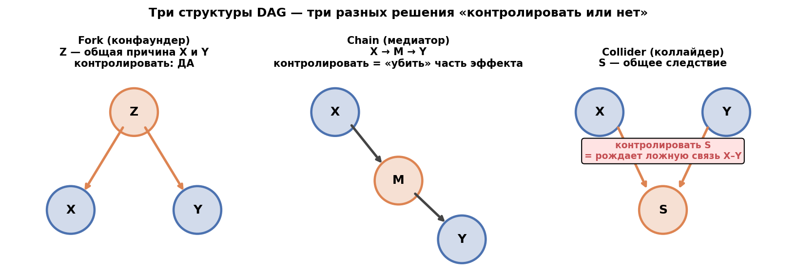
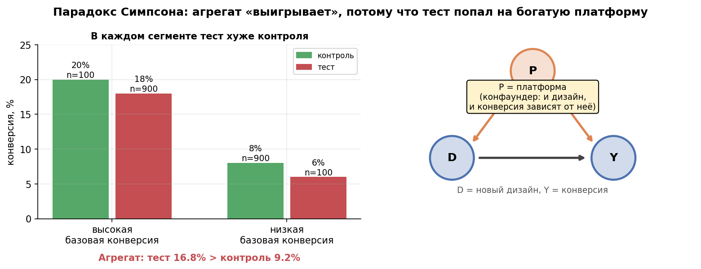

# Урок 6.1 — Корреляция ≠ причинность: конфаундеры, коллайдеры, DAG

**Цель урока:** задать причинный вопрос и DAG; отличать конфаундер, медиатор и коллайдер при выборе корректировки.

**Перед уроком:** [проверьте зависимости темы](../../../course/PREREQUISITES.md); обозначения — в [словаре](../../../course/GLOSSARY.md).

## Зачем это аналитику

Пять модулей вы жили в комфортном мире: гипотеза → рандомизированный А/Б → статистика (частотная или байесовская — М5). Всё это время главный трюк — рандомизация — оставался за кадром: вы проверяли, что тест чистый (М4), но не спрашивали, чем его заменить, когда его нет.

А наблюдательных сравнений в «ЕдаДома» — каждый день:

- рестораны, подключившиеся к промо-программе, показывают выручку на 18% выше неподключившихся — «промо работает»?
- курьеры с высоким рейтингом опаздывают реже — «рейтинг мотивирует»?
- юзеры, увидевшие новую выдачу, заказывают чаще — «выдача лучше»?

Каждое из этих утверждений пытается объяснить наблюдаемую разницу причинным эффектом. Цена ошибки — раскатка вредной фичи или бюджет на бесполезное промо. Если рандомизация доступна и отвечает на нужный вопрос, она даёт контролируемый механизм назначения. Каузальный вывод включает и эксперименты, и наблюдательные дизайны; для выбора нужны язык допущений и ясный estimand.

Классика на разогрев (лекция «Как поймать эффект», сл. 14): продажи мороженого коррелируют с утоплениями. Никто не топится от эскимо — за обеими переменными стоит жаркая погода. Замените «мороженое» на «промо», «утопления» на «выручку», «погоду» на «размер сети ресторана» — получите первый пункт сегодняшнего урока. Как формулирует Алекс Денг (гл. 1): стандартная статистика фиксирует лишь **ассоциацию**; каузальный эффект определяется только через **вмешательство** — «что станет с Y, если мы принудительно поменяем X».

## Теория

### 1. Увидел корреляцию — перебери объяснения

Любая наблюдаемая связь X ~ Y — это ровно один из вариантов ниже (или их смесь):

| # | Структура | Диаграмма | Продуктовый пример |
|---|---|---|---|
| 1 | Причинность в интересующую сторону | X → Y | новая выдача → конверсия |
| 2 | Обратная причинность | X ← Y | «подписчики довольнее» — может, довольные и подписываются |
| 3 | Общая причина (**конфаундер**) | X ← Z → Y | промо ← размер сети → выручка |
| 4 | Отбор по общему следствию (**коллайдер**) | X → S ← Y | анализ только тех, кто написал в поддержку |
| 5 | Совпадение | — | 20 метрик под H0 дают ~1 «значимую» (урок 2.4) |

Статистика сама не выбирает между этими вариантами: корреляция, t-статистика и даже байесовский фактор из М5 говорят только «связь в данных есть». Выбор между 1–4 — это **предметное знание, записанное явно**, и для его записи нужен формализм.

Ключевое различение (Денг, гл. 1; Пёрл): наблюдение против вмешательства.

$$\underbrace{P(Y \mid X)}_{\text{наблюдение: «увидел X — какой Y?»}} \quad\neq\quad \underbrace{P(Y \mid do(X))}_{\text{вмешательство: «сделал X — какой Y?»}}$$

Пример с зонтиком и лужами: $P(\text{лужи}\mid\text{взял зонтик})$ велика, поскольку зонтик берут в дождь. Если зонт не влияет на дождь и лужи, то $P(\text{лужи}\mid do(\text{зонт}=1))=P(\text{лужи}\mid do(\text{зонт}=0))=P(\text{лужи})$. Нулевой причинный эффект зонта не означает нулевую вероятность луж: погода продолжает действовать.

### 2. Язык DAG и три базовые структуры

**DAG** (направленный ациклический граф): узлы — переменные, стрелки — прямые причинные влияния, «ациклический» — следствие не может быть собственной причиной. DAG — это не вывод из данных, а **список предположений**: вы записываете то, что домен уже знает, до того как открыли датафрейм.

Всё богатство DAG-ов собирается из трёх структур (Ci2Lab, CH-3). Проводим каждую по «ЕдаДома»:

**Fork (вилка) — конфаундер: X ← Z → Y.**
Погода → заказы, погода → время доставки. В дождь и заказов больше (никто не выходит из дома), и доставка дольше (пробки, курьеры мокнут). Маргинальная связь «заказы ~ время доставки» есть, хотя прямого влияния нет — общая причина её создала. Это и есть **backdoor-путь** (путь от X к Y, начинающийся стрелкой *в* X). Лечение: обусловиться на Z — закрывает путь. **Контролировать: ДА.**

**Chain (цепь) — медиатор: X → M → Y.**
Промо → заказы → выручка. Обусловливание на заказах закрывает этот причинный путь, поэтому для общего эффекта промо его сохранять нельзя. Оценка прямого эффекта потребует отдельного определения и допущений о mediator–outcome confounding; простой контроль медиатора её не гарантирует. **Не контролируем M, если нужен total effect в этой схеме.**

**Collider (коллайдер) — общее следствие: X → S ← Y.**
«Проблемы с заказом» → обращение в поддержку ← «вовлечённость». До того как вы посмотрели на обращения, X и Y независимы. Но если анализировать только тех, кто обратился (обусловиться на S), — связь рождается из ничего. **Контролировать: НЕТ** — и наоборот, контроль открывает ложный путь.


*Рис. 1. Три локальные структуры DAG: вилка, цепь и коллайдер.*

В одну строку: **обусловливание разрывает связь в цепи и вилке — и создаёт её в коллайдере**. Это единственная грамматика, которую надо запомнить; всё остальное в DAG-анализе — её применения.

### 3. d-разделение интуицией

Формальное название этой грамматики — **d-разделение** (Deng, гл. 5; Ci2Lab, CH-3). Интуитивная версия, достаточная для работы:

> Путь между X и Y **открыт**, если каждый промежуточный узел его пропускает: обычный узел (цепь/вилка) пропускает зависимость, *пока не обусловлен*; коллайдер — блокирует, *пока не обусловлен* (обусловливание на потомка коллайдера тоже его открывает). X и Y **d-разделены** на множестве S, если S блокирует все пути между ними — тогда в данных ожидаем независимость.

D-разделение задаёт ограничения условной независимости в распределении при Markov assumption. Данные могут дать свидетельства против этих ограничений, но конечная выборка не обязана иметь ровно нулевую корреляцию. Обратный вывод от независимости к d-разделению требует дополнительного условия faithfulness; по одним корреляциям причинный граф не определяется.

Практическое следствие: больше регрессоров не обязательно лучше. Переменная может закрыть confounding-путь, открыть путь через collider, перекрыть механизм эффекта или повысить точность без изменения идентификации. Рассмотрим мини-DAG «ЕдаДома» из практики:

```
weather → orders        income → promo
weather → delivery_time income → revenue
promo → orders          orders → revenue
                        delivery_time → revenue
```

В данном DAG promo и weather d-разделены без контролей. Контроль orders открывает путь `promo → orders ← weather → delivery_time → revenue` и одновременно закрывает часть общего эффекта через заказы. Для total effect промо достаточно корректировать по income; orders для этой задачи — плохой контроль.

Достаточный **backdoor-критерий**: множество Z не содержит потомков X и блокирует все пути между X и Y, начинающиеся стрелкой в X. При consistency, подходящем overlap и корректном DAG adjustment по Z идентифицирует общий эффект. Это графовое условие, а не правило «включить все колонки». Коллайдер — роль узла на конкретном пути: универсальный запрет на переменную вне полного графа неверен.

### 4. Парадокс Симпсона: когда агрегат врёт знаком

Симпсон — самая громкая демонстрация конфаундера: **внутри каждого сегмента эффект один, в агрегате — противоположный**. Считаем руками (числа круглые). «Умную выдачу» раскатывали наблюдательно: в столицах (высокая конверсия) она у 90% юзеров, в регионах — у 10%. Внутри обоих сегментов истинный эффект −2 п.п.:

| сегмент | новая выдача (T) | старая (C) | эффект внутри |
|---|---|---|---|
| столица | 162/900 = **18,0%** | 20/100 = 20,0% | −2,0 п.п. |
| регионы | 6/100 = **6,0%** | 72/900 = 8,0% | −2,0 п.п. |
| **агрегат** | 168/1000 = **16,8%** | 92/1000 = 9,2% | **+7,6 п.п.** |

Агрегат «выигрывает» +7,6 п.п. только потому, что лечение скоррелирован с сегментом, а сегмент задаёт уровень. Правильная (стратифицированная) оценка — взвесить сегментные эффекты весами популяции: $0{,}5 \cdot (-2{,}0) + 0{,}5 \cdot (-2{,}0) = -2{,}0$ п.п. — это первая встреча с приёмом, который в 6.4 вырастет в стратификацию и обратные вероятностные веса.

Классика из Денга (гл. 2): лечение камней в почках — терапия А лучше терапии B и при мелких, и при крупных камнях, но в агрегате B «лучше», потому что А давали сложным пациентам. Продуктовый перевод: «продвинутым юзерам раньше раскатывали фичу» ≠ «фича лучше».

Таблица сама не определяет, какой ответ каузален. В нашем DAG сегмент — конфаундер, и стратификация с весами целевой популяции закрывает этот backdoor-путь. Если сегмент — медиатор, корректировка меняет вопрос и может вносить смещение. В сложном графе ни агрегат, ни стратифицированная оценка не обязаны быть правильными без проверки остальных путей и допущений.


*Рис. 2. Парадокс Симпсона: разные доли сегментов меняют знак агрегированной разности.*

### 5. Парадокс Берксона: корреляция, рождённая отбором

Обратная сторона Симпсона: не «забыли сегмент», а **сам отбор в датасет создал связь**. Парадокс Берксона (классика: среди госпитализированных две болезни связаны отрицательно, хотя в популяции независимы; Ci2Lab разбирает на COVID и переломах): чтобы попасть в выборку, нужна «достаточно большая сумма причин» — и внутри такой выборки причины начинают заменять друг друга.

Продуктовая версия — та самая поддержка: в датасет обращений попадает юзер, если `проблемы + вовлечённость + шум > порога`. Среди написавших возникает устойчивая отрицательная связь: у кого мало проблем — те фанаты, кто не фанат — те с проблемами. В практике ниже это ровно воспроизводится: на всех юзерах corr = −0,003 (p = 0,61), среди обратившихся corr = −0,394. Ни одна A/B-платформа так не умеет — этот биас делает сам аналитик фильтром по данных.

**Ошибки отбора и посттритмент-корректировки** — разные механизмы, которые надо различать:

1. **Фильтрация выборки по следствию**: «оценим эффект выдачи на тех, кто открыл каталог» (открытие — следствие и выдачи, и интереса юзера);
2. **Контроль пост-тритмент переменной в регрессии**: «эффект промо на выручку с контролем числа заказов» (заказы — медиатор, см. структуру 2);
3. **Селекция по отклику**: «опросим тех, кто ответил на push» (ответ — коллайдер интереса и раздражительности).

Для каждой корректировки или фильтра нужно проверить полный DAG. Обусловливание на общем следствии может открыть путь; обусловливание на потомке коллайдера также его открывает. Медиатор может одновременно быть коллайдером на другом пути. Само время измерения «до лечения» ещё не делает переменную допустимым контролем.

### 6. DAG как рабочий инструмент; causal salad

Рабочий порядок (в дизайн-доке до анализа, как гипотеза X→Y→Z в уроке 4.1):

1. Зафиксировать лечение X, исход Y и горизонт (сколько держим эффект).
2. Выписать **все известные причины Y** — не «какие колонки есть», а что домен знает: сезонность, размер сети, платформа, гео, ценовая политика.
3. Соединить в DAG, пометить наблюдаемое/ненаблюдаемое.
4. Найти backdoor-пути; выбрать **минимальное** множество контролей, закрывающее их (проверить, что не открыли коллайдеры).
5. Только теперь открывать данные и считать.

Антипод — **causal salad**: включить все ковариаты без модели причинных связей. Это может открыть collider-пути или перекрыть часть эффекта. При этом смена знака сама по себе не доказывает ошибку: в примере Симпсона правильная корректировка именно меняет знак. Проверяем, соответствует ли изменение оценки предполагаемому механизму смещения, и сравниваем обоснованные спецификации.

DAG и потенциальные исходы — два языка причинного анализа. Matching, DiD, RDD и IV используют разные идентифицирующие допущения; не все сводятся к закрытию backdoor-путей наблюдаемыми контролями. Следующие уроки разберут, какой контрфакт строит каждый дизайн.

## Разбор на данных

Полный прогон — [practice_6_1.py](practice/practice_6_1.py) (описание в разделе «Практика»); здесь — итоговые числа реального запуска и как их читать.

**Блок 1, Симпсон на 200 000 юзеров.** Раскатка наблюдательная: iOS-команда получила «умную выдачу» раньше — 90% iOS против 30% Android, а базовая конверсия iOS 12% против 6% Android. Истинный эффект задан −0,5 п.п. в обеих платформах. Результат запуска:

| | новая выдача | старая | эффект внутри |
|---|---|---|---|
| iOS (n≈80 тыс.) | 11,47% | 12,44% | −1,0 п.п. |
| Android (n≈120 тыс.) | 5,79% | 5,96% | −0,2 п.п. |
| **агрегат** | — | — | **+3,1 п.п.** |

Агрегат врёт и знаком, и величиной (+3,1 против истинных −0,5). Диагностика конфаундера без знания истины: доля iOS среди получивших выдачу 67% против 9% среди не получивших — состав групп различается, значит «эффект» и «сегмент» переплетены. Стратифицированная поправка (взвешивание сегментных разностей долями платформ) даёт **−0,49 п.п. против истинных −0,50** — смещение снято одной строкой, потому что DAG был правильным.

**Блок 2, коллайдер.** 30 000 юзеров, две независимые причины обращения (проблемы X, вовлечённость Z). На всех: corr = −0,003 (p = 0,61 — честный ноль). В датасете обратившихся (50% выборки): corr = **−0,394** (p < 1e-300), наклон регрессии Z~X меняется с −0,003 до −0,396. Корреляция из ничего — буквально.

**Блок 3, d-разделение.** Мини-DAG из шести переменных выше; утилита перечисляет пути и печатает статус каждого. Ключевые ответы запуска: promo и weather d-разделены (пустое множество контролей) и перестают быть разделёнными при контроле orders — коллайдер открылся; для promo → revenue контроль income закрывает backdoor (доход → промо / доход → выручка), а контроль orders открывает паразитный путь через погоду и доставку. «Регрессия на всё подряд» из подводных камней — вот она, в одном графе.

## Подводные камни

1. **Вывод по агрегату без проверки сегментов (Симпсон).** Делают: «новая выдача +3 п.п. в агрегате — раскатываем». Грозит: раскатка фичи, вредящей обоим сегментам. Правильно: перед любым наблюдательным сравнением — таблица по ключевым сегментам (платформа, гео, размер сети); сильная неоднородность состава групп = стоп-сигнал (вы уже видели это в М4.3/4.4 в контексте сегментного анализа А/Б).
2. **Фильтрация данных по следствию (коллайдер/Берксон).** Делают: «проанализируем только купивших / только активных / только ответивших». Грозит: ложные связи и оценки с несуществующим смещением (corr −0,39 из воздуха в практике). Правильно: спрашивать про каждую фильтрацию «от чего ещё зависит попадание в выборку»; выборку отбора описывать в отчёте как дизайн-решение.
3. **Контроль пост-тритмент переменных и медиаторов.** Делают: регрессия выручки на промо с контролем заказов. Грозит: потеря total effect и возможное новое смещение; direct effect без дополнительных допущений не идентифицирован. Правильно: до регрессии помечать в DAG, что лежит до лечения, что после; медиаторы — для анализа механизма (6.5), не для контролей.
4. **Causal salad.** Делают: «добавим 30 ковариат для надёжности». Грозит: открытие коллайдеров, смена знака от набора регрессоров, коэффициент без интерпретации. Правильно: минимальное множество контролей, закрывающее backdoor-пути по DAG; «больше» — не «безопаснее», а «иначе смещённо».
5. **Обратная причинность и выжившие.** Делают: «подписчики довольнее — подписка повышает удовлетворённость». Грозит: перепутанные стрелки; analysis выживших (ушли недовольные — средняя «выросла»). Правильно: для каждой стрелки спрашивать «могло ли быть наоборот?» и проверять направление там, где это возможно (по времени, по механике).
6. **Думать, что данные проверят DAG.** Делают: «по корреляциям восстановим causal-граф». Грозит: марковская эквивалентность — наблюдаемые распределения не различают X→Y и Y→X; алгоритмы causal discovery (Ci2Lab, CH-5) дают класс графов, а не истину. Правильно: DAG — это явно зафиксированные предметные допущения; данные могут его опровергнуть (нарушение d-разделения), но не построить с нуля.
7. **«Корреляция — значит, ничего не делать».** Делают: раз корреляция ничего не доказывает, выводов не делаем вовсе. Грозит: паралич анализа; выброшенные сигналы. Правильно: наблюдательная связь + правдоподобный DAG = гипотеза; её проверяют экспериментом (если возможен — М4) или квазиэкспериментом (6.3). Рефрен всей серии «CI на пальцах»: «есть ли что-то ещё?» — вопрос, а не приговор.

## Практика

Файл [practice_6_1.py](practice/practice_6_1.py) (numpy/pandas/scipy/matplotlib, seed зафиксирован, графики сохраняются в `images/` этого модуля). Три блока:

1. **Парадокс Симпсона на 200 000 юзеров**: наблюдательная раскатка выдачи (iOS раньше), конфаундер-платформа, истинный эффект −0,5 п.п. Считаем таблицу по сегментам, агрегат, стратифицированную поправку; график по сегментам ([practice_6_1_simpson.png](images/practice_6_1_simpson.png)).
2. **Коллайдер-симуляция**: две независимые причины + отбор в датасет обращений по их сумме; corr до/после отбора, регрессионный наклон, scatter «все vs отобранные» ([practice_6_1_collider.png](images/practice_6_1_collider.png)).
3. **Мини-DAG-утилита текстом** (без graphviz): список рёбер → рисование текстом, перечисление путей, проверка блокировки каждого (цепь/вилка закрываются обусловливанием, коллайдер открывается), d-разделение пар на DAG «ЕдаДома» + автотест на трёх базовых структурах.

Что должны увидеть (числа реального запуска):

- Симпсон: внутри iOS −1,0 п.п., внутри Android −0,2 п.п., **агрегат +3,1 п.п.** (врёт знаком), стратифицированная оценка **−0,49 п.п.** при истинных −0,50; доля iOS 67% vs 9% — маркер переплетения лечения с сегментом;
- коллайдер: corr = −0,003 (p = 0,61) на всех → **−0,394** среди попавших в датасет (50% юзеров); наклон регрессии −0,003 → −0,396;
- d-разделение: контроль orders открывает коллайдер promo → orders ← weather; для эффекта promo на revenue контроль income закрывает backdoor, контроль orders — открывает паразитный путь; автотест цепь/вилка/коллайдер зелёный.

## Домашнее задание

**Задача 1.** Классификация связей. Каждое утверждение отнесите к одному из пяти классов таблицы из п. 1 и нарисуйте мини-DAG: (а) «рестораны с промо имеют выручку выше на 18%»; (б) «юзеры, оставляющие отзывы, чаще возвращаются»; (в) «в городах, где мы запустили рекламу, конверсия выше»; (г) «продавцы с высоким рейтингом продают больше».

<details><summary>Ответ</summary>

(а) класс 3 — конфаундер «размер сети»: крупные сети и промо берут, и выручку делают; (б) возможен класс 3: `отзывы ← вовлечённость → возврат` — вовлечённость здесь конфаундер, потому что оба наблюдаемых признака являются её следствиями. Возможны и другие DAG; фраза сама по себе не выбирает между ними; (в) класс 3 — рекламу запускают в растущих городах (менеджеры выбирают перспективу) — backdoor через потенциал рынка; (г) класс 2 или 3 — обратная причинность (кто много продаёт, тем и рейтинг легче набрать) плюс конфаундер «качество кухни». Ключ: ни одно утверждение не является классом 1 само по себе — это всегда надо аргументировать.
</details>

**Задача 2.** Симпсон руками. По таблице из п. 4 переставьте одну вещь: пусть в столицах выдача у 10% юзеров, в регионах — у 90% (лечение теперь чаще у бедного сегмента), эффекты внутри сегментов те же −2 п.п. Посчитайте агрегатную разность и объясните, почему знак теперь совпал со стратифицированным.

<details><summary>Ответ</summary>

Считаем группы: агрегат T = (100·0,18 + 900·0,06)/1000 = (18 + 54)/1000 = 7,2%; агрегат C = (900·0,20 + 100·0,08)/1000 = (180 + 8)/1000 = 18,8%. Агрегатная разность = −11,6 п.п. Знак теперь совпал со стратифицированной (−2 п.п.), потому что смещение состава тянет в ту же сторону, что и эффект. Но величина завышена почти в шесть раз: смещение не «исчезло», а перестало бороться с эффектом. Мораль: «врёт знаком» — лишь частный случай Симпсона; при переплетении лечения с сегментом агрегат **всегда** врёт величиной, а знак зависит от того, куда смотрит смещение.
</details>

**Задача 3.** Коллайдер в HR. Кадровая аналитика «ЕдаДома» смотрит только уволившихся курьеров и видит: чем выше был рейтинг, тем ниже заработок за последний месяц. HR предлагает «рейтинг демотивирует». Нарисуйте DAG, объясните связь отбором и скажите, что проверить на полных данных.

<details><summary>Ответ</summary>

Увольнение — коллайдер: и низкий заработок, и низкий рейтинг увеличивают шанс уволиться (уходят либо обделённые оплатой, либо «отстающие» по рейтингу — выборка уволившихся = «сумма причин > порога»). Внутри неё те, у кого рейтинг высок, — это те, кто ушёл из-за денег, и наоборот: рождается отрицательная связь. На полных данных — corr(рейтинг, заработок) у всех курьеров, включая действующих и уволившихся; предсказание — связь исчезает или сильно слабеет.
</details>

**Задача 4.** Дан DAG с рёбрами: `сезон → промо, сезон → выручка, промо → заказы, заказы → выручка, доход района → промо, доход района → выручка, проблемы логистики → выручка`. Какое минимальное множество контролей закрывает все backdoor-пути от промо к выручке? Что сломается, если добавить в регрессию `заказы`?

<details><summary>Ответ</summary>

Backdoor-пути: промо ← сезон → выручка и промо ← доход района → выручка. Набор {сезон, доход района} блокирует их и не содержит потомков промо. Заказы — медиатор и одновременно коллайдер на пути через логистику. Их контроль блокирует часть общего эффекта и может открыть ложный путь. Коэффициент с таким контролем нельзя автоматически назвать прямым эффектом или считать обязательно заниженным.
</details>

**Задача 5.** Аудит causal salad. Откройте любой свой прошлый отчёт с регрессией «на всё подряд» и найдите: (а) переменную-потомок лечения, (б) переменную-коллайдер, (в) переменную, которая меняет знак коэффициента при добавлении. Для каждой — что она делает с оценкой и что бы вы убрали.

<details><summary>Ответ</summary>

Разбор индивидуален: потомки лечения могут блокировать механизм или открывать дополнительные пути; переменные отбора проверяют по полному DAG. Смена знака после добавления ковариаты может быть как устранением confounding (пример Симпсона), так и новым смещением. По одному знаку нельзя решить, какую спецификацию оставить.
</details>

## Шпаргалка

1. Корреляция — пять объяснений: X→Y; Y→X; конфаундер X←Z→Y; коллайдер-отбор X→S←Y; совпадение. Статистика между ними не выбирает — выбирает DAG (предметные знания).
2. Наблюдение ≠ вмешательство: $P(Y\mid X)$ против $P(Y\mid do(X))$; зонтик не создаёт лужи.
3. В изолированной вилке контроль общей причины закрывает путь; в цепи контроль медиатора блокирует канал; в коллайдере контроль узла или потомка открывает путь. В полном DAG нужно проверить весь набор контролей.
4. d-разделение при марковском условии влечёт условную независимость; обратное требует faithfulness. Путь через коллайдер открывается и при контроле его потомка.
5. Симпсон: направления внутри сегментов и в агрегате могут отличаться. Выбор оценки требует DAG, estimand и весов целевой популяции.
6. Берксон: отбор по сумме причин создаёт отрицательную связь причин внутри выборки (обращения в поддержку, уволившиеся, госпитализированные).
7. «Корректировка за коллайдер» = фильтрация/контроль по переменной, в которую входят стрелки и из лечения, и из исхода (или по которому отбирали выборку) — классическая ошибка.
8. DAG рисуют ДО данных: X, Y → все причины Y → стрелки → backdoor-пути → минимальное множество контролей.
9. Набор регрессоров выбирают по каузальному вопросу и графу. Смена знака сама по себе не доказывает ошибку: она может отражать устранение confounding.
10. Наблюдательная связь + DAG = гипотеза; проверка — А/Б (М4), если можно; квазиэксперименты (6.3), если нельзя. «Есть ли что-то ещё?» — вопрос по умолчанию.

## Источники

- С. Матросов, конспект «Causal Inference» (abba_testing) — `materials/local/causal-inference-doc.md` (+ полный текст `causal-inference-doc-full.md`): §3 (ловушки наблюдательных данных, «корреляция ≠ каузация»), §4 (два подхода: SCM и PO), §11 (конфаундер, контроль влияния переменных), §15 (коллайдер на примере найма, медиатор: total/direct/indirect), §16 (backdoor/frontdoor) — русский каркас урока.
- Ci2Lab, Applied Causal Inference Course — `materials/local/applied-causal-inference-course.md`: CH-1 (корреляция vs причинность), CH-2 (лестница, do-оператор, P(Y|X) vs P(Y|do(X))), CH-2 Activity (Симпсон: пожарные/травмы; Берксон: COVID/переломы), CH-3 (три структуры fork/chain/collider, d-разделение, примеры «мороженое/ожоги/жара», «навыки/связи/оффер»).
- Alex Deng, «Causal Inference and Its Applications in Online Industry» — `materials/web/alexdeng-causal-book.md`: гл. 1 (ассоциация vs интервенции, два фреймворка), гл. 2 (корреляция и Симпсон на лечении камней в почках, self-selection), гл. 5 (causal graphical model: d-separation, backdoor/frontdoor).
- Влад Шереметьев, серия «Causal Inference на пальцах» (shelter_analytics) — `materials/telegram/telegraph-causal-series.md`: ч. 1 (графы, акулы/мороженое/погода, причинность vs прогнозирование, «фиксируй предположения явно»), ч. 2 (конфаундер-«вилка», backdoor path, смещение отбора, коллайдер и его потомки, «больше контролов ≠ лучше»).
- Лекция пользователя «Как поймать эффект в данных» — `materials/local/lecture-catch-effect.md`: сл. 14 (мороженое/утопления/погода), сл. 15 (карта методов pre-post → DiD → RDD → matching → IV как мостик к модулю).
- Связь с пройденным: урок 2.4 (множественные сравнения — «значимости из ничего»), урок 4.1 (дизайн-док: допущения фиксируются до данных), уроки 4.3–4.4 (Симпсон и сегменты в контексте А/Б), урок 5.5 (байесовские сети и факторизация — родственная графовая грамотность). Дальше: 6.2 (potential outcomes — второй язык каузальности), 6.3–6.5 (методы работы без рандомизации).
