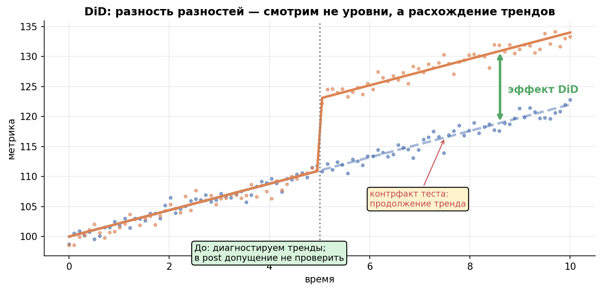
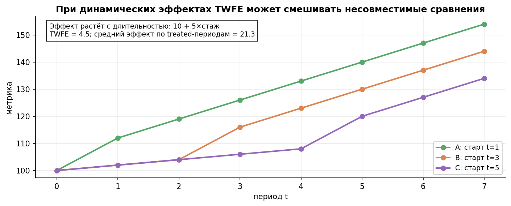
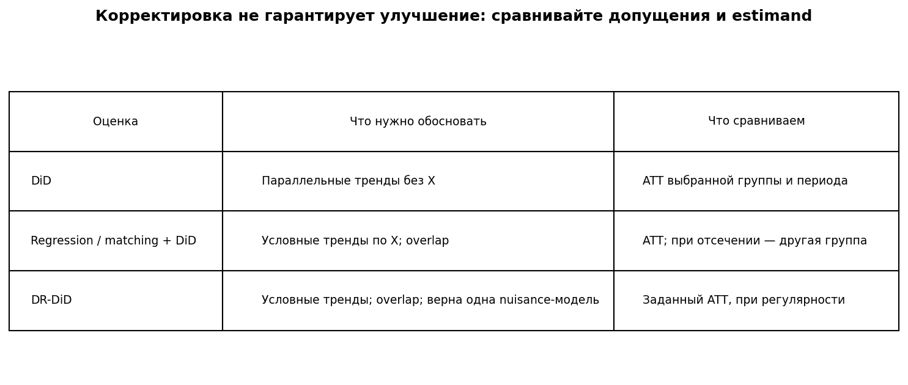
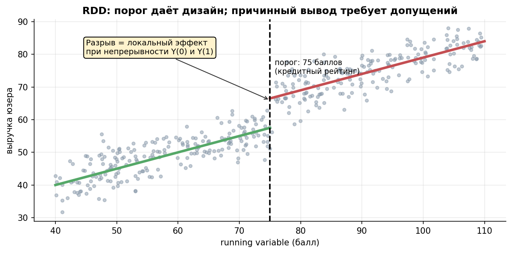
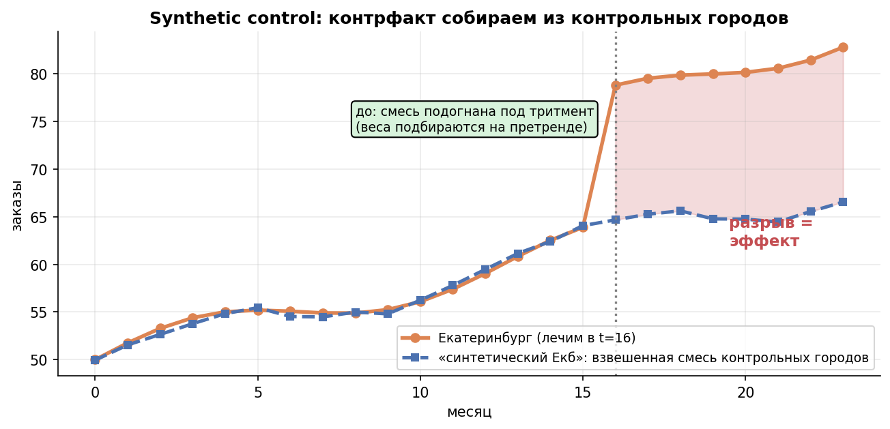
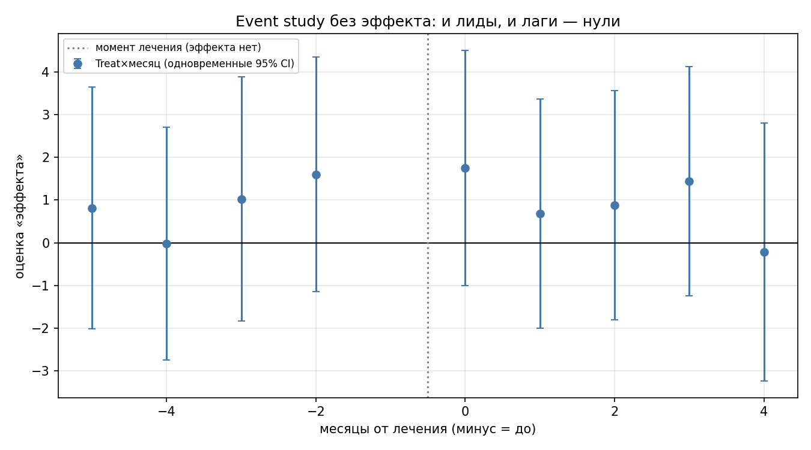
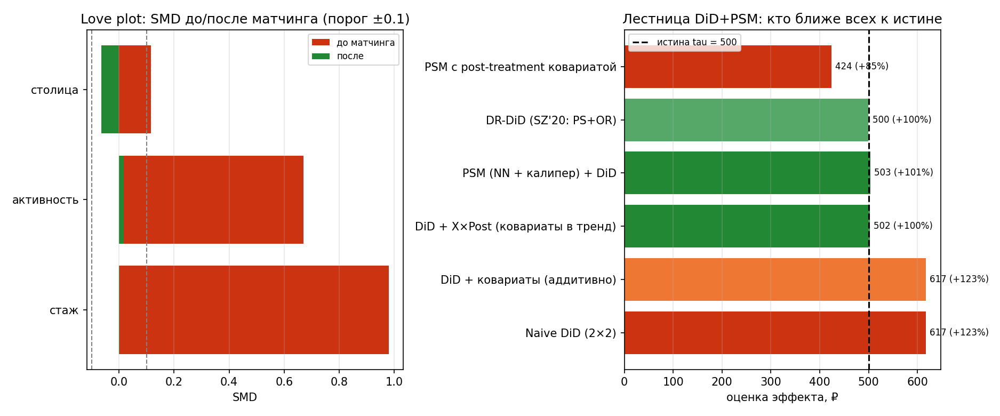

# Урок 6.3 — Квазиэксперименты: строим контроль, когда рандомизации нет

**Цель урока:** сравнить DiD, RDD, ITS и synthetic control по контрфакту и допущениям; отделить диагностику от доказательства.

**Перед уроком:** [проверьте зависимости темы](../../../course/PREREQUISITES.md); обозначения — в [словаре](../../../course/GLOSSARY.md).

## Зачем это аналитику

В «ЕдаДома» А/Б невозможен гораздо чаще, чем кажется из урока 4.3: подписку «Прайм» запустили во всём городе сразу (нет контроля — сплитить поздно); хаб- darkstore открыли в одном городе (юнит один — нет «контрольной половины»); кэшбэк получают все, у кого скоринг ≥ 700 (порог назначил алгоритм, не мы); федеральную акцию с ресторанами дали всем партнёрам сразу; а на тренинг «школа курьеров» менеджеры сами отправили самых перспективных. В каждом случае вопрос один: **где взять контрфакт** — что было бы без воздействия? Уроки 6.1–6.2 показали: корреляция ≠ причинность (конфаундеры, DAG), а потенциальные исходы Y(1)/Y(0) не наблюдаются одновременно. Рандомизация решала это балансом групп; здесь баланс надо **построить** — из другого города, из «двойников», из порога, из прогноза, из смеси контрольных городов.

Метод выбирается по estimand и правдоподобности допущений. DiD требует подходящего контроля и параллельной контрфактической динамики; RDD — непрерывности потенциальных исходов у порога либо local-randomization модели; synthetic control — доноров и переноса модели во времени. Эти условия не образуют универсальной иерархии доверия. Matching перед DiD может помочь с условной динамикой, но способен увеличить дисперсию или изменить целевую популяцию.

Классика, чтобы не думалось, что это экзотика: загрязнение Пекина на Олимпиаде-2008 (меры не назначишь рандомизацией — DiD против контрольных городов: −10% PM10 → −8% смертности), вход Wal-Mart на рынок (DiD по магазинам сети «рядом с Wal-Mart» против «на похожих рынках»), минимальный возраст алкоголя 21 год в США (RDD: +9% смертности ровно в 21), маркетинг казино по порогу прогнозируемой прибыльности (RDD «возникает сам» везде, где скоринг с отсечением). Внутренняя логика одна — и она же в вашем дашборде.

## Теория

### 1. Pre-Post: почему слаб (30 секунд)

«Было 2286,8 ₽ → стало 2782,3 ₽, значит подписка дала +21%». Сравнение юнита с самим собой не контролирует время: вместе с воздействием поменялись сезонность, тренд рынка, конкуренты, погода, праздники (урок 4.3 про внешние факторы; в телеграф-серии — «опытный исследователь vs стажёр»: сравнить человека с собой нельзя, время меняется вместе с лечением). На практике из блока 1: тест-город вырос на +495,5 ₽, но контрольные города сами по себе выросли на +236,0 ₽ — существенная часть «эффекта» подписки на самом деле общий тренд. Pre-post — это не метод, а сырьё, из которого методы вычитают «что было бы и так». Дальше — четыре способа это «что было бы» построить.

### 2. DiD: разность разностей

Идея — вычесть не уровень, а **динамику**: контроль сообщает, как изменился бы тест без лечения. Пекин-2008: «до/после» ломается сезонностью, «Пекин vs другие регионы» — различиями уровней, а их комбинация — (изменение Пекина) − (изменение контроля) — убирает и то, и другое. В таблице 2×2:

$$\widehat{DiD} = (\bar{Y}^{тест}_{после} - \bar{Y}^{тест}_{до}) - (\bar{Y}^{контроль}_{после} - \bar{Y}^{контроль}_{до}).$$

**Идентифицирующее предположение — parallel trends:** в отсутствие лечения treated-группа изменилась бы как контроль. Нужны также no anticipation и отсутствие загрязнения контроля spillover. Контрфактическая post-динамика прямо не наблюдается. Pretrend/event-study — косвенная диагностика, а не необходимый статистический пропуск с p>0,05: случаются false positives и маломощные пропуски нарушений. В практике показаны одновременные Bonferroni-интервалы по event-time коэффициентам с кластерной ковариацией. Оценивайте величину возможных отклонений; при staggered-дизайне обычные TWFE-лиды могут быть загрязнены динамическими эффектами.

*Рис. 1. DiD использует контрфактический тренд; pre-период даёт диагностику допущения.*

Регрессионная форма — то же самое, но с SE и ковариатами:

$$Y_{it} = \beta_0 + \beta_1 Post_t + \beta_2 Treat_i + \beta_3\, Post_t \times Treat_i + \varepsilon_{it},$$

β₁ — общий сдвиг времени, β₂ — отличие уровней, β₃ — DiD. Ручная разность и регрессионная точка совпадают в 2×2. В новой практике 30 treated- и 30 control-городов, по 10 пользователей в городе; independent city shocks и повторные наблюдения требуют кластеризации по городу. CR1 и t-reference дают приближение при достаточно многих независимых кластерах. Один treated-город не превращается в множество независимых единиц от увеличения числа пользователей.

**Ловушка staggered adoption.** При разных датах запуска и неоднородных/нарастающих эффектах TWFE использует уже лечёные когорты в сравнениях. Поэтому коэффициент может не отвечать на желаемый средний ATT. При одинаковом постоянном эффекте этой проблемы нет. Практика и рисунок показывают нарастание эффекта со стажем. Групповой DiD в логике Callaway–Sant’Anna сравнивает cohort-time клетки с never-treated (или допустимыми not-yet-treated), затем агрегирует явно выбранными весами. Наши веса соответствуют среднему по treated unit-periods; другой вопрос может требовать других весов.

*Рис. 2. Динамические эффекты: TWFE отличается от среднего эффекта по treated-периодам.*

### 3. DiD + adjustment: условные параллельные тренды

Безусловные параллельные тренды могут быть неправдоподобны, когда состав групп связан с динамикой. Условный DiD требует параллельности контрфактических **приростов** при заданных pre-X и overlap, но не требует равенства уровней исхода. Matching или weighting выравнивают наблюдаемый состав, а DiD устраняет постоянные различия в уровнях. Это другое идентификационное допущение, которое не становится верным автоматически после баланса. Для панелей ниже используется DR-DiD Sant’Anna–Zhao; repeated cross-sections требуют другой score-функции.

Три реализации связки: (а) **PSM → DiD**: матчинг по pre-treatment ковариатам (propensity из логита, ближайший сосед с калипером 0,2 SD логита), потом разность разностей на отматченных парах; (б) **IPW-DiD**: не отбрасывать, а взвешивать контролей весами ê/(1−ê); (в) **DR-DiD**: outcome-регрессия (OR) остатки + IPW-веса:

$$\hat\tau_{DR} = \underbrace{\overline{r}_{лечёные}}_{r_i = \Delta Y_i - \hat m_0(X_i)} \;-\; \frac{\sum_{контроли} \frac{\hat e(X_i)}{1-\hat e(X_i)}\, r_i}{\sum_{контроли} \frac{\hat e(X_i)}{1-\hat e(X_i)}},$$

где m̂₀ — модель прироста на контролях, ê — propensity. При conditional parallel trends, overlap и регулярности оценка состоятельна, если верна PS либо OR-модель. При обеих верных моделях и дополнительных условиях достигается semiparametric efficiency bound. Это асимптотическое свойство, а не гарантия близости точки к истине в каждой выборке. В практике показаны четыре спецификации; inference требует отдельно обосновать оценку nuisance-функций и variance.

Связка adjustment и DiD полезна, когда conditional parallel trends правдоподобнее безусловной динамики. Она не гарантирует улучшение любой оценки. В иллюстрации LaLonde benchmark $1794: значения $1711, $1770, $1861, $1993 имеют разное отклонение от него, без монотонного приближения. Сравнивать методы нужно по дизайну, estimand и свойствам на повторных выборках, а не по месту в списке.

**Когда adjustment не помогает.** Если безусловный DiD уже идентифицирует эффект, дополнительный matching не гарантирует меньшую ошибку и может терять данные. Matching по шумным pre-исходам способен создавать regression-to-the-mean; селекция по временному падению исхода (Ashenfelter’s dip) требует особенно внимательно проверять модель контрфактического тренда. Caliper меняет популяцию treated, повторные controls уменьшают эффективное число независимых наблюдений. Time-invariant X при unit fixed effects поглощается: для моделирования условной динамики нужны, например, X×Post, weighting или matching. Качество такой корректировки зависит от допущений, не от названия метода.

*Рис. 3. Сравнение допущений и estimands DiD, adjustment и DR-DiD.*

*Рис. 4. Иллюстрация баланса наблюдаемых ковариат; малый SMD не доказывает exchangeability.*

### 4. RDD: локальный эффект у порога

Если лечение назначается порогом непрерывного score, continuity-based RDD требует непрерывности $E[Y(0)\mid X=x]$ и $E[Y(1)\mid X=x]$ у cutoff: без лечения другого скачка исходов там не было бы. Тогда наблюдаемый разрыв идентифицирует локальный эффект. Это не автоматическая рандомизация соседей 699 и 701. Local-randomization RDD — отдельная модель со своим окном и допущением об assignment в нём. Для грубого дискретного score переход к пределам у порога не доступен без дополнительных условий.

**Sharp vs fuzzy.** Sharp: порог детерминирует лечение (скоринг ≥ 700 → кэшбэк гарантирован) — разрыв = эффект. Fuzzy: порог меняет **вероятность** лечения (кэшбэк дали 70% выше порога и 10% ниже — операторы ошибаются, апелляции) — тогда разрыв исхода делят на разрыв вероятности (Wald; это IV у порога — мостик к уроку 6.4). Кейсы: минимальный возраст алкоголя 21 (Carpenter & Dobkin): +21% «дней употребления» и **+9% смертности ровно в 21 год** (водители, отравления, суициды); маркетинг казино (Hartmann et al.): direct mail по порогу прогнозируемой прибыльности — RDD «возникает сам» везде, где скоринг с отсечением.

Проверки (порог тоже надо защищать):
1. **Плотность running variable у порога (тест МакКрари)**: если у порога — аномальный скоп («подгонка скоринга», манипуляция менеджеров, апелляции), сравнение contaminated. Проверяется гистограммой/ядровой плотностью с двух сторон.
2. **Ковариаты не должны рваться** у порога (демография, стаж, город) — рвутся только через лечение; разрыв в ковариате = найден конфаундер порога.
3. **Плацебо-пороги**: тот же разрыв в точках, где лечения нет (650, 750) — должен быть нулём.
4. **Чувствительность к bandwidth** (окно ±10/±30/±50 баллов) и к функциональной форме — вывод не должен жить только в одном окне.

Цена метода — локальность estimand и требования к данным у порога. Нужно исключить другие программы, включающиеся на той же границе. Для fuzzy RDD дополнительно обосновываются exclusion, monotonicity и ненулевой first stage. Экстраполяция эффекта около cutoff на всю базу — отдельная задача.

*Рис. 5. RDD идентифицирует локальный эффект при непрерывности потенциальных исходов.*

### 5. ITS + Causal Impact: прогноз как контрфакт

Когда нет ни второй группы, ни порога, а вмешательство — событие на оси времени («редизайн раскатан всем», «запрет ночных продаж алкоголя» → ночные ДТП), остаётся **interrupted time series**: модель тренда до вмешательства (уровень + тренд + сезонность) экстраполируется вперёд, и разрыв «факт − прогноз» после точки вмешательства — оценка эффекта. Это «RDD по времени», но без локальной рандомизации у порога, поэтому главная угроза — **конфаундер времени**: всё, что случилось одновременно с лечением (праздник, конкурент, погода), попадёт в эффект. Лечение — контрольный ряд: ITS + незатронутый регион = уже знакомая логика DiD.

**Causal Impact** (Google) — инженерная обёртка той же идеи: байесовские структурные временные ряды (BSTS, привет модулю М5) комбинируют тренд, сезонность и **контрольные ряды**, коррелирующие с целевой метрикой до вмешательства (заказы iOS — контроль для Android-релиза), и строят апостериорное распределение контрфакта: «прогноз как контрфакт», с апостериорными интервалами, условными на модели и её допущениях. Допущение: связь целевого и контрольного рядов стабильна и сама не изменилась от вмешательства (контроль не «загрязнён» спиллбэком — иначе вернитесь к 4.3 про интерференцию). Слабое место всех методов этой семьи: они молча предполагают, что модель претренда правильно специфицирована; смена формы тренда до вмешательства → систематический сдвиг прогноза. Проверки — те же DiD-овские: pretrend-остатки должны быть белым шумом, плацебо-вмешательства на пре-данных — нулями.

Для ITS практический план: обучить модель только на pre-data, проверить прогноз на отложенных pre-отрезках, отдельно обосновать отсутствие post-shocks и проверить sensitivity к структуре прогноза.

### 6. Synthetic control: контрфакт из смеси контролей

При одном treated-юните можно построить **synthetic control** из незатронутых donor units с достаточной историей. Веса ≥0 и в сумме равны 1; они минимизируют pre-treatment discrepancy. Близкий pre-fit необходим для содержательной интерпретации этой конструкции, но не доказывает перенос на post-period. В практике constrained least squares решается SLSQP с явными ограничениями. Для нового случая отдельно проверяют donor pool, отсутствие spillover/anticipation, структуру общей динамики и чувствительность к исключению доноров.

При одном treated-юните показывают placebo-in-space: тем же алгоритмом назначают псевдолечение каждому юниту и сравнивают post/pre MSPE ratios. Ранг treated среди placebo становится randomization p-value только при обоснованной exchangeability механизма назначения; при отобранном городе это прежде всего диагностическая сравнительная величина. При 10 возможных назначениях её минимальный ранг — 1/10. Нужно также показать pre-fit каждого placebo и заранее определить обращение с плохо воспроизводимыми донорами.

*Рис. 6. Synthetic control строит контрфакт из незатронутых доноров.*

## Разбор на данных

Из практики [practice_6_3.py](practice/practice_6_3.py) (seed 63, числа воспроизводятся; истина известна — симуляция).

**DiD 2×2.** Точный вывод запуска находится в [practice_6_3.py](practice/practice_6_3.py): ручной и регрессионный DiD совпадают, но из-за независимого шума не обязаны равняться заданной истине +250. Кластерный SE отражает 60 независимых городов. Naive pre-post дополнительно приписывает запуску общий тренд.

**Pretrend-тесты.** В DGP эффект равен нулю; reference — последний pre-period (event time −1). Строятся одновременные интервалы для остальных event-time коэффициентов и placebo-дата только на pre-data. Из одного запуска нельзя заключить ни доказанность нуля, ни калибровку всей процедуры.

*Рис. 7. Event study на данных без эффекта: лиды и лаги — нули*

**Staggered.** DGP задаёт эффект $100+45(t-g)$. Сравниваются общий эффект treated unit-periods, TWFE с cluster SE и cohort-time DiD с bootstrap независимых юнитов внутри cohort. Числа печатает скрипт; отличие TWFE объясняется неподходящими для этого estimand сравнениями.

**Synthetic control.** Истина в DGP +8%. Скрипт выводит pre-fit, веса, post-gap и placebo-ratios. При случайном назначении юнита их rank можно интерпретировать как randomization inference под sharp null; без такого назначения сохраняем диагностическую интерпретацию.

**DiD+PSM.** X2 влияет на treatment и untreated тренд. Сравниваются naive DiD, covariates×post, matching по pre-X и DR-DiD. Для PSM with replacement показаны только точка, баланс и ESS: bootstrap независимых пар неверен, поскольку один контроль встречается в нескольких парах. Интервал строится отдельно для гладкого DR-DiD с ресемплингом независимых юнитов и переоценкой обеих nuisance-моделей. Bootstrap требует регулярности/overlap и не исправляет идентификацию.

Скрипт выводит число оставленных treated, ESS контроля и баланс; после trimming target — оставленные treated. Четыре DR-сценария иллюстрируют корректную PS/OR, ошибку одной модели и обеих. Численная близость в одном запуске не доказывает состоятельность: свойство следует из допущений и соответствующих ожиданий.

*Рис. 8. Сравнение DiD+PSM и Love plot*

## Подводные камни

1. **«Претренды прошли — значит, всё чисто».** Делают: event study без нарушений → докладывают эффект без оговорок. Грозит: pre-test — необходимое, не достаточное (Roth et al. 2023): мало мощности у короткого пре, чувствительность к функциональной форме, а в staggered TWFE-лиды сами контаминированы (Sun & Abraham: ложные нарушения при истинной параллельности). Правильно: претренды + плацебо-периоды + предметные знания о шоках; для conditional PT — pretrends на отматченной выборке.
2. **Матчинг по post-treatment ковариатам.** Делают: суёт в propensity всё, что есть, включая «рейтинг за первый месяц после» или «пост-активность». Грозит: подтягивание контролей под лечёных по переменной, на которую лечение уже повлияло, — часть эффекта вычитается (в практике: 436 против 500). Правильно: только pre-treatment ковариаты; любую колонку из «после» — вычеркнуть (bad control из 6.1).
3. **«Добавлю ковариаты в DiD-регрессию — и исправлю непараллельность».** Грозит: аддитивные time-invariant ковариаты поглощаются within-трансформацией — оценка не двигается (616,9 → 616,9; у LaLonde $3 621 → $3 621). Правильно: ковариата должна входить в тренд (X×Post, с главными эффектами X!), в веса (IPW/DR) или в матчинг.
4. **Наивный TWFE на staggered-раскатке.** Делают: один индикатор D_it на панели с волнами лечения. Грозит: «уже лечёные» как контроли — занижение на 27% при нарастающих эффектах, иногда и смена знака. Правильно: Callaway & Sant'Anna (ATT(g,t) против чистого контроля), event-study агрегация; при отсутствии чистого контроля — читать про сравнения «ещё не лечёные» осознанно (Practitioner's Guide 2025).
5. **Баланс перепутать с параллельностью.** Делают: SMD ≈ 0 после матчинга → «тренды точно параллельны». Грозит: матчинг выравнивает уровни по наблюдаемым, но не гарантирует тренды; а агрессивный матчинг по шумным пре-исходам создаёт regression to the mean — ложные «претренды» (Chabé-Ferret). Правильно: матчиться по стабильным ковариатам, влияющим на тренд; pretrends проверять на отматченной выборке; совместный pre-test (в `did` — joint p-value).
6. **Молчать про цену комбинации.** Грозит: SE растут (+35–67% у Stuart et al.), экстремальные IPW-веса раздувают дисперсию, калипер выбрасывает лечёных без двойников — и эстиманд незаметно становится «ATT для тех, у кого есть двойники». Правильно: докладывать потерю выборки и ESS, гистограмму весов, и явно формулировать, для кого теперь оценка.
7. **Ashenfelter's dip и прочая time-varying селекция.** Грозит: у лечёных аномальный «провал» прямо перед лечением (записались на тренинг из-за просадки) — DiD интерпретирует восстановление как эффект, матчинг на уровни не чинит. Правильно: смотреть на пре-траектории лечёных (event study!), думать о механизме селекции, при dip — честно обсуждать границы метода (связка не всесильна: Chabé-Ferret).
8. **Synthetic control на коротком претренде.** Можно подогнать шум, и хороший fit не гарантирует post-validity. Нужны независимое обоснование доноров, ограничения на веса, диагностика и sensitivity. Placebo rank не является автоматически p-value для неслучайно выбранного города.

Источники по инференции: [Bertrand, Duflo & Mullainathan](https://doi.org/10.1162/003355304772839588), [Abadie & Imbens о bootstrap matching](https://www.nber.org/papers/t0325), [Cattaneo & Titiunik о RDD](https://rdpackages.github.io/references/Cattaneo-Titiunik_2022_ARE.pdf).

## Практика

Файл: [practice_6_3.py](practice/practice_6_3.py). OLS реализован через numpy, cluster covariance — в `causal_utils.py`; интервалы зависят от явного уровня независимости. Это учебные реализации, которые не заменяют проверку дизайна.

1. **DiD 2×2 руками и регрессией** (подписка «Прайм»): таблица до/после, наивный pre-post против разности разниц; регрессия с дамми (β₁ тренд, β₂ сдвиг, β₃ = DiD) — наивный 495,5 против истинных 250.
2. **Pretrend-тесты:** event study под известным нулём, reference −1, одновременные интервалы и placebo-date на pre-data.
3. **Staggered-ловушка**: 3 когорты + чистый контроль, эффекты нарастают; наивный TWFE (−27%) против группового DiD в логике Callaway & Sant'Anna (ATT(g,t), бутстреп-SE).
4. **Synthetic control:** constrained least squares, pre-fit, weights и symmetric placebo-in-space. Rank — p-value только при подходящем assignment model.
5. **DiD+PSM:** баланс, loss of treated и ESS. Для reused controls парный bootstrap намеренно не применяется; DR-DiD получает свой unit-bootstrap CI. Оценки PS не обрезаются на произвольных 0,02/0,98 при демонстрации double robustness.

Графики: [practice_6_3_did.png](images/practice_6_3_did.png), [practice_6_3_event_study.png](images/practice_6_3_event_study.png), [practice_6_3_staggered.png](images/practice_6_3_staggered.png), [practice_6_3_synth.png](images/practice_6_3_synth.png), [practice_6_3_psm.png](images/practice_6_3_psm.png) — в папке `images/` этого модуля. Пакетная гигиена: DR-DiD/CS в Python — `differences`, `diff-diff`, `DoubleML`; **`pydid` в PyPI — НЕ про DiD** (это decentralized identity), в `causalml` DiD-оценщика нет (только PSM и DR-Learner).

## Домашнее задание

1. Маркетинговая акция «ЕдаДома» запущена в Перми с июня. Средний чек: Пермь до 950, после 1015; контрольные города до 920, после 945. Посчитайте наивный pre-post и DiD. Какой вывод о «росте на 6,8%» из презентации маркетинга?

Ответ

Наивный: 1015 − 950 = +65 ₽ (+6,8%). DiD: (1015 − 950) − (945 − 920) = 65 − 25 = **+40 ₽ (+4,2%)**. Контрольные города сами выросли на 25 ₽ — это тренд/сезон, а не эффект акции; маркетинг приписал акции чужие 25 ₽ (38% «эффекта»). Это условная оценка при контрфактических параллельных трендах; event study до июня даёт диагностику, но не доказательство допущения в post.

2. «Прайм» раскатывается волнами: город A — январь, город B — март, город C — май; эффект в каждом городе нарастает со стажем подписки. Наивный TWFE вернул средний эффект заметно ниже, чем динамический event study по когортам. Объясните механику занижения и что именно делает Callaway & Sant'Anna.

Ответ

TWFE использует within-variation после удаления unit/time effects. В его сравнении поздняя когорта может сопоставляться с уже лечённой ранней, у которой D остаётся 1, но эффект продолжает расти. Тогда из прироста поздней когорты вычитается прирост эффекта ранней; в нашем DGP это даёт занижение около 27%. В общем случае знак и величина расхождения зависят от динамики и весов. Callaway–Sant’Anna оценивает ATT(g,t) с допустимыми never-/not-yet-treated controls и явной агрегацией. В практике веса по cohort-time клеткам соответствуют treated unit-periods, а не только размерам когорт.

3. В LaLonde-лестнице добавление ковариат аддитивно в TWFE не изменило оценку ($3 621 → $3 621), а включение ковариат × post дало $1 711. Почему аддитивные ковариаты «не работают» и что именно покупает X×Post?

Ответ

Аддитивные time-invariant ковариаты в DiD-регрессии поглощаются within-/FD-трансформацией: они объясняют различие уровней, которое разность разниц и так вычитает, — на различие ТРЕНДОВ они не влияют. Нарушение параллельных трендов у LaLonde-выборки — про то, что состав групп (X) по-разному эволюционирует; X×Post позволяет ковариате входить именно в пост-динамику, т.е. моделирует conditional parallel trends. Та же логика в нашей практике: аддитивно 616,9 (не двинулось), X×Post — 502,3 у истины. (Нюанс спецификации: X×Post добавляют вместе с главными эффектами X.)

4. «ЕдаДома» даёт персональные купоны всем, у кого скоринг лояльности ≥ 700. Опишите план RDD-анализа эффекта купонов на выручку: что сравниваем, какие допущения и диагностики нужны, и что меняется, если купон получают лишь 80% выше порога (и 5% ниже — «апелляции»).

Ответ

Сравниваем юзеров чуть ниже и чуть выше 700: локально-линейные регрессии выручки по running variable с двух сторон, разрыв на 700 идентифицирует эффект при непрерывности потенциальных исходов и отсутствии иных изменений в пороге. Диагностики не доказывают эти допущения: (1) плотность скоринга без скачка у 700 (МакКрари — нет подгонки скоринга/апелляций); (2) ковариаты (стаж, платформа, город) непрерывны у порога; (3) плацебо-пороги 650/750 — нулевые разрывы; (4) устойчивость к bandwidth. Если лечение вероятностное (80% vs 5%) — это fuzzy RDD: разрыв исхода делят на разрыв вероятности получить купон (Wald/IV), оценивается эффект для «комплаеров» — тех, кто купон получает именно из-за порога (LATE-логика из 6.2).

5. Почему DR-DiD «прощает» ошибку в одной из моделей — и что происходит, когда неверны обе? Разложите по формуле: что компенсирует что.

Ответ

τ_DR — разность среднего OR-остатка treated и взвешенного среднего остатка controls. При верной OR контрольные остатки условно центрированы, а средний treated-остаток равен ATT при conditional parallel trends. При верной PS веса восстанавливают распределение X treated, поэтому систематическая ошибка OR компенсируется между двумя группами. При обеих неверных моделях такой компенсации не гарантировано. Даже одна верная модель не гарантирует точного попадания в истину в конечной выборке.

## Шпаргалка

1. **Карта «где взять контрфакт»**: другой город/группа → DiD; двойники → DiD+PSM; порог → RDD; прогноз (тренд+сезон+контрольный ряд) → ITS/Causal Impact; смесь контролей → synthetic control; рандомизация недоступна, но есть «подталкивание» → encouragement/IV (урок 6.4).
2. **DiD:** parallel counterfactual trends, no anticipation, no spillover. Event study и placebo — диагностика с неопределённостью, а не доказательство; SE соответствует уровню независимого назначения.
3. **Staggered:** при динамических/неоднородных эффектах TWFE может не оценивать целевой ATT. Group-time оценки требуют допустимого контроля и явной агрегации. При общем постоянном эффекте разные даты сами по себе не порождают это смещение.
4. **Ковариаты в DiD:** time-invariant X при unit FE поглощаются. Их взаимодействие со временем, weighting или matching могут моделировать conditional trends, если соответствующие условия верны.
5. **DiD+PSM:** нет универсального прироста качества. Показать estimand, matched population, balance, overlap, variance; не считать reused pairs независимыми.
6. **DR-DiD:** состоятельность при верной одной nuisance-модели действует вместе с идентификационными допущениями и регулярностью. Корректность интервала и эффективность требуют дополнительных условий.
7. **RDD**: эффект = разрыв у порога; sharp (порог = лечение) vs fuzzy (Wald: разрыв исхода / разрыв вероятности); проверки — плотность (МакКрари), непрерывность ковариат, плацебо-пороги, bandwidth. Цена — локальность вывода.
8. **ITS/Causal Impact**: контрфакт = прогноз тренда+сезонность(+контрольные ряды, BSTS); слабое место — конфаундер времени и стабильность связи с контролем; pretrend-остатки должны быть шумом.
9. **Synthetic control:** нужны donor pool, pre-data и модель переноса; веса ≥0, Σ=1. Placebo ranks информативны как диагностика, а их тестовая интерпретация требует exchangeability.
10. **Выбор метода:** сначала вопрос и estimand, затем допустимые контрфакты и допущения. Универсального рейтинга A/B > DiD > matching > forecast нет.

## Источники

- `materials/local/causal-inference-doc.md` (конспект Матросова): §30 (DiD + ловушка staggered TWFE + Callaway & Sant'Anna с таблицами), §31 (PSM vs DiD / PSM + DiD: комбинирование), §32 (SC + DiD), §33 (TRoP), §28 (synthetic control: веса, MSPE, пермутационный тест), §34 (RDD), §35 (ITS: алкоголь/ночные ДТП, контрольный регион), §36–38 (прогноз с контрольным рядом, Causal Impact/BSTS), §13 (иерархия доверия методов), §41 (метод → эстиманд: DiD/matching → ATT).
- `materials/web/research-did-psm.md` — главный research для связки: Heckman–Ichimura–Todd (1997, conditional DiD-матчинг, JTPA); Stuart et al. (2014, AQC: 4 группы, SMD ≈ 0, SE +35–67%); Sant'Anna & Zhao (2020, DR-DiD, arXiv:1812.01723); Chabé-Ferret (2015/2017: когда комбинация не лучше, RTM, Ashenfelter's dip); Roth et al. (2023, pretrend-тест — не доказательство); Caetano & Callaway (2024); туториал Méndez (LaLonde-лестница $3 621 → $1 993 против бенчмарка $1 794); пакеты `did`/`DRDID`/`differences`/`diff-diff`/`DoubleML`, ловушка `pydid`.
- `materials/local/lecture-catch-effect.md` — лекция «Как поймать эффект», слайды 15–22: карта методов «от простого к сложному» (Pre-Post → DiD → RDD → Matching → IV) и кейс тренинга (matching + динамика до/после: «комбинация методов даёт более надёжную оценку»).
- `materials/telegram/telegraph-causal-series.md` — ч.4 «Квазиэксперименты» (идентифицирующие предположения; DiD Пекин-2008/Wal-Mart/TV-реклама; RDD стипендия/алкоголь-21; IV encouragement Spotify — мостик к 6.4) + конспекты статей из неё: He, Fan & Zhou (2016, Пекин), Baker, Callaway, Cunningham, Goodman-Bacon & Sant'Anna (2025, «DiD Practitioner's Guide», arXiv:2503.13323), Ailawadi et al. (2010, Wal-Mart), Carpenter & Dobkin (2009, алкоголь-21: +21% дней употребления, +9% смертности), Hartmann, Nair & Narayanan (2011, RDD в казино-маркетинге).
- `materials/web/web-articles.md` — MCP Analytics «Causal Inference Methods» (обзор 9 методов, иерархия валидности, Causal Impact, synthetic control «прозрачен для стейкхолдеров»); koch-kir «Causal Inference from Observational Data» (обзор: matching/IPW/DR, DiD/RDD/ITS/SC как временные дизайны).
- Kohavi et al., гл. 11 (когда A/B невозможен — рамка «вынужденной меры»); HKU L7; Deng гл. 6 (квазиэксперименты); ВШЭ «А/B-тестирование», темы 16–18.
- Внутренние связи: уроки 6.1 (DAG, bad control — почему в матчинг только pre-treatment X) и 6.2 (potential outcomes, ATT/LATE — эстиманды методов); урок 3.5 (CUPED — пре-период как ковариата, родственная логика); далее 6.4 (matching/PSM глубоко, IV, double ML), 6.5 (sensitivity, карта методов, ошибка III рода).
