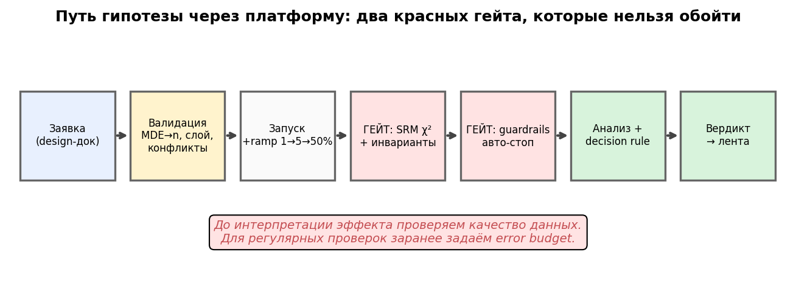

# Урок 7.3 — Интерфейс платформы: от гипотезы до вердикта

**Цель урока:** связать заявку, резервирование, мониторинг и решение; задать бюджеты ошибок и заблокировать невалидный релиз.

**Перед уроком:** [проверьте зависимости темы](../../../course/PREREQUISITES.md); обозначения — в [словаре](../../../course/GLOSSARY.md).

## Зачем это аналитику

В уроке 7.1 вы построили сплит-сервис, в 7.2 — данные и вычисления. Осталась часть, которую видит каждый пользователь платформы: **интерфейс и процессы**. «ЕдаДома» выросла до трёх команд, и аналитик больше не может быть «человеком-гейтом»: лично проверять SRM каждого теста, помнить, чей guardrail какой, руками считать n, ловить продактов на «давай просто посмотрим, что будет». Каждый такой ручной шаг — место, где однажды ошибутся: не тот порог, забытая метрика, тест на сломанном сплите, результат которого уже уехал в презентацию директору.

Этот урок — про то, как «зашить» дисциплину М3–М4 в систему. Microsoft ExP описывает любую платформу четырьмя контурами (Portal, Execution, Log Processing, Analysis & Reporting) — мы построили первые три в 7.1–7.2, здесь собираем Portal и Reporting вокруг них. Ключевая идея: **платформа — это конвейер доверия**. Заявка на эксперимент — не формальность, а дизайн-док из 4.1 в машиночитаемом виде; гейты — не «галочки», а автоматические привратники, через которые нельзя пройти мимо; вердикт — не «мнение аналитика по итогам», а исполнение правила, подписанного до запуска.

Аналитик в этой конструкции не теряет работу — она меняется: из «исполнителя проверок» он становится **проектировщиком правил** и разбирателем инцидентов (почему сработал гейт — «баг» или «фича»). Именно это отличает зрелую платформу от «сервиса тестов» — и подготавливает финальный шаг урока 7.4: календарь гипотез.

*Рис. 1. Путь гипотезы через платформу: два красных гейта, которые нельзя обойти.*

## Теория

### 1. Заявка = дизайн-док: форма, которая валидирует

Из 4.1 мы знаем чек-лист дизайн-дока. В платформе он становится **формой заявки** — и в этом трансформация не косметическая, а процессуальная:

- **Авито**: заявка на эксперимент — одна страница текста от продакт-аналитика (гипотеза, метрики, аудитория, длительность) — до написания кода; **Яндекс** идёт дальше: конфиг эксперимента — текстовый файл в git, ревью как кода, «эксперимент с кривой метрикой умрёт при ревью»; **Microsoft** («Patterns of Trustworthy Experimentation») — чек-лист pre-experiment stage + ретроспективные A/A до запуска.

Что валидирует платформа автоматически (всё — из пройденного):

| Поле заявки | Автопроверка платформы | Откуда у нас |
|---|---|---|
| Гипотеза X→Y→Z | обязательность полей, фальсифицируемость — ревью | 4.1 |
| OEC | метрика существует в метрик-хабе, у неё есть паспорт (владелец, определение, версия) | 7.2 |
| MDE | автоподсчёт n и длительности; «MDE 16% отн. на p₀=6,2% → n=9 741/группу → 2 недели» | 3.1 |
| Guardrails | автоподстановка guardrail-пакета платформы (пороги уже согласованы) | 4.1 |
| Слой | занятость слоя: суммарные доли ≤ 100%; конфликт → очередь | 4.2, 7.4 |
| Длительность | целыми неделями, не в пятницу, с учётом blackout-недель | 3.1 |

Два выигрыша. Первый — **скорость**: продакт получает расчёт за секунды, а не «зайдите к аналитику на неделе». Второй — **нельзя схалтурить**: платформа не примет заявку без MDE или с метрикой, которой нет в хабе. Валидация — это дизайн-док, у которого не спросишь «а можно потом поменяем метрику» (нельзя: правилом решения 4.1).

### 2. SRM-гейт как привратник

Механику SRM — хи-квадрат долей, порог 0,001, мощность детектора, протокол дебага — мы разобрали в 4.2. Здесь — организационный вывод: **SRM-проверка не «фича отчёта», а гейт, через который нельзя пройти**:

- **Microsoft ExP**: тест, не прошедший SRM, не анализируется — отчёт не показывается вовсе; у ~10% экспериментов с SRM качество и полнота данных страдают ещё сильнее (это маркер «где-то сломан пайплайн», а не только сплит).
- **Zalando (Octopus)**: пока SRM-проверка не была автоматизирована, она **молчала в ≥20% тестов** (для сравнения, у зрелых команд SRM ловится в 6–10% тестов — Kohavi). Вывод Zalando: авто-блокировка результатов до разбора — обязательна. Мораль для проектировщика: проверка, которую надо «помнить делать», не делается. Автоматизация — не опция.

В мини-платформе SRM проверяется по накопленным назначениям после наблюдаемой потери. На каждый из K запланированных дней выделяется 0,001/K. Бонус-сценарий теряет случайные записи теста (MCAR); это вызывает сигнал о качестве, но само по себе не доказывает смещение или его направление. Рост OEC в сценарии имеет также заданный реальный компонент.

### 3. Авто-стоп по guardrails: тормоза платформы

В 4.1 мы назначали guardrails с порогами. На платформе они работают как **автоматический стоп-кран**:

- **Optimizely**: guardrail-метрика с auto-pause — при breach эксперимент останавливается сам;
- **Uber**: mixture-SPRT (mSPRT) с always-valid доверительными интервалами — авто-детект инцидентов без инфляции α, с jackknife/block-bootstrap для коррелированных юзер-дней и поправкой BH;
- **Airbnb**: конвейер «лог-трансформация + CUPED + sequential testing» — быстрый детект регрессий и авто-пауза проблемных экспериментов.

Три принципа: OEC и guardrails имеют разные функции, но правило мониторинга нужно обоим. Fixed-horizon OEC оценивается по заданному финалу; раннюю остановку по пользе можно проектировать через sequential-метод. Safety-стоп по вреду допустим, но его ложные тревоги и влияние на последующий вывод учитывают. В практике Bonferroni по K заранее выбранным дням даёт порог norm.isf(α/K); это не mSPRT и не защита для неограниченного числа дополнительных взглядов.

В исправленной симуляции пуш прекращается на 9-й день из 14 по Bonferroni-границе вреда; OEC при остановке около +35%. Это промежуточная диагностическая оценка, а не финальный fixed-horizon CI эффективности. Другой seed может изменить день остановки.

### 4. Мониторинг инвариантов в реальном времени

Инварианты — характеристики, которые воздействие по конструкции не может изменить, например назначение eligible-пользователей и их предэкспериментальные события. Число событий после назначения и доля без событий могут меняться из-за фичи: это outcomes/диагностики, а не автоматические инварианты. Быстрый контур платформы отслеживает отдельно качество данных и технические guardrails, ночной батч строит подробный отчёт.

Пороги должны учитывать частоту проверок и множество метрик. Уровень 0,001 на один взгляд не равен вероятности хотя бы одного ложного стопа за тест. Практика делит 0,001 на K дней отдельно для SRM и pre-инварианта: каждый путь имеет свой budget; общая вероятность ошибки двух гейтов ограничена их суммой 0,002 при валидных p. Для общего бюджета 0,001 его нужно разделить также между гейтами. Алерт означает основание для разбора, а не доказанный баг.

### 5. Каталог метрик и лента результатов: эксперименты как контент

Результат теста, который никто не увидел, — это поиск решения ценой слота (7.4) без сдачи. Зрелые платформы делают результаты **контентом для всей компании**:

- **Eppo Knowledge Base**: каждый завершённый тест — карточка (название, даты, команда, решение, эффект по primary-метрике, takeaways) — «лента» результатов;
- **Uber pulse**: еженедельные email-дайджесты + авто-отчёты по завершении тестов; рекомендация метрик коллаборативной фильтрацией поверх 1000+ метрик;
- **Airbnb ERF Explorer**: селф-сервис-дрелилка поверх Presto — сегменты без SQL;
- **Home Depot** (GrowthBook Podcast): топ-менеджеры сами ищут в библиотеке экспериментов;
- **Avito**: BI-дашборды со столбцом MDE — сразу видно, «дотянет» ли тест эффект.

Архив тестов помогает калибровать priors, правила решений и приоритизацию. Минимальная карточка содержит дату, причину остановки, промежуточную оценку с пометкой статуса и вердикт. Актуальную строку и числа печатает практика; после safety-стопа она не выдаёт fixed-horizon вывод об OEC.

### 6. Интеграции: трекер, дашборды, алерты

**Интеграции с трекером уже существуют:** [Optimizely документирует Jira](https://docs.developers.optimizely.com/web-experimentation/docs/configure-jira). Проверяйте доступность по продукту и тарифу на дату выбора. Для своей платформы задайте контракт тикет↔эксперимент↔решение, обработку повторов webhook и владельца; не выводите отсутствие продукта из неполного поиска.

### 7. Роли: аналитик, продакт, платформа — self-serve vs gate

Кто и что делает в этом конвейере (рамка Microsoft/Avito):

- **Продакт**: приносит гипотезу X→Y→Z, владеет решением по decision rule (4.1), отвечает на «сколько стоит просевший guardrail»;
- **Аналитик**: проектирует правила (пороги гейтов, guardrail-пакеты, метрики хаба), ревьюит заявки, разбирает инциденты гейтов, развивает статистику платформы (CUPED, sequential — 3.5, 3.7);
- **Платформа** (команда): SLA сплита и вычислений, сами гейты, лента, календарь (7.4).

Дилемма **self-serve vs gate**: полный self-serve («любой продакт запускает что угодно») быстр, но автоматизирует хаос — без ревью дизайн-доков очередь забьётся сырыми заявками; ручной гейт на каждый тест превращает платформу в бюрократию и bottleneck. Рабочий паттерн зрелых команд: **автоматические гейты для всех + ревью выборочное** (новые команды и новые механики — обязательно; опытные — по чек-листу автоматически). Платформа здесь — внутренний продукт со своими пользователями, retention которых (доля команд, которые возвращаются с новыми заявками) — не менее важная метрика, чем SRM-алерты.

## Разбор на данных

Обновлённая практика резервирует принятые заявки, изолирует состояние экземпляров и исполняет только заявленный поддерживаемый guardrail — долю пользователей с ошибкой. Для иных метрик нужен отдельный реализованный оценщик; наличие имени в каталоге не означает, что проверка работает.

Группы — непересекающиеся случайные пользователи; размеры и pre-инварианты не совпадают по построению. SRM и pre-инвариант используют бюджет 0,001, разделённый на плановые дни, guardrail — 0,05/K. Любая остановка по валидности блокирует SHIP, остановка по вреду не даёт финальный fixed-horizon эффект.

В текущем воспроизводимом прогоне сортировка имеет положительный OEC, но допустимый вред guardrail не исключён: HOLD. Пуш прекращается по вреду; иконки дают неопределённость по OEC. Это не обязательные «нужные» исходы сценариев — конкретные оценки/CI печатаются кодом и изменяются с seed.

В дополнительном сценарии теряются случайные пользователи теста независимо от исхода (MCAR), а истинный эффект задан +40%. SRM сигнализирует о нарушении сбора. Нельзя утверждать, что наблюдаемый положительный эффект создан отбором активных: в этой DGP он реальный. Для демонстрации selection bias нужен отдельный механизм outcome-dependent потери.

## Подводные камни

1. **Форма без валидации.** Делают: «форма сбора заявок» в Confluence, поля заполняются по ходу теста. Грозит: дизайн-док, подписанный после результата, — это рационализация (4.1); «у каждого своя конверсия» (7.2). Правильно: платформа не принимает заявку без OEC из хаба, MDE и порогов guardrails — правило до данных.
2. **Ручной SRM «по мере сил».** Делают: аналитик смотрит SRM, «когда делает отчёт». Грозит: у Zalando так молчало ≥20% тестов — с красивыми цифрами на выходе. Правильно: автоматический гейт с блокировкой отчёта; порог 0,001 (не 0,05 — alarm fatigue, 4.2).
3. **Авто-стоп по обычному p OEC.** Ранний поиск победителя без поправки нарушает α. Для раннего успеха используйте заранее выбранный sequential-протокол; для вреда задайте отдельное safety-правило и его бюджет ложных остановок.
4. **Guardrail без поправки за время.** При ежедневном поиске сигнала вероятность ложного стопа превышает отдельный уровень; её величина зависит от корреляций и расписания. Исправление — заранее распределённый budget или обоснованный sequential-критерий; проверяется вероятность пересечения за весь путь.
5. **Смотреть OEC после авто-стопа.** Делают: тест остановлен по guardrail, но «эффект же был +42%» — и его вносят в план. Грозит: обрыв теста — не оценка эффекта (мощность не набрана, состав дней неоднороден). Правильно: вердикт «не катим + разбор инцидента»; новая заявка после фикса.
6. **Лента ради ленты.** Делают: дашборд всех тестов со ста метриками и без поля «решение». Грозит: кладбище графиков, которое никто не открывает; знания не накапливаются (4.5: мета-анализ и приоры невозможны). Правильно: карточка Eppo KB — название, команда, даты, **решение**, эффект, takeaways; дайджест «завершённые тесты недели».
7. **Self-serve без ревью — или гейт на всё.** Делают: (а) «продакты сами всё запускают» — платформа автоматизирует хаос; (б) каждое ревью — неделя очереди к аналитику. Грозит: (а) мусорные заявки и SRM-инциденты; (б) команды обходят платформу («потихоньку катим без тестов» — кейс X5 из 4.1: −140 млн ₽/кв). Правильно: автоматические гейты для всех, ревью — по риску (новая команда, новая механика, большой слот).

## Практика

Файл [practice_7_3.py](practice/practice_7_3.py) (percent-формат, numpy/scipy/matplotlib, детерминированные seed'ы, Agg). Мини-платформа в одном скрипте — `class ExperimentPlatform` с полным циклом:

1. **`submit(design_doc)`** — валидация: метрики из метрик-хаба (словарь с паспортами), автоподсчёт n из MDE (формула 3.1 + запас 5%), автоподстановка guardrail-пакета, проверка занятости слоя (пересечения — 4.2). Одна заявка принята с пересчётом MDE→n→недели, одна отклонена («слой переполнен»).
2. **`run(...)`** — симуляция теста по дням с тремя гейтами: SRM (χ², порог 0,001/K на день), инвариант «событий до назначения на юзера» (уровень распределён на K дней), guardrail авто-стоп (доля ошибок, порог +0,3 п.п., z>norm.isf(α/K) — Bonferroni по K взглядам). OEC-путь считается «для иллюстрации» — решение по нему отложено до предусмотренного протоколом момента.
3. **`analyze` + `verdict`** — OEC: Уэлч + CUPED (θ по пре-периоду, 3.5); вторичные метрики с Холмом (2.4); вердикт по decision rule 2×2 (4.1) — включая ветки «авто-стоп» и «нет решения».
4. **Три сценария:** положительная OEC с непроверенной безопасностью (HOLD), остановка по вреду, неопределённая OEC. Отдельный сценарий SRM блокирует результат. Код не обязан воспроизводить заранее желаемые ярлыки SHIP/серый на каждом seed.

График: [practice_7_3_monitoring.png](images/practice_7_3_monitoring.png) — панель мониторинга из трёх панелей (SRM-путь, guardrail z-путь с авто-стопом, накопленный OEC-эффект).

## Домашнее задание

**Задача 1.** Спроектируйте минимальную форму заявки «ЕдаДома»: 6–8 полей и список автопроверок платформы для каждого. Какое поле нельзя валидировать автоматически и почему?

Ответ

Поля: гипотеза X→Y→Z; OEC (выпадающий список из метрик-хаба); MDE (или «посчитай сам по экономике»); guardrails (дефолт — пакет платформы, пороги редактируемы); слой/слот; юнит рандомизации; владелец решения; blackout-недели (автоподстановка). Автопроверки: метрика есть в хабе; n и длительность пересчитаны (MDE→n→недели); занятость слоя; длительность целыми неделями; пороги guardrails заданы числами. Не валидируется автоматически: фальсифицируемость гипотезы и «X правда про пользователей» — это ревью аналитика; машина проверяет форму, человек — смысл.

**Задача 2.** Guardrail-стоп настроен как ежедневная проверка «ошибки в тесте значимо выше контроля + 0,3 п.п.» при α = 0,05 на взгляд. Тест идёт 14 дней. Оцените вероятность ложного авто-стопа хотя бы раз за тест и предложите фикс.

Ответ

Для 14 независимых тестов формула дала бы 51%, но накопленные ежедневные проверки зависимы, поэтому здесь это не точная вероятность. Простой заранее заданный план: односторонний уровень .05/14 на взгляд (z≈2,69), тогда union bound даёт не более 5% при валидности каждого p; для нескольких guardrails дополнительно распределите бюджет. Альтернатива — обоснованный GST/mSPRT. Калибруйте всю процедуру при границе допустимого вреда. Риск ложного стопа и пропуска вреда выбирают явно, а не объявляют фиксированный z «mSPRT».

**Задача 3.** Тест пришёл к концу: OEC +2,1% (p = 0,03), guardrail «отписки» +14% при пороге +5% (значимо). Авто-стопа не было — порог пробит только на полной выборке. Какое решение выдаст платформа и что посчитать команде?

Ответ

По decision rule 2×2 (4.1): строка «OEC значимо ↑», столбец «guardrail просел» → **не катим**, разбор trade-off. Посчитать: денежную ценность +2,1% OEC за горизонт (квартал) против стоимости +14% отписок (упущенная выручка отписавшихся × их доля × горизонт). Если хочется катить — это новый дизайн-док (компенсация вреда, другой порог), а не «плюсы перевесили» на том же тесте. Мораль для платформы: guardrail-порог был задан до запуска — его нельзя «переутвердить» задним числом.

**Задача 4.** Почему авто-стоп по guardrail срабатывает в нашей симуляции на 9-й день, а SRM-гейт (в бонус-сценарии) — только на 12-й? Что это говорит о мощности детекторов?

Ответ

Оба детектора — тесты со своей мощностью, зависящей от размера эффекта и N (4.2: z = δ√N). Guardrail-эффект огромен (ошибки ×1,6 ≈ +1,2 п.п. при пороге 0,3 п.п.) — детектору хватает ~5 000 юзеров на группу. SRM-эффект тоньше: потеря 4,5% группы даёт χ² = (ΔN)²/N, и порог 0,001 требует ~10 000 на группу. Следствие для проектировщика: чем тоньше баг, тем позже гейт его поймает (или не поймает — как фильтр новинок из 4.2, ловимый лишь на больших N); «гейт молчит» на ранних неделях ≠ «тест здоров».

**Задача 5.** Придумайте три velocity-метрики платформы «ЕдаДома» (кроме «числа тестов»), которые вы повесили бы на дашборд руководителя, и объясните, почему «число тестов» — плохая метрика.

Ответ

Например: медианное время «идея → решение» (дни от заявки до вердикта); доля ожидания в этом времени (сколько сидит в очереди на слот — управляемая часть); decision rate (доля заявок, дошедших до вердикта, а не брошенных/оборванных); доля тестов с заблокированным SRM («здоровье платформы»). «Число тестов» плохо, потому что оптимизирует объём, а не ценность: команды нарежут мелкие дешёвые тесты с гигантскими MDE, которые ничего не могут обнаружить (3.1), — KPI будет зелёным, а ценность нулевой. Правильная рамка — ценность и скорость обучения (4.5, 7.4).

## Шпаргалка

1. Платформа = 4 контура (Microsoft ExP): Portal / Execution / Log Processing / Analysis & Reporting; интерфейс — это Portal + Reporting вокруг сплита (7.1) и вычислений (7.2).
2. Заявка = дизайн-док в машиночитаемом виде: гипотеза, OEC из хаба, MDE, guardrails, слой, владелец. Платформа валидирует: автоподсчёт n (3.1), автоподстановка guardrail-пакета, занятость слоёв (4.2), blackout-недели.
3. SRM-гейт — привратник: χ², порог 0,001, непрошедший тест не анализируется (Microsoft). Без автоматизации SRM молчит: Zalando ≥20% тестов, у зрелых 6–10% — автоматизация обязательна.
4. Авто-стоп по guardrails требует контроля повторных взглядов. В практике — Bonferroni для конечного расписания; mSPRT/GST — другие методы с собственными условиями. Ранний успех также допустим в заранее спроектированном sequential-дизайне.
5. Инварианты — в быстром контуре (стриминг/мини-батч), отчёты — в ночном батче (7.2); пороги гейтов консервативные — alarm fatigue убивает пользу алертов.
6. Анализ на выходе конвейера: OEC — Уэлч + CUPED (3.5), вторичные — Холм (2.4); вердикт — decision rule 2×2 из 4.1, включая «нет решения» и «обрыв ≠ вердикт по OEC».
7. Лента результатов = «эксперименты как контент»: карточка с решением и эффектом (Eppo KB), пульс-дайджесты (Uber), селф-сервис-дрелилка (ERF Explorer), дашборды со столбцом MDE (Avito). Архив — актив для мета-анализа и приоров (4.5, 7.4).
8. Интеграции: проверяйте возможности текущих вендоров (включая Optimizely/Jira), затем выбирайте готовую связь или собственный webhook/API с версионированием и идемпотентностью.
9. Роли: продакт владеет решением, аналитик — правилами и разбором инцидентов, платформа — SLA и гейтами. Self-serve + автоматические гейты + выборочное ревью по риску.
10. Аналитик платформы проектирует правила, а не выполняет проверки вручную: каждая ручная проверка — место будущей ошибки; каждая автоматическая — конвейер доверия.

## Проверка процедуры на синтетических данных

В отдельной демонстрации при истинном эффекте 0 потеря 23,1% наблюдений независимо от исхода даёт разность около 0. При той же ожидаемой доле потерь, но сохранении всех конвертировавшихся и только 70% неконвертировавшихся, complete-case оценка около +7 п.п. SRM сигнализирует об изменении размеров групп, но не устанавливает механизм смещения.

Калибровка вызывает весь путь `run → ежедневные гейты → финальный анализ и вердикт`, а частоты делит на все запуски. В 250 мирах по 14 дней при нулевом росте ошибок любой gate срабатывает в 0,8% запусков (95% Monte Carlo CI 0,097–2,860%); на границе допустимого вреда +0,3 п.п. — в 1,6% (0,438–4,046%). Суммарный бюджет гейтов 0,001+0,001+0,05=0,052; финальная OEC-проверка — отдельное событие. Это fixed-K Bonferroni с приближёнными fixed-look тестами. Проверка относится к этому DGP; 250 миров дают лишь грубую оценку редких ошибок уровня 0,001.

## Источники

- Research-разведка «Проектирование АБ-платформы», §4 «Интерфейс и процессы» — `materials/web/research-ab-platform.md`: дизайн-док как заявка (Avito, Microsoft Patterns, шаблоны), SRM-автоматизация (Zalando ≥20%, Chen et al. 2022, DoorDash), guardrail auto-stop (Optimizely, Airbnb, Uber mSPRT), каталог и лента (Eppo KB, Uber pulse, ERF Explorer, Home Depot), интеграции с трекерами (white space), чек-лист проектировщика пп. 22–26.
- Kohavi, Tang, Xu — Trustworthy Online Controlled Experiments: гл.4 (платформа и культура, зрелость), гл.12–16 (клиентская часть, инструментарий, юниты, ramping/SQR, масштабирование анализа) — PDF в базе (`materials/local/books.md`).
- Gupta et al., «The Anatomy of a Large-Scale Experimentation Platform» (Microsoft, 2018) — рамка 4 контуров: microsoft.com/en-us/research/publication/the-anatomy-of-a-large-scale-experimentation-platform/.
- Zalando Octopus — engineering.zalando.com/posts/2021/01/experimentation-platform-part1.html (SRM молчал в ≥20%, авто-блокировка отчёта, crawl-walk-run).
- Uber XP — uber.com/us/en/blog/xp/ и …/making-ubers-experiment-evaluation-engine-100x-faster/ (mSPRT-мониторинг, авто-валидация, пульс-отчёты); Airbnb Guardrails — medium.com/airbnb-engineering/designing-experimentation-guardrails-ed6a976ec669; Eppo Knowledge Base — docs.geteppo.com.
- Trisigma (t.me/trisigma_avito), дайджест `materials/telegram/trisigma_avito-digest.md`: «Что делает платформа экспериментов» (отличия от раздачи фич), культура и зрелость, экономика (мостик к 7.4).
- Уроки курса: 4.1 (дизайн-док, OEC, guardrails, decision rule 2×2), 4.2 (SRM: χ², порог 0,001, мощность детектора, протокол дебага), 3.1 (MDE→n), 3.5 (CUPED), 3.7 (подглядывание и sequential), 2.4 (Холм), 4.5 (экономика тестов и Type M), 7.1 (сплит-сервис), 7.2 (метрик-хаб, быстрый/глубокий контур); вперёд — 7.4 (платформа как календарь гипотез: очередь, ёмкость, velocity).
