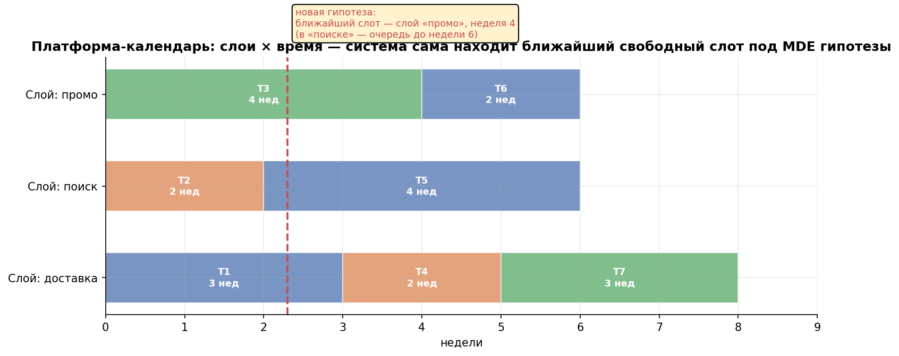
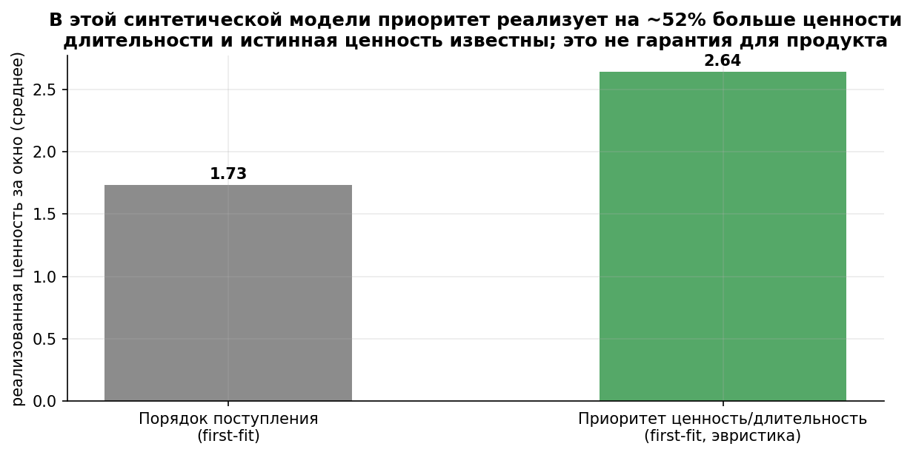
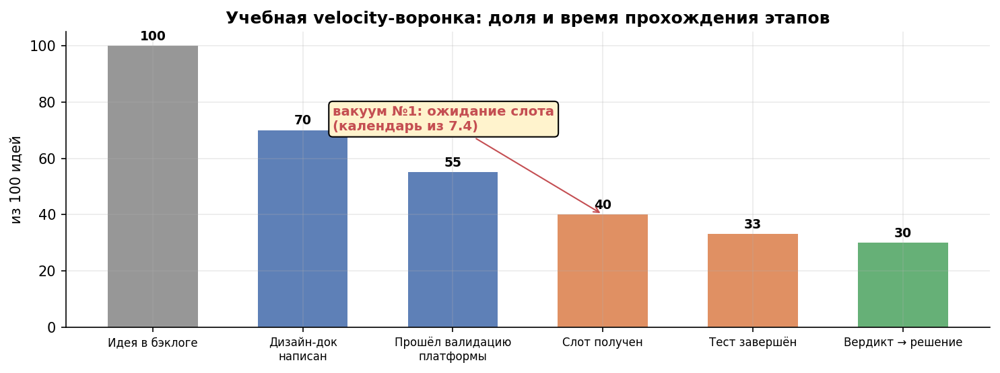
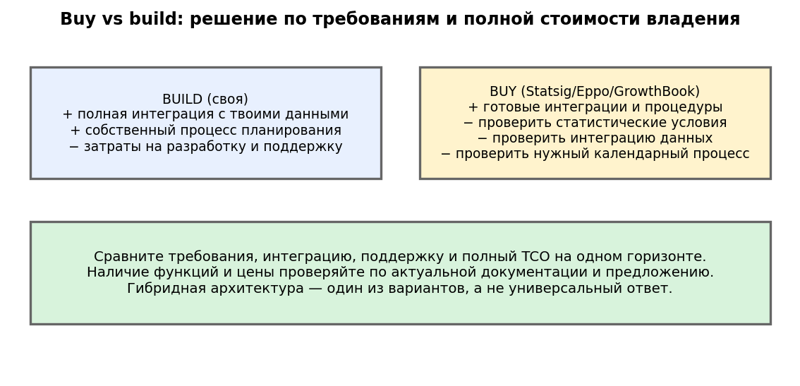
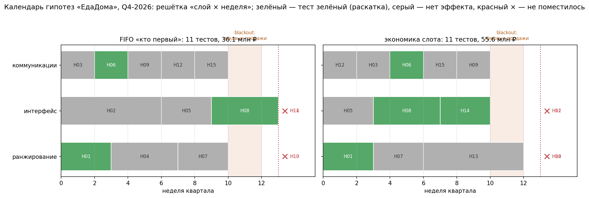
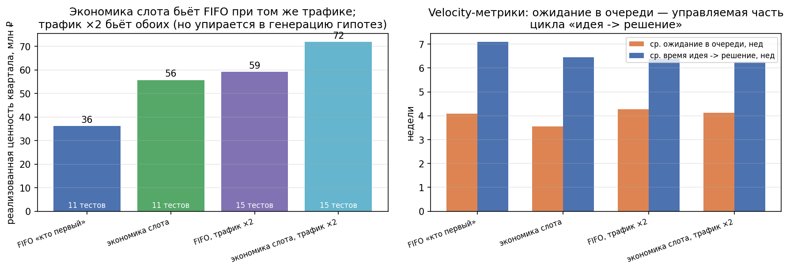

# Урок 7.4 — Платформа как календарь гипотез

**Цель урока:** планировать ограниченный трафик, сравнивать модели приоритизации и проверять требования build vs buy.

**Перед уроком:** [проверьте зависимости темы](../../../course/PREREQUISITES.md); обозначения — в [словаре](../../../course/GLOSSARY.md).

## Зачем это аналитику

Понедельник, планирование квартала в «ЕдаДома». Три продакт-команды принесли 15 гипотез. Аналитик открывает таблицу тестов и понимает: даже если никто не заболеет, физически влезет 11–12. Кто не влезет? Тот, кто позже написал в чат. Сколько это стоит? Никто не знает, потому что «очередь» — это не метрика, а общий чат и договорённости. Знакомая картина: слоты трафика — единственный ресурс, которым управляет не система, а «кто первый пришёл» и ручной juggling в голове у аналитика.

При этом всё остальное уже автоматизировано: сплит (7.1), вычисления (7.2), гейты и вердикты (7.3). Осталась последняя, организационная неэффективность — **планирование**. И это не мелочь: в 4.1 мы видели, что при фиксированной мощности платформы приоритизация меняет итог квартала сильнее, чем любые статистические трюки (там: случайные 12 тестов +9,2% против топ-12 +17,2%). Если скорость обучения — главный продукт платформы (⅓ идей выигрывает — Kohavi KDD'13), то очередь на слот — это место, где скорость умирает.

Идея урока — взгляд заказчика, ради которого вообще стоит строить платформу: **календарь гипотез**. Не «система запуска тестов», а переговорная комната трафика: видно, чем занят каждый слой, когда освободится, кто в очереди и почему именно он; система сама считает длительность из MDE и предлагает слот. В финале — трезвый оргвывод: такой календарь не продаёт ни один вендор; вопрос buy vs build — это вопрос о том, где ваша уникальность; а платформа как продукт обязана иметь собственную юнит-экономику.

*Рис. 1. Платформа-календарь: слои × время — система сама находит ближайший свободный слот под MDE гипотезы.*

## Теория

### 1. Слоты трафика — конечный ресурс; очередь неизбежна

Формула ёмкости проста: ёмкость = слоистость × время / средняя длительность теста, а длительность — функция MDE и трафика (3.1: n = 2(z₁+z₂)²σ²/MDE², дни = 2n / недельный трафик). Спрос на слоты = Σ длительностей бэклога по слоям. Если спрос > ёмкости — очередь, и никакие инженерные трюки это не изменят: это **статистическая** ёмкость, ограниченная физикой трафика, а не вычислениями (вычислительную мы сняли бакетизацией в 7.2 — Avito спокойно считает ~0,5 млрд p-value в день). Полная рамка: ёмкость платформы = min(физическая: RPS сплит-сервиса; вычислительная: p-value/день на кластере; статистическая: слоистость × MDE-микс × трафик). Google в KDD'10 прямо вводит понятие ёмкости слоя и авто-проверки «хватает ли слою трафика» при пуше конфига — зачатки capacity planning были у классиков, продукта из этого рынок так и не сделал.

Как только очередь признана фактом, у неё появляется дизайн: **кто в ней стоит, в каком порядке, и что это стоит бизнесу**. Очередь «кто первый» — это невырожденный, но и неосознанный выбор: она оптимизирует справедливость по времени прихода, а не ценность. 

### 2. Календарь = слой × время: система предлагает слот

Архитектура видения (демо — в практике):

- **Решётка**: строки — слои/домены (4.2: слой = домен изменений со своей солью), столбцы — недели; тест — бронь на несколько недель подряд (его длительность из MDE);
- **Конфликты**: два теста одной механики — один слой (4.2); тест в слое занимает долю трафика, суммарные доли ≤ 100%;
- **Сезонность**: blackout-недели пиковых продаж («Чёрная пятница») — старты запрещены (данные грязные, а главное — тест мешает бизнесу); длительность целыми неделями (3.1);
- **Пересечения с холдаутом**: глобальный холдаут (4.5) — постоянная «бронь» вне календаря, его нельзя занимать «по необходимости»; канареечные релизы (4.1) — короткие слоты 1–5% перед полным тестом, у них своя строка планирования (ramp-план — поле заявки из 7.3);
- **UX**: продакт приносит дизайн-док (7.3) → платформа считает длительность → **предлагает ближайший свободный слот**: «слой „ранжирование" свободен с недели 12; длительность 6 → финиш 18 > 13; ближайший слот — Q1-2027; score = 0,11 млн ₽/слот-нед; хотите слой-сплит 50/50 — финиш раньше, но MDE выше». Альтернатива у LinkedIn — ramp assistant и «338 способов разгона фичи»: формализация расписаний ramp-up'ов экономила командам ~2 недели на фичу — календарная автоматизация возвращает время, а не только точность.

### 3. Приоритизация: от RICE/ICE к экономике слота

Стандартные фреймворки (ICE — быстрый субъективный скоринг; RICE = Reach × Impact × Confidence / Effort; PIE; PXL-чек-листы) не учитывают главного ограничения — **слот трафика и время**. Reach — прокси аудитории, но не длительность теста при данном MDE; Effort — усилия разработки, но не слот-недели. Экономика слота:

$$\text{score}_i = \frac{p_i \cdot V_i}{d_i} \;\;\text{(млн ₽ ожидаемой ценности за слот-неделю)}$$

где $p_i$ — вероятность зелёного теста (калибруется по архиву: базовая ~⅓, для похожих механик — своя), $V_i$ — ценность в неделю при раскатке (экономика из 4.5: ценность × срок жизни фичи), $d_i$ — длительность в неделях (из MDE). Это плотность ценности на занятый ресурс — то, чего не хватает ICE/RICE.

Обоснование поглубже — Azevedo et al., «A/B Testing with Fat Tails» (из research-разведки): ценность теста = $E[\hat\delta^+]$ — ожидаемая **положительная часть** апостериорного эффекта. Два следствия. Первое: при толстых хвостах распределения эффектов почти вся ценность портфеля сидит в нескольких идеях — мелкие «верняки» с ICЕ-баллами 9/9/9 могут стоить меньше одной огромной неопределённой гипотезы (у неопределённых выше ценность информации — та же логика EVI из 4.5). Второе: правильная приоритизация — это управление портфелем, а не сортировка таблицы: иногда стоит запустить «странную» гипотезу с большой V и низкой p — прирост информации о хвосте стоит дорого. Наш score — простая аппроксимация; честная версия считает $E[\hat\delta^+]$ по приору из архива тестов (4.5: мета-анализ, Type M) — для «ЕдаДома» это курсовая работа, а не фантазия.

*Рис. 2. Календарь с экономикой слота реализует на ~50% больше ценности при том же трафике — очередь это тоже продукт.*

### 4. Velocity-метрики: скорость как метрика платформы

Если платформа — машина обучения, у машины должен быть спидометр (рамки learningloop и практик LinkedIn/Booking):

- **Время идея → решение** (cycle time): от заявки до вердикта; в нашей симуляции 6,3–7,1 неделя в среднем;
- **Доля ожидания в очереди** — сколько из этого времени гипотеза ждала слот (у нас 3,5–4,3 нед — половина цикла!); queueing-логика: ожидание растёт нелинейно с утилизацией — при 90%+ занятости слоёв очередь взрывается, поэтому «держать слои в красной зоне» — управленческая ошибка;
- **Throughput** — тестов/неделю (у нас 0,85 → 1,15 при ×2);
- **Decision rate** — доля заявок, дошедших до вердикта (не брошенных, не оборванных);
- **Доля невалидных** — SRM-стопы, авто-стопы: здоровье конвейера (7.3).

Зачем это аналитику: velocity-метрики локализуют узкое место программы. Медленный цикл из-за очереди → приоритизация и ёмкость (этот урок); из-за медленной разработки → интеграция с трекером (7.3); из-за «нечего тестировать» → генерация гипотез (проблема_input, не платформы). По данным исследования Trisigma о зрелости культуры, барьер чаще именно в орг-контуре, а не в софте — метрики делают это видимым.

### 5. Паспорт ёмкости: сколько тестов тянет платформа

Capacity-прогноз считается из трафика и MDE-микса бэклога — и это регулярная, а не разовая процедура (MDE-микс плывёт вместе с портфелем):

$$\text{ёмкость} \approx \frac{\text{число слоёв} \times 13 \text{ нед}}{\bar d}, \qquad \bar d = \text{средняя длительность теста}.$$

Для нашего бэклога: $\bar d$ = 3,1 нед → ёмкость ≈ 12,7 тестов/квартал (минус blackout-эффекты); трафик ×2 → $\bar d$ = 2,1 → 18,3. Ориентиры «паспортных» цифр индустрии: Avito — 4000+ экспериментов/год, до 500 одновременно (HighLoad SPb 2025); Booking — 1000+ параллельных; LinkedIn 2015 — >100 параллельных на квадриллионах вычислений. Паспорт отвечает на три управленческих вопроса: (1) сколько гипотез нужно генерить командам, чтобы платформа была загружена, но не в очереди; (2) что даст инвестция в трафик/слои/чувствительные метрики (3.5: CUPED сокращает $\bar d$ — самое дешёвое расширение ёмкости!); (3) когда пора делать новый слой или поднимать holdout (4.5).

Чувствительность «трафик ×2» (из практики): очередь исчезает (15/15 гипотез протестированы даже по FIFO), свободная ёмкость +7 слот-недель — и узкое место смещается: платформа больше не лимитирует, лимитирует генерация гипотез. Это честный ответ на «давайте купим больше трафика»: деньги меняют узкое место, но не отменяют необходимость его искать.

*Рис. 3. Velocity-воронка: время идея→решение — метрика платформы, а не только команд.*

### 6. Что уже есть у вендоров — и что проектировать самим

Честная карта рынка (из research-разведки, подтверждено по докам):

| Возможность | У вендоров | Проектировать самим |
|---|---|---|
| Расписание запуска/остановки | Statsig Schedule Start, Eppo Schedule Settings — cron, без конфликтов | Окно с учётом сезонности и нагрузки |
| Слои/взаимное исключение | LaunchDarkly layers, GrowthBook namespaces, Statsig layers | + автопроверка «хватит ли слою трафика под MDE» |
| Holdouts | Eppo Holdouts Analysis, Uber universal holdout | — (брать) |
| Ускорение решений | ABsmartly GST (на 20–80% быстрее), Statsig sequential | — (брать) |
| Лента/каталог | Eppo KB, Uber pulse | RSS-дайджест + связь с трекером (7.3) |
| **Очередь с экономикой слота** | **проверить у выбранного вендора** — охват backlog и модели стоимости различается | score = p·V/d, E[Δ̂⁺], деградация ожидания |
| **Календарь (слой × время)** | **нет ни у одного из проверенных** | Брони слотов, drag-n-drop очереди, blackout |
| **Прогноз ёмкости** | нет (только MDE-калькуляторы на тест) | Паспорт: тестов/нед = f(слои, MDE-микс, трафик) |
| **Velocity-дашборды** | клеймы Statsig; советы GrowthBook | Встроенные cycle time / доля ожидания / decision rate |

**Выбор платформы:** эта таблица — список требований для проверки, не доказательство отсутствия функций на рынке. На дату выбора запросите у вендоров версии, тарифы и демонстрацию календаря/резервирования/экономики очереди. Различайте «не проверено» и «не реализовано». Интеграции с Jira, в частности, существуют; собственная разработка оправдывается конкретными ограничениями, а не термином white space.

### 7. Buy vs build: 150 млн ₽ против 2,5 млн ₽/год — и оргвывод

**Экономика build vs buy:** оценки 150 млн ₽/3 года и 2,5 млн ₽/год из отраслевого интервью — иллюстрация конкретного контекста, не актуальный прайс и не общий TCO. Зафиксируйте дату, требования и объём, включите интеграции, поддержку, инфраструктуру и цену задержки. Сравните реальные предложения с собственной сметой; решение не выводится из двух чисел без одинакового состава затрат.

Финальный оргвывод блока: **платформа — это внутренний продукт с юнит-экономикой**. У неё есть пользователи (команды), ценность (скорость обучения: верные решения быстрее — 4.5), стоимость (разработка, поддержка, слоты!) и KPI (velocity, ценность портфеля по холдауту — 4.5, а не «число тестов»). «ЕдаДома»-симуляция квартала: 15 гипотез, ёмкость 39 слот-недель, спрос 46 — даже идеальная платформа не протестирует всё; её работа — чтобы **самые ценные гипотезы получили слот раньше**, а деньги не сгорели в очереди.

*Рис. 4. Buy vs build: спор не «что дешевле», а «где наша уникальность» (trisigma: 150 млн ₽ vs 2,5 млн ₽/год).*

## Разбор на данных

Симулятор календаря [practice_7_4.py](practice/practice_7_4.py): бэклог из 15 гипотез «ЕдаДома» (по 5 в слоях ранжирование/интерфейс/коммуникации), для каждой MDE→n→длительность, ценность (млн ₽/нед на раскатке) и вероятность успеха; зелёность фиксирована одним «миром» (в нашем мире зелёных 4 из 15 — ожидание ~⅓); квартал 13 недель, blackout 10–11.

**Спрос против ёмкости.** Длительности: от 2 нед (пуши на редких метриках с большим MDE) до 6 нед (CR с MDE 4% → n = 34 489/группу). Спрос: ранжирование 18 + интерфейс 18 + коммуникации 10 = **46 слот-недель при ёмкости 39** — 7 слот-недель дефицита, 4 гипотезы не поместятся. Слой «коммуникации» недозагружен — асимметрия доменов это норма (и аргумент за перекрёстное использование свободных слоёв, где механика позволяет).

**FIFO против экономики слота** (тот же трафик, тот же мир):

| стратегия | тестов | ценность, млн ₽ | ср. ожидание, нед | идея→решение, нед |
|---|---|---|---|---|
| FIFO «кто первый» | 11 | 36,1 | 4,1 | 7,1 |
| экономика слота | 11 | **55,6 (+54%)** | 3,5 | 6,5 |
| FIFO, трафик ×2 | 15 | 59,1 | 4,3 | 6,4 |
| экономика слота, ×2 | 15 | **71,8** | 4,1 | 6,3 |

Как читать: экономика слота берёт **тем же числом тестов** больше ценности — меняется состав: вперёд идут плотные по ценности гипотезы (H12 «скидка новичку»: score 0,52; H01 «сортировка»: 0,42), а 6-недельные иконки с ценностью 0,5 млн/нед (score 0,02) ждут Q1. Дорогая жертва FIFO в этом мире: H08 «Чекаут 3→1» (V=3,0, p=0,35) стартует на неделе 9 и финиширует в последнюю неделю квартала — ноль недель раскатки внутри квартала; в slot-версии она идёт второй (недели 3–7) и отдаёт 6 недель ценности. Через ожидание это читается как velocity: половина цикла «идея→решение» — очередь, и приоритизация сокращает не тесты, а ожидание.

**Чувствительность ×2.** Длительности падают (в среднем 3,1 → 2,1 нед), ёмкость 12,7 → 18,3 тестов/квартал, очередь исчезает: 15/15 гипотез даже по FIFO, ценность 59,1/71,8 млн, свободная ёмкость +7 слот-недель. Ответ на «появится ли свободная ёмкость»: да — и правильная реакция не «отдыхать», а понимать, что узкое место сместилось в генерацию гипотез и скорость команд; а самые дешёвые « дополнительные слоты» — это не трафик, а CUPED/чувствительные метрики (3.5–3.6), сжимающие $\bar d$.

*Рис. 5. Календарь «ЕдаДома» Q4-2026 (из практики): решётка «слой × неделя», blackout-недели подсвечены; зелёный — тест дал раскатку, серый — нет эффекта, красный × — не поместилось (Q1-2027).*

*Рис. 6. Ценность квартала и velocity-метрики четырёх стратегий (из практики): приоритизация и трафик работают на разное — состав очереди против числа тестов.*

## Подводные камни

1. **Приоритизация ICE/RICE «в вакууме».** Делают: сортируют бэклог по ICE, слот не смотрят. Грозит: «приоритет №1» с длительностью 6 недель съедает полслоя квартала, а пяток плотных гипотез по 2 недели не влезает; Effort в RICE — это разработка, а не слот. Правильно: score с длительностью в знаменателе (p·V/d); Reach/RICE — как вход в V и p, не как ранг.
2. **KPI «число тестов» / «тестов в неделю».** Делают: цель квартала — 60 тестов. Грозит: команды нарезают мелкие дешёвые тесты с гигантскими MDE, которые ничего не могут поймать (3.1) — KPI зелёный, обучение нулевое. Правильно: ценность портфеля (E[Δ̂⁺] реализованная, сверка с холдаутом — 4.5) + velocity как метрика здоровья, не как цель.
3. **Смешать механизмы пересечения.** Четыре теста в одном слое по 25% при корректных взаимоисключающих слотах не показываются одному пользователю. Совместная экспозиция возможна между независимыми слоями. Интерференция через склад/рынок возможна и без совместной экспозиции: анализировать нужно механизм общего ресурса.
4. **Планировать сквозь сезонность.** Делают: тест запущен 28 октября «на две недели» — целиком на Чёрной пятнице. Грозит: эффект смешан с сезонной аномалией; самим бизнесу тест мешает (половина команды на дежурстве). Правильно: blackout-недели в календаре; длительность целыми неделями (3.1); длинные тесты через пик — отдельным решением.
5. **Считать ёмкость по вычислениям.** Делают: «кластер тянет 500 тестов — проблем нет». Грозит: статистическая ёмкость (трафик × MDE-микс) на два порядка меньше вычислительной — 500 тестов будут вечно стоять в очереди на слоты. Правильно: паспорт ёмкости из MDE-микса; расширять чувствительностью (CUPED 3.5, чувствительные OEC 4.1), слоями и — последним делом — трафиком.
6. **Занимать холдаут «по необходимости».** Делают: квартал напряжённый — «временно» отдали слот holdout-группы. Грозит: контаминация холдаута (4.5) — несмещённая сверка суммы релизов потеряна на квартал. Правильно: холдаут — постоянная бронь вне календаря, ротация по регламенту, а не по загруженности.
7. **Выбирать платформу без проверки функций.** Не предполагайте наличие или отсутствие календаря по бренду. Сформулируйте сценарии резервирования, конфликтов, приоритизации и отчётности, запросите демонстрацию с датой и тарифом, затем сравните цену интеграций и собственного решения.

## Практика

Файл [practice_7_4.py](practice/practice_7_4.py) (percent-формат, numpy/scipy/matplotlib/pandas, seed, Agg). Симулятор календаря гипотез:

1. **Бэклог 15 гипотез**: три слоя; для каждой — p₀, MDE → n (формула 3.1) → длительность в неделях при трафике 11 700/нед; ценность (млн ₽/нед) и вероятность успеха; score = p·V/d. Спрос по слоям (46 слот-недель) против ёмкости (39).
2. **Жадный планировщик** в решётку «слои × недели»: FIFO против slot-экономики, с blackout-неделями 10–11 и правилом «не успел до конца квартала — Q1-2027». Один и тот же «мир» (зелёность фиксирована) — сравнение честное.
3. **Метрики**: реализованная ценность квартала, среднее ожидание в очереди, время идея→решение, throughput; ответы календаря непоместившимся («слой свободен с нед. 12 + 2 нед → финиш 14 > 13; ближайший слот — Q1-2027»).
4. **Чувствительность**: трафик ×2 — длительности и ёмкость, исчезает ли очередь; паспорт ёмкости (12,7 → 18,3 тестов/квартал) из MDE-микса.

Графики: [practice_7_4_calendar.png](images/practice_7_4_calendar.png) (гант «слои × недели», FIFO vs slot, blackout, красные × непоместившихся), [practice_7_4_velocity.png](images/practice_7_4_velocity.png) (ценность и velocity-метрики четырёх стратегий).

## Домашнее задание

**Задача 1.** Ваша платформа: 2 слоя, трафик 40 000 юзеров/нед на обе группы, все тесты — на конверсии с p₀ = 12% и MDE +8% отн. (α=5%, мощность 80%, запас 5%). Сколько тестов в квартал тянет платформа? Что изменится, если CUPED срежет дисперсию на 30%?

Ответ

n = 1,05·2·(1,96+0,84)²·0,12·0,88/(0,0096)² ≈ 18 900/группу → 2n ≈ 37 800 — меньше недели трафика (40 000), но длительность — целыми неделями и не меньше 2 (недельная сезонность, 3.1): длительность 2 нед. Ёмкость = 2 слоя × 13 нед / 2 нед = **13 тестов/квартал**. CUPED с −30% дисперсии режет n в ~1,43 раза (≈13 200/группу) — но длительность и так упирается в минимум 2 недели: выигрыша ноль. Мораль: проверяйте, что реально ограничивает — MDE или минимум длительности; CUPED расширяет ёмкость только у тестов длиннее двух недель (мелкие MDE-бюджеты, редкие метрики).

**Задача 2.** Гипотеза А: p = 0,3, V = 2,0 млн ₽/нед, длительность 6 нед. Гипотеза Б: p = 0,6, V = 0,5 млн ₽/нед, длительность 2 нед. Кого первой запустит экономика слота? Кого выберет RICE, если Reach, Impact и Confidence у А и Б равны, а Effort у А = 3, у Б = 6? В чём мораль?

Ответ

score_А = 0,3·2,0/6 = 0,10 млн ₽/слот-нед; score_Б = 0,6·0,5/2 = 0,15 — первой календарь запустит **Б**: она плотнее по ценности на занятый слот. RICE при равных R·I·C сравнивает 1/Effort: А (Effort 3) «выше», чем Б (Effort 6) — RICE выберет А. Мораль: Effort в RICE — это усилия разработки, а не слот-время; фреймворк без длительности в знаменателе решает другую задачу. Справедливости ради: если А и Б в разных слоях, обе пойдут параллельно — конфликт приоритетов возникает только внутри слоя (4.2), и тогда вопрос «кто первый» — это вопрос score, а не мнения.

**Задача 3.** Azevedo et al. «A/B Testing with Fat Tails»: почему ценность теста — это E[Δ̂⁺], а не «вероятность зелёного × средний эффект»? Когда стратегия «сначала мелкие верняки» ошибочна?

Ответ

E[Δ̂⁺] = E[max(δ̂, 0)] — усредняет только положительную часть апостериорного распределения эффекта; при толстых хвостах редкие огромные эффекты дают основной вклад в ожидание, хотя вероятность «зелёного» у такой гипотезы может быть ниже ⅓. «Сначала мелкие верняки» ошибочна, когда у портфеля тяжёлый хвост: десять гарантированных +0,5% стоят меньше шанса на +20% (вопрос и в ценности информации — неопределённая гипотеза при прочих равных информативнее верняка, EVI из 4.5). Практика: score с V и p из архива — приближение; честный расчёт — по приору на эффект из мета-анализа ваших же тестов.

**Задача 4.** Руководство предлагает «купить трафик» (маркетинговый бюджет ×2 на квартал), чтобы разгрузить очередь. Что ответит паспорт ёмкости и что вы скажете руководству (подсказка: узкое место)?

Ответ

Удвоение трафика примерно вдвое сокращает время набора до нижнего ограничения длительности. Реальный выигрыш ёмкости и ценности для FIFO/slot-экономики печатает практика: он зависит от текущего бэклога, ограничений слоёв и ценности задач. После снятия узкого места очередь может снова вырасти; сравнивайте стоимость трафика с ценностью ускорения.

**Задача 5.** CTO: «Пишем свою платформу — у вендоров нет календаря, а нам он нужен». Три вопроса вы зададите, прежде чем согласиться (или отговорить)?

Ответ

(1) Масштаб и экономика: сколько тестов/год и какая цена неверного решения — ориентиры trisigma: своя ~150 млн ₽/3 года, готовая ~2,5 млн ₽/год; при десятках тестов в год build не окупается никогда. (2) Что именно «своё»: если уникальна только календарно-приоритизационная надстройка — берём вендорский сплит/статистику (warehouse-native) и пишем только календарный слой поверх (гибрид, архитектура D) — это на порядок дешевле полного build. (3) Кто это будет развивать: платформа — продукт с юнит-экономикой, нужна команда (инженеры + методолог) и владелец с KPI velocity/ценности; «напишем на коленке» закончится как у Zalando до Octopus — SRM молчал в ≥20% тестов.

## Шпаргалка

1. Слоты трафика — конечный ресурс; ёмкость платформы = min(физическая RPS, вычислительная p-value/день, статистическая = слои × недели / средняя длительность). Спрос > ёмкости → очередь неизбежна; вопрос — кто в ней стоит.
2. Календарь = решётка «слой × неделя»: тест = бронь на d недель (d из MDE по формуле 3.1); конфликты — одна механика один слой (4.2); blackout-недели сезонных пиков; холдаут — постоянная бронь вне календаря (4.5); canary/ramp — короткие слоты перед тестом (4.1).
3. Экономика слота: score = p_успеха · ценность/нед / длительность (млн ₽ за слот-неделю). Azevedo fat tails: ценность теста = E[Δ̂⁺] — толстые хвосты ⇒ почти вся ценность портфеля в нескольких идеях; неопределённые гипотезы информативнее (EVI, 4.5). RICE/ICE слот не видят.
4. В нашей симуляции: FIFO 11 тестов / 36,1 млн ₽ против slot-экономики 11 / 55,6 млн (+54%) при том же трафике и мире — приоритизация меняет состав очереди, а не число тестов.
5. Velocity-метрики: время идея→решение, доля ожидания в очереди (у нас половина цикла!), throughput тестов/нед, decision rate, доля невалидных. Очередь растёт нелинейно с утилизацией — не держите слои в красной зоне.
6. Паспорт ёмкости: тестов/квартал ≈ слои × 13 / d̄; d̄ — из MDE-микса бэклога и трафика. Дешёвое расширение ёмкости: CUPED и чувствительные OEC (3.5, 4.1) сжимают d̄; дорожащее: новые слои; самое дорогое — трафик. Ориентиры: Avito 4000+/год, Booking 1000+ параллельных.
7. Трафик ×2 снимает очередь (15/15) — узкое место смещается в генерацию гипотез: платформа перестаёт лимитировать. Покупать трафик — экономическое решение против ценности ожидающих гипотез.
8. Вендоры vs своё: cron-расписания, слои, holdouts, GST, KB — есть (Statsig/Eppo/ABsmartly); очередь с экономикой, календарь пересечений, capacity planning, velocity-дашборды — требования для проверки на дату выбора; проектировать самим.
9. Buy vs build (trisigma): своя ~150 млн ₽/3 года против готовой ~2,5 млн ₽/год; build — при сотнях тестов/год, глубокой интеграции, данных как преимуществе; прагматично — гибрид: вендорский сплит + свой отчётный слой + свой календарный слой.
10. Оргвывод блока: платформа — внутренний продукт с юнит-экономикой; KPI — ценность портфеля (сверка холдаутом, 4.5) и velocity, а не число тестов; очередь — тоже продукт, и им кто-то должен управлять.

## Источники

- Research-разведка «Проектирование АБ-платформы», §5 «Платформа как календарь гипотез» + таблица «вендоры vs своё» — `materials/web/research-ab-platform.md`: планирование и приоритизация (ICE/RICE/PIE/PXL; Azevedo et al. «A/B Testing with Fat Tails» — joseluismontielolea.com/azevedo-et-al-ab.pdf; arXiv UAB/budget-efficient selection), layer capacity (Google KDD'10, LinkedIn ramp assistant, «338 способов»), календарные слоты как white space, velocity-метрики (cycle time, decision rate, queueing), паспорт ёмкости (Avito HighLoad SPb 2025: 4000+ экспериментов/год, 500 одновременно, ~0,5 млрд p-value/день), карта вендоров (Statsig/Eppo/ABsmartly/Amplitude — ни один не декларирует очередь/ёмкость/календарь), референс-архитектура D (гибрид + календарный слой).
- Tang, Agarwal, O'Brien, Meyer — «Overlapping Experiment Infrastructure» (Google, KDD 2010): домены/слои/бакеты, ёмкость слоя, авто-проверки трафика, условия для canary — dl.acm.org/doi/10.1145/1835804.1835810.
- Trisigma (t.me/trisigma_avito), дайджест `materials/telegram/trisigma_avito-digest.md`: buy vs build (своя платформа от ~150 млн ₽/3 года vs готовая ~2,5 млн ₽/год; 80% гипотез без эффекта, ~10% негативных — именно они спасают от факапов), исследование зрелости культуры, рынок АБ-платформ РФ, интервью Ленькова «от провального редизайна до собственного решения».
- Kohavi, Tang, Xu — Trustworthy Online Controlled Experiments: гл.4 (платформа и культура, зрелость, build vs buy), гл.8 (институциональная память — приоры для p_успеха), гл.23 (долгосрочные эффекты, holdout) — PDF в базе (`materials/local/books.md`).
- Azevedo E. et al., «A/B Testing with Fat Tails» — экономика слота и E[Δ̂⁺]; LinkedIn «Budget-Split Testing» (до 10× чувствительности на constrained-метрики без роста трафика) — linkedin.com/blog/engineering/infrastructure/budget-split-testing.
- Уроки курса: 3.1 (MDE→n→длительность), 3.5–3.6 (CUPED/CUPAC — дешёвое расширение ёмкости), 4.1 (⅓ идей, экономика приоритизации, ramping/canary), 4.2 (слои, слоты, SRM), 4.5 (экономика тестов, EVI, холдауты, winner's curse, KPI программы), 7.1 (слоистость и ёмкость слоёв), 7.2 (вычислительная ёмкость — не главный ограничитель), 7.3 (заявка-дизайн-док как вход календаря, гейты, лента).
