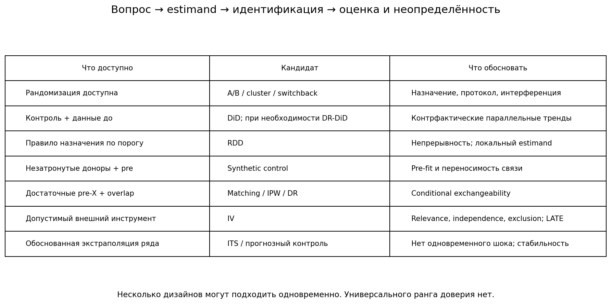

# Каузальная оценка

1. Определи воздействие, исход, популяцию и горизонт. Различай ATE, ATT, локальный эффект и ITT; эффект в заказах не равен прибыли.
2. Рассмотри осуществимый рандомизированный дизайн, включая кластеры и encouragement. Рандомизация даёт баланс в распределении, а не точное равенство конкретных групп; интерференция, attrition и нарушение протокола требуют отдельного решения. Этический запрет нельзя обходить рандомизацией.
3. Если воздействие уже произошло, сравни подходящие способы идентификации. Они могут отвечать на разные вопросы; универсальной лестницы доверия нет.

| Дизайн | Что необходимо обосновать |
|---|---|
| DiD | Незатронутый контроль и pre-периоды; параллельные **контрфактические** тренды, отсутствие anticipation. При staggered adoption и неоднородных эффектах выбирай group-time ATT и явную агрегацию; TWFE не всегда оценивает нужный средний эффект. |
| RDD | Правило назначения по порогу, непрерывность потенциальных исходов, отсутствие иных изменений в том же пороге. Локальный эффект; при дискретном score и малом числе значений обычная непрерывная асимптотика сомнительна. |
| Synthetic control | Один/несколько treated-юнитов, достаточно pre-периодов, подходящие незатронутые доноры и переносимость pre-связи на post. Без доноров метод неприменим. |
| ITS / прогнозный контроль | Обоснованная экстраполяция динамики и отсутствие одновременного шока; для контроля — незатронутые ряды со стабильной связью. |
| Matching / IPW / DR | Условная независимость потенциальных исходов и назначения при достаточных pre-X; overlap. Баланс наблюдаемого не доказывает отсутствие скрытых причин. Отсечение меняет популяцию. |
| IV | Relevance, independence, exclusion; monotonicity для LATE. F первого этапа — диагностика, не универсальная гарантия; учитывай слабые инструменты в inference. |

**Оценка и неопределённость.** Единица независимости определяется дизайном: панель, кластерное назначение и общие шоки требуют подходящих стандартных ошибок. Обычный bootstrap пар с повторяющимся контролем необоснован. У DR правильность одной nuisance-модели даёт устойчивость точечной оценки при остальных допущениях; доверительный интервал требует дополнительных условий регулярности. DML — способ оценки, а не самостоятельная идентификация; PLR при неоднородном эффекте обычно оценивает overlap-взвешенную величину, не ATE.

**Проверки.** Выбирай placebo-исход, дату и подгруппу только при каузальном обосновании нулевого эффекта. Pretrend-тест с большим p-value не доказывает параллельность; показывай совместную неопределённость и мощность. Перестановка observational treatment — проверка процедуры, а не автоматический p-value первоначального эффекта. Sensitivity (Rosenbaum, E-value, Oster) требует указать модель отклонений, шкалу и ограничения; универсальных порогов надёжности нет.

**Отчёт.** Укажи estimand, допущения, дизайн интервала, диагностики и альтернативные объяснения. Не превращай placebo-эффект в поправку к CI без модели смещения. Если идентификация не обоснована, сообщи это и перечисли недостающие данные.

- [DiD, RDD, synthetic control](../../course/modules/M6/lesson-6.3.md)
- [Matching, IPW, IV, DML](../../course/modules/M6/lesson-6.4.md)
- [Sensitivity и выбор дизайна](../../course/modules/M6/lesson-6.5.md)
- [Проверяемые симуляции](../../course/modules/M6/practice/practice_6_5.py)
