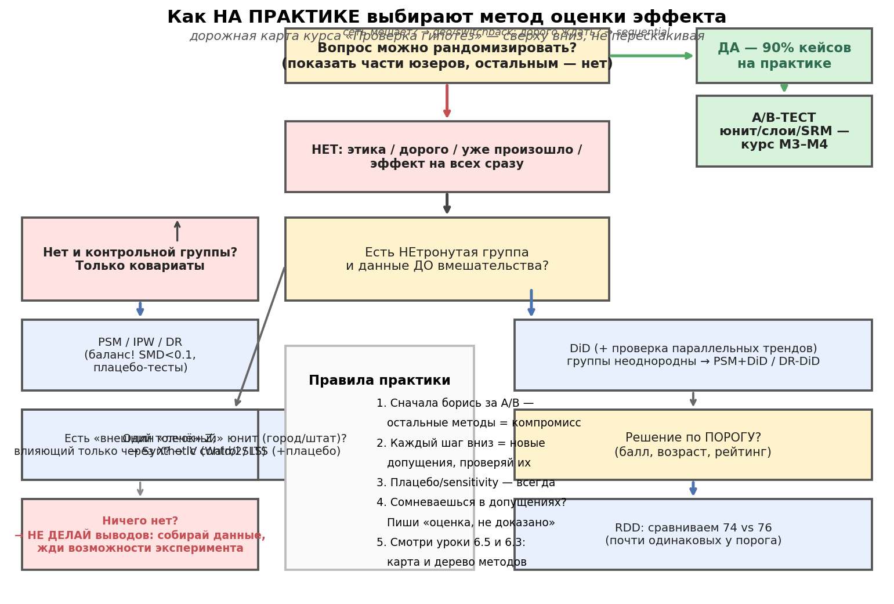

# Каузальная оценка без эксперимента

## Дорожная карта (сверху вниз, не перескакивая)

1. **Можно рандомизировать?** (даже частично: encouragement/geo/switchback) → 90% практических кейсов решаются экспериментом — борись за него
2. **Есть нетронутая группа + данные до?** → **DiD** (+ event study для параллельных трендов; группы неоднородны → PSM+DiD / DR-DiD; staggered → Callaway&Sant'Anna, TWFE врёт)
3. **Решение по порогу?** (балл/возраст/рейтинг) → **RDD** (сравниваем 74 vs 76; проверки: плотность у порога, плацебо-пороги)
4. **Один лечёный юнит?** → **synthetic control / ITS** (+ плацебо-юниты)
5. **Только ковариаты?** → **PSM/IPW/DR** (баланс SMD<0.1 после матчинга, Love plot; критично: только pre-treatment ковариаты!)
6. **Есть внешний инструмент Z?** (влияет на X, не на Y напрямую) → **IV** (Wald/2SLS; слабый инструмент F<10 опасен)
7. **Ничего нет?** → НЕ делать выводов; собирать данные/жди эксперимента

## Проверки доверия (обязательны, не опциональны)
- **Плацебо**: подставь ложный исход/время/подгруппу — эффект должен исчезнуть
- **Pretrends**: event study до вмешательства — нули (но pre-test ≠ доказательство)
- **Sensitivity**: насколько сильный скрытый конфаундер убьёт вывод (гамма Розенбаума, E-value)
- **Ошибка III рода**: отвечаешь ли на вопрос бизнеса, или прокси-метрика + Гудхарт?

## Формулировки для отчёта
- «оценка при допущениях X» вместо «эффект доказан»
- допущения перечислены явно + что ломается, если они неверны
- иерархия честности: рандомизация > квази > корректировки

## Углубление
- `../../course/content/M6/lesson-6.5.md` — дерево методов + sensitivity
- `../../course/content/M6/lesson-6.3.md` — DiD/RDD/SC + DiD+PSM (DR-демо)
- `../../course/content/M6/lesson-6.4.md` — PSM/IPW/IV/DML
- Практики: `../../course/content/M6/practice_6_3.py` (DR-лестница к истине), `practice_6_5.py` (плацебо, method_tree)
